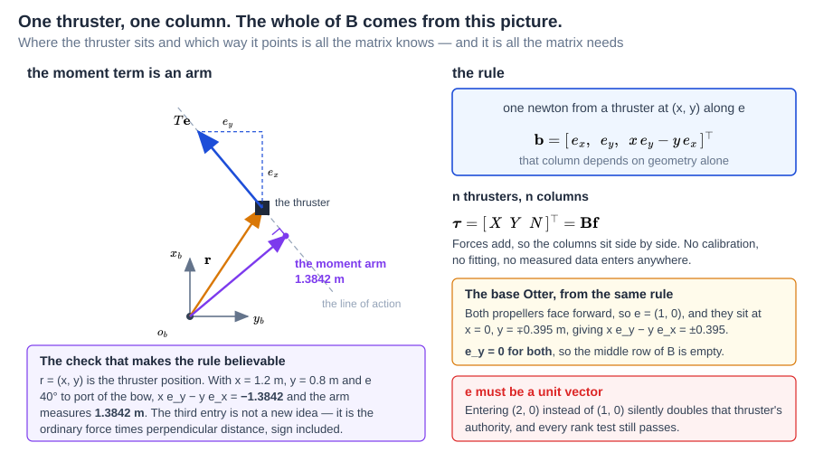
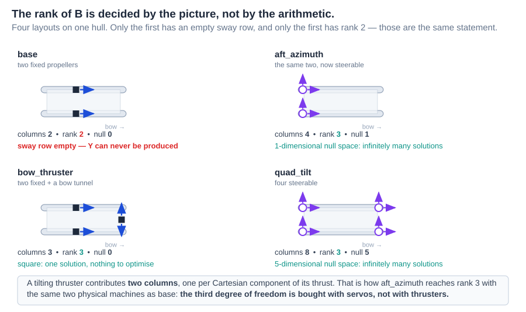
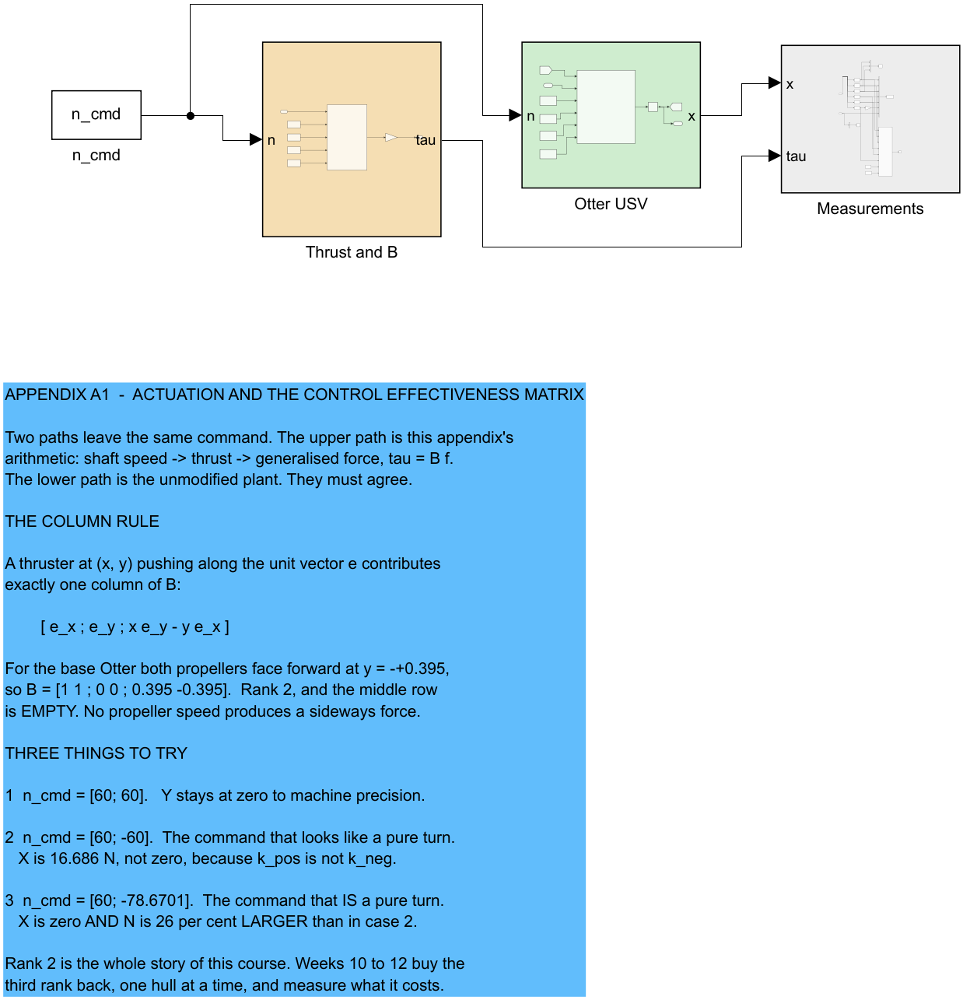
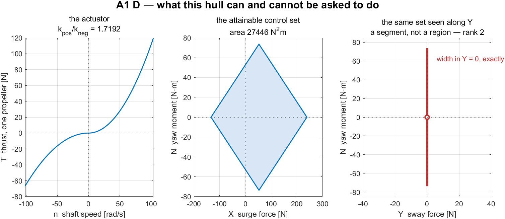
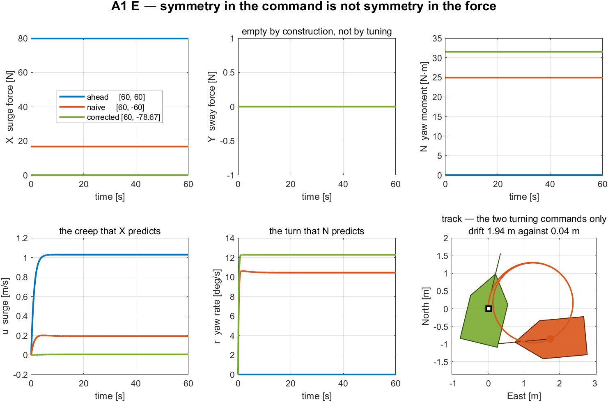
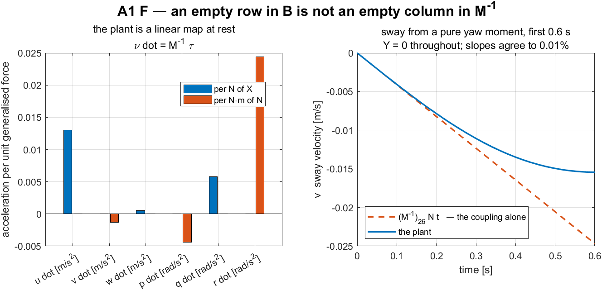

# Appendix A1 · Actuation and the Control Effectiveness Matrix

> [!important] Reference material — read this first
> <span style="font-size:0.88em">The five courses below are **taught by the instructor of this course** and are the assumed background for it. They run from the fundamentals down to the graduate material, so start wherever the gap is. Every frame, symbol and derivation used here is developed in them at length; anyone whose prerequisites are thin should work through them first, then return.</span>
>
> | # | Course | Level | Lang. | Video | Slides and code |
> |---|---|---|---|---|---|
> | 1 | **Control Engineering** (제어공학) — the foundation: transfer functions, feedback, stability, root locus, PID | undergraduate | KO | [playlist](https://youtube.com/playlist?list=PLFaUxNRM4BvJMpF9HZS-Mp8tDv9dTdglk) | [drive](https://drive.google.com/drive/folders/1TNIPDNtS_Iy8li-olka5WJslSXDYf0aT) |
> | 2 | **Control System Design** (제어시스템설계) — design rather than analysis: specifications, loop shaping, discrete implementation | undergraduate | KO | [playlist](https://youtube.com/playlist?list=PLFaUxNRM4BvIGroZ5rgn7x08F7C79d9WZ) | [drive](https://drive.google.com/drive/folders/11m5Xxl_PHJvxgHghLSP-jhCpmRpbvoXh) |
> | 3 | **Advanced Control Engineering** (제어공학특론) — reference frames, the 6-DOF equation of motion, rotation matrices and Euler angles, linearisation and trim, vehicle control design | graduate | EN | [playlist](https://youtube.com/playlist?list=PLFaUxNRM4BvJmvF2ljx4KM5dj1P5jEcw0) | [drive](https://drive.google.com/drive/folders/1GUxbbONl916lNd0ggnFnXrNwNkd13-2-) |
> | 4 | **Sensor Signal Processing and Fusion** (센서신호처리 및 융합) — sensor models, noise, estimation and multi-sensor fusion | graduate | EN | [playlist](https://youtube.com/playlist?list=PLFaUxNRM4BvK-aP2Gdoyp5-AWvMn7Fo8E) | [drive](https://drive.google.com/drive/folders/1MEVJP7TzMcm8w6TZwUjhWJtL34WeNY3u) |
> | 5 | **Capstone Design** (캡스톤디자인) — a vehicle project carried end to end | undergraduate | KO | [playlist](https://youtube.com/playlist?list=PLFaUxNRM4BvLu7L0pDoLzDXTv8mm6rCmj) | [drive](https://drive.google.com/drive/folders/1haIQejlJfrdhtOuof-MpffR9ydVscXZS) |
>
> <span style="font-size:0.88em">**Not fluent in MATLAB or Simulink yet? Do these before Part 2.** Every laboratory in this course is Simulink, and the Onramp courses are free and take a few hours each.</span>
>
> | Tool | Where to start |
> |---|---|
> | MATLAB | [MATLAB Onramp](https://matlabacademy.mathworks.com/kr/details/matlab-onramp/gettingstarted) · [Core MATLAB Skills](https://matlabacademy.mathworks.com/details/core-matlab-skills/lpmlcms) |
> | Simulink | [Simulink Onramp](https://matlabacademy.mathworks.com/kr/details/simulink-onramp/simulink) · instructor's Simulink lectures [part 1](https://youtu.be/a-afHg_fSaU) · [part 2](https://youtu.be/070Yn0Hw5a0) |


- **Course**: USV Guidance, Navigation and Control (Graduate)
- **Department**: Autonomous Vehicle System Engineering, Chungnam National University
- **This appendix**: ① one rule that produces $\mathbf{B}$ for any thruster layout ② the attainable control set and what actuation rank costs ③ the command that looks like a pure turn and is not, and the one that is

> [!important] When to read this
> - This appendix is **optional for Weeks 2 and 3**. Those weeks need only two results from it, and both are quoted where they are used: the vessel can produce $X \in [-133.42,\ 239.36]$ N, and its yaw moment is $N = y_{\text{pont}}(T_1 - T_2)$.
> - It becomes **required before Week 5**, where the allocation problem stops having an obvious answer, and before Weeks 9 to 11, where the thruster layout changes three times.
> - Prerequisites: Week 1 — the twelve states, $T = k\,n|n|$ with $k_{\text{pos}} \neq k_{\text{neg}}$, and the observation that $Y \equiv 0$. Here that observation becomes a theorem.

---

## Learning Outcomes

Upon completion of this week, the learner is able to:

1. Construct the control effectiveness matrix $\mathbf{B}$ of an arbitrary planar thruster layout from the position and direction of each thruster, without consulting a reference.
2. State the rank of $\mathbf{B}$ for a given layout and name the degree of freedom that a rank deficiency removes.
3. Explain why a tilting thruster contributes two columns rather than one, and why that choice makes $\boldsymbol{\tau} = \mathbf{B}\mathbf{f}$ linear.
4. Compute and plot the attainable control set of a layout, and read from it the limits a controller will later have to respect.
5. Derive the propeller-speed pair that produces a yaw moment with zero net surge force, and verify it against the plant.
6. Distinguish a zero **row** of $\mathbf{B}$ from a zero **column** of $\mathbf{M}^{-1}$, and give the measured consequence of each.

## Prerequisites and Setup

| Item | Requirement |
|---|---|
| MATLAB | R2024b, with Simulink |
| Toolboxes | none beyond Simulink for this week |
| MSS | `Tools/MSS`, added by the setup script |
| Course folder | `GradCourse/lectures/A1_simulink` |
| Expected duration | 60 min theory, 60 min laboratory |

---

# Part 1 · Theory

### Where this appendix goes

Seven sections, all of them consequences of **one rule** stated in A1-2. Read that rule carefully and the rest follows.

| | Question | Sections |
|---|---|---|
| 1 | **Why does anything sit between a controller and a propeller?** | A1-1 |
| 2 | **The column rule.** One thruster at $(x,y)$ pushing along $\mathbf{e}$ contributes exactly one column of $\mathbf{B}$ | A1-2 |
| 3 | **What the rule settles before any arithmetic.** The rank says which demands are reachable; a tilting thruster contributes two columns, not one | A1-3, A1-4 |
| 4 | **Three results that surprise people.** A symmetric command is not a symmetric force; the reachable set is a polygon, not a box; an empty row of $\mathbf{B}$ is not an empty column of its inverse | A1-5 to A1-7 |

$$
\mathbf{b}_i = \big[\,e_x\ \ e_y\ \ x_i e_y - y_i e_x\,\big]^\top
$$

**Every $\mathbf{B}$ in this course is produced by that expression** — none is transcribed from another file. The Otter's sway row is empty because both propellers face forward and $e_y = 0$, not because someone decided it should be.

This appendix is a prerequisite for Week 5 and is referenced from Weeks 2, 3 and 4 wherever a demanded force has to become a shaft speed.

## A1-1. The problem this week solves

- Week 1 wrote the generalised force of the base Otter as a $3 \times 2$ matrix and moved on. That matrix was asserted. It has to be derived, for three reasons.

| Reason | Where it is felt |
|---|---|
| Weeks 9 to 11 change the thruster layout three times | a transcribed matrix would have to be re-derived and re-checked three times |
| This project already ships two mutually **negative** $\mathbf{B}$ matrices | a transcribed matrix cannot be told apart from its own sign error |
| Week 5 inverts $\mathbf{B}$ | an inverse is only as trustworthy as the matrix it inverts |

> [!caution] Two contradictory matrices exist in this repository
> `Lecture/_tools/otter4_B.m` and `otter_params.m` line 41 differ by an overall sign. Neither is imported into this course. Every $\mathbf{B}$ used from this week onward is produced by `_tools/otter_B.m` from the single rule of §A1-2, so a sign convention cannot enter twice.

## A1-2. The column rule

- Consider one thruster fixed to the hull at the point $\mathbf{r} = (x, y)$ in $\{b\}$, pushing along the unit vector $\mathbf{e} = (e_x, e_y)$, with scalar thrust $T$.
- Its contribution to the planar generalised force is the force itself and the moment of that force about the origin of $\{b\}$:

$$
\begin{aligned}
\begin{bmatrix} X \\ Y \end{bmatrix} &= T\begin{bmatrix} e_x \\ e_y \end{bmatrix}, \\[4pt]
N &= \left(\mathbf{r} \times T\mathbf{e}\right)_z = T\left(x\,e_y - y\,e_x\right).
\end{aligned}
$$

- Collecting the three:

$$
\boxed{\ \boldsymbol{\tau}_i = T_i
\begin{bmatrix}
e_{x} \\
e_{y} \\
x\,e_{y} - y\,e_{x}
\end{bmatrix}
\ }
$$

- The bracketed vector is the generalised force produced by **one newton** from that thruster. It is one column of $\mathbf{B}$, and it depends only on geometry.



**Reading the figure**

| Element | Meaning |
|---|---|
| grey axes | the body frame, origin $o_b$, with $x_b$ towards the bow and $y_b$ to starboard |
| orange arrow | the position vector $\mathbf{r} = (x, y)$ from $o_b$ to the thruster |
| black square | the thruster |
| blue arrow | its thrust $T\mathbf{e}$, and the two dashed segments are the components $e_x$ and $e_y$ |
| grey dashed line | the **line of action** — the thrust extended in both directions |
| violet arrow | the perpendicular from $o_b$ to that line, with the right-angle mark |

**What the figure says**

- **Meaning.** The first two entries of the column are just the force resolved into the body axes, and need no picture. The third entry is the one worth drawing, and the figure shows what it is.
- **The trend, in numbers.** With $x = 1.2$ m, $y = 0.8$ m and $\mathbf{e}$ pointing $40°$ to port of the bow, the rule gives $x e_y - y e_x = -1.3842$. The violet perpendicular, measured on the same drawing, is $1.3842$ m. **The two agree exactly**, which is the point of the figure.
- **The principle.** $x e_y - y e_x$ is the $z$ component of $\mathbf{r} \times \mathbf{e}$, and the magnitude of a cross product with a unit vector *is* the perpendicular distance to the line of action. So the third entry is nothing more exotic than the schoolroom "force times perpendicular distance" — written in a form that produces the **sign** automatically instead of leaving it to be argued about, which is where hand derivations of $\mathbf{B}$ usually go wrong.
- **What changes from thruster to thruster.** Only $\mathbf{r}$ and $\mathbf{e}$. No hydrodynamics, no calibration, no measured data enters the matrix anywhere — which is why $\mathbf{B}$ can be written down before the vessel exists.
- **The special case that produces the Otter.** Set $\mathbf{e} = (1,0)$ and $x = 0$: the arm collapses to $-y$, and the two propellers at $y = \mp 0.395$ m give $\pm 0.395$. The middle entry $e_y$ is zero for both, and **that empty row is the whole of §A1-3.**
- For $n$ thrusters the contributions add, because forces add:

$$
\boldsymbol{\tau} = \begin{bmatrix} X \\ Y \\ N \end{bmatrix}
= \underbrace{\begin{bmatrix} \mathbf{b}_1 & \mathbf{b}_2 & \cdots & \mathbf{b}_n \end{bmatrix}}_{\mathbf{B}}
\underbrace{\begin{bmatrix} T_1 \\ T_2 \\ \vdots \\ T_n \end{bmatrix}}_{\mathbf{f}}
= \mathbf{B}\,\mathbf{f}
$$

| Symbol | Quantity | Value / source |
|---|---|---|
| $\mathbf{r} = (x, y)$ | thruster position in $\{b\}$ | `otter_config`, field `pos` |
| $\mathbf{e}$ | unit thrust direction in $\{b\}$ | `otter_config`, field `dir` |
| $T_i$ | scalar thrust of thruster $i$ | $k\,n_i|n_i|$, Week 1 |
| $\mathbf{B}$ | control effectiveness matrix | `_tools/otter_B.m` |

> [!warning] $\mathbf{e}$ must be a unit vector
> The column rule assumes $\|\mathbf{e}\| = 1$. A direction entered as $(2, 0)$ instead of $(1, 0)$ silently doubles that thruster's authority and leaves every rank test passing. `otter_B.m` normalises before applying the rule; a hand derivation has no such protection.

### The base Otter


**Reading the figure**

| Element | Meaning |
|---|---|
| $x_b$, $y_b$ | the body axes, origin $o_b$ at midship on the centreline |
| blue rectangles | the two propellers, one per pontoon |
| orange arrows | their thrust, both along $+x_b$ |
| $\mp 0.395$ m | the moment arms, equal and opposite about the centreline |

- Both propellers face forward, so $\mathbf{e} = (1, 0)$ for each. They sit on the pontoons at $x = 0$, $y = \mp y_{\text{pont}}$ with $y_{\text{pont}} = 0.395$ m. The rule gives

$$
\mathbf{b}_1 = \begin{bmatrix} 1 \\ 0 \\ 0 \cdot 0 - (-0.395)\cdot 1 \end{bmatrix} = \begin{bmatrix} 1 \\ 0 \\ +0.395 \end{bmatrix},
\qquad
\mathbf{b}_2 = \begin{bmatrix} 1 \\ 0 \\ -0.395 \end{bmatrix},
$$

$$
\mathbf{B} =
\begin{bmatrix}
1 & 1 \\
0 & 0 \\
0.395 & -0.395
\end{bmatrix},
\qquad
\operatorname{rank}(\mathbf{B}) = 2 .
$$

- This is the matrix Week 1 asserted, now obtained from geometry alone.

## A1-3. What the rank means

- $\mathbf{B} \in \mathbb{R}^{3 \times n}$ maps thrust to generalised force. Its **column space** is exactly the set of $\boldsymbol{\tau}$ that any combination of thrusts can produce.

| $\operatorname{rank}(\mathbf{B})$ | Name | Consequence |
|---|---|---|
| 3 | fully actuated in the plane | every $\boldsymbol{\tau} \in \mathbb{R}^3$ is producible; direction and magnitude are independent |
| 2 | underactuated | one direction of $\mathbb{R}^3$ is unreachable; guidance must produce that motion indirectly |
| $< 2$ | degenerate | the vessel cannot be steered by these actuators alone |

- For the base Otter the unreachable direction is $\mathbf{Y}$. The middle row of $\mathbf{B}$ is identically zero, so

$$
Y = \mathbf{0}^{\!\top}\mathbf{f} = 0 \qquad \text{for every } \mathbf{f} \in \mathbb{R}^{2}.
$$

> [!important] A zero row is a theorem, not a measurement
> $Y = 0$ does not depend on the thrust, on the propeller curve, on saturation, or on any gain. It follows from the fact that both propellers point along $\mathbf{e} = (1,0)$, so neither has any component across the hull. No controller can be tuned to produce a sideways force, because there is nothing to tune.

- The pseudo-inverse does not rescue anything. Asking for one newton of pure sway gives

$$
\mathbf{B}^{\dagger}\begin{bmatrix} 0 \\ 1 \\ 0 \end{bmatrix} = \begin{bmatrix} 0 \\ 0 \end{bmatrix},
$$

- that is, the least-squares allocator correctly answers *do nothing*, because doing nothing is the closest reachable point to a request that lies outside the column space. Week 5 makes this precise.

## A1-4. Tilting thrusters and the extended thrust vector

- A thruster that can rotate has two unknowns, its thrust $T_i$ and its azimuth $\delta_i$, and it enters the moment through $\sin\delta_i$ and $\cos\delta_i$. Written that way the allocation problem is **not** linear in the unknowns.
- Writing the same thrust in Cartesian components removes the trigonometry:

$$
\mathbf{f}_i = \begin{bmatrix} f_{ix} \\ f_{iy} \end{bmatrix}
= \begin{bmatrix} T_i \cos\delta_i \\ T_i \sin\delta_i \end{bmatrix},
\qquad
T_i = \sqrt{f_{ix}^2 + f_{iy}^2}, \qquad
\delta_i = \operatorname{atan2}(f_{iy},\, f_{ix}).
$$

- The thruster then contributes **two** columns, the $\mathbf{e} = (1,0)$ column and the $\mathbf{e} = (0,1)$ column of the same location:

$$
\boldsymbol{\tau}_i =
\begin{bmatrix}
1 & 0 \\
0 & 1 \\
-y & x
\end{bmatrix}
\begin{bmatrix} f_{ix} \\ f_{iy} \end{bmatrix}.
$$

- This is the **extended thrust vector** of Fossen (2011) §12.3.4. The azimuth is recovered after the allocation rather than solved for during it.
- The cost is that the two components of one machine are not independent: $\sqrt{f_{ix}^2 + f_{iy}^2} \le T_{\max}$ is a circular constraint, and $\delta_i$ is subject to a mechanical limit and a rate limit. Week 5 handles both; this week only records that the linear structure has been bought and what it was bought with.

### The four layouts of this course

- All four share the same hull. Only the actuator model changes, so any later comparison measures the actuation and nothing else.

| Configuration | Thrusters | Columns of $\mathbf{B}$ | Rank | Null-space dimension | Week |
|---|---|---|---|---|---|
| `base` | 2 fixed | 2 | 2 | 0 | 1–8 |
| `aft_azimuth` | 2 tilting | 4 | 3 | 1 | 9 |
| `bow_thruster` | 3 fixed | 3 | 3 | 0 | 10 |
| `quad_tilt` | 4 tilting | 8 | 3 | 5 | 11 |



**Reading the figure**

| Element | Meaning |
|---|---|
| grey outline | the hull, drawn identically in all four; the two pontoons are at $y = \mp 0.395$ m |
| black square with one blue arrow | a **fixed** thruster — one direction, therefore one column |
| black square with two blue arrows | the **tunnel** thruster, fixed across the hull, $\mathbf{e} = (0,1)$ |
| violet circle with two arrows | a **tilting** thruster — two directions, therefore two columns |
| the numbers under each hull | columns, rank and null-space dimension, as printed by section C |

**What the figure says**

- **Meaning.** Four actuator layouts on one hull, drawn to the same scale from the coordinates in `otter_config.m`. The question each panel answers is: how many independent things can this arrangement ask the vessel to do?
- **The trend, in numbers.** Thruster count goes $2, 2, 3, 4$ and column count goes $2, 4, 3, 8$ — **the two do not track each other**, because a tilting machine contributes two columns and a fixed one contributes one. Rank goes $2, 3, 3, 3$: every layout but the first can produce all three planar generalised forces.
- **The principle, visible in the first panel.** Both `base` arrows point the same way — along $x_b$. No sum of two parallel vectors has a component across the hull, so $Y$ is unreachable **for reasons of geometry, not of size**. A bigger propeller does not help; a differently pointed one does.
- **What separates `aft_azimuth` from `base`.** The same two machines, moved aft and made steerable. That single change takes the rank from 2 to 3, which is the strongest argument in this appendix: **actuation authority is a property of directions, not of thrust.**
- **What separates the last two.** `bow_thruster` is square — three columns, rank 3 — so the allocation has exactly one answer and there is nothing to choose. `quad_tilt` has eight columns for three demands, so it has a five-dimensional set of answers and something must decide between them. That decision is Week 5.

- Two observations follow immediately, and both matter later.
  - `aft_azimuth` reaches rank 3 with **the same two physical machines** as `base`. The third degree of freedom is bought with servos, not with thrusters.
  - `bow_thruster` has a **square** $\mathbf{B}$ with rank 3, so the allocation has a unique solution and there is nothing to optimise. `quad_tilt` has a five-dimensional null space, so it has infinitely many solutions and Week 5's machinery finally has something to do.

## A1-5. Symmetry in the command is not symmetry in the force

- The command $n = [n_1, -n_1]$ looks like a pure turn. It is not, because the propeller curve is not odd:

$$
X = k_{\text{pos}}\,n_1^2 + k_{\text{neg}}\,(-n_1)|-n_1| = \left(k_{\text{pos}} - k_{\text{neg}}\right) n_1^2 \; \ne \; 0 .
$$

- With $n_1 = 60$ rad/s this leaves $X\6.686$ N, and the vessel creeps forward while it turns.
- Requiring $X = 0$ instead of assuming it gives the pair that does produce a pure turn:

$$
k_{\text{pos}}\,n_1^2 = -k_{\text{neg}}\,n_2|n_2|
\quad\Longrightarrow\quad
n_2 = -n_1\sqrt{\frac{k_{\text{pos}}}{k_{\text{neg}}}}
= -60\sqrt{1.7192} = -78.6701\ \text{rad/s}.
$$

| Symbol | Quantity | Value / source |
|---|---|---|
| $k_{\text{pos}}$ | forward bollard coefficient, one propeller | $0.011080$, `otter.m` |
| $k_{\text{neg}}$ | reverse bollard coefficient | $0.006445$, `otter.m` |
| $\sqrt{k_{\text{pos}}/k_{\text{neg}}}$ | correction factor on the reverse shaft | $1.3112$ | 
| $n_2$ | corrected reverse shaft speed for $n_1 = 60$ | $-78.6701$ rad/s |

- The corrected command is not merely cleaner. It also produces **more** yaw moment, because both propellers now push with the full $39.888$ N instead of the reverse propeller contributing only $-23.202$ N:

$$
N = y_{\text{pont}}\left(T_1 - T_2\right)
= 0.395\left(39.888 - (-39.888)\right) = 31.512\ \text{N}\!\cdot\!\text{m},
$$

- against $24.921$ N·m for the naive command, an increase of $26.4\%$.

> [!tip] The correction is free
> Removing the unwanted surge force and increasing the yaw moment are the same act. Nothing is traded away except reverse shaft speed, and $-78.67$ rad/s is well inside the limit $n_{\min} = -101.74$ rad/s. A layout in which the correction did not fit inside the saturation box would be a layout with a genuine trade-off; this one is not.

## A1-6. The attainable control set

- The reachable set of generalised forces is the image of the shaft-speed box under the propeller curve followed by $\mathbf{B}$:

$$
\mathcal{T} = \left\{\, \mathbf{B}\,\mathbf{f}(\mathbf{n}) \;:\; n_i \in [n_{\min},\, n_{\max}] \,\right\} \subset \mathbb{R}^3 .
$$

- Three properties of $\mathcal{T}$ are worth stating before any controller is designed.

| Property | For the base Otter |
|---|---|
| dimension | 2, not 3 — it is a flat region lying in the plane $Y = 0$ |
| symmetry | none. $X \in [-133.42,\ 239.36]$ N, a ratio of $1.794$ |
| coupling | $X$ and $N$ are not independent. Demanding the largest $|N|$ fixes $X$ |

- The fore-aft ratio is **not** $k_{\text{pos}}/k_{\text{neg}} = 1.719$. The saturation limits are asymmetric as well, $n_{\max} = 103.93$ against $n_{\min} = -101.74$, and the two effects multiply:

$$
\frac{X_{\max}}{|X_{\min}|} = \frac{k_{\text{pos}}\,n_{\max}^2}{k_{\text{neg}}\,n_{\min}^2}
= 1.7192 \times \left(\frac{103.93}{101.74}\right)^{2} = 1.794 .
$$

> [!note] Why the set matters
> Every controller designed from Week 2 onward produces a demanded $\boldsymbol{\tau}$. If that demand lies outside $\mathcal{T}$, the actuators saturate and the loop no longer behaves as designed — this is the mechanism behind the integrator windup of Week 2. Knowing the shape of $\mathcal{T}$ in advance is what makes a saturation event diagnosable rather than mysterious.

## A1-7. An empty row in B is not an empty column in M⁻¹

- Section 2-3 proved $Y \equiv 0$. It is tempting to conclude that the vessel cannot move sideways. That conclusion is wrong, and the reason is instructive.
- At rest the Coriolis and damping terms both vanish, so the plant reduces to a linear map:

$$
\dot{\boldsymbol{\nu}} = \mathbf{M}^{-1}\boldsymbol{\tau}, \qquad \boldsymbol{\nu} = \mathbf{0}.
$$

- $\mathbf{M}$ is **not diagonal**. The payload places the centre of gravity at $x_g = 0.153$ m rather than at the origin of $\{b\}$, and transferring the rigid-body inertia from the CG to the origin fills in the sway-yaw entry:

$$
M_{26} = M_{62} = (m + m_p)\,x_g = 80 \times 0.153 = 12.25\ \text{kg}\!\cdot\!\text{m}.
$$

- A pure yaw moment therefore produces a sway **acceleration**, with no sway force anywhere in the problem:

$$
\dot v = \left(\mathbf{M}^{-1}\right)_{26} N = -1.3046\times 10^{-3}\ \frac{\text{m/s}^2}{\text{N}\!\cdot\!\text{m}} .
$$

| Statement | Mechanism | Regime |
|---|---|---|
| $Y \equiv 0$ | geometry — the row of $\mathbf{B}$ is empty | always |
| $\dot v \neq 0$ under pure $N$ | mass coupling $M_{26}$ | the first instants, while $\dot{\boldsymbol{\nu}} \neq 0$ |
| $v \neq 0$ in a steady turn | Coriolis balanced by cross-flow drag | the steady state, where $\mathbf{M}$ leaves the balance entirely |

- Week 1 attributed the sway velocity of a turn to the Coriolis term. For the **steady** value that is correct: setting $\dot{\boldsymbol{\nu}} = \mathbf{0}$ removes $\mathbf{M}$ from the equation. This section is about the transient, and both mechanisms are real.

> [!important] Actuation rank and controllability are different questions
> A rank-2 $\mathbf{B}$ says the vessel cannot be *pushed* sideways. It does not say the vessel cannot *reach* a point to its side — it plainly can, by turning and driving. What underactuation costs is the ability to do so **without changing heading**, and that is exactly what Week 7 needs for dynamic positioning and cannot have from this hull.

---

# Part 2 · Laboratory

## A. Setting up and running (10 min)

```matlab
cd GradCourse/lectures/A1_simulink
A1_0_setup
```

Expected output:

```
  A1 setup complete
    configuration   base, 2 thrusters, 2 columns, rank(B) = 2
    B  = [ 1.000  1.000 ;  0.000  0.000 ;  0.395 -0.395]
    sway row        max |B(2,:)| = 0.0e+00   -> Y is unreachable
    n_cmd           [60 ; -60] rad/s
    simulation      60 s at h = 0.02 s
```

- `A1_0_setup.m` is **the only file to edit in this appendix**. Note that `B_alloc` is not typed in; it is `cfg.B`, produced by `otter_B` from the column rule.
- To restore a model that has been broken: `A1_1_build_actuation`.

**The files of this appendix, in the order the sections use them**

| Order | File | Section | What it produces |
|---|---|---|---|
| 0 | `A1_0_setup.m` | A | the base workspace, so the model can be run from Simulink |
| 1 | `A1_1_build_actuation.m` | B | `A1_actuation.slx` and `img/A1_actuation.png` |
| C | `A1_C_four_layouts.m` | C | the rank table and the pseudo-inverse check — no simulation |
| D | `A1_D_attainable_set.m` | D | `img/A1_result_set.png` |
| E | `A1_E_command_that_turns.m` | E | `img/A1_result_turn.png` |
| F | `A1_F_sway_without_force.m` | F | `img/A1_result_coupling.png` |

- Each section is one script. Running a section leaves exactly the numbers and the one figure that section discusses, so a class can work through the appendix a page at a time.
- Sections C to F call `A1_1_build_actuation` themselves if the model is missing, so any one of them can be run first.

## B. Reading the model (15 min)

> [!note] To produce this figure
> `A1_1_build_actuation` writes `A1_simulink/img/A1_actuation.png` at the end of the build. The diagram belongs to the builder and to nothing else, so it changes when the model changes and not when a gain changes.



**Reading the figure**

| Element | Meaning |
|---|---|
| `n_cmd` (white) | the constant propeller command $[n_1; n_2]$ in rad/s |
| `Thrust and B` (sand) | inside: $T = k\,n\lvert n\rvert$ with saturation applied to $n$, then $\boldsymbol{\tau} = \mathbf{B}\mathbf{f}$ |
| `Otter USV` (green) | `otter.m`, called unchanged, fed the **same** command |
| `Measurements` (grey) | selectors, scope, workspace log and live view |

- The diagram has **two paths from one command**. The upper path is this appendix's arithmetic; the lower path is the unmodified plant. The colour code separates them: sand is actuation and allocation, green is the motion model.
- The two paths are never wired together. They are compared by their results, which is the only comparison that can fail.
- Opening `Thrust and B` shows two blocks: the thruster model, and a Gain block in matrix mode whose value is `B_alloc`, produced by `otter_B` from the column rule of §A1-2. Nothing is transcribed.

> [!warning] Saturate the shaft speed, not the thrust
> The thruster block clips $n$ before applying the thrust curve. Clipping $T$ instead would place the reverse limit at a force the propeller can never produce, because $k_{\text{pos}}$ and $k_{\text{neg}}$ differ. The order of the two operations is not interchangeable.

## C. The four layouts (15 min)

```matlab
A1_C_four_layouts
```

The table is produced from `otter_config` alone; no simulation is involved.

| Configuration | Thrusters | Columns | Rank | Null | $\max\lvert B(2,:)\rvert$ |
|---|---|---|---|---|---|
| `base` | 2 | 2 | 2 | 0 | $0.000$ |
| `aft_azimuth` | 2 | 4 | 3 | 1 | $1.000$ |
| `bow_thruster` | 3 | 3 | 3 | 0 | $1.000$ |
| `quad_tilt` | 4 | 8 | 3 | 5 | $1.000$ |

- Only `base` has an empty sway row, and only `base` has rank 2. These are the same statement.
- The pseudo-inverse check, printed by the same script:

```
  pinv(B) * [0 1 0]' = [0.000e+00 ; 0.000e+00]  -> no thrust asked for
  B * that            = [0.000e+00 ; 0.000e+00 ; 0.000e+00]
```

- The least-squares allocator asks for no thrust at all when it is asked for pure sway. That is the correct answer to an impossible request, and it is worth seeing before Week 5 assigns it a name.

## D. The attainable control set (15 min)

```matlab
A1_D_attainable_set
```

> [!note] To produce this figure
> `A1_D_attainable_set.m` writes `A1_simulink/img/A1_result_set.png`. The script sweeps a $121 \times 121$ grid of the shaft-speed box; it runs no simulation, because the attainable set is a property of the actuator and the geometry alone.



**Reading the figure**

| Element | Meaning |
|---|---|
| left panel | the propeller curve, with the slope change at $n = 0$ where $k$ switches |
| centre panel | the set of $(X, N)$ reachable from the shaft-speed box |
| right panel | the same set viewed along the $Y$ axis — a segment of zero width, because rank is 2 |

Measured over a $121 \times 121$ grid of the shaft-speed box:

| Quantity | Value |
|---|---|
| $X_{\max}$ | $239.36$ N |
| $X_{\min}$ | $-133.42$ N |
| $\max \lvert N\rvert$ | $73.62$ N·m |
| ahead / astern ratio | $1.7941$ |
| convex hull area | $27\,446$ N²·m |
| $\max \lvert Y\rvert$ over the whole set | $0$, exactly |

- The set is a quadrilateral with curved edges, not a box. The corners are the four combinations of saturated shaft speeds, and the edges are traced by holding one propeller at a limit and sweeping the other.

**What the figure says**

- **Meaning.** The left panel is the actuator on its own: one propeller, shaft speed in and thrust out. The centre panel is every generalised force the two propellers can produce between them. The right panel is the same set of forces seen end-on, along the axis the hull cannot use.
- **Trend, in numbers.** The propeller curve is flat near the origin and steepens away from it, because $T = k\,n\lvert n\rvert$ is quadratic: doubling the shaft speed from $50$ to $100$ rad/s multiplies the thrust by four, from $27.70$ N to $110.80$ N. The two halves of the curve are not mirror images — at the two saturation limits one propeller gives $+119.68$ N ahead but only $-66.71$ N astern, in the ratio $k_{\text{pos}}/k_{\text{neg}} = 1.7192$. The centre panel is exactly twice that: $239.36$ N ahead against $-133.42$ N astern, a ratio of $1.7941$.
- **Principle.** The set is the image of the square $[n_{\min}, n_{\max}]^2$ under the thrust curve and then under $\mathbf{B}$. **A square goes in and a diamond comes out**, because $\mathbf{B}$ maps two shaft speeds onto two useful axes at $45°$ to them: $X$ is the sum of the thrusts and $N$ is $y_p$ times their difference. The corners of the diamond are the four saturated corners of the square.
- **Where the difference between the panels comes from.** The centre panel has area; the right panel has none. That is not a plotting choice. The middle row of $\mathbf{B}$ is exactly zero, so **the sway coordinate of every attainable point is exactly zero**, and the attainable set is a flat sheet in $(X, Y, N)$ space rather than a solid. Every controller written in the rest of this course must choose its demand from inside this sheet.
- **What changes with the situation.** The diamond is fixed for this hull: it does not grow when the controller is tuned harder, and it does not depend on speed or heading. It changes only when the actuator changes — which is exactly what the three hull variants later in the course do, and the area printed here, $27\,446$ N²·m, is the number they are compared against.

## E. The command that actually turns (20 min)

```matlab
A1_E_command_that_turns
```

> [!note] To produce this figure
> `A1_E_command_that_turns.m` runs `A1_actuation.slx` three times through `run_sim`, prints both tables below, and writes `A1_simulink/img/A1_result_turn.png`.

Three commands are applied to the same hull for 60 s each.

| Command | $X$ [N] | $N$ [N·m] | $u$ [m/s] | $v$ [m/s] | $r$ [deg/s] |
|---|---|---|---|---|---|
| ahead, $[60,\ 60]$ | $79.776$ | $0.000$ | $1.0286$ | $0.0000$ | $0.0000$ |
| naive, $[60,\ -60]$ | $16.686$ | $24.921$ | $0.1932$ | $-0.0713$ | $10.4369$ |
| corrected, $[60,\ -78.67]$ | $-7.1\times10^{-15}$ | $31.512$ | $0.0062$ | $-0.0024$ | $12.2726$ |



**Reading the figure**

| Element | Meaning |
|---|---|
| top left | the surge force each command produces; the corrected one sits on zero |
| top centre | the sway force, plotted on a $\pm 1$ N axis so that machine dust is not mistaken for a signal |
| top right | the yaw moment; the corrected command produces $26.4\%$ more than the naive one |
| bottom left | the surge velocity that $X$ predicts — the creep the correction removes |
| bottom centre | the yaw rate that $N$ predicts |
| bottom right | the two turning tracks, each with one hull silhouette at its final pose and a filled dot at its final position; the open square is the start point |

- The bottom-right panel is the result stated as a distance. After 60 s:

| Command | drift from the start point | steady $r$ |
|---|---|---|
| naive, $[60,\ -60]$ | $1.9376$ m | $10.4369$ °/s |
| corrected, $[60,\ -78.67]$ | $0.0435$ m | $12.2726$ °/s |

- A factor of $44.6$ in position error and $18\%$ more yaw rate, from changing one number in the command.

**What the figure says**

- **Meaning.** The top row is what the command asks the water for; the bottom row is what the vessel does about it. The three colours are three commands applied to one unchanged hull, so every difference between the curves is a difference between the commands and nothing else.
- **Trend, in numbers.** All six panels are flat after the first few seconds: a constant shaft speed is a constant force, and the vessel reaches a steady state. The blue command, both propellers ahead, produces $79.776$ N of surge and no moment at all, and the vessel settles at $1.0286$ m/s in a straight line. The orange command, $[60, -60]$, produces $24.921$ N·m of moment — but also **$16.686$ N of surge force that nobody asked for**, and the vessel creeps forward at $0.1932$ m/s while it turns. The green command, $[60, -78.67]$, produces $31.512$ N·m and a surge force of $-7\times10^{-15}$ N, which is zero to machine precision.
- **Principle.** $X = k_{\text{pos}} n_1^2 + k_{\text{neg}} n_2\lvert n_2\rvert$. Setting $n_2 = -n_1$ cancels the two shaft speeds, not the two thrusts, because the propeller is not equally effective in reverse. The cancellation that matters is $k_{\text{pos}} n_1^2 = k_{\text{neg}} n_2^2$, which gives $n_2 = -n_1\sqrt{k_{\text{pos}}/k_{\text{neg}}} = -78.6701$ rad/s.
- **How the two turning commands differ.** The corrected command runs its reverse propeller $31\%$ faster, so its *reverse* thrust is larger and the *difference* of the two thrusts — which is the moment — grows by $26.4\%$. **Removing the unwanted force made the wanted moment bigger, not smaller.** The middle panel of the top row stays on zero for all three: no shaft speed produces sway, which is section D's diamond seen one command at a time.
- **What changes with the situation.** The bottom-right panel is where the difference becomes visible as a distance. The orange vessel spirals away and ends $1.9376$ m from where it started; the green vessel turns under itself and ends $0.0435$ m away, still on the start marker. The green track is smaller than the hull that traces it, which is what "turning on the spot" means in metres.

> [!note] Why the corrected creep is not exactly zero either
> The green vessel still settles at $u = 0.0062$ m/s. See the callout below: a rotating vessel has Coriolis terms that a stationary one does not, and those terms do not vanish when $X$ does.

> [!note] Why the corrected creep is not exactly zero
> $X = 0$ holds exactly, yet $u$ settles at $6.2$ mm/s rather than at zero. The surge equation of a **rotating** vessel is not $M_{11}\dot u = X + X_u u$; it also contains the Coriolis term $m\,v\,r$ and a cross-flow contribution, and neither vanishes when $r \neq 0$. The residue is the size of those terms, not an error in the derivation.

## F. Sway without a sway force (15 min)

```matlab
A1_F_sway_without_force
```

> [!note] To produce this figure
> `A1_F_sway_without_force.m` calls `otter.m` directly at $\boldsymbol{\nu} = \mathbf{0}$ for the table, runs `A1_actuation.slx` once for the right-hand panel, and writes `A1_simulink/img/A1_result_coupling.png`.

The table probes the plant at rest, where $\mathbf{C}(\boldsymbol{\nu})$ and the damping both vanish and the response is exactly $\mathbf{M}^{-1}\boldsymbol{\tau}$.

| Acceleration | per N of $X$ | per N·m of $N$ |
|---|---|---|
| $\dot u$ [m/s²] | $1.3036\times 10^{-2}$ | $-2.94\times 10^{-18}$ |
| $\dot v$ [m/s²] | $0$ | $-1.3046\times 10^{-3}$ |
| $\dot w$ [m/s²] | $5.2654\times 10^{-4}$ | $-1.19\times 10^{-19}$ |
| $\dot p$ [rad/s²] | $0$ | $-4.3946\times 10^{-3}$ |
| $\dot q$ [rad/s²] | $5.8027\times 10^{-3}$ | $-1.31\times 10^{-18}$ |
| $\dot r$ [rad/s²] | $0$ | $2.4391\times 10^{-2}$ |



**Reading the figure**

| Element | Meaning |
|---|---|
| left panel | the two measured columns of $\mathbf{M}^{-1}$, one per unit of $X$ and one per unit of $N$ |
| right panel, dashed | the coupling alone, $\left(\mathbf{M}^{-1}\right)_{26} N t$ |
| right panel, solid | the plant, over the first $0.6$ s |

- The two curves leave the origin on the same slope, agreeing to $0.01\%$, and separate after roughly $0.15$ s as the Coriolis and cross-flow terms take hold. The agreement at $t = 0$ is the measurement; the separation afterwards is the rest of the physics arriving.
- Two effective inertias follow from the same probe and are used in later weeks:

| Quantity | Value | Note |
|---|---|---|
| $1/\left(\mathbf{M}^{-1}\right)_{11}$ | $76.71$ kg | effective surge mass, with heave and pitch free |
| $M_{11}$ | $85.50$ kg | the matrix entry, used by the first-order model of Week 2 |
| $1/\left(\mathbf{M}^{-1}\right)_{66}$ | $41.00$ kg·m² | effective yaw inertia, with sway free |
| $M_{66}$ | $42.65$ kg·m² | the matrix entry, used by the second-order model of Week 3 |

- The two pairs differ by $10\%$ and $4\%$ respectively. Week 3 uses $M_{66}$ and states the discrepancy rather than hiding it.

**What the figure says**

- **Meaning.** The left panel is a measurement of two columns of $\mathbf{M}^{-1}$: apply one newton of surge force, read six accelerations; apply one newton-metre of yaw moment, read six more. The right panel checks that measurement against the running model.
- **Trend, in numbers.** Under a pure surge force the vessel accelerates in surge, $1.3036 \times 10^{-2}$ m/s² per newton, and also in **heave and pitch**, $5.27\times10^{-4}$ and $5.80\times10^{-3}$, because the propellers push below the centre of gravity. Sway, roll and yaw are exactly zero. Under a pure yaw moment the vessel accelerates in yaw, $2.4391\times10^{-2}$ rad/s² per newton-metre, and also in **sway and roll**, $-1.3046\times10^{-3}$ and $-4.39\times10^{-3}$. Surge, heave and pitch are zero to within $3\times10^{-18}$, which is arithmetic noise and not physics.
- **Principle.** The two blocks of zeros are port–starboard symmetry: the Otter is a symmetric catamaran, so the longitudinal motions and the lateral motions do not mix. The non-zero entries within the lateral group are the coupling $M_{2,6} = 12.25$ kg·m, which is not zero because the payload sits $0.153$ m forward of the origin of $\{b\}$. **An empty row in $\mathbf{B}$ and an empty column in $\mathbf{M}^{-1}$ are different statements, and only the first one is true here.**
- **Why the two curves in the right panel separate.** They leave the origin together, agreeing to $0.01\%$, because at $t = 0$ the vessel is at rest and the only term acting is $\mathbf{M}^{-1}\boldsymbol{\tau}$. They part company after roughly $0.15$ s because by then $r$ is large enough that the Coriolis and cross-flow terms are no longer negligible, and those terms oppose the sway. The dashed line keeps going because it is arithmetic with no physics in it after the first instant.
- **What changes with the situation.** The sway velocity reaches only $-0.015$ m/s and then turns back; the vessel does not slide away sideways. This is the honest reading of the coupling: it produces a **transient** sideways motion in the first fraction of a second of a turn, and not a means of translating sideways. Anything that needs a sustained sway force still needs a thruster that can produce one, which is the subject of the hull variants later in the course.

---

# Summary

## Summary

| Step | What was done | How it was verified |
|---|---|---|
| 1 | Derived the column rule and rebuilt $\mathbf{B}$ from geometry | reproduces the matrix Week 1 asserted, and rank 2 |
| 2 | Applied the rule to four layouts | ranks 2, 3, 3, 3 with 2, 4, 3, 8 columns, printed by `otter_config` |
| 3 | Introduced the extended thrust vector | a tilting thruster gives two columns, and `aft_azimuth` reaches rank 3 with two machines |
| 4 | Computed the attainable control set | $X \in [-133.42,\ 239.36]$ N, $\max\lvert N\rvert = 73.62$ N·m, $\max\lvert Y\rvert = 0$ exactly |
| 5 | Derived the zero-surge turning pair | $n_2 = -78.6701$ rad/s gives $X = -7\times10^{-15}$ N and $26.4\%$ more yaw moment |
| 6 | Measured the drift of both turning commands | $1.9376$ m against $0.0435$ m over 60 s |
| 7 | Probed the mass coupling at rest | $\dot v = -1.3046\times10^{-3}$ m/s² per N·m under a pure yaw moment |

## Progress Check

### Theory

- [ ] Able to write the column of $\mathbf{B}$ for a thruster at a stated position and direction, from memory
- [ ] Able to state the rank of a layout and name the unreachable degree of freedom
- [ ] Able to explain why a tilting thruster gives two columns and what that costs
- [ ] Able to distinguish the zero row of $\mathbf{B}$ from the non-zero $\left(\mathbf{M}^{-1}\right)_{26}$

### Laboratory

- [ ] `A1_0_setup` printed `rank(B) = 2` and `max |B(2,:)| = 0.0e+00`
- [ ] Sections C, D, E and F were run in that order and together wrote four PNG files into `A1_simulink/img/`
- [ ] The corrected command was run in Simulink and the live view watched to the end

### Recorded observations

- [ ] $X$ for the naive turning command recorded, and compared with zero
- [ ] The drift of both turning commands recorded at 60 s
- [ ] The initial slope of $v$ under a pure yaw moment recorded and compared with $\left(\mathbf{M}^{-1}\right)_{26}N$

---

## Assignment 2

- **Due**: at any point in the course
- **Submit**: the modified `A1_0_setup.m`, a derivation, the numbers requested below, and one figure

### ① Requirements

1. A **stern-drive** variant is proposed: the two propellers are moved aft to $x = -1.0$ m, keeping $y = \mp 0.395$ m and $\mathbf{e} = (1, 0)$. Derive $\mathbf{B}$ from the column rule and state its rank.
2. A **toe-in** variant is proposed instead: the propellers stay at $x = 0$, $y = \mp 0.395$ m, but each is canted inward by $15°$, so $\mathbf{e}_1 = (\cos 15°,\ +\sin 15°)$ and $\mathbf{e}_2 = (\cos 15°,\ -\sin 15°)$. Derive $\mathbf{B}$ and state its rank.
3. For the toe-in variant, determine by hand whether the sway row is still empty, and if not, what the largest attainable $|Y|$ is.

### ② Verification — mandatory

> [!important] A claim is not a result. Numbers are required, with the averaging window stated

1. Implement both variants by editing `B_alloc` in `A1_0_setup.m`, and report `rank(B_alloc)` for each as printed by MATLAB.
2. For the toe-in variant, compute and report the attainable control set: $X_{\max}$, $X_{\min}$, $\max|Y|$, $\max|N|$. Produce **one figure** showing the set projected on $(X, N)$ and on $(X, Y)$.
3. Apply the naive command $[60,\ -60]$ to the stern-drive variant and report the settled $u$, $v$ and $r$. State whether the yaw moment changed relative to the base layout, and by how much.
4. For the toe-in variant, report the loss in $X_{\max}$ relative to the base layout, in newtons and as a percentage.

### ③ Analysis (5–10 lines)

- Item ①.2 produces a sway row that is no longer empty, and item ②.4 produces a loss of forward thrust. State whether the toe-in variant is fully actuated in the plane, argue the answer from the rank rather than from the magnitudes, and say what the loss of forward thrust buys. Compare the result with `bow_thruster`, which reaches rank 3 by a different route.

### Grading

| Criterion | Weight |
|---|---|
| Both derivations in ① are complete and correct | 20% |
| **Verification performed and numbers reported with windows stated** | 40% |
| The figure in ②.2 is correct and readable | 15% |
| Analysis in ③ argues from rank, not from magnitude | 25% |

---

## Troubleshooting

| Symptom | Cause | Fix |
|---|---|---|
| `Gain` block error: *Matrix dimensions must agree* | `B_alloc` was edited to a size that does not match the number of thrusters | $\mathbf{B}$ must be $3 \times n$ and the thruster block must output $n$ values |
| The sway row is $10^{-17}$ rather than $0$ | a direction was entered as an angle and evaluated with `cosd`/`sind` | it is still exactly zero in `otter_B`, which uses exact $(1,0)$; the residue comes from the hand entry |
| $\mathbf{B}$ has the opposite sign in the yaw row | the moment was taken as $y\,e_x - x\,e_y$ | the column rule is $x\,e_y - y\,e_x$, the $z$ component of $\mathbf{r} \times \mathbf{e}$ |
| The corrected command still creeps forward | expected | $X = 0$ exactly, but the surge equation of a rotating vessel also contains Coriolis and cross-flow terms |
| The two turning tracks look identical in the live view | the axis window is set for a 30 m box | the tracks differ by 2 m; narrow `track_Nmin` … `track_Emax` in `A1_0_setup.m` |
| `rank(B)` reports 3 for the base layout | `B_alloc` was replaced by a variant and not restored | run `A1_0_setup` again |

---

## References

### Primary

- Fossen, T. I. *Handbook of Marine Craft Hydrodynamics and Motion Control*, 2nd ed. §11.2 (control allocation) and §12.3.4 (the extended thrust vector).
- MSS toolbox, `Tools/MSS/VESSELS/otter.m` — the propeller model and lever arms, lines 91–98 and 181.
- Fossen, T. I. and Johansen, T. A. "A survey of control allocation methods for ships and underwater vehicles." *14th Mediterranean Conference on Control and Automation*, 2006.

### Course files

- `A1_simulink/A1_1_build_actuation.m` — the model generator
- `A1_simulink/A1_0_setup.m` — the parameters, including `B_alloc`
- `A1_simulink/A1_C_four_layouts.m` · `A1_D_attainable_set.m` · `A1_E_command_that_turns.m` · `A1_F_sway_without_force.m` — one script per laboratory section
- `A1_simulink/A1_vars.m` · `A1_read.m` — the same numbers as a struct, and the log with named fields
- `A1_simulink/A1_animate.m` — the live view
- `_tools/otter_B.m` — the column rule, the single definition used by this course
- `_tools/otter_config.m` — the four layouts

---

## Where this is used

| Result of this appendix | Used by |
|---|---|
| $X \in [-133.42,\ 239.36]$ N | Week 2, as the saturation that causes integrator windup |
| $N = y_{\text{pont}}(T_1 - T_2)$ | Week 3, as the yaw allocation |
| $n_2 = -n_1\sqrt{k_{\text{pos}}/k_{\text{neg}}}$ | Week 3, which produces the same pair automatically by allocating **thrust** rather than shaft speed |
| the column rule and $\mathbf{B}^{\dagger}$ | Week 5, control allocation |
| the four layouts and their ranks | Weeks 9 to 11, the hull variants |
