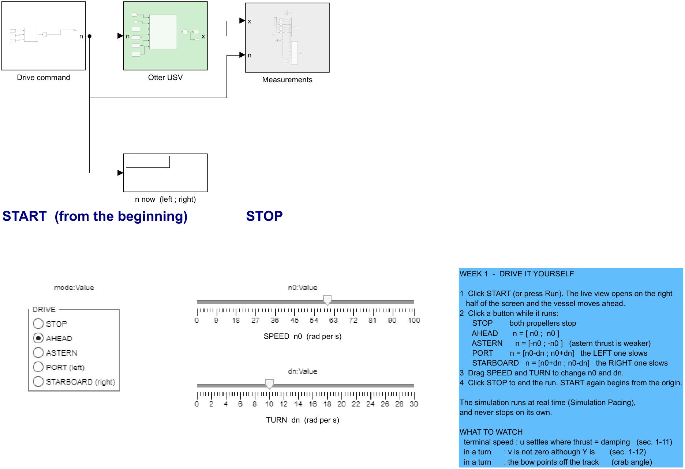

# Week 1 · Vessel Kinematics and the Otter Motion Model

> [!important] Reference material — read this first
> <span style="font-size:0.88em">The five courses below are **taught by the instructor of this course** and are the assumed background for it. They run from the fundamentals down to the graduate material, so start wherever the gap is. Every frame, symbol and derivation used here is developed in them at length; anyone whose prerequisites are thin should work through them first, then return.</span>
>
> | # | Course | Level | Lang. | Video | Slides and code |
> |---|---|---|---|---|---|
> | 1 | **Control Engineering** (제어공학) — the foundation: transfer functions, feedback, stability, root locus, PID | undergraduate | KO | [playlist](https://youtube.com/playlist?list=PLFaUxNRM4BvJMpF9HZS-Mp8tDv9dTdglk) | [drive](https://drive.google.com/drive/folders/1TNIPDNtS_Iy8li-olka5WJslSXDYf0aT) |
> | 2 | **Control System Design** (제어시스템설계) — design rather than analysis: specifications, loop shaping, discrete implementation | undergraduate | KO | [playlist](https://youtube.com/playlist?list=PLFaUxNRM4BvIGroZ5rgn7x08F7C79d9WZ) | [drive](https://drive.google.com/drive/folders/11m5Xxl_PHJvxgHghLSP-jhCpmRpbvoXh) |
> | 3 | **Advanced Control Engineering** (제어공학특론) — reference frames, the 6-DOF equation of motion, rotation matrices and Euler angles, linearisation and trim, vehicle control design | graduate | EN | [playlist](https://youtube.com/playlist?list=PLFaUxNRM4BvJmvF2ljx4KM5dj1P5jEcw0) | [drive](https://drive.google.com/drive/folders/1GUxbbONl916lNd0ggnFnXrNwNkd13-2-) |
> | 4 | **Sensor Signal Processing and Fusion** (센서신호처리 및 융합) — sensor models, noise, estimation and multi-sensor fusion | graduate | EN | [playlist](https://youtube.com/playlist?list=PLFaUxNRM4BvK-aP2Gdoyp5-AWvMn7Fo8E) | [drive](https://drive.google.com/drive/folders/1MEVJP7TzMcm8w6TZwUjhWJtL34WeNY3u) |
> | 5 | **Capstone Design** (캡스톤디자인) — a vehicle project carried end to end | undergraduate | KO | [playlist](https://youtube.com/playlist?list=PLFaUxNRM4BvLu7L0pDoLzDXTv8mm6rCmj) | [drive](https://drive.google.com/drive/folders/1haIQejlJfrdhtOuof-MpffR9ydVscXZS) |
>
> <span style="font-size:0.88em">**Not fluent in MATLAB or Simulink yet? Do these before Part 2.** Every laboratory in this course is Simulink, and the Onramp courses are free and take a few hours each.</span>
>
> | Tool | Where to start |
> |---|---|
> | MATLAB | [MATLAB Onramp](https://matlabacademy.mathworks.com/kr/details/matlab-onramp/gettingstarted) · [Core MATLAB Skills](https://matlabacademy.mathworks.com/details/core-matlab-skills/lpmlcms) |
> | Simulink | [Simulink Onramp](https://matlabacademy.mathworks.com/kr/details/simulink-onramp/simulink) · instructor's Simulink lectures [part 1](https://youtu.be/a-afHg_fSaU) · [part 2](https://youtu.be/070Yn0Hw5a0) |


- **Course**: USV Guidance, Navigation and Control (Graduate)
- **Department**: Autonomous Vehicle System Engineering, Chungnam National University
- **This week**: ① the two reference frames and the twelve states ② the equation of motion and where each term comes from ③ an open-loop Simulink model whose settled speed is predicted on paper before it is measured

> [!important] Before starting
> - MATLAB R2024b with Simulink is installed and licensed.
> - The MSS toolbox is present at `Tools/MSS`. Every script in this course adds it to the path itself; no installation is required.
> - Verify with one command:
>
> ```matlab
> which otter
> ```
>
> The expected reply names `Tools\MSS\VESSELS\otter.m`. If the reply is empty, the working directory is wrong.

---

## Learning Outcomes

Upon completion of this week, the learner is able to:

1. State what each of the twelve states of `otter.m` represents, and in which reference frame it is expressed.
2. Convert an attitude between Euler angles and a unit quaternion with MSS `euler2q` and `q2euler`, and state where each representation is singular.
3. Write the 6-DOF equation of motion and identify which physical effect each term models.
4. Reduce that equation to the three horizontal degrees of freedom used for the remainder of the course, and justify what is discarded.
5. Predict the terminal surge speed of the vessel from the propeller curve and the linear damping coefficient, before running any simulation.
6. Explain why the sway force of this vessel is identically zero, and derive the Coriolis term that produces a non-zero sway *velocity* during a turn.
7. Rebuild the week's Simulink model from its builder script after breaking it.

## Prerequisites and Setup

| Item | Requirement |
|---|---|
| MATLAB | R2024b, with Simulink |
| Toolboxes | none beyond Simulink for this week |
| MSS | `Tools/MSS`, added by the setup script |
| Course folder | `GradCourse/lectures/W01_simulink` |
| Expected duration | 60 min theory, 60 min laboratory |

---

# Part 1 · Theory

### Where this week goes

Thirteen sections is a lot to enter without a map. They answer four questions, in this order, and nothing later needs anything that has not already been answered.

| | Question | Sections |
|---|---|---|
| 1 | **Where is the vessel, and which way is it pointing?** Two frames, three angles, and the matrix that converts between them | 1-1 to 1-5 |
| 2 | **What makes it move?** Forces and moments, and why a surface craft needs only three of the six | 1-6, 1-7 |
| 3 | **What exactly does `otter.m` compute?** The equation of motion term by term, the twelve states, and the propellers | 1-8 to 1-10 |
| 4 | **Three things worth being surprised by.** Surge is first order; the hull sways with no side force; a current moves the vessel without pushing it | 1-11 to 1-13 |

**The one idea the whole week rests on** is in 1-4: body velocity is not the rate of change of position. Everything from the rotation matrix to the ocean current is a consequence of that sentence.

A reader short of time can go 1-1 → 1-3 → 1-4 → 1-9 and still follow the laboratory.

## 1-1. Two reference frames

- Every quantity in this course belongs to exactly one of two frames. Naming which one is not pedantry; it is the difference between a model that steers and a model that does not.


**Reading the figure**

| Element | Meaning |
|---|---|
| $x_n, y_n$ | North and East, fixed to the water |
| $\otimes$ at $o_n$ | $z_n$, Down, pointing into the page |
| $x_b, y_b$ | forward and starboard, painted on the hull and turning with it |
| dashed grey | the vessel's position, a vector expressed in $\{n\}$ |
| $\psi$ | the heading, measured from North to $x_b$ |

| Frame | Symbol | Origin | $x$ | $y$ | $z$ |
|---|---|---|---|---|---|
| North-East-Down | $\{n\}$ | a fixed point on the surface | North | East | Down |
| Body | $\{b\}$ | a point fixed in the hull, `otter.m` uses the midship waterline | forward | starboard | down through the keel |

- $\{n\}$ is treated as **inertial**: flat Earth, no rotation. For a two-metre vessel moving at three knots over a few hundred metres this is exact to far better than anything else in the model.
- $\{b\}$ **moves with the vessel**. It is the frame the sensors live in: a gyro measures $p, q, r$ in $\{b\}$, an accelerometer measures acceleration in $\{b\}$, and a propeller pushes along $x_b$.
- Both frames put $z$ **downward**. That is a marine convention and it has a consequence worth stating once: a positive yaw turns the bow from North towards East, which looks **clockwise** from above. Aerospace ENU conventions turn the other way, and mixing the two is a common source of a vessel that steers backwards.

> [!important] The division of labour
> **Position and attitude are expressed in $\{n\}$. Velocities are expressed in $\{b\}$.**
> $$\boldsymbol{\eta} = \begin{bmatrix} x & y & z & \phi & \theta & \psi \end{bmatrix}^{\!\top} \text{ in } \{n\}, \qquad \boldsymbol{\nu} = \begin{bmatrix} u & v & w & p & q & r \end{bmatrix}^{\!\top} \text{ in } \{b\}$$
> The whole of §1-2 to §1-5 exists to connect these two vectors. Nothing in those sections involves a mass or a force — it is geometry only, which is what the word **kinematics** means.

> [!important] How the two position coordinates are written, everywhere in this course
> In NED, **$x$ is North and $y$ is East**. This course writes them $x^n$ and $y^n$, with the superscript naming the frame, in every week and in every figure:
>
> $$\mathbf{p}^n = \begin{bmatrix} x^n \\[2pt] y^n \end{bmatrix}, \qquad \dot{\mathbf{p}}^n = \begin{bmatrix} \dot{x}^n \\[2pt] \dot{y}^n \end{bmatrix} .$$
>
> Marine texts often write $N$ and $E$ instead, and that reads naturally when only one frame is in play. **This course does not**, for two reasons:
>
> | | |
> |---|---|
> | $N$ is already taken | $N$ is the **yaw moment** in $\boldsymbol{\tau} = [X\ \ Y\ \ N]^{\!\top}$, used from §1-7 onward and in every week after. One letter cannot be both a position and a moment in the same document |
> | frames must be visible | By Week 4 three frames appear in one equation — $\{n\}$, $\{b\}$ and the path frame $\{p\}$ — and a symbol with no superscript cannot say which one it belongs to |
>
> This is Fossen's notation, so the Handbook and the lecture agree symbol for symbol. The **superscript** marks the frame; subscripts are already spoken for by components and coefficients, as in $x_g$, $y_{\text{pont}}$ and $N_r$.
>
> The MATLAB code writes `N` and `E` for these two, because an identifier has nowhere to put a superscript. That mapping is stated in each week's symbol table and is the only place the two spellings meet.

> [!important] Three letters that are easy to overload, and the rule for each
> A course this long runs out of letters. These three are the ones that would otherwise mean two things, and each follows `otter.m`'s own naming so that the document and the code never disagree.
>
> | Symbol | Means | Never means | Source |
> |---|---|---|---|
> | $\boldsymbol{\tau}$, $\tau_N$ | a **generalised force** — N for a force, N·m for a moment | a time constant | `otter.m` writes `tau`, `tau_damp`, `tau_crossflow`, all forces |
> | $T_u$, $T_{\text{yaw}}$, $T_{\text{sway}}$ — a **named** subscript | a **time constant**, in seconds | a thrust | `otter.m` writes `T_yaw = 1; % time constant in yaw (s)` |
> | $T$, $T_1$, $T_2$ — bare, or a **numbered** subscript | a **thrust**, in newtons | a time constant | `otter.m` writes `Thrust(i)` for exactly this quantity |
>
> The one deliberate exception is Nomoto's second-order model in §3-2, where the literature's own $T_1, T_2, T_3$ are time constants. It is confined to a single callout, which says so on the spot.
>
> Week 2's surge time constant was written $\tau_u$ until 2026-09-10 and is now $T_u$, in both the lecture and the scripts. If an older printout shows `tau_u = 1.1025 s`, it is the same number under the old name.

### NED and ENU — the other convention

- Not everyone uses NED. Most robotics software — ROS, Gazebo, and the VRX simulator this course reaches at the end — uses **ENU**: $x$ East, $y$ North, $z$ **Up**.


**Reading the figure**

| Element | Meaning |
|---|---|
| left panel | NED, used by this course, by MSS and by Fossen's Handbook |
| right panel | ENU, used by ROS, Gazebo and most robotics stacks |
| $\otimes$ / $\odot$ | the third axis going into the page / out of it |
| orange arc | the sense in which a positive heading is measured |

| | NED | ENU |
|---|---|---|
| $x$ | North | East |
| $y$ | East | North |
| $z$ | **Down** | **Up** |
| $\psi = 0$ points | North | East |
| positive $\psi$ | North → East, clockwise from above | East → North, counter-clockwise |

- The conversion is two operations:

$$
\begin{bmatrix} x \\ y \\ z\end{bmatrix}_{\text{ENU}}
=
\underbrace{\begin{bmatrix} 0 & 1 & 0 \\ 1 & 0 & 0 \\ 0 & 0 & -1 \end{bmatrix}}_{\mathbf{T},\ \det \mathbf{T} = +1}
\begin{bmatrix} x \\ y \\ z\end{bmatrix}_{\text{NED}},
\qquad
\psi_{\text{ENU}} = 90^\circ - \psi_{\text{NED}} .
$$

- Swapping the first two axes alone would be a **reflection**, $\det = -1$. Flipping the third restores $\det = +1$ and makes $\mathbf{T}$ a proper rotation — in fact a $180°$ turn about the axis $(1,1,0)/\sqrt2$.

> [!caution] This is a field failure, not a textbook curiosity
> A vessel whose autopilot is written in NED and whose simulator reports ENU turns the wrong way and drives to the mirror image of its waypoints. Nothing errors, nothing is `NaN`, and the track looks plausible until it is plotted against the plan. Convert at **one** place, at the boundary, and state which convention every interface uses.

## 1-2. Attitude — roll, pitch and yaw

- Three angles orient $\{b\}$ relative to $\{n\}$. Each is a rotation about one axis of the vessel.

| Angle | Symbol | Rotation about | Positive sense | What it looks like |
|---|---|---|---|---|
| roll | $\phi$ | $x_b$, the fore-aft axis | starboard side goes down | the vessel leans in a turn |
| pitch | $\theta$ | $y_b$, the athwartships axis | bow goes **up** | the vessel trims by the stern |
| yaw | $\psi$ | $z_b$, the vertical axis | bow swings towards starboard | the vessel changes heading |

- The three collected together are the **Euler angles**:

$$
\boldsymbol{\Theta} = \begin{bmatrix} \phi & \theta & \psi \end{bmatrix}^{\!\top} .
$$

> [!caution] Pitch positive is bow-up, even though $z$ points down
> With $z$ downward and a right-handed frame, a positive rotation about $y_b$ carries $z_b$ towards $x_b$ — which lifts the bow. The sign feels wrong the first time and is correct. `otter.m` reports a small negative $\theta$ at rest, because the payload trims the vessel slightly by the bow.

## 1-3. The rotation matrix

- A rotation matrix answers one question: **the same physical vector, expressed in the other frame, has which components?**

$$
\mathbf{v}^{n} = \mathbf{R}_b^n(\boldsymbol{\Theta})\, \mathbf{v}^{b}
$$

- The superscript is the frame the answer is in; the subscript is the frame the input came from. Reading $\mathbf{R}_b^n$ as "from $b$ to $n$" makes the index bookkeeping automatic, because adjacent indices cancel: $\mathbf{R}_1^n\mathbf{R}_2^1\mathbf{R}_b^2 = \mathbf{R}_b^n$.

### The three elementary rotations

$$
\mathbf{R}_x(\phi) =
\begin{bmatrix} 1 & 0 & 0 \\ 0 & c\phi & -s\phi \\ 0 & s\phi & c\phi \end{bmatrix},
\quad
\mathbf{R}_y(\theta) =
\begin{bmatrix} c\theta & 0 & s\theta \\ 0 & 1 & 0 \\ -s\theta & 0 & c\theta \end{bmatrix},
\quad
\mathbf{R}_z(\psi) =
\begin{bmatrix} c\psi & -s\psi & 0 \\ s\psi & c\psi & 0 \\ 0 & 0 & 1 \end{bmatrix}
$$

with $c\cdot = \cos(\cdot)$ and $s\cdot = \sin(\cdot)$. Each leaves its own axis alone — that is the column of $\pm 1$ — and mixes the other two.

### Composition, in the zyx order


**Reading the figure**

| In the figure | Meaning |
|---|---|
| the deck plate | the vessel itself, drawn in the attitude reached so far |
| dashed grey square | the **horizontal plane of NED**, the same in all four panels. It is the ruler: the deck leaves it only once pitch and roll arrive |
| blue axis | the axis the **next** turn is about, with the turn drawn around it as a circle in the plane perpendicular to that axis |
| {n} → {1} | yaw $\psi$ about $z_n$. The deck turns but stays flat in the plane |
| {1} → {2} | pitch $\theta$ about $y_1$, the **already-yawed** athwartships axis. The bow lifts out of the plane — with $z_b$ down, positive $\theta$ is bow-up |
| {2} → {b} | roll $\phi$ about $x_2$, the **already-yawed and pitched** fore-aft axis. Positive $\phi$ puts starboard down |

- The figure is drawn from the actual rotation matrices, not sketched: each panel's axes are the columns of that stage's matrix. The three axes have equal length in space, so their differing lengths on the page are foreshortening.
- The point the figure is making: **the second and third axes do not exist until the turns before them have happened.** $y_1$ is not $y_n$, and $x_2$ is neither $x_n$ nor $x_1$.

$$
\boxed{\ \mathbf{R}_b^n(\boldsymbol{\Theta}) = \mathbf{R}_z(\psi)\,\mathbf{R}_y(\theta)\,\mathbf{R}_x(\phi)\ }
$$

- Written out:

$$
\mathbf{R}_b^n =
\begin{bmatrix}
c\psi\,c\theta & -s\psi\,c\phi + c\psi\,s\theta\,s\phi & s\psi\,s\phi + c\psi\,c\phi\,s\theta \\
s\psi\,c\theta & c\psi\,c\phi + s\phi\,s\theta\,s\psi & -c\psi\,s\phi + s\theta\,s\psi\,c\phi \\
-s\theta & c\theta\,s\phi & c\theta\,c\phi
\end{bmatrix}
$$

- This is exactly what MSS builds in `Rzyx(phi, theta, psi)`, and what `otter.m` calls through `eulerang`.

> [!warning] The order is part of the definition
> Matrix multiplication does not commute, so $\mathbf{R}_z\mathbf{R}_y\mathbf{R}_x \neq \mathbf{R}_x\mathbf{R}_y\mathbf{R}_z$. The same three numbers describe **different attitudes** under different conventions. Marine and aerospace practice is $zyx$; some robotics libraries default to something else. A stated convention is part of a stated attitude.

### Three properties, and what each is worth

| Property | Statement | Why it matters |
|---|---|---|
| orthogonal | $\mathbf{R}^{\!\top}\mathbf{R} = \mathbf{I}$ | the inverse is the **transpose**: $\mathbf{R}_n^b = (\mathbf{R}_b^n)^{-1} = (\mathbf{R}_b^n)^{\!\top}$ |
| unit determinant | $\det(\mathbf{R}) = +1$ | it is a rotation, not a reflection |
| length-preserving | $\lVert\mathbf{R}\mathbf{v}\rVert = \lVert\mathbf{v}\rVert$ | a change of frame never changes a speed |

- Measured on $\phi = 10°$, $\theta = 7°$, $\psi = 50°$ with the MSS implementation:

$$
\det(\mathbf{R}) = 1.0000000000,
\qquad
\max\left|\mathbf{R}^{\!\top}\mathbf{R} - \mathbf{I}\right| = 2.2\times10^{-16},
\qquad
\max\left|\mathbf{R}^{-1} - \mathbf{R}^{\!\top}\right| = 1.1\times10^{-16} .
$$

> [!tip] Never call `inv` on a rotation matrix
> The transpose is exact, costs nothing, and cannot be ill-conditioned. Every guidance law in this course produces an error in $\{n\}$ and hands it to a controller working in $\{b\}$, so $(\mathbf{R}_b^n)^{\!\top}$ appears far more often than $\mathbf{R}_b^n$ itself.

### The horizontal plane

- From Week 2 onward the vessel is treated as a 3-DOF craft and only the yaw rotation survives:

$$
\mathbf{R}(\psi) =
\begin{bmatrix}
\cos\psi & -\sin\psi \\
\sin\psi & \phantom{-}\cos\psi
\end{bmatrix},
\qquad
\begin{bmatrix} \dot{x}^n \\[2pt] \dot{y}^n \end{bmatrix}
= \mathbf{R}(\psi)\begin{bmatrix} u \\ v \end{bmatrix} .
$$

## 1-4. Body velocity is not the rate of change of position

- This is the single most important line of the week, and the one most often got wrong in code.

$$
u \neq \dot{x}^n, \qquad v \neq \dot{y}^n .
$$

- $u$ and $v$ are components **along axes that are themselves turning**. $\dot{x}^n$ and $\dot{y}^n$ are components along axes that never move. They coincide only at $\psi = 0$.


**Reading the figure**

| Element | Meaning |
|---|---|
| orange | $u$ and $v$, the components the vessel measures in $\{b\}$ |
| blue | the velocity itself — one physical vector, drawn once |
| green dashed | $\dot{x}^n$ and $\dot{y}^n$, the components that the position actually changes by |
| right-hand panel | the arithmetic, and the length check |

- Worked out for $\psi = 30°$, $u = 2.0$ m/s, $v = 0.5$ m/s:

$$
\begin{aligned}
\dot{x}^n &= u\cos\psi - v\sin\psi = 2.0(0.8660) - 0.5(0.5000) = 1.4821\ \text{m/s}, \\[3pt]
\dot{y}^n &= u\sin\psi + v\cos\psi = 2.0(0.5000) + 0.5(0.8660) = 1.4330\ \text{m/s}.
\end{aligned}
$$

| Quantity | Value |
|---|---|
| speed in $\{b\}$, $\sqrt{u^2+v^2}$ | $2.0616$ m/s |
| speed in $\{n\}$, $\sqrt{(\dot{x}^n)^2+(\dot{y}^n)^2}$ | $2.0616$ m/s |

- The two agree because a rotation preserves length. **That equality is the cheapest available check on any frame conversion**, and it catches a transposed or mis-signed matrix immediately.

> [!caution] The symptom of getting this wrong
> Integrating $u$ to obtain a north position gives a track that is correct at $\psi = 0$, plausible at small headings, and increasingly wrong as the vessel turns — with no error, no warning and no `NaN`. Week 1's model is deliberately run at three different headings so that the failure would be visible if it were there.

## 1-5. Angular velocity, and the matrix that is not a rotation

- First, what $p$, $q$ and $r$ are. Each is a rotation rate about **one axis of the hull**, and each is what a gyroscope bolted to that hull actually reports.


**Reading the figure**

| Panel | Rate | About | Positive means |
|---|---|---|---|
| left | $p$ | $x_b$ | starboard side goes down |
| centre | $q$ | $y_b$ | the bow goes up |
| right | $r$ | $z_b$ | the bow swings to starboard |

| Symbol | Quantity | Unit | Measured by |
|---|---|---|---|
| $p$ | roll rate | rad/s | gyro, $x$ axis |
| $q$ | pitch rate | rad/s | gyro, $y$ axis |
| $r$ | yaw rate | rad/s | gyro, $z$ axis |

- Now the conversion to Euler angle rates, and it is **not** a rotation matrix. The reason is short: $p$, $q$ and $r$ are measured about axes belonging to three **different** intermediate frames of §1-3, and those three axes are not mutually orthogonal.

$$
\dot{\boldsymbol{\Theta}} = \mathbf{T}_{\Theta}(\boldsymbol{\Theta})\,\boldsymbol{\omega}_{b/n}^{b},
\qquad
\mathbf{T}_{\Theta}(\boldsymbol{\Theta}) =
\begin{bmatrix}
1 & s\phi\,t\theta & c\phi\,t\theta \\
0 & c\phi & -s\phi \\
0 & s\phi / c\theta & c\phi / c\theta
\end{bmatrix}
$$

with $t\theta = \tan\theta$. Component by component:

$$
\dot\phi = p + q\,s\phi\,t\theta + r\,c\phi\,t\theta,
\qquad
\dot\theta = q\,c\phi - r\,s\phi,
\qquad
\dot\psi = \frac{q\,s\phi + r\,c\phi}{c\theta} .
$$

| Symbol | Quantity | Unit |
|---|---|---|
| $p, q, r$ | body angular rates, measured by the gyro | rad/s |
| $\dot\phi, \dot\theta, \dot\psi$ | Euler angle rates | rad/s |
| $\mathbf{T}_{\Theta}$ | the map between them | dimensionless |

- Measured with MSS `Tzyx` at $\phi = 10°$, $\theta = 7°$ and $[p, q, r] = [2, 5, 10]$ rad/s:

$$
\dot{\boldsymbol{\Theta}} = [3.3157,\ 3.1877,\ 10.7967]^{\!\top}\ \text{rad/s} .
$$

- Note that $\dot\psi = 10.7967 \neq r = 10$. **The yaw rate and the rate of change of heading are different numbers** whenever the vessel is rolled or pitched.

> [!warning] $\mathbf{T}_{\Theta}$ is singular at $\theta = \pm 90°$
> The $1/\cos\theta$ entries blow up: at $\theta = 89.9°$ the largest entry of $\mathbf{T}_{\Theta}$ is already $573$. This is **gimbal lock**, and it is a property of the Euler-angle representation, not of the vessel. A surface craft never approaches it, which is why this course uses Euler angles throughout. An AUV performing a vertical manoeuvre does approach it, and that is where quaternions earn their place.

> [!note] Two simplifications that hold for this vessel, and are stated rather than assumed
> For a surface craft $\phi$ and $\theta$ stay within a few degrees, so $\mathbf{T}_{\Theta} \approx \mathbf{I}$ and $\dot\psi \approx r$. Week 3 controls $\psi$ by integrating $r$ on exactly that basis. The twelve-state plant does **not** make the approximation; only the design equations do.

### Unit quaternions — attitude without the singularity

- **Why a second representation.** The singularity of $\mathbf{T}_\Theta$ belongs to the three angles, not to the vessel. A four-parameter description of the same attitude, the **unit quaternion**, has no such point (Fossen 2021, §2.2.2).
- This course keeps Euler angles, because a surface craft never pitches near $90°$. The quaternion is introduced because MSS uses it wherever that assumption fails — its inertial navigation filter `ins_mekf.m` and its attitude estimator `quest.m` — as strapdown inertial navigation generally does.
- The principle is Euler's rotation theorem: any change of attitude can be produced by a single rotation through an angle $\beta$ about one fixed unit axis $\boldsymbol{\lambda}$. The quaternion stores that one rotation as the cosine and the sine of half its angle:

$$
\mathbf{q} = \begin{bmatrix} \eta \\ \boldsymbol{\varepsilon} \end{bmatrix}
= \begin{bmatrix} \cos(\beta/2) \\ \boldsymbol{\lambda}\,\sin(\beta/2) \end{bmatrix},
\qquad
\boldsymbol{\varepsilon} = \begin{bmatrix} \varepsilon_1 & \varepsilon_2 & \varepsilon_3 \end{bmatrix}^{\!\top},
\qquad
\mathbf{q}^{\!\top}\mathbf{q} = \eta^2 + \boldsymbol{\varepsilon}^{\!\top}\boldsymbol{\varepsilon} = 1
$$

| Symbol | Quantity | Note |
|---|---|---|
| $\mathbf{q}$ | unit quaternion, from $\{b\}$ to $\{n\}$ | bold — not the pitch rate $q$ of the table above |
| $\eta$ | scalar part | $\cos(\beta/2)$ |
| $\boldsymbol{\varepsilon}$ | vector part | $\boldsymbol{\lambda}\sin(\beta/2)$ |
| $\beta$, $\boldsymbol{\lambda}$ | angle and unit axis of the single equivalent rotation | $\boldsymbol{\lambda}^{\!\top}\boldsymbol{\lambda} = 1$ |
| $\mathbf{S}(\mathbf{a})$ | skew-symmetric matrix, $\mathbf{S}(\mathbf{a})\,\mathbf{b} = \mathbf{a}\times\mathbf{b}$ | MSS `Smtrx` |

- Four numbers bound by one constraint leave three free — the same three degrees of freedom that $\boldsymbol{\Theta}$ carries. The unit norm is automatic, since $\cos^2 + \sin^2 = 1$.

> [!caution] In MSS the scalar goes first
> MSS stores $\mathbf{q} = [\eta\ \ \varepsilon_1\ \ \varepsilon_2\ \ \varepsilon_3]^{\!\top}$. ROS messages list the scalar last, as $x, y, z, w$. A quaternion copied between the two without reordering describes a different attitude, and nothing reports an error.

### The rotation matrix, from the axis and the half-angle

- Start from the axis–angle form of a rotation (Fossen 2021, §2.2.2) and turn each trigonometric factor into half-angles, one operation per line:

$$
\begin{aligned}
\mathbf{R} &= \mathbf{I}_3 + \sin\beta\;\mathbf{S}(\boldsymbol{\lambda}) + (1 - \cos\beta)\,\mathbf{S}^2(\boldsymbol{\lambda}) && \text{axis–angle form} \\
&= \mathbf{I}_3 + 2\sin\tfrac{\beta}{2}\cos\tfrac{\beta}{2}\;\mathbf{S}(\boldsymbol{\lambda}) + 2\sin^2\tfrac{\beta}{2}\;\mathbf{S}^2(\boldsymbol{\lambda}) && \sin\beta = 2\sin\tfrac{\beta}{2}\cos\tfrac{\beta}{2},\ \ 1-\cos\beta = 2\sin^2\tfrac{\beta}{2} \\
&= \mathbf{I}_3 + 2\cos\tfrac{\beta}{2}\;\mathbf{S}\!\left(\boldsymbol{\lambda}\sin\tfrac{\beta}{2}\right) + 2\,\mathbf{S}^2\!\left(\boldsymbol{\lambda}\sin\tfrac{\beta}{2}\right) && \mathbf{S}(\cdot)\ \text{is linear} \\
&= \mathbf{I}_3 + 2\eta\,\mathbf{S}(\boldsymbol{\varepsilon}) + 2\,\mathbf{S}^2(\boldsymbol{\varepsilon}) && \text{definition of } \eta \text{ and } \boldsymbol{\varepsilon}
\end{aligned}
$$

- Written out, with $\eta^2 + \boldsymbol{\varepsilon}^{\!\top}\boldsymbol{\varepsilon} = 1$ used on the diagonal:

$$
\mathbf{R}(\mathbf{q}) =
\begin{bmatrix}
1 - 2(\varepsilon_2^2 + \varepsilon_3^2) & 2(\varepsilon_1\varepsilon_2 - \varepsilon_3\eta) & 2(\varepsilon_1\varepsilon_3 + \varepsilon_2\eta) \\
2(\varepsilon_1\varepsilon_2 + \varepsilon_3\eta) & 1 - 2(\varepsilon_1^2 + \varepsilon_3^2) & 2(\varepsilon_2\varepsilon_3 - \varepsilon_1\eta) \\
2(\varepsilon_1\varepsilon_3 - \varepsilon_2\eta) & 2(\varepsilon_2\varepsilon_3 + \varepsilon_1\eta) & 1 - 2(\varepsilon_1^2 + \varepsilon_2^2)
\end{bmatrix}
$$

- Every entry is a product of two components. $\mathbf{R}(\mathbf{q})$ contains no trigonometric function at all.
- $\mathbf{R}(-\mathbf{q}) = \mathbf{R}(\mathbf{q})$, because every entry is quadratic in $\mathbf{q}$. The quaternion $-\mathbf{q}$ is the rotation by $2\pi - \beta$ about $-\boldsymbol{\lambda}$ — the same rotation, reached the other way round — so each attitude has exactly two quaternions.
- This is MSS `Rquat`, line for line:

```matlab
% MSS, GNC/Rquat.m (2021 release) — LIBRARY/kinematics/Rquat.m in 2022 and later
% Author: Thor I. Fossen. MIT License.
tol = 1e-6;
if abs(norm(q)-1)>tol; error('norm(q) must be equal to 1'); end

eta = q(1);
eps = q(2:4);

S = Smtrx(eps);
R = eye(3) + 2*eta*S + 2*S^2;
```

- Measured by `_tools/verify_w01_theory.m` at $\phi = 10°$, $\theta = 7°$, $\psi = 50°$, the attitude of §1-3:

| Check | Result |
|---|---|
| $\mathbf{q}$ from `euler2q` | $[0.903424,\ 0.053141,\ 0.091883,\ 0.415403]^{\!\top}$ |
| $\lVert\mathbf{q}\rVert - 1$ | $2.2\times10^{-16}$ |
| $\max\lvert\mathbf{R}(\mathbf{q}) - \mathbf{R}_b^n(\boldsymbol{\Theta})\rvert$, `Rquat` against `Rzyx` | $2.2\times10^{-16}$ |
| $\max\lvert\mathbf{R}(-\mathbf{q}) - \mathbf{R}(\mathbf{q})\rvert$ | $0$ |

### Quaternion kinematics — the rate equation without a division

- The quaternion changes at half the product of $\mathbf{q}$ with the angular velocity written as a quaternion of zero scalar part (Fossen 2021, §2.2.2). The product of two quaternions, MSS `quatprod`, is

$$
\mathbf{q}_1 \otimes \mathbf{q}_2 =
\begin{bmatrix}
\eta_1\eta_2 - \boldsymbol{\varepsilon}_1^{\!\top}\boldsymbol{\varepsilon}_2 \\
\eta_1\boldsymbol{\varepsilon}_2 + \eta_2\boldsymbol{\varepsilon}_1 + \mathbf{S}(\boldsymbol{\varepsilon}_1)\,\boldsymbol{\varepsilon}_2
\end{bmatrix}
$$

- Substituting $\mathbf{q}_2 = [0\ \ \boldsymbol{\omega}^{\!\top}]^{\!\top}$, with $\boldsymbol{\omega} = \boldsymbol{\omega}^b_{b/n} = [p\ \ q\ \ r]^{\!\top}$ the gyro rates of this section:

$$
\begin{aligned}
\dot{\mathbf{q}} &= \tfrac12\,\mathbf{q} \otimes \begin{bmatrix} 0 \\ \boldsymbol{\omega} \end{bmatrix} && \text{the kinematic equation} \\
&= \tfrac12 \begin{bmatrix} \eta\cdot 0 - \boldsymbol{\varepsilon}^{\!\top}\boldsymbol{\omega} \\ \eta\,\boldsymbol{\omega} + 0\cdot\boldsymbol{\varepsilon} + \mathbf{S}(\boldsymbol{\varepsilon})\,\boldsymbol{\omega} \end{bmatrix} && \text{product rule with } \eta_2 = 0,\ \boldsymbol{\varepsilon}_2 = \boldsymbol{\omega} \\
&= \underbrace{\tfrac12 \begin{bmatrix} -\boldsymbol{\varepsilon}^{\!\top} \\ \eta\,\mathbf{I}_3 + \mathbf{S}(\boldsymbol{\varepsilon}) \end{bmatrix}}_{\mathbf{T}_q(\mathbf{q})} \boldsymbol{\omega} && \text{factor out } \boldsymbol{\omega}
\end{aligned}
$$

$$
\mathbf{T}_q(\mathbf{q}) = \frac12
\begin{bmatrix}
-\varepsilon_1 & -\varepsilon_2 & -\varepsilon_3 \\
\eta & -\varepsilon_3 & \varepsilon_2 \\
\varepsilon_3 & \eta & -\varepsilon_1 \\
-\varepsilon_2 & \varepsilon_1 & \eta
\end{bmatrix}
$$

- This is MSS `Tquat` for a four-element input. Given a three-element $\boldsymbol{\omega}$ instead, `Tquat` returns the $4\times4$ matrix $\mathbf{T}_\omega$ with $\dot{\mathbf{q}} = \mathbf{T}_\omega\,\mathbf{q}$ — the same equation arranged the other way.

```matlab
% MSS, GNC/Tquat.m (2021 release) — the branch taken when the input is q
% Author: Thor I. Fossen. MIT License.
eta  = u(1); eps1 = u(2); eps2 = u(3); eps3 = u(4);

T = 0.5 * [...
    -eps1 -eps2 -eps3
     eta  -eps3  eps2
     eps3  eta  -eps1
    -eps2  eps1  eta   ];
```

- Set beside $\mathbf{T}_\Theta$ of this section, with the largest entries measured by `verify_w01_theory` at $\phi = \psi = 0$:

| | $\mathbf{T}_\Theta(\boldsymbol{\Theta})$, Euler angles | $\mathbf{T}_q(\mathbf{q})$, unit quaternion |
|---|---|---|
| entries | contain $1/\cos\theta$ and $\tan\theta$ | $\pm\tfrac12$ times a component of $\mathbf{q}$ |
| where it fails | $\theta = \pm 90°$ | nowhere: $\mathbf{T}_q^{\!\top}\mathbf{T}_q = \tfrac14\mathbf{I}_3$ for every unit $\mathbf{q}$ |
| largest entry, $\theta = 0°$ | $1.00$ | $0.5000$ |
| largest entry, $\theta = 89°$ | $57.30$ | $0.3566$ |
| largest entry, $\theta = 89.9°$ | $572.96$ | $0.3539$ |
| work per step | trigonometric functions | products and sums only |

- Measured: $\tfrac12\,\mathbf{q}\otimes[0\ \ \boldsymbol{\omega}^{\!\top}]^{\!\top}$ against `Tquat(q)*w` agrees to $3.5\times10^{-18}$; $\mathbf{T}_q^{\!\top}\mathbf{T}_q - \tfrac14\mathbf{I}_3$ is $5.6\times10^{-17}$; and differentiating `euler2q` numerically along an Euler-angle path reproduces `Tquat(q)*w` to $2.4\times10^{-9}$, against $\lVert\dot{\mathbf{q}}\rVert = 5.68\times10^{-2}$.
- **The price is the constraint.** Once discretised, nothing in $\dot{\mathbf{q}} = \mathbf{T}_q\boldsymbol{\omega}$ holds $\mathbf{q}^{\!\top}\mathbf{q}$ at one. Forward Euler at $h = 0.02$ s for $100$ s with $\boldsymbol{\omega} = [0.3,\ -0.2,\ 0.5]$ rad/s leaves $\lVert\mathbf{q}\rVert - 1 = 0.0997$, and `Rquat` refuses any quaternion more than $10^{-6}$ from unit length. Three remedies are in use:

| Remedy | How | Where |
|---|---|---|
| renormalise after each step | $\mathbf{q} \leftarrow \mathbf{q}/\lVert\mathbf{q}\rVert$ | the first line of `q2euler` |
| a restoring term in the equation | $\dot{\mathbf{q}} = \mathbf{T}_q(\mathbf{q})\boldsymbol{\omega} + \tfrac{\gamma}{2}\left(1 - \mathbf{q}^{\!\top}\mathbf{q}\right)\mathbf{q}$ with $\gamma \ge 0$; the norm error decays with time constant $1/\gamma$ | Fossen (2021), §2.2.2 |
| exact discretisation | $\mathbf{q}_{k+1} = \exp(\mathbf{T}_\omega h)\,\mathbf{q}_k$. $\mathbf{T}_\omega$ is skew-symmetric, so its exponential is orthogonal and keeps the norm | `ins_mekf.m`, line 157 |

### Euler angles to a quaternion — `euler2q`

- The zyx order of §1-3, $\mathbf{R}_b^n = \mathbf{R}_z(\psi)\mathbf{R}_y(\theta)\mathbf{R}_x(\phi)$, carries over directly, because the quaternion product composes rotations in the same order as the matrices: $\mathbf{R}(\mathbf{q}_1\otimes\mathbf{q}_2) = \mathbf{R}(\mathbf{q}_1)\,\mathbf{R}(\mathbf{q}_2)$, measured to $2.2\times10^{-16}$. Each elementary rotation is a half-angle about one coordinate axis (Fossen 2021, §2.2.3):

$$
\mathbf{q} = \mathbf{q}_z(\psi) \otimes \mathbf{q}_y(\theta) \otimes \mathbf{q}_x(\phi),
\qquad
\mathbf{q}_x = \begin{bmatrix} \bar c_\phi \\ \bar s_\phi \\ 0 \\ 0 \end{bmatrix},\quad
\mathbf{q}_y = \begin{bmatrix} \bar c_\theta \\ 0 \\ \bar s_\theta \\ 0 \end{bmatrix},\quad
\mathbf{q}_z = \begin{bmatrix} \bar c_\psi \\ 0 \\ 0 \\ \bar s_\psi \end{bmatrix}
$$

with the bar marking a **half** angle, $\bar c_\phi = \cos(\phi/2)$ and $\bar s_\phi = \sin(\phi/2)$ — not the $c\phi = \cos\phi$ of §1-3.

- The first product. Its cross term is $\mathbf{S}(\boldsymbol{\varepsilon}_z)\,\boldsymbol{\varepsilon}_y = [0\ \ 0\ \ \bar s_\psi]^{\!\top} \times [0\ \ \bar s_\theta\ \ 0]^{\!\top} = [-\bar s_\psi\bar s_\theta\ \ 0\ \ 0]^{\!\top}$, so

$$
\mathbf{q}_z \otimes \mathbf{q}_y =
\begin{bmatrix}
\bar c_\psi\,\bar c_\theta \\
-\bar s_\psi\,\bar s_\theta \\
\bar c_\psi\,\bar s_\theta \\
\bar s_\psi\,\bar c_\theta
\end{bmatrix}
$$

- The second product, with $\mathbf{q}_x$, one component per line:

$$
\begin{aligned}
\eta &= \bar c_\psi\bar c_\theta\bar c_\phi + \bar s_\psi\bar s_\theta\bar s_\phi \\
\varepsilon_1 &= \bar c_\psi\bar c_\theta\bar s_\phi - \bar s_\psi\bar s_\theta\bar c_\phi \\
\varepsilon_2 &= \bar s_\psi\bar c_\theta\bar s_\phi + \bar c_\psi\bar s_\theta\bar c_\phi \\
\varepsilon_3 &= \bar s_\psi\bar c_\theta\bar c_\phi - \bar c_\psi\bar s_\theta\bar s_\phi
\end{aligned}
$$

- At the attitude of §1-3 the intermediate product is $[0.904617,\ -0.025800,\ 0.055329,\ 0.421830]^{\!\top}$, and the final one matches `euler2q` to $1.1\times10^{-16}$. The four lines are MSS `euler2q` exactly, with `cy` $= \bar c_\psi$, `cp` $= \bar c_\theta$ and `cr` $= \bar c_\phi$:

```matlab
% MSS, GNC/euler2q.m (2021 release) — LIBRARY/kinematics/euler2q.m in 2022 and later
% Author: Thor I. Fossen. MIT License. Algorithm after NASA Mission Planning and
% Analysis Division, "Euler Angles, Quaternions, and Transformation Matrices".
cy = cos(psi * 0.5);
sy = sin(psi * 0.5);
cp = cos(theta * 0.5);
sp = sin(theta * 0.5);
cr = cos(phi * 0.5);
sr = sin(phi * 0.5);

q = [cy * cp * cr + sy * sp * sr
     cy * cp * sr - sy * sp * cr
     sy * cp * sr + cy * sp * cr
     sy * cp * cr - cy * sp * sr];

q = q/(q'*q);
```

- The last line divides by $\mathbf{q}^{\!\top}\mathbf{q}$, the **squared** norm. It changes nothing here, because the four lines already give a unit quaternion to round-off, but it is not a normaliser; `q/norm(q)` is.

### A quaternion to Euler angles — `q2euler`

- The conversion back reads five entries of $\mathbf{R}(\mathbf{q})$ and inverts the zyx matrix written out in §1-3 (Fossen 2021, §2.2.4):

$$
\begin{aligned}
R_{31} = -\sin\theta \quad &\Longrightarrow\quad \theta = -\arcsin R_{31} \\
\frac{R_{32}}{R_{33}} = \frac{\cos\theta\,\sin\phi}{\cos\theta\,\cos\phi} \quad &\Longrightarrow\quad \phi = \operatorname{atan2}\!\left(R_{32},\ R_{33}\right) \\
\frac{R_{21}}{R_{11}} = \frac{\sin\psi\,\cos\theta}{\cos\psi\,\cos\theta} \quad &\Longrightarrow\quad \psi = \operatorname{atan2}\!\left(R_{21},\ R_{11}\right)
\end{aligned}
$$

- The entries come from $\mathbf{R}(\mathbf{q})$ above, and `atan2` keeps the correct quadrant because $\cos\theta > 0$ whenever $\lvert\theta\rvert < 90°$. Euler to quaternion and back returns the starting angles to $6.4\times10^{-15}$ degrees.
- **The singularity comes back here.** At $\theta = \pm 90°$ the four entries $R_{11}$, $R_{21}$, $R_{32}$ and $R_{33}$ all vanish, `atan2(0,0)` has no meaning, and only the combination $\phi \mp \psi$ is defined. The quaternion never had the singularity; the angles it is converted into do. The working rule follows: integrate in $\mathbf{q}$, and convert to $\boldsymbol{\Theta}$ only to display or to command.
- The 2021 release this course runs:

```matlab
% MSS, GNC/q2euler.m (2021 release)
% Author: Thor I. Fossen. MIT License.
q = q / norm(q);            % normalize q, handle round-off errors
R = Rquat(q);

phi = atan2(R(3,2),R(3,3));

if (abs( R(3,1 )) > 1)      % handle NaN due to round-off errors
    R(3,1) = sign(R(3,1));
else
    theta = -asin(R(3,1));
end

psi = atan2(R(2,1),R(1,1));
```

> [!warning] The 2021 `q2euler` fails at $\theta = \pm 90°$
> When round-off pushes $\lvert R_{31}\rvert$ past one, the `if` branch clamps $R_{31}$ and then **never computes** `theta`, and MATLAB stops with *Output argument "theta" not assigned*. `verify_w01_theory` meets $R_{31} = 1.0000000000000002$ on its fourth random attitude at $\theta = 90°$. The revision of 2022-04-15 moves `theta = -asin(R(3,1));` below the `end`, so that it runs after the clamp. A surface craft never reaches this branch; an AUV script on the 2021 release can.

### The MSS functions, and where each one lives

| Function | Computes | Call | 2021 release (this course) | 2022 and later |
|---|---|---|---|---|
| `euler2q` | $\boldsymbol{\Theta} \to \mathbf{q}$, Fossen §2.2.3 | `q = euler2q(phi,theta,psi)` | `GNC/euler2q.m` | `LIBRARY/kinematics/` |
| `q2euler` | $\mathbf{q} \to \boldsymbol{\Theta}$, Fossen §2.2.4 | `[phi,theta,psi] = q2euler(q)` | `GNC/q2euler.m` | `LIBRARY/kinematics/`, round-off branch fixed |
| `Rquat` | $\mathbf{R}(\mathbf{q})$ | `R = Rquat(q)` | `GNC/Rquat.m` | `LIBRARY/kinematics/` |
| `Tquat` | $\mathbf{T}_q(\mathbf{q})$, $4\times3$; or $\mathbf{T}_\omega(\boldsymbol{\omega})$, $4\times4$ | `T = Tquat(q)` | `GNC/Tquat.m` | `LIBRARY/kinematics/` |
| `quatprod` | $\mathbf{q}_1 \otimes \mathbf{q}_2$ | `q = quatprod(q1,q2)` | `GNC/quatprod.m` | `LIBRARY/kinematics/` |
| `quatern` | $\operatorname{blkdiag}\!\left(\mathbf{R}(\mathbf{q}),\ \mathbf{T}_q(\mathbf{q})\right)$, $7\times6$ | `[J,J1,J2] = quatern(q)` | `GNC/quatern.m` | `LIBRARY/kinematics/` |

| | Euler angles $\boldsymbol{\Theta}$ | Unit quaternion $\mathbf{q}$ |
|---|---|---|
| parameters | three | four, bound by $\mathbf{q}^{\!\top}\mathbf{q} = 1$ |
| singular | at $\theta = \pm 90°$ | never |
| one attitude is | one triple, within the angle ranges | two quaternions, $\mathbf{q}$ and $-\mathbf{q}$ |
| readable at a glance | yes — roll, pitch, heading | no — an axis and a half-angle |
| numerical care | none | the norm must be restored |
| in this course | the plant and every controller: `otter.m` calls `eulerang` (line 200) | MSS's inertial navigation and attitude estimation, and any vehicle that pitches steeply |

## 1-6. Kinematics and kinetics

- The word **dynamics** covers two different questions, and separating them is what makes the model tractable.

| | Question | Depends on | Sections |
|---|---|---|---|
| **kinematics** | if the vessel moves like *this*, where does it end up? | geometry only — no mass, no force | §1-2 to §1-5 |
| **kinetics** | what makes it move like that? | mass, added mass, damping, thrust | §1-7 onward |

- The two are stacked, and the whole model is these two lines:

$$
\underbrace{\dot{\boldsymbol{\eta}} = \mathbf{J}_{\Theta}(\boldsymbol{\eta})\,\boldsymbol{\nu}}_{\text{kinematics}},
\qquad
\underbrace{\mathbf{M}\dot{\boldsymbol{\nu}} + \mathbf{C}(\boldsymbol{\nu})\boldsymbol{\nu} + \mathbf{D}(\boldsymbol{\nu})\boldsymbol{\nu} + \mathbf{g}(\boldsymbol{\eta}) = \boldsymbol{\tau}}_{\text{kinetics}}
$$

$$
\mathbf{J}_{\Theta}(\boldsymbol{\eta}) =
\begin{bmatrix}
\mathbf{R}_b^n(\boldsymbol{\Theta}) & \mathbf{0}_{3\times3} \\
\mathbf{0}_{3\times3} & \mathbf{T}_{\Theta}(\boldsymbol{\Theta})
\end{bmatrix}
$$

- $\mathbf{J}_{\Theta}$ is just §1-3 and §1-5 stacked: $\mathbf{R}_b^n$ for the velocities, $\mathbf{T}_{\Theta}$ for the rates.

> [!note] Why the split matters in practice
> The kinematics is **exact** — it is geometry, and no coefficient in it was ever measured. Every uncertainty in a marine model lives in the kinetics: in $\mathbf{M}$, $\mathbf{C}$, $\mathbf{D}$ and $\boldsymbol{\tau}$. When a simulation disagrees with a trial, the kinematics is not the place to look.

## 1-7. Six degrees of freedom, four, and three

- A free rigid body has **six** degrees of freedom. Marine practice names them:

| DOF | Motion | Linear or angular | State | Unit |
|---|---|---|---|---|
| 1 | surge | translation along $x_b$ | $u$ | m/s |
| 2 | sway | translation along $y_b$ | $v$ | m/s |
| 3 | heave | translation along $z_b$ | $w$ | m/s |
| 4 | roll | rotation about $x_b$ | $p$ | rad/s |
| 5 | pitch | rotation about $y_b$ | $q$ | rad/s |
| 6 | yaw | rotation about $z_b$ | $r$ | rad/s |

- Each degree of freedom carries **three quantities that belong together**: the force or moment that drives it, the velocity that force produces, and the position that velocity integrates to.


| In the figure | Meaning |
|---|---|
| straight orange arrow | a **force** along that body axis — $X$, $Y$, $Z$, in newtons |
| curved purple arrow | a **moment** about that body axis — $K$, $M$, $N$, in newton-metres. It is drawn as a circle lying in the plane **perpendicular to its own axis**, which is why the three ellipses look different: $K$ is seen almost edge-on, $N$ lies flat and parallel to the deck |
| dashed grey line | the body axis, continued out to the centre of its own moment ellipse. The centre sits **on** the axis — that is what "a moment about this axis" means |
| the table on the right | one row per degree of freedom, read across |
| $\{b\}$ and $\{n\}$ | $\boldsymbol{\tau}$ and $\boldsymbol{\nu}$ are body-frame quantities. Only $\boldsymbol{\eta}$ is in NED — the point of §1-4 |

- Read one row at a time. A surge force $X$ produces a surge velocity $u$; $u$ then integrates to the north position $x$ — but through the rotation matrix of §1-3, never directly.
- The right-hand rule fixes every sign at once. With $z_b$ pointing **down**, a positive yaw moment $N$ turns the bow to starboard, so $\psi$ increases clockwise when seen from above.
- The three arrows on each axis also explain the naming: $X, Y, Z$ are forces and $K, M, N$ are moments, in the order surge–sway–heave–roll–pitch–yaw. That order is fixed and every marine text uses it.

### The 6-DOF equation, written out

$$
\mathbf{M}\dot{\boldsymbol{\nu}}_r + \mathbf{C}(\boldsymbol{\nu}_r)\boldsymbol{\nu}_r + \mathbf{D}(\boldsymbol{\nu}_r)\boldsymbol{\nu}_r + \mathbf{g}(\boldsymbol{\eta}) = \boldsymbol{\tau},
\qquad
\boldsymbol{\nu} = [u\ v\ w\ p\ q\ r]^{\!\top}
$$

with every matrix $6\times6$:

$$
\mathbf{M} = \underbrace{\mathbf{M}_{RB}}_{\text{the hull}} + \underbrace{\mathbf{M}_{A}}_{\text{the water it drags}},
\qquad
\mathbf{C} = \mathbf{C}_{RB} + \mathbf{C}_{A},
\qquad
\mathbf{D} = \underbrace{\mathbf{D}_{L}}_{\text{linear}} + \underbrace{\mathbf{D}_{NL}(\boldsymbol{\nu}_r)}_{\text{quadratic}}
$$

| Term | What it is | Where it comes from |
|---|---|---|
| $\mathbf{M}_{RB}$ | mass and inertia of the vessel | weighing and measuring it |
| $\mathbf{M}_{A}$ | added mass — water accelerated with the hull | hydrodynamics; **not** a small correction |
| $\mathbf{C}_{RB}$, $\mathbf{C}_{A}$ | Coriolis and centripetal | a consequence of writing $\boldsymbol{\nu}$ in a rotating frame |
| $\mathbf{D}$ | damping — skin friction, then cross-flow drag | measured, or estimated from strip theory |
| $\mathbf{g}(\boldsymbol{\eta})$ | restoring | weight and buoyancy acting at different points |
| $\boldsymbol{\tau}$ | control force | $\mathbf{B}\mathbf{f}$, §1-10 and Appendix A1 |

- $\boldsymbol{\nu}_r = \boldsymbol{\nu} - \boldsymbol{\nu}_c$ is the velocity **relative to the water**. Hydrodynamic forces feel relative velocity, not ground velocity. Dormant this week ($V_c = 0$); §1-13 shows exactly where it enters `otter.m`.

### Reducing to 3 DOF

- Most vessels are not actuated in all six directions, so most control design is done on a reduced model. The standard reductions:

| Model | States | Used for |
|---|---|---|
| 1 DOF | $u$, or $r$, or $p$ alone | speed controller, heading autopilot, roll damping |
| **3 DOF horizontal** | $u, v, r$ | **DP, path following, trajectory tracking — ships and surface craft** |
| 3 DOF longitudinal | $u, w, q$ | diving and pitch control of a submersible |
| 3 DOF lateral | $v, p, r$ | turning and heading of a vessel that rolls |
| 4 DOF | $u, v, p, r$ | manoeuvring where **roll must be actively damped** — fins, rudders, anti-roll tanks |
| 6 DOF | all | simulation, and control of a vehicle actuated in all six — an AUV |

- The 3-DOF horizontal model keeps surge, sway and yaw:

$$
\mathbf{M}\dot{\boldsymbol{\nu}} + \mathbf{C}(\boldsymbol{\nu})\boldsymbol{\nu} + \mathbf{D}(\boldsymbol{\nu})\boldsymbol{\nu} = \boldsymbol{\tau},
\qquad
\boldsymbol{\nu} = \begin{bmatrix} u \\ v \\ r \end{bmatrix},
\qquad
\boldsymbol{\tau} = \begin{bmatrix} X \\ Y \\ N \end{bmatrix}
$$

$$
\mathbf{M} =
\begin{bmatrix}
m - X_{\dot u} & 0 & 0 \\
0 & m - Y_{\dot v} & m x_g - Y_{\dot r} \\
0 & m x_g - N_{\dot v} & I_z - N_{\dot r}
\end{bmatrix},
\qquad
\mathbf{D} = -
\begin{bmatrix}
X_u & 0 & 0 \\
0 & Y_v & Y_r \\
0 & N_v & N_r
\end{bmatrix}
$$

$$
\mathbf{C}(\boldsymbol{\nu}) =
\begin{bmatrix}
0 & 0 & -m\left(x_g r + v\right) \\
0 & 0 & m u \\
m\left(x_g r + v\right) & -m u & 0
\end{bmatrix}
$$

- Note the structure: surge decouples from sway and yaw, while **sway and yaw stay coupled** through $x_g$ — the centre of gravity being off the origin. Appendix A1 measures exactly that coupling on this vessel.
- $\mathbf{g}(\boldsymbol{\eta})$ disappears: a surface craft has no restoring force in surge, sway or yaw. Nothing pushes it back to a preferred heading or position.

> [!important] What justifies dropping three degrees of freedom
> Not convenience. Three conditions, and all three hold for the Otter:
> 1. **No actuation.** The propellers produce no heave, roll or pitch moment, so those motions cannot be commanded.
> 2. **Strong restoring.** Heave, roll and pitch are stiff, well-damped and self-righting: buoyancy pulls them back. They oscillate briefly and return. Surge, sway and yaw have no restoring force at all, so they integrate freely and must be controlled.
> 3. **Weak coupling.** The residual coupling into the horizontal plane is small compared with thrust and damping.
>
> A model that keeps them anyway is not wrong, only larger. `otter.m` keeps all six for exactly that reason, and this week measures how small the discarded ones are, rather than assuming it.

> [!note] When 4 DOF is the right answer
> A ship with a high centre of gravity in a beam sea rolls enough that roll is no longer a fast, self-correcting nuisance. Adding the roll equation to the 3-DOF model gives 4 DOF, and that is the model used when rudder-roll damping or anti-roll tanks are designed. The Otter is a catamaran: wide, shallow, and stiff in roll. Three is enough.

## 1-8. The equation of motion, as `otter.m` implements it

- The 6-DOF equation of a marine craft in the form used throughout Fossen's Handbook:

$$
\mathbf{M}\dot{\boldsymbol{\nu}}_r
+ \mathbf{C}(\boldsymbol{\nu}_r)\boldsymbol{\nu}_r
+ \mathbf{D}(\boldsymbol{\nu}_r)\boldsymbol{\nu}_r
+ \mathbf{g}(\boldsymbol{\eta})
= \boldsymbol{\tau}
$$

| Term | Name | What it models |
|---|---|---|
| $\mathbf{M} = \mathbf{M}_{RB} + \mathbf{M}_A$ | mass | the hull's own inertia, plus the water accelerated with it |
| $\mathbf{C}(\boldsymbol{\nu}_r)$ | Coriolis and centripetal | the apparent forces produced by describing motion in a rotating frame |
| $\mathbf{D}(\boldsymbol{\nu}_r)$ | damping | linear skin friction, plus quadratic cross-flow drag |
| $\mathbf{g}(\boldsymbol{\eta})$ | restoring | buoyancy and weight acting through different points |
| $\boldsymbol{\tau}$ | control force | what the thrusters produce |

- $\boldsymbol{\nu}_r = \boldsymbol{\nu} - \boldsymbol{\nu}_c$ is the velocity **relative to the water**. Hydrodynamic forces depend on relative velocity, not on ground velocity. This distinction is dormant this week, because the current is set to zero. §1-13 works it through line by line, Week 4 §4-7 pays for it with a permanent path error, and Week 6 adds wind and waves beside it.

> [!important] The added mass is not a correction term
> For the Otter, $-X_{\dot u} = 5.50$ kg against a hull-plus-payload mass of $80.0$ kg, so the water contributes $6.4\%$ of the effective surge inertia. In sway it contributes far more, $-Y_{\dot v} = 82.5$ kg against the same $80.0$ kg. It is part of the model, not a refinement of it.

### Term by term, against the source

- The equation above is not a description of `otter.m`; it **is** `otter.m`. Every symbol has one line of code, and the table below is the whole file in the order it executes. Line numbers refer to `Tools/MSS/VESSELS/otter.m`.

| Line | Equation | `otter.m` |
|---|---|---|
| 79–81 | $u_c = V_c\cos(\beta_c - \psi)$, $v_c = V_c\sin(\beta_c-\psi)$, $\boldsymbol{\nu}_r = \boldsymbol{\nu} - \boldsymbol{\nu}_c$ | `u_c = V_c*cos(beta_c-eta(6));`  `nu_r = nu - [u_c v_c 0 0 0 0]';` |
| 88 | $\mathbf{I}_g$ about the origin, from the CG | `Ig = Ig_CG - m*Smtrx(rg)^2 - mp*Smtrx(rp)^2;` |
| 103–109 | $\mathbf{M}_{RB}$, $\mathbf{C}_{RB}$, moved from CG to CO | `MRB = H'*MRB_CG*H;`  `CRB = H'*CRB_CG*H;` |
| 112–119 | $\mathbf{M}_A = -\operatorname{diag}(X_{\dot u},\dots,N_{\dot r})$ | `MA = -diag([Xudot, Yvdot, Zwdot, Kpdot, Mqdot, Nrdot]);` |
| 120 | $\mathbf{C}_A(\boldsymbol{\nu}_r)$ from $\mathbf{M}_A$ | `CA = m2c(MA, nu_r);` |
| 124–126 | $\mathbf{M} = \mathbf{M}_{RB}+\mathbf{M}_A$, $\mathbf{C} = \mathbf{C}_{RB}+\mathbf{C}_A$ | `M = MRB + MA;`  `C = CRB + CA;` |
| 174–181 | $\boldsymbol{\tau} = \mathbf{B}\mathbf{K}\mathbf{u}$, §1-10 | `tau = [Thrust(1)+Thrust(2) 0 0 0 0 -l1*Thrust(1)-l2*Thrust(2)]';` |
| 184–191 | linear damping, $N_h = N_r(1+10\lvert r\rvert)r$ | `Xh = Xu*nu_r(1);` … `Nh = Nr*(1+10*abs(nu_r(6)))*nu_r(6);` |
| 194 | quadratic cross-flow drag | `tau_crossflow = crossFlowDrag(L,B_pont,T,nu_r);` |
| 197 | trim, the ballast moment $\mathbf{g}_0$ | `g_0 = [0 0 0 0 trim_moment 0]';` |
| 200 | $\mathbf{J}(\boldsymbol{\eta})$, the kinematic transform of §1-3 | `J = eulerang(eta(4),eta(5),eta(6));` |

### The last line: from the equation to $\dot{\mathbf{x}}$

- Solving the equation of motion for the acceleration and stacking it on the kinematics gives the twelve-element derivative the integrator needs:

$$
\dot{\mathbf{x}} =
\begin{bmatrix} \dot{\boldsymbol{\nu}} \\[4pt] \dot{\boldsymbol{\eta}} \end{bmatrix}
=
\begin{bmatrix}
\mathbf{M}^{-1}\left(\boldsymbol{\tau} + \boldsymbol{\tau}_{\text{damp}} + \boldsymbol{\tau}_{\text{cross}} - \mathbf{C}\boldsymbol{\nu}_r - \mathbf{G}\boldsymbol{\eta} - \mathbf{g}_0\right) \\[4pt]
\mathbf{J}(\boldsymbol{\eta})\,\boldsymbol{\nu}
\end{bmatrix}
$$

```matlab
xdot = [ M \ ( tau + tau_damp + tau_crossflow - C * nu_r - G * eta - g_0)
         J * nu ];
```

| In the equation | In the code | Note |
|---|---|---|
| $\mathbf{M}^{-1}(\cdot)$ | `M \ (...)` | a **solve**, never `inv(M)*(...)` — faster and better conditioned |
| $-\mathbf{C}\boldsymbol{\nu}_r$, $\boldsymbol{\tau}_{\text{damp}}$, $\boldsymbol{\tau}_{\text{cross}}$ | evaluated at `nu_r` | forces feel the **water** |
| $\mathbf{J}(\boldsymbol{\eta})\boldsymbol{\nu}$ | `J * nu` | position moves over the **ground** |

> [!important] The two velocities in one line are the whole of Week 1
> The top block uses $\boldsymbol{\nu}_r$ and the bottom block uses $\boldsymbol{\nu}$. Everything §1-4 said about body velocity not being a position rate, and everything §1-13 will say about currents, is contained in that single asymmetry. If both blocks used the same velocity, a current could not move a vessel and a heading could not differ from a course.

- Note the sign convention: the code writes `tau + tau_damp` with $X_u < 0$, so the damping term is negative when $u > 0$ and the plus sign in the code is not a sign error. Fossen's textbook form moves $\mathbf{D}\boldsymbol{\nu}_r$ to the left-hand side instead. The two are the same equation.

## 1-9. The Otter, and its twelve states

- `otter.m` integrates a reduced 6-DOF model and returns a **twelve**-element state derivative. The state is the stacked pair $[\boldsymbol{\nu}^{\!\top}, \boldsymbol{\eta}^{\!\top}]^{\!\top}$:

$$
\mathbf{x} =
\begin{bmatrix}
\underbrace{u\;\; v\;\; w\;\; p\;\; q\;\; r}_{\boldsymbol{\nu},\ \text{in } \{b\}} \;\;
\underbrace{x\;\; y\;\; z}_{\text{position},\ \{n\}} \;\;
\underbrace{\phi\;\; \theta\;\; \psi}_{\text{attitude},\ \{n\}}
\end{bmatrix}^{\!\top}
$$

| Index | Symbol | Meaning | Frame | Unit | Excited this week |
|---|---|---|---|---|---|
| 1 | $u$ | surge velocity | $\{b\}$ | m/s | yes |
| 2 | $v$ | sway velocity | $\{b\}$ | m/s | yes, indirectly — see §1-12 |
| 3 | $w$ | heave velocity | $\{b\}$ | m/s | negligible |
| 4 | $p$ | roll rate | $\{b\}$ | rad/s | negligible |
| 5 | $q$ | pitch rate | $\{b\}$ | rad/s | small, through the trim moment |
| 6 | $r$ | yaw rate | $\{b\}$ | rad/s | yes |
| 7 | $x$ | north position | $\{n\}$ | m | yes |
| 8 | $y$ | east position | $\{n\}$ | m | yes |
| 9 | $z$ | down position | $\{n\}$ | m | negligible |
| 10 | $\phi$ | roll | $\{n\}$ | rad | negligible |
| 11 | $\theta$ | pitch | $\{n\}$ | rad | small |
| 12 | $\psi$ | yaw | $\{n\}$ | rad | yes |

> [!warning] Every angle in the state vector is in **radians**
> `otter.m` works in radians throughout; only the setup scripts and the plots use degrees. A heading typed as `60` rather than `deg2rad(60)` is a command of $60$ radians, or nine and a half full turns. The models in this course convert once, at the command block, and never again.

- The states that matter for guidance and control are therefore $\{u, v, r, x, y, \psi\}$ — six of the twelve. From Week 2 onward the vessel is treated as a 3-DOF craft, and the discarded states are justified by their magnitude rather than by assumption.
- The heave, roll and pitch states are retained in the plant because they contribute to the restoring and trim terms. They are computed and then not used.

### Hull constants

All values below are read directly from `Tools/MSS/VESSELS/otter.m`.

| Symbol | Value | Meaning | Source |
|---|---|---|---|
| $m + m_p$ | $80.0$ kg | hull mass plus payload | `otter.m`, `m = 55`, `mp = 25` |
| $L$ | $2.00$ m | length | `otter.m` |
| $B$ | $1.08$ m | beam | `otter.m` |
| $T$ | $0.195$ m | draft, computed from displacement | `otter.m` |
| $y_{\text{pont}}$ | $0.395$ m | half distance between pontoons | `otter.m` |
| $-X_{\dot u}$ | $5.50$ kg | surge added mass | `Xudot = -0.1*m`, with $m = 55$ **hull only** |
| $M_{11}$ | $85.50$ kg | surge mass including added mass | $(m + m_p) - X_{\dot u}$ |
| $I_z$ | $15.10$ kg·m² | yaw inertia about the CG | `Ig(3,3)` |
| $-N_{\dot r}$ | $25.67$ kg·m² | yaw added inertia | `Nrdot = -1.7*Ig(3,3)` |
| $M_{66}$ | $42.65$ kg·m² | yaw inertia about the origin, including added mass | `M(6,6)` |
| $X_u$ | $-77.55$ N per m/s | linear surge damping | $-24.4\,g / U_{\max}$ |
| $Y_v$ | $0$ | linear sway damping — **there is none** | `Yv = 0` |
| $N_r$ | $-42.65$ | linear yaw damping | $-M_{66}/T_{\text{yaw}}$, $T_{\text{yaw}} = 1$ s |
| $U_{\max}$ | $3.086$ m/s | design speed, 6 knots | `otter.m` |

> [!caution] $M_{66}$ is not $I_z - N_{\dot r}$
> Adding the two inertia entries gives $15.10 + 25.67 = 40.78$ kg·m², which is **not** the value `otter.m` uses. The rigid-body matrix is built at the centre of gravity and then transferred to the origin of $\{b\}$, and the payload puts the CG at $x_g = 0.153$ m rather than at the origin. The transfer adds $(m + m_p)x_g^2 = 1.87$ kg·m². The correct figure is $42.65$, and it propagates into $N_r$ as well. Week 3 sizes a controller from this number, so the 4.6% difference is not cosmetic.

> [!note] One damping term is not linear
> The yaw damping applied in `otter.m` is $N_h = N_r\!\left(1 + 10|r|\right) r$, not $N_r r$. The extra factor is dormant at low turn rates and dominant at high ones. It is recorded here and exploited in Week 3, where it makes large heading changes overshoot **less** than small ones — behaviour a linear model cannot produce.

## 1-10. From propeller speed to force

- Before any arithmetic, the layout. The Otter is a catamaran with one propeller in each pontoon, both bolted facing forward.


**Reading the figure**

| Element | Meaning |
|---|---|
| $x_b$, $y_b$ | the body axes, with the origin $o_b$ at midship on the centreline |
| blue rectangles | the two propellers, one per pontoon |
| orange arrows | their thrust, both along $+x_b$ — neither can push sideways |
| $\mp 0.395$ m | the moment arms, equal and opposite about the centreline |
| grey triad | $\{n\}$, drawn at $\psi = 0$ so the two frames happen to coincide |

- Three readings come straight off the picture, and they are the three rows of $\mathbf{B}$:

| Row | Because | Result |
|---|---|---|
| surge | both thrusts point along $+x_b$ | $X = T_1 + T_2$ |
| sway | neither has any component along $y_b$ | $Y = 0$, exactly and always |
| yaw | the arms are $\mp y_{\text{pont}}$ about $o_b$ | $N = y_{\text{pont}}(T_1 - T_2)$ |

> [!important] $\mathbf{B}$ is written entirely in $\{b\}$
> The layout drawing does not change when the vessel turns, so neither does $\mathbf{B}$. The heading enters the problem once, in the kinematics of §1-4, and never inside the actuator model. That separation is why $\mathbf{B}$ can be a constant matrix at all.

- Each propeller produces thrust that scales with the square of shaft speed, with a **different coefficient in each direction**:

$$
T_i =
\begin{cases}
k_{\text{pos}}\, n_i |n_i|, & n_i \ge 0 \\[2pt]
k_{\text{neg}}\, n_i |n_i|, & n_i < 0
\end{cases}
$$

| Symbol | Value | Meaning | Source |
|---|---|---|---|
| $k_{\text{pos}}$ | $0.011080$ | forward bollard coefficient, one propeller | `otter.m`, `0.02216/2` |
| $k_{\text{neg}}$ | $0.006445$ | reverse bollard coefficient | `otter.m`, `0.01289/2` |
| $k_{\text{pos}}/k_{\text{neg}}$ | $1.719$ | forward-to-reverse asymmetry | derived |
| $n_{\max}$ | $103.9$ rad/s | saturation, forward | `otter.m` |
| $n_{\min}$ | $-101.7$ rad/s | saturation, reverse | `otter.m` |

- The asymmetry is physical. A marine propeller has camber and a defined leading edge, so running it backwards presents the wrong face to the flow, for the same reason that a wing flown backwards is a poor wing.

- The two propellers sit on the pontoons at $y = \pm y_{\text{pont}}$, both pointing forward, so

$$
\boldsymbol{\tau} =
\begin{bmatrix} X \\ Y \\ N \end{bmatrix}
=
\begin{bmatrix}
1 & 1 \\
0 & 0 \\
y_{\text{pont}} & -y_{\text{pont}}
\end{bmatrix}
\begin{bmatrix} T_1 \\ T_2 \end{bmatrix}
= \mathbf{B}\,\mathbf{f}
$$

- The middle row is **exactly zero**, and $\operatorname{rank}(\mathbf{B}) = 2$. Appendix A1 derives this matrix from a general rule and shows what it costs; this week only records that the row is empty.

> [!important] Zero is not a small number
> $Y = 0$ is a statement about where the propellers are bolted, not about how large a force they make. No gain, no controller and no propeller speed can produce a sideways force on this hull. Week 9 meets this fact again as a hard limit on what can be controlled.

### The whole chain, from revolutions to generalised force

- The two steps above compose into the form used throughout the marine literature, in which every factor has a name and only the last one depends on the command:

$$
\boldsymbol{\tau}
= \underbrace{\mathbf{B}}_{\substack{\text{actuator} \\ \text{configuration}}}
\;\underbrace{\mathbf{K}}_{\substack{\text{thrust} \\ \text{coefficients}}}
\;\underbrace{\mathbf{u}}_{\substack{\text{control} \\ \text{variable}}},
\qquad
\mathbf{u} = \begin{bmatrix} n_1|n_1| \\ n_2|n_2| \end{bmatrix},
\qquad
\mathbf{K} = \begin{bmatrix} k_1 & 0 \\ 0 & k_2 \end{bmatrix}
$$

- Written out for the Otter, this is the complete answer to *what does a shaft speed do to the vessel*:

$$
\begin{bmatrix} X \\ Y \\ N \end{bmatrix}
=
\begin{bmatrix} 1 & 1 \\ 0 & 0 \\ y_p & -y_p \end{bmatrix}
\begin{bmatrix} k_1 & 0 \\ 0 & k_2 \end{bmatrix}
\begin{bmatrix} n_1|n_1| \\ n_2|n_2| \end{bmatrix}
=
\begin{bmatrix}
k_1 n_1|n_1| + k_2 n_2|n_2| \\
0 \\
y_p\left(k_1 n_1|n_1| - k_2 n_2|n_2|\right)
\end{bmatrix}
$$

| Factor | What it is | Depends on |
|---|---|---|
| $\mathbf{B}$ | where the thrusters are and which way they point | the **geometry** — fixed for a given hull |
| $\mathbf{K}$ | how much thrust a unit of $n\lvert n\rvert$ buys | the **propellers** — and $k_i$ switches with the sign of $n_i$ |
| $\mathbf{u}$ | the squared-with-sign shaft speed | the **command** — the only thing a controller changes |

> [!note] Why $n\lvert n\rvert$ and not $n^2$
> $n^2$ throws the sign away and a reversed propeller would still push forward. The product $n\lvert n\rvert$ keeps the quadratic magnitude and the sign of $n$, which is why it, and not $n$ itself, is called the control variable.

- Two consequences follow immediately, and both are measured in Part 2:

| | |
|---|---|
| **the map is nonlinear** | doubling $n$ quadruples the thrust. A controller that assumes a linear actuator will be twice as aggressive at high speed as at low |
| **the map is not odd** | $k_1 \neq k_2$ when the signs differ, so $n = [+60, -60]$ does **not** give $X = 0$ |

- The MSS source states the same thing in one line, with the moment arms $l_1 = -y_p$ and $l_2 = +y_p$ (`otter.m` line 181):

```matlab
tau = [Thrust(1) + Thrust(2)  0 0 0 0  -l1*Thrust(1) - l2*Thrust(2)]';
```

- Substituting the arms gives $N = y_p T_1 - y_p T_2$, which is the third row above. The lecture and the source agree term by term.

## 1-11. Surge alone — a first-order system

- The speed controller of Week 2 is designed on one scalar equation. This section derives that equation from the surge row of the full model, states every term discarded on the way, and measures what the discarding costs.

### The surge row, as `otter.m` integrates it

- Row 1 of the 6-DOF equation (`otter.m` line 203, 2021 release), with the entries of $\mathbf{M}$ and $\mathbf{C}$ read from the matrices rebuilt line by line by `_tools/verify_w01_theory.m`:

$$
M_{11}\,\dot u + M_{15}\,\dot q + \left[\mathbf{C}(\boldsymbol{\nu}_r)\boldsymbol{\nu}_r\right]_1
= X + X_u\,u_r + \tau_{\text{cross},1} - \left[\mathbf{G}\boldsymbol{\eta}\right]_1 - g_{0,1}
$$

$$
\left[\mathbf{C}\boldsymbol{\nu}\right]_1 = -M_{22}\,v\,r - M_{26}\,r^2 + (\text{terms in } p,\ q,\ w)
$$

| Symbol | Value | Source |
|---|---|---|
| $M_{11} = (m+m_p) - X_{\dot u}$ | $85.50$ kg | `M(1,1)`; lines 108, 112, 125 |
| $M_{15} = (m+m_p)\,z_g$ | $-19.75$ kg·m — surge–pitch, because the CG sits $0.247$ m **above** the origin ($z$ points down) | `M(1,5)` |
| $X$ | $T_1 + T_2$ | line 181, §1-10 |
| $X_u$ | $-77.554$ N per m/s | line 157, $-24.4\,g/U_{\max}$ |
| $\tau_{\text{cross},1}$ | $0$ — `crossFlowDrag` returns sway and yaw only | line 194 |
| $[\mathbf{G}\boldsymbol{\eta}]_1$, $g_{0,1}$ | $0$ — no restoring in surge | §1-7 |

- The other entries of the surge row of $\mathbf{M}$ are zero. $M_{16} = -(m+m_p)\,y_g$ vanishes because the hull is port–starboard symmetric, and $M_{12}$, $M_{13}$, $M_{14}$ are zero by the structure of $\mathbf{M}_{RB}$.

| Dropped term | Size in a straight run from rest, $n = [60, 60]$ | Why it goes | When it returns |
|---|---|---|---|
| $M_{15}\,\dot q$ | peak $9.14$ N against $X = 79.78$ N | it acts only while the hull pitches, by at most $0.39°$; it is the only dropped term that is not identically zero here | never in the design models — it is the whole residue measured below |
| $-M_{22}\,v\,r - M_{26}\,r^2$ | $0$ exactly | equal thrust on a symmetric hull gives $v = r = 0$ | every turn — Week 3 |
| terms in $p$, $q$, $w$ of $\mathbf{C}$ | peak $0.012$ N | products of two small transients | not for this hull |
| $X_u\,(u_r - u)$ | $0$ | $V_c = 0$ | §1-13 and Week 4 |

### The first-order model, one step at a time

$$
\begin{aligned}
M_{11}\,\dot u &= X + X_u\,u && \text{the terms that survive} \\
M_{11}\,\dot u &= X - \lvert X_u\rvert\,u && X_u < 0\ \text{because it is damping} \\
M_{11}\,\dot u + \lvert X_u\rvert\,u &= X && \text{collect the terms in } u \\
\frac{M_{11}}{\lvert X_u\rvert}\,\dot u + u &= \frac{1}{\lvert X_u\rvert}\,X && \text{divide by } \lvert X_u\rvert \\
T_u\,\dot u + u &= K_u\,X && \text{the standard first-order form}
\end{aligned}
$$

- Two numbers describe it completely:

$$
T_u = \frac{M_{11}}{\lvert X_u\rvert} = \frac{85.50}{77.55} = 1.1025\ \text{s},
\qquad
K_u = \frac{1}{\lvert X_u\rvert} = 0.012894\ \frac{\text{m/s}}{\text{N}}
$$

- As a transfer function, and as the step response from rest:

$$
\frac{u(s)}{X(s)} = \frac{K_u}{T_u\,s + 1},
\qquad
u(t) = K_u X\left(1 - e^{-t/T_u}\right)
$$

- At $t = T_u$ the bracket equals $1 - e^{-1} = 0.632$. That is why the check below reads the instant at which $u$ reaches $63.2\%$ of its final value: that instant **is** $T_u$, measured.

| Check | Result |
|---|---|
| dimension | $M_{11}/\lvert X_u\rvert$: kg ÷ (N·s/m) = s. $K_u$: (m/s) per N |
| limit $X_u \to 0$ | $T_u \to \infty$ and $M_{11}\dot u = X$: Newton's law alone, and the speed grows without bound |
| limit $M_{11} \to 0$ | $u = K_u X$ at once — no inertia, no lag |
| sign | with $X = 0$ and $u > 0$, $\dot u = -\lvert X_u\rvert u / M_{11} < 0$: the hull slows down |
| against the plant | $63.2\%$ reached at $1.1057$ s in `W01_openloop.slx` (ode4, $h = 0.02$ s) and at $1.1056$ s from `otter.m` with ode45 — $0.29\%$ above $T_u$. The largest difference between the plant's $u(t)$ and the first-order curve is $0.0063$ m/s |

- The residue is the $M_{15}\dot q$ term, and the first instant shows it directly. A surge force on this hull also pitches it, so the plant's initial acceleration is $X$ divided by $76.71$ kg, not by $85.50$ kg. The $76.71$ kg is $1/[\mathbf{M}^{-1}]_{11}$ — the inertia left once the pitch coupling has taken its share. The pitch angle never exceeds $0.39°$, and once it has settled the first-order model takes over.

### Terminal speed

- **Terminal speed** is the speed at which the vessel stops accelerating under a constant command, because the thrust is then exactly absorbed by damping. The same quantity is called the steady-state or settled speed. Setting $\dot u = 0$:

$$
u_{ss} = K_u\,X = \frac{X}{\lvert X_u\rvert} = \frac{2\,k_{\text{pos}}\, n\lvert n\rvert}{\lvert X_u\rvert}
$$

| $n$ [rad/s] | $X$ [N] | $u_{ss}$ [m/s] | $u_{ss}$ [kn] |
|---|---|---|---|
| 30 | 19.944 | 0.2572 | 0.500 |
| 60 | 79.776 | 1.0286 | 2.000 |
| 90 | 179.496 | 2.3145 | 4.499 |
| $n_{\max} = 103.93$ | 239.364 | 3.0864 | 6.000 |

- The vessel approaches it asymptotically and is within $2\%$ after $4T_u = 4.41$ s.
- The last row is exact by construction. `otter.m` defines $n_{\max}$ by $2k_{\text{pos}}n_{\max}^2 = 24.4\,g$ (line 95) and $X_u$ by $\lvert X_u\rvert = 24.4\,g/U_{\max}$ (line 157), so full thrust ends at $u_{ss} = U_{\max} = 6$ knots. The linear damping coefficient was calibrated so that the full travel of the throttle spans exactly the design speed.

> [!important] Quadratic thrust against linear damping
> The two sides of the balance grow at different rates. Thrust grows with the **square** of shaft speed, $X = 2k_{\text{pos}}n\lvert n\rvert$ (§1-10); damping grows only in **proportion** to speed, $\lvert X_u\rvert u$. The balance therefore gives $u_{ss} \propto n\lvert n\rvert$, and doubling $n$ quadruples the terminal speed: $30 \to 60$ rad/s gives $0.2572 \to 1.0286$ m/s. A hull whose resistance were quadratic, $X_{\lvert u\rvert u}\lvert u\rvert u$, would instead give $u_{ss} \propto n$; the 2021 `otter.m` has only the linear term (line 184). Part 2 §C tests the prediction.

## 1-12. Sway velocity without sway force

- §1-10 established $Y \equiv 0$. Nevertheless the simulation of a turning vessel shows $v \neq 0$. The two statements are not in conflict, and the sway row of the equation of motion shows why.

### The sway row, as `otter.m` integrates it

- Row 2 of the 6-DOF equation (`otter.m` line 203, 2021 release), with every term written:

$$
M_{22}\,\dot v + M_{24}\,\dot p + M_{26}\,\dot r + \left[\mathbf{C}(\boldsymbol{\nu}_r)\boldsymbol{\nu}_r\right]_2
= Y + Y_v\,v_r + Y_{\text{cf}} - \left[\mathbf{G}\boldsymbol{\eta}\right]_2
$$

| Symbol | Value | Source |
|---|---|---|
| $M_{22} = (m+m_p) - Y_{\dot v}$ | $162.50$ kg | `M(2,2)`; lines 108, 113, 125 |
| $M_{24}$ | $19.75$ kg·m — sway–roll, through the CG height $z_g$ | `M(2,4)` |
| $M_{26} = (m+m_p)\,x_g$ | $12.25$ kg·m — sway–yaw, through $x_g = 0.153$ m | `M(2,6)` |
| $\left[\mathbf{C}\boldsymbol{\nu}\right]_2$ | $85.50\,u\,r$, plus terms in $p$, $q$, $w$ | lines 104–126, derived below |
| $Y$ | $0$ for every command | §1-10, the empty row of $\mathbf{B}$ |
| $Y_v$ | $0$ in the 2021 release this course runs | line 158 |
| $Y_{\text{cf}}(v, r)$ | cross-flow drag, a force returned by `crossFlowDrag` | line 194 |
| $\left[\mathbf{G}\boldsymbol{\eta}\right]_2$ | $0$ — nothing restores a sideways position | §1-7 |

- The entries of $\mathbf{M}$ are read from the matrix rebuilt line by line by `_tools/verify_w01_theory.m`, not measured by finite difference.

| Dropped term | Why it goes | When it returns |
|---|---|---|
| $M_{24}\,\dot p$ | roll is not actuated and is restored by buoyancy (§1-7) | a 4-DOF model, when roll must be damped |
| terms in $p$, $q$, $w$ of $\mathbf{C}$ | products with roll, pitch and heave rates; the steady-turn balance below closes to $2.6\times10^{-5}$ N without them | not for this hull |
| $Y_v\,v_r$ | $Y_v = 0$ in the 2021 `otter.m` | the 2024 recalibration of MSS uses $Y_v = -M_{22}/T_{\text{sway}}$ |
| $Y$ | zero by the geometry of $\mathbf{B}$ | an actuator with a sideways component — Appendix A1 |

- What remains is the planar sway equation:

$$
\boxed{\ M_{22}\,\dot v + M_{26}\,\dot r + M_{11}\,u\,r = Y_{\text{cf}}(v, r)\ }
$$

### Where $M_{11}\,u\,r$ comes from

- The Coriolis coefficient in sway is the **surge inertia** $M_{11}$ itself. Each of its two parts comes from one matrix.
- **Rigid body** (`otter.m` lines 104 and 107–109). $\mathbf{C}_{RB}$ is built at the centre of gravity and then moved to the origin. With $\boldsymbol{\nu}_2 = [0\ \ 0\ \ r]^{\!\top}$ and $\mathbf{r}_g = [x_g\ \ 0\ \ z_g]^{\!\top}$:

$$
\begin{aligned}
\boldsymbol{\nu}_1 + \boldsymbol{\nu}_2 \times \mathbf{r}_g
&= \begin{bmatrix} u \\ v \\ 0 \end{bmatrix} + \begin{bmatrix} 0 \\ x_g\,r \\ 0 \end{bmatrix}
= \begin{bmatrix} u \\ v + x_g r \\ 0 \end{bmatrix}
&& \text{velocity of the CG} \\[4pt]
(m + m_p)\,\boldsymbol{\nu}_2 \times \begin{bmatrix} u \\ v + x_g r \\ 0 \end{bmatrix}
&= (m + m_p)\begin{bmatrix} -r\,(v + x_g r) \\ u\,r \\ 0 \end{bmatrix}
&& \text{Coriolis force at the CG}
\end{aligned}
$$

- Moving to the origin with $\mathbf{H}^{\!\top}$ leaves the three force rows unchanged, so the sway row keeps $(m+m_p)\,u\,r = 80.00\,u\,r$.
- **Added mass** (`otter.m` lines 120–122). `m2c` builds $\mathbf{C}_A$ from $\mathbf{M}_A$, and its sway row is $-X_{\dot u}\,u\,r + Z_{\dot w}\,w\,p$. Only the two yaw entries `CA(6,1)` and `CA(6,2)` are zeroed, so this term survives: $5.50\,u\,r$ in the plane.
- Together:

$$
\left[\mathbf{C}\boldsymbol{\nu}\right]_2 = \left(m + m_p - X_{\dot u}\right) u\,r = M_{11}\,u\,r = 85.50\,u\,r
$$

- The reading: the vessel carries forward momentum $M_{11}u$. A body frame that turns at $r$ sees that momentum change direction at the rate $M_{11}u\,r$, and in the body frame that change appears as a sideways force. A vessel moving forward **and** turning therefore acquires a sway velocity with no sway force anywhere.

> [!warning] The coefficient is $m + m_p - X_{\dot u}$, not $m - X_{\dot u}$
> Textbook 3-DOF forms write $m$ for the whole rigid-body mass. On this vessel that is $m + m_p = 80.0$ kg, because §1-9 reserves $m = 55$ kg for the hull alone; reading $m$ as the hull mass gives $60.5$ kg instead of $85.50$ kg. The 3-DOF matrix $\mathbf{C}(\boldsymbol{\nu})$ printed in §1-7 is the rigid-body part only, and $\mathbf{C}_A$ adds the remaining $5.50$ kg.

### The steady turn

- In a steady turn $\dot v = \dot r = 0$, so $\mathbf{M}$ leaves the equation and the balance is

$$
Y_{\text{cf}}(v, r) = M_{11}\,u\,r
$$

- Cross-flow drag is the only term that opposes the drift, so $v$ grows until the drag it generates equals $M_{11}ur$. Measured by `_tools/verify_w01_theory.m` in the steady port turn of §D, $n = [56.5,\ 63.5]$ rad/s:

| Quantity | Value |
|---|---|
| $u$, $v$, $r$ | $1.0218$ m/s, $0.1264$ m/s, $-2.2941$ deg/s |
| $M_{11}\,u\,r$ | $-3.4980$ N |
| $Y_{\text{cf}}$ from `crossFlowDrag` at the same state | $-3.4980$ N |
| residual | $2.6\times10^{-5}$ N |

> [!note] There is no linear sway damping in this hull
> The 2021 `otter.m` sets `Yv = 0`. Everything that resists sideways motion comes from the cross-flow drag integral `crossFlowDrag`, which is quadratic in the local transverse velocity $v + x\,r$ along the hull. The steady sway velocity is the point where the Coriolis force and cross-flow drag balance, and no linear term participates.

- The remaining term, $M_{26}\,\dot r$, acts only while $r$ is changing — at the entry to and the exit from each turn. The payload places the centre of gravity $0.153$ m forward of the origin, so a **pure yaw moment produces a sway acceleration**, $\dot v = [\mathbf{M}^{-1}]_{26}\,N = -1.305\times10^{-3}$ m/s² per N·m, with no sway force anywhere. Appendix A1 measures this directly.
- The two therefore occupy different regimes: $M_{26}\dot r$ shapes the first instants of a turn, and $M_{11}ur$ sets the steady drift.
- The angle between where the vessel points and where it actually travels is the **crab angle**

$$
\beta = \operatorname{atan2}(v, u), \qquad \chi = \psi + \beta
$$

where $\chi$ is the course angle. Week 4 §4-7 shows that a guidance law which regulates $\psi$ while the vessel travels along $\chi$ leaves a permanent path error, and measures it as $\Delta\tan\beta_c$.

## 1-13. Ocean current — a velocity, not a force

- Section 1-12 produced a drift from the vessel's own rotation. A current produces one without the vessel doing anything at all, and it is the last thing needed before Part 2.


**Reading the figure**

| Element | Meaning |
|---|---|
| left panel | the current as a chart gives it: a speed $V_c$ and a direction $\beta_c$ measured **clockwise from north**, like every other angle in NED |
| $\beta_c$ | the direction the water **goes towards**. $\beta_c = 0$ sets the water north |
| right panel | the same current after rotation into $\{b\}$, resolved into $u_c$ and $v_c$ |
| $\beta_c - \psi$ | the angle the flow makes with the hull. Only this difference matters to the hydrodynamics |
| the box | the three lines that put a current into the model, and the one line that keeps it out of the kinematics |

### Why a current cannot be a force

The natural first guess is that a current pushes on the hull, so it should be added to $\boldsymbol{\tau}$ like the propellers are. One thought experiment rules that out.

**Drop a log into a river.** It drifts downstream at exactly the speed of the water. Now ask what force the water exerts on it. The answer is **none**: the log and the water are moving together, so no water flows past the log, and drag is what happens when water flows past something. The log is moving over the ground and feeling nothing at all.

If the current were a force, that log would keep accelerating for as long as it stayed in the river. It does not. So whatever a current is, it is not a term on the right-hand side of $\mathbf{M}\dot{\boldsymbol{\nu}} + \ldots = \boldsymbol{\tau}$.

**What the hull actually responds to is the water flowing past it** — the difference between its own velocity and the water's. That difference has a name and a symbol:

$$
\boldsymbol{\nu}_r = \boldsymbol{\nu} - \boldsymbol{\nu}_c
\qquad
\begin{array}{l}
\boldsymbol{\nu}\ \ \text{velocity over the ground} \\
\boldsymbol{\nu}_c\ \text{velocity of the water} \\
\boldsymbol{\nu}_r\ \text{velocity through the water}
\end{array}
$$

Every hydrodynamic term — damping, cross-flow drag, added-mass Coriolis — is computed from $\boldsymbol{\nu}_r$ and not from $\boldsymbol{\nu}$. Set $\boldsymbol{\nu} = \boldsymbol{\nu}_c$, the drifting log, and $\boldsymbol{\nu}_r = \mathbf{0}$: every hydrodynamic force vanishes, exactly as it should.

### Why the angle is $\beta_c - \psi$

A current is described by exactly two numbers, and both are properties of **the water**, not of the vessel:

| Symbol | Definition | Unit | Set by | Sign convention |
|---|---|---|---|---|
| $V_c$ | the **speed of the water** over the ground. Always $\ge 0$: a current has no negative speed, only a direction | m/s | `V_c` in `WXX_0_setup.m` | $V_c = 0$ is still water |
| $\beta_c$ | the **direction the water flows towards**, measured clockwise from North in $\{n\}$ | rad (deg in the setup print-out) | `beta_c` in `WXX_0_setup.m` | $\beta_c = 0$ sends the water **north**; $\beta_c = 90°$ sends it **east** |

> [!warning] $\beta_c$ is where the water **goes**, not where it comes **from**
> Meteorology names a wind by the direction it blows *from* — a "north wind" comes out of the north and blows southward. `otter.m` does the opposite for current: $\beta_c = 0$ means the water travels **towards** the north. The two conventions differ by exactly $180°$, so taking one for the other reverses every drift in the model and the tracks come out mirrored.
>
> $\beta_c$ is also **not** the crab angle. The crab angle is $\beta$, it is an *outcome* of the run rather than an input to it, and §1-12 measured one with no current present at all. Nothing in the model lets a crab angle be commanded.

Neither number is a force, and neither has anything to do with the propellers. They enter the model only through the next two lines.

The current is given in $\{n\}$ — the water runs at $V_c$ towards $\beta_c$:

$$
\boldsymbol{\nu}_c^{\,n} = V_c\begin{bmatrix} \cos\beta_c \\[2pt] \sin\beta_c \end{bmatrix} .
$$

But $\boldsymbol{\nu}$ lives in $\{b\}$, so the subtraction cannot be done until both are in the same frame. Rotating from $\{n\}$ into $\{b\}$ is the job of $\mathbf{R}(\psi)^{\!\top}$ — the transpose of §1-3, and nothing new:

$$
\begin{bmatrix} u_c \\[2pt] v_c \end{bmatrix}
= \mathbf{R}(\psi)^{\!\top}\,\boldsymbol{\nu}_c^{\,n}
= \begin{bmatrix} \phantom{-}\cos\psi & \sin\psi \\[2pt] -\sin\psi & \cos\psi \end{bmatrix}
  V_c\begin{bmatrix} \cos\beta_c \\[2pt] \sin\beta_c \end{bmatrix}
= V_c\begin{bmatrix} \cos\beta_c\cos\psi + \sin\beta_c\sin\psi \\[2pt]
                     \sin\beta_c\cos\psi - \cos\beta_c\sin\psi \end{bmatrix} .
$$

Those two entries are the angle-difference identities, and they collapse:

$$
\boxed{\;
u_c = V_c\cos(\beta_c - \psi),
\qquad
v_c = V_c\sin(\beta_c - \psi)
\;}
$$

So $\beta_c - \psi$ is **not a new convention to memorise.** It is what $\mathbf{R}(\psi)^{\!\top}$ becomes when the vector it acts on is written as a magnitude and an angle. Both $\beta_c$ and $\psi$ are measured from North, so subtracting them leaves the angle measured from the **bow** — which is the only thing the hull can respond to. Panel (b) of the figure draws all three arcs from the same North line so that the subtraction is visible rather than asserted.

| Check | |
|---|---|
| $\psi = 0$ | $u_c = V_c\cos\beta_c$, $v_c = V_c\sin\beta_c$ — the body frame is the NED frame, as it must be |
| $\beta_c = \psi$ | $u_c = V_c$, $v_c = 0$ — the water runs straight down the hull, dead astern to dead ahead |
| $\beta_c = \psi + 90°$ | $u_c = 0$, $v_c = V_c$ — pure beam current, no fore-and-aft component |
| the figure's numbers | $V_c = 0.5$, $\beta_c = 70°$, $\psi = 30°$ gives $\beta_c - \psi = 40°$, so $u_c = 0.383$ and $v_c = 0.321$ m/s |

- Because $\psi$ sits inside that rotation, **a turning vessel sees a changing current in its own frame even when the current is perfectly steady.** Nothing about the water changed; the frame it is being measured in did.

### The asymmetry that makes drift possible

- From §1-8, `otter.m` uses the two velocities in different places, and this is the entire mechanism:

| Uses $\boldsymbol{\nu}_r$ — through the water | Uses $\boldsymbol{\nu}$ — over the ground |
|---|---|
| linear damping $\mathbf{D}\boldsymbol{\nu}_r$ | the kinematics $\dot{\boldsymbol{\eta}} = \mathbf{J}(\boldsymbol{\eta})\boldsymbol{\nu}$ |
| cross-flow drag | |
| Coriolis $\mathbf{C}\boldsymbol{\nu}_r$ | |

> [!important] A current moves a vessel without pushing it
> Every force in the model is computed from $\boldsymbol{\nu}_r$, so in a steady current the force balance is **identical** to the one in still water and the vessel settles at the same speed *through the water*. But the position integrates $\boldsymbol{\nu}$, which is larger or smaller or sideways. The vessel is carried, not pushed. Part 2 §E measures both halves of that sentence.

- Two consequences, both measured in §E:

| Current | What happens |
|---|---|
| fore-and-aft ($\beta_c = 0°$ or $180°$) | the track stays straight; only the **ground speed** changes, by exactly $\pm V_c$ |
| on the beam | the track leaves the heading by a drift angle, and cross-flow drag on $v_r$ makes a yaw moment that slowly **turns the hull into the flow** — with no command given |

- The second is the same crab angle as §1-12, arriving by a different route. Week 4 has to steer around both at once.

### The same thing in `otter.m`, line by line

- The four steps above are four blocks of code in one file. Line numbers are from the MSS 2021 release of `VESSELS/otter.m`, the copy `_tools/mss_path.m` puts on the path.

**Step 1 — build the current in the body frame** (lines 79–81)

$$
u_c = V_c\cos(\beta_c - \psi),
\qquad
v_c = V_c\sin(\beta_c - \psi),
\qquad
\boldsymbol{\nu}_c = \begin{bmatrix} u_c & v_c & 0 & 0 & 0 & 0\end{bmatrix}^\top
$$

```matlab
u_c = V_c * cos(beta_c - eta(6));           % current surge velocity
v_c = V_c * sin(beta_c - eta(6));           % current sway velocity
nu_r = nu - [u_c v_c 0 0 0 0]';             % relative velocity vector
```

| Piece of code | What it is doing |
|---|---|
| `eta(6)` | the heading $\psi$. The current is given in NED, and $\beta_c - \psi$ rotates it into $\{b\}$ |
| `cos`, `sin` and no matrix | this **is** $\mathbf{R}(\psi)^\top$ of §1-3, written out for the two components that exist |
| the four zeros | the current is **horizontal and irrotational**: it has no heave and it does not spin the water. That assumption is used again in step 3 |
| the minus sign | $\boldsymbol{\nu}_r = \boldsymbol{\nu} - \boldsymbol{\nu}_c$. A following current *reduces* the speed felt by the hull |

**Step 2 — every hydrodynamic force is evaluated at $\boldsymbol{\nu}_r$** (lines 184–194)

$$
X_h = X_u u_r, \quad Y_h = Y_v v_r, \quad
N_h = N_r\big(1 + 10\lvert r\rvert\big) r
$$

```matlab
Xh = Xu * nu_r(1);
Yh = Yv * nu_r(2);
Nh = Nr * (1 + 10 * abs(nu_r(6))) * nu_r(6);
tau_crossflow = crossFlowDrag(L,B_pont,T,nu_r);
```

- Every one of these reads `nu_r`, never `nu`. **Search the file for `nu_r` and the answer to "which forces feel the current" is the list of hits.**

**Step 3 — the Coriolis term, and why it may also use $\boldsymbol{\nu}_r$** (lines 104, 120, 126)

```matlab
CRB_CG = [ (m+mp) * Smtrx(nu2)         O3
           O3                  -Smtrx(Ig*nu2) ];
CA  = m2c(MA, nu_r);
C = CRB + CA;
```

- $\mathbf{C}_{RB}$ is built from `nu2` $= [p\ q\ r]^\top$, the **angular** rates, while $\mathbf{C}_A$ is built from `nu_r`. That looks inconsistent and is not, because step 1 gave the current no rotational component: $\boldsymbol{\nu}_{2r} = \boldsymbol{\nu}_2$, so the two ways of writing $\mathbf{C}_{RB}$ are the same matrix.
- This is Fossen's result for a **constant irrotational** current: the whole equation of motion can be written in relative velocity,

$$
\mathbf{M}\dot{\boldsymbol{\nu}}_r + \mathbf{C}(\boldsymbol{\nu}_r)\boldsymbol{\nu}_r + \mathbf{D}(\boldsymbol{\nu}_r)\boldsymbol{\nu}_r + \mathbf{g}(\boldsymbol{\eta}) = \boldsymbol{\tau}
$$

- and that is exactly what line 203 evaluates. If the current were unsteady or rotational, this step would fail and a $\dot{\boldsymbol{\nu}}_c$ term would appear.

**Step 4 — the kinematics use $\boldsymbol{\nu}$, and this is the whole trick** (lines 200–204)

$$
\dot{\boldsymbol{\eta}} = \mathbf{J}(\boldsymbol{\eta})\,\boldsymbol{\nu}
\qquad\text{---}\qquad
\boldsymbol{\nu},\ \textbf{not}\ \boldsymbol{\nu}_r
$$

```matlab
J = eulerang(eta(4),eta(5),eta(6));

xdot = [ M \ ( tau + tau_damp + tau_crossflow - C * nu_r - G * eta - g_0)
         J * nu ];
```

- **Read the two rows of `xdot` against each other.** The top row — the forces — contains `nu_r`. The bottom row — the position — contains `nu`. One file, one line apart, two different velocities.
- That single asymmetry produces every result of §E: the hull settles at the same speed *through the water* in all four runs, and ends up in four different places.

> [!note] How to convince yourself in one command
> ```matlab
> x = zeros(12,1); x(1) = 1.0286;              % 1 m/s ahead, no current yet
> a = otter(x, [60;60], 25, [0.05 0 -0.35]', 0.0, 0);
> b = otter(x, [60;60], 25, [0.05 0 -0.35]', 0.5, 0);
> [a(1) b(1)]      % surge ACCELERATION differs — the hull feels the current
> [a(7) b(7)]      % north RATE is identical — both integrate the same nu
> ```
> It prints $\dot u = 0.000046$ against $0.505557$ m/s² — a difference of $0.51$ — and $\dot{x}^n = 1.028600$ against $1.028600$ m/s, a difference of **exactly zero**.
> The first pair differs because the following current reduces $u_r$, which reduces the damping and leaves a net accelerating force. The second pair is identical because $\dot{x}^n$ is read from $\boldsymbol{\nu}$, which the current has not touched. **Two lines of output, and the whole section is in them.**

### And the same thing in the Simulink model

- The plant block does not reimplement any of this. `_tools/add_otter_plant.m` wraps the file itself:

```matlab
function xdot = otter_hull(x, u_thr, mp, rp, V_c, beta_c)
coder.extrinsic('otter');
xdot = zeros(12,1);
xdot = otter(x, u_thr, mp, rp, V_c, beta_c);
end
```

| Where the two numbers come from | |
|---|---|
| `V_c`, `beta_c` | Constant blocks inside the plant subsystem, holding the **names** `V_c` and `beta_c` |
| those names | set by `WXX_0_setup.m` in the base workspace, from `WXX_vars.m` |
| changing them for one run | `run_sim('W01_current', V, 'V_c', 0.5, 'beta_c', pi/2)` — no block is edited |

- So the current is one number and one angle, entering at one place, and everything else in this section is a consequence of the two lines that subtract it.

---

# Part 2 · Laboratory

## A. Setting up and running (15 min)

### Step 1 — open the working folder

```matlab
cd GradCourse/lectures/W01_simulink
W01_0_setup
```

Expected output:

```
  W01 setup complete
    configuration   base, 2 thrusters, rank(B) = 2
    manoeuvre       n0 = 60, dn = 3.5 rad/s
                    port 30..60 s, starboard 90..120 s
    n limits        -101.7 .. 103.9 rad/s
    current         0.00 m/s at 0 deg
    simulation      150 s at h = 0.02 s
```

- `W01_0_setup.m` is **the only file to edit this week**. Every Constant block in the model reads a variable defined there.

> [!warning] The model reads variables, not values
> Changing a number inside a Simulink block instead of in `W01_0_setup.m` produces a model that behaves differently from the one the script describes. Edit the script.

### Step 2 — the files of this week, in the order the sections use them

| Order | File | Section | What it produces |
|---|---|---|---|
| 0 | `W01_0_setup.m` | A | the base workspace, so the model can be run from Simulink |
| 1 | `W01_1_build_openloop.m` | B | `W01_openloop.slx` and `img/W01_openloop.png` |
| C | `W01_C_terminal_speed.m` | C | `img/W01_result_speed.png` |
| D | `W01_D_the_manoeuvre.m` | D | `img/W01_result_track.png` |
| E | `W01_E_build_current.m` | E | `W01_current.slx` and `img/W01_current.png` |
| E | `W01_E_current_run.m` | E | `img/W01_result_current.png` |
| F | `W01_F_build_interactive.m` | F | `W01_interactive.slx` and `img/W01_interactive.png` |
| F | `W01_F_button_check.m` | F | the table of §F — one headless run per button |

- Each laboratory section is one script. Running a section leaves exactly the numbers and the figures that section discusses, so a class can work through the week a page at a time.
- Sections C, D and E build the model they need if it is missing, so any one of them can be run first.
- The remaining files in the folder — `W01_vars.m`, `W01_read.m`, `W01_plot.m`, `W01_cur_plot.m`, `W01_animate.m`, `W01c_animate.m`, `W01i_animate.m`, `W01i_control.m` — are called **by** the scripts above and by the models. They are never run by hand.
- `W01_frames.m` is not called by anything. It drew a figure that was withdrawn for repeating what §1-4 already worked through with the same numbers; the file is kept so the figure can be brought back without rewriting it. The same applies to the three-panel and drift-rose drawings inside `W01_cur_plot.m` — that file is still the current model's `StopFcn`, but §E no longer calls those two drawings.
- The laboratory of the second hour lives in `W01_simulink/problems/` and `solutions/`, and is separate from these.

### Step 3 — restore a model if it is broken

```matlab
W01_1_build_openloop
```

- The model is generated by code, never drawn by hand. Any amount of experimentation can be undone with this one command, so the diagram can be dismantled freely.

## B. Reading the model (15 min)

> [!note] To produce this figure
> `W01_1_build_openloop` writes `W01_simulink/img/W01_openloop.png` at the end of the build. The diagram belongs to the builder and to nothing else, so it changes when the model changes and not when a gain changes.


**Reading the figure**

| Element | Meaning |
|---|---|
| `Manoeuvre command` | the propeller command $[n_L; n_R]$ in rad/s **as a function of time** — a Clock and one MATLAB Function, with `n0`, `dn` and `t_phase` wired in as Constants from `W01_0_setup.m` |
| `Otter USV` (green) | Fossen's `otter.m`, called unchanged, with the integrator that produces the state |
| `Measurements` (grey) | selectors, the scope, the workspace log and the live view |

### The signal chain

- Every model in this course is laid out left to right in the same order, the order used by the MSS demonstration models in `Tools/MSS/SIMULINK/mssSimulinkDemos`:

$$
\text{command} \rightarrow \text{reference} \rightarrow \text{controller} \rightarrow \text{allocation} \rightarrow \text{plant} \rightarrow \text{measurement}
$$

| Stage | Question it answers | Colour |
|---|---|---|
| command | what is asked for | white |
| reference | what is achievable, and how fast | lilac |
| controller | what force is needed | blue |
| allocation | which thrusters produce it | sand |
| plant | how the vessel responds | green |
| measurement | what is recorded | grey |

- **This week has three of the six.** There is no loop yet, so there is no controller and nothing to allocate. The stages that remain keep their order, and the missing ones close up.
- Each stage is a **subsystem**. The top level shows the chain and nothing else; opening a stage is how its contents are read. Every port is named, so `n` and `x` label the lines without a single annotation.

> [!tip] Open `Measurements` before running anything
> Inside it are the six selectors that pull $u$, $v$, $r$, $N$, $E$ and $\psi$ out of the twelve-state vector, the conversion of $\psi$ to degrees, the workspace log, and the `Animate` block that draws the live view. Every week of this course has the same block, built by the same function, so it is worth reading once.

### The live view

- Pressing **Run** opens a figure that draws the vessel as the simulation proceeds. It draws two things, and the second is the reason it exists:

| Drawn | Answers |
|---|---|
| the track | **where** the hull went |
| the hull outline and the line leaving its bow | **where the hull was pointing** while it went there |

- Those are not the same question. A marine vehicle carries a sway velocity, so its heading $\psi$ and its course over ground differ by the crab angle $\beta = \operatorname{atan2}(v, u)$. In the turns of §D they differ by $7.05°$, and in the beam current of §E by $25.8°$; no track drawn on its own can show either. Week 4 has to steer around exactly this difference.
- A MATLAB Function block cannot plot. The drawing function is therefore declared extrinsic, which makes Simulink hand the call back to MATLAB instead of generating code for it:

```matlab
coder.extrinsic('W01_animate');
ok = 1;
if en > 0.5
    W01_animate(N, E, psi, t);
end
```

- The axes are fixed before the run starts, from `track_Nmin` … `track_Emax` in `W01_0_setup.m`. Widen them if the vessel leaves the box. Set `animate = 0` to switch the live view off; a long run is noticeably faster without it.

> [!tip] The silhouette is drawn to the window, not to scale
> On a 160 m track the true 2.00 m Otter is under one pixel, so the live view scales the outline to about 4% of the axis span. Where the figure states a true-size drawing, it says so.

### Inside the plant

- The plant subsystem contains a single MATLAB Function block that calls `otter.m` and an integrator that turns $\dot{\mathbf{x}}$ into $\mathbf{x}$:

```matlab
coder.extrinsic('otter');

xdot = zeros(12,1);
xdot = otter(x, u_thr, mp, rp, V_c, beta_c);
```

- `otter.m` is not written for code generation, so the call is declared extrinsic and Simulink hands it back to MATLAB. The consequence is that the output must be pre-sized, which is what the `zeros(12,1)` line is for.
- The state returns to the function through a Goto/From tag pair rather than a line drawn across the canvas. The integrator breaks the loop, so this is not an algebraic loop.

## C. Predicting, then measuring (30 min)

### Step 1 — predict on paper

- Before running anything, compute the terminal surge speed for $n = 60$ rad/s on both propellers, using §1-11.

$$
X = 2\,k_{\text{pos}}\,n|n| = 2 \times 0.011080 \times 60^2 = 79.776\ \text{N}
$$

$$
u_{ss} = \frac{X}{|X_u|} = \frac{79.776}{77.554} = 1.0286\ \text{m/s}
$$

### Step 2 — measure

```matlab
W01_C_terminal_speed
```

> [!note] To produce every figure in this section
> `W01_C_terminal_speed.m` runs `W01_openloop.slx` four times with `dn = 0`, prints the table below, and writes `img/W01_result_speed.png`.

Measured, over four commands:

| $n$ [rad/s] | $X$ [N] | predicted $u_{ss}$ [m/s] | measured $u$ [m/s] |
|---|---|---|---|
| 20 | 8.864 | 0.1143 | 0.1143 |
| 40 | 35.456 | 0.4572 | 0.4572 |
| 60 | 79.776 | 1.0286 | 1.0286 |
| 80 | 141.824 | 1.8287 | 1.8287 |


**Reading the figure**

| Element | Meaning |
|---|---|
| left panel | the propeller curve $T = k\,n\lvert n\rvert$, with the kink at $n = 0$ where $k$ changes |
| right panel, dashed | the hand prediction $2k_{\text{pos}}n\lvert n\rvert / \lvert X_u\rvert$ |
| right panel, markers | the settled speed measured from the simulation |

**What the figure says**

The left panel is the propeller on its own — shaft speed in, thrust out. The right panel is the whole vessel reduced to one number per command: how fast it ends up going.

Both curves bend the same way, and that is the finding. Doubling the shaft speed from $20$ to $40$ rad/s does not double the boat speed, it **quadruples** it, $0.1143 \to 0.4572$ m/s. Doubling again to $80$ rad/s quadruples it once more, to $1.8287$ m/s. The line through the markers is a parabola.

The reason is that two different laws meet at the steady state. Thrust grows with the *square* of shaft speed, $T = k\,n\lvert n\rvert$, while damping grows only in proportion to speed. Setting them equal,

$$2k_{\text{pos}}\,n\lvert n\rvert = \lvert X_u\rvert\,u \qquad\Longrightarrow\qquad u \propto n^2 .$$

The dashed prediction and the measured markers agree to four decimal places, and that agreement is worth pausing on. The prediction came from one scalar equation; the measurement came from a twelve-state nonlinear model. They match because **surge damping in `otter.m` really is linear** when nothing else is moving — a fact about this vessel, not about the method. Week 3 runs the same exercise on the yaw axis and gets only an approximation, and the difference between the two weeks is a property of the hull.

Nothing here involves a controller, because there is none yet. These four points are the ceiling every later week works underneath: no speed controller can ask for a speed the propellers cannot produce.

## D. One manoeuvre: straight, port, straight, starboard, straight (30 min)

- The vessel runs the manoeuvre a real USV would be given first: hold a course, turn left, hold, turn right, hold. It takes 150 s, and nothing in it is controlled — the two shaft speeds simply follow a timetable.
- The run exists to answer four questions, none of which a straight run can answer:

| Question | Where the answer is read | Answer from this run |
|---|---|---|
| does a small difference in shaft speed turn the vessel? | $\psi$ in the live dashboard | yes — $-70.2°$ and $+70.6°$ from a difference of $3.5$ rad/s |
| which propeller slows for a turn to port? | the timetable below | the **left** one |
| can the hull move sideways with no sideways force? | $v$ against $Y$ | $v = \pm 0.1264$ m/s while $Y = 0$ exactly — §1-12 |
| does the bow point where the vessel goes? | the hull outlines along the track | no — the two differ by the crab angle, $7.05°$ in each turn |
- **Nothing reverses.** Both propellers turn ahead for the whole run. A turn is a small difference between them, because the yaw moment is

$$
N = y_p\left(T_{\text{left}} - T_{\text{right}}\right), \qquad y_p = 0.395\ \text{m}
$$

| Phase | $t$ [s] | $n_L$ | $n_R$ | Turn |
|---|---|---|---|---|
| straight 1 | 0 – 30 | 60.0 | 60.0 | — |
| port | 30 – 60 | 56.5 | 63.5 | to the left, $\psi$ decreasing |
| straight 2 | 60 – 90 | 60.0 | 60.0 | — |
| starboard | 90 – 120 | 63.5 | 56.5 | to the right, $\psi$ increasing |
| straight 3 | 120 – 150 | 60.0 | 60.0 | — |

> [!note] Which propeller slows down for a left turn
> More thrust on the **left** gives a positive $N$, which swings the bow to **starboard**. A turn to port therefore slows the **left** propeller, not the right one. Getting this backwards is the most common sign error in the whole week, and the track shows it immediately.

### Measured

```matlab
W01_D_the_manoeuvre
```

> [!note] To produce every figure in this section
> `W01_D_the_manoeuvre.m` runs `W01_openloop.slx` once for the full 150 s, prints the table below, and writes `img/W01_result_track.png`. The three body velocities are not plotted again here — the live dashboard inside the model draws $u$, $v$, $r$, $x$, $y$ and $\psi$ while the run is in progress.

- Each row is the mean over the **last fifth of its phase**, after the transient at the phase boundary has decayed. Averaging over a whole phase would mix the transient into the steady number.

| Phase | $u$ [m/s] | $v$ [m/s] | $r$ [deg/s] | $\beta$ [deg] |
|---|---|---|---|---|
| straight 1 | 1.0286 | 0.0000 | 0.0000 | 0.0000 |
| port | 1.0218 | +0.1264 | −2.2942 | +7.0528 |
| straight 2 | 1.0287 | 0.0215 | 0.0085 | 1.1955 |
| starboard | 1.0218 | −0.1264 | +2.2942 | −7.0526 |
| straight 3 | 1.0287 | −0.0215 | −0.0085 | −1.1948 |

- Heading change: **−70.2°** in the port turn, **+70.6°** in the starboard turn. The two differ by $0.41°$, so the hull is symmetric about its centreline and nothing in `otter.m` favours one side.
- The commanded yaw moment in the starboard turn is $N = +3.676$ N·m. The slower propeller still pushes **ahead** at $35.37$ N while the faster one pushes at $44.68$ N.


**Reading the figure**

| Element | Meaning |
|---|---|
| left panel, blue / orange | the straight legs / the two turns |
| left panel, outlines | the hull at 3× true size, with its heading line |
| right panel, blue | heading $\psi$ — where the vessel **points** |
| right panel, orange | course $\chi = \psi + \beta$ — where it actually **goes** |
| right panel, green | the crab angle $\beta$, the gap between the two |

**What the figure says**

The left panel answers *where did it go*. The right panel answers *where was it pointing while it went there*. Those turn out to be two different questions.

During each turn the two answers differ by $7.05°$. The vessel points one way and travels another, and the gap has a name:

$$\chi = \psi + \beta, \qquad \beta = \operatorname{atan2}(v, u) = \operatorname{atan2}(0.1264,\ 1.0218) = +7.05° .$$

A turning vessel always has some sideways velocity $v$, so it always moves at an angle to its own centreline. **Heading is not course, and the difference is not an error** — it is the crab angle, and it is the reason the hull outline is drawn along the track instead of a bare line. A bare line cannot show which way the bow was pointing.

The turn itself is nearly free. Surge falls from $1.0286$ to $1.0218$ m/s — seven tenths of one per cent. Because $n\lvert n\rvert$ curves upward, the propeller that speeds up gains more than the slowed one loses, so the total thrust barely changes. That is why a differential turn is the cheap way to steer a twin-screw craft, and why reversing a propeller is kept for manoeuvring at rest.

Raising `dn` in `W01_0_setup.m` widens the crab angle, because $\beta$ grows with turn rate. Week 3 §3-4 has to steer around it, and Week 4's line-of-sight guidance is where it finally has to be paid for.

> [!important] The sway force is zero and the sway velocity is not
> $\max\lvert Y\rvert = 0.0 \times 10^{0}$ N over every command in the manoeuvre — not small, but **structurally** zero, because both propellers face forward and $\mathbf{B}$ of §1-10 has no sway row. The vessel sways anyway, at $\pm 0.1264$ m/s, and $v$ **changes sign** between the two turns. That sway is the Coriolis term $M_{11}\,u\,r$ of §1-12 acting while the hull rotates, not a force. Reporting $Y \approx 0$ and $Y = 0$ as the same observation loses the entire content of §1-10.

## E. The same command in four currents (25 min)

- A second model, `W01_current.slx`, keeps the command fixed — both propellers at $n_0 = 60$ rad/s, **no steering at all** — and changes only the water.

```matlab
W01_E_build_current
W01_E_current_run
```

> [!note] To produce every figure in this section
> `W01_E_build_current.m` writes `img/W01_current.png` at the end of the build. `W01_E_current_run.m` runs `W01_current.slx` **four times** — one per current — prints the table below, and writes `img/W01_result_current.png`.


**Reading the figure**

| Element | Meaning |
|---|---|
| `Speed command` (white) | one constant, both propellers equal. Nothing in this model steers |
| `Ocean current` (lilac) | recomputes $u_c$, $v_c$, $u_r$, $v_r$ from the state so they become **signals**. It drives nothing |
| `Otter USV` (green) | `otter.m` with $V_c$ and $\beta_c$; the current is applied inside, exactly as §1-13 describes |
| `Measurements` (grey) | logs the six standard columns plus $u_c\ v_c\ u_r\ v_r$ |

- The `Ocean current` stage exists only so that the relative velocity — the quantity every force in the model is evaluated at — can be plotted instead of remaining a hidden intermediate.

### What the four runs give

| Current | ground speed [m/s] | track [deg] | heading [deg] |
|---|---|---|---|
| still water | $1.0286$ | $0.00$ | $0.00$ |
| following, $\beta_c = 0°$ | $1.5286$ | $0.00$ | $0.00$ |
| beam, $\beta_c = 90°$ | $1.1091$ | $21.80$ | $-4.00$ |
| head, $\beta_c = 180°$ | $0.5286$ | $-0.00$ | $-0.00$ |


**Reading the figure**

| Element | Meaning |
|---|---|
| three panels | one current each — following ($\beta_c = 0°$), beam ($90°$), head ($180°$) — drawn on **identical axes**, so distances compare directly from panel to panel |
| grey track | still water, the same in every panel: the reference the coloured track is measured against |
| coloured track | the same command in that panel's current, over the same $120$ s |
| blue arrow, top left | the current. It points where the water **goes**, and its length is to scale, $50$ m per 1 m/s |
| hull outlines | the vessel along each track. In the beam panel the bow still points north while the track leans east |
| panel titles | ground speed, track angle and heading over the last fifth of the run — the rows of the table above |

**What the figure says**

- **One command, four answers.** The shaft speeds are identical in all four runs and nothing steers. Every difference in the picture was produced by the water.
- **Fore-and-aft currents change only the speed.** In the left and right panels the coloured track lies on the grey one and runs due north; it only ends further along or further back, which is why the hull outlines are spaced differently. A following current adds exactly $V_c = 0.5$ m/s to the ground speed and a head current takes the same amount away.
- **A beam current changes the direction.** The orange track leaves the meridian and ends about $50$ m to the east — **while its bow still points north.** The track and the heading differ by $25.8°$, and no force pushed the hull sideways.
- **Why that happens** is §1-13 in one line: `otter.m` computes every force from $\boldsymbol{\nu}_r = \boldsymbol{\nu} - \boldsymbol{\nu}_c$, the velocity through the water, but integrates the position with $\boldsymbol{\nu}$, the velocity over the ground. **Forces feel the water; the track is over the ground.**

> [!note] This is the problem Week 4 exists to solve
> A vessel that is steered perfectly and still ends up somewhere else cannot be fixed by steering harder. Week 4 §4-7 measures the resulting path error and §4-8 and §4-9 remove it.

## F. Drive it yourself (15 min)

- Sections C to E each ran a command fixed in advance. This section hands the command over: one model, five buttons, two sliders, and the same live view as §B.
- Open `W01_interactive.slx` and press **START** on the canvas; the toolstrip's Run does the same. No setup script is needed. Every variable the model reads is stored in its own model workspace, and the model puts `_tools` and MSS on the path by itself when it is opened.
- The simulation runs at real time — Simulation Pacing at rate 1 — and does not stop on its own. **STOP** ends it. **START** always begins again from the origin: a run in progress is stopped first, and the vessel, its track and the plots return to their initial state. The toolstrip's Pause and Continue hold the state instead of resetting it.
- START also places the two windows side by side, the model on the left half of the screen and the live view on the right. A click on any button brings the model window forward; if the two overlapped, every click would hide the plots.

```matlab
W01_F_build_interactive      % only if W01_interactive.slx is missing or broken
```

> [!note] To produce this figure
> `W01_F_build_interactive` writes `W01_simulink/img/W01_interactive.png` at the end of the build, as every builder in this course does.



**Reading the figure**

| Element | Meaning |
|---|---|
| `DRIVE` buttons | a Dashboard Radio Button bound to the Constant `mode` inside `Drive command`; a click changes that Constant while the simulation runs |
| `n0` slider | bound to the Constant `n0` — the common shaft speed, $0$ to $100$ rad/s |
| `dn` slider | bound to the Constant `dn` — the difference between the two propellers in a turn, $0$ to $30$ rad/s |
| `Drive command` (white) | the three Constants and one MATLAB Function that turns a button into $[n_L;\ n_R]$ |
| `Otter USV`, `Measurements` | the plant and the live view of `W01_openloop.slx`, unchanged, except that the track window follows the vessel |
| `n now` | the two shaft speeds the plant is receiving at this instant |
| START, STOP | two annotations with a click callback; a single click calls `W01i_control('start')` or `W01i_control('stop')` |

- Each button applies one rule — the same rule as the timetable of §D:

| Button | $[n_L;\ n_R]$ | What the vessel does |
|---|---|---|
| STOP | $[0;\ 0]$ | coasts to rest; only damping acts |
| AHEAD | $[n_0;\ n_0]$ | settles at the terminal speed of §1-11 |
| ASTERN | $[-n_0;\ -n_0]$ | goes astern, and more slowly, because $k_{\text{neg}} < k_{\text{pos}}$ (§1-10) |
| PORT | $[n_0 - dn;\ n_0 + dn]$ | turns left — the **left** propeller slows |
| STARBOARD | $[n_0 + dn;\ n_0 - dn]$ | turns right |

### Measured

```matlab
W01_F_button_check
```

- A person pressing buttons never produces the same run twice, so the numbers below come from `W01_F_button_check.m`. It starts the model from rest once per button, holds that button for $40$ s, and switches pacing and the live view off. The sliders stay at their initial values, $n_0 = 60$ and $dn = 10$ rad/s.

| Button | $n_L$, $n_R$ [rad/s] | $u$ [m/s] | $v$ [m/s] | $r$ [deg/s] | $\beta$ [deg] |
|---|---|---|---|---|---|
| AHEAD | $60,\ 60$ | $1.0286$ | $0.0000$ | $0.000$ | — |
| ASTERN | $-60,\ -60$ | $-0.5983$ | $0.0000$ | $0.000$ | — |
| PORT | $50,\ 70$ | $1.0251$ | $+0.1827$ | $-4.989$ | $+10.11$ |
| STARBOARD | $70,\ 50$ | $1.0251$ | $-0.1827$ | $+4.989$ | $-10.11$ |
| STOP | $0,\ 0$ | $0.0000$ | $0.0000$ | $0.000$ | — |

- AHEAD reproduces the terminal speed of §1-11, $1.0286$ m/s. ASTERN reproduces $-2k_{\text{neg}}n_0^2/\lvert X_u\rvert = -0.5983$ m/s, so the vessel backs away at under $60\%$ of its forward speed.
- PORT and STARBOARD are mirror images. With $dn = 10$ rather than the $3.5$ of §D, the turn is about twice as fast and the crab angle $\beta$ grows from $7.05°$ to $10.11°$.

### Things to try, in this order

| Do this | Watch | Section |
|---|---|---|
| AHEAD, then wait five seconds | $u$ settles at $1.03$ m/s and stays there | §1-11 |
| drag SPEED from $60$ to $30$ | $u$ falls to a quarter, $0.26$ m/s, not to a half | §1-11, quadratic thrust against linear damping |
| PORT, then STARBOARD | $v$ changes sign; the bow points off the track by $\beta$ | §1-12 and §D |
| PORT, then drag TURN to $0$ | the vessel runs straight: a turn is only the difference between the propellers | §1-10 |
| ASTERN from rest | $u$ reaches only $-0.60$ m/s | §1-10 |
| STOP at full speed | $u$ decays with the time constant $T_u = 1.10$ s | §1-11 |

> [!tip] The track window follows the vessel
> `W01_openloop.slx` knows its route in advance, so its window is fixed before the run. A vessel driven by hand can go anywhere, so `W01i_animate.m` moves the window whenever the hull comes within $20\%$ of an edge. The size of the window never changes, so the outline keeps one scale and its speed across the page can be judged by eye.

---

# Summary

## Week Summary

| Step | What was done | How it was verified |
|---|---|---|
| 1 | Identified the twelve states and their frames | listed against `otter.m` and the selector blocks |
| 2 | Related Euler angles to the unit quaternion | round trip to $6.4\times10^{-15}$ deg; `Rquat` against `Rzyx` to $2.2\times10^{-16}$ |
| 3 | Reduced the 6-DOF equation to first-order surge | $T_u = 1.1025$ s against $1.1057$ s measured from the plant |
| 4 | Predicted terminal speed before simulating | four commands, agreement to four decimals |
| 5 | Ran a port-then-starboard manoeuvre with both propellers ahead | heading changed $-70.2°$ then $+70.6°$, symmetric to $0.41°$ |
| 6 | Separated sway force from sway velocity, and derived the Coriolis term | $Y = 0$ exactly; $M_{11}ur = -3.4980$ N against $Y_{\text{cf}} = -3.4980$ N in the steady turn |
| 7 | Drove the vessel with buttons, at real time, from Simulink alone | AHEAD $1.0286$ m/s and ASTERN $-0.5983$ m/s, both equal to the hand prediction |

- Rows 2, 3 and 6 are reproduced by `_tools/verify_w01_theory.m`.

---

## Progress Check

> [!important] Minimum condition for following Week 2

### Theory

- [ ] Able to state which of the twelve states are expressed in $\{b\}$ and which in $\{n\}$
- [ ] Able to write $\dot{\boldsymbol{\eta}} = \mathbf{J}_{\Theta}(\boldsymbol{\eta})\boldsymbol{\nu}$ and say why $\mathbf{T}_{\Theta}$ is not a rotation matrix
- [ ] Able to convert $\boldsymbol{\Theta}$ to $\mathbf{q}$ and back with `euler2q` and `q2euler`, and to say why $\dot{\mathbf{q}} = \mathbf{T}_q(\mathbf{q})\boldsymbol{\omega}$ has no singularity while the conversion back to Euler angles does
- [ ] Able to derive the first-order surge model from row 1 of the 6-DOF equation, naming each dropped term
- [ ] Able to show that the sway Coriolis coefficient is $M_{11}$, and which part of it comes from $\mathbf{C}_{RB}$ and which from $\mathbf{C}_A$
- [ ] Able to compute $u_{ss}$ for a given $n$ without running a simulation
- [ ] Able to explain why $Y = 0$ while $v \neq 0$ during a turn, and why $v$ reverses sign between a port and a starboard turn

### Laboratory

- [ ] `W01_0_setup` printed `rank(B) = 2`
- [ ] `W01_1_build_openloop` regenerated the model after it was deliberately broken
- [ ] Sections C, D and E were run in that order and together wrote six result PNG files into `W01_simulink/img/`
- [ ] `W01_interactive.slx` was opened and run from Simulink alone, with each of the five buttons used at least once

### Recorded observations

- [ ] The settled $u$ for $n = 60$ recorded to four decimal places
- [ ] The crab angle $\beta$ recorded in **both** turns, with its sign
- [ ] The heading change across each turn recorded, and the two compared
- [ ] The live view watched through both turns, and the direction the hull **pointed** noted against the direction it **moved**

---

## In-class laboratory — build the open loop by hand

The second hour of the Week 1 session is spent building, in Simulink, the model this lecture built from a script. Three problems, one hour, with a checker that compares the result against the numbers measured above.

```matlab
cd lectures/W01_simulink/problems
W01_P1_start                 % creates W01_P1.slx — the hull, and nothing else
W01_check(1)                 % run this whenever, as often as needed
```

| | Problem | Time | The number it must reproduce |
|---|---|---|---|
| 1 | The open loop — a constant command into the hull, a log coming out | 25 min | terminal $u = 1.0286$ m/s, and $v = r = 0$ |
| 2 | The manoeuvre — replace the constant by a schedule of time | 20 min | port turn $r = -2.2942$ deg/s, heading change $-70.2$ deg |
| 3 | The current — work out why **nothing** needs to be added | 15 min | drift $25.809$ deg, ground speed $1.1091$ m/s |

- The full problem sheet is [`W01_simulink/problems/README.md`](W01_simulink/problems/README.md), and reference answers are in [`W01_simulink/solutions/`](W01_simulink/solutions/README.md).
- The hull is provided because integrating `otter.m` is not the subject of this week. Everything else — the command, the wiring, the logging — is built by hand.
- **There is no single correct diagram.** The checker tests the physics. A model that reproduces the measured numbers is doing what the lecture's model does, whatever it looks like on the canvas.

---

## Assignment 1

- **Due**: before the Week 2 session
- **Submit**: the modified `W01_0_setup.m`, the numbers requested below, and a short analysis

### ① Requirements

1. Derive the terminal surge speed relation $u_{ss}(n)$ from the surge equation, showing each step.
2. Determine, by hand, the shaft speed $n^\star$ (equal on both propellers) that produces a terminal speed of exactly $1.500$ m/s.
3. Determine, by hand, the differential $dn^\star$ that produces a commanded yaw moment of exactly $N = 5.000$ N·m at $n_0 = 60$ rad/s, using $N = y_p(T_L - T_R)$ with $y_p = 0.395$ m and $T = k_{\text{pos}} n|n|$. Both propellers must stay ahead — state the resulting $n_L$ and $n_R$ and confirm both are positive.

### ② Verification — mandatory

> [!important] A claim is not a result. Numbers are required, with the averaging window stated

1. Run the simulation at $n^\star$ from ①.2 with `dn = 0` and report the measured settled $u$ to four decimal places, together with the time window over which it was averaged.
2. Run the manoeuvre with $dn^\star$ from ①.3 and report, for **both** turns, the settled $u$, $v$, $r$ and $\beta$, each with its averaging window.
3. Report the heading change produced by each turn. State whether the two are equal in magnitude, and to how many degrees.
4. Sweep $dn$ over at least six values from $0$ to $12$ rad/s and produce one figure of settled yaw rate $r$ against $dn$. Overlay the prediction obtained by balancing the commanded $N$ against the **linear** yaw damping $N_r$ alone.

### ③ Analysis (5–10 lines)

- The figure in ②.4 will not be a straight line, and the linear prediction will sit above the measurement at large $dn$. Identify the term in `otter.m` responsible, and state what it implies for a heading controller tuned only at small $dn$.
- State also why $v$ reverses sign between the two turns while $Y$ stays exactly zero in both.

### Grading

| Criterion | Weight |
|---|---|
| Derivation in ① is complete and correct | 20% |
| **Verification performed and numbers reported with windows stated** | 40% |
| Figure in ②.4 is correct and readable | 15% |
| Analysis in ③ identifies the mechanism | 25% |

---

## Troubleshooting

| Symptom | Cause | Fix |
|---|---|---|
| `Undefined function 'otter'` | MSS is not on the path | run `W01_0_setup`, which adds `Tools/MSS` with `genpath` |
| `Undefined variable 'n0'` when pressing Run in Simulink | the model reads base-workspace variables that the setup script defines | run `W01_0_setup` first, or run any section script, which sets its own variables |
| The vessel turns right when the port turn was expected | the yaw moment is $N = y_p(T_L - T_R)$, so slowing the **right** propeller turns the bow right | for a port turn slow the **left** propeller: $n = [n_0 - dn;\ n_0 + dn]$ |
| The exported block diagram is thousands of pixels wide | an annotation was edited into one long line; Simulink does not wrap annotation text | keep the manual line breaks in `W01_1_build_openloop.m` |
| Terminal speed differs from the prediction by a few percent | the simulation was stopped before the transient finished | `T_final` must exceed roughly $5T_u \approx 5.5$ s; the default is 120 s |
| Heading reads more than 360° | $\psi$ is an unwrapped integral of $r$ and nothing in this model wraps it | expected. Week 3 introduces the wrapping and shows what happens without it |
| The run is far slower than the simulated time | the live view is redrawing too often | raise `animate_every` in `W01_0_setup.m`, or set `animate = 0` |
| The vessel leaves the live view and disappears | the axes are fixed before the run and do not auto-range | widen `track_Nmin` … `track_Emax` in `W01_0_setup.m` |
| The hull in the live view turns the wrong way | the two signs in the NED rotation of the silhouette were swapped | it is $N = N_0 + x_b\cos\psi - y_b\sin\psi$ and $E = E_0 + x_b\sin\psi + y_b\cos\psi$, the planar block of $\mathbf{R}_b^n$. See `_tools/draw_ship.m` |

---

## References

### Primary

- Fossen, T. I. *Handbook of Marine Craft Hydrodynamics and Motion Control*, 2nd ed. Chapters 2 (kinematics), 3 (rigid-body dynamics) and 6 (manoeuvring models, including the cross-flow drag model). §2.2.2 unit quaternions, §2.2.3 quaternions from Euler angles, §2.2.4 Euler angles from quaternions. The section numbers were checked against the 1st edition and the 2020 manuscript of the 2nd edition, because the printed 2nd edition available to this course is a scan without searchable text.
- MSS toolbox, `Tools/MSS/VESSELS/otter.m` — the plant used unchanged in this week's model. Line numbers in this document refer to the 2021 release that `mss_path` puts on the path.
- MSS toolbox, `Tools/MSS/GNC/` — `Rzyx`, `Tzyx`, `Smtrx`, `m2c`, `crossFlowDrag`, called internally by `otter.m`.
- MSS toolbox, `Tools/MSS/GNC/` — `euler2q`, `q2euler`, `Rquat`, `Tquat`, `quatprod`, `quatern` for §1-5; `LIBRARY/kinematics/` in the 2022 and later releases. MIT License, © Thor I. Fossen.

### Course files

- `W01_simulink/W01_1_build_openloop.m`, `W01_E_build_current.m` — the two model generators
- `W01_simulink/W01_0_setup.m` — the parameters
- `W01_simulink/W01_C_terminal_speed.m` · `W01_D_the_manoeuvre.m` · `W01_E_current_run.m` — one script per laboratory section
- `W01_simulink/W01_vars.m` · `W01_read.m` — the same numbers as a struct, and the log with named fields
- `W01_simulink/W01_animate.m` — the live view, called by the model's `Animate` block
- `W01_simulink/W01_F_build_interactive.m` · `W01_interactive.slx` · `W01i_animate.m` · `W01i_control.m` · `W01_F_button_check.m` — the model driven by buttons, its live view with a following window, the handler of its START and STOP buttons, and the headless check behind the table of §F
- `W01_simulink/W01_plot.m` — the summary figure, called by the models' `StopFcn`; `W01_cur_plot.m` is the same for the current model
- `_tools/otter_config.m`, `_tools/otter_B.m` — the actuator configuration and the column rule
- `_tools/verify_w01_theory.m` — rebuilds $\mathbf{M}$ and $\mathbf{C}$ from `otter.m` and reproduces every number of the quaternion part of §1-5, of §1-11 and of §1-12
- `_tools/draw_ship.m`, `_tools/track_ships.m`, `_tools/ship_marks.m` — the hull silhouette drawn on every track in this course

### Acknowledgement

- The hull polygon — rectangular stern closed by a triangular bow — follows `shipModel.m` (J. Hong, KRISO, 2022), used in the department's undergraduate guidance course.

---

## Next Week

- **Week 2 — Surge Speed Control**
- The first closed loop. The surge equation of §1-11 becomes a plant, a controller is placed around it, and the settled speed is predicted before it is measured — as in this week, but now with feedback.
- The propeller curve of §1-10 is inverted, so that a demanded **force** becomes a shaft speed.
- Preparation: bring $T_u = 1.1025$ s and $K_u = 0.012894$ (m/s)/N from §1-11, and the derivation of $u_{ss}(n)$ from Assignment 1.

> [!note] Appendix A1 is available but not required yet
> The general rule that produces $\mathbf{B}$ for any thruster layout, together with the attainable control set and what actuation rank costs, is written up as **Appendix A1**. Weeks 2 and 3 quote its two results where they need them. It becomes required reading before Week 5.
