# Week 1 · Vessel Kinematics and the Otter Motion Model

> [!important] Reference material — read this first
> <span style="font-size:0.88em">The five courses below are **taught by the instructor of this course** and are the assumed background for it. They run from the fundamentals down to the graduate material, so start wherever the gap is. Every frame, symbol and derivation used here is developed in them at length; anyone whose prerequisites are thin should work through them first, then return.</span>
>
> | # | Course | Level | Lang. | Video | Slides and code |
> |---|---|---|---|---|---|
> | 1 | **Control Engineering** (제어공학) — the foundation: transfer functions, feedback, stability, root locus, PID | undergraduate | KO | [playlist](https://youtube.com/playlist?list=PLFaUxNRM4BvJMpF9HZS-Mp8tDv9dTdglk) | [drive](https://drive.google.com/drive/folders/1TNIPDNtS_Iy8li-olka5WJslSXDYf0aT) |
> | 2 | **Control System Design** (제어시스템설계) — design rather than analysis: specifications, loop shaping, discrete implementation | undergraduate | KO | [playlist](https://youtube.com/playlist?list=PLFaUxNRM4BvIGroZ5rgn7x08F7C79d9WZ) | [drive](https://drive.google.com/drive/folders/11m5Xxl_PHJvxgHghLSP-jhCpmRpbvoXh) |
> | 3 | **Advanced Control Engineering** (제어공학특론) — reference frames, the 6-DOF equation of motion, rotation matrices and Euler angles, linearisation and trim, vehicle control design | graduate | EN | [playlist](https://youtube.com/playlist?list=PLFaUxNRM4BvJmvF2ljx4KM5dj1P5jEcw0) | [drive](https://drive.google.com/drive/folders/1GUxbbONl916lNd0ggnFnXrNwNkd13-2-) |
> | 4 | **Sensor Signal Processing and Fusion** (센서신호처리 및 융합) — sensor models, noise, estimation and multi-sensor fusion | graduate | EN | [playlist](https://youtube.com/playlist?list=PLFaUxNRM4BvK-aP2Gdoyp5-AWvMn7Fo8E) | [drive](https://drive.google.com/drive/folders/1MEVJP7TzMcm8w6TZwUjhWJtL34WeNY3u) |
> | 5 | **Capstone Design** (캡스톤디자인) — a vehicle project carried end to end | undergraduate | KO | [playlist](https://youtube.com/playlist?list=PLFaUxNRM4BvLu7L0pDoLzDXTv8mm6rCmj) | [drive](https://drive.google.com/drive/folders/1haIQejlJfrdhtOuof-MpffR9ydVscXZS) |
>
> <span style="font-size:0.88em">**Not fluent in MATLAB or Simulink yet? Do these before Part 2.** Every laboratory in this course is Simulink, and the Onramp courses are free and take a few hours each.</span>
>
> | Tool | Where to start |
> |---|---|
> | MATLAB | [MATLAB Onramp](https://matlabacademy.mathworks.com/kr/details/matlab-onramp/gettingstarted) · [Core MATLAB Skills](https://matlabacademy.mathworks.com/details/core-matlab-skills/lpmlcms) |
> | Simulink | [Simulink Onramp](https://matlabacademy.mathworks.com/kr/details/simulink-onramp/simulink) · instructor's Simulink lectures [part 1](https://youtu.be/a-afHg_fSaU) · [part 2](https://youtu.be/070Yn0Hw5a0) |


- **Course**: USV Guidance, Navigation and Control (Graduate)
- **Department**: Autonomous Vehicle System Engineering, Chungnam National University
- **This week**: ① the two reference frames and the twelve states ② the equation of motion and where each term comes from ③ an open-loop Simulink model whose settled speed is predicted on paper before it is measured

> [!important] Before starting
> - MATLAB R2024b with Simulink is installed and licensed.
> - The MSS toolbox is present at `Tools/MSS`. Every script in this course adds it to the path itself; no installation is required.
> - Verify with one command:
>
> ```matlab
> which otter
> ```
>
> The expected reply names `Tools\MSS\VESSELS\otter.m`. If the reply is empty, the working directory is wrong.

---

## Learning Outcomes

Upon completion of this week, the learner is able to:

1. State what each of the twelve states of `otter.m` represents, and in which reference frame it is expressed.
2. Write the 6-DOF equation of motion and identify which physical effect each term models.
3. Reduce that equation to the three horizontal degrees of freedom used for the remainder of the course, and justify what is discarded.
4. Predict the terminal surge speed of the vessel from the propeller curve and the linear damping coefficient, before running any simulation.
5. Explain why the sway force of this vessel is identically zero, and distinguish that from the non-zero sway *velocity* observed during a turn.
6. Rebuild the week's Simulink model from its builder script after breaking it.

## Prerequisites and Setup

| Item | Requirement |
|---|---|
| MATLAB | R2024b, with Simulink |
| Toolboxes | none beyond Simulink for this week |
| MSS | `Tools/MSS`, added by the setup script |
| Course folder | `GradCourse/lectures/W01_simulink` |
| Expected duration | 60 min theory, 60 min laboratory |

---

# Part 1 · Theory

### Where this week goes

Thirteen sections is a lot to enter without a map. They answer four questions, in this order, and nothing later needs anything that has not already been answered.

| | Question | Sections |
|---|---|---|
| 1 | **Where is the vessel, and which way is it pointing?** Two frames, three angles, and the matrix that converts between them | 1-1 to 1-5 |
| 2 | **What makes it move?** Forces and moments, and why a surface craft needs only three of the six | 1-6, 1-7 |
| 3 | **What exactly does `otter.m` compute?** The equation of motion term by term, the twelve states, and the propellers | 1-8 to 1-10 |
| 4 | **Three things worth being surprised by.** Surge is first order; the hull sways with no side force; a current moves the vessel without pushing it | 1-11 to 1-13 |

**The one idea the whole week rests on** is in 1-4: body velocity is not the rate of change of position. Everything from the rotation matrix to the ocean current is a consequence of that sentence.

A reader short of time can go 1-1 → 1-3 → 1-4 → 1-9 and still follow the laboratory.

## 1-1. Two reference frames

- Every quantity in this course belongs to exactly one of two frames. Naming which one is not pedantry; it is the difference between a model that steers and a model that does not.

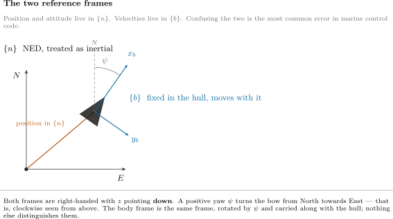

**Reading the figure**

| Element | Meaning |
|---|---|
| $x_n, y_n$ | North and East, fixed to the water |
| $\otimes$ at $o_n$ | $z_n$, Down, pointing into the page |
| $x_b, y_b$ | forward and starboard, painted on the hull and turning with it |
| dashed grey | the vessel's position, a vector expressed in $\{n\}$ |
| $\psi$ | the heading, measured from North to $x_b$ |

| Frame | Symbol | Origin | $x$ | $y$ | $z$ |
|---|---|---|---|---|---|
| North-East-Down | $\{n\}$ | a fixed point on the surface | North | East | Down |
| Body | $\{b\}$ | a point fixed in the hull, `otter.m` uses the midship waterline | forward | starboard | down through the keel |

- $\{n\}$ is treated as **inertial**: flat Earth, no rotation. For a two-metre vessel moving at three knots over a few hundred metres this is exact to far better than anything else in the model.
- $\{b\}$ **moves with the vessel**. It is the frame the sensors live in: a gyro measures $p, q, r$ in $\{b\}$, an accelerometer measures acceleration in $\{b\}$, and a propeller pushes along $x_b$.
- Both frames put $z$ **downward**. That is a marine convention and it has a consequence worth stating once: a positive yaw turns the bow from North towards East, which looks **clockwise** from above. Aerospace ENU conventions turn the other way, and mixing the two is a common source of a vessel that steers backwards.

> [!important] The division of labour
> **Position and attitude are expressed in $\{n\}$. Velocities are expressed in $\{b\}$.**
> $$\boldsymbol{\eta} = \begin{bmatrix} x & y & z & \phi & \theta & \psi \end{bmatrix}^{\!\top} \text{ in } \{n\}, \qquad \boldsymbol{\nu} = \begin{bmatrix} u & v & w & p & q & r \end{bmatrix}^{\!\top} \text{ in } \{b\}$$
> The whole of §1-2 to §1-5 exists to connect these two vectors. Nothing in those sections involves a mass or a force — it is geometry only, which is what the word **kinematics** means.

### NED and ENU — the other convention

- Not everyone uses NED. Most robotics software — ROS, Gazebo, and the VRX simulator this course reaches at the end — uses **ENU**: $x$ East, $y$ North, $z$ **Up**.

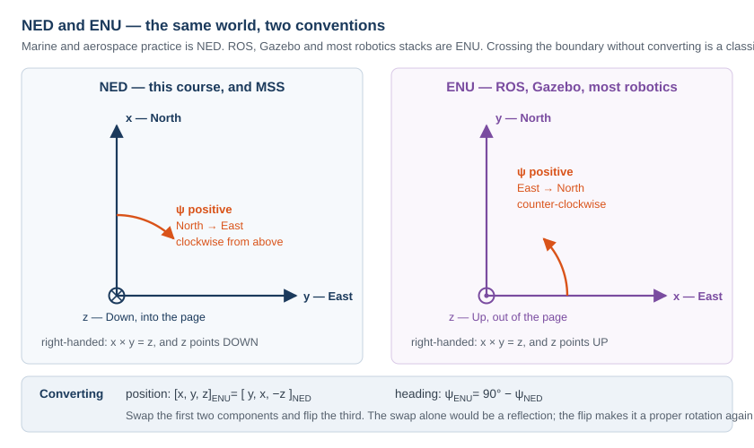

**Reading the figure**

| Element | Meaning |
|---|---|
| left panel | NED, used by this course, by MSS and by Fossen's Handbook |
| right panel | ENU, used by ROS, Gazebo and most robotics stacks |
| $\otimes$ / $\odot$ | the third axis going into the page / out of it |
| orange arc | the sense in which a positive heading is measured |

| | NED | ENU |
|---|---|---|
| $x$ | North | East |
| $y$ | East | North |
| $z$ | **Down** | **Up** |
| $\psi = 0$ points | North | East |
| positive $\psi$ | North → East, clockwise from above | East → North, counter-clockwise |

- The conversion is two operations:

$$
\begin{bmatrix} x \\ y \\ z\end{bmatrix}_{\text{ENU}}
=
\underbrace{\begin{bmatrix} 0 & 1 & 0 \\ 1 & 0 & 0 \\ 0 & 0 & -1 \end{bmatrix}}_{\mathbf{T},\ \det \mathbf{T} = +1}
\begin{bmatrix} x \\ y \\ z\end{bmatrix}_{\text{NED}},
\qquad
\psi_{\text{ENU}} = 90^\circ - \psi_{\text{NED}} .
$$

- Swapping the first two axes alone would be a **reflection**, $\det = -1$. Flipping the third restores $\det = +1$ and makes $\mathbf{T}$ a proper rotation — in fact a $180°$ turn about the axis $(1,1,0)/\sqrt2$.

> [!caution] This is a field failure, not a textbook curiosity
> A vessel whose autopilot is written in NED and whose simulator reports ENU turns the wrong way and drives to the mirror image of its waypoints. Nothing errors, nothing is `NaN`, and the track looks plausible until it is plotted against the plan. Convert at **one** place, at the boundary, and state which convention every interface uses.

## 1-2. Attitude — roll, pitch and yaw

- Three angles orient $\{b\}$ relative to $\{n\}$. Each is a rotation about one axis of the vessel.

| Angle | Symbol | Rotation about | Positive sense | What it looks like |
|---|---|---|---|---|
| roll | $\phi$ | $x_b$, the fore-aft axis | starboard side goes down | the vessel leans in a turn |
| pitch | $\theta$ | $y_b$, the athwartships axis | bow goes **up** | the vessel trims by the stern |
| yaw | $\psi$ | $z_b$, the vertical axis | bow swings towards starboard | the vessel changes heading |

- The three collected together are the **Euler angles**:

$$
\boldsymbol{\Theta} = \begin{bmatrix} \phi & \theta & \psi \end{bmatrix}^{\!\top} .
$$

> [!caution] Pitch positive is bow-up, even though $z$ points down
> With $z$ downward and a right-handed frame, a positive rotation about $y_b$ carries $z_b$ towards $x_b$ — which lifts the bow. The sign feels wrong the first time and is correct. `otter.m` reports a small negative $\theta$ at rest, because the payload trims the vessel slightly by the bow.

## 1-3. The rotation matrix

- A rotation matrix answers one question: **the same physical vector, expressed in the other frame, has which components?**

$$
\mathbf{v}^{n} = \mathbf{R}_b^n(\boldsymbol{\Theta})\, \mathbf{v}^{b}
$$

- The superscript is the frame the answer is in; the subscript is the frame the input came from. Reading $\mathbf{R}_b^n$ as "from $b$ to $n$" makes the index bookkeeping automatic, because adjacent indices cancel: $\mathbf{R}_1^n\mathbf{R}_2^1\mathbf{R}_b^2 = \mathbf{R}_b^n$.

### The three elementary rotations

$$
\mathbf{R}_x(\phi) =
\begin{bmatrix} 1 & 0 & 0 \\ 0 & c\phi & -s\phi \\ 0 & s\phi & c\phi \end{bmatrix},
\quad
\mathbf{R}_y(\theta) =
\begin{bmatrix} c\theta & 0 & s\theta \\ 0 & 1 & 0 \\ -s\theta & 0 & c\theta \end{bmatrix},
\quad
\mathbf{R}_z(\psi) =
\begin{bmatrix} c\psi & -s\psi & 0 \\ s\psi & c\psi & 0 \\ 0 & 0 & 1 \end{bmatrix}
$$

with $c\cdot = \cos(\cdot)$ and $s\cdot = \sin(\cdot)$. Each leaves its own axis alone — that is the column of $\pm 1$ — and mixes the other two.

### Composition, in the zyx order

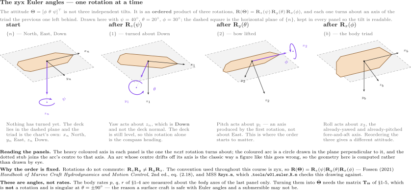

**Reading the figure**

| In the figure | Meaning |
|---|---|
| the deck plate | the vessel itself, drawn in the attitude reached so far |
| dashed grey square | the **horizontal plane of NED**, the same in all four panels. It is the ruler: the deck leaves it only once pitch and roll arrive |
| blue axis | the axis the **next** turn is about, with the turn drawn around it as a circle in the plane perpendicular to that axis |
| {n} → {1} | yaw $\psi$ about $z_n$. The deck turns but stays flat in the plane |
| {1} → {2} | pitch $\theta$ about $y_1$, the **already-yawed** athwartships axis. The bow lifts out of the plane — with $z_b$ down, positive $\theta$ is bow-up |
| {2} → {b} | roll $\phi$ about $x_2$, the **already-yawed and pitched** fore-aft axis. Positive $\phi$ puts starboard down |

- The figure is drawn from the actual rotation matrices, not sketched: each panel's axes are the columns of that stage's matrix. The three axes have equal length in space, so their differing lengths on the page are foreshortening.
- The point the figure is making: **the second and third axes do not exist until the turns before them have happened.** $y_1$ is not $y_n$, and $x_2$ is neither $x_n$ nor $x_1$.

$$
\boxed{\ \mathbf{R}_b^n(\boldsymbol{\Theta}) = \mathbf{R}_z(\psi)\,\mathbf{R}_y(\theta)\,\mathbf{R}_x(\phi)\ }
$$

- Written out:

$$
\mathbf{R}_b^n =
\begin{bmatrix}
c\psi\,c\theta & -s\psi\,c\phi + c\psi\,s\theta\,s\phi & s\psi\,s\phi + c\psi\,c\phi\,s\theta \\
s\psi\,c\theta & c\psi\,c\phi + s\phi\,s\theta\,s\psi & -c\psi\,s\phi + s\theta\,s\psi\,c\phi \\
-s\theta & c\theta\,s\phi & c\theta\,c\phi
\end{bmatrix}
$$

- This is exactly what MSS builds in `Rzyx(phi, theta, psi)`, and what `otter.m` calls through `eulerang`.

> [!warning] The order is part of the definition
> Matrix multiplication does not commute, so $\mathbf{R}_z\mathbf{R}_y\mathbf{R}_x \neq \mathbf{R}_x\mathbf{R}_y\mathbf{R}_z$. The same three numbers describe **different attitudes** under different conventions. Marine and aerospace practice is $zyx$; some robotics libraries default to something else. A stated convention is part of a stated attitude.

### Three properties, and what each is worth

| Property | Statement | Why it matters |
|---|---|---|
| orthogonal | $\mathbf{R}^{\!\top}\mathbf{R} = \mathbf{I}$ | the inverse is the **transpose**: $\mathbf{R}_n^b = (\mathbf{R}_b^n)^{-1} = (\mathbf{R}_b^n)^{\!\top}$ |
| unit determinant | $\det(\mathbf{R}) = +1$ | it is a rotation, not a reflection |
| length-preserving | $\lVert\mathbf{R}\mathbf{v}\rVert = \lVert\mathbf{v}\rVert$ | a change of frame never changes a speed |

- Measured on $\phi = 10°$, $\theta = 7°$, $\psi = 50°$ with the MSS implementation:

$$
\det(\mathbf{R}) = 1.0000000000,
\qquad
\max\left|\mathbf{R}^{\!\top}\mathbf{R} - \mathbf{I}\right| = 2.2\times10^{-16},
\qquad
\max\left|\mathbf{R}^{-1} - \mathbf{R}^{\!\top}\right| = 1.1\times10^{-16} .
$$

> [!tip] Never call `inv` on a rotation matrix
> The transpose is exact, costs nothing, and cannot be ill-conditioned. Every guidance law in this course produces an error in $\{n\}$ and hands it to a controller working in $\{b\}$, so $(\mathbf{R}_b^n)^{\!\top}$ appears far more often than $\mathbf{R}_b^n$ itself.

### The horizontal plane

- From Week 2 onward the vessel is treated as a 3-DOF craft and only the yaw rotation survives:

$$
\mathbf{R}(\psi) =
\begin{bmatrix}
\cos\psi & -\sin\psi \\
\sin\psi & \phantom{-}\cos\psi
\end{bmatrix},
\qquad
\begin{bmatrix} \dot{N} \\ \dot{E} \end{bmatrix}
= \mathbf{R}(\psi)\begin{bmatrix} u \\ v \end{bmatrix} .
$$

## 1-4. Body velocity is not the rate of change of position

- This is the single most important line of the week, and the one most often got wrong in code.

$$
u \neq \dot{N}, \qquad v \neq \dot{E} .
$$

- $u$ and $v$ are components **along axes that are themselves turning**. $\dot N$ and $\dot E$ are components along axes that never move. They coincide only at $\psi = 0$.

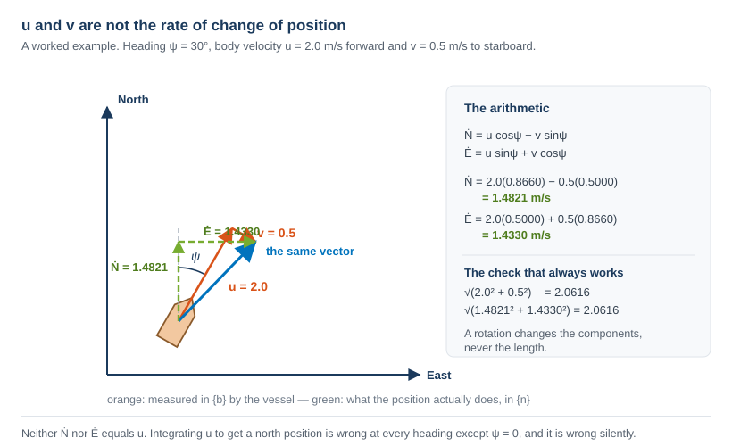

**Reading the figure**

| Element | Meaning |
|---|---|
| orange | $u$ and $v$, the components the vessel measures in $\{b\}$ |
| blue | the velocity itself — one physical vector, drawn once |
| green dashed | $\dot N$ and $\dot E$, the components that the position actually changes by |
| right-hand panel | the arithmetic, and the length check |

- Worked out for $\psi = 30°$, $u = 2.0$ m/s, $v = 0.5$ m/s:

$$
\begin{aligned}
\dot N &= u\cos\psi - v\sin\psi = 2.0(0.8660) - 0.5(0.5000) = 1.4821\ \text{m/s}, \\[3pt]
\dot E &= u\sin\psi + v\cos\psi = 2.0(0.5000) + 0.5(0.8660) = 1.4330\ \text{m/s}.
\end{aligned}
$$

| Quantity | Value |
|---|---|
| speed in $\{b\}$, $\sqrt{u^2+v^2}$ | $2.0616$ m/s |
| speed in $\{n\}$, $\sqrt{\dot N^2+\dot E^2}$ | $2.0616$ m/s |

- The two agree because a rotation preserves length. **That equality is the cheapest available check on any frame conversion**, and it catches a transposed or mis-signed matrix immediately.

> [!caution] The symptom of getting this wrong
> Integrating $u$ to obtain a north position gives a track that is correct at $\psi = 0$, plausible at small headings, and increasingly wrong as the vessel turns — with no error, no warning and no `NaN`. Week 1's model is deliberately run at three different headings so that the failure would be visible if it were there.

## 1-5. Angular velocity, and the matrix that is not a rotation

- First, what $p$, $q$ and $r$ are. Each is a rotation rate about **one axis of the hull**, and each is what a gyroscope bolted to that hull actually reports.

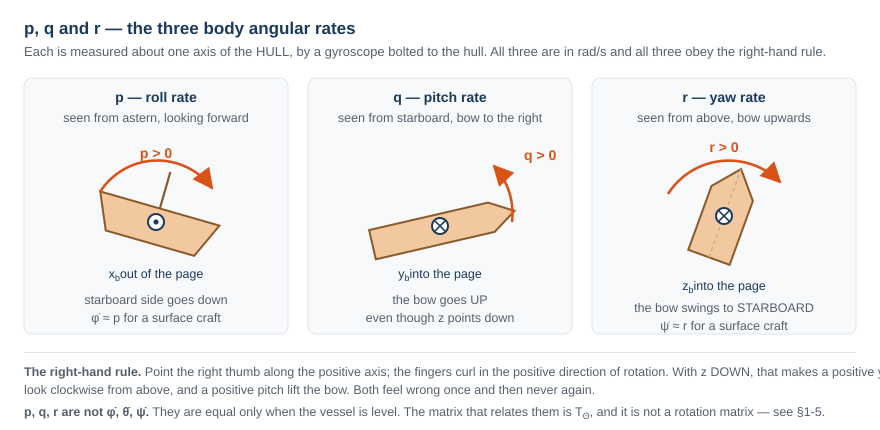

**Reading the figure**

| Panel | Rate | About | Positive means |
|---|---|---|---|
| left | $p$ | $x_b$ | starboard side goes down |
| centre | $q$ | $y_b$ | the bow goes up |
| right | $r$ | $z_b$ | the bow swings to starboard |

| Symbol | Quantity | Unit | Measured by |
|---|---|---|---|
| $p$ | roll rate | rad/s | gyro, $x$ axis |
| $q$ | pitch rate | rad/s | gyro, $y$ axis |
| $r$ | yaw rate | rad/s | gyro, $z$ axis |

- Now the conversion to Euler angle rates, and it is **not** a rotation matrix. The reason is short: $p$, $q$ and $r$ are measured about axes belonging to three **different** intermediate frames of §1-3, and those three axes are not mutually orthogonal.

$$
\dot{\boldsymbol{\Theta}} = \mathbf{T}_{\Theta}(\boldsymbol{\Theta})\,\boldsymbol{\omega}_{b/n}^{b},
\qquad
\mathbf{T}_{\Theta}(\boldsymbol{\Theta}) =
\begin{bmatrix}
1 & s\phi\,t\theta & c\phi\,t\theta \\
0 & c\phi & -s\phi \\
0 & s\phi / c\theta & c\phi / c\theta
\end{bmatrix}
$$

with $t\theta = \tan\theta$. Component by component:

$$
\dot\phi = p + q\,s\phi\,t\theta + r\,c\phi\,t\theta,
\qquad
\dot\theta = q\,c\phi - r\,s\phi,
\qquad
\dot\psi = \frac{q\,s\phi + r\,c\phi}{c\theta} .
$$

| Symbol | Quantity | Unit |
|---|---|---|
| $p, q, r$ | body angular rates, measured by the gyro | rad/s |
| $\dot\phi, \dot\theta, \dot\psi$ | Euler angle rates | rad/s |
| $\mathbf{T}_{\Theta}$ | the map between them | dimensionless |

- Measured with MSS `Tzyx` at $\phi = 10°$, $\theta = 7°$ and $[p, q, r] = [2, 5, 10]$ rad/s:

$$
\dot{\boldsymbol{\Theta}} = [3.3157,\ 3.1877,\ 10.7967]^{\!\top}\ \text{rad/s} .
$$

- Note that $\dot\psi = 10.7967 \neq r = 10$. **The yaw rate and the rate of change of heading are different numbers** whenever the vessel is rolled or pitched.

> [!warning] $\mathbf{T}_{\Theta}$ is singular at $\theta = \pm 90°$
> The $1/\cos\theta$ entries blow up: at $\theta = 89.9°$ the largest entry of $\mathbf{T}_{\Theta}$ is already $573$. This is **gimbal lock**, and it is a property of the Euler-angle representation, not of the vessel. A surface craft never approaches it, which is why this course uses Euler angles throughout. An AUV performing a vertical manoeuvre does approach it, and that is where quaternions earn their place.

> [!note] Two simplifications that hold for this vessel, and are stated rather than assumed
> For a surface craft $\phi$ and $\theta$ stay within a few degrees, so $\mathbf{T}_{\Theta} \approx \mathbf{I}$ and $\dot\psi \approx r$. Week 3 controls $\psi$ by integrating $r$ on exactly that basis. The twelve-state plant does **not** make the approximation; only the design equations do.

## 1-6. Kinematics and kinetics

- The word **dynamics** covers two different questions, and separating them is what makes the model tractable.

| | Question | Depends on | Sections |
|---|---|---|---|
| **kinematics** | if the vessel moves like *this*, where does it end up? | geometry only — no mass, no force | §1-2 to §1-5 |
| **kinetics** | what makes it move like that? | mass, added mass, damping, thrust | §1-7 onward |

- The two are stacked, and the whole model is these two lines:

$$
\underbrace{\dot{\boldsymbol{\eta}} = \mathbf{J}_{\Theta}(\boldsymbol{\eta})\,\boldsymbol{\nu}}_{\text{kinematics}},
\qquad
\underbrace{\mathbf{M}\dot{\boldsymbol{\nu}} + \mathbf{C}(\boldsymbol{\nu})\boldsymbol{\nu} + \mathbf{D}(\boldsymbol{\nu})\boldsymbol{\nu} + \mathbf{g}(\boldsymbol{\eta}) = \boldsymbol{\tau}}_{\text{kinetics}}
$$

$$
\mathbf{J}_{\Theta}(\boldsymbol{\eta}) =
\begin{bmatrix}
\mathbf{R}_b^n(\boldsymbol{\Theta}) & \mathbf{0}_{3\times3} \\
\mathbf{0}_{3\times3} & \mathbf{T}_{\Theta}(\boldsymbol{\Theta})
\end{bmatrix}
$$

- $\mathbf{J}_{\Theta}$ is just §1-3 and §1-5 stacked: $\mathbf{R}_b^n$ for the velocities, $\mathbf{T}_{\Theta}$ for the rates.

> [!note] Why the split matters in practice
> The kinematics is **exact** — it is geometry, and no coefficient in it was ever measured. Every uncertainty in a marine model lives in the kinetics: in $\mathbf{M}$, $\mathbf{C}$, $\mathbf{D}$ and $\boldsymbol{\tau}$. When a simulation disagrees with a trial, the kinematics is not the place to look.

## 1-7. Six degrees of freedom, four, and three

- A free rigid body has **six** degrees of freedom. Marine practice names them:

| DOF | Motion | Linear or angular | State | Unit |
|---|---|---|---|---|
| 1 | surge | translation along $x_b$ | $u$ | m/s |
| 2 | sway | translation along $y_b$ | $v$ | m/s |
| 3 | heave | translation along $z_b$ | $w$ | m/s |
| 4 | roll | rotation about $x_b$ | $p$ | rad/s |
| 5 | pitch | rotation about $y_b$ | $q$ | rad/s |
| 6 | yaw | rotation about $z_b$ | $r$ | rad/s |

- Each degree of freedom carries **three quantities that belong together**: the force or moment that drives it, the velocity that force produces, and the position that velocity integrates to.

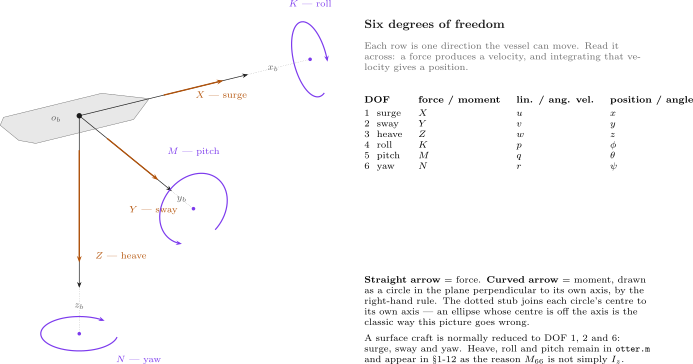

| In the figure | Meaning |
|---|---|
| straight orange arrow | a **force** along that body axis — $X$, $Y$, $Z$, in newtons |
| curved purple arrow | a **moment** about that body axis — $K$, $M$, $N$, in newton-metres. It is drawn as a circle lying in the plane **perpendicular to its own axis**, which is why the three ellipses look different: $K$ is seen almost edge-on, $N$ lies flat and parallel to the deck |
| dashed grey line | the body axis, continued out to the centre of its own moment ellipse. The centre sits **on** the axis — that is what "a moment about this axis" means |
| the table on the right | one row per degree of freedom, read across |
| $\{b\}$ and $\{n\}$ | $\boldsymbol{\tau}$ and $\boldsymbol{\nu}$ are body-frame quantities. Only $\boldsymbol{\eta}$ is in NED — the point of §1-4 |

- Read one row at a time. A surge force $X$ produces a surge velocity $u$; $u$ then integrates to the north position $x$ — but through the rotation matrix of §1-3, never directly.
- The right-hand rule fixes every sign at once. With $z_b$ pointing **down**, a positive yaw moment $N$ turns the bow to starboard, so $\psi$ increases clockwise when seen from above.
- The three arrows on each axis also explain the naming: $X, Y, Z$ are forces and $K, M, N$ are moments, in the order surge–sway–heave–roll–pitch–yaw. That order is fixed and every marine text uses it.

### The 6-DOF equation, written out

$$
\mathbf{M}\dot{\boldsymbol{\nu}}_r + \mathbf{C}(\boldsymbol{\nu}_r)\boldsymbol{\nu}_r + \mathbf{D}(\boldsymbol{\nu}_r)\boldsymbol{\nu}_r + \mathbf{g}(\boldsymbol{\eta}) = \boldsymbol{\tau},
\qquad
\boldsymbol{\nu} = [u\ v\ w\ p\ q\ r]^{\!\top}
$$

with every matrix $6\times6$:

$$
\mathbf{M} = \underbrace{\mathbf{M}_{RB}}_{\text{the hull}} + \underbrace{\mathbf{M}_{A}}_{\text{the water it drags}},
\qquad
\mathbf{C} = \mathbf{C}_{RB} + \mathbf{C}_{A},
\qquad
\mathbf{D} = \underbrace{\mathbf{D}_{L}}_{\text{linear}} + \underbrace{\mathbf{D}_{NL}(\boldsymbol{\nu}_r)}_{\text{quadratic}}
$$

| Term | What it is | Where it comes from |
|---|---|---|
| $\mathbf{M}_{RB}$ | mass and inertia of the vessel | weighing and measuring it |
| $\mathbf{M}_{A}$ | added mass — water accelerated with the hull | hydrodynamics; **not** a small correction |
| $\mathbf{C}_{RB}$, $\mathbf{C}_{A}$ | Coriolis and centripetal | a consequence of writing $\boldsymbol{\nu}$ in a rotating frame |
| $\mathbf{D}$ | damping — skin friction, then cross-flow drag | measured, or estimated from strip theory |
| $\mathbf{g}(\boldsymbol{\eta})$ | restoring | weight and buoyancy acting at different points |
| $\boldsymbol{\tau}$ | control force | $\mathbf{B}\mathbf{f}$, §1-9 and Appendix A1 |

- $\boldsymbol{\nu}_r = \boldsymbol{\nu} - \boldsymbol{\nu}_c$ is the velocity **relative to the water**. Hydrodynamic forces feel relative velocity, not ground velocity. Dormant this week ($V_c = 0$); §1-13 shows exactly where it enters `otter.m`.

### Reducing to 3 DOF

- Most vessels are not actuated in all six directions, so most control design is done on a reduced model. The standard reductions:

| Model | States | Used for |
|---|---|---|
| 1 DOF | $u$, or $r$, or $p$ alone | speed controller, heading autopilot, roll damping |
| **3 DOF horizontal** | $u, v, r$ | **DP, path following, trajectory tracking — ships and surface craft** |
| 3 DOF longitudinal | $u, w, q$ | diving and pitch control of a submersible |
| 3 DOF lateral | $v, p, r$ | turning and heading of a vessel that rolls |
| 4 DOF | $u, v, p, r$ | manoeuvring where **roll must be actively damped** — fins, rudders, anti-roll tanks |
| 6 DOF | all | simulation, and control of a vehicle actuated in all six — an AUV |

- The 3-DOF horizontal model keeps surge, sway and yaw:

$$
\mathbf{M}\dot{\boldsymbol{\nu}} + \mathbf{C}(\boldsymbol{\nu})\boldsymbol{\nu} + \mathbf{D}(\boldsymbol{\nu})\boldsymbol{\nu} = \boldsymbol{\tau},
\qquad
\boldsymbol{\nu} = \begin{bmatrix} u \\ v \\ r \end{bmatrix},
\qquad
\boldsymbol{\tau} = \begin{bmatrix} X \\ Y \\ N \end{bmatrix}
$$

$$
\mathbf{M} =
\begin{bmatrix}
m - X_{\dot u} & 0 & 0 \\
0 & m - Y_{\dot v} & m x_g - Y_{\dot r} \\
0 & m x_g - N_{\dot v} & I_z - N_{\dot r}
\end{bmatrix},
\qquad
\mathbf{D} = -
\begin{bmatrix}
X_u & 0 & 0 \\
0 & Y_v & Y_r \\
0 & N_v & N_r
\end{bmatrix}
$$

$$
\mathbf{C}(\boldsymbol{\nu}) =
\begin{bmatrix}
0 & 0 & -m\left(x_g r + v\right) \\
0 & 0 & m u \\
m\left(x_g r + v\right) & -m u & 0
\end{bmatrix}
$$

- Note the structure: surge decouples from sway and yaw, while **sway and yaw stay coupled** through $x_g$ — the centre of gravity being off the origin. Appendix A1 measures exactly that coupling on this vessel.
- $\mathbf{g}(\boldsymbol{\eta})$ disappears: a surface craft has no restoring force in surge, sway or yaw. Nothing pushes it back to a preferred heading or position.

> [!important] What justifies dropping three degrees of freedom
> Not convenience. Three conditions, and all three hold for the Otter:
> 1. **No actuation.** The propellers produce no heave, roll or pitch moment, so those motions cannot be commanded.
> 2. **Strong restoring.** Heave, roll and pitch are stiff, well-damped and self-righting: buoyancy pulls them back. They oscillate briefly and return. Surge, sway and yaw have no restoring force at all, so they integrate freely and must be controlled.
> 3. **Weak coupling.** The residual coupling into the horizontal plane is small compared with thrust and damping.
>
> A model that keeps them anyway is not wrong, only larger. `otter.m` keeps all six for exactly that reason, and this week measures how small the discarded ones are, rather than assuming it.

> [!note] When 4 DOF is the right answer
> A ship with a high centre of gravity in a beam sea rolls enough that roll is no longer a fast, self-correcting nuisance. Adding the roll equation to the 3-DOF model gives 4 DOF, and that is the model used when rudder-roll damping or anti-roll tanks are designed. The Otter is a catamaran: wide, shallow, and stiff in roll. Three is enough.

## 1-8. The equation of motion, as `otter.m` implements it

- The 6-DOF equation of a marine craft in the form used throughout Fossen's Handbook:

$$
\mathbf{M}\dot{\boldsymbol{\nu}}_r
+ \mathbf{C}(\boldsymbol{\nu}_r)\boldsymbol{\nu}_r
+ \mathbf{D}(\boldsymbol{\nu}_r)\boldsymbol{\nu}_r
+ \mathbf{g}(\boldsymbol{\eta})
= \boldsymbol{\tau}
$$

| Term | Name | What it models |
|---|---|---|
| $\mathbf{M} = \mathbf{M}_{RB} + \mathbf{M}_A$ | mass | the hull's own inertia, plus the water accelerated with it |
| $\mathbf{C}(\boldsymbol{\nu}_r)$ | Coriolis and centripetal | the apparent forces produced by describing motion in a rotating frame |
| $\mathbf{D}(\boldsymbol{\nu}_r)$ | damping | linear skin friction, plus quadratic cross-flow drag |
| $\mathbf{g}(\boldsymbol{\eta})$ | restoring | buoyancy and weight acting through different points |
| $\boldsymbol{\tau}$ | control force | what the thrusters produce |

- $\boldsymbol{\nu}_r = \boldsymbol{\nu} - \boldsymbol{\nu}_c$ is the velocity **relative to the water**. Hydrodynamic forces depend on relative velocity, not on ground velocity. This distinction is dormant this week, because the current is set to zero. §1-13 works it through line by line, Week 4 §4-7 pays for it with a permanent path error, and Week 6 adds wind and waves beside it.

> [!important] The added mass is not a correction term
> For the Otter, $-X_{\dot u} = 5.50$ kg against a hull-plus-payload mass of $80.0$ kg, so the water contributes $6.4\%$ of the effective surge inertia. In sway it contributes far more, $-Y_{\dot v} = 82.5$ kg against the same $80.0$ kg. It is part of the model, not a refinement of it.

### Term by term, against the source

- The equation above is not a description of `otter.m`; it **is** `otter.m`. Every symbol has one line of code, and the table below is the whole file in the order it executes. Line numbers refer to `Tools/MSS/VESSELS/otter.m`.

| Line | Equation | `otter.m` |
|---|---|---|
| 79–81 | $u_c = V_c\cos(\beta_c - \psi)$, $v_c = V_c\sin(\beta_c-\psi)$, $\boldsymbol{\nu}_r = \boldsymbol{\nu} - \boldsymbol{\nu}_c$ | `u_c = V_c*cos(beta_c-eta(6));`  `nu_r = nu - [u_c v_c 0 0 0 0]';` |
| 88 | $\mathbf{I}_g$ about the origin, from the CG | `Ig = Ig_CG - m*Smtrx(rg)^2 - mp*Smtrx(rp)^2;` |
| 103–109 | $\mathbf{M}_{RB}$, $\mathbf{C}_{RB}$, moved from CG to CO | `MRB = H'*MRB_CG*H;`  `CRB = H'*CRB_CG*H;` |
| 112–119 | $\mathbf{M}_A = -\operatorname{diag}(X_{\dot u},\dots,N_{\dot r})$ | `MA = -diag([Xudot, Yvdot, Zwdot, Kpdot, Mqdot, Nrdot]);` |
| 120 | $\mathbf{C}_A(\boldsymbol{\nu}_r)$ from $\mathbf{M}_A$ | `CA = m2c(MA, nu_r);` |
| 124–126 | $\mathbf{M} = \mathbf{M}_{RB}+\mathbf{M}_A$, $\mathbf{C} = \mathbf{C}_{RB}+\mathbf{C}_A$ | `M = MRB + MA;`  `C = CRB + CA;` |
| 174–181 | $\boldsymbol{\tau} = \mathbf{B}\mathbf{K}\mathbf{u}$, §1-10 | `tau = [Thrust(1)+Thrust(2) 0 0 0 0 -l1*Thrust(1)-l2*Thrust(2)]';` |
| 184–191 | linear damping, $N_h = N_r(1+10\lvert r\rvert)r$ | `Xh = Xu*nu_r(1);` … `Nh = Nr*(1+10*abs(nu_r(6)))*nu_r(6);` |
| 194 | quadratic cross-flow drag | `tau_crossflow = crossFlowDrag(L,B_pont,T,nu_r);` |
| 197 | trim, the ballast moment $\mathbf{g}_0$ | `g_0 = [0 0 0 0 trim_moment 0]';` |
| 200 | $\mathbf{J}(\boldsymbol{\eta})$, the kinematic transform of §1-3 | `J = eulerang(eta(4),eta(5),eta(6));` |

### The last line: from the equation to $\dot{\mathbf{x}}$

- Solving the equation of motion for the acceleration and stacking it on the kinematics gives the twelve-element derivative the integrator needs:

$$
\dot{\mathbf{x}} =
\begin{bmatrix} \dot{\boldsymbol{\nu}} \\[4pt] \dot{\boldsymbol{\eta}} \end{bmatrix}
=
\begin{bmatrix}
\mathbf{M}^{-1}\left(\boldsymbol{\tau} + \boldsymbol{\tau}_{\text{damp}} + \boldsymbol{\tau}_{\text{cross}} - \mathbf{C}\boldsymbol{\nu}_r - \mathbf{G}\boldsymbol{\eta} - \mathbf{g}_0\right) \\[4pt]
\mathbf{J}(\boldsymbol{\eta})\,\boldsymbol{\nu}
\end{bmatrix}
$$

```matlab
xdot = [ M \ ( tau + tau_damp + tau_crossflow - C * nu_r - G * eta - g_0)
         J * nu ];
```

| In the equation | In the code | Note |
|---|---|---|
| $\mathbf{M}^{-1}(\cdot)$ | `M \ (...)` | a **solve**, never `inv(M)*(...)` — faster and better conditioned |
| $-\mathbf{C}\boldsymbol{\nu}_r$, $\boldsymbol{\tau}_{\text{damp}}$, $\boldsymbol{\tau}_{\text{cross}}$ | evaluated at `nu_r` | forces feel the **water** |
| $\mathbf{J}(\boldsymbol{\eta})\boldsymbol{\nu}$ | `J * nu` | position moves over the **ground** |

> [!important] The two velocities in one line are the whole of Week 1
> The top block uses $\boldsymbol{\nu}_r$ and the bottom block uses $\boldsymbol{\nu}$. Everything §1-4 said about body velocity not being a position rate, and everything §1-13 will say about currents, is contained in that single asymmetry. If both blocks used the same velocity, a current could not move a vessel and a heading could not differ from a course.

- Note the sign convention: the code writes `tau + tau_damp` with $X_u < 0$, so the damping term is negative when $u > 0$ and the plus sign in the code is not a sign error. Fossen's textbook form moves $\mathbf{D}\boldsymbol{\nu}_r$ to the left-hand side instead. The two are the same equation.

## 1-9. The Otter, and its twelve states

- `otter.m` integrates a reduced 6-DOF model and returns a **twelve**-element state derivative. The state is the stacked pair $[\boldsymbol{\nu}^{\!\top}, \boldsymbol{\eta}^{\!\top}]^{\!\top}$:

$$
\mathbf{x} =
\begin{bmatrix}
\underbrace{u\;\; v\;\; w\;\; p\;\; q\;\; r}_{\boldsymbol{\nu},\ \text{in } \{b\}} \;\;
\underbrace{x\;\; y\;\; z}_{\text{position},\ \{n\}} \;\;
\underbrace{\phi\;\; \theta\;\; \psi}_{\text{attitude},\ \{n\}}
\end{bmatrix}^{\!\top}
$$

| Index | Symbol | Meaning | Frame | Unit | Excited this week |
|---|---|---|---|---|---|
| 1 | $u$ | surge velocity | $\{b\}$ | m/s | yes |
| 2 | $v$ | sway velocity | $\{b\}$ | m/s | yes, indirectly — see §1-12 |
| 3 | $w$ | heave velocity | $\{b\}$ | m/s | negligible |
| 4 | $p$ | roll rate | $\{b\}$ | rad/s | negligible |
| 5 | $q$ | pitch rate | $\{b\}$ | rad/s | small, through the trim moment |
| 6 | $r$ | yaw rate | $\{b\}$ | rad/s | yes |
| 7 | $x$ | north position | $\{n\}$ | m | yes |
| 8 | $y$ | east position | $\{n\}$ | m | yes |
| 9 | $z$ | down position | $\{n\}$ | m | negligible |
| 10 | $\phi$ | roll | $\{n\}$ | rad | negligible |
| 11 | $\theta$ | pitch | $\{n\}$ | rad | small |
| 12 | $\psi$ | yaw | $\{n\}$ | rad | yes |

> [!warning] Every angle in the state vector is in **radians**
> `otter.m` works in radians throughout; only the setup scripts and the plots use degrees. A heading typed as `60` rather than `deg2rad(60)` is a command of $60$ radians, or nine and a half full turns. The models in this course convert once, at the command block, and never again.

- The states that matter for guidance and control are therefore $\{u, v, r, x, y, \psi\}$ — six of the twelve. From Week 2 onward the vessel is treated as a 3-DOF craft, and the discarded states are justified by their magnitude rather than by assumption.
- The heave, roll and pitch states are retained in the plant because they contribute to the restoring and trim terms. They are computed and then not used.

### Hull constants

All values below are read directly from `Tools/MSS/VESSELS/otter.m`.

| Symbol | Value | Meaning | Source |
|---|---|---|---|
| $m + m_p$ | $80.0$ kg | hull mass plus payload | `otter.m`, `m = 55`, `mp = 25` |
| $L$ | $2.00$ m | length | `otter.m` |
| $B$ | $1.08$ m | beam | `otter.m` |
| $T$ | $0.195$ m | draft, computed from displacement | `otter.m` |
| $y_{\text{pont}}$ | $0.395$ m | half distance between pontoons | `otter.m` |
| $-X_{\dot u}$ | $5.50$ kg | surge added mass | `Xudot = -0.1*m`, with $m = 55$ **hull only** |
| $M_{11}$ | $85.50$ kg | surge mass including added mass | $(m + m_p) - X_{\dot u}$ |
| $I_z$ | $15.10$ kg·m² | yaw inertia about the CG | `Ig(3,3)` |
| $-N_{\dot r}$ | $25.67$ kg·m² | yaw added inertia | `Nrdot = -1.7*Ig(3,3)` |
| $M_{66}$ | $42.65$ kg·m² | yaw inertia about the origin, including added mass | `M(6,6)` |
| $X_u$ | $-77.55$ N per m/s | linear surge damping | $-24.4\,g / U_{\max}$ |
| $Y_v$ | $0$ | linear sway damping — **there is none** | `Yv = 0` |
| $N_r$ | $-42.65$ | linear yaw damping | $-M_{66}/T_{\text{yaw}}$, $T_{\text{yaw}} = 1$ s |
| $U_{\max}$ | $3.086$ m/s | design speed, 6 knots | `otter.m` |

> [!caution] $M_{66}$ is not $I_z - N_{\dot r}$
> Adding the two inertia entries gives $15.10 + 25.67 = 40.78$ kg·m², which is **not** the value `otter.m` uses. The rigid-body matrix is built at the centre of gravity and then transferred to the origin of $\{b\}$, and the payload puts the CG at $x_g = 0.153$ m rather than at the origin. The transfer adds $(m + m_p)x_g^2 = 1.87$ kg·m². The correct figure is $42.65$, and it propagates into $N_r$ as well. Week 3 sizes a controller from this number, so the 4.6% difference is not cosmetic.

> [!note] One damping term is not linear
> The yaw damping applied in `otter.m` is $N_h = N_r\!\left(1 + 10|r|\right) r$, not $N_r r$. The extra factor is dormant at low turn rates and dominant at high ones. It is recorded here and exploited in Week 3, where it makes large heading changes overshoot **less** than small ones — behaviour a linear model cannot produce.

## 1-10. From propeller speed to force

- Before any arithmetic, the layout. The Otter is a catamaran with one propeller in each pontoon, both bolted facing forward.

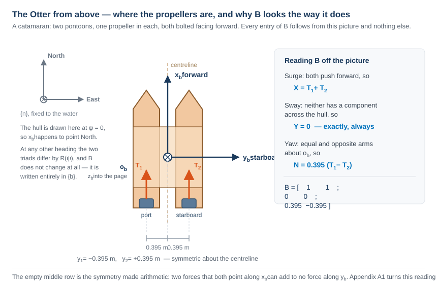

**Reading the figure**

| Element | Meaning |
|---|---|
| $x_b$, $y_b$ | the body axes, with the origin $o_b$ at midship on the centreline |
| blue rectangles | the two propellers, one per pontoon |
| orange arrows | their thrust, both along $+x_b$ — neither can push sideways |
| $\mp 0.395$ m | the moment arms, equal and opposite about the centreline |
| grey triad | $\{n\}$, drawn at $\psi = 0$ so the two frames happen to coincide |

- Three readings come straight off the picture, and they are the three rows of $\mathbf{B}$:

| Row | Because | Result |
|---|---|---|
| surge | both thrusts point along $+x_b$ | $X = T_1 + T_2$ |
| sway | neither has any component along $y_b$ | $Y = 0$, exactly and always |
| yaw | the arms are $\mp y_{\text{pont}}$ about $o_b$ | $N = y_{\text{pont}}(T_1 - T_2)$ |

> [!important] $\mathbf{B}$ is written entirely in $\{b\}$
> The layout drawing does not change when the vessel turns, so neither does $\mathbf{B}$. The heading enters the problem once, in the kinematics of §1-4, and never inside the actuator model. That separation is why $\mathbf{B}$ can be a constant matrix at all.

- Each propeller produces thrust that scales with the square of shaft speed, with a **different coefficient in each direction**:

$$
T_i =
\begin{cases}
k_{\text{pos}}\, n_i |n_i|, & n_i \ge 0 \\[2pt]
k_{\text{neg}}\, n_i |n_i|, & n_i < 0
\end{cases}
$$

| Symbol | Value | Meaning | Source |
|---|---|---|---|
| $k_{\text{pos}}$ | $0.011080$ | forward bollard coefficient, one propeller | `otter.m`, `0.02216/2` |
| $k_{\text{neg}}$ | $0.006445$ | reverse bollard coefficient | `otter.m`, `0.01289/2` |
| $k_{\text{pos}}/k_{\text{neg}}$ | $1.719$ | forward-to-reverse asymmetry | derived |
| $n_{\max}$ | $103.9$ rad/s | saturation, forward | `otter.m` |
| $n_{\min}$ | $-101.7$ rad/s | saturation, reverse | `otter.m` |

- The asymmetry is physical. A marine propeller has camber and a defined leading edge, so running it backwards presents the wrong face to the flow, for the same reason that a wing flown backwards is a poor wing.

- The two propellers sit on the pontoons at $y = \pm y_{\text{pont}}$, both pointing forward, so

$$
\boldsymbol{\tau} =
\begin{bmatrix} X \\ Y \\ N \end{bmatrix}
=
\begin{bmatrix}
1 & 1 \\
0 & 0 \\
y_{\text{pont}} & -y_{\text{pont}}
\end{bmatrix}
\begin{bmatrix} T_1 \\ T_2 \end{bmatrix}
= \mathbf{B}\,\mathbf{f}
$$

- The middle row is **exactly zero**, and $\operatorname{rank}(\mathbf{B}) = 2$. Appendix A1 derives this matrix from a general rule and shows what it costs; this week only records that the row is empty.

> [!important] Zero is not a small number
> $Y = 0$ is a statement about where the propellers are bolted, not about how large a force they make. No gain, no controller and no propeller speed can produce a sideways force on this hull. Week 9 meets this fact again as a hard limit on what can be controlled.

### The whole chain, from revolutions to generalised force

- The two steps above compose into the form used throughout the marine literature, in which every factor has a name and only the last one depends on the command:

$$
\boldsymbol{\tau}
= \underbrace{\mathbf{B}}_{\substack{\text{actuator} \\ \text{configuration}}}
\;\underbrace{\mathbf{K}}_{\substack{\text{thrust} \\ \text{coefficients}}}
\;\underbrace{\mathbf{u}}_{\substack{\text{control} \\ \text{variable}}},
\qquad
\mathbf{u} = \begin{bmatrix} n_1|n_1| \\ n_2|n_2| \end{bmatrix},
\qquad
\mathbf{K} = \begin{bmatrix} k_1 & 0 \\ 0 & k_2 \end{bmatrix}
$$

- Written out for the Otter, this is the complete answer to *what does a shaft speed do to the vessel*:

$$
\begin{bmatrix} X \\ Y \\ N \end{bmatrix}
=
\begin{bmatrix} 1 & 1 \\ 0 & 0 \\ y_p & -y_p \end{bmatrix}
\begin{bmatrix} k_1 & 0 \\ 0 & k_2 \end{bmatrix}
\begin{bmatrix} n_1|n_1| \\ n_2|n_2| \end{bmatrix}
=
\begin{bmatrix}
k_1 n_1|n_1| + k_2 n_2|n_2| \\
0 \\
y_p\left(k_1 n_1|n_1| - k_2 n_2|n_2|\right)
\end{bmatrix}
$$

| Factor | What it is | Depends on |
|---|---|---|
| $\mathbf{B}$ | where the thrusters are and which way they point | the **geometry** — fixed for a given hull |
| $\mathbf{K}$ | how much thrust a unit of $n\lvert n\rvert$ buys | the **propellers** — and $k_i$ switches with the sign of $n_i$ |
| $\mathbf{u}$ | the squared-with-sign shaft speed | the **command** — the only thing a controller changes |

> [!note] Why $n\lvert n\rvert$ and not $n^2$
> $n^2$ throws the sign away and a reversed propeller would still push forward. The product $n\lvert n\rvert$ keeps the quadratic magnitude and the sign of $n$, which is why it, and not $n$ itself, is called the control variable.

- Two consequences follow immediately, and both are measured in Part 2:

| | |
|---|---|
| **the map is nonlinear** | doubling $n$ quadruples the thrust. A controller that assumes a linear actuator will be twice as aggressive at high speed as at low |
| **the map is not odd** | $k_1 \neq k_2$ when the signs differ, so $n = [+60, -60]$ does **not** give $X = 0$ |

- The MSS source states the same thing in one line, with the moment arms $l_1 = -y_p$ and $l_2 = +y_p$ (`otter.m` line 181):

```matlab
tau = [Thrust(1) + Thrust(2)  0 0 0 0  -l1*Thrust(1) - l2*Thrust(2)]';
```

- Substituting the arms gives $N = y_p T_1 - y_p T_2$, which is the third row above. The lecture and the source agree term by term.

## 1-11. Surge alone — a first-order system

- Retaining only the surge equation, with no rotation and no current:

$$
M_{11}\,\dot{u} = X + X_u u,
\qquad
M_{11} = (m + m_p) - X_{\dot u}
$$

- This is a first-order lag. Two numbers describe it completely:

$$
\tau_u = \frac{M_{11}}{|X_u|} = \frac{85.50}{77.55} = 1.1025\ \text{s},
\qquad
K_u = \frac{1}{|X_u|} = 0.012894\ \frac{\text{m/s}}{\text{N}}
$$

- The prediction is checkable. Integrating the full twelve-state plant from rest under $n = [60, 60]$ and reading the instant at which $u$ reaches $63.2\%$ of its terminal value gives **1.1064 s**, which is $0.35\%$ above the first-order figure. The residue is the surge-pitch coupling in $\mathbf{M}$, retained by the plant and discarded by this equation.

- Setting $\dot u = 0$ gives the terminal speed for a constant command:

$$
u_{ss} = \frac{X}{|X_u|} = \frac{2\,k_{\text{pos}}\, n|n|}{|X_u|}
$$

- **Quadratic thrust against linear damping.** Doubling the shaft speed quadruples the force and therefore quadruples the terminal speed. This is the prediction tested in Part 2.

## 1-12. Sway velocity without sway force

- Section 1-5 established $Y \equiv 0$. Nevertheless the simulation of a turning vessel shows $v \neq 0$. The two statements are not in conflict.
- The sway equation contains a Coriolis term. Writing only the terms that survive in the horizontal plane:

$$
M_{22}\,\dot{v} + \underbrace{(m - X_{\dot u})\,u\,r}_{\text{Coriolis}} + \underbrace{Y_{\text{cf}}(v, r)}_{\text{cross-flow drag}} = Y = 0
$$

- A vessel that is moving forward **and** rotating acquires a lateral velocity even with no lateral force, because the velocity vector is being rotated within the body frame.

> [!note] There is no linear sway damping in this hull
> `otter.m` sets `Yv = 0`. Everything that resists sideways motion comes from the cross-flow drag integral `crossFlowDrag`, which is quadratic in the local transverse velocity and therefore vanishes to second order at small $v$. The steady sway velocity is the point where Coriolis and cross-flow drag balance, and no linear term participates.

- A second mechanism produces sideways motion, and it acts even at rest. The mass matrix is not diagonal: $M_{26} = 12.25$ kg·m, because the payload places the centre of gravity forward of the origin of $\{b\}$. A **pure yaw moment therefore produces a sway acceleration**, $\dot{v} = -1.305 \times 10^{-3}$ m/s² per N·m, with no sway force anywhere in the problem. Appendix A1 measures this directly.
- The two mechanisms occupy different regimes. The mass coupling acts on $\dot v$ and dominates the first instants; the Coriolis term acts on $v$ and sets the steady value, since $\dot v = 0$ removes $\mathbf{M}$ from the balance entirely.
- The angle between where the vessel points and where it actually travels is the **crab angle**

$$
\beta = \operatorname{atan2}(v, u), \qquad \chi = \psi + \beta
$$

where $\chi$ is the course angle. Week 4 §4-7 shows that a guidance law which regulates $\psi$ while the vessel travels along $\chi$ leaves a permanent path error, and measures it as $\Delta\tan\beta_c$.

## 1-13. Ocean current — a velocity, not a force

- Section 1-12 produced a drift from the vessel's own rotation. A current produces one without the vessel doing anything at all, and it is the last thing needed before Part 2.

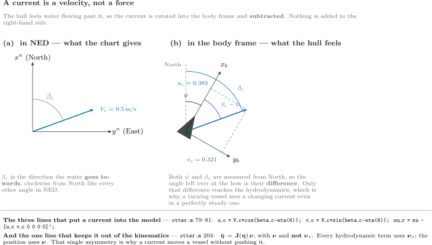

**Reading the figure**

| Element | Meaning |
|---|---|
| left panel | the current as a chart gives it: a speed $V_c$ and a direction $\beta_c$ measured **clockwise from north**, like every other angle in NED |
| $\beta_c$ | the direction the water **goes towards**. $\beta_c = 0$ sets the water north |
| right panel | the same current after rotation into $\{b\}$, resolved into $u_c$ and $v_c$ |
| $\beta_c - \psi$ | the angle the flow makes with the hull. Only this difference matters to the hydrodynamics |
| the box | the three lines that put a current into the model, and the one line that keeps it out of the kinematics |

### How it enters

- A current is **not** a force added to the right-hand side. It is subtracted from the velocity, because a hull does not feel a compass direction — it feels water flowing past it:

$$
u_c = V_c\cos(\beta_c - \psi),
\qquad
v_c = V_c\sin(\beta_c - \psi),
\qquad
\boldsymbol{\nu}_r = \boldsymbol{\nu} - \boldsymbol{\nu}_c
$$

- The heading appears in the rotation, so a turning vessel sees a **changing** current in its own frame even when the current is perfectly steady.

### The asymmetry that makes drift possible

- From §1-8, `otter.m` uses the two velocities in different places, and this is the entire mechanism:

| Uses $\boldsymbol{\nu}_r$ — through the water | Uses $\boldsymbol{\nu}$ — over the ground |
|---|---|
| linear damping $\mathbf{D}\boldsymbol{\nu}_r$ | the kinematics $\dot{\boldsymbol{\eta}} = \mathbf{J}(\boldsymbol{\eta})\boldsymbol{\nu}$ |
| cross-flow drag | |
| Coriolis $\mathbf{C}\boldsymbol{\nu}_r$ | |

> [!important] A current moves a vessel without pushing it
> Every force in the model is computed from $\boldsymbol{\nu}_r$, so in a steady current the force balance is **identical** to the one in still water and the vessel settles at the same speed *through the water*. But the position integrates $\boldsymbol{\nu}$, which is larger or smaller or sideways. The vessel is carried, not pushed. Part 2 §E measures both halves of that sentence.

- Two consequences, both measured in §E:

| Current | What happens |
|---|---|
| fore-and-aft ($\beta_c = 0°$ or $180°$) | the track stays straight; only the **ground speed** changes, by exactly $\pm V_c$ |
| on the beam | the track leaves the heading by a drift angle, and cross-flow drag on $v_r$ makes a yaw moment that slowly **turns the hull into the flow** — with no command given |

- The second is the same crab angle as §1-12, arriving by a different route. Week 4 has to steer around both at once.

### The same thing in `otter.m`, line by line

- The four steps above are four blocks of code in one file. Line numbers are from the MSS 2021 release of `VESSELS/otter.m`, the copy `_tools/mss_path.m` puts on the path.

**Step 1 — build the current in the body frame** (lines 79–81)

$$
u_c = V_c\cos(\beta_c - \psi),
\qquad
v_c = V_c\sin(\beta_c - \psi),
\qquad
\boldsymbol{\nu}_c = \begin{bmatrix} u_c & v_c & 0 & 0 & 0 & 0\end{bmatrix}^\top
$$

```matlab
u_c = V_c * cos(beta_c - eta(6));           % current surge velocity
v_c = V_c * sin(beta_c - eta(6));           % current sway velocity
nu_r = nu - [u_c v_c 0 0 0 0]';             % relative velocity vector
```

| Piece of code | What it is doing |
|---|---|
| `eta(6)` | the heading $\psi$. The current is given in NED, and $\beta_c - \psi$ rotates it into $\{b\}$ |
| `cos`, `sin` and no matrix | this **is** $\mathbf{R}(\psi)^\top$ of §1-3, written out for the two components that exist |
| the four zeros | the current is **horizontal and irrotational**: it has no heave and it does not spin the water. That assumption is used again in step 3 |
| the minus sign | $\boldsymbol{\nu}_r = \boldsymbol{\nu} - \boldsymbol{\nu}_c$. A following current *reduces* the speed felt by the hull |

**Step 2 — every hydrodynamic force is evaluated at $\boldsymbol{\nu}_r$** (lines 184–194)

$$
X_h = X_u u_r, \quad Y_h = Y_v v_r, \quad
N_h = N_r\big(1 + 10\lvert r\rvert\big) r
$$

```matlab
Xh = Xu * nu_r(1);
Yh = Yv * nu_r(2);
Nh = Nr * (1 + 10 * abs(nu_r(6))) * nu_r(6);
tau_crossflow = crossFlowDrag(L,B_pont,T,nu_r);
```

- Every one of these reads `nu_r`, never `nu`. **Search the file for `nu_r` and the answer to "which forces feel the current" is the list of hits.**

**Step 3 — the Coriolis term, and why it may also use $\boldsymbol{\nu}_r$** (lines 104, 120, 126)

```matlab
CRB_CG = [ (m+mp) * Smtrx(nu2)         O3
           O3                  -Smtrx(Ig*nu2) ];
CA  = m2c(MA, nu_r);
C = CRB + CA;
```

- $\mathbf{C}_{RB}$ is built from `nu2` $= [p\ q\ r]^\top$, the **angular** rates, while $\mathbf{C}_A$ is built from `nu_r`. That looks inconsistent and is not, because step 1 gave the current no rotational component: $\boldsymbol{\nu}_{2r} = \boldsymbol{\nu}_2$, so the two ways of writing $\mathbf{C}_{RB}$ are the same matrix.
- This is Fossen's result for a **constant irrotational** current: the whole equation of motion can be written in relative velocity,

$$
\mathbf{M}\dot{\boldsymbol{\nu}}_r + \mathbf{C}(\boldsymbol{\nu}_r)\boldsymbol{\nu}_r + \mathbf{D}(\boldsymbol{\nu}_r)\boldsymbol{\nu}_r + \mathbf{g}(\boldsymbol{\eta}) = \boldsymbol{\tau}
$$

- and that is exactly what line 203 evaluates. If the current were unsteady or rotational, this step would fail and a $\dot{\boldsymbol{\nu}}_c$ term would appear.

**Step 4 — the kinematics use $\boldsymbol{\nu}$, and this is the whole trick** (lines 200–204)

$$
\dot{\boldsymbol{\eta}} = \mathbf{J}(\boldsymbol{\eta})\,\boldsymbol{\nu}
\qquad\text{---}\qquad
\boldsymbol{\nu},\ \textbf{not}\ \boldsymbol{\nu}_r
$$

```matlab
J = eulerang(eta(4),eta(5),eta(6));

xdot = [ M \ ( tau + tau_damp + tau_crossflow - C * nu_r - G * eta - g_0)
         J * nu ];
```

- **Read the two rows of `xdot` against each other.** The top row — the forces — contains `nu_r`. The bottom row — the position — contains `nu`. One file, one line apart, two different velocities.
- That single asymmetry produces every result of §E: the hull settles at the same speed *through the water* in all four runs, and ends up in four different places.

> [!note] How to convince yourself in one command
> ```matlab
> x = zeros(12,1); x(1) = 1.0286;              % 1 m/s ahead, no current yet
> a = otter(x, [60;60], 25, [0.05 0 -0.35]', 0.0, 0);
> b = otter(x, [60;60], 25, [0.05 0 -0.35]', 0.5, 0);
> [a(1) b(1)]      % surge ACCELERATION differs — the hull feels the current
> [a(7) b(7)]      % north RATE is identical — both integrate the same nu
> ```
> It prints $\dot u = 0.000046$ against $0.505557$ m/s² — a difference of $0.51$ — and $\dot N = 1.028600$ against $1.028600$ m/s, a difference of **exactly zero**.
> The first pair differs because the following current reduces $u_r$, which reduces the damping and leaves a net accelerating force. The second pair is identical because $\dot N$ is read from $\boldsymbol{\nu}$, which the current has not touched. **Two lines of output, and the whole section is in them.**

### And the same thing in the Simulink model

- The plant block does not reimplement any of this. `_tools/add_otter_plant.m` wraps the file itself:

```matlab
function xdot = otter_hull(x, u_thr, mp, rp, V_c, beta_c)
coder.extrinsic('otter');
xdot = zeros(12,1);
xdot = otter(x, u_thr, mp, rp, V_c, beta_c);
end
```

| Where the two numbers come from | |
|---|---|
| `V_c`, `beta_c` | Constant blocks inside the plant subsystem, holding the **names** `V_c` and `beta_c` |
| those names | set by `WXX_0_setup.m` in the base workspace, from `WXX_vars.m` |
| changing them for one run | `run_sim('W01_current', V, 'V_c', 0.5, 'beta_c', pi/2)` — no block is edited |

- So the current is one number and one angle, entering at one place, and everything else in this section is a consequence of the two lines that subtract it.

## A. Setting up and running (15 min)

### Step 1 — open the working folder

```matlab
cd GradCourse/lectures/W01_simulink
W01_0_setup
```

Expected output:

```
  W01 setup complete
    configuration   base, 2 thrusters, rank(B) = 2
    manoeuvre       n0 = 60, dn = 3.5 rad/s
                    port 30..60 s, starboard 90..120 s
    n limits        -101.7 .. 103.9 rad/s
    current         0.00 m/s at 0 deg
    simulation      150 s at h = 0.02 s
```

- `W01_0_setup.m` is **the only file to edit this week**. Every Constant block in the model reads a variable defined there.

> [!warning] The model reads variables, not values
> Changing a number inside a Simulink block instead of in `W01_0_setup.m` produces a model that behaves differently from the one the script describes. Edit the script.

### Step 2 — the files of this week, in the order the sections use them

| Order | File | Section | What it produces |
|---|---|---|---|
| 0 | `W01_0_setup.m` | A | the base workspace, so the model can be run from Simulink |
| 1 | `W01_1_build_openloop.m` | B | `W01_openloop.slx` and `img/W01_openloop.png` |
| C | `W01_C_terminal_speed.m` | C | `img/W01_result_speed.png`, `img/W01_result_frames.png` |
| D | `W01_D_the_manoeuvre.m` | D | `img/W01_result_states.png`, `img/W01_result_track.png` |
| E | `W01_E_build_current.m` | E | `W01_current.slx` and `img/W01_current.png` |
| E | `W01_E_current_run.m` | E | `img/W01_result_current.png`, `img/W01_result_current_rose.png` |

- Each laboratory section is one script. Running a section leaves exactly the numbers and the figures that section discusses, so a class can work through the week a page at a time.
- Sections C, D and E build the model they need if it is missing, so any one of them can be run first.

### Step 3 — restore a model if it is broken

```matlab
W01_1_build_openloop
```

- The model is generated by code, never drawn by hand. Any amount of experimentation can be undone with this one command, so the diagram can be dismantled freely.

## B. Reading the model (15 min)

> [!note] To produce this figure
> `W01_1_build_openloop` writes `W01_simulink/img/W01_openloop.png` at the end of the build. The diagram belongs to the builder and to nothing else, so it changes when the model changes and not when a gain changes.

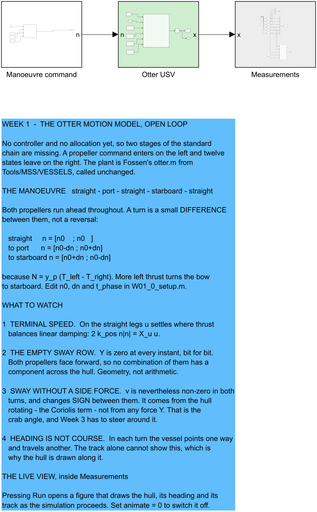

**Reading the figure**

| Element | Meaning |
|---|---|
| `Manoeuvre command` | the propeller command $[n_L; n_R]$ in rad/s **as a function of time** — a Clock and one MATLAB Function, with `n0`, `dn` and `t_phase` wired in as Constants from `W01_0_setup.m` |
| `Otter USV` (green) | Fossen's `otter.m`, called unchanged, with the integrator that produces the state |
| `Measurements` (grey) | selectors, the scope, the workspace log and the live view |

### The signal chain

- Every model in this course is laid out left to right in the same order, the order used by the MSS demonstration models in `Tools/MSS/SIMULINK/mssSimulinkDemos`:

$$
\text{command} \rightarrow \text{reference} \rightarrow \text{controller} \rightarrow \text{allocation} \rightarrow \text{plant} \rightarrow \text{measurement}
$$

| Stage | Question it answers | Colour |
|---|---|---|
| command | what is asked for | white |
| reference | what is achievable, and how fast | lilac |
| controller | what force is needed | blue |
| allocation | which thrusters produce it | sand |
| plant | how the vessel responds | green |
| measurement | what is recorded | grey |

- **This week has three of the six.** There is no loop yet, so there is no controller and nothing to allocate. The stages that remain keep their order, and the missing ones close up.
- Each stage is a **subsystem**. The top level shows the chain and nothing else; opening a stage is how its contents are read. Every port is named, so `n` and `x` label the lines without a single annotation.

> [!tip] Open `Measurements` before running anything
> Inside it are the six selectors that pull $u$, $v$, $r$, $N$, $E$ and $\psi$ out of the twelve-state vector, the conversion of $\psi$ to degrees, the workspace log, and the `Animate` block that draws the live view. Every week of this course has the same block, built by the same function, so it is worth reading once.

### The live view

- Pressing **Run** opens a figure that draws the vessel as the simulation proceeds. It draws two things, and the second is the reason it exists:

| Drawn | Answers |
|---|---|
| the track | **where** the hull went |
| the hull outline and the line leaving its bow | **where the hull was pointing** while it went there |

- Those are not the same question. A marine vehicle carries a sway velocity, so its heading $\psi$ and its course over ground differ by the crab angle $\beta = \operatorname{atan2}(v, u)$. In the turning run of §D they differ by more than 20°, and no track drawn on its own can show that. Week 4 has to steer around exactly this difference.
- A MATLAB Function block cannot plot. The drawing function is therefore declared extrinsic, which makes Simulink hand the call back to MATLAB instead of generating code for it:

```matlab
coder.extrinsic('W01_animate');
ok = 1;
if en > 0.5
    W01_animate(N, E, psi, t);
end
```

- The axes are fixed before the run starts, from `track_Nmin` … `track_Emax` in `W01_0_setup.m`. Widen them if the vessel leaves the box. Set `animate = 0` to switch the live view off; a long run is noticeably faster without it.

> [!tip] The silhouette is drawn to the window, not to scale
> On a 160 m track the true 2.00 m Otter is under one pixel, so the live view scales the outline to about 4% of the axis span. Where the figure states a true-size drawing, it says so.

### Inside the plant

- The plant subsystem contains a single MATLAB Function block that calls `otter.m` and an integrator that turns $\dot{\mathbf{x}}$ into $\mathbf{x}$:

```matlab
coder.extrinsic('otter');

xdot = zeros(12,1);
xdot = otter(x, u_thr, mp, rp, V_c, beta_c);
```

- `otter.m` is not written for code generation, so the call is declared extrinsic and Simulink hands it back to MATLAB. The consequence is that the output must be pre-sized, which is what the `zeros(12,1)` line is for.
- The state returns to the function through a Goto/From tag pair rather than a line drawn across the canvas. The integrator breaks the loop, so this is not an algebraic loop.

## C. Predicting, then measuring (30 min)

### Step 1 — predict on paper

- Before running anything, compute the terminal surge speed for $n = 60$ rad/s on both propellers, using §1-6.

$$
X = 2\,k_{\text{pos}}\,n|n| = 2 \times 0.011080 \times 60^2 = 79.776\ \text{N}
$$

$$
u_{ss} = \frac{X}{|X_u|} = \frac{79.776}{77.554} = 1.0286\ \text{m/s}
$$

### Step 2 — measure

```matlab
W01_C_terminal_speed
```

> [!note] To produce every figure in this section
> `W01_C_terminal_speed.m` runs `W01_openloop.slx` four times with `dn = 0`, prints the table below, and writes `img/W01_result_speed.png` and `img/W01_result_frames.png`.

Measured, over four commands:

| $n$ [rad/s] | $X$ [N] | predicted $u_{ss}$ [m/s] | measured $u$ [m/s] |
|---|---|---|---|
| 20 | 8.864 | 0.1143 | 0.1143 |
| 40 | 35.456 | 0.4572 | 0.4572 |
| 60 | 79.776 | 1.0286 | 1.0286 |
| 80 | 141.824 | 1.8287 | 1.8287 |

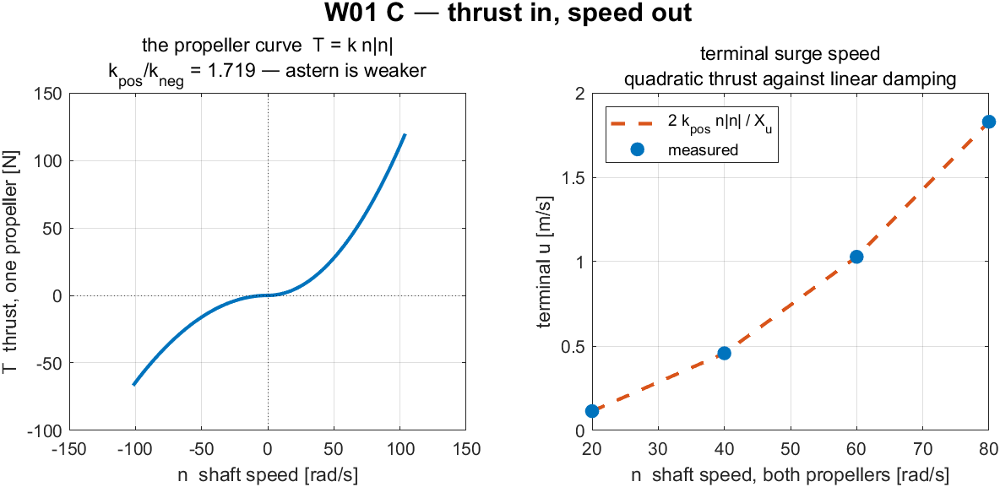

**Reading the figure**

| Element | Meaning |
|---|---|
| left panel | the propeller curve $T = k\,n\lvert n\rvert$, with the kink at $n = 0$ where $k$ changes |
| right panel, dashed | the hand prediction $2k_{\text{pos}}n\lvert n\rvert / \lvert X_u\rvert$ |
| right panel, markers | the settled speed measured from the simulation |

**What the figure says**

- **Meaning.** The left panel is the actuator alone: shaft speed in, thrust out, one propeller. The right panel is the whole open loop reduced to one number per command — how fast the vessel ends up going.
- **Trend, in numbers.** The propeller curve is flat near the origin and steepens away from it, because $T = k\,n\lvert n\rvert$ is quadratic. The right panel inherits that shape exactly: doubling the shaft speed from 20 to 40 rad/s multiplies the speed by four, $0.1143 \to 0.4572$ m/s, and doubling again to 80 rad/s multiplies it by four once more, to $1.8287$ m/s. **The curve through the markers is a parabola, not a line.**
- **Principle.** Two different laws meet at the steady state. Thrust is quadratic in shaft speed; damping is linear in surge velocity. Setting them equal, $2k_{\text{pos}}n\lvert n\rvert = \lvert X_u\rvert u$, gives $u \propto n^2$ — so **doubling the propeller speed does not double the boat speed, it quadruples it**.
- **Why the dashed line and the markers coincide.** The prediction was made from a single scalar equation and the measurement comes from a twelve-state nonlinear model, and they agree to four decimals. That is a statement about the *plant*, not about the method: surge damping in `otter.m` really is linear when nothing else is moving. Week 3 repeats the exercise on the yaw axis, where the same procedure is only approximate, and the difference between the two weeks is a property of the vessel.
- **What changes with the situation.** Nothing here depends on the controller, because there is none. These four points are the ceiling every later week works underneath: no surge controller can ask for a speed the propellers cannot produce.

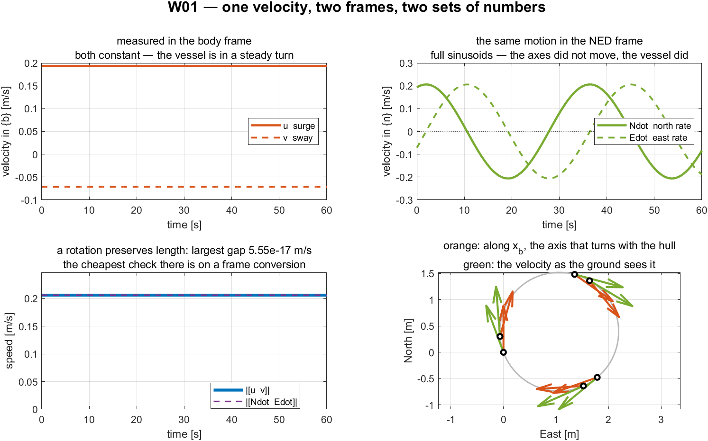

**Reading the figure**

| Element | Meaning |
|---|---|
| top left | $u$ and $v$, the velocity measured along axes that turn with the vessel |
| top right | $\dot N$ and $\dot E$, the same motion along axes that never move |
| bottom left | the two speeds, $\lVert[u\ v]\rVert$ against $\lVert[\dot N\ \dot E]\rVert$ |
| bottom right | the track, with the body $x$-axis in orange and the NED velocity in green |

**What the figure says**

- **Meaning.** One physical velocity, written twice. All four panels are the same vessel in the same **steady turn** — nothing changes between them except which axes the numbers are measured along.
- **Trend, in numbers.** In the body frame $u$ and $v$ are flat lines at $0.1932$ and $-0.0713$ m/s, unchanging for the whole minute. In the NED frame the same motion is two full sinusoids swinging between $\pm 0.21$ m/s, a quarter period apart. **Nothing about the motion changed between the two panels; only the axes did.**
- **Principle.** $\begin{bmatrix}\dot N \\ \dot E\end{bmatrix} = \mathbf{R}(\psi)\begin{bmatrix}u \\ v\end{bmatrix}$. The body axes rotate with the hull, so a constant body velocity sweeps a circle in NED — which is what the bottom-right panel draws, orange arrows turning steadily while the green ones follow them round.
- **Why the bottom-left panel is the check worth making.** A rotation preserves length, so the two speeds must be equal at every instant, and they are: the largest gap over the whole run is $5.55\times10^{-17}$ m/s. **A transposed or mis-signed rotation matrix breaks that equality immediately**, and no other single test catches the error as cheaply.
- **What this rules out.** Integrating $u$ to obtain a north position is wrong, and this figure is where it becomes visible: $u$ is constant while $\dot N$ is not. The error is invisible on a straight run and grows without bound in a turn.
- **What changes with the situation.** On a straight leg $\psi$ is constant, the sinusoids flatten, and the two frames differ by a fixed rotation. Every disagreement in this figure is produced by $r \neq 0$, which is exactly why the manoeuvre of section D turns rather than running straight.

## D. One manoeuvre: straight, port, straight, starboard, straight (30 min)

- The vessel runs the manoeuvre a real USV would be given first: hold a course, turn left, hold, turn right, hold. It takes 150 s.
- **Nothing reverses.** Both propellers turn ahead for the whole run. A turn is a small difference between them, because the yaw moment is

$$
N = y_p\left(T_{\text{left}} - T_{\text{right}}\right), \qquad y_p = 0.395\ \text{m}
$$

| Phase | $t$ [s] | $n_L$ | $n_R$ | Turn |
|---|---|---|---|---|
| straight 1 | 0 – 30 | 60.0 | 60.0 | — |
| port | 30 – 60 | 56.5 | 63.5 | to the left, $\psi$ decreasing |
| straight 2 | 60 – 90 | 60.0 | 60.0 | — |
| starboard | 90 – 120 | 63.5 | 56.5 | to the right, $\psi$ increasing |
| straight 3 | 120 – 150 | 60.0 | 60.0 | — |

> [!note] Which propeller slows down for a left turn
> More thrust on the **left** gives a positive $N$, which swings the bow to **starboard**. A turn to port therefore slows the **left** propeller, not the right one. Getting this backwards is the most common sign error in the whole week, and the track shows it immediately.

### Measured

```matlab
W01_D_the_manoeuvre
```

> [!note] To produce every figure in this section
> `W01_D_the_manoeuvre.m` runs `W01_openloop.slx` once for the full 150 s, prints both tables below, and writes `img/W01_result_states.png` and `img/W01_result_track.png`.

- Each row is the mean over the **last fifth of its phase**, after the transient at the phase boundary has decayed. Averaging over a whole phase would mix the transient into the steady number.

| Phase | $u$ [m/s] | $v$ [m/s] | $r$ [deg/s] | $\beta$ [deg] |
|---|---|---|---|---|
| straight 1 | 1.0286 | 0.0000 | 0.0000 | 0.0000 |
| port | 1.0218 | +0.1264 | −2.2942 | +7.0528 |
| straight 2 | 1.0287 | 0.0215 | 0.0085 | 1.1955 |
| starboard | 1.0218 | −0.1264 | +2.2942 | −7.0526 |
| straight 3 | 1.0287 | −0.0215 | −0.0085 | −1.1948 |

- Heading change: **−70.2°** in the port turn, **+70.6°** in the starboard turn. The two differ by $0.41°$, so the hull is symmetric about its centreline and nothing in `otter.m` favours one side.
- The commanded yaw moment in the starboard turn is $N = +3.676$ N·m. The slower propeller still pushes **ahead** at $35.37$ N while the faster one pushes at $44.68$ N.

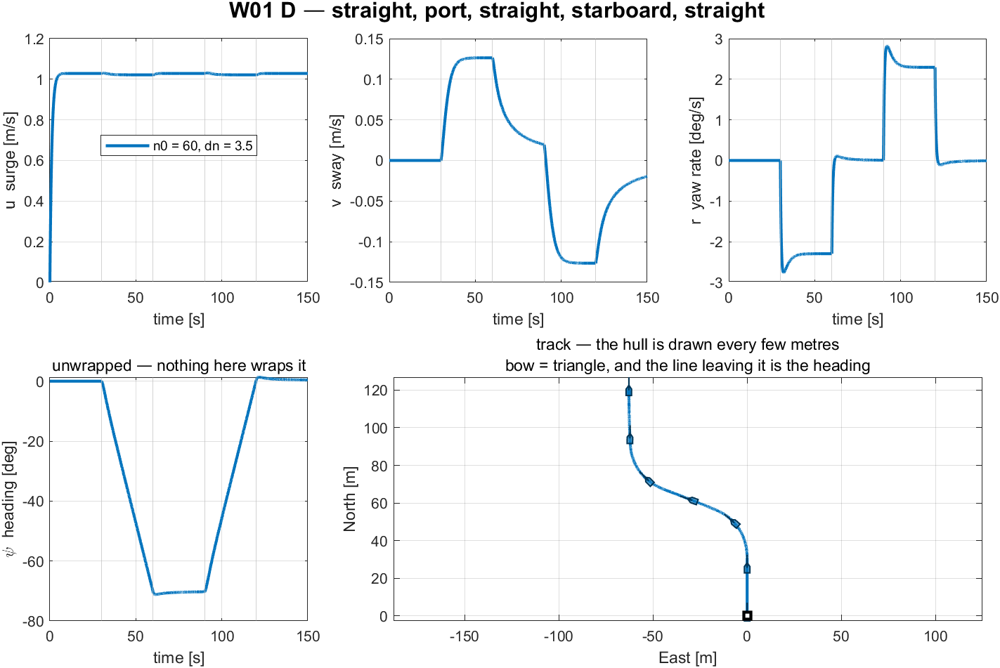

**Reading the figure**

| Element | Meaning |
|---|---|
| grey vertical lines | the four phase boundaries at 30, 60, 90 and 120 s |
| top left | surge velocity. It dips by only $0.7\%$ in the turns — the manoeuvre barely costs speed |
| top centre | sway velocity. Zero on the straight legs, and **opposite in sign** in the two turns |
| top right | yaw rate. Note the overshoot at each phase change, then the settled value |
| bottom left | heading, **unwrapped**. It never wraps here because the turns are small |
| bottom right | the track, with the hull drawn at intervals; the bow is the triangular end and the line leaving it is the heading |

**What the figure says**

- **Meaning.** Five panels, one run. The top row is what the vessel is *doing* — the three body velocities. The bottom row is where that puts it: the heading over time, and the path over the ground.
- **Trend, in numbers.** Surge climbs to $1.0286$ m/s in about 8 s and then never moves again: the dips at 30 s and 90 s are $0.7\%$ and are invisible at this scale, which is the point. Sway steps to $+0.127$ m/s the instant the port turn begins, holds while the turn holds, and steps to $-0.127$ m/s in the starboard turn. Yaw rate does the same but **overshoots first** — it spikes to about $2.8$ deg/s at each phase change before settling at $2.29$.
- **Principle.** The command is a step, and the vessel's yaw axis is second order, so $r$ cannot follow a step exactly: it overshoots and settles. Surge is first order and much more heavily damped, so it shows no overshoot at all. **The three panels have different shapes because the three axes have different dynamics, not because they were driven differently.**
- **What separates the two turns.** Everything is antisymmetric. Sway and yaw rate reverse sign; surge does not change at all. That is the signature of a differential command on a hull symmetric about its centreline: the two turns are the same manoeuvre mirrored, and the $0.41°$ difference in heading change is the only asymmetry in the run.
- **What changes with the situation.** Raising `dn` in `W01_0_setup.m` raises $r$ and $v$ proportionally and leaves $u$ almost alone, until `dn` grows large enough that one propeller approaches zero. The straight legs exist so the transient at each boundary has room to die before the next command arrives; shortening them mixes two transients and the steady numbers in the table stop meaning anything.

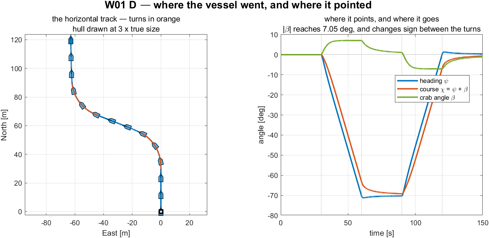

**Reading the figure**

| Element | Meaning |
|---|---|
| left panel, blue | the straight legs |
| left panel, orange | the two turns |
| left panel, outlines | the hull at 3× true size, with its heading line, drawn every few metres |
| right panel, blue | heading $\psi$ — where the vessel **points** |
| right panel, orange | course $\chi = \psi + \beta$ — where it actually **goes** |
| right panel, green | the crab angle $\beta$, the gap between the two |

**What the figure says**

- **Meaning.** The left panel answers *where did it go*; the right panel answers *where was it pointing while it went there*. The two questions have different answers, and that gap is the whole reason the hull is drawn on the track rather than a bare line.
- **Trend, in numbers.** The track runs due north for 30 s, swings about 62 m to the west during the port turn, and straightens again — a shallow S. On the right, heading and course leave zero together at 30 s but **separate immediately**: $\psi$ reaches $-71°$ while $\chi$ stops at $-64°$, a gap of $7.05°$ held for the whole turn. In the starboard turn the gap reappears with the opposite sign.
- **Principle.** $\chi = \psi + \beta$ with $\beta = \operatorname{atan2}(v, u)$. A turning vessel has $v \neq 0$, so it moves at an angle to its own centreline. **Heading is not course, and the difference is not an error** — it is the crab angle, and it is $7°$ here.
- **Where the difference shows up in each panel.** On the left it is visible only because the hulls are drawn: on the turning legs the silhouettes point slightly inside the curve they are tracing. On the right it is the green line, which is flat at zero on every straight leg and steps to $\pm 7°$ the moment a turn starts.
- **What changes with the situation.** $\beta$ scales with the turn rate, so a larger `dn` widens the gap and a straight run closes it. Week 3 has to steer around this: a heading controller that reaches its commanded $\psi$ still leaves the vessel travelling $7°$ off, and Week 4's line-of-sight guidance is where that finally has to be paid for.

### Three observations

**① The turn costs almost no speed.**

- Surge falls from $1.0286$ to $1.0218$ m/s, a loss of $0.7\%$. The differential $dn = 3.5$ rad/s is small against $n_0 = 60$, and the total thrust $T_L + T_R$ is nearly unchanged because $n|n|$ is convex: what one propeller loses the other more than makes up.
- This is why a differential turn is the cheap way to steer a twin-screw craft, and why the alternative — reversing one propeller — is reserved for manoeuvring at rest.

**② The sway force is zero and the sway velocity is not.**

| | value |
|---|---|
| max $\lvert Y \rvert$ over every command in the manoeuvre | $0.0 \times 10^{0}$ N |
| mean $v$ in the port turn | $+0.1264$ m/s |
| mean $v$ in the starboard turn | $-0.1264$ m/s |

- $Y$ is zero at every instant, bit for bit — not small, but **structurally** zero. Both propellers are bolted to the hull facing forward, so no combination of them has a component across the centreline.
- The vessel nevertheless sways in both turns, and $v$ **changes sign** between them. That sway comes from the Coriolis term of §1-7 acting while the hull rotates, not from any force.
- The sign reversal is the proof. A side force would have to come from somewhere; a Coriolis term simply follows the sign of $r$.

**③ Heading is not course.**

$$
\beta = \operatorname{atan2}(v, u) = \operatorname{atan2}(0.1264,\ 1.0218) = +7.05^\circ
$$

- In the **port** turn the vessel points $70°$ to the left of north but travels $7.05°$ to the right of where it points. In the **starboard** turn both signs flip.
- The right-hand panel makes this visible: the orange course line runs consistently inside the blue heading line during each turn, and the green gap between them is $\beta$.
- A track drawn as a bare line cannot show this. That is the whole reason the hull outline is drawn along it, and why Week 3 §3-4 has to return to $\beta$ before any path-following law can work.

> [!note] The straight legs do not return to exactly zero
> After each turn, $v$ settles at $\pm 0.0215$ m/s rather than $0$, and $\beta$ at $\pm 1.20°$. Thirty seconds is not long enough for the sway transient to decay completely. This is a genuine measurement, not a numerical artefact — lengthening `t_phase` drives both towards zero.

> [!warning] A quantity that is structurally zero looks different from one that is merely negligible
> Reporting $Y \approx 0$ and $Y = 0$ as the same observation loses the entire content of §1-5. Verify which one is being seen before writing it down.

## E. The same command in four currents (25 min)

- A second model, `W01_current.slx`, keeps the command fixed — both propellers at $n_0 = 60$ rad/s, **no steering at all** — and changes only the water.

```matlab
W01_E_build_current
W01_E_current_run
```

> [!note] To produce every figure in this section
> `W01_E_build_current.m` writes `img/W01_current.png` at the end of the build. `W01_E_current_run.m` runs `W01_current.slx` sixteen times — four named cases and a twelve-point sweep — prints both tables below, and writes `img/W01_result_current.png` and `img/W01_result_current_rose.png`.

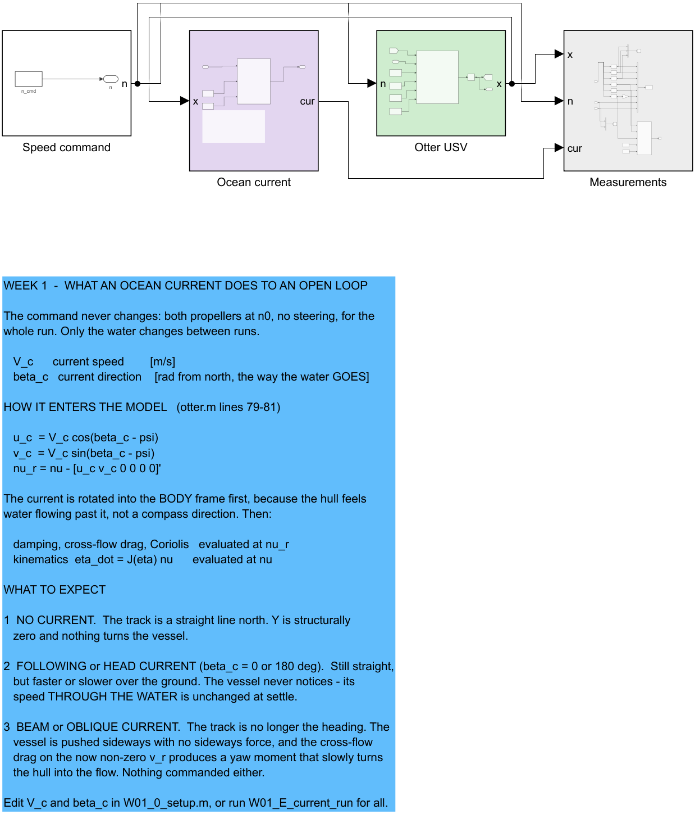

**Reading the figure**

| Element | Meaning |
|---|---|
| `Speed command` (white) | one constant, both propellers equal. Nothing in this model steers |
| `Ocean current` (lilac) | recomputes $u_c$, $v_c$, $u_r$, $v_r$ from the state so they become **signals**. It drives nothing |
| `Otter USV` (green) | `otter.m` with $V_c$ and $\beta_c$; the current is applied inside, exactly as §1-13 describes |
| `Measurements` (grey) | logs the six standard columns plus $u_c\ v_c\ u_r\ v_r$ |

- The `Ocean current` stage exists only so that the relative velocity — the quantity every force in the model is evaluated at — can be plotted instead of remaining a hidden intermediate.

### Measured, over the settled last fifth of each run

| Current | $u$ ground | $u_r$ water | $v$ ground | $v_r$ water | $\psi$ [deg] | track [deg] |
|---|---|---|---|---|---|---|
| still water | $1.0286$ | $1.0286$ | $0.0000$ | $0.0000$ | $0.000$ | $0.000$ |
| following, $\beta_c = 0°$ | $1.5286$ | $1.0286$ | $0.0000$ | $0.0000$ | $0.000$ | $0.000$ |
| beam, $\beta_c = 90°$ | $0.9937$ | $1.0287$ | $0.4926$ | $-0.0062$ | $-4.005$ | $21.804$ |
| head, $\beta_c = 180°$ | $0.5286$ | $1.0286$ | $-0.0000$ | $-0.0000$ | $-0.000$ | $-0.000$ |

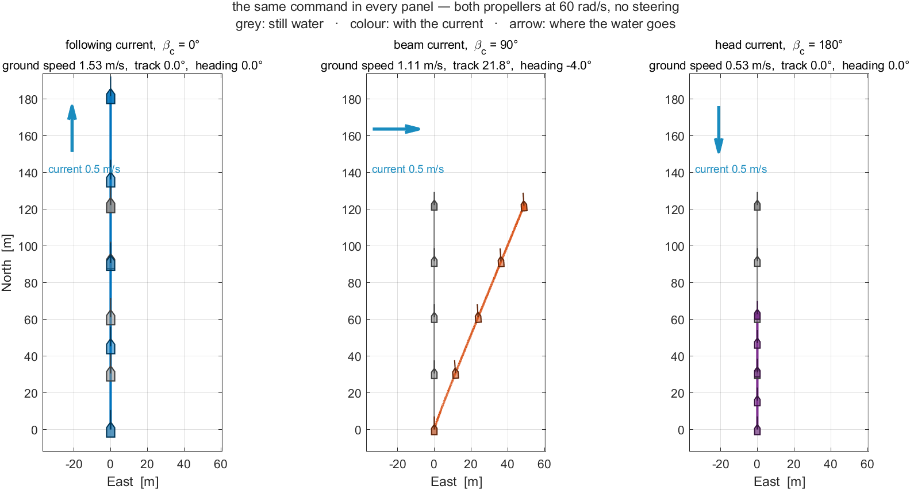

**Reading the figure**

| Element | Meaning |
|---|---|
| left panel | the four tracks. Three run due north; the hull is drawn along each, and the **spacing between hulls** is the ground speed |
| left panel, orange | the beam case — the only track that leaves the meridian, while its bow still points north |
| top right | $u_r$, speed through the water. All four curves lie on top of each other |
| bottom right | $u$, speed over the ground. The same hull, four different answers |
| thin arrows | the current, drawn along each track so the direction can be read off the picture |

**What the figure says**

- **Meaning.** Four runs of one unchanged command. The left panel is where each ended up; the right column is the same four runs measured two different ways — against the water, and against the ground.
- **Trend, in numbers.** The two right-hand panels are the heart of it. Through the water, **all four curves lie on top of one another** at $1.0286$ m/s and stay there. Over the ground they fan out into four separate lines: $1.5286$ with the current astern, $1.0286$ in still water, $0.9937$ on the beam and $0.5286$ with it ahead. On the left, the three fore-and-aft cases run due north and only their hull spacing differs — closest together for the head current, furthest apart for the following one — while the beam case leaves the meridian entirely and ends about 48 m to the east.
- **Principle.** `otter.m` evaluates every hydrodynamic term at $\boldsymbol{\nu}_r = \boldsymbol{\nu} - \boldsymbol{\nu}_c$ but integrates the position with $\boldsymbol{\nu}$. **Forces feel the water; the track is over the ground.** Two velocities, two jobs, and every effect in this figure follows from the split.
- **What separates the four cases.** Nothing about the vessel, and nothing about the command. Only $\beta_c$ changed. The hull is in an identical state in all four runs — same shaft speed, same thrust, same relative velocity — and it nevertheless ends up in four different places.
- **What changes with the situation.** The orange hulls still point **north** the whole way while travelling north-east. That is the same heading-is-not-course lesson as section D, arriving from a completely different cause: in section D the gap came from the vessel rotating, here it comes from the water moving, and no measurement taken on board can tell them apart.

### Three observations

**① Fore-and-aft current changes the ground speed by exactly $\pm V_c$.**

$$
1.0286 + 0.5 = 1.5286,
\qquad
1.0286 - 0.5 = 0.5286
$$

- Both are exact to four decimals. And $u_r$ is $1.0286$ m/s in **both** runs and in still water — identical to four decimals. The hull cannot tell the three runs apart; only the ground can.

**② A beam current moves the vessel sideways with no sideways force.**

- $Y = 0$ still holds — nothing changed in the actuator. The vessel nevertheless makes $v = 0.4926$ m/s over the ground while $v_r = -0.0062$ m/s through the water. The water is doing the moving.
- The track leaves the heading by $21.80 - (-4.01) = 25.81°$.

**③ The beam current also turns the vessel, with nothing commanded.**

- Heading drifts to $\psi = -4.005°$ over the run. Cross-flow drag acts on the non-zero $v_r$ and its line of action does not pass through the origin, so it produces a yaw moment. The vessel weathervanes into the flow.

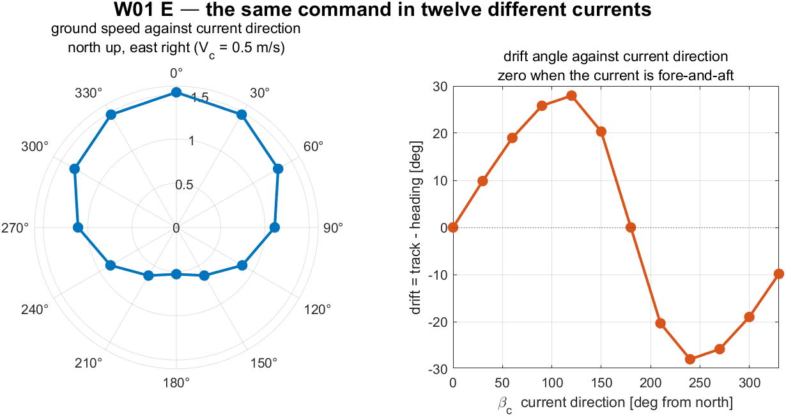

**Reading the figure**

| Element | Meaning |
|---|---|
| left, polar | ground speed against $\beta_c$, drawn as a compass — **north up, east right, clockwise**, matching NED |
| right | drift angle against $\beta_c$: zero when the current is fore-and-aft, largest near the beam |

- The sweep is antisymmetric about $\beta_c = 180°$, as it must be for a hull symmetric about its centreline. Maximum drift is $\pm 27.96°$ at $\beta_c = 120°$ and $240°$.

**What the figure says**

- **Meaning.** The four named cases of the previous figure, extended to twelve directions $30°$ apart. The polar panel asks *how fast*, the Cartesian panel asks *how far off course*.
- **Trend, in numbers.** The polar plot is an egg, not a circle: widest at the top, $1.5286$ m/s with the current astern, narrowest at the bottom, $0.5286$ m/s with it ahead, and $1.1091$ m/s on either beam. The ratio between best and worst is $2.9$, from a current worth half the vessel's own speed. The drift curve crosses zero exactly twice — at $\beta_c = 0°$ and $180°$ — and peaks at $\pm 27.96°$, not on the beam but past it, at $120°$ and $240°$.
- **Principle.** Ground velocity is the vector sum of the vessel's velocity through the water and the current itself. That sum is largest when the two are parallel, smallest when opposed, and turns the resultant furthest when the current has both a large sideways component and a retarding one — which is why the drift maximum sits past the beam rather than on it.
- **What separates the two panels.** Speed and direction are damaged by different currents. A head current costs the most speed and produces **no drift at all**; a quartering current from $120°$ costs moderate speed and produces the worst drift. **A vessel can be slowed without being pushed off course, and pushed off course without being much slowed.**
- **What changes with the situation.** The whole picture scales with $V_c / u$. At $V_c = 0.5$ m/s against a vessel doing $1.03$ m/s the drift reaches $28°$; a slower vessel or a stronger current makes it worse, and a current stronger than the vessel drives the **narrow end** of the egg — the head-current case at $\beta_c = 180°$, drawn at the bottom — through zero, so the vessel makes sternway while still commanded ahead. This is the problem Week 4's line-of-sight guidance exists to solve, and the reason it needs an integral term.

> [!note] The vessel is doing the same thing in all twelve runs
> Same command, same thrust, same speed through the water. Everything different in the polar plot is the water, not the vessel. That is worth stating out loud before Week 4 asks a guidance law to cope with it.

## Week Summary

| Step | What was done | How it was verified |
|---|---|---|
| 1 | Identified the twelve states and their frames | listed against `otter.m` and the selector blocks |
| 2 | Reduced the 6-DOF equation to first-order surge | $\tau_u = 1.1025$ s against $1.1064$ s measured from the plant |
| 3 | Predicted terminal speed before simulating | four commands, agreement to four decimals |
| 4 | Ran a port-then-starboard manoeuvre with both propellers ahead | heading changed $-70.2°$ then $+70.6°$, symmetric to $0.41°$ |
| 5 | Separated sway force from sway velocity | $Y = 0$ exactly, $v = \pm 0.1264$ m/s, sign reversing between the turns |

---

## Progress Check

> [!important] Minimum condition for following Week 2

### Theory

- [ ] Able to state which of the twelve states are expressed in $\{b\}$ and which in $\{n\}$
- [ ] Able to write $\dot{\boldsymbol{\eta}} = \mathbf{J}_{\Theta}(\boldsymbol{\eta})\boldsymbol{\nu}$ and say why $\mathbf{T}_{\Theta}$ is not a rotation matrix
- [ ] Able to compute $u_{ss}$ for a given $n$ without running a simulation
- [ ] Able to explain why $Y = 0$ while $v \neq 0$ during a turn, and why $v$ reverses sign between a port and a starboard turn

### Laboratory

- [ ] `W01_0_setup` printed `rank(B) = 2`
- [ ] `W01_1_build_openloop` regenerated the model after it was deliberately broken
- [ ] Sections C, D and E were run in that order and together wrote six result PNG files into `W01_simulink/img/`

### Recorded observations

- [ ] The settled $u$ for $n = 60$ recorded to four decimal places
- [ ] The crab angle $\beta$ recorded in **both** turns, with its sign
- [ ] The heading change across each turn recorded, and the two compared
- [ ] The live view watched through both turns, and the direction the hull **pointed** noted against the direction it **moved**

---

## In-class laboratory — build the open loop by hand

The second hour of the Week 1 session is spent building, in Simulink, the model this lecture built from a script. Three problems, one hour, with a checker that compares the result against the numbers measured above.

```matlab
cd lectures/W01_simulink/problems
W01_P1_start                 % creates W01_P1.slx — the hull, and nothing else
W01_check(1)                 % run this whenever, as often as needed
```

| | Problem | Time | The number it must reproduce |
|---|---|---|---|
| 1 | The open loop — a constant command into the hull, a log coming out | 25 min | terminal $u = 1.0286$ m/s, and $v = r = 0$ |
| 2 | The manoeuvre — replace the constant by a schedule of time | 20 min | port turn $r = -2.2942$ deg/s, heading change $-70.2$ deg |
| 3 | The current — work out why **nothing** needs to be added | 15 min | drift $25.809$ deg, ground speed $1.1091$ m/s |

- The full problem sheet is [`W01_simulink/problems/README.md`](W01_simulink/problems/README.md), and reference answers are in [`W01_simulink/solutions/`](W01_simulink/solutions/README.md).
- The hull is provided because integrating `otter.m` is not the subject of this week. Everything else — the command, the wiring, the logging — is built by hand.
- **There is no single correct diagram.** The checker tests the physics. A model that reproduces the measured numbers is doing what the lecture's model does, whatever it looks like on the canvas.

---

## Assignment 1

- **Due**: before the Week 2 session
- **Submit**: the modified `W01_0_setup.m`, the numbers requested below, and a short analysis

### ① Requirements

1. Derive the terminal surge speed relation $u_{ss}(n)$ from the surge equation, showing each step.
2. Determine, by hand, the shaft speed $n^\star$ (equal on both propellers) that produces a terminal speed of exactly $1.500$ m/s.
3. Determine, by hand, the differential $dn^\star$ that produces a commanded yaw moment of exactly $N = 5.000$ N·m at $n_0 = 60$ rad/s, using $N = y_p(T_L - T_R)$ with $y_p = 0.395$ m and $T = k_{\text{pos}} n|n|$. Both propellers must stay ahead — state the resulting $n_L$ and $n_R$ and confirm both are positive.

### ② Verification — mandatory

> [!important] A claim is not a result. Numbers are required, with the averaging window stated

1. Run the simulation at $n^\star$ from ①.2 with `dn = 0` and report the measured settled $u$ to four decimal places, together with the time window over which it was averaged.
2. Run the manoeuvre with $dn^\star$ from ①.3 and report, for **both** turns, the settled $u$, $v$, $r$ and $\beta$, each with its averaging window.
3. Report the heading change produced by each turn. State whether the two are equal in magnitude, and to how many degrees.
4. Sweep $dn$ over at least six values from $0$ to $12$ rad/s and produce one figure of settled yaw rate $r$ against $dn$. Overlay the prediction obtained by balancing the commanded $N$ against the **linear** yaw damping $N_r$ alone.

### ③ Analysis (5–10 lines)

- The figure in ②.4 will not be a straight line, and the linear prediction will sit above the measurement at large $dn$. Identify the term in `otter.m` responsible, and state what it implies for a heading controller tuned only at small $dn$.
- State also why $v$ reverses sign between the two turns while $Y$ stays exactly zero in both.

### Grading

| Criterion | Weight |
|---|---|
| Derivation in ① is complete and correct | 20% |
| **Verification performed and numbers reported with windows stated** | 40% |
| Figure in ②.4 is correct and readable | 15% |
| Analysis in ③ identifies the mechanism | 25% |

---

## Troubleshooting

| Symptom | Cause | Fix |
|---|---|---|
| `Undefined function 'otter'` | MSS is not on the path | run `W01_0_setup`, which adds `Tools/MSS` with `genpath` |
| `Undefined variable 'n0'` when pressing Run in Simulink | the model reads base-workspace variables that the setup script defines | run `W01_0_setup` first, or run any section script, which sets its own variables |
| The vessel turns right when the port turn was expected | the yaw moment is $N = y_p(T_L - T_R)$, so slowing the **right** propeller turns the bow right | for a port turn slow the **left** propeller: $n = [n_0 - dn;\ n_0 + dn]$ |
| The exported block diagram is thousands of pixels wide | an annotation was edited into one long line; Simulink does not wrap annotation text | keep the manual line breaks in `W01_1_build_openloop.m` |
| Terminal speed differs from the prediction by a few percent | the simulation was stopped before the transient finished | `T_final` must exceed roughly $5\tau_u \approx 5.5$ s; the default is 120 s |
| Heading reads more than 360° | $\psi$ is an unwrapped integral of $r$ and nothing in this model wraps it | expected. Week 3 introduces the wrapping and shows what happens without it |
| The run is far slower than the simulated time | the live view is redrawing too often | raise `animate_every` in `W01_0_setup.m`, or set `animate = 0` |
| The vessel leaves the live view and disappears | the axes are fixed before the run and do not auto-range | widen `track_Nmin` … `track_Emax` in `W01_0_setup.m` |
| The hull in the live view turns the wrong way | the two signs in the NED rotation of the silhouette were swapped | it is $N = N_0 + x_b\cos\psi - y_b\sin\psi$ and $E = E_0 + x_b\sin\psi + y_b\cos\psi$, the planar block of $\mathbf{R}_b^n$. See `_tools/draw_ship.m` |

---

## References

### Primary

- Fossen, T. I. *Handbook of Marine Craft Hydrodynamics and Motion Control*, 2nd ed. Chapters 2 (kinematics) and 3 (rigid-body dynamics).
- MSS toolbox, `Tools/MSS/VESSELS/otter.m` — the plant used unchanged in this week's model.
- MSS toolbox, `Tools/MSS/GNC/` — `Rzyx`, `Tzyx`, `Smtrx`, `m2c`, `crossFlowDrag`, called internally by `otter.m`.

### Course files

- `W01_simulink/W01_1_build_openloop.m`, `W01_E_build_current.m` — the two model generators
- `W01_simulink/W01_0_setup.m` — the parameters
- `W01_simulink/W01_C_terminal_speed.m` · `W01_D_the_manoeuvre.m` · `W01_E_current_run.m` — one script per laboratory section
- `W01_simulink/W01_vars.m` · `W01_read.m` — the same numbers as a struct, and the log with named fields
- `W01_simulink/W01_animate.m` — the live view, called by the model's `Animate` block
- `W01_simulink/W01_plot.m`, `W01_cur_plot.m` — the summary figures, called by both the section scripts and the models' `StopFcn`
- `_tools/otter_config.m`, `_tools/otter_B.m` — the actuator configuration and the column rule
- `_tools/draw_ship.m`, `_tools/track_ships.m`, `_tools/ship_marks.m` — the hull silhouette drawn on every track in this course

### Acknowledgement

- The hull polygon — rectangular stern closed by a triangular bow — follows `shipModel.m` (J. Hong, KRISO, 2022), used in the department's undergraduate guidance course.

---

## Next Week

- **Week 2 — Surge Speed Control**
- The first closed loop. The surge equation of §1-6 becomes a plant, a controller is placed around it, and the settled speed is predicted before it is measured — as in this week, but now with feedback.
- The propeller curve of §1-5 is inverted, so that a demanded **force** becomes a shaft speed.
- Preparation: bring $\tau_u = 1.1025$ s and $K_u = 0.012894$ (m/s)/N from §1-6, and the derivation of $u_{ss}(n)$ from Assignment 1.

> [!note] Appendix A1 is available but not required yet
> The general rule that produces $\mathbf{B}$ for any thruster layout, together with the attainable control set and what actuation rank costs, is written up as **Appendix A1**. Weeks 2 and 3 quote its two results where they need them. It becomes required reading before Week 5.
