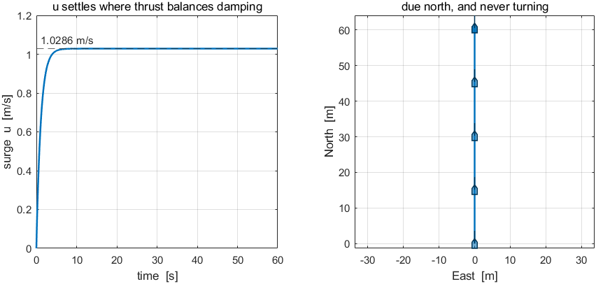
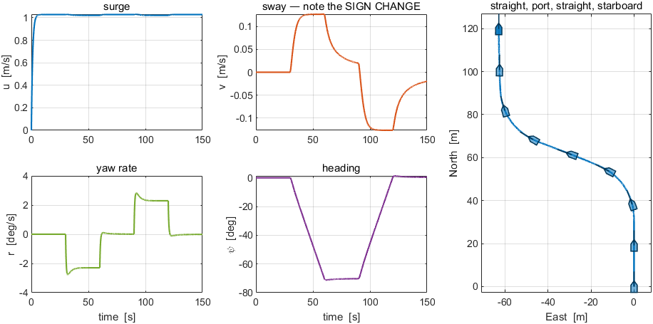
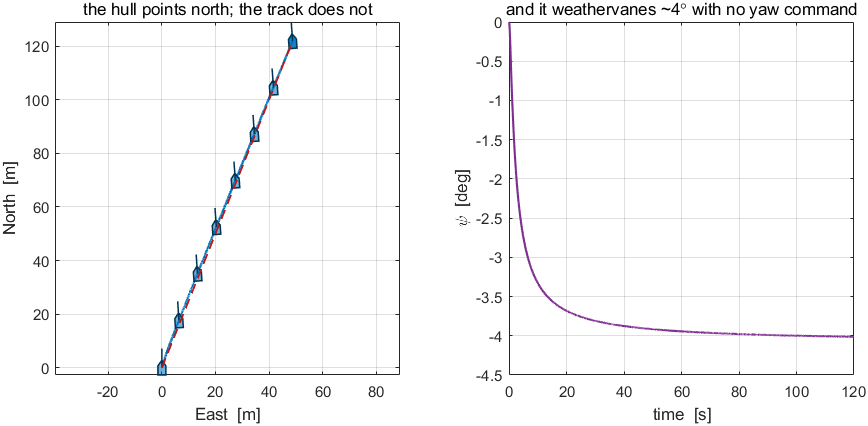

# Week 1 · Laboratory Problems — build the open loop in Simulink

- Course: Sensor Signal Processing and Fusion · Department of Autonomous Vehicle System Engineering
- Time: **one hour**, immediately after the Week 1 lecture hour
- Three problems, in order. Each one starts where the previous one stopped.

---

## What this hour is for, and why the models are not simply given

The lecture builds `W01_openloop.slx` **from a script**. Running one command produces a finished model, and reading that script is a good way to learn what the finished model contains. It is not a good way to learn how to build one.

This hour reverses that. The hull is provided, because integrating `otter.m` is not the subject of Week 1 and cannot be assembled from library blocks in an hour. Everything else — what the command is, how it reaches the plant, which of the twelve states matter, how a result is logged — is built by hand.

Every problem ends with a **number that was measured in the lecture**. A model that reproduces that number is doing the same physics as the lecture's model, whatever it looks like on the canvas. There is no single correct diagram.

---

## Before starting

```matlab
cd lectures/W01_simulink/problems
W01_P1_start                 % creates W01_P1.slx — the hull, and nothing else
```

The solver is already set to fixed-step `ode4` at `h = 0.02` s. **Do not change it.** The numbers below were measured with those settings.

Check work at any time:

```matlab
W01_check(1)                 % or W01_check(1, 'W01_P1_yourname')
```

The checker runs the model, compares it with the lecture, and prints `PASS` or `FAIL` for each test together with the value it expected.

> [!important] One requirement on every model
> The model must contain **one To Workspace block named `xlog`**, with Save format **`Structure With Time`**, fed by the plant's twelve-state output.
> That is the only thing the checker needs. Requiring the raw twelve states rather than a tidy six-column log is deliberate: picking $u$, $v$, $r$, $x$, $y$ and $\psi$ out of the vector is the part of Week 1 worth being able to do without looking it up.

---

## Problem 1 · The open loop (25 minutes)

**Build.** A constant command into the hull, and a log coming out.

```
Constant [n0 ; n0]  →  Otter USV  →  To Workspace (xlog)
```

**Predict before running.** At steady state the thrust balances linear surge damping:

$$
2\,k_{pos}\,n\,|n| \;=\; X_u\,u
\qquad\Longrightarrow\qquad
u \;=\; \frac{2(0.01108)(60)(60)}{77.554}
$$

Write the number down before pressing Run.

**Verify.** `W01_check(1)` — terminal $u$, and that $v$ and $r$ stay at zero.

| What the checker expects | |
|---|---|
| terminal surge speed | $1.0286$ m/s |
| sway velocity $v$ | exactly $0$ |
| yaw rate $r$ | exactly $0$ |

**What a correct model produces**



| Reading the figure | |
|---|---|
| left | $u$ rises with one time constant and settles on the dashed line at $1.0286$ m/s. It does not overshoot: there is no loop, so nothing can |
| right | the track is a straight line due north, and every hull silhouette on it points the same way |
| the check | if the track bends at all, the two Constant entries are not equal |

**The point.** Two propellers, equal shaft speeds. The yaw moment is $N = y_p\,(T_{left} - T_{right})$, so equal speeds produce no turn at all, and the run is a test of surge alone. The command is a **2-vector**: `otter.m` expects $n = [n_L\ ;\ n_R]$, and a scalar is accepted by the Constant block and rejected by the plant.

---

## Problem 2 · The manoeuvre (20 minutes)

**Build.** Replace the constant by a schedule of time: straight, port, straight, starboard, straight.

```
Clock  →  MATLAB Function  →  Reshape (1-D array)  →  Otter USV  →  xlog
```

**Decide the signs first.** This is the whole problem, and it is decided before any block is placed:

$$
N \;=\; y_p\,\big(T_{left} - T_{right}\big), \qquad y_p = 0.395\ \text{m}
$$

More thrust on the **left** turns the bow to **starboard**. A port turn therefore **slows the left propeller**:

| phase | command |
|---|---|
| straight | $n = [\,n_0\ ;\ n_0\,]$ |
| to port | $n = [\,n_0-\delta n\ ;\ n_0+\delta n\,]$ |
| to starboard | $n = [\,n_0+\delta n\ ;\ n_0-\delta n\,]$ |

Nothing ever goes astern. At $n_0 = 60$ and $\delta n = 3.5$ the slower propeller still pushes ahead at $35.37$ N while the faster one pushes at $44.68$ N.

**Verify.** `W01_check(2)`.

| What the checker expects | |
|---|---|
| yaw rate in the port turn | $-2.2942$ deg/s |
| heading change, port then starboard | $-70.2$ then $+70.6$ deg |
| sway $v$ in the two turns | $+0.1264$ then $-0.1264$ m/s |

**Getting the sign backwards is visible immediately**: the heading change comes out $+70$ deg where the checker wants $-70$ deg.

**What a correct model produces**



| Reading the figure | |
|---|---|
| $u$ | barely moves. The turns cost about $0.007$ m/s of speed and nothing else |
| $v$ | rises to $+0.126$ in the first turn and falls to $-0.126$ in the second. **The sign change is the point of the problem** |
| $r$ | two flat plateaus of opposite sign, one per turn, with the transient at each phase boundary |
| $\psi$ | a ramp down to $-70$ deg, a hold, then a ramp back. A ramp UP first means the sign is reversed |
| track | the S-shape, with the hull drawn along it so the heading is visible where the track alone would not show it |

> [!warning] The Reshape block is not decoration
> A MATLAB Function block whose output is written `n = [nL; nR]` produces a $2\times1$ **matrix** signal. The plant does not care. The log does: one matrix input makes the whole To Workspace record three-dimensional, and the checker then finds one column where it expects twelve.

**The point.** $Y$ is exactly zero at every instant — both propellers face forward, so no combination of them has a component across the hull. Yet $v$ is non-zero in **both** turns and **changes sign** between them. That sway is produced by the hull rotating, through the Coriolis term, and not by any side force. It is the crab angle, and Week 3 has to steer around it.

---

## Problem 3 · The vessel in a current (15 minutes)

**Build.** Nothing. The model of Problem 1 is used unchanged.

That is the exercise: work out **why** nothing needs to be added before running anything.

**Read `otter.m` lines 79–81 and line 204.**

$$
u_c = V_c\cos(\beta_c-\psi), \qquad
v_c = V_c\sin(\beta_c-\psi), \qquad
\boldsymbol\nu_r = \boldsymbol\nu - [\,u_c\ v_c\ 0\ 0\ 0\ 0\,]^\top
$$

$$
\dot{\boldsymbol\eta} = \mathbf{J}(\boldsymbol\eta)\,\boldsymbol\nu
\qquad\text{— with } \boldsymbol\nu, \textbf{ not } \boldsymbol\nu_r
$$

**Predict before running.** With $V_c = 0.5$ m/s on the beam and the vessel making $1.0286$ m/s through the water, the velocity over the ground is the vector sum, so the drift is roughly $\arctan(0.5/1.0286) = 25.9^\circ$.

**Verify.** `W01_check(3)` — it sets $V_c = 0.5$ m/s and $\beta_c = 90^\circ$ itself.

| What the checker expects | |
|---|---|
| ground speed | $1.1091$ m/s |
| track direction from North | $21.804$ deg |
| drift, track minus heading | $25.809$ deg |

**What a correct model produces**



| Reading the figure | |
|---|---|
| left | the hull silhouettes point **north** while the track leans **east**. The dashed red line is the straight track from start to finish, at $21.8°$ |
| right | $\psi$ drifts about $-4°$ over the run, with no yaw command anywhere in the model |
| the check | if the hull silhouettes lean over with the track, $\psi$ is being drawn from the wrong state — the heading is index 12, not the direction of travel |

**The point.** A current is a **velocity, not a force**. Every hydrodynamic term is computed from $\boldsymbol\nu_r$, the velocity through the water, so the forces on the hull do not change. The position integrates $\boldsymbol\nu$, so the vessel is carried along by the water. That single asymmetry is why a current moves a vessel without pushing it.

Two things are worth noticing beyond the numbers:

- The predicted drift of $25.9^\circ$ and the measured $25.81^\circ$ agree, but the **ground speed is lower** than the naive vector sum of $1.144$ m/s. The hull weathervanes about $4^\circ$ into the flow, which turns part of the current from beam-on to head-on.
- **The vessel turns with no yaw command at all.** Cross-flow drag acts on $v_r$, and its line of action does not pass through the origin, so it makes a yaw moment. Nothing in the model was asked to do this.

---

## Marking

| | Weight | What is being marked |
|---|---|---|
| Problem 1 | 30 | `W01_check(1)` passes, and the predicted $1.0286$ m/s was written down **before** running |
| Problem 2 | 40 | `W01_check(2)` passes; the sign argument for the port turn is stated in one sentence |
| Problem 3 | 30 | `W01_check(3)` passes; the answer to "why was nothing added to the model" is stated |

A model that fails a check but whose written reasoning is right earns more than one that passes with no reasoning. The numbers are there to make the reasoning testable, not to replace it.

---

## If something goes wrong

| Symptom | Cause | Fix |
|---|---|---|
| `The model has no To Workspace block whose variable name is xlog` | the block exists but its **variable name** is still `simout` | open it and set the variable name to `xlog` |
| `xlog is not a Structure With Time` | Save format left at `Array` or `Timeseries` | set Save format to `Structure With Time` |
| `xlog has 1 column. Feed the To Workspace the FULL 12-state vector` | a matrix signal reached the log | insert a Reshape set to `1-D array` after the MATLAB Function |
| Dimension error at the plant input | the command is a scalar | the Constant must be `[n0 ; n0]` |
| Heading changes the wrong way in Problem 2 | the port turn speeds the left propeller up | port turn **slows** the left one — $N = y_p(T_{left}-T_{right})$ |
| Everything runs but every number is slightly off | the solver was changed | fixed-step `ode4`, `h = 0.02` s |

Reference solutions are in `../solutions/`. Read them **after** attempting the problem: each one explains not only what to build but why the alternatives were rejected.
