# Week 2 · PID Control Fundamentals

> [!important] Reference material — read this first
> <span style="font-size:0.88em">The five courses below are **taught by the instructor of this course** and are the assumed background for it. They run from the fundamentals down to the graduate material, so start wherever the gap is. Every frame, symbol and derivation used here is developed in them at length; anyone whose prerequisites are thin should work through them first, then return.</span>
>
> | # | Course | Level | Lang. | Video | Slides and code |
> |---|---|---|---|---|---|
> | 1 | **Control Engineering** (제어공학) — the foundation: transfer functions, feedback, stability, root locus, PID | undergraduate | KO | [playlist](https://youtube.com/playlist?list=PLFaUxNRM4BvJMpF9HZS-Mp8tDv9dTdglk) | [drive](https://drive.google.com/drive/folders/1TNIPDNtS_Iy8li-olka5WJslSXDYf0aT) |
> | 2 | **Control System Design** (제어시스템설계) — design rather than analysis: specifications, loop shaping, discrete implementation | undergraduate | KO | [playlist](https://youtube.com/playlist?list=PLFaUxNRM4BvIGroZ5rgn7x08F7C79d9WZ) | [drive](https://drive.google.com/drive/folders/11m5Xxl_PHJvxgHghLSP-jhCpmRpbvoXh) |
> | 3 | **Advanced Control Engineering** (제어공학특론) — reference frames, the 6-DOF equation of motion, rotation matrices and Euler angles, linearisation and trim, vehicle control design | graduate | EN | [playlist](https://youtube.com/playlist?list=PLFaUxNRM4BvJmvF2ljx4KM5dj1P5jEcw0) | [drive](https://drive.google.com/drive/folders/1GUxbbONl916lNd0ggnFnXrNwNkd13-2-) |
> | 4 | **Sensor Signal Processing and Fusion** (센서신호처리 및 융합) — sensor models, noise, estimation and multi-sensor fusion | graduate | EN | [playlist](https://youtube.com/playlist?list=PLFaUxNRM4BvK-aP2Gdoyp5-AWvMn7Fo8E) | [drive](https://drive.google.com/drive/folders/1MEVJP7TzMcm8w6TZwUjhWJtL34WeNY3u) |
> | 5 | **Capstone Design** (캡스톤디자인) — a vehicle project carried end to end | undergraduate | KO | [playlist](https://youtube.com/playlist?list=PLFaUxNRM4BvLu7L0pDoLzDXTv8mm6rCmj) | [drive](https://drive.google.com/drive/folders/1haIQejlJfrdhtOuof-MpffR9ydVscXZS) |
>
> <span style="font-size:0.88em">**Not fluent in MATLAB or Simulink yet? Do these before Part 2.** Every laboratory in this course is Simulink, and the Onramp courses are free and take a few hours each.</span>
>
> | Tool | Where to start |
> |---|---|
> | MATLAB | [MATLAB Onramp](https://matlabacademy.mathworks.com/kr/details/matlab-onramp/gettingstarted) · [Core MATLAB Skills](https://matlabacademy.mathworks.com/details/core-matlab-skills/lpmlcms) |
> | Simulink | [Simulink Onramp](https://matlabacademy.mathworks.com/kr/details/simulink-onramp/simulink) · instructor's Simulink lectures [part 1](https://youtu.be/a-afHg_fSaU) · [part 2](https://youtu.be/070Yn0Hw5a0) |

> [!important] Key video references for this week
> <span style="font-size:0.88em">This week is built on the two video sources below as well as on the courses above. Watch them before or after the lecture hour; the sections that use each one say so where it is used.</span>
>
> | Source | Part | What it contributes here |
> |---|---|---|
> | MATLAB Tech Talk, **Understanding PID Control** (B. Douglas, MathWorks) — [playlist](https://www.youtube.com/playlist?list=PLn8PRpmsu08pQBgjxYFXSsODEF3Jqmm-y) | [1 What is PID control](https://www.youtube.com/watch?v=wkfEZmsQqiA) | present, past and future error — §2-5 to §2-8 |
> | | [2 Anti-windup](https://www.youtube.com/watch?v=NVLXCwc8HzM) | windup, clamping and its two conditions — §2-11 |
> | | [3 Noise filtering](https://www.youtube.com/watch?v=7dUVdrs1e18) | the filtered derivative and its integrator-in-the-loop form — §2-10 |
> | | [4 A PID tuning guide](https://www.youtube.com/watch?v=sFOEsA0Irjs) | requirements first, "well-behaved" plants, the map of tuning methods — §2-12 |
> | | [5 Three ways to build a model](https://www.youtube.com/watch?v=qhIjIu-Zk10) | first principles, system identification, linearisation — §2-1 |
> | | [6 Manual and automatic tuning](https://www.youtube.com/watch?v=qj8vTO1eIHo) | PID as two zeros and a pole; always look at the control effort — §2-9, §2-12 |
> | | [7 Important PID concepts](https://www.youtube.com/watch?v=tbgV6caAVcs) | cascaded loops and sampled control — §2-13 |
> | 제어조교 Ctrl튜브, **PID 제어기 짬튜닝** (KO) — [video](https://www.youtube.com/watch?v=KJkqNujb6h4) | whole video | tune P first and read the plant from it, add I only for a remaining error, filter the derivative, smooth the setpoint — §2-10, §2-12 |
> | **Control System Design** (course 2 above), lecture notes and laboratory (KO) | weeks 2, 4, 5 | the free-body diagram to transfer function and state space, the standard second-order system, the time-domain metrics, the steady-state error and system type — §2-2 to §2-4 |

> [!tip] Getting the course files, and keeping them current (Windows)
> <span style="font-size:0.88em">The notes, models and scripts are kept in one Git repository that is updated through the semester. Clone it once; before every class, pull. A pull downloads only what has changed since the last one.</span>
>
> | When | Where to run it | Command |
> |---|---|---|
> | once | PowerShell — installs Git for Windows | `winget install --id Git.Git -e` |
> | once | the folder that will hold the course, e.g. `Documents` | `git clone https://github.com/wkyouncnu/Sensor-Signal-Processing-and-Fusion.git` |
> | before every class | inside the cloned folder `Sensor-Signal-Processing-and-Fusion` | `git pull` |
>
> - `git pull` prints `Already up to date.` when nothing has changed, and otherwise lists the files it updated.
> - The repository is private. When Git asks, sign in with the GitHub account the instructor has given access.
> - Experiment on copies, not on the cloned files: copy a week's `WXX_simulink` folder elsewhere first, and a pull can never collide with local edits. If it already has, `git stash`, then `git pull`, then `git stash pop` sets the edits aside, updates, and puts them back.
> - The MSS toolbox is not part of the repository. The weeks that simulate the Otter need it at `Tools\MSS` inside the cloned folder; this week does not.


- **Course**: USV Guidance, Navigation and Control (Graduate)
- **Department**: Autonomous Vehicle System Engineering, Chungnam National University
- **This week**: ⓪ the plant written three ways, the two numbers of a second-order system, and the five numbers by which a response is judged ① one error, read three ways — P, I and D, each measured on its own ② the three additions no real PID runs without: a filtered derivative, a smooth setpoint, anti-windup ③ a tuning order, each gain chosen from the measurement before it

> [!important] Prerequisites from the previous week
> - Week 1 built the Otter from first principles and ran it **open loop**: shaft speeds in, motion out, nothing measured and nothing corrected.
> - This week closes a loop for the first time, but deliberately not around the vessel. The plant here is chosen so that nothing but the controller can explain a change in the response. Week 3 puts the same controller around the Otter.
> - From basic control: the Laplace transform, a transfer function, and the step response of a second-order system. Course 1 in the table above covers all three.

---

## Learning Outcomes

Upon completion of this week, the learner is able to:

1. Derive the equation of motion of a mass-spring-damper from its free-body diagram, and write it as a transfer function and in state-space form.
2. Read the damping ratio, the natural frequency and the poles off a second-order transfer function, and state how each one moves the overshoot, the speed and the bandwidth.
3. Define and measure the rise time, peak time, overshoot, settling time and steady-state error of a step response.
4. Write the PID law in the time domain and as a transfer function, and state in one sentence what each of the three terms reads from the error.
5. Predict, before simulating, the steady value, damping ratio and overshoot of a proportional loop around a second-order plant, and confirm them to the third digit.
6. Explain why a proportional controller leaves an error, why the integral removes it, and derive the value of $K_i$ at which the loop goes unstable.
7. Build a PID from Gain, Integrator and Transfer Fcn blocks that agrees with the Simulink PID block to round-off, and name the block that each field of the PID block's dialog belongs to.
8. Quantify what a pure derivative does to sensor noise, what a step setpoint does to the force, and what an integrator does while the actuator saturates — and apply the remedy for each.
9. Tune a PID in a fixed order, choosing every gain from the measurement before it, and check the result against the force the actuator can deliver.

## Prerequisites and Setup

| Item | Requirement |
|---|---|
| MATLAB | R2024b, with Simulink and the Control System Toolbox (`tf`, `step`, `c2d`) |
| MSS | **not needed this week** — the plant is a transfer function |
| Course folder | `lectures/W02_simulink` |
| Models | one per example — `W02_B_three_ways`, `W02_B_second_order`, `W02_C_P`, `W02_D_PD`, `W02_E_PID`, `W02_F_block_vs_hand`, `W02_G_derivative_bench`, `W02_G_noise_kick`, `W02_H_antiwindup`, `W02_I_tuning` — all generated by `W02_1_build_pid`, never edited by hand |
| Time | lecture 1 h, laboratory 1 h (Part 2 sections A to J are done at home as well) |

---

# Part 1 · Theory

## 2-1. Why the first controller is not put around the vessel

This section answers one question: on what should a controller be learned?

- A vessel changes several things at once when one gain changes. Drag grows with speed, thrust follows the square of the shaft speed, and turning couples surge, sway and yaw. A change in the response cannot be attributed to the gain alone.
- A controller is therefore learned first on the **simplest plant that can oscillate**: one mass on one spring, with one damper. Anything that changes in its response is the controller's doing.

- The same plant is used by the Capstone Design course, week 6, section E, whose measured numbers this week reproduces.

Three sections of groundwork come before the controller, because every later section leans on them:

| Section | Question it answers | What it gives the rest of the week |
|---|---|---|
| §2-2 | how is a plant model written down? | the equation of motion, its transfer function and its state-space form |
| §2-3 | which two numbers decide the shape of a response? | the damping ratio $\zeta$, the natural frequency $\omega_n$, the poles and the bandwidth |
| §2-4 | how is a response judged? | rise time, peak time, overshoot, settling time and steady-state error |

These three sections follow the course *Control System Design* (course 2 in the table above), weeks 2, 4 and 5, where the same material is developed at length in Korean.

> [!note] Where a plant model comes from
> MATLAB Tech Talk part 5 names three routes, and this course uses all three.
>
> | Route | What is known | Where in this course |
> |---|---|---|
> | first principles ("white box") | the physics, written as equations | this section; the Otter of Week 1, from Fossen's equations |
> | system identification ("black box") | only input and output records | Week 3 §3-1 reduces the surge axis to two measured numbers |
> | linearisation | a nonlinear model, about an operating point | Week 4, the yaw axis about straight running |

## 2-2. The plant from first principles: free-body diagram, equation of motion, transfer function, state space

This section answers: how is a plant model obtained, and in which three forms can it be written?

Every model in this course is obtained by the same steps, and none is skipped. Writing the equation before drawing the forces is how the sign of a term gets lost.

| Step | What is done | Result |
|---|---|---|
| 1 | draw the device and choose the positive direction | where each part is attached, and which way is $+$ |
| 2 | draw the **free-body diagram**: the one body alone, with every force on it | one arrow per force; its direction is its sign |
| 3 | apply Newton's second law, $\sum F = m\,a$ | a differential equation in time |
| 4 | Laplace-transform it with zero initial conditions and divide output by input | the **transfer function** $G(s)$ |
| 5 | choose the quantities that must be remembered, and write their derivatives | the **state-space** model |

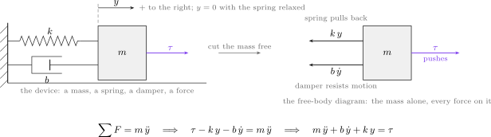

| In the figure | Meaning |
|---|---|
| hatched wall on the left | the fixed reference from which the position $y$ is measured |
| spring $k$ | pulls back in proportion to how far the mass has moved: a force proportional to **position** |
| damper $b$ | resists in proportion to how fast the mass moves: a force proportional to **velocity** |
| grey box $m$ | the one body to which Newton's law is applied |
| violet arrow $\tau$ | the force applied from outside — the input, and later the controller's output |
| arrow $y$ at the top | the positive direction is to the right; $y = 0$ with the spring relaxed |
| right half | the mass cut free: $\tau$ points to $+$, the spring force $k\,y$ and the damper force $b\,\dot y$ point to $-$ |

**Step 3 — the equation of motion.** Three forces act on the mass. With $y > 0$ and $\dot y > 0$ the spring and the damper both push towards $-$, so both enter with a minus sign:

$$
\sum F = m\,\ddot y
\quad\Longrightarrow\quad
\tau - k\,y - b\,\dot y = m\,\ddot y
\quad\Longrightarrow\quad
m\,\ddot y + b\,\dot y + k\,y = \tau
$$

- The highest derivative is the second, so the equation is of **second order**. The reason is physical: the system stores energy in two places, the moving mass (kinetic) and the stretched spring (potential). The damper stores nothing; it dissipates.
- At rest, $\dot y = \ddot y = 0$, and the equation reduces to $k\,y = \tau$: a constant force of 1 N holds the mass at $1/k = 0.5$ m.

**Step 4 — the transfer function.** The Laplace transform turns each derivative into a multiplication by $s$; the initial values appear as separate terms:

$$
\mathcal{L}\{\dot y\} = s\,Y(s) - y(0), \qquad
\mathcal{L}\{\ddot y\} = s^2\,Y(s) - s\,y(0) - \dot y(0)
$$

Both lines follow from the definition $Y(s) = \int_0^\infty y(t)\,e^{-st}\,\mathrm{d}t$ by one integration by parts, applied once for $\dot y$ and twice for $\ddot y$. A transfer function describes the system starting **from rest**, so the initial values are set to zero, and the equation is transformed term by term:

| Time domain | Laplace domain | Why |
|---|---|---|
| $m\,\ddot y(t)$ | $m\,s^2\,Y(s)$ | two derivatives, two factors of $s$ |
| $b\,\dot y(t)$ | $b\,s\,Y(s)$ | one derivative, one factor of $s$ |
| $k\,y(t)$ | $k\,Y(s)$ | no derivative |
| $\tau(t)$ | $T(s)$ | no derivative |

$$
\left(m s^2 + b s + k\right) Y(s) = T(s)
\qquad\Longrightarrow\qquad
G(s) = \frac{Y(s)}{T(s)} = \frac{1}{m s^2 + b s + k} = \frac{1}{s^2 + 2s + 2}
$$

| Symbol | Quantity | Value · source |
|---|---|---|
| $y$ | position of the mass, the controlled output | m |
| $\tau$ | force on the mass, the control input | N |
| $m$ | mass | $1$ kg, `W02_0_setup.m` |
| $b$ | damping coefficient | $2$ N·s/m |
| $k$ | spring stiffness | $2$ N/m |
| $G(0) = 1/k$ | static gain: metres per newton | $0.5$ m/N |

- The denominator set to zero, $m s^2 + b s + k = 0$, is the **characteristic equation**; its roots are the **poles**, here $s = -1 \pm j$. The numerator is a constant, so there is no **zero**.
- $G(0)$ is the static gain: what a constant input produces once everything has settled. It repeats the result of step 3, $y = \tau/k$.
- The plant is stable, nearly linear and has no delay — "well behaved" in the sense of MATLAB Tech Talk part 4, which is the class of plant for which the tuning rules of §2-12 are meant.

**Step 5 — the state-space model.** A transfer function forgets the initial values by construction: asked what happens when the mass is pulled to 0.5 m and released with no force, it answers $Y(s) = G(s)\cdot 0 = 0$ — nothing, which is wrong. The remedy is to keep the equation in the time domain and split the second-order equation into two first-order ones. The quantities to keep are those without which the next instant cannot be computed: the position alone is not enough (the mass may be at rest or passing through at speed), the position and the velocity together are. These are the **states**:

$$
x_1 = y, \quad x_2 = \dot y
\qquad\Longrightarrow\qquad
\begin{aligned}
\dot x_1 &= x_2\\
\dot x_2 &= -\frac{k}{m}\,x_1 - \frac{b}{m}\,x_2 + \frac{1}{m}\,\tau
\end{aligned}
$$

The second line is the equation of motion of step 3 solved for $\ddot y$. Collected into matrices,

$$
\dot{\mathbf{x}} = \mathbf{A}\,\mathbf{x} + \mathbf{B}\,\tau, \quad y = \mathbf{C}\,\mathbf{x}, \qquad
\mathbf{A} = \begin{bmatrix} 0 & 1 \\ -k/m & -b/m \end{bmatrix} = \begin{bmatrix} 0 & 1 \\ -2 & -2 \end{bmatrix}, \quad
\mathbf{B} = \begin{bmatrix} 0 \\ 1/m \end{bmatrix}, \quad
\mathbf{C} = \begin{bmatrix} 1 & 0 \end{bmatrix}
$$

- The eigenvalues of $\mathbf{A}$ are the poles of $G(s)$, $-1 \pm j$, and $\mathbf{C}(s\mathbf{I} - \mathbf{A})^{-1}\mathbf{B} = G(s)$ (`verify_w02_pid` check 9, exact to $8.9\times10^{-16}$).
- The Otter of Week 1 is a state-space model of the same kind, with twelve states instead of two and a nonlinear right-hand side.

The three forms describe one plant. Section B builds all three side by side in Simulink:

| Form | Written as | Simulink block | Can start away from rest? | Where this course uses it |
|---|---|---|---|---|
| differential equation | $m\ddot y + b\dot y + k y = \tau$ | two Integrators and two Gains in a loop | yes: the integrators' initial conditions | Week 1, building the Otter from its physics |
| transfer function | $G(s) = 1/(m s^2 + b s + k)$ | Transfer Fcn | **no** — zero initial conditions by construction | this week: controller design and the PID law itself |
| state space | $\dot{\mathbf{x}} = \mathbf{A}\mathbf{x} + \mathbf{B}\tau$ | State-Space | yes: the vector of initial states | MSS: `otter.m` returns $\dot{\mathbf{x}}$ for twelve states |

Measured in section B: with a 1 N step force the three rows agree to $1.1\times10^{-16}$ m and settle at $0.5$ m; released from $y = 0.5$ m with no force, the differential equation and the state-space rows swing back, while the transfer-function row stays at zero.

## 2-3. The standard second-order system: damping ratio, natural frequency, poles

This section answers: which two numbers decide the shape of a second-order response, and where can they be seen?

**The standard form.** Control engineering writes every second-order system in one form, with unit static gain:

$$
G_2(s) = \frac{\omega_n^2}{s^2 + 2\zeta\omega_n s + \omega_n^2}
$$

Dividing the plant's denominator by $m$ and comparing coefficients names the two numbers:

$$
\frac{1}{m s^2 + b s + k} = \frac{1/m}{s^2 + \frac{b}{m}\,s + \frac{k}{m}}
\qquad\Longrightarrow\qquad
\omega_n^2 = \frac{k}{m},\quad 2\zeta\omega_n = \frac{b}{m}
\qquad\Longrightarrow\qquad
\omega_n = \sqrt{\frac{k}{m}},\quad \zeta = \frac{b}{2\sqrt{m k}}
$$

| Symbol | Name | Physical reading | This plant |
|---|---|---|---|
| $\omega_n$ | natural frequency [rad/s] | a stiffer spring or a lighter mass makes it faster | $\sqrt{2} = 1.414$ rad/s |
| $\zeta$ | damping ratio [–] | a stronger damper makes it ring less | $2/(2\sqrt{2}) = 0.707$ |

- The plant differs from $G_2$ only by its static gain, $1/k$ instead of 1. The shape of its response is set by $\zeta$ and $\omega_n$ alone: three parameters $m$, $b$, $k$ collapse to two numbers, because doubling the mass and the spring together changes nothing in the shape.

**The poles.** The roots of $s^2 + 2\zeta\omega_n s + \omega_n^2 = 0$, by the quadratic formula, are

$$
s = -\zeta\omega_n \pm \omega_n\sqrt{\zeta^2 - 1}
\qquad\xrightarrow{\ \zeta < 1\ }\qquad
s = -\underbrace{\zeta\omega_n}_{\sigma} \pm j\,\underbrace{\omega_n\sqrt{1-\zeta^2}}_{\omega_d}
$$

The sign under the root separates three cases:

| Condition | Poles | Name | Step response |
|---|---|---|---|
| $\zeta < 1$ | a complex pair $-\sigma \pm j\omega_d$ | underdamped | overshoots and rings while it settles |
| $\zeta = 1$ | a double real pole at $-\omega_n$ | critically damped | the fastest response with no overshoot |
| $\zeta > 1$ | two different real poles | overdamped | no overshoot, and slower: the pole nearer the origin dominates |

**Why the poles decide the response.** A partial-fraction expansion splits the response into one term per pole, and each term is an exponential $e^{p t}$. For a pole $p = -\sigma + j\omega_d$,

$$
e^{p t} = e^{-\sigma t}\,\bigl(\cos\omega_d t + j\sin\omega_d t\bigr)
$$

- The real part $\sigma$ sets the **envelope** $e^{-\sigma t}$: how fast the motion dies out. A pole to the right of the imaginary axis ($\sigma < 0$) grows instead, and the system is unstable.
- The imaginary part $\omega_d$ sets how fast the response **oscillates**: the damped frequency.
- Read in polar form, the pole lies at distance $\omega_n$ from the origin, at an angle $\theta$ from the negative real axis with $\cos\theta = \zeta$. The distance is the speed; the angle is the ringing.

**The two relations to remember.** Measured in section B on model `W02_B_second_order`, changing one number at a time:

| $\zeta$ | $\omega_n$ [rad/s] | overshoot [%] (formula) | peak time [s] (formula) | rise [s] | settle [s] | bandwidth [rad/s] |
|---|---|---|---|---|---|---|
| 0.2 | 2 | 52.7 (52.7) | 1.603 (1.603) | 0.602 | 8.59 | 3.02 |
| 0.5 | 2 | 16.3 (16.3) | 1.814 (1.814) | 0.819 | 4.04 | 2.54 |
| 0.707 | 2 | 4.3 (4.3) | 2.221 (2.221) | 1.074 | 2.98 | 2.00 |
| 1 | 2 | 0.0 (0.0) | none | 1.679 | 2.92 | 1.29 |
| 2 | 2 | 0.0 (0.0) | none | 4.115 | 7.44 | 0.53 |
| 0.5 | 1 | 16.3 (16.3) | 3.627 (3.628) | 1.637 | 8.08 | 1.27 |
| 0.5 | 4 | 16.3 (16.3) | 0.907 (0.907) | 0.410 | 2.02 | 5.09 |

- **A larger damping ratio gives less overshoot.** The overshoot depends on $\zeta$ **alone**, $M_p = 100\,e^{-\pi\zeta/\sqrt{1-\zeta^2}}$, and falls monotonically as $\zeta$ grows: $52.7 \to 16.3 \to 4.3 \to 0\,\%$. It is zero from $\zeta = 1$ on. Beyond $\zeta = 1$ more damping only makes the response slower: settling $2.92$ s at $\zeta = 1$, $7.44$ s at $\zeta = 2$.
- **A larger natural frequency gives a faster response, with the same overshoot.** At fixed $\zeta$, every time scales as $1/\omega_n$: doubling $\omega_n$ halves the peak time ($3.627 \to 1.814 \to 0.907$ s), the rise time and the settling time, and leaves the overshoot at $16.3\,\%$. In the s-plane the poles move out along the same ray.

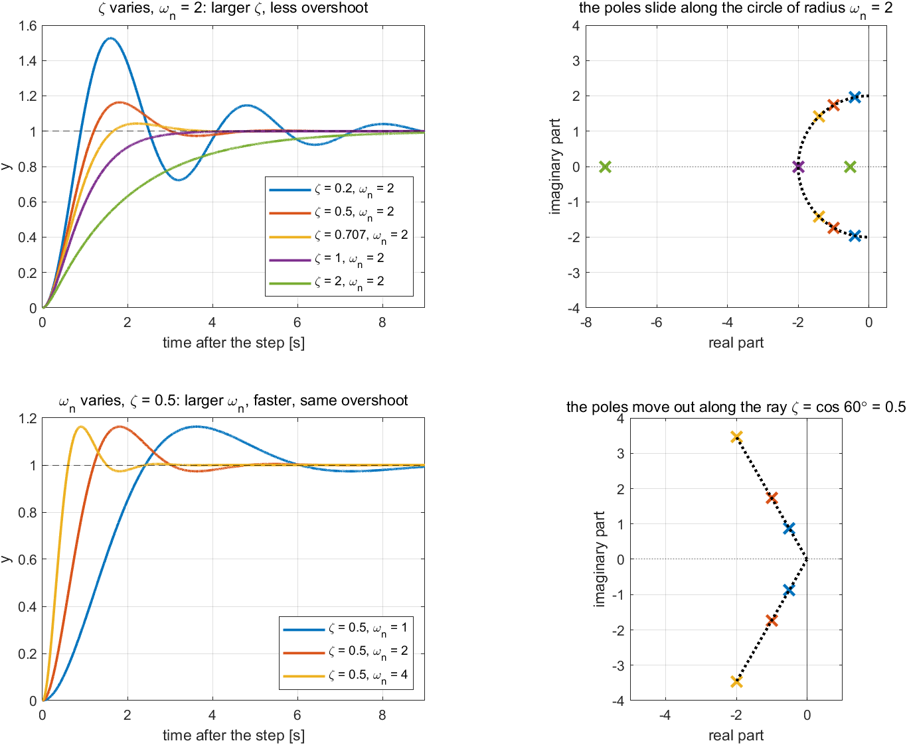

| In the figure | Meaning |
|---|---|
| top left | step responses at $\omega_n = 2$ for five damping ratios |
| top right | their poles: on the circle of radius $\omega_n = 2$ while $\zeta \le 1$; on the real axis, one near the origin and one far out, at $\zeta = 2$ |
| bottom left | step responses at $\zeta = 0.5$ for $\omega_n = 1, 2, 4$ |
| bottom right | their poles: on one ray at $60^\circ$ from the negative real axis, $\cos 60^\circ = 0.5$, farther out as $\omega_n$ grows |

**Bandwidth.** The same speed can be read in the frequency domain. Driven by a sinusoidal setpoint, a system follows slow sinusoids at full amplitude and attenuates fast ones. The **bandwidth** $\omega_B$ is the frequency at which the output amplitude has fallen to $1/\sqrt{2}$ of its static value ($-3$ dB). For the standard form,

$$
\omega_B = \omega_n\,\sqrt{1 - 2\zeta^2 + \sqrt{4\zeta^4 - 4\zeta^2 + 2}}
$$

- At fixed $\zeta$ the bandwidth is **proportional to** $\omega_n$: $1.27$, $2.54$, $5.09$ rad/s for $\omega_n = 1, 2, 4$ at $\zeta = 0.5$. At $\zeta = 0.707$ it equals $\omega_n$ exactly (`verify_w02_pid` check 10).
- A wide bandwidth and a short rise time are the same property seen from two sides. A step contains every frequency, and its corner is followed only as fast as the highest frequency the system passes: the product $t_r\,\omega_B$ stays between 1.8 and 2.2 in every row of the table above.
- Bandwidth returns in §2-13, where it sets how often a digital controller must sample, and in Week 5, where an inner loop must be several times wider than the loop around it.

> [!note] A zero changes the shape, not the poles
> The formulas above assume two poles and no zero. A zero in the numerator mixes a derivative of the response into it: the poles and the settling are unchanged, but the early response is lifted, and the closer the zero to the origin, the larger the overshoot. The derivative term of §2-7 adds exactly such a zero, which is why its measured overshoot departs from the formula.

## 2-4. Time-domain performance metrics: how a response is judged

This section answers: which numbers state how good a response is, and how are they read off a Scope?

"Fast and not too oscillatory" cannot be checked; "overshoot below 10 % and settled within 3 s" can. Requirements arrive as numbers, and a controller is finished when its measured numbers meet them. Every result from here to the end of the course is stated in the five numbers below, and the tuning order of §2-12 begins by writing them down.

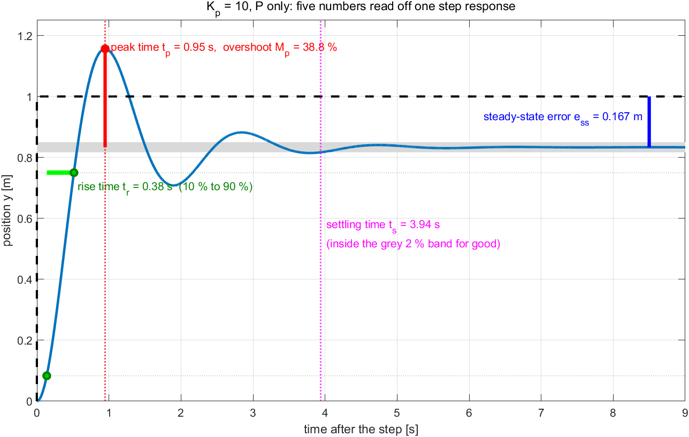

| In the figure | Meaning |
|---|---|
| blue curve, black dashed line | the response of the P loop at $K_p = 10$ (§2-6) and its setpoint of 1 m |
| green bar and dots | the rise time: from 10 % to 90 % of the final value |
| red dot and red vertical bar | the peak: its time is the peak time, its height above the final value the overshoot |
| grey band | $\pm 2\,\%$ of the final value |
| magenta dotted line | the settling time: after it the response stays inside the grey band |
| blue bar on the right | the steady-state error: the gap left between setpoint and final value |

| Metric | Definition | What it answers | Standard second order |
|---|---|---|---|
| rise time $t_r$ | time from 10 % to 90 % of the final value | how fast | falls as $1/\omega_n$ |
| peak time $t_p$ | time of the highest peak | how fast | $\pi/\omega_d = \pi/\bigl(\omega_n\sqrt{1-\zeta^2}\bigr)$ |
| overshoot $M_p$ | $100\,(y_{\max} - y_{ss})/y_{ss}$ [%] | how much it rings | $100\,e^{-\pi\zeta/\sqrt{1-\zeta^2}}$, $\zeta$ alone |
| settling time $t_s$ | the last time the response is outside $\pm 2\,\%$ of $y_{ss}$ | when it is over | $\approx 4/(\zeta\omega_n) = 4/\sigma$ |
| steady-state error $e_{ss}$ | $y_d - y_{ss}$ | how exact | the final value theorem, below |

- **Every time is measured from the instant of the step**, which is $t = 1$ s in every model of this week. `_tools/step_metrics.m` does this for every script in the course, and MATLAB's `stepinfo` computes the same quantities for a transfer function.
- **The overshoot is measured against the final value, not the setpoint.** At $K_p = 2$ the P loop settles at 0.5 m and peaks at 0.58 m: it overshoots its own final value by $16.3\,\%$ and never reaches the 1 m it was asked for. The overshoot and the steady-state error are separate questions.
- **The band must be stated.** The 2 % band is the default of this course; the tuning order of §2-12 uses 1 % and says so. A settling time quoted without its band cannot be compared.
- A sixth number is not in the response at all: the **largest control input**. §2-6 shows a gain that looks good on every metric above while asking the actuator for more than it has.

**The formulas against the measurement.** The P loop of §2-6 is an exact standard second-order system with $\omega_n = \sqrt{k + K_p}$ and $\zeta = b/\bigl(2\sqrt{k+K_p}\bigr)$, so the formulas can be checked on it. Measured in section C:

| $K_p$ | $\zeta$ | $\omega_n$ [rad/s] | peak time [s] (formula) | settle [s] (formula $4/\zeta\omega_n$) | $e_{ss}$ [m] |
|---|---|---|---|---|---|
| 2 | 0.500 | 2.000 | 1.814 (1.814) | 4.04 (4.00) | 0.500 |
| 10 | 0.289 | 3.464 | 0.947 (0.947) | 3.94 (4.00) | 0.167 |
| 50 | 0.139 | 7.211 | 0.440 (0.440) | 3.64 (4.00) | 0.038 |

- The peak time is exact. The settling formula is an estimate from the envelope and lands within 10 %.
- $\zeta\omega_n = b/(2m) = 1$ for every $K_p$: a proportional gain moves the poles **up**, along the vertical line $\mathrm{Re}(s) = -1$, and never to the left. The ringing grows and the settling time does not improve. Moving the poles left needs damping, which is what the derivative of §2-7 adds.

**The steady-state error and the system type.** For a unit step setpoint and a loop gain $L(s) = C(s)\,G(s)$, the error is $E(s) = Y_d(s)/\bigl(1 + L(s)\bigr)$, and the final value theorem gives

$$
e_{ss} = \lim_{s\to 0} s\,E(s) = \frac{1}{1 + L(0)}
\qquad\text{for P control:}\qquad
L(0) = K_p\,G(0) = \frac{K_p}{k}
\quad\Longrightarrow\quad
e_{ss} = \frac{k}{k + K_p}
$$

- $L(0)$ stays finite unless $L(s)$ contains a factor $1/s$ — an integrator. The number of integrators in $L(s)$ is the **system type**.

| Loop | Type | Step setpoint | Ramp setpoint |
|---|---|---|---|
| P or PD around this plant | 0 | error $1/(1 + L(0))$, finite | error grows without bound |
| PID around this plant | 1 | **zero** error (§2-8) | finite error |

- The formula holds only for a stable loop; an unstable loop has no steady state to measure.

**One number for a whole response.** Automatic tuners compare many runs by a single integral of the error over a fixed window:

| Criterion | Definition | Penalises |
|---|---|---|
| IAE | $\int_0^T \lvert e \rvert\,\mathrm{d}t$ | every error equally |
| ISE | $\int_0^T e^2\,\mathrm{d}t$ | large errors, hence overshoot |
| ITAE | $\int_0^T t\,\lvert e \rvert\,\mathrm{d}t$ | errors that last, hence slow settling |

- Measured in section C over the 9 s after the step, the IAE is $4.750$, $1.761$ and $0.837$ m·s for $K_p = 2, 10, 50$. With an error that never vanishes, most of the integral is that error times the window — $0.5 \times 9 = 4.5$ of the $4.750$ at $K_p = 2$ — so an integral criterion is meaningful only with a fixed window and a type-1 loop. This course uses the five numbers above.

**What each gain does to the metrics.** Measured in sections C to E, one gain raised at a time:

| Raised | Rise time | Overshoot | Settling time | Steady-state error | Section |
|---|---|---|---|---|---|
| $K_p$: 2 → 50 | shorter, $0.819 \to 0.158$ s | larger, $16.3 \to 64.4\,\%$ | nearly unchanged, $4.04 \to 3.64$ s | smaller, $0.500 \to 0.038$ | C |
| $K_d$: 0 → 6 | — | smaller, $38.8 \to 8.6\,\%$ | shorter, $3.94 \to 1.27$ s | unchanged, $0.167$ | D |
| $K_i$: 0 → 4 → 12 | — | $9.8 \to 0.0 \to 4.7\,\%$ | $1.32 \to 4.84 \to 1.49$ s | removed | E |

- The first two rows are the tendencies found in every textbook table (for example the *Control Tutorials for MATLAB and Simulink*, "Introduction: PID Controller Design"). The third shows why such a table is a tendency, not a law: a small $K_i$ removes the error slowly, a larger one quickly but with overshoot. Only the measurement decides.

## 2-5. Feedback, and one error read three ways

This section answers: what does a controller see, and what does it do with it?

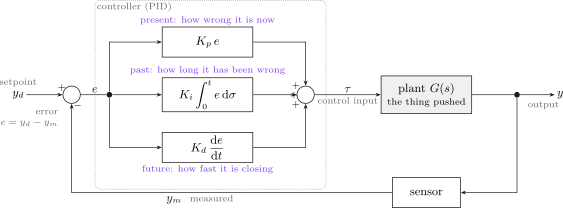

| In the figure | Meaning |
|---|---|
| $y_d$, setpoint | where the output should be — also called command or reference |
| circle with $+$ and $-$ | subtracts the measurement from the setpoint; its output is the **error** $e$ |
| three boxes in the dotted frame | the controller: the same error read three ways, in violet above and below each box |
| $\tau$, control input | the sum of the three, pushed into the plant |
| sensor, $y_m$ | the measured output fed back; this week $y_m = y$ plus noise when noise is switched on |

A controller receives **one** signal, the error, and the PID reads it three ways:

$$
e(t) = y_d(t) - y_m(t), \qquad
\tau(t) = \underbrace{K_p\,e(t)}_{\text{present}}
+ \underbrace{K_i\!\int_0^t e(\sigma)\,\mathrm{d}\sigma}_{\text{past}}
+ \underbrace{K_d\,\frac{\mathrm{d}e(t)}{\mathrm{d}t}}_{\text{future}}
$$

| Term | What it reads from the error | In words (Tech Talk part 1) | What it cannot do alone |
|---|---|---|---|
| P, $K_p e$ | how wrong it is **now** | "far away, push hard" | hold a position against a spring: zero error gives zero force |
| I, $K_i\!\int e$ | how long it **has been** wrong | "still not there, push more" | act quickly: it responds late and stops late |
| D, $K_d\,\dot e$ | how fast the error is **closing** | "about to arrive, brake" | know where the target is: a constant error gives no derivative |

**The picture to keep.** On this plant each term does something a mechanic would recognise, and §2-6 to §2-8 prove it from the equation of motion:

| Term | Acts like | So it |
|---|---|---|
| P | a **spring** pulling the mass towards $y_d$ | makes the loop faster and bouncier; a spring alone never holds against another spring without stretching |
| D | a **shock absorber** (damper) | calms the bounce; it resists motion, not position |
| I | a **patient hand** that pushes harder the longer the error lasts | removes the error that the springs leave; being patient, it is also slow and can overdo it |

| Symbol | Quantity | Unit on this plant |
|---|---|---|
| $K_p$ | proportional gain | N/m |
| $K_i$ | integral gain | N/(m·s) |
| $K_d$ | derivative gain | N·s/m |

> [!warning] Why the textbook letters $r$ and $u$ are not used
> Control textbooks write the setpoint $r$ and the control input $u$. In this course $u$ is the **surge velocity** and $r$ the **yaw rate** — Week 3's speed loop is $u_d - u$ — so a page on which $u$ is both a speed and a control input cannot be read. The setpoint is therefore $y_d$ and the control input $\tau$, as in Fossen's notation. $y$ this week is a generic output, not the east position $y^n$.

## 2-6. P — the present error: faster, more oscillatory, never exact

This section answers: what does a proportional controller achieve on this plant, and what can it never achieve?

With $\tau = K_p(y_d - y)$ substituted into the equation of motion:

$$
m\,\ddot y + b\,\dot y + (k + K_p)\,y = K_p\,y_d
\qquad\Longrightarrow\qquad
T(s) = \frac{Y(s)}{Y_d(s)} = \frac{K_p}{m s^2 + b s + k + K_p}
$$

- **The controller adds stiffness.** $K_p$ sits beside $k$: a proportional controller is a second, adjustable spring pulling towards $y_d$.
- Reading the standard second-order form of §2-3 off the denominator,

$$
\omega_n = \sqrt{\frac{k + K_p}{m}}, \qquad
\zeta = \frac{b}{2\sqrt{m\,(k + K_p)}}, \qquad
M_p = 100\,\exp\!\left(\frac{-\pi\zeta}{\sqrt{1 - \zeta^2}}\right)\ \%
$$

- The steady value follows from the final value theorem for a unit step, $y_{ss} = T(0)$ (§2-4):

$$
y_{ss} = \frac{K_p}{k + K_p}, \qquad e_{ss} = 1 - y_{ss} = \frac{k}{k + K_p}
$$

| Check | Result |
|---|---|
| dimensions | $K_p$ and $k$ are both N/m, so $y_{ss}$ is dimensionless per metre of setpoint |
| limit $K_p \to 0$ | $y_{ss} \to 0$: no controller, no motion |
| limit $K_p \to \infty$ | $y_{ss} \to 1$ but $\zeta \to 0$: the error vanishes only as the damping does |
| numeric | `verify_w02_pid` check 2: formula against the step response of $T(s)$, largest difference $2.0\times10^{-9}$ |

**Why the error never reaches zero.** Holding the mass at $y$ against the spring takes a steady force $k\,y$. A proportional controller produces force only from error, $\tau = K_p e$, so to produce $k\,y$ some error must remain: $e_{ss} = k\,y_{ss}/K_p$, which rearranges to the formula above. Tech Talk part 1 makes the same argument with a drone that needs a fixed propeller speed to hover.

Measured in section C:

| $K_p$ | $y_{ss}$ | $M_p$ | $e_{ss}$ | rise [s] | settle [s] | peak $\tau$ [N] |
|---|---|---|---|---|---|---|
| 2 | 0.500 | 16.3 % | 0.500 | 0.819 | 4.04 | 2.0 |
| 10 | 0.833 | 38.8 % | 0.167 | 0.377 | 3.94 | 10.0 |
| 50 | 0.962 | 64.4 % | 0.038 | 0.158 | 3.64 | 50.0 |

- Every measured $y_{ss}$ and $M_p$ equals the formula to the digits shown. $K_p = 2$ gives $\zeta = 0.5$ and $\omega_n = 2$ rad/s, the textbook's $16.3\,\%$.
- The last column is the price: at the step the whole error is 1 m and the force jumps to $K_p$ newtons. A gain chosen from the response alone can ask the actuator for more than it has — Tech Talk part 6 shows a design that looked perfect until its 350 V command met a 24 V motor.

## 2-7. D — the future error: a brake

This section answers: what does the derivative term add, and why does it not remove the error?

With $\tau = K_p e + K_d\,\dot e$ and $e = y_d - y$ substituted into the equation of motion,

$$
m\,\ddot y + (b + K_d)\,\dot y + (k + K_p)\,y = K_p\,y_d + K_d\,\dot y_d
$$

$$
\zeta = \frac{b + K_d}{2\sqrt{m\,(k + K_p)}}, \qquad
T(s) = \frac{K_d s + K_p}{m s^2 + (b + K_d)s + k + K_p}
$$

- **$K_d$ sits beside the damping $b$.** The derivative term is a second, adjustable damper: while the mass rushes towards the setpoint the error is shrinking, $\dot e < 0$, and the term takes force away before the setpoint is reached.
- The steady value is unchanged, $T(0) = K_p/(k + K_p)$. In steady state nothing moves, $\dot e = 0$, and the derivative contributes nothing.
- The numerator has gained a **zero** at $s = -K_p/K_d$. A zero closer to the origin than the poles lifts the early response, so the response can overshoot even when $\zeta > 1$.

> [!note] The same term lands elsewhere on other axes
> On this plant $K_d$ lands beside the damping, because the output is a position and its derivative a velocity. In Week 3 the output is a velocity, its derivative an acceleration, and the same term lands beside the **mass** (Week 3 §3-4). In Week 4 the output is an angle and $K_d$ is a damper again. The term does not change; the axis does.

Measured in section D, $K_p = 10$, $K_i = 0$:

| $K_d$ | $\zeta$ | zero at | $M_p$ | settle [s] | $e_{ss}$ | peak $\tau$ [N] |
|---|---|---|---|---|---|---|
| 0 | 0.289 | none | 38.8 % | 3.94 | 0.167 | 10.0 |
| 2 | 0.577 | $-5.00$ | 16.9 % | 1.40 | 0.167 | 49.9 |
| 6 | 1.155 | $-1.67$ | 8.6 % | 1.27 | 0.167 | 129.6 |

- The overshoot and the settling time fall together; the error left does not move.
- At $K_d = 6$ the damping ratio exceeds one and the response still overshoots. With an ideal derivative the poles are real, at $-2$ and $-6$, and the zero at $-1.67$ alone produces $5.55\,\%$; the model's filtered derivative (§2-10) gives the measured $8.6\,\%$.
- The peak force grows with $K_d$: at the corner of the step the filtered derivative jumps to $K_d N_f$ times the step height. That spike is the derivative kick of §2-10.

## 2-8. I — the past error: time removes it, and too much destabilises

This section answers: how does the integral remove the error that P and D leave, and what does it cost?

With all three terms, the Laplace transform of the loop gives the characteristic polynomial

$$
m s^3 + (b + K_d)\,s^2 + (k + K_p)\,s + K_i = 0 ,
\qquad
\frac{E(s)}{Y_d(s)} = \frac{s\,(m s^2 + b s + k)}{m s^3 + (b + K_d)s^2 + (k + K_p)s + K_i}
$$

**The error goes to zero.** For a unit step, the final value theorem gives $e_{ss} = \lim_{s\to 0} s\,E(s) = 0$: the factor $s$ in the numerator comes from the integrator. The loop is now **type 1**.

**The integral finds the force on its own.** The integral stops changing only when its input, the error, is zero. Where it stops is therefore exactly the force that holds the mass against the spring, $k\,y_d = 2$ N — a number the controller was never told.

**Too much integral destabilises.** The Routh array of the cubic above is stable if and only if every coefficient is positive and

$$
(b + K_d)(k + K_p) > m\,K_i
\qquad\Longrightarrow\qquad
K_i < \frac{(b + K_d)(k + K_p)}{m} = \frac{(2+4)(2+10)}{1} = 72
$$

- At the limit the cubic has a pair of roots on the imaginary axis at $s = \pm j\sqrt{(k + K_p)/m} = \pm j\,3.464$ rad/s (`verify_w02_pid` check 4, exact to $10^{-9}$).
- The controller actually built uses the filtered derivative of §2-10, which adds a pole; its limit, found by bisection on the closed-loop poles, is $K_i = 87.07$, oscillating at $3.856$ rad/s. The limit that matters is the one of the implemented law.

| Symbol | Quantity | Value |
|---|---|---|
| $K_p,\ K_d$ | held fixed in section E | $10$ N/m, $4$ N·s/m |
| $K_i^{\max}$, ideal derivative | Routh limit | $72$ N/(m·s) |
| $K_i^{\max}$, filtered, $N_f = 20$ | pole-crossing limit | $87.07$ N/(m·s) |

Measured in section E:

| $K_i$ | $y$ at 10 s | $M_p$ | settle [s] | error left | $I$ at 10 s [N] |
|---|---|---|---|---|---|
| 0 | 0.8333 | 9.8 % | 1.32 | $1.67\times10^{-1}$ | 0.000 |
| 4 | 0.9957 | 0.0 % | 4.84 | $4.33\times10^{-3}$ | 1.958 |
| 12 | 1.0000 | 4.7 % | 1.49 | $3.39\times10^{-6}$ | 2.000 |

- $K_i = 4$ removes the error but slowly: the settling time grows from 1.32 s to 4.84 s. $K_i = 12$ removes it fast and brings the overshoot back.
- Run at $0.9$ and $1.1$ times the limit, the largest error between 30 and 40 s is $0.046$ m and $13.353$ m: the same oscillation decays on one side and grows on the other. The integral acts late, and a large enough late push arrives in phase with the swing it was meant to correct.

## 2-9. One transfer function: two zeros, a pole, and the Simulink block

This section answers: what is tuning, seen as a transfer function, and is the Simulink PID block the same thing as the law above?

$$
C(s) = K_p + \frac{K_i}{s} + K_d\,s = \frac{K_d s^2 + K_p s + K_i}{s}
$$

- A PID is **one pole at the origin** (the integrator, fixed), **two zeros** whose places $K_p$, $K_i$ and $K_d$ decide, and an overall gain. Tuning a PID is choosing where those two zeros go and how much gain to apply (Tech Talk part 6).
- The implemented derivative is filtered (§2-10), which adds one more pole at $s = -N_f$:

$$
C(s) = K_p + \frac{K_i}{s} + K_d\,\frac{N_f\,s}{s + N_f}
$$

This is exactly the formula printed in the dialog of the Simulink **PID Controller** block (parallel form), with P, I, D and N its four fields. Model `W02_F_block_vs_hand` builds the same law from ordinary blocks on the top row and puts the library block on the bottom row, and runs both through a force limit and sensor noise.

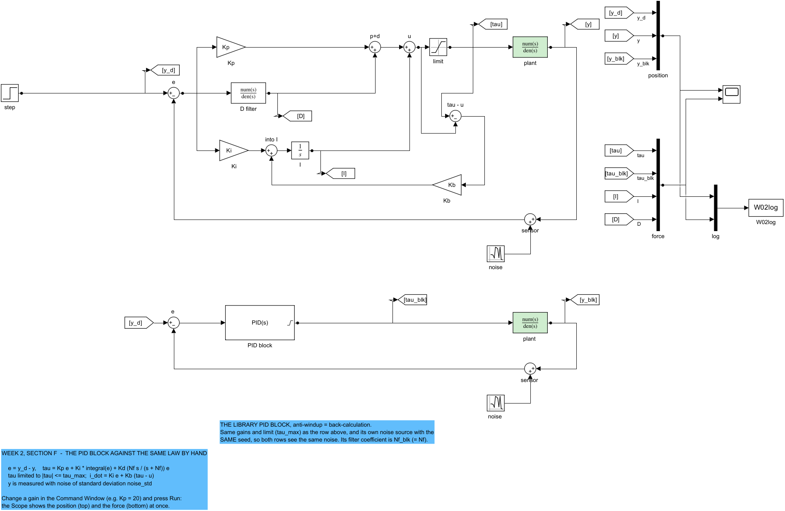

| In the figure | Meaning |
|---|---|
| `Kp`, `D filter`, `Ki` + `I` | the three terms, one block each; `D filter` is the transfer function $K_d N_f s/(s+N_f)$ |
| `p+d`, `u` | the sums that form the demand $u = P + D + I$ |
| `limit` | the actuator: $\tau = \mathrm{sat}(u)$, $\lvert\tau\rvert \le \tau_{\max}$ |
| `tau - u`, `Kb` and the line back to `into I` | the back-calculation of §2-11 |
| `PID block` on the bottom row | the library block with the same gains, limit and $K_b$ |
| Goto tags and the Scope on the right | every signal reaches one Scope: position on top, force below |

Measured in section F, with $\lvert\tau\rvert \le 2.5$ N and 5 mm of sensor noise:

| Comparison | largest $\lvert\Delta y\rvert$ [m] | largest $\lvert\Delta\tau\rvert$ [N] |
|---|---|---|
| built from blocks against the PID block | $9.99\times10^{-16}$ | $6.35\times10^{-14}$ |
| control: the block's $N_f$ changed from 20 to 19 | $1.20\times10^{-3}$ | $0.187$ |

- The two rows agree to round-off through the limit, the anti-windup and the noise.
- The control row shows the comparison is not blind: a 5 % change in one number shows at once.

| Field of the PID block dialog | Block of the law built by hand |
|---|---|
| Proportional (P) | `Kp` |
| Integral (I) | `Ki`, before the integrator |
| Derivative (D), Filter coefficient (N) | `D filter`, numerator `[Kd*Nf 0]`, denominator `[1 Nf]` |
| Back-calculation coefficient (Kb) | `Kb` |

## 2-10. The derivative in practice: noise, and the corner of a step

This section answers: why is a textbook derivative never implemented as written, and what replaces it?

**A derivative amplifies by speed, not by size.** For one frequency component of any signal,

$$
\frac{\mathrm{d}}{\mathrm{d}t}\,A\sin(\omega t) = A\,\omega\,\cos(\omega t)
$$

- The amplitude is multiplied by $\omega$. Sensor noise is the fastest signal present, so the derivative selects the noise and amplifies it without bound (Tech Talk part 3).

**The remedy is a first-order low-pass filter in front of the derivative:**

$$
D(s) = K_d\,\frac{N_f\,s}{s + N_f}
\qquad
\lvert D(j\omega)\rvert \approx
\begin{cases}
K_d\,\omega, & \omega \ll N_f \quad\text{(a derivative)}\\[2pt]
K_d\,N_f, & \omega \gg N_f \quad\text{(a ceiling)}
\end{cases}
$$

| Symbol | Quantity | Value |
|---|---|---|
| $N_f$ | filter coefficient: where differentiating stops | $20$ rad/s; "Filter coefficient (N)" in the PID block, written $N$ in Week 3 |
| $K_d N_f$ | the ceiling on the derivative's gain | $80$ N·s/m at $K_d = 4$ |

- `verify_w02_pid` check 5: $\lvert D(j\,0.01)\rvert/K_d = 0.01000$ and $\lvert D(j\,10^5)\rvert/K_d = 20.000$.

In Simulink this is one **Transfer Fcn** block, numerator `[Kd*Nf 0]` and denominator `[1 Nf]` — the block `D filter` in every model of this week. Tech Talk part 3 shows the same thing built as a gain $N_f$ with an integrator in its feedback path, $N_f/(1 + N_f/s)$; the two are one transfer function (`verify_w02_pid` check 5).

**Seeing it on a bench.** Model `W02_G_derivative_bench` has no loop at all. It adds noise of standard deviation 5 mm to $\sin(0.5t)$, whose true derivative $0.5\cos(0.5t)$ never exceeds $0.5$, and differentiates the result twice — once purely, once through the filter.

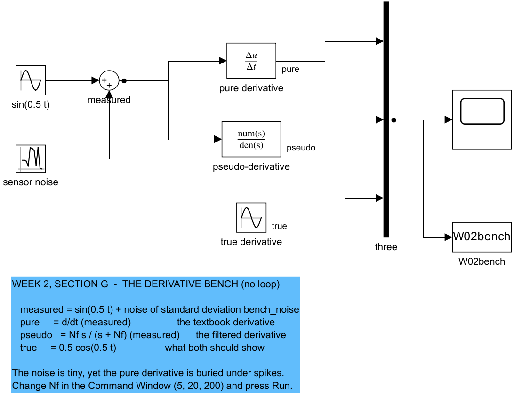

| In the figure | Meaning |
|---|---|
| `sin(0.5 t)` + `sensor noise` → `measured` | the signal a sensor would report |
| `pure derivative` | the textbook $\mathrm{d}/\mathrm{d}t$ |
| `pseudo-derivative` | $N_f s/(s + N_f)$, the same filter as `D filter` with $K_d = 1$ |
| `true derivative` | $0.5\cos(0.5t)$, what both should show |

| $N_f$ | largest pure derivative | largest pseudo-derivative | true |
|---|---|---|---|
| 5 | 26.55 | 0.56 | 0.5 |
| 20 | 26.55 | 0.75 | 0.5 |
| 200 | 26.55 | 5.18 | 0.5 |

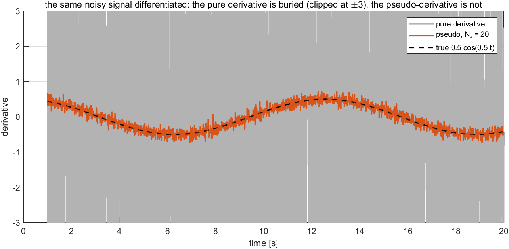

| In the figure | Meaning |
|---|---|
| grey | the pure derivative, clipped at $\pm 3$ so that the rest can be seen; it reaches 26.55 |
| orange | the pseudo-derivative with $N_f = 20$ |
| black dashed | the true derivative $0.5\cos(0.5t)$ |

- Noise of 5 mm turns the pure derivative into spikes 53 times larger than the true value. The pseudo-derivative follows the truth, and the higher its ceiling $N_f$, the more noise it lets through.

**The corner of a step.** A step setpoint makes the error jump. The filtered derivative of a jump of height $\Delta$ starts at $K_d N_f \Delta$ and decays with time constant $1/N_f$ — the **derivative kick** (`verify_w02_pid` check 6: $80.000$ N for $K_d = 4$, $N_f = 20$, $\Delta = 1$). An unfiltered derivative of a step is an impulse. The 제어조교 Ctrl튜브 video's remedy is to take the corner off the setpoint by passing it through a first-order filter $1/(T_f s + 1)$, so that its slope is at most $\Delta/T_f$.

> [!note] Two other remedies, used later
> Differentiating the measurement instead of the error — setting the setpoint weight $c_d = 0$ — removes the kick altogether, and is the choice Week 3 §3-4 and Week 4 make. A reference model that produces a smooth setpoint together with its derivative is the complete answer; it is the subject of Week 8.

In the loop (`W02_G_noise_kick`, $K_p = 10$, $K_i = 8$, $K_d = 4$), measured in section G:

| Derivative | ceiling $K_d N_f$ | force std [N], $t>6$ s | $y$ std [mm], $t>6$ s | $M_p$, no noise |
|---|---|---|---|---|
| $N_f = 5$ | 20 | 0.16 | 0.59 | 16.0 % |
| $N_f = 20$ | 80 | 0.45 | 0.57 | 0.0 % |
| $N_f = 200$ | 800 | 3.06 | 0.54 | 0.0 % |
| pure derivative | none | 9.29 | 0.60 | 9.0 % |

| Setpoint | peak force [N] | peak D term [N] |
|---|---|---|
| step | 89.7 | 79.7 |
| smoothed, $T_f = 0.3$ s | 10.5 | 8.1 |

- The force chatters in proportion to the ceiling, while the position wanders by $0.54$ to $0.60$ mm in all four runs. The extra force is spent on the noise, not on the mass.
- Too low a ceiling costs damping instead: at $N_f = 5$ the filter delays the derivative so much that it no longer brakes in time, and the overshoot returns to $16\,\%$. $N_f$ sits above the frequencies of the response and below those of the noise.
- Smoothing the setpoint cuts the peak force by a factor of $8.5$; the response pays only by arriving as late as the smoothed setpoint does.

## 2-11. The integral in practice: the actuator has a limit

This section answers: what goes wrong when the actuator saturates, and how is the integrator protected?

- Every real actuator saturates: a motor has a maximum speed, a thruster a maximum thrust. In a linear model any force is available; in hardware it is not (Tech Talk part 2).
- While the actuator sits on its limit, the error stays large, and the integrator — which does not know about the limit — keeps accumulating. When the output finally reaches the setpoint, the stored charge keeps pushing, and it can be removed only by **negative** error, that is, by overshooting. This is **integrator windup**.

Two remedies are in common use:

| Scheme | What the integrator does while saturated | Source |
|---|---|---|
| clamping (conditional integration) | stops integrating when **both** the output is saturated **and** the error has the same sign as the output — the integral would only make it worse | Tech Talk part 2 |
| back-calculation | integrates $K_i e + K_b(\tau - u)$: the excess the actuator cut off is fed back and pulls the integrator back | Åström & Murray, Ch. 11 |

For back-calculation, the integrator's input is

$$
\dot I = K_i\,e + K_b\,(\tau - u),
\qquad u = P + I + D,
\qquad \tau = \mathrm{sat}(u)
$$

and while the actuator is saturated at $\tau_{\max}$, setting $\dot I = 0$ shows where the integrator is driven:

$$
I^\star = \tau_{\max} - P - D + \frac{K_i}{K_b}\,e
$$

- $I^\star$ is the value that makes the demand equal to the limit. When $P$ alone already asks for more than $\tau_{\max}$, $I^\star$ is **negative**: the integrator goes below zero, and that is the formula working, not a fault.
- Tech Talk part 2 adds a practical rule: set the controller's limit a little below the actuator's physical one, because the physical limit drifts with temperature and wear.
- Week 3 §3-6 derives all three schemes on the Otter and compares them with the Simulink block.

**The experiment that makes windup obvious.** Model `W02_H_antiwindup` limits the force to $\lvert\tau\rvert \le 2.5$ N. Against a spring of $k = 2$ N/m that can hold the mass at most at $2.5/2 = 1.25$ m. The target is set to an **unreachable** 2 m from $t = 1$ to 15 s, then lowered to a reachable 0.5 m. The top row is the law built from blocks with back-calculation ($K_b = 0$ turns it off); the bottom row is the library PID block, whose anti-windup method the script switches between none, clamping and back-calculation.


| In the figure | Meaning |
|---|---|
| `step`, `step 2`, `two steps` | the setpoint: 2 m at $t = 1$ s, 0.5 m at $t = 15$ s |
| `limit`, `tau - u`, `Kb` | the force limit and the back-calculation path into `into I` |
| `PID block` | the library block, anti-windup method set per run by the script |

Measured in section H, $K_p = 10$, $K_i = 8$, $K_d = 4$:

| Anti-windup | $y$ at 15 s [m] | back within 2 % of 0.5 m after [s] |
|---|---|---|
| none | 1.250 | **never** (within the 15 s that remain) |
| clamping | 1.250 | 4.41 |
| back-calculation | 1.250 | 4.06 |

- Without anti-windup the integrator has stored **94.0 N** by $t = 15$ s — the actuator can give 2.5 N. When the target drops, that charge keeps the force on its limit for the rest of the run: the mass does not come back. On a vessel this looks like ignoring a stop command.
- With back-calculation the integrator sits at $-1.96$ N at $t = 15$ s. The formula predicts it: $e = 2 - 1.25 = 0.75$, $P = 7.5$ N, $D = 0$, so $I^\star = 2.5 - 7.5 + (8/2)(0.75) = -2.0$ N.
- Clamping and back-calculation both recover in about 4 s; back-calculation also reproduces the library block to $6.66\times10^{-16}$ m.
- The back-calculation gain matters little here: $K_b = 0.5, 2, 10, 50$ recover in 4.26, 4.06, 4.37 and 4.28 s.

## 2-12. The tuning order — one gain at a time

This section answers: in what order are the three gains chosen, and from what?

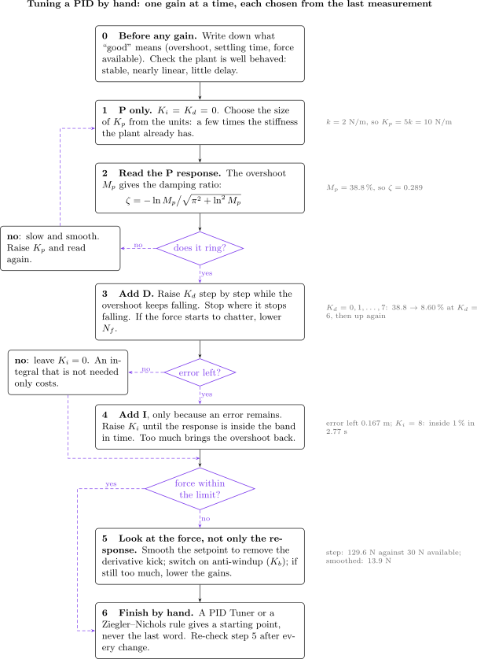

| In the figure | Meaning |
|---|---|
| numbered boxes, top to bottom | the steps, done in this order and one at a time |
| violet diamonds | the three questions that decide the next step: does it ring, is an error left, is the force within the limit |
| violet dashed arrows | the branches: back to $K_p$, skip the integral, skip the force fix |
| grey text on the right | what each step measured on this plant in section I |

| Step | What is done | Why in this order |
|---|---|---|
| 0 | write down what "good" means — overshoot, settling time, the force available — and check that the plant is well behaved | without a requirement there is no point at which to stop; for a plant that is unstable, strongly nonlinear or delayed these rules may not apply (Tech Talk part 4) |
| 1 | P only, $K_i = K_d = 0$; choose the **scale** of $K_p$ from the units | the error is in metres and the force in newtons: $K_p$ must be several times the stiffness the plant already has, here $k = 2$ N/m, so $K_p = 5k$ (Ctrl튜브) |
| 2 | read the P response: the overshoot gives the damping ratio | $\zeta = -\ln M_p/\sqrt{\pi^2 + \ln^2 M_p}$; ringing means the next term is D, not I (Ctrl튜브; `verify_w02_pid` check 3 confirms the formula is the exact inverse) |
| 3 | raise $K_d$ while the overshoot keeps falling; stop where it stops falling | the derivative has an optimum: its zero at $-K_p/K_d$ moves towards the origin and pushes the response up again (§2-7); if the force chatters, lower $N_f$ |
| 4 | add $K_i$ only if an error remains, until the response is inside the band in time | an integral that is not needed only costs — slower settling, returning overshoot, windup (§2-8) |
| 5 | look at the **force**, not only the response | smooth the setpoint, switch on anti-windup, or lower the gains (Tech Talk part 6) |
| 6 | finish by hand | a PID Tuner or a Ziegler–Nichols rule gives a starting point, never the last word (Tech Talk parts 4 and 6); repeat step 5 after every change |

Applied to this plant in section I, with the targets "inside 1 % within 3 s" and "30 N available":

| Stage | $K_p$ | $K_d$ | $K_i$ | $M_p$ | inside 1 % after | peak force |
|---|---|---|---|---|---|---|
| 1–2 P only | 10 | 0 | 0 | 38.77 % | never | 10.0 N |
| 3 P + D | 10 | 6 | 0 | 8.60 % | never | 129.6 N |
| 4 P + I + D | 10 | 6 | 8 | 0.16 % | 2.77 s | 129.6 N |
| 5 the same, setpoint smoothed | 10 | 6 | 8 | 0.15 % | 3.11 s | 13.9 N |

- Step 2 read $M_p = 38.8\,\%$ as $\zeta = 0.289$, the value $b/(2\sqrt{k+K_p})$ predicts.
- Step 3 raised $K_d$ through $0, 1, \dots, 7$; the overshoot fell $38.77 \to 24.95 \to 16.94 \to 12.34 \to 9.83 \to 8.71 \to 8.60$ and rose to $9.22$ at $K_d = 7$, so $K_d = 6$.
- Step 4 found $K_i = 8$ as the first integer gain inside 1 % within 3 s.
- Step 5 found the answer to the question the response never asks: the step demands $129.6$ N against $30$ N available. Smoothing the setpoint brings it to $13.9$ N at the cost of $0.34$ s.

## 2-13. Two ideas the rest of the course leans on

This section answers: what changes when the controller runs on a computer, and when one loop sits inside another?

**Sampled control.** A digital controller reads the sensor, computes, and holds its output until the next sample (Tech Talk part 7). While the sample time $T_s$ is short against the closed loop's speed, nothing changes; past that, the controller acts on stale information.

| Rule | Statement | Source |
|---|---|---|
| sample fast enough | sample at least 20 times the closed-loop bandwidth: $T_s\,\omega_B \le 2\pi/20 = 0.31$ | Franklin, Powell & Workman, *Digital Control of Dynamic Systems*, Ch. 11 |
| tune in continuous time | design in $s$, convert to $z$, then check the sample time | Tech Talk part 7 |

Measured in section J, the default gains, $\omega_B = 6.11$ rad/s:

| $T_s$ [s] | $T_s\,\omega_B$ | largest $\lvert z\rvert$ | $M_p$ | settle [s] |
|---|---|---|---|---|
| continuous | — | — | 0.0 % | 2.06 |
| 0.01 | 0.06 | 0.9868 | 0.2 % | 2.05 |
| 0.05 | 0.31 | 0.9364 | 1.4 % | 2.00 |
| 0.1 | 0.61 | 0.8779 | 5.0 % | 1.90 |
| 0.2 | 1.22 | 0.7734 | 25.6 % | 1.80 |
| 0.3 | 1.83 | 0.6830 | 37.9 % | 2.70 |
| 0.4 | 2.44 | 0.8105 | 67.8 % | 7.20 |

- The same gains that are fine in continuous time go unstable at $T_s = 0.511$ s, where a closed-loop pole reaches the unit circle (`verify_w02_pid` check 7 finds $0.5115$ s on a fine grid).
- This course simulates its controllers in continuous time, as MSS does. The table is the check to make before the gains go onto a computer running at a given rate.

**Cascaded loops.** When one loop's output is the setpoint of another, the inner loop can be tuned first and the outer loop designed as if the inner one were instantaneous — provided the inner loop is roughly **5 to 7 times faster** in bandwidth (Tech Talk part 7). The benefit is that the inner loop rejects its own fast disturbances before the outer loop sees them. Week 5 is the first cascade in this course: the guidance law is the outer loop and the heading autopilot of Week 4 the inner one.

---

# Part 2 · Laboratory

Every example has **its own model**, and every model looks the same: the loop on the left, built from ordinary blocks on the top level, and **one Scope** on the right with the position on top and the force below. Open a model, press **Run**, and the Scope shows the response. Change a gain in the Command Window and press Run again — nothing else is needed.

| Section | Model | What it shows |
|---|---|---|
| B | `W02_B_three_ways`, `W02_B_second_order` | the plant as a differential equation, a transfer function and a state-space model; then $\zeta$ and $\omega_n$ changed one at a time |
| C | `W02_C_P` | P only |
| D | `W02_D_PD` | P + D |
| E | `W02_E_PID` | P + I + D |
| F | `W02_F_block_vs_hand` | the same law built from blocks and as the library PID block |
| G | `W02_G_derivative_bench`, `W02_G_noise_kick` | the pseudo-derivative on a bench, then in the loop with noise |
| H | `W02_H_antiwindup` | an unreachable target, and three anti-windup schemes |
| I | `W02_I_tuning` | the tuning order of §2-12 |

The section scripts only repeat what Run shows, for several gains at once, and print the numbers quoted in Part 1.

Every section ends with an **In class** note: the purpose of the experiment, what to point at on the Scope, a question to put to the class with its answer, and the one sentence to take away.

## A. Setting up (10 min)

```matlab
cd lectures/W02_simulink
W02_0_setup
W02_1_build_pid
```

Expected output:

```
  W02_0_setup
    plant    G(s) = 1/(1 s^2 + 2 s + 2)
    gains    Kp = 10   Ki = 8   Kd = 4   Nf = 20
    step     y_d = 0 -> 1 at t = 1 s
    limit    |tau| <= 1e+06,  Kb = 2
    noise    std 0 m every 0.01 s
```

- `W02_0_setup.m` is the only file edited by hand. Every block holds a variable name from it.
- $\tau_{\max} = 10^6$ N means "no limit"; the models of F and H are run with $2.5$ N.

> [!warning] The first line of `W02_0_setup` is `clear`
> It resets the workspace to the lecture's values. Run it again whenever a Scope does not match these notes.

`W02_1_build_pid` writes every model of the week and ends with:

```
  built  W02_G_derivative_bench.slx (overlapping lines: 0)
  built  W02_B_three_ways.slx   (overlapping lines: 0)
  built  W02_B_second_order.slx (overlapping lines: 0)
```

Every PID model has the same layout; `open_system('W02_E_PID')` shows the fullest one.

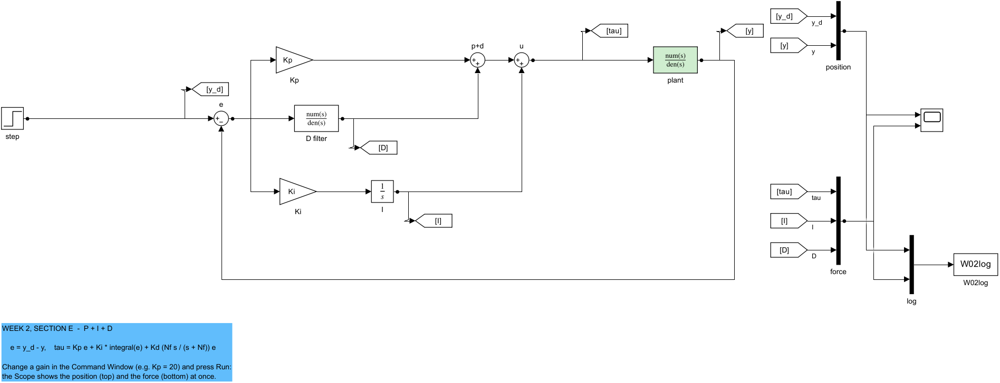

| In the figure | Meaning |
|---|---|
| `step` → `e` | the setpoint and the error $e = y_d - y$ |
| `Kp`, `D filter`, `Ki` → `I` | the three terms, one block each |
| `p+d`, `u` → `plant` | their sum is the force $\tau$ on the mass-spring-damper |
| the long line along the bottom | the feedback: the position back to `e` |
| Goto tags `[y_d]`, `[y]`, `[tau]`, `[I]`, `[D]` | carry the signals to the right without crossing the loop |
| `position`, `force` → Scope | one Scope, two panels: $y_d$ and $y$ on top; $\tau$, $I$ and $D$ below |

- Try it: `Kp = 30`, Run — the top panel rings more. `Ki = 0`, Run — the response settles short of 1.

> [!tip] In class
> - **Purpose** — every later section changes one number in the Command Window and presses Run; this section makes sure that loop works for everyone before any control is discussed.
> - **Point to** — the variable names inside the blocks (`Kp`, `Kd*Nf`, `pid_m`): nothing on the canvas is a number, so the canvas and `W02_0_setup.m` are two views of one model.
> - **Ask** — "After changing `Kp` and experimenting, why does the Scope no longer match the notes?" The changed value is still in the workspace; `W02_0_setup` restores all of them.
> - **Take away** — one model per example, one Scope per model, and a script that only repeats what Run already shows.

## B. The plant three ways, and the two numbers of a second-order system (15 min)

**B-1. One plant, three ways.** Model `W02_B_three_ways` has no controller. One step force drives the plant of §2-2 written three times: as the differential equation itself, as a Transfer Fcn and as a State-Space block.

```matlab
open_system('W02_B_three_ways')          % press Run; then F_step = 0; x0_pos = 0.5; Run
W02_B_plant_three_ways
```

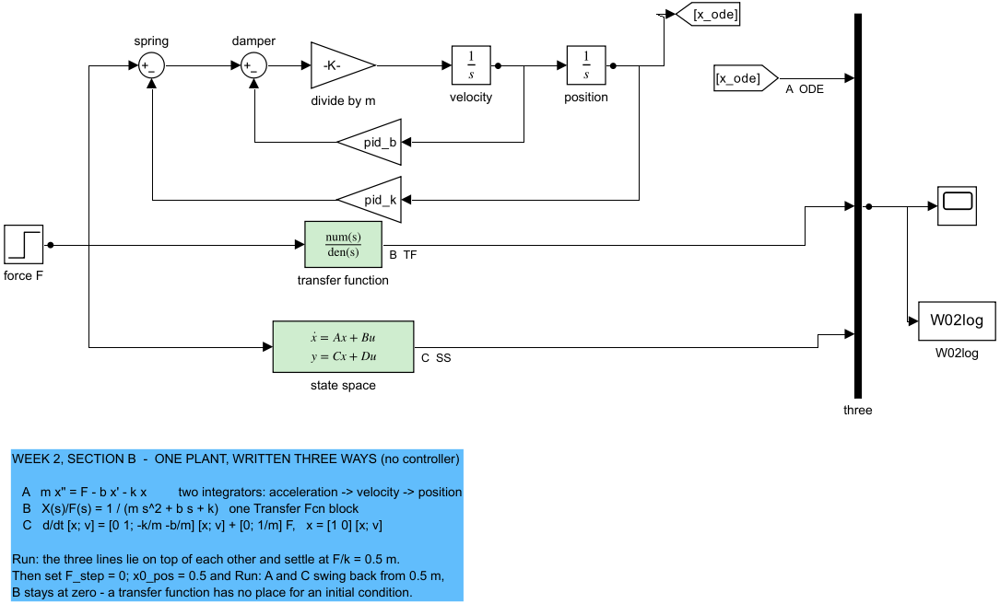

| In the figure | Meaning |
|---|---|
| top row: `spring`, `damper`, `divide by m`, `velocity`, `position` | the equation of motion solved for the acceleration, $\ddot y = (\tau - k\,y - b\,\dot y)/m$, then integrated twice |
| `pid_b`, `pid_k` pointing left | the damper and spring forces fed back from the velocity and the position — the two left-pointing arrows of the free-body diagram |
| `transfer function` | one block, $1/(m s^2 + b s + k)$ |
| `state space` | one block with $\mathbf{A}$, $\mathbf{B}$, $\mathbf{C}$ of §2-2 and the initial state `[x0_pos; x0_vel]` |
| `three` → Scope | the three positions on one plot |

Expected output:

```
  W02 B-1  one plant, three ways
    run                     ODE end   TF end   SS end   max|ODE-SS|  max|ODE-TF|
    1 N step force           0.5000   0.5000   0.5000      1.1e-16      1.1e-16
    released from 0.5 m      0.5000   0.0000   0.5000      0.0e+00      5.0e-01
    (second row: values at t = 0)
```

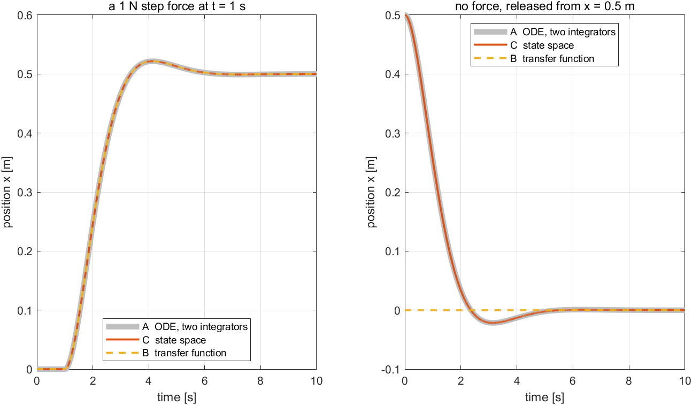

| In the figure | Meaning |
|---|---|
| left | a 1 N step force at $t = 1$ s: the three lines are one, settling at $F/k = 0.5$ m after a $4.3\,\%$ overshoot ($\zeta = 0.707$) |
| right | no force, released from 0.5 m: the differential equation and the state space swing back; the transfer function stays at zero |

**What the figure says**

- Three forms, one plant. Only the forms that keep the states can start away from rest.

> [!tip] In class
> - **Purpose** — show that the transfer function used for the rest of the week is not a new object but the free-body diagram in another notation, and show the one thing it cannot do.
> - **Point to** — in the top row, the two gains pointing left: they are the arrows $k\,y$ and $b\,\dot y$ of the free-body diagram, and the minus signs at the sums are their directions.
> - **Ask** — "Which row fails on release, and why?" The transfer function: it was derived with zero initial conditions, so it has no place to store the 0.5 m.
> - **Take away** — design with transfer functions, simulate with states.

**B-2. The damping ratio and the natural frequency.** Model `W02_B_second_order` holds the standard form of §2-3 with two variables, `zeta` and `wn`.

```matlab
open_system('W02_B_second_order')        % press Run; then zeta = 0.2, Run; zeta = 1, Run; wn = 4, Run
W02_B_zeta_and_wn
```

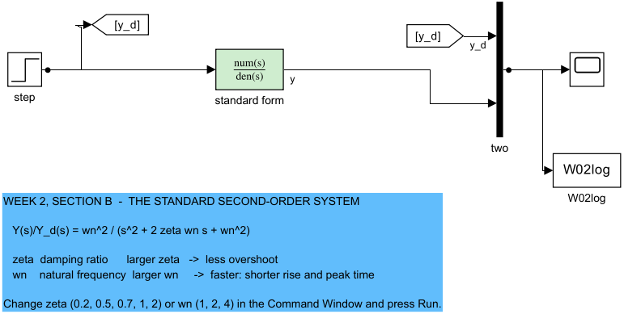

| In the figure | Meaning |
|---|---|
| `step` | the setpoint $y_d$: 0 → 1 at $t = 1$ s, also sent by the tag `[y_d]` to the Scope |
| `standard form` | $\omega_n^2/(s^2 + 2\zeta\omega_n s + \omega_n^2)$ with `zeta` and `wn` read from the workspace |
| `two` → Scope, `W02log` | $y_d$ and $y$ on one plot, and the same two signals logged |

Expected output:

```
  W02 B-2  the standard second-order system
    zeta varies, wn = 2
      zeta    wn   overshoot % (formula)  peak time [s] (formula)  rise [s]  settle [s]  bandwidth [rad/s]
      0.200     2      52.7 ( 52.7)          1.603 ( 1.603)        0.602       8.59         3.02
      0.500     2      16.3 ( 16.3)          1.814 ( 1.814)        0.819       4.04         2.54
      0.707     2       4.3 (  4.3)          2.221 ( 2.221)        1.074       2.98         2.00
      1.000     2       0.0 (  0.0)           none                  1.679       2.92         1.29
      2.000     2       0.0 (  0.0)           none                  4.115       7.44         0.53
    wn varies, zeta = 0.5
      zeta    wn   overshoot % (formula)  peak time [s] (formula)  rise [s]  settle [s]  bandwidth [rad/s]
      0.500     1      16.3 ( 16.3)          3.627 ( 3.628)        1.637       8.08         1.27
      0.500     2      16.3 ( 16.3)          1.814 ( 1.814)        0.819       4.04         2.54
      0.500     4      16.3 ( 16.3)          0.907 ( 0.907)        0.410       2.02         5.09
```

The figure is in §2-3.

**What the figure says**

- $\zeta$ decides how much it rings and nothing else about the overshoot; $\omega_n$ decides how fast, and nothing about the overshoot.

> [!tip] In class
> - **Purpose** — give the class the two dials that every later result is read with, before any controller turns them.
> - **Point to** — in the top panel the peaks falling as $\zeta$ grows; in the bottom panel the same peak height reached sooner as $\omega_n$ grows. In the pole plots: the circle (same speed, different angle) and the ray (same angle, different speed).
> - **Ask** — "At $\zeta = 2$ there is no overshoot. Why is it not the best choice?" One pole moves toward the origin and dominates: settling takes $7.44$ s against $2.92$ s at $\zeta = 1$.
> - **Ask** — "Which number sets the bandwidth?" $\omega_n$, in proportion, at a given $\zeta$; a wider bandwidth is a shorter rise time.
> - **Take away** — the angle of the poles is the overshoot, their distance from the origin is the speed.

## C. P only (10 min)

```matlab
W02_C_proportional_only
```

Expected output:

```
    Kp    y_ss (formula)   overshoot % (formula)   rise [s]  settle [s]  peak tau [N]
    2     0.500 (0.500)      16.3 ( 16.3)         0.819       4.04          2.0
    10    0.833 (0.833)      38.8 ( 38.8)         0.377       3.94         10.0
    50    0.962 (0.962)      64.4 ( 64.4)         0.158       3.64         50.0
    Kp    zeta     wn   peak time [s] (pi/wd)   settle [s] (4/(zeta wn))   IAE over 9 s [m s]
    2     0.500  2.000     1.814 ( 1.814)           4.04 ( 4.00)              4.750
    10    0.289  3.464     0.947 ( 0.947)           3.94 ( 4.00)              1.761
    50    0.139  7.211     0.440 ( 0.440)           3.64 ( 4.00)              0.837
    Kp = 10:  rise 0.377 s  peak time 0.947 s  overshoot 38.8 %  settle 3.94 s  error 0.167 m  IAE 1.761 m s
```

The script also draws the figure of §2-4, the five numbers marked on the $K_p = 10$ response.


| In the figure | Meaning |
|---|---|
| top | the position for $K_p = 2, 10, 50$ and the dashed setpoint |
| bottom | the force; it jumps to $K_p$ newtons at the step |

**What the figure says**

- Each larger gain is faster and rings more, and each settles below 1 at $K_p/(k+K_p)$. Measured and formula columns agree to the digits shown.

> [!tip] In class
> - **Purpose** — the first closed loop: see what a proportional controller buys (speed, a smaller error) and what it costs (ringing, force), and practise reading the five numbers of §2-4 off a Scope.
> - **Point to** — the three final values below the dashed setpoint; the settling times that barely move ($4.04 \to 3.64$ s) although the gain grows 25 times; the force panel, where the force at the step equals $K_p$.
> - **Ask** — "Why can the error never be zero with P alone?" Holding the mass at $y$ against the spring takes a steady force $k\,y$, and a P controller produces force only from error.
> - **Ask** — "Why does the settling time not improve?" $\zeta\omega_n = b/(2m) = 1$ for every $K_p$: the gain lifts the poles along $\mathrm{Re}(s) = -1$ instead of moving them left.
> - **Take away** — P is a spring: stiffer is faster and bouncier, and a spring never quite gets there.

## D. Add D (10 min)

```matlab
W02_D_derivative
```

Expected output:

```
    Kd   zeta   zero    overshoot %  settle [s]  error left  peak tau [N]
    0    0.289    none        38.8        3.94       0.167         10.0
    2    0.577   -5.00        16.9        1.40       0.167         49.9
    6    1.155   -1.67         8.6        1.27       0.167        129.6
```


| In the figure | Meaning |
|---|---|
| top | the position for $K_d = 0, 2, 6$ at $K_p = 10$ |
| bottom | the derivative term $D$: a spike at the step, then negative while the error closes |

**What the figure says**

- The shock absorber calms the bounce — overshoot $38.8 \to 8.6\,\%$ — and every curve still settles at $0.833$: D cannot remove the error.

> [!tip] In class
> - **Purpose** — show that the derivative is a damper: it adds to $b$, moves the poles to the left, and shortens the settling time that P could not.
> - **Point to** — the settling time falling $3.94 \to 1.27$ s; the $D$ trace, a spike at the step followed by a negative push while the mass approaches the setpoint (braking before arrival).
> - **Ask** — "At $K_d = 6$ the damping ratio is $1.155$, above one. Why is there still $8.6\,\%$ overshoot?" The derivative adds a zero at $-K_p/K_d = -1.67$, and a zero near the origin lifts the early response (§2-3 note). The formula of §2-3 assumes no zero.
> - **Ask** — "Why does the force at the step grow to 129.6 N?" The filtered derivative of a jump starts at $K_d N_f$ times its height (§2-10).
> - **Take away** — D is a shock absorber: less bounce, faster settling, no effect on where the mass ends up.

## E. Add I, and find its limit (15 min)

```matlab
W02_E_integral
```

Expected output:

```
    Ki   y at 10 s  overshoot %  settle [s]  error left   I at 10 s [N]
    0       0.8333         9.8        1.32    1.67e-01         0.000
    4       0.9957         0.0        4.84    4.33e-03         1.958
    12      1.0000         4.7        1.49    3.39e-06         2.000
    Routh, ideal derivative:  Ki < (b + Kd)(k + Kp) = 72
    the filtered law of the model is unstable above Ki = 87.07
      Ki = 0.9 x 87.07   0.046 m
      Ki = 1.1 x 87.07   13.353 m
```

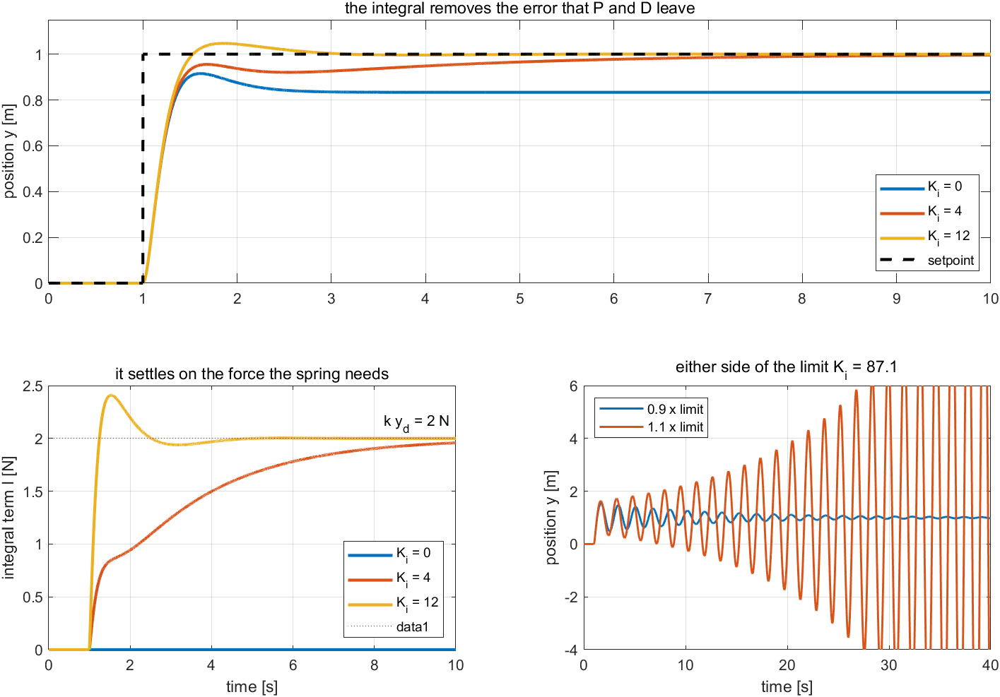

| In the figure | Meaning |
|---|---|
| top | the position for $K_i = 0, 4, 12$ at $K_p = 10$, $K_d = 4$ |
| bottom left | the integral term; the dotted line is $k\,y_d = 2$ N |
| bottom right | 40 s at $0.9$ and $1.1$ times the stability limit |

**What the figure says**

- The patient hand keeps pushing until the error is gone, and stops at exactly the $2$ N the spring needs. Pushed too hard, it makes the loop grow instead of settle.

> [!tip] In class
> - **Purpose** — show the one thing only the integral can do, remove the steady-state error, and its price: a slower or a less stable loop.
> - **Point to** — in the bottom-left panel, the integral term climbing to the dotted line at 2 N and stopping there: that is the force the spring needs at 1 m, found without being told. In the bottom-right panel, the same oscillation decaying at $0.9\times$ and growing at $1.1\times$ the limit.
> - **Ask** — "Why is $K_i = 4$ slower to settle than $K_i = 0$?" The settling time is measured to each run's own final value (§2-4). At $K_i = 0$ that value is $0.833$ m, reached quickly and wrong; at $K_i = 4$ it is close to 1 m, and the last $0.167$ m is removed slowly. A settling time is read together with the error left, never alone.
> - **Ask** — "Why does the model tolerate $K_i = 87.07$ when Routh says $72$?" Routh was applied to the ideal derivative; the model's derivative is filtered, which is a different loop. The limit that counts is that of the law implemented.
> - **Take away** — I is a patient hand: it always gets there in the end, and pushed too hard it overshoots and swings.

## F. The law built from blocks against the Simulink PID block (10 min)

```matlab
W02_F_block_vs_handbuilt
```

Expected output:

```
    comparison                             max |y diff|   max |tau diff|
    hand-built vs PID block                    9.99e-16         6.35e-14
    control: block with Nf = 19                1.20e-03         1.87e-01
```


| In the figure | Meaning |
|---|---|
| top and middle | thick grey: the PID block; thin: the law built from blocks — with a $2.5$ N limit and 5 mm of noise |
| bottom | the difference, at round-off, and the control run in violet |

**What the figure says**

- The two lines cannot be told apart. The PID block's dialog is nothing more than the blocks of §2-9.

> [!tip] In class
> - **Purpose** — remove the mystery from the PID block: every field of its dialog is one block of the law built by hand.
> - **Point to** — open the PID block's dialog next to the top row, and match P, I, D, N and Kb to `Kp`, `Ki`, `D filter` and `Kb`.
> - **Ask** — "Why run a control case with $N_f = 19$?" A comparison that reports $10^{-15}$ could be comparing a signal with itself; the control shows that a 5 % change in one parameter is seen at once ($1.2\times10^{-3}$ m).
> - **Take away** — use the block in practice, but know what is inside it.

## G. The pseudo-derivative (15 min)

```matlab
open_system('W02_G_derivative_bench')      % press Run, then try Nf = 5 and Nf = 200
W02_G_derivative_noise_and_kick
```

Expected output:

```
  W02 G  1) the bench: derivative of sin(0.5 t) + 5 mm noise (true peak 0.5)
    Nf     largest |pure|   largest |pseudo|
    5              26.55              0.56
    20             26.55              0.75
    200            26.55              5.18

  2) the loop, 5 mm of noise (Kp 10, Ki 8, Kd 4)
    derivative  force std [N]  y std [mm]  overshoot % (no noise)
    pure                 9.29        0.60           9.0
    Nf = 200             3.06        0.54           0.0
    Nf = 20              0.45        0.57           0.0
    Nf = 5               0.16        0.59          16.0

  3) the kick: step setpoint against a smoothed one (Tf = 0.3 s)
    setpoint    peak force [N]  peak D [N]
    step                  89.7        79.7
    smoothed              10.5         8.1
```

The bench figure is in §2-10.

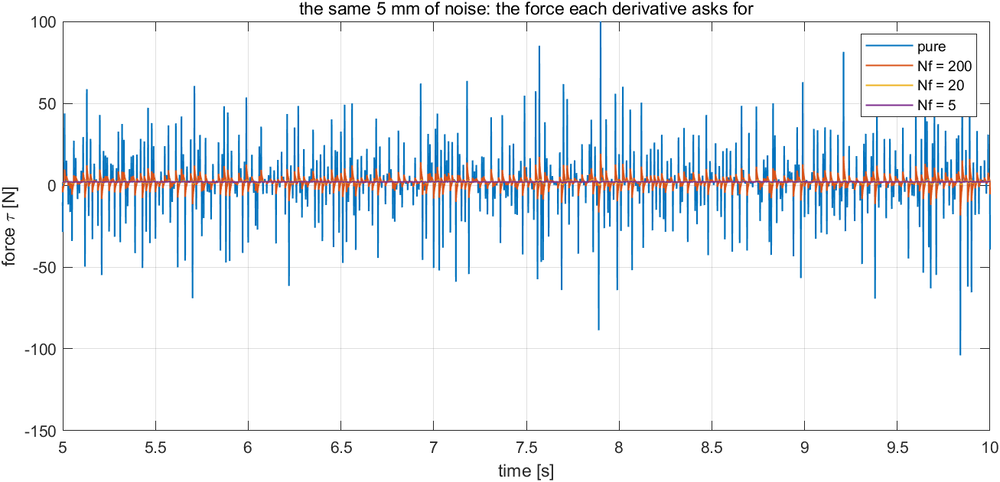

| In the figure | Meaning |
|---|---|
| traces | 5 s of force with 5 mm of sensor noise: pure derivative, $N_f = 200$, $20$, $5$ |

**What the figure says**

- The pure derivative asks for tens of newtons to hold a mass that needs $2$ N. The filter is what makes a derivative usable at all.

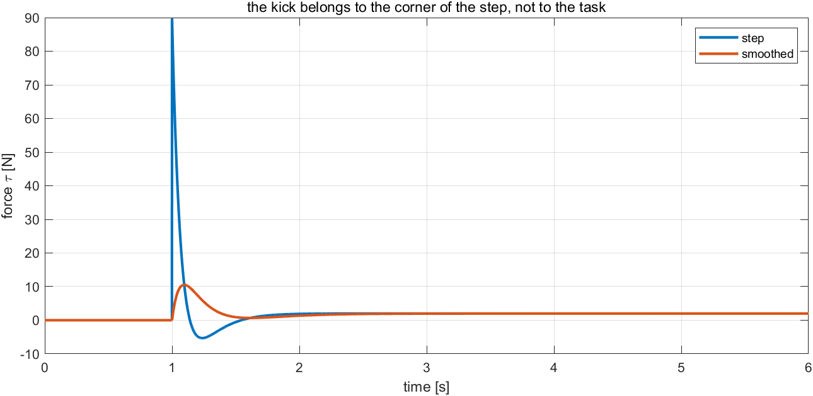

| In the figure | Meaning |
|---|---|
| traces | the force for a step setpoint and for the same step smoothed by $1/(0.3s+1)$ |

**What the figure says**

- $90$ N at the corner of the step, $10.5$ N without the corner. The kick belongs to the setpoint, not to the task.

> [!tip] In class
> - **Purpose** — show why no real controller differentiates as the textbook writes, in two steps: on a bench with no loop, then inside the loop where the force is paid for.
> - **Point to** — on the bench Scope, the pure derivative buried in spikes while the true derivative never exceeds 0.5; in the loop, the force chattering in proportion to the ceiling $K_d N_f$ while the position hardly changes.
> - **Ask** — "Why does 5 mm of noise produce spikes 53 times the true derivative?" A derivative multiplies each frequency by $\omega$, and noise is the fastest signal present.
> - **Ask** — "Why not make $N_f$ very small?" At $N_f = 5$ the filter delays the derivative so much that it brakes too late, and the overshoot returns to $16\,\%$.
> - **Take away** — filter the derivative and take the corner off the setpoint; the response hardly notices, the actuator does.

## H. Anti-windup, in depth (15 min)

```matlab
open_system('W02_H_antiwindup')            % press Run with y_step = 2; t_step2 = 15; T_final = 30; tau_max = 2.5
W02_H_windup
```

Expected output:

```
  W02 H  unreachable 2 m for 14 s, then a reachable 0.5 m  (|tau| <= 2.5 N)
    anti-windup                     y at 15 s [m]  back within 2 % of 0.5 m after [s]
    none (block)                           1.250             Inf
    clamping (block)                       1.250            4.41
    back-calculation (block)               1.250            4.06
    none (by hand, Kb = 0)                 1.250             Inf
    back-calc (by hand, Kb = 2)            1.250            4.06
    by hand vs block, back-calculation: max |y diff| = 6.66e-16
    integrator at t = 15 s: 94.0 N without anti-windup, -1.96 N with back-calculation

    the back-calculation gain Kb (by hand)
    Kb     back within 2 % after [s]
    0.5          4.26
    2            4.06
    10           4.37
    50           4.28
```


| In the figure | Meaning |
|---|---|
| top | the position for the three schemes; the dotted line is 1.25 m, the most the limited force can hold |
| bottom | the integrator without anti-windup and with back-calculation |

**What the figure says**

- From 1 to 15 s every scheme sits at 1.25 m: the target cannot be reached. What differs is the memory. Without anti-windup the integrator has piled up 94 N, and after 15 s the mass stays where it is instead of going to 0.5 m. Clamping and back-calculation return in about 4 s.

> [!tip] In class
> - **Purpose** — make windup visible: a linear model has no limits, a real actuator does, and the integrator does not know it.
> - **Point to** — the three curves lying on one another at 1.25 m until 15 s, then separating: the difference is not in what the mass did but in what the integrator remembers. In the bottom panel, 94 N stored against an actuator that can give 2.5 N.
> - **Ask** — "Why does the back-calculation integrator go negative?" $P$ alone asks for 7.5 N against a 2.5 N limit, so the integrator is driven to $I^\star = -2.0$ N to hold the demand at the limit (§2-11).
> - **Ask** — "Where does windup appear on a vessel?" A speed command the thrusters cannot meet, followed by a stop command that is ignored — Week 3.
> - **Take away** — whenever an actuator can saturate, switch anti-windup on; either scheme works, none does not.

## I. The tuning order, step by step (15 min)

```matlab
W02_I_tuning_by_hand
```

Expected output:

```
    1-2  Kp = 10: overshoot 38.8 % -> damping ratio 0.289 (formula 0.289): it rings, so D next
    3    Kd = 0,1,...: overshoot 38.77 24.95 16.94 12.34 9.83 8.71 8.60 9.22  %  -> stops falling at Kd = 6
    4    error left 0.167 -> Ki = 8: inside 1 % after 2.77 s, overshoot 0.16 %
    5    peak force 129.6 N against 30 N available -> smoothed setpoint: 13.9 N, inside 1 % after 3.11 s
```

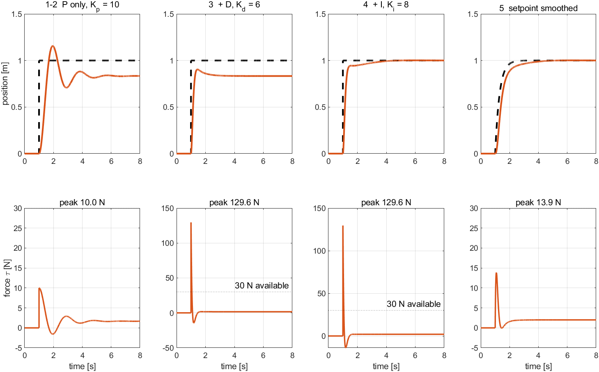

| In the figure | Meaning |
|---|---|
| columns 1 to 4 | P only, + D, + I, and the same with a smoothed setpoint |
| top row / bottom row | position / force against the $30$ N available |

**What the figure says**

- Each column fixes what the one before it showed: P revealed ringing, D calmed it, I removed the error, and only the bottom row reveals that stage 4 asks for four times the available force.

> [!tip] In class
> - **Purpose** — put the week together: a gain is never guessed, it is read from the measurement before it, and the tuning ends only when the force has been checked.
> - **Point to** — the order of the columns and the reason for each step (§2-12 table); the list of overshoots as $K_d$ rises, falling to $8.60\,\%$ at 6 and rising again at 7.
> - **Ask** — "Why raise $K_d$ before adding $K_i$?" P revealed ringing, which is a damping problem; an integral would add ringing, not remove it.
> - **Ask** — "Every response metric passed at stage 4. What failed?" The force: $129.6$ N against $30$ N available. Smoothing the setpoint fixes it for $0.34$ s of settling.
> - **Take away** — requirements first, one gain at a time, and look at the actuator last and always.

## J. The same PID on a computer (10 min)

```matlab
W02_J_sample_time
```

Expected output:

```
    Ts [s]   Ts*wB   overshoot %   settle [s]
    cont.    -            0.0        2.06
    0.01      0.06        0.2        2.05
    0.05      0.31        1.4        2.00
    0.1       0.61        5.0        1.90
    0.2       1.22       25.6        1.80
    0.3       1.83       37.9        2.70
    0.4       2.44       67.8        7.20
    unstable from Ts = 0.511 s  (Ts*wB = 3.12)
```

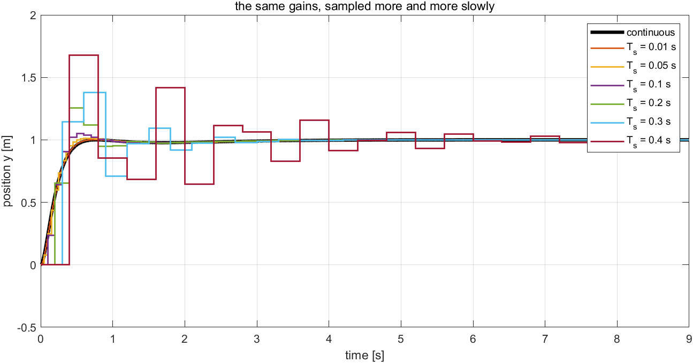

| In the figure | Meaning |
|---|---|
| black | the continuous-time response |
| staircases | the sampled responses; each step is one held sample |

**What the figure says**

- Up to $T_s\,\omega_B = 0.31$ the staircases lie on the black curve. Beyond it the controller acts on older and older errors, and at $T_s = 0.511$ s the loop goes unstable.

> [!tip] In class
> - **Purpose** — connect the continuous-time design of this week to the computer that will run it: the same gains can fail only because they are applied too rarely.
> - **Point to** — the overshoot column rising from $0.2\,\%$ to $67.8\,\%$ with nothing changed but $T_s$; the product $T_s\,\omega_B$ next to it, where $\omega_B$ is the bandwidth of §2-3.
> - **Ask** — "Why is the rule written with the bandwidth?" The bandwidth is how fast the loop responds; the sampling frequency $2\pi/T_s$ must be at least 20 times that, which is the rule $T_s\,\omega_B \le 2\pi/20$.
> - **Take away** — design in continuous time, then check the sample rate against the bandwidth before the gains leave the simulation.

---

# Summary

## Week Summary

| Step | What was done | How it was verified |
|---|---|---|
| 0a | wrote the plant from its free-body diagram as a differential equation, a transfer function $G(s) = 1/(s^2+2s+2)$ and a state-space model | section B: the three agree to $1.1\times10^{-16}$ m; only the transfer function cannot start from 0.5 m; `verify_w02_pid` check 9 |
| 0b | named the two numbers of a second-order system, $\zeta$ and $\omega_n$, and the bandwidth | section B: overshoot $52.7 \to 0\,\%$ as $\zeta$ rises; peak time halves as $\omega_n$ doubles; `verify_w02_pid` check 10 |
| 0c | defined the five time-domain metrics | section C: formulas for peak time and settling against measurement; the annotated figure of §2-4 |
| 1 | the plant's own numbers: poles $-1 \pm j$, $\zeta = 0.707$, $\omega_n = 1.414$ rad/s | static gain $0.5$ m/N; $4.3\,\%$ overshoot to a step force |
| 2 | P as a spring: $y_{ss} = K_p/(k+K_p)$ | section C: formula and measurement agree to three digits; `verify_w02_pid` check 2 |
| 3 | D as a shock absorber, and its zero | section D: overshoot $38.8 \to 8.6\,\%$, error left unchanged at $0.167$ |
| 4 | I removes the error; Routh limit $K_i < 72$ | `verify_w02_pid` check 4; section E: decay at $0.9\times$, growth at $1.1\times$ the implemented limit $87.07$ |
| 5 | the law from blocks equals the Simulink PID block | section F: difference $10^{-15}$ under a limit and noise; control run $1.2\times10^{-3}$ m |
| 6 | the pseudo-derivative | section G: bench 26.55 against 0.75 (true 0.5); force std $9.29 \to 0.45$ N; kick $89.7 \to 10.5$ N |
| 7 | anti-windup against an unreachable target | section H: none never returns (94 N stored); clamping 4.41 s; back-calculation 4.06 s |
| 8 | followed the tuning order | section I: $K_p = 10$, $K_d = 6$, $K_i = 8$, each from the measurement before it |
| 9 | sampled the controller | section J: unstable at $T_s = 0.511$ s; `verify_w02_pid` check 7 |

## Progress Check

> [!important] Minimum condition for following Week 3

### Theory

- [ ] Able to draw the free-body diagram of a mass-spring-damper and derive its equation of motion, transfer function and state-space model.
- [ ] Able to state what $\zeta$ and $\omega_n$ each do to the overshoot, the peak time and the bandwidth, and where they are seen in the s-plane.
- [ ] Able to define rise time, peak time, overshoot, settling time and steady-state error, and to say what each one answers.
- [ ] Able to say what P, I and D each do on this plant in mechanical terms: spring, shock absorber, patient hand.
- [ ] Able to derive $y_{ss} = K_p/(k+K_p)$ and explain why it is never 1.
- [ ] Able to derive the Routh limit on $K_i$ for a PID around a second-order plant.
- [ ] Able to explain the ceiling $K_d N_f$, the derivative kick, and $I^\star$ of back-calculation.

### Laboratory

- [ ] `W02_1_build_pid` ran and every model reported `overlapping lines: 0`.
- [ ] A gain was changed in the Command Window and the model's Scope showed the new response.
- [ ] `W02_check(1)`, `(2)` and `(3)` pass on a model built from `W02_P1_start`.

### Recorded observations

- [ ] In section B, what the transfer-function row does on release from 0.5 m, and why.
- [ ] The measured overshoot at $K_p = 2$, and the formula's.
- [ ] The $K_d$ at which the overshoot stopped falling in section I.
- [ ] How long each anti-windup scheme took to come back in section H.

---

## Assignment 2

- **Due**: before the Week 3 session
- **Submit**: the model, the script that produces every number, and the analysis

### ① Requirements

Change the plant to $G(s) = 1/(s^2 + 0.5\,s + 4)$ — a stiffer spring with far less damping — in `W02_0_setup.m` and `W02_vars.m` ($b = 0.5$, $k = 4$) and follow the tuning order of §2-12 with the targets: inside 2 % of a unit step within 4 s, overshoot below 10 %, peak force below 40 N.

### ② Verification — mandatory

> [!important] A claim is not a result. Numbers are required, with the averaging window stated

- For step 2, the damping ratio read from the P response next to the value $b/(2\sqrt{m(k+K_p)})$.
- For step 3, the table of $K_d$ against overshoot, and the $K_d$ chosen.
- For step 4, the $K_i$ chosen and the resulting settling time, measured with `step_metrics`.
- For step 5, the peak force with and without the smoothed setpoint.
- The Routh limit on $K_i$ for the ideal derivative, and the limit of the filtered law found as in section E.

### ③ Analysis (5–10 lines)

Compare the gains with those of this plant. Explain, from where $K_p$ and $K_d$ land in the equation of motion, why the lightly damped plant needs a larger share of its damping from the controller.

### Grading

| Criterion | Weight |
|---|---|
| The model runs and produces the requested output | 25% |
| **Verification performed and numbers reported** | 40% |
| Correctness of the analysis | 25% |
| Readability of the code | 10% |

---

## Troubleshooting

- Only faults that have actually occurred while preparing this week.

| Symptom | Cause | Fix |
|---|---|---|
| a script called with `run(...)` stops inside another function, or "brace indexing is not supported" | a script left a variable named `run` or `s` in the workspace, hiding the function of the same name (section E defines `s = tf('s')`) | run `W02_0_setup` again, or call the scripts one at a time |
| `W02_check(2)` reports `PID blocks 1` and fails | the PID Controller block was used; problem 2 asks for the law built from blocks | build D as one Transfer Fcn, `[Kd*Nf 0]` over `[1 Nf]` |
| the force in the Scope is a band of spikes of tens of newtons | `d_filtered = 0` in `W02_G_noise_kick` selects the pure derivative | `d_filtered = 1` |
| a Scope does not match these notes after experimenting | a changed variable is still in the workspace | run `W02_0_setup` again |

---

## References

### Primary

- Åström, K. J. and Murray, R. M. *Feedback Systems: An Introduction for Scientists and Engineers*, 2nd ed., Princeton University Press, 2021, Ch. 11 (PID control: basic functions, tuning, integrator windup, implementation).
- Åström, K. J. and Hägglund, T. *Advanced PID Control*, ISA, 2006, Ch. 3 (setpoint weighting, derivative filtering, windup).
- Franklin, G. F., Powell, J. D. and Emami-Naeini, A. *Feedback Control of Dynamic Systems*, 8th ed., Pearson, 2019, §3.3–3.4 (the effect of pole locations, time-domain specifications), §4.2 (steady-state error and system type), §4.3 (the three-term controller).
- Nise, N. S. *Control Systems Engineering*, 8th ed., Wiley, 2019, Ch. 2 (modelling mechanical systems in the frequency domain), Ch. 3 (state space), Ch. 4 (time response of second-order systems), Ch. 7 (steady-state errors).
- Messner, W. C. and Tilbury, D. M. *Control Tutorials for MATLAB and Simulink*, University of Michigan — "Introduction: System Modeling", "Introduction: System Analysis" and "Introduction: PID Controller Design".
- Franklin, G. F., Powell, J. D. and Workman, M. L. *Digital Control of Dynamic Systems*, 3rd ed., Addison-Wesley, 1998, Ch. 11 (sample rate selection).

### Video

- Douglas, B. *Understanding PID Control*, parts 1–7, MATLAB Tech Talk, MathWorks, 2018 — [playlist](https://www.youtube.com/playlist?list=PLn8PRpmsu08pQBgjxYFXSsODEF3Jqmm-y).
- 제어조교 Ctrl튜브, *[제어공학] PID 제어기 짬튜닝 — Simulink 시뮬레이션*, 2022 — [video](https://www.youtube.com/watch?v=KJkqNujb6h4).

### In this course

- Control System Design (course 2), week 2 (modelling: free-body diagram, transfer function, state space, the three-way Simulink model), week 4 (time response and specifications), week 5 (steady-state error and system type) — the source of §2-2 to §2-4.
- Capstone Design, week 6, sections E–G — the same plant and the undergraduate version of sections C to H.
- The instructor's *Linear Control Systems*, chapter 13, Practical PID Controller Design using MATLAB and Simulink.
- Week 3 §3-4 (where the derivative lands on a velocity loop) and §3-6 (three anti-windup schemes on the Otter).
- `_tools/verify_w02_pid.m` — the ten checks quoted in Part 1.

---

## Next Week

- **Week 3 — Surge Speed Control**
- The first closed loop on the vessel. The surge equation of Week 1 §1-11 becomes the plant, the controller of this week is placed around it, and the steady speed is predicted before it is measured.
- The derivative term turns out to land beside the mass rather than the damping, and the thruster limit makes the windup of §2-11 real.
- Preparation: $T_u = 1.1025$ s and $K_u = 0.012894$ (m/s)/N from Week 1 §1-11, and the MSS toolbox at `Tools\MSS`.
