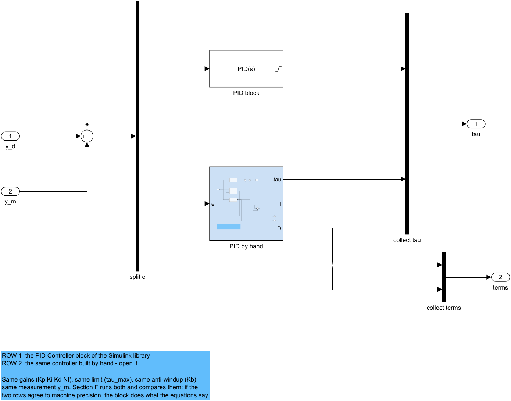
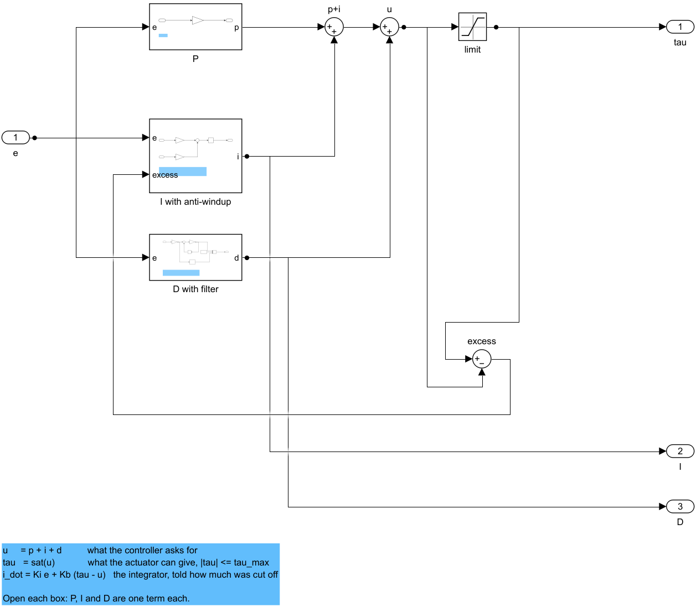
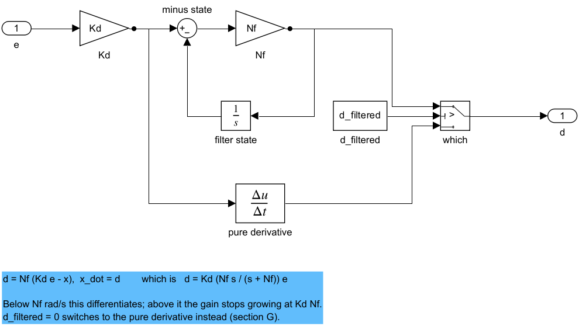
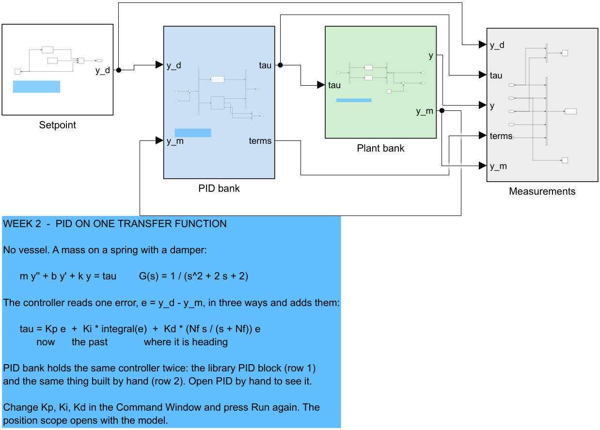

# Week 2 · PID Control Fundamentals

> [!important] Reference material — read this first
> <span style="font-size:0.88em">The five courses below are **taught by the instructor of this course** and are the assumed background for it. They run from the fundamentals down to the graduate material, so start wherever the gap is. Every frame, symbol and derivation used here is developed in them at length; anyone whose prerequisites are thin should work through them first, then return.</span>
>
> | # | Course | Level | Lang. | Video | Slides and code |
> |---|---|---|---|---|---|
> | 1 | **Control Engineering** (제어공학) — the foundation: transfer functions, feedback, stability, root locus, PID | undergraduate | KO | [playlist](https://youtube.com/playlist?list=PLFaUxNRM4BvJMpF9HZS-Mp8tDv9dTdglk) | [drive](https://drive.google.com/drive/folders/1TNIPDNtS_Iy8li-olka5WJslSXDYf0aT) |
> | 2 | **Control System Design** (제어시스템설계) — design rather than analysis: specifications, loop shaping, discrete implementation | undergraduate | KO | [playlist](https://youtube.com/playlist?list=PLFaUxNRM4BvIGroZ5rgn7x08F7C79d9WZ) | [drive](https://drive.google.com/drive/folders/11m5Xxl_PHJvxgHghLSP-jhCpmRpbvoXh) |
> | 3 | **Advanced Control Engineering** (제어공학특론) — reference frames, the 6-DOF equation of motion, rotation matrices and Euler angles, linearisation and trim, vehicle control design | graduate | EN | [playlist](https://youtube.com/playlist?list=PLFaUxNRM4BvJmvF2ljx4KM5dj1P5jEcw0) | [drive](https://drive.google.com/drive/folders/1GUxbbONl916lNd0ggnFnXrNwNkd13-2-) |
> | 4 | **Sensor Signal Processing and Fusion** (센서신호처리 및 융합) — sensor models, noise, estimation and multi-sensor fusion | graduate | EN | [playlist](https://youtube.com/playlist?list=PLFaUxNRM4BvK-aP2Gdoyp5-AWvMn7Fo8E) | [drive](https://drive.google.com/drive/folders/1MEVJP7TzMcm8w6TZwUjhWJtL34WeNY3u) |
> | 5 | **Capstone Design** (캡스톤디자인) — a vehicle project carried end to end | undergraduate | KO | [playlist](https://youtube.com/playlist?list=PLFaUxNRM4BvLu7L0pDoLzDXTv8mm6rCmj) | [drive](https://drive.google.com/drive/folders/1haIQejlJfrdhtOuof-MpffR9ydVscXZS) |
>
> <span style="font-size:0.88em">**Not fluent in MATLAB or Simulink yet? Do these before Part 2.** Every laboratory in this course is Simulink, and the Onramp courses are free and take a few hours each.</span>
>
> | Tool | Where to start |
> |---|---|
> | MATLAB | [MATLAB Onramp](https://matlabacademy.mathworks.com/kr/details/matlab-onramp/gettingstarted) · [Core MATLAB Skills](https://matlabacademy.mathworks.com/details/core-matlab-skills/lpmlcms) |
> | Simulink | [Simulink Onramp](https://matlabacademy.mathworks.com/kr/details/simulink-onramp/simulink) · instructor's Simulink lectures [part 1](https://youtu.be/a-afHg_fSaU) · [part 2](https://youtu.be/070Yn0Hw5a0) |

> [!important] Key video references for this week
> <span style="font-size:0.88em">This week is built on the two video sources below as well as on the courses above. Watch them before or after the lecture hour; the sections that use each one say so where it is used.</span>
>
> | Source | Part | What it contributes here |
> |---|---|---|
> | MATLAB Tech Talk, **Understanding PID Control** (B. Douglas, MathWorks) — [playlist](https://www.youtube.com/playlist?list=PLn8PRpmsu08pQBgjxYFXSsODEF3Jqmm-y) | [1 What is PID control](https://www.youtube.com/watch?v=wkfEZmsQqiA) | present, past and future error — §2-2 to §2-5 |
> | | [2 Anti-windup](https://www.youtube.com/watch?v=NVLXCwc8HzM) | windup, clamping and its two conditions — §2-8 |
> | | [3 Noise filtering](https://www.youtube.com/watch?v=7dUVdrs1e18) | the filtered derivative and its integrator-in-the-loop form — §2-7 |
> | | [4 A PID tuning guide](https://www.youtube.com/watch?v=sFOEsA0Irjs) | requirements first, "well-behaved" plants, the map of tuning methods — §2-9 |
> | | [5 Three ways to build a model](https://www.youtube.com/watch?v=qhIjIu-Zk10) | first principles, system identification, linearisation — §2-1 |
> | | [6 Manual and automatic tuning](https://www.youtube.com/watch?v=qj8vTO1eIHo) | PID as two zeros and a pole; always look at the control effort — §2-6, §2-9 |
> | | [7 Important PID concepts](https://www.youtube.com/watch?v=tbgV6caAVcs) | cascaded loops and sampled control — §2-10 |
> | 제어조교 Ctrl튜브, **PID 제어기 짬튜닝** (KO) — [video](https://www.youtube.com/watch?v=KJkqNujb6h4) | whole video | tune P first and read the plant from it, add I only for a remaining error, filter the derivative, smooth the setpoint — §2-7, §2-9 |

> [!tip] Getting the course files, and keeping them current (Windows)
> <span style="font-size:0.88em">The notes, models and scripts are kept in one Git repository that is updated through the semester. Clone it once; before every class, pull. A pull downloads only what has changed since the last one.</span>
>
> | When | Where to run it | Command |
> |---|---|---|
> | once | PowerShell — installs Git for Windows | `winget install --id Git.Git -e` |
> | once | the folder that will hold the course, e.g. `Documents` | `git clone https://github.com/wkyouncnu/Sensor-Signal-Processing-and-Fusion.git` |
> | before every class | inside the cloned folder `Sensor-Signal-Processing-and-Fusion` | `git pull` |
>
> - `git pull` prints `Already up to date.` when nothing has changed, and otherwise lists the files it updated.
> - The repository is private. When Git asks, sign in with the GitHub account the instructor has given access.
> - Experiment on copies, not on the cloned files: copy a week's `WXX_simulink` folder elsewhere first, and a pull can never collide with local edits. If it already has, `git stash`, then `git pull`, then `git stash pop` sets the edits aside, updates, and puts them back.
> - The MSS toolbox is not part of the repository. The weeks that simulate the Otter need it at `Tools\MSS` inside the cloned folder; this week does not.


- **Course**: USV Guidance, Navigation and Control (Graduate)
- **Department**: Autonomous Vehicle System Engineering, Chungnam National University
- **This week**: ① one error, read three ways — P, I and D, each measured on its own ② the three additions no real PID runs without: a filtered derivative, a smooth setpoint, anti-windup ③ a tuning order, each gain chosen from the measurement before it

> [!important] Prerequisites from the previous week
> - Week 1 built the Otter from first principles and ran it **open loop**: shaft speeds in, motion out, nothing measured and nothing corrected.
> - This week closes a loop for the first time, but deliberately not around the vessel. The plant here is chosen so that nothing but the controller can explain a change in the response. Week 3 puts the same controller around the Otter.
> - From basic control: the Laplace transform, a transfer function, and the step response of a second-order system. Course 1 in the table above covers all three.

---

## Learning Outcomes

Upon completion of this week, the learner is able to:

1. Write the PID law in the time domain and as a transfer function, and state in one sentence what each of the three terms reads from the error.
2. Predict, before simulating, the steady value, damping ratio and overshoot of a proportional loop around a second-order plant, and confirm them to the third digit.
3. Explain why a proportional controller leaves an error, why the integral removes it, and derive the value of $K_i$ at which the loop goes unstable.
4. Build a PID from Gain, Sum and Integrator blocks that agrees with the Simulink PID block to the last bit, and name the box that each field of the block's dialog belongs to.
5. Quantify what a pure derivative does to sensor noise, what a step setpoint does to the force, and what an integrator does while the actuator saturates — and apply the remedy for each.
6. Tune a PID in a fixed order, choosing every gain from the measurement before it, and check the result against the force the actuator can deliver.

## Prerequisites and Setup

| Item | Requirement |
|---|---|
| MATLAB | R2024b, with Simulink and the Control System Toolbox (`tf`, `step`, `c2d`) |
| MSS | **not needed this week** — the plant is a transfer function |
| Course folder | `lectures/W02_simulink` |
| Model | `W02_pid.slx`, generated by `W02_1_build_pid` — never edited by hand |
| Time | lecture 1 h, laboratory 1 h (Part 2 sections A to J are done at home as well) |

---

# Part 1 · Theory

## 2-1. Why the first controller is not put around the vessel

This section answers one question: on what should a controller be learned?

- A vessel changes several things at once when one gain changes. Drag grows with speed, thrust follows the square of the shaft speed, and turning couples surge, sway and yaw. A change in the response cannot be attributed to the gain alone.
- A controller is therefore learned first on the **simplest plant that can oscillate**: one mass on one spring, with one damper. Anything that changes in its response is the controller's doing.

The plant is written from first principles — Newton's second law for a mass $m$ held by a spring of stiffness $k$ and a damper of coefficient $b$, pushed by a force $\tau$:

$$
m\,\ddot y + b\,\dot y + k\,y = \tau
\qquad\Longrightarrow\qquad
G(s) = \frac{Y(s)}{T(s)} = \frac{1}{m s^2 + b s + k}
= \frac{1}{s^2 + 2s + 2}
$$

| Symbol | Quantity | Value · source |
|---|---|---|
| $y$ | position of the mass, the controlled output | m |
| $\tau$ | force on the mass, the control input | N |
| $m$ | mass | $1$ kg, `W02_0_setup.m` |
| $b$ | damping coefficient | $2$ N·s/m |
| $k$ | spring stiffness | $2$ N/m |
| $\omega_{n0} = \sqrt{k/m}$ | natural frequency without control | $1.414$ rad/s |
| $\zeta_0 = b/(2\sqrt{mk})$ | damping ratio without control | $0.707$ |
| $G(0) = 1/k$ | static gain: metres per newton | $0.5$ m/N |

- The poles are $s = -1 \pm j$: left alone the mass rings a little and stops. The plant is stable, nearly linear and has no delay — "well behaved" in the sense of MATLAB Tech Talk part 4, which is the class of plant for which the tuning rules of §2-9 are meant.
- The same plant is used by the Capstone Design course, week 6, section E, whose measured numbers this week reproduces.

> [!note] Where a plant model comes from
> MATLAB Tech Talk part 5 names three routes, and this course uses all three.
>
> | Route | What is known | Where in this course |
> |---|---|---|
> | first principles ("white box") | the physics, written as equations | this section; the Otter of Week 1, from Fossen's equations |
> | system identification ("black box") | only input and output records | Week 3 §3-1 reduces the surge axis to two measured numbers |
> | linearisation | a nonlinear model, about an operating point | Week 4, the yaw axis about straight running |

## 2-2. Feedback, and one error read three ways

This section answers: what does a controller see, and what does it do with it?


| In the figure | Meaning |
|---|---|
| $y_d$, setpoint | where the output should be — also called command or reference |
| circle with $+$ and $-$ | subtracts the measurement from the setpoint; its output is the **error** $e$ |
| three boxes in the dotted frame | the controller: the same error read three ways, in violet above and below each box |
| $\tau$, control input | the sum of the three, pushed into the plant |
| sensor, $y_m$ | the measured output fed back; this week $y_m = y$ plus noise when noise is switched on |

A controller receives **one** signal, the error, and the PID reads it three ways:

$$
e(t) = y_d(t) - y_m(t), \qquad
\tau(t) = \underbrace{K_p\,e(t)}_{\text{present}}
+ \underbrace{K_i\!\int_0^t e(\sigma)\,\mathrm{d}\sigma}_{\text{past}}
+ \underbrace{K_d\,\frac{\mathrm{d}e(t)}{\mathrm{d}t}}_{\text{future}}
$$

| Term | What it reads from the error | In words (Tech Talk part 1) | What it cannot do alone |
|---|---|---|---|
| P, $K_p e$ | how wrong it is **now** | "far away, push hard" | hold a position against a spring: zero error gives zero force |
| I, $K_i\!\int e$ | how long it **has been** wrong | "still not there, push more" | act quickly: it responds late and stops late |
| D, $K_d\,\dot e$ | how fast the error is **closing** | "about to arrive, brake" | know where the target is: a constant error gives no derivative |

| Symbol | Quantity | Unit on this plant |
|---|---|---|
| $K_p$ | proportional gain | N/m |
| $K_i$ | integral gain | N/(m·s) |
| $K_d$ | derivative gain | N·s/m |

> [!warning] Why the textbook letters $r$ and $u$ are not used
> Control textbooks write the setpoint $r$ and the control input $u$. In this course $u$ is the **surge velocity** and $r$ the **yaw rate** — Week 3's speed loop is $u_d - u$ — so a page on which $u$ is both a speed and a control input cannot be read. The setpoint is therefore $y_d$ and the control input $\tau$, as in Fossen's notation. $y$ this week is a generic output, not the east position $y^n$.

## 2-3. P — the present error: faster, more oscillatory, never exact

This section answers: what does a proportional controller achieve on this plant, and what can it never achieve?

With $\tau = K_p(y_d - y)$ substituted into the equation of motion:

$$
m\,\ddot y + b\,\dot y + (k + K_p)\,y = K_p\,y_d
\qquad\Longrightarrow\qquad
T(s) = \frac{Y(s)}{Y_d(s)} = \frac{K_p}{m s^2 + b s + k + K_p}
$$

- **The controller adds stiffness.** $K_p$ sits beside $k$: a proportional controller is a second, adjustable spring pulling towards $y_d$.
- Reading the standard second-order form off the denominator,

$$
\omega_n = \sqrt{\frac{k + K_p}{m}}, \qquad
\zeta = \frac{b}{2\sqrt{m\,(k + K_p)}}, \qquad
M_p = 100\,\exp\!\left(\frac{-\pi\zeta}{\sqrt{1 - \zeta^2}}\right)\ \%
$$

- The steady value follows from the final value theorem for a unit step, $y_{ss} = T(0)$:

$$
y_{ss} = \frac{K_p}{k + K_p}, \qquad e_{ss} = 1 - y_{ss} = \frac{k}{k + K_p}
$$

| Check | Result |
|---|---|
| dimensions | $K_p$ and $k$ are both N/m, so $y_{ss}$ is dimensionless per metre of setpoint |
| limit $K_p \to 0$ | $y_{ss} \to 0$: no controller, no motion |
| limit $K_p \to \infty$ | $y_{ss} \to 1$ but $\zeta \to 0$: the error vanishes only as the damping does |
| numeric | `verify_w02_pid` check 2: formula against the step response of $T(s)$, largest difference $2.0\times10^{-9}$ |

**Why the error never reaches zero.** Holding the mass at $y$ against the spring takes a steady force $k\,y$. A proportional controller produces force only from error, $\tau = K_p e$, so to produce $k\,y$ some error must remain: $e_{ss} = k\,y_{ss}/K_p$, which rearranges to the formula above. Tech Talk part 1 makes the same argument with a drone that needs a fixed propeller speed to hover.

Measured in section C:

| $K_p$ | $y_{ss}$ | $M_p$ | $e_{ss}$ | rise [s] | settle [s] | peak $\tau$ [N] |
|---|---|---|---|---|---|---|
| 2 | 0.500 | 16.3 % | 0.500 | 0.819 | 4.04 | 2.0 |
| 10 | 0.833 | 38.8 % | 0.167 | 0.377 | 3.94 | 10.0 |
| 50 | 0.962 | 64.4 % | 0.038 | 0.158 | 3.64 | 50.0 |

- Every measured $y_{ss}$ and $M_p$ equals the formula to the digits shown. $K_p = 2$ gives $\zeta = 0.5$ and $\omega_n = 2$ rad/s, the textbook's $16.3\,\%$.
- The last column is the price: at the step the whole error is 1 m and the force jumps to $K_p$ newtons. A gain chosen from the response alone can ask the actuator for more than it has — Tech Talk part 6 shows a design that looked perfect until its 350 V command met a 24 V motor.

## 2-4. D — the future error: a brake

This section answers: what does the derivative term add, and why does it not remove the error?

With $\tau = K_p e + K_d\,\dot e$ and $e = y_d - y$ substituted into the equation of motion,

$$
m\,\ddot y + (b + K_d)\,\dot y + (k + K_p)\,y = K_p\,y_d + K_d\,\dot y_d
$$

$$
\zeta = \frac{b + K_d}{2\sqrt{m\,(k + K_p)}}, \qquad
T(s) = \frac{K_d s + K_p}{m s^2 + (b + K_d)s + k + K_p}
$$

- **$K_d$ sits beside the damping $b$.** The derivative term is a second, adjustable damper: while the mass rushes towards the setpoint the error is shrinking, $\dot e < 0$, and the term takes force away before the setpoint is reached.
- The steady value is unchanged, $T(0) = K_p/(k + K_p)$. In steady state nothing moves, $\dot e = 0$, and the derivative contributes nothing.
- The numerator has gained a **zero** at $s = -K_p/K_d$. A zero closer to the origin than the poles lifts the early response, so the response can overshoot even when $\zeta > 1$.

> [!note] The same term lands elsewhere on other axes
> On this plant $K_d$ lands beside the damping, because the output is a position and its derivative a velocity. In Week 3 the output is a velocity, its derivative an acceleration, and the same term lands beside the **mass** (Week 3 §3-4). In Week 4 the output is an angle and $K_d$ is a damper again. The term does not change; the axis does.

Measured in section D, $K_p = 10$, $K_i = 0$:

| $K_d$ | $\zeta$ | zero at | $M_p$ | settle [s] | $e_{ss}$ | peak $\tau$ [N] |
|---|---|---|---|---|---|---|
| 0 | 0.289 | none | 38.8 % | 3.94 | 0.167 | 10.0 |
| 2 | 0.577 | $-5.00$ | 16.9 % | 1.40 | 0.167 | 49.9 |
| 6 | 1.155 | $-1.67$ | 8.6 % | 1.27 | 0.167 | 129.6 |

- The overshoot and the settling time fall together; the error left does not move.
- At $K_d = 6$ the damping ratio exceeds one and the response still overshoots. With an ideal derivative the poles are real, at $-2$ and $-6$, and the zero at $-1.67$ alone produces $5.55\,\%$; the model's filtered derivative (§2-7) gives the measured $8.6\,\%$.
- The peak force grows with $K_d$: at the corner of the step the filtered derivative jumps to $K_d N_f$ times the step height. That spike is the derivative kick of §2-7.

## 2-5. I — the past error: time removes it, and too much destabilises

This section answers: how does the integral remove the error that P and D leave, and what does it cost?

With all three terms, the Laplace transform of the loop gives the characteristic polynomial

$$
m s^3 + (b + K_d)\,s^2 + (k + K_p)\,s + K_i = 0 ,
\qquad
\frac{E(s)}{Y_d(s)} = \frac{s\,(m s^2 + b s + k)}{m s^3 + (b + K_d)s^2 + (k + K_p)s + K_i}
$$

**The error goes to zero.** For a unit step, the final value theorem gives $e_{ss} = \lim_{s\to 0} s\,E(s) = 0$: the factor $s$ in the numerator comes from the integrator. The loop is now **type 1**.

**The integral finds the force on its own.** The integral stops changing only when its input, the error, is zero. Where it stops is therefore exactly the force that holds the mass against the spring, $k\,y_d = 2$ N — a number the controller was never told.

**Too much integral destabilises.** The Routh array of the cubic above is stable if and only if every coefficient is positive and

$$
(b + K_d)(k + K_p) > m\,K_i
\qquad\Longrightarrow\qquad
K_i < \frac{(b + K_d)(k + K_p)}{m} = \frac{(2+4)(2+10)}{1} = 72
$$

- At the limit the cubic has a pair of roots on the imaginary axis at $s = \pm j\sqrt{(k + K_p)/m} = \pm j\,3.464$ rad/s (`verify_w02_pid` check 4, exact to $10^{-9}$).
- The controller actually built uses the filtered derivative of §2-7, which adds a pole; its limit, found by bisection on the closed-loop poles, is $K_i = 87.07$, oscillating at $3.856$ rad/s. The limit that matters is the one of the implemented law.

| Symbol | Quantity | Value |
|---|---|---|
| $K_p,\ K_d$ | held fixed in section E | $10$ N/m, $4$ N·s/m |
| $K_i^{\max}$, ideal derivative | Routh limit | $72$ N/(m·s) |
| $K_i^{\max}$, filtered, $N_f = 20$ | pole-crossing limit | $87.07$ N/(m·s) |

Measured in section E:

| $K_i$ | $y$ at 10 s | $M_p$ | settle [s] | error left | $I$ at 10 s [N] |
|---|---|---|---|---|---|
| 0 | 0.8333 | 9.8 % | 1.32 | $1.67\times10^{-1}$ | 0.000 |
| 4 | 0.9957 | 0.0 % | 4.84 | $4.33\times10^{-3}$ | 1.958 |
| 12 | 1.0000 | 4.7 % | 1.49 | $3.39\times10^{-6}$ | 2.000 |

- $K_i = 4$ removes the error but slowly: the settling time grows from 1.32 s to 4.84 s. $K_i = 12$ removes it fast and brings the overshoot back.
- Run at $0.9$ and $1.1$ times the limit, the largest error between 30 and 40 s is $0.046$ m and $13.353$ m: the same oscillation decays on one side and grows on the other. The integral acts late, and a large enough late push arrives in phase with the swing it was meant to correct.

## 2-6. One transfer function: two zeros, a pole, and the Simulink block

This section answers: what is tuning, seen as a transfer function, and is the Simulink PID block the same thing as the law above?

$$
C(s) = K_p + \frac{K_i}{s} + K_d\,s = \frac{K_d s^2 + K_p s + K_i}{s}
$$

- A PID is **one pole at the origin** (the integrator, fixed), **two zeros** whose places $K_p$, $K_i$ and $K_d$ decide, and an overall gain. Tuning a PID is choosing where those two zeros go and how much gain to apply (Tech Talk part 6).
- The implemented derivative is filtered (§2-7), which adds one more pole at $s = -N_f$:

$$
C(s) = K_p + \frac{K_i}{s} + K_d\,\frac{N_f\,s}{s + N_f}
$$

This is exactly the formula printed in the dialog of the Simulink **PID Controller** block (parallel form), with P, I, D and N its four fields. Section F builds the same law by hand from three boxes — P, I with anti-windup, D with filter — and runs both side by side through saturation and sensor noise.





| In the figure | Meaning |
|---|---|
| P, I with anti-windup, D with filter | one box per term of the law; open each to see one line of the equation |
| `p+i`, `u` | the two sums that form the demand $u = p + i + d$ |
| `limit` | the actuator: $\tau = \mathrm{sat}(u)$, $\lvert\tau\rvert \le \tau_{\max}$ |
| `excess` and the long line back | $\tau - u$, fed to the integrator — the back-calculation of §2-8 and the only line running right to left |
| outputs I and D | the two terms, logged so that sections D, E and H can plot them |

Measured in section F, with $\lvert\tau\rvert \le 2.5$ N and 5 mm of sensor noise:

| Comparison | largest $\lvert\Delta y\rvert$ [m] | largest $\lvert\Delta\tau\rvert$ [N] |
|---|---|---|
| hand-built against the PID block | **0** | **0** |
| control: hand-built with a pure derivative | 0.188 | 5 |

- The difference is not small; it is **zero**. The two rows perform the same arithmetic in the same order through the limit, the anti-windup and the noise.
- The control row shows the comparison is not blind: changing one box changes the result at once.

| Field of the PID block dialog | Box of the hand-built law |
|---|---|
| Proportional (P) | the gain in box P, $K_p$ |
| Integral (I) | the gain before the integrator in box I, $K_i$ |
| Derivative (D), Filter coefficient (N) | the two gains of box D, $K_d$ and $N_f$ |
| Back-calculation coefficient (Kb) | the gain on the excess in box I, $K_b$ |

## 2-7. The derivative in practice: noise, and the corner of a step

This section answers: why is a textbook derivative never implemented as written, and what replaces it?

**A derivative amplifies by speed, not by size.** For one frequency component of any signal,

$$
\frac{\mathrm{d}}{\mathrm{d}t}\,A\sin(\omega t) = A\,\omega\,\cos(\omega t)
$$

- The amplitude is multiplied by $\omega$. Sensor noise is the fastest signal present, so the derivative selects the noise and amplifies it without bound (Tech Talk part 3).

**The remedy is a first-order low-pass filter in front of the derivative:**

$$
D(s) = K_d\,\frac{N_f\,s}{s + N_f}
\qquad
\lvert D(j\omega)\rvert \approx
\begin{cases}
K_d\,\omega, & \omega \ll N_f \quad\text{(a derivative)}\\[2pt]
K_d\,N_f, & \omega \gg N_f \quad\text{(a ceiling)}
\end{cases}
$$

| Symbol | Quantity | Value |
|---|---|---|
| $N_f$ | filter coefficient: where differentiating stops | $20$ rad/s; "Filter coefficient (N)" in the PID block, written $N$ in Week 3 |
| $K_d N_f$ | the ceiling on the derivative's gain | $80$ N·s/m at $K_d = 4$ |

- `verify_w02_pid` check 5: $\lvert D(j\,0.01)\rvert/K_d = 0.01000$ and $\lvert D(j\,10^5)\rvert/K_d = 20.000$.

The filter need not be built as a filter. Feeding an integrator back around the gain $N_f$ gives the same transfer function, and it is how box D is built:

$$
d = N_f\,(K_d\,e - x), \quad \dot x = d
\qquad\Longrightarrow\qquad
\frac{D(s)}{E(s)} = \frac{K_d N_f}{1 + N_f/s} = K_d\,\frac{N_f\,s}{s + N_f}
$$



| In the figure | Meaning |
|---|---|
| `Kd`, `minus state`, `Nf` | $d = N_f(K_d e - x)$ |
| `filter state`, turned to face left | $\dot x = d$: the integrator in the feedback path (Tech Talk part 3) |
| `pure derivative`, `which` | the unfiltered alternative, selected by `d_filtered = 0` for section G |

**The corner of a step.** A step setpoint makes the error jump. The filtered derivative of a jump of height $\Delta$ starts at $K_d N_f \Delta$ and decays with time constant $1/N_f$ — the **derivative kick** (`verify_w02_pid` check 6: $80.000$ N for $K_d = 4$, $N_f = 20$, $\Delta = 1$). An unfiltered derivative of a step is an impulse. The 제어조교 Ctrl튜브 video's remedy is to take the corner off the setpoint by passing it through a first-order filter $1/(T_f s + 1)$, so that its slope is at most $\Delta/T_f$.

> [!note] Two other remedies, used later
> Differentiating the measurement instead of the error — setting the setpoint weight $c_d = 0$ — removes the kick altogether, and is the choice Week 3 §3-4 and Week 4 make. A reference model that produces a smooth setpoint together with its derivative is the complete answer; it is the subject of Week 8.

Measured in section G:

| Derivative | ceiling $K_d N_f$ | force std [N], $t>6$ s | $y$ std [mm], $t>6$ s | $M_p$, no noise | settle [s], no noise |
|---|---|---|---|---|---|
| $N_f = 5$ | 20 | 0.16 | 0.59 | 16.0 % | 1.82 |
| $N_f = 20$ | 80 | 0.45 | 0.57 | 0.0 % | 2.06 |
| $N_f = 200$ | 800 | 3.06 | 0.54 | 0.0 % | 0.70 |
| pure derivative | none | 9.29 | 0.60 | 9.0 % | 3.31 |

| Setpoint | peak force [N] | peak D term [N] | $M_p$ | settle [s] |
|---|---|---|---|---|
| step | 89.7 | 79.7 | 0.0 % | 2.06 |
| smoothed, $T_f = 0.3$ s | 10.5 | 8.1 | 0.0 % | 2.33 |

- The force chatters in proportion to the ceiling, while the position wanders by $0.54$ to $0.60$ mm in all four runs. The extra force is spent on the noise, not on the mass.
- Too low a ceiling costs damping instead: at $N_f = 5$ the filter delays the derivative so much that it no longer brakes in time, and the overshoot returns to $16\,\%$. $N_f$ sits above the frequencies of the response and below those of the noise.
- Smoothing the setpoint cuts the peak force by a factor of $8.5$. The settling time grows because the setpoint itself now arrives later.

## 2-8. The integral in practice: the actuator has a limit

This section answers: what goes wrong when the actuator saturates, and how is the integrator protected?

- Every real actuator saturates: a motor has a maximum speed, a thruster a maximum thrust. In a linear model any force is available; in hardware it is not (Tech Talk part 2).
- While the actuator sits on its limit, the error stays large, and the integrator — which does not know about the limit — keeps accumulating. When the output finally reaches the setpoint, the stored charge keeps pushing, and it can be removed only by **negative** error, that is, by overshooting. This is **integrator windup**.

Two remedies are in common use:

| Scheme | What the integrator does while saturated | Source |
|---|---|---|
| clamping (conditional integration) | stops integrating when **both** the output is saturated **and** the error has the same sign as the output — the integral would only make it worse | Tech Talk part 2 |
| back-calculation | integrates $K_i e + K_b(\tau - u)$: the excess the actuator cut off is fed back and pulls the integrator back | Åström & Murray, Ch. 11 |

For back-calculation, the integrator's input is

$$
\dot I = K_i\,e + K_b\,(\tau - u),
\qquad u = P + I + D,
\qquad \tau = \mathrm{sat}(u)
$$

and while the actuator is saturated at $\tau_{\max}$, setting $\dot I = 0$ shows where the integrator is driven:

$$
I^\star = \tau_{\max} - P - D + \frac{K_i}{K_b}\,e
$$

- $I^\star$ is the value that makes the demand equal to the limit. Just after a step, $P$ and $D$ alone already ask for more than $\tau_{\max}$, so $I^\star$ is **negative** — the integrator dips below zero, and that is the formula working, not a fault.
- Tech Talk part 2 adds a practical rule: set the controller's limit a little below the actuator's physical one, because the physical limit drifts with temperature and wear.
- Week 3 §3-6 derives all three schemes on the Otter and compares them with the Simulink block.

Measured in section H, $\lvert\tau\rvert \le 2.5$ N (holding $y = 1$ needs $2$ N):

| Anti-windup | peak $y$ [m] | $M_p$ | settle [s] | $I$ max [N] | $I$ min [N] | on the limit [s] |
|---|---|---|---|---|---|---|
| none, $K_b = 0$ | 1.287 | 28.67 % | 5.54 | 6.86 | 0.00 | 2.45 |
| back-calculation, $K_b = 2$ | 1.000 | 0.03 % | 3.56 | 2.00 | $-6.93$ | 0.22 |

- Without anti-windup the integrator climbs to $6.86$ N while the actuator can give $2.5$ N; paying it back costs $28.7\,\%$ of overshoot.
- With back-calculation the integrator dips to $-6.93$ N — the $I^\star$ above — releases the actuator after $0.22$ s, and the overshoot is $0.03\,\%$. The gains are identical in both rows.

## 2-9. The tuning order — one gain at a time

This section answers: in what order are the three gains chosen, and from what?


| In the figure | Meaning |
|---|---|
| numbered boxes, top to bottom | the steps, done in this order and one at a time |
| violet diamonds | the three questions that decide the next step: does it ring, is an error left, is the force within the limit |
| violet dashed arrows | the branches: back to $K_p$, skip the integral, skip the force fix |
| grey text on the right | what each step measured on this plant in section I |

| Step | What is done | Why in this order |
|---|---|---|
| 0 | write down what "good" means — overshoot, settling time, the force available — and check that the plant is well behaved | without a requirement there is no point at which to stop; for a plant that is unstable, strongly nonlinear or delayed these rules may not apply (Tech Talk part 4) |
| 1 | P only, $K_i = K_d = 0$; choose the **scale** of $K_p$ from the units | the error is in metres and the force in newtons: $K_p$ must be several times the stiffness the plant already has, here $k = 2$ N/m, so $K_p = 5k$ (Ctrl튜브) |
| 2 | read the P response: the overshoot gives the damping ratio | $\zeta = -\ln M_p/\sqrt{\pi^2 + \ln^2 M_p}$; ringing means the next term is D, not I (Ctrl튜브; `verify_w02_pid` check 3 confirms the formula is the exact inverse) |
| 3 | raise $K_d$ while the overshoot keeps falling; stop where it stops falling | the derivative has an optimum: its zero at $-K_p/K_d$ moves towards the origin and pushes the response up again (§2-4); if the force chatters, lower $N_f$ |
| 4 | add $K_i$ only if an error remains, until the response is inside the band in time | an integral that is not needed only costs — slower settling, returning overshoot, windup (§2-5) |
| 5 | look at the **force**, not only the response | smooth the setpoint, switch on anti-windup, or lower the gains (Tech Talk part 6) |
| 6 | finish by hand | a PID Tuner or a Ziegler–Nichols rule gives a starting point, never the last word (Tech Talk parts 4 and 6); repeat step 5 after every change |

Applied to this plant in section I, with the targets "inside 1 % within 3 s" and "30 N available":

| Stage | $K_p$ | $K_d$ | $K_i$ | $M_p$ | inside 1 % after | peak force |
|---|---|---|---|---|---|---|
| 1–2 P only | 10 | 0 | 0 | 38.77 % | never | 10.0 N |
| 3 P + D | 10 | 6 | 0 | 8.60 % | never | 129.6 N |
| 4 P + I + D | 10 | 6 | 8 | 0.16 % | 2.77 s | 129.6 N |
| 5 the same, setpoint smoothed | 10 | 6 | 8 | 0.15 % | 3.11 s | 13.9 N |

- Step 2 read $M_p = 38.8\,\%$ as $\zeta = 0.289$, the value $b/(2\sqrt{k+K_p})$ predicts.
- Step 3 raised $K_d$ through $0, 1, \dots, 7$; the overshoot fell $38.77 \to 24.95 \to 16.94 \to 12.34 \to 9.83 \to 8.71 \to 8.60$ and rose to $9.22$ at $K_d = 7$, so $K_d = 6$.
- Step 4 found $K_i = 8$ as the first integer gain inside 1 % within 3 s.
- Step 5 found the answer to the question the response never asks: the step demands $129.6$ N against $30$ N available. Smoothing the setpoint brings it to $13.9$ N at the cost of $0.34$ s.

## 2-10. Two ideas the rest of the course leans on

This section answers: what changes when the controller runs on a computer, and when one loop sits inside another?

**Sampled control.** A digital controller reads the sensor, computes, and holds its output until the next sample (Tech Talk part 7). While the sample time $T_s$ is short against the closed loop's speed, nothing changes; past that, the controller acts on stale information.

| Rule | Statement | Source |
|---|---|---|
| sample fast enough | sample at least 20 times the closed-loop bandwidth: $T_s\,\omega_B \le 2\pi/20 = 0.31$ | Franklin, Powell & Workman, *Digital Control of Dynamic Systems*, Ch. 11 |
| tune in continuous time | design in $s$, convert to $z$, then check the sample time | Tech Talk part 7 |

Measured in section J, the default gains, $\omega_B = 6.11$ rad/s:

| $T_s$ [s] | $T_s\,\omega_B$ | largest $\lvert z\rvert$ | $M_p$ | settle [s] |
|---|---|---|---|---|
| continuous | — | — | 0.0 % | 2.06 |
| 0.01 | 0.06 | 0.9868 | 0.2 % | 2.05 |
| 0.05 | 0.31 | 0.9364 | 1.4 % | 2.00 |
| 0.1 | 0.61 | 0.8779 | 5.0 % | 1.90 |
| 0.2 | 1.22 | 0.7734 | 25.6 % | 1.80 |
| 0.3 | 1.83 | 0.6830 | 37.9 % | 2.70 |
| 0.4 | 2.44 | 0.8105 | 67.8 % | 7.20 |

- The same gains that are fine in continuous time go unstable at $T_s = 0.511$ s, where a closed-loop pole reaches the unit circle (`verify_w02_pid` check 7 finds $0.5115$ s on a fine grid).
- This course simulates its controllers in continuous time, as MSS does. The table is the check to make before the gains go onto a computer running at a given rate.

**Cascaded loops.** When one loop's output is the setpoint of another, the inner loop can be tuned first and the outer loop designed as if the inner one were instantaneous — provided the inner loop is roughly **5 to 7 times faster** in bandwidth (Tech Talk part 7). The benefit is that the inner loop rejects its own fast disturbances before the outer loop sees them. Week 5 is the first cascade in this course: the guidance law is the outer loop and the heading autopilot of Week 4 the inner one.

---

# Part 2 · Laboratory

## A. Setting up (5 min)

```matlab
cd lectures/W02_simulink
W02_0_setup
```

Expected output:

```
  W02_0_setup
    plant    G(s) = 1/(1 s^2 + 2 s + 2)
    gains    Kp = 10   Ki = 8   Kd = 4   Nf = 20
    step     y_d = 0 -> 1 at t = 1 s
    limit    |tau| <= 1e+06,  Kb = 2
    noise    std 0 m every 0.01 s
```

- `W02_0_setup.m` is the only file edited by hand. Every block holds a variable name from it, so changing `Kp` in the Command Window and pressing Run is enough.
- $\tau_{\max} = 10^6$ N means "no limit"; sections F and H set it to $2.5$ N.

> [!warning] The first line of `W02_0_setup` is `clear`
> It resets the workspace to the lecture's values. Run it again whenever a figure does not match these notes.

## B. The model (10 min)

```matlab
W02_1_build_pid
open_system('W02_pid')
```

Expected output ends with:

```
  built  ...\W02_simulink\W02_pid.slx   (overlapping lines: 0)
```



| In the figure | Meaning |
|---|---|
| Setpoint | a step at $t = 1$ s, optionally smoothed by $1/(T_f s + 1)$ when `ref_filter = 1` |
| PID bank | the same PID twice: the library block (row 1) and the law built by hand (row 2); both drawn in §2-6 |
| Plant bank | one copy of $G(s)$ per row, and the sensor that adds noise to both, the same sequence |
| Measurements | the log `W02log`, read by `W02_read`, and the position and force scopes |
| the line from Plant bank back to PID bank | the one feedback line: the measurement $y_m$ |

- Pressing Run draws one figure through the model's StopFcn (`W02_plot`): position against setpoint, and the force with its integral and derivative terms.

## C. P only (10 min)

```matlab
W02_C_proportional_only
```

Expected output (the table):

```
    Kp     | steady value      | overshoot [%]     | error left        | rise [s] settle[s] |  peak tau
           |    meas.  formula |    meas.  formula |    meas.  formula |                   |       [N]
    ------------------------------------------------------------------------------------------------
    2      |    0.500    0.500 |     16.3     16.3 |    0.500    0.500 |    0.819     4.04 |       2.0
    10     |    0.833    0.833 |     38.8     38.8 |    0.167    0.167 |    0.377     3.94 |      10.0
    50     |    0.962    0.962 |     64.4     64.4 |    0.038    0.038 |    0.158     3.64 |      50.0
```


| In the figure | Meaning |
|---|---|
| top, solid | the position for $K_p = 2, 10, 50$ |
| top, dotted | the steady value $K_p/(k+K_p)$ of §2-3 for each gain — none reaches the dashed setpoint |
| bottom | the force; it jumps to $K_p$ newtons at the step |

**What the figure says**

- Each larger gain is faster and rings more, and each settles on its own dotted line below 1. The measured and predicted columns agree: the model obeys §2-3.

## D. Add D (10 min)

```matlab
W02_D_derivative
```

Expected output (the table):

```
    Kd         zeta       zero at   overshoot  settle [s]   error left   peak tau [N]
    --------------------------------------------------------------------------------
    0         0.289          none        38.8        3.94        0.167           10.0
    2         0.577         -5.00        16.9        1.40        0.167           49.9
    6         1.155         -1.67         8.6        1.27        0.167          129.6
```


| In the figure | Meaning |
|---|---|
| top | the position for $K_d = 0, 2, 6$ at $K_p = 10$; the dotted line is $0.833$ |
| bottom | the derivative term $D$: a spike at the step, then negative while the error closes |

**What the figure says**

- The overshoot falls with $K_d$ and every curve settles on the same dotted line: D brakes, but cannot remove the error.
- The spike at $t = 1$ s is $K_d N_f$ — $40$ N and $120$ N — the kick of §2-7, on a plant that needs $2$ N to hold its position.

## E. Add I, and find its limit (15 min)

```matlab
W02_E_integral
```

Expected output (excerpt):

```
    Ki     steady value   overshoot  settle [s]     error left   I at the end
    --------------------------------------------------------------------------
    0            0.8333         9.8        1.32       1.67e-01          0.000
    4            0.9957         0.0        4.84       4.33e-03          1.958
    12           1.0000         4.7        1.49       3.39e-06          2.000

    ideal derivative, Routh:  Ki < (b + Kd)(k + Kp)/m = 72.00
    filtered derivative (the model, Nf = 20):  Ki = 87.07
    Ki = 0.9 x 87.1                         0.266                  0.046
    Ki = 1.1 x 87.1                         2.739                 13.353
```


| In the figure | Meaning |
|---|---|
| top | the position for $K_i = 0, 4, 12$ at $K_p = 10$, $K_d = 4$ |
| bottom left | the integral term; the dotted line is $k\,y_d = 2$ N |
| bottom right | 40 s at $0.9$ and $1.1$ times the stability limit $K_i = 87.07$ |

**What the figure says**

- The integral climbs until the error is gone and settles on $2$ N — the spring's force, which nobody gave the controller.
- Either side of the limit, one oscillation decays and the other grows past the axes. The term that removed the error is the term that destabilises the loop.

## F. The hand-built PID against the Simulink block (10 min)

```matlab
W02_F_block_vs_handbuilt
```

Expected output (the table):

```
    comparison                                       max |y diff|   max |tau diff|
    ------------------------------------------------------------------------------
    hand-built vs PID block                                     0                0
    control: hand-built with a pure derivative              0.188                5
```


| In the figure | Meaning |
|---|---|
| top and middle | the thick grey line is the PID block, the thin coloured line the hand-built law; with a $2.5$ N limit and 5 mm of noise |
| bottom | the difference, identically zero, and the control case in violet |

**What the figure says**

- The thick and thin lines cannot be told apart because they are the same numbers. The dialog of the PID block can now be read box by box (§2-6).

## G. The derivative against noise and against a step (15 min)

```matlab
W02_G_derivative_noise_and_kick
```

The two tables are those of §2-7.


| In the figure | Meaning |
|---|---|
| top | 5 s of force with 5 mm of sensor noise: pure derivative in grey, $N_f = 200$, $20$, $5$ |
| bottom | the two usable ones, $N_f = 20$ and $5$, on their own scale |

**What the figure says**

- The grey trace reaches $\pm 100$ N to hold a mass that needs $2$ N. Every step of the sensor becomes a spike; the filter is what makes a derivative usable at all.


| In the figure | Meaning |
|---|---|
| top | the two setpoints (dashed, dotted) and the two responses |
| bottom | the force: $90$ N at the corner of the step, $10.5$ N without it |

**What the figure says**

- The response hardly changes; the force changes by a factor of $8.5$. The kick belongs to the setpoint's corner, not to the task.

## H. Saturation and windup (10 min)

```matlab
W02_H_windup
```

Expected output (the table):

```
    anti-windup                   peak y [m]  overshoot [%]  settle [s]   I max [N]   I min [N]  on limit [s]
    ----------------------------------------------------------------------------------------------------------
    Kb = 0   no anti-windup            1.287          28.67        5.54        6.86        0.00          2.45
    Kb = 2   back-calculation          1.000           0.03        3.56        2.00       -6.93          0.22
```


| In the figure | Meaning |
|---|---|
| top | the position; orange overshoots to $1.287$ m |
| middle | the force, on the $2.5$ N limit for $2.45$ s without anti-windup and $0.22$ s with it |
| bottom | the integral term: wound up to $6.86$ N, or pulled down to $-6.93$ N by the excess |

**What the figure says**

- Orange stores what the actuator could not deliver and pays it back as overshoot. Blue never stores it: its integrator sits at $I^\star$ of §2-8 while saturated and releases the actuator almost at once.

## I. The tuning order, step by step (15 min)

```matlab
W02_I_tuning_by_hand
```

Expected output (excerpt):

```
    step 3  raise Kd in steps of 1 while the overshoot keeps falling:
              Kd              0      1      2      3      4      5      6      7
              overshoot   38.77  24.95  16.94  12.34   9.83   8.71   8.60   9.22   [%]
            it stops falling after Kd = 6 N s/m (8.60 %).
    step 4  an error remains, so add Ki in steps of 1 until the response is
            inside 1 % of the setpoint within 3 s: Ki = 8 N/(m s),
            settling in 2.77 s with 0.16 % overshoot.
    step 5  look at the force: the step asks for 129.6 N, against 30 N available.
```


| In the figure | Meaning |
|---|---|
| columns 1 to 4 | the stages of §2-9: P only, P + D, P + I + D, and the same with a smoothed setpoint |
| top row | position against the setpoint |
| bottom row | force against the $30$ N available (dotted) |

**What the figure says**

- Read left to right, each column fixes what the one before it showed: P revealed ringing, D stopped it, I removed the error, and only the bottom row reveals that stage 4 asks for four times the available force.

## J. The same PID on a computer (10 min)

```matlab
W02_J_sample_time
```

The table is that of §2-10.


| In the figure | Meaning |
|---|---|
| black | the continuous-time response |
| staircases | the sampled responses for $T_s = 0.01$ to $0.4$ s; each step is one held sample |

**What the figure says**

- Up to $T_s\,\omega_B = 0.31$ the staircases lie on the black curve. Beyond it the controller acts on older and older errors and the overshoot grows to $67.8\,\%$ at $T_s = 0.4$ s, a tenth of a second short of instability.

---

# Summary

## Week Summary

| Step | What was done | How it was verified |
|---|---|---|
| 1 | wrote the plant from first principles, $G(s) = 1/(s^2+2s+2)$ | poles $-1 \pm j$; static gain $0.5$ m/N |
| 2 | derived the P loop: stiffness added, $y_{ss} = K_p/(k+K_p)$ | section C: formula and measurement agree to three digits; `verify_w02_pid` check 2 |
| 3 | derived the D term as an added damper, and its zero | section D: overshoot $38.8 \to 8.6\,\%$, error left unchanged at $0.167$ |
| 4 | derived type 1 and the Routh limit $K_i < 72$ | `verify_w02_pid` check 4; section E: decay at $0.9\times$, growth at $1.1\times$ the implemented limit $87.07$ |
| 5 | built the PID by hand and compared it with the Simulink block | section F: difference exactly $0$ under saturation and noise; control case $0.188$ m |
| 6 | filtered the derivative and smoothed the setpoint | section G: force std $9.29 \to 0.45$ N; peak force $89.7 \to 10.5$ N |
| 7 | protected the integrator with back-calculation | section H: overshoot $28.67 \to 0.03\,\%$ with identical gains |
| 8 | followed the tuning order on this plant | section I: $K_p = 10$, $K_d = 6$, $K_i = 8$, each chosen from the measurement before it |
| 9 | sampled the controller | section J: unstable at $T_s = 0.511$ s; `verify_w02_pid` check 7 |

## Progress Check

> [!important] Minimum condition for following Week 3

### Theory

- [ ] Able to state what each of P, I and D reads from the error, and what each cannot do alone.
- [ ] Able to derive $y_{ss} = K_p/(k+K_p)$ and explain why it is never 1.
- [ ] Able to say beside which coefficient of the equation of motion $K_p$ and $K_d$ land on this plant.
- [ ] Able to derive the Routh limit on $K_i$ for a PID around a second-order plant.
- [ ] Able to explain the ceiling $K_d N_f$, the derivative kick, and $I^\star$ of back-calculation.

### Laboratory

- [ ] `W02_1_build_pid` ran and reported `overlapping lines: 0`.
- [ ] Sections C to J ran and their tables match these notes.
- [ ] `W02_check(1)`, `(2)` and `(3)` pass on a model built by hand from `W02_P1_start`.

### Recorded observations

- [ ] The measured overshoot at $K_p = 2$, and the formula's.
- [ ] The $K_d$ at which the overshoot stopped falling in section I.
- [ ] The peak force with a step setpoint, and with a smoothed one.

---

## Assignment 2

- **Due**: before the Week 3 session
- **Submit**: the model, the script that produces every number, and the analysis

### ① Requirements

Change the plant to $G(s) = 1/(s^2 + 0.5\,s + 4)$ — a stiffer spring with far less damping — in `W02_0_setup.m` ($b = 0.5$, $k = 4$) and follow the tuning order of §2-9 with the targets: inside 2 % of a unit step within 4 s, overshoot below 10 %, peak force below 40 N.

### ② Verification — mandatory

> [!important] A claim is not a result. Numbers are required, with the averaging window stated

- For step 2, the damping ratio read from the P response next to the value $b/(2\sqrt{m(k+K_p)})$.
- For step 3, the table of $K_d$ against overshoot, and the $K_d$ chosen.
- For step 4, the $K_i$ chosen and the resulting settling time, measured with `step_metrics`.
- For step 5, the peak force with and without the smoothed setpoint.
- The Routh limit on $K_i$ for the ideal derivative, and the limit of the filtered law found as in section E.

### ③ Analysis (5–10 lines)

Compare the gains with those of this plant. Explain, from where $K_p$ and $K_d$ land in the equation of motion, why the lightly damped plant needs a larger share of its damping from the controller.

### Grading

| Criterion | Weight |
|---|---|
| The model runs and produces the requested output | 25% |
| **Verification performed and numbers reported** | 40% |
| Correctness of the analysis | 25% |
| Readability of the code | 10% |

---

## Troubleshooting

- Only faults that have actually occurred while preparing this week.

| Symptom | Cause | Fix |
|---|---|---|
| a script that calls another with `run(...)` stops with an error inside `run_sim` or "brace indexing is not supported" | a section script left a variable named `run` or `s` in the base workspace, hiding the function of the same name (section E defines `s = tf('s')`) | `W02_0_setup` clears the workspace; or call the scripts one at a time from the Command Window |
| `W02_check(2)` reports `PID blocks 1` and fails | the PID Controller block was used; problem 2 asks for the law built from Gain, Sum and Integrator | build box D as $d = N_f(K_d e - x)$, $\dot x = d$ |
| the force trace is a band of spikes of $\pm 100$ N | `d_filtered = 0` selects the pure derivative, or $N_f$ is very large | `d_filtered = 1`, $N_f = 20$ |
| a figure does not match these notes after experimenting | a changed variable is still in the workspace | run `W02_0_setup` again |

---

## References

### Primary

- Åström, K. J. and Murray, R. M. *Feedback Systems: An Introduction for Scientists and Engineers*, 2nd ed., Princeton University Press, 2021, Ch. 11 (PID control: basic functions, tuning, integrator windup, implementation).
- Åström, K. J. and Hägglund, T. *Advanced PID Control*, ISA, 2006, Ch. 3 (setpoint weighting, derivative filtering, windup).
- Franklin, G. F., Powell, J. D. and Emami-Naeini, A. *Feedback Control of Dynamic Systems*, 8th ed., Pearson, 2019, §4.3 (the three-term controller).
- Franklin, G. F., Powell, J. D. and Workman, M. L. *Digital Control of Dynamic Systems*, 3rd ed., Addison-Wesley, 1998, Ch. 11 (sample rate selection).

### Video

- Douglas, B. *Understanding PID Control*, parts 1–7, MATLAB Tech Talk, MathWorks, 2018 — [playlist](https://www.youtube.com/playlist?list=PLn8PRpmsu08pQBgjxYFXSsODEF3Jqmm-y).
- 제어조교 Ctrl튜브, *[제어공학] PID 제어기 짬튜닝 — Simulink 시뮬레이션*, 2022 — [video](https://www.youtube.com/watch?v=KJkqNujb6h4).

### In this course

- Capstone Design, week 6, sections E–G — the same plant and the undergraduate version of sections C to H; its numbers are reproduced here.
- The instructor's *Linear Control Systems*, chapter 13, Practical PID Controller Design using MATLAB and Simulink.
- Week 3 §3-4 (where the derivative lands on a velocity loop) and §3-6 (three anti-windup schemes on the Otter).
- `_tools/verify_w02_pid.m` — the eight checks quoted in Part 1.

---

## Next Week

- **Week 3 — Surge Speed Control**
- The first closed loop on the vessel. The surge equation of Week 1 §1-11 becomes the plant, the controller of this week is placed around it, and the steady speed is predicted before it is measured.
- The derivative term turns out to land beside the mass rather than the damping, and the thruster limit makes the windup of §2-8 real.
- Preparation: $T_u = 1.1025$ s and $K_u = 0.012894$ (m/s)/N from Week 1 §1-11, and the MSS toolbox at `Tools\MSS`.
