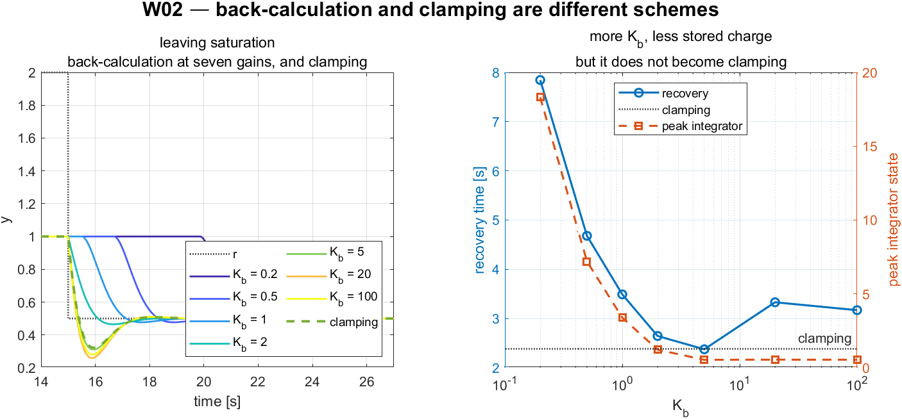
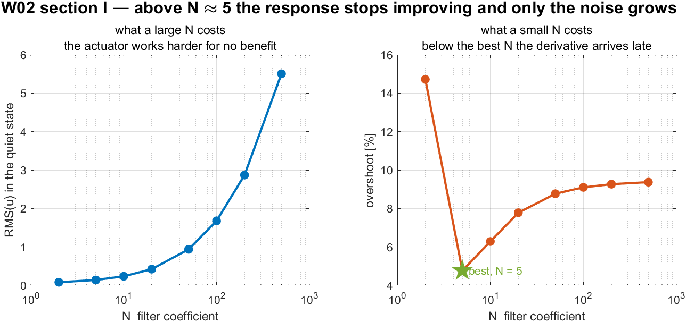

# Week 2 · Surge Speed Control

> [!important] Reference material — read this first
> <span style="font-size:0.88em">The five courses below are **taught by the instructor of this course** and are the assumed background for it. They run from the fundamentals down to the graduate material, so start wherever the gap is. Every frame, symbol and derivation used here is developed in them at length; anyone whose prerequisites are thin should work through them first, then return.</span>
>
> | # | Course | Level | Lang. | Video | Slides and code |
> |---|---|---|---|---|---|
> | 1 | **Control Engineering** (제어공학) — the foundation: transfer functions, feedback, stability, root locus, PID | undergraduate | KO | [playlist](https://youtube.com/playlist?list=PLFaUxNRM4BvJMpF9HZS-Mp8tDv9dTdglk) | [drive](https://drive.google.com/drive/folders/1TNIPDNtS_Iy8li-olka5WJslSXDYf0aT) |
> | 2 | **Control System Design** (제어시스템설계) — design rather than analysis: specifications, loop shaping, discrete implementation | undergraduate | KO | [playlist](https://youtube.com/playlist?list=PLFaUxNRM4BvIGroZ5rgn7x08F7C79d9WZ) | [drive](https://drive.google.com/drive/folders/11m5Xxl_PHJvxgHghLSP-jhCpmRpbvoXh) |
> | 3 | **Advanced Control Engineering** (제어공학특론) — reference frames, the 6-DOF equation of motion, rotation matrices and Euler angles, linearisation and trim, vehicle control design | graduate | EN | [playlist](https://youtube.com/playlist?list=PLFaUxNRM4BvJmvF2ljx4KM5dj1P5jEcw0) | [drive](https://drive.google.com/drive/folders/1GUxbbONl916lNd0ggnFnXrNwNkd13-2-) |
> | 4 | **Sensor Signal Processing and Fusion** (센서신호처리 및 융합) — sensor models, noise, estimation and multi-sensor fusion | graduate | EN | [playlist](https://youtube.com/playlist?list=PLFaUxNRM4BvK-aP2Gdoyp5-AWvMn7Fo8E) | [drive](https://drive.google.com/drive/folders/1MEVJP7TzMcm8w6TZwUjhWJtL34WeNY3u) |
> | 5 | **Capstone Design** (캡스톤디자인) — a vehicle project carried end to end | undergraduate | KO | [playlist](https://youtube.com/playlist?list=PLFaUxNRM4BvLu7L0pDoLzDXTv8mm6rCmj) | [drive](https://drive.google.com/drive/folders/1haIQejlJfrdhtOuof-MpffR9ydVscXZS) |
>
> <span style="font-size:0.88em">**Not fluent in MATLAB or Simulink yet? Do these before Part 2.** Every laboratory in this course is Simulink, and the Onramp courses are free and take a few hours each.</span>
>
> | Tool | Where to start |
> |---|---|
> | MATLAB | [MATLAB Onramp](https://matlabacademy.mathworks.com/kr/details/matlab-onramp/gettingstarted) · [Core MATLAB Skills](https://matlabacademy.mathworks.com/details/core-matlab-skills/lpmlcms) |
> | Simulink | [Simulink Onramp](https://matlabacademy.mathworks.com/kr/details/simulink-onramp/simulink) · instructor's Simulink lectures [part 1](https://youtu.be/a-afHg_fSaU) · [part 2](https://youtu.be/070Yn0Hw5a0) |


- **Course**: USV Guidance, Navigation and Control (Graduate)
- **Department**: Autonomous Vehicle System Engineering, Chungnam National University
- **This week**: ① the surge axis as a first-order, type 0 plant identified from the plant itself ② why proportional control leaves an error and integral action removes it ③ what an actuator limit does to an integrator, and three ways of surviving it

> [!important] Prerequisites from the previous week
> - From Week 1: $\tau_u = 1.1025$ s and $K_u = 0.012894$ (m/s)/N, and the propeller curve $T = k\,n|n|$.
> - Two numbers, and nothing else, are carried in from **Appendix A1**: the surge force this vessel can produce lies in $X \in [-133.42,\ 239.36]$ N. That limit is what causes the windup of §2-6. Appendix A1 derives it; a reader who takes the two numbers on trust loses nothing this week.

---

## Learning Outcomes

Upon completion of this week, the learner is able to:

1. Identify the DC gain and time constant of the surge axis from a step response, and state the discrepancy between the measurement and the first-order model.
2. Predict, from the final value theorem, the steady-state error of a proportional controller on a type 0 plant, and explain why no gain removes it.
3. Choose $K_p$ and $K_i$ to place the closed-loop poles at a specified $\zeta$ and $\omega_n$, and explain why the resulting overshoot exceeds the value tabulated for that $\zeta$.
4. State where the derivative term enters the equation of motion of a velocity loop, and predict its effect on the damping ratio before running the simulation.
5. Explain integrator windup as a consequence of actuator saturation rather than of integral action, and implement clamping and back-calculation.
6. Report a settling or recovery time with the tolerance band and the averaging window stated.
7. Build a PID controller from elementary blocks and from Simulink's PID Controller block, and state where the two differ and why.
8. Explain why a PID never differentiates directly, write the pseudo-derivative $Ns/(s+N)$ as a filter and a subtraction, and choose $N$ from the closed-loop bandwidth rather than by making it large.

## Prerequisites and Setup

| Item | Requirement |
|---|---|
| MATLAB | R2024b, with Simulink |
| Toolboxes | Control System Toolbox, for `tf`, `feedback` and `stepinfo` in the analysis script |
| MSS | `Tools/MSS`, added by the setup script |
| Course folder | `GradCourse/lectures/W02_simulink` |
| Expected duration | 60 min theory, 90 min laboratory |

---

# Part 1 · Theory

## 2-1. The plant, reduced to two numbers

### Where the surge equation comes from

- The controller of this week acts on one scalar equation. That equation is not an assumption — it is the first row of the 3-DOF model of §1-7, and this section derives it so that the terms thrown away can be named and later reclaimed.
- Start from the horizontal-plane model, $\boldsymbol{\nu} = [u\ v\ r]^{\!\top}$ (Fossen, *Handbook*, 2nd ed., §7.3):

$$
\mathbf{M}\dot{\boldsymbol{\nu}} + \mathbf{C}(\boldsymbol{\nu})\boldsymbol{\nu} + \mathbf{D}(\boldsymbol{\nu})\boldsymbol{\nu} = \boldsymbol{\tau}
$$

- For a vessel symmetric about its centreline, with the body origin on that centreline and the centre of gravity offset by $x_g$ along $x_b$:

$$
\mathbf{M} =
\begin{bmatrix}
m - X_{\dot u} & 0 & 0 \\
0 & m - Y_{\dot v} & m x_g - Y_{\dot r} \\
0 & m x_g - N_{\dot v} & I_z - N_{\dot r}
\end{bmatrix}
$$

- For the Otter, with the payload this course uses, that matrix is

$$
\mathbf{M} =
\begin{bmatrix}
85.5000 & 0 & 0 \\
0 & 162.5000 & 12.2500 \\
0 & 12.2500 & 42.6515
\end{bmatrix}
\quad\text{kg, kg·m, kg·m}^2
$$

> [!important] The surge row of $\mathbf{M}$ is already decoupled, and that is structural
> The zeros in the first row and column are **exactly zero**, not small. They follow from **port–starboard symmetry**: a hull that is mirror-symmetric cannot produce a sway force or a yaw moment when it is accelerated purely forward. Everything below concerns $\mathbf{C}$ and $\mathbf{D}$, because $\mathbf{M}$ has already given the surge axis to itself.
>
> The off-diagonal $M_{26} = 12.25$ kg·m couples sway and yaw, and it is the reason a turn produces sway. It never touches surge.

- The matrix above is not transcribed. It is rebuilt from `otter.m` lines 55–120 and printed by

```matlab
verify_constants
```

which also checks the sixteen coefficients this course quotes and reports `every quoted value agrees with otter.m to its printed precision`.

- The Coriolis matrix contributes to surge through the rigid-body and added-mass parts. Taking the first row of $\mathbf{C}_{RB}(\boldsymbol{\nu})\boldsymbol{\nu} + \mathbf{C}_{A}(\boldsymbol{\nu})\boldsymbol{\nu}$ and collecting terms gives the standard manoeuvring form:

$$
\begin{aligned}
\underbrace{(m - X_{\dot u})\,\dot u}_{\text{acceleration}}
\;-\; &\underbrace{(m - Y_{\dot v})\,v r}_{\text{Coriolis, sway}\times\text{yaw}}
\;-\; \underbrace{(m x_g - Y_{\dot r})\,r^{2}}_{\text{centripetal}} \\[2pt]
&= \underbrace{X}_{\text{thrust}} \;+\; \underbrace{X_u u}_{\text{damping},\ X_u<0}
\end{aligned}
$$

### What is dropped, and why it is exact here

- Two terms stand between the full row and the scalar plant, and **both carry a factor of $r$**:

| Term | Dropped because |
|---|---|
| $(m - Y_{\dot v})\,v r$ | proportional to $r$ |
| $(m x_g - Y_{\dot r})\,r^{2}$ | proportional to $r^2$ |

- In this week's experiment $r$ is not merely small. It is **identically zero**, and the reason is the actuator, not the hull:

$$
\boldsymbol{\tau} = \mathbf{B}\mathbf{f},
\qquad
\mathbf{B} = \begin{bmatrix} 1 & 1 \\ 0 & 0 \\ y_p & -y_p \end{bmatrix},
\qquad
\mathbf{f} = \begin{bmatrix} T \\ T \end{bmatrix}
\;\Longrightarrow\;
\boldsymbol{\tau} = \begin{bmatrix} 2T \\ 0 \\ 0 \end{bmatrix}
$$

- The speed controller splits its demand **equally** between the two propellers, so $N = y_p(T - T) = 0$ exactly. With $N = 0$ and $r(0) = 0$ the yaw equation gives $r \equiv 0$, and with $r \equiv 0$ the sway equation gives $v \equiv 0$.
- Therefore both discarded terms are **exactly zero for the whole run**, not small. This is the rare case where a 1-DOF reduction is not an approximation.

$$
\boxed{\ (m - X_{\dot u})\,\dot u = X + X_u u \ }
\qquad\Longleftrightarrow\qquad
M_{11}\,\dot u = X + X_u u
$$

$$
M_{11} = (m + m_p) - X_{\dot u} = 85.50\ \text{kg}
$$

> [!note] When the dropped terms come back
> The moment a heading command is added, $r \neq 0$ and $vr$ reappears in the surge equation — the vessel slows in a turn without any change in thrust. Week 1 measured exactly this: surge fell from $1.0286$ to $1.0218$ m/s in the turns, a loss of $0.7\%$, produced entirely by the term dropped above. Week 3 controls heading and Week 5 runs both loops at once.

- Taking Laplace transforms with $u(0) = 0$ gives a first-order lag:

$$
\frac{u(s)}{X(s)} = \frac{K_u}{\tau_u s + 1},
\qquad
K_u = \frac{1}{|X_u|},
\qquad
\tau_u = \frac{M_{11}}{|X_u|}.
$$

| Symbol | Quantity | Value / source |
|---|---|---|
| $M_{11}$ | surge mass including added mass | $85.50$ kg, `otter.m` |
| $X_u$ | linear surge damping | $-77.5544$ N per m/s, $-24.4g/U_{\max}$ |
| $K_u$ | DC gain | $0.012894$ (m/s)/N |
| $\tau_u$ | time constant | $1.1025$ s |

> [!important] The plant has no free integrator
> There is no $1/s$ anywhere in $u(s)/X(s)$. The loop is therefore **type 0**, and every consequence of §2-2 follows from that single structural fact rather than from any numerical value.

## 2-2. Proportional control, and the error it cannot remove

- With $X = K_p(u_d - u)$ the closed loop is

$$
\frac{u(s)}{u_d(s)} = \frac{K_p K_u}{\tau_u s + 1 + K_p K_u},
$$

- and the final value theorem gives the steady state directly:

$$
\boxed{\ \frac{u_{ss}}{u_d} = \frac{K_p K_u}{1 + K_p K_u}
\qquad\Longrightarrow\qquad
\frac{e_{ss}}{u_d} = \frac{1}{1 + K_p K_u}\ }
$$

- The error is never zero for finite $K_p$. The physical reason is more useful than the algebraic one:

> [!note] The error is what produces the force
> Holding a steady speed requires a steady force, $X_{ss} = |X_u|\,u_{ss}$, because the damping never stops. A proportional controller produces force **only** from error. Removing the error would remove the force that sustains the speed, so the error is not a defect of the controller — it is the controller's only means of doing its job.

- Raising the gain shrinks the error but never removes it, and it does so at a cost. The gain also multiplies measurement noise and pushes the demanded force toward the saturation limits of §2-6.

## 2-3. Integral action, and the zero nobody placed

- Adding $K_i \int e\,\mathrm{d}t$ supplies the steady force without steady error. The closed loop becomes second order:

$$
\frac{u(s)}{u_d(s)} = \frac{K_u\left(K_p s + K_i\right)}{\tau_u s^{2} + \left(1 + K_u K_p\right)s + K_u K_i}.
$$

- Matching the denominator to $s^2 + 2\zeta\omega_n s + \omega_n^2$ gives the design equations used in `W02_0_setup.m`:

$$
\omega_n = \sqrt{\frac{K_u K_i}{\tau_u}},
\qquad
\zeta = \frac{1 + K_u K_p}{2\sqrt{\tau_u K_u K_i}} .
$$

- Inverting them for a specified pair:

$$
K_i = \frac{\omega_n^{2}\,\tau_u}{K_u},
\qquad
K_p = \frac{2\zeta\sqrt{\tau_u K_u K_i} - 1}{K_u}.
$$

- For $\zeta = 0.7$ and $\omega_n = 1.5$ rad/s this gives $K_p = 102.00$ and $K_i = 192.38$.

> [!caution] The tabulated overshoot for $\zeta = 0.7$ does not apply
> The numerator of the closed loop is $K_u(K_p s + K_i)$, which is a **zero** at $s = -K_i/K_p = -1.886$. The standard relation $M_p = \exp\!\left(-\pi\zeta/\sqrt{1-\zeta^2}\right)$ is derived for a second-order system with **no** zero. A PI controller always adds one, and it always lands at $-K_i/K_p$, which for any sensible design sits close to the poles. The measured overshoot is $8.1\%$ against the tabulated $4.6\%$ — a factor of $1.8$. The damping ratio was designed correctly; the prediction made from it was not.

## 2-4. Where the derivative term actually goes

- The derivative is taken on the **measurement**, not on the error:

$$
X = K_p e + K_i\!\int\! e\,\mathrm{d}t - K_d\,\frac{N s}{s + N}\,u .
$$

- Two reasons, and only the second is about this week.

| Choice | Reason |
|---|---|
| on the measurement, not the error | a step in $u_d$ differentiates to an impulse; the measurement never steps |
| filtered by $Ns/(s+N)$ | pure differentiation has unbounded high-frequency gain and amplifies sensor noise without limit |

### The pseudo-derivative

- The second row deserves more than a line, because **no working PID contains a differentiator.** What it contains is an approximation to one, and that approximation has a name.

$$
\underbrace{s}_{\text{ideal}}
\qquad\longrightarrow\qquad
\underbrace{\frac{N s}{s + N}}_{\text{pseudo-derivative}}
$$

- Compare the two by magnitude alone:

$$
\left| j\omega \right| = \omega
\qquad\text{against}\qquad
\left| \frac{N j\omega}{j\omega + N} \right| = \frac{N\omega}{\sqrt{\omega^2 + N^2}}
$$

| $\omega$ | ideal | pseudo |
|---|---|---|
| $\omega \ll N$ | $\omega$ | $\approx \omega$ — the two agree |
| $\omega = N$ | $N$ | $N/\sqrt 2$ |
| $\omega \gg N$ | $\omega \to \infty$ | $\to N$, **flat** |

> [!important] Differentiation multiplies every component by its own frequency
> That is the whole problem in one sentence. The fastest thing in any real measurement is the sensor noise, so differentiation seeks out the least meaningful part of the signal and multiplies it by the largest number in the problem. The pseudo-derivative is the same operator with its gain capped at $N$, and $N$ is therefore the knob that decides **how much of the noise reaches the actuator**.

- Written as a state, the pseudo-derivative is a first-order lag on the signal, subtracted from it:

$$
\frac{Ns}{s+N} = N\left(1 - \frac{N}{s+N}\right)
\qquad\Longleftrightarrow\qquad
\dot{x}_f = N\left(y - x_f\right), \quad d = N\left(y - x_f\right)
$$

- So it costs one state and no differentiation at all. **A low-pass filter and a subtraction are doing the work of a derivative**, which is why it is implementable in fixed point on a microcontroller and why an ideal derivative is not.

| Choosing $N$ | What happens |
|---|---|
| $N$ too small | the filter lags, the derivative arrives late, and the damping it was added for is lost |
| $N$ too large | the response stops improving — the pole is far outside the loop bandwidth — while the noise keeps growing |

- There is a common belief that large $N$ is the safe default because it is "closer to a true derivative". Section I measures it and finds the opposite: above a certain $N$ the response is unchanged to within $0.3$ points of overshoot while the actuator noise grows by a factor of three.
- The rule that follows: **place $N$ just above the closed-loop bandwidth, and no higher.**

> [!note] The name
> Textbooks call $Ns/(s+N)$ the *filtered*, *approximate*, *practical* or *pseudo*-derivative interchangeably. Åström and Hägglund parameterise it as $T_d s/(1 + (T_d/N)s)$, where $T_d = K_d/K_p$ and $N \in [8, 20]$ is dimensionless. That $N$ and the $N$ used here are related by $N_{\text{here}} = N_{\text{Åström}}/T_d$, so the two conventions must never be mixed in one derivation.

- Now substitute into the equation of motion. Ignoring the filter, $-K_d\dot u$ moves to the left-hand side:

$$
\left(M_{11} + K_d\right)\dot u = X_{\text{PI}} + X_u u .
$$

> [!important] On a velocity loop the derivative term is a mass, not a damper
> The controlled variable is a velocity, so its derivative is an **acceleration**, and $K_d$ enters the equation of motion in exactly the place occupied by the mass. The effective time constant becomes $\tau_{\text{eff}} = \tau_u + K_u K_d$, so
> $$\omega_n = \sqrt{\frac{K_u K_i}{\tau_u + K_u K_d}}\ \downarrow, \qquad \zeta = \frac{1 + K_u K_p}{2\sqrt{(\tau_u + K_u K_d)K_u K_i}}\ \downarrow .$$
> Adding derivative action to this loop makes it **less** damped, not more. Section E measures it.

- This is a property of the **axis**, not of PID. Week 3 controls a heading, whose derivative is a rate rather than an acceleration, and there the same term supplies genuine damping. The lesson is to substitute the control law into the equation of motion before assuming what a term does.

## 2-5. Allocation, in its simplest form

- The controller demands a force. The propellers accept a shaft speed. Inverting $T = k\,n|n|$ with the demand split equally:

$$
T = \frac{X_{\text{cmd}}}{2},
\qquad
n = \operatorname{sign}(T)\sqrt{\frac{|T|}{k}},
\qquad
k = \begin{cases} k_{\text{pos}}, & T \ge 0\\ k_{\text{neg}}, & T < 0\end{cases}
$$

- then saturate $n$ and compute what the propellers **actually** deliver:

$$
X_{\text{sat}} = 2\,k\,n_{\text{sat}}|n_{\text{sat}}| .
$$

- The equal split is forced: a pure surge demand contains nothing that distinguishes the two propellers. Week 4 treats the case where the demand does distinguish them and the split is no longer obvious.

> [!warning] $X_{\text{sat}}$ must leave the allocation block
> Without it the controller has no way of knowing that the actuator has stopped following the demand. Every anti-windup scheme in §2-6 is built on the difference $X_{\text{cmd}} - X_{\text{sat}}$, and a block that does not report what it delivered makes all of them impossible.

## 2-6. Windup is a saturation problem

- The attainable set of §A1-6 caps the surge force at $X_{\max} = 24.4g = 239.364$ N. Combined with $X_u = -24.4g/U_{\max}$ this produces an exact and rather elegant limit:

$$
u_{\max} = \frac{X_{\max}}{|X_u|} = \frac{24.4g}{24.4g/U_{\max}} = U_{\max} = 3.0864\ \text{m/s}.
$$

- The saturation limit and the damping coefficient are not independent numbers in `otter.m`. They are chosen so that full ahead delivers exactly the design speed of six knots. Astern, $X_{\min} = -13.6g$ gives $u_{\min} = -1.7203$ m/s.
- Ask for more than $u_{\max}$ and the error cannot be driven to zero. The integrator, which knows nothing of this, keeps integrating.

| Stage | What happens |
|---|---|
| demand exceeds the limit | $X_{\text{sat}}$ stops following $X_{\text{cmd}}$; the loop is open |
| the integrator continues | its state grows without bound while the error stays positive |
| the setpoint returns to a reachable value | the error changes sign, but the stored charge must be integrated back out before $X_{\text{cmd}}$ re-enters the attainable set |
| meanwhile | the vessel does not respond at all |

### The principle, in one line

- Write the controller output and what the actuator actually delivers as two separate signals:

$$
X_{\text{cmd}} = K_p e + I,
\qquad
X_{\text{sat}} = \operatorname{sat}\!\left(X_{\text{cmd}}\right),
\qquad
\dot I = K_i e .
$$

- Everything goes wrong at the third equation. $\dot I$ is written in terms of $e$, and $e$ is the error of a loop that is **no longer closed**. Both remedies do the same thing: they make $\dot I$ depend on the saturation as well.

$$
\boxed{\ \dot I = K_i e \;-\; \underbrace{f\!\left(X_{\text{cmd}} - X_{\text{sat}}\right)}_{\text{zero whenever the actuator is following}}\ }
$$

- The bracketed term vanishes whenever $X_{\text{cmd}} = X_{\text{sat}}$, so **an unsaturated loop is unaffected by any anti-windup scheme**. That is the property both schemes must have, and it is what makes them safe to switch on permanently.

### Two remedies

**Clamping**, or conditional integration — freeze the integrator while the actuator is saturated *and* the error would drive it further in:

$$
\dot I =
\begin{cases}
0, & \left|X_{\text{cmd}} - X_{\text{sat}}\right| > 0 \ \text{ and } \ \operatorname{sign}(e) = \operatorname{sign}\!\left(X_{\text{cmd}} - X_{\text{sat}}\right)\\[4pt]
K_i e, & \text{otherwise}
\end{cases}
$$

**Back-calculation** — feed the excess back into the integrator through a gain:

$$
\dot I = K_i e - K_{\text{aw}}\left(X_{\text{cmd}} - X_{\text{sat}}\right),
\qquad
K_{\text{aw}} = \frac{1}{\tau_u} .
$$

- Back-calculation has a fixed point worth naming. While the actuator is saturated, $\dot I \to 0$ requires

$$
I \to \frac{K_i}{K_{\text{aw}}}e + X_{\text{sat}} - K_p e ,
$$

- which is the integrator value that would make the demand equal to what the actuator can give. The scheme does not merely stop the integrator; it **steers it to the boundary**.

| | Clamping | Back-calculation |
|---|---|---|
| mechanism | logical, the integrator is switched off | continuous, the integrator is pulled to the boundary |
| tuning | none | one gain, $K_{\text{aw}}$ |
| behaviour at the boundary | discontinuous | smooth |
| where the integrator ends up | wherever it was when saturation began | at the value that makes $X_{\text{cmd}} = X_{\text{sat}}$ |
| large-gain limit | — | **not** clamping; §H measures the difference |

> [!note] Neither is a fix for the integrator
> Both schemes exist because the loop was opened by the actuator. The correct engineering response to persistent saturation is a reference the vessel can actually follow — which is what Week 7's reference model provides. Anti-windup limits the damage; it does not make an unreachable setpoint reachable.

## 2-7. The same controller, written twice

- Simulink ships a **PID Controller** block that contains everything §2-3 to §2-6 describes: three terms, a filtered derivative, an output limit, and the same two anti-windup schemes as dialog options.
- Both are in the model, and `pid_mode` chooses between them.

| `pid_mode` | Path |
|---|---|
| 0 | the hand-built controller — nine blocks |
| 1 | the library block — one block |

- The reason for having both is not indecision. A learner who has only used the block does not know what is inside it; a learner who has only built it by hand does not know the block exists, and will rebuild it on every project.
- **Two differences are real**, and section G measures them rather than hiding them.

| Difference | Consequence |
|---|---|
| the library block differentiates its **input**, which here is the error | with $K_d = 0$ the two agree exactly; with $K_d > 0$ they do not |
| the library block saturates its **own** output at $[X_{\min}, X_{\max}]$ | the same limits the allocation imposes, so the two saturations coincide |

- The first difference has a name and a remedy. Differentiating the error puts every setpoint step through the derivative; differentiating the measurement does not. Simulink's **two-degree-of-freedom** PID block exists precisely to let the two be weighted separately.

---

# Part 2 · Laboratory

## A. Setting up (10 min)

```matlab
cd GradCourse/lectures/W02_simulink
W02_0_setup
```

Expected output:

```
  W03 setup complete
    plant           tau_u = 1.1025 s,  K_u = 0.012894 (m/s)/N
    actuator        X in [-133.42, 239.36] N  ->  u_ss in [-1.7203, 3.0864] m/s
    controller      Kp = 102, Ki = 192.38, Kd = 0, Nf = 20
    closed loop     wn = 1.5000 rad/s,  zeta = 0.7000
    anti-windup     back-calculation
    reference       1.5 -> 1.5 m/s at t = 5 s
    simulation      30 s at h = 0.02 s
```

- To restore a model that has been broken: `W02_1_build_surge_control`.

## B. Reading the model (15 min)


**Reading the figure**

| Element | Meaning |
|---|---|
| `Speed command` (white) | two steps summed, so one model covers a single step and the up-then-down profile of §F |
| `Surge controller` (blue) | the PID, the anti-windup selector, and the open/closed switch |
| `Control allocation` (sand) | $X_{\text{cmd}} \to n$, and back to $X_{\text{sat}}$ after saturation |
| `Otter USV` (green) | `otter.m`, called unchanged |
| `Measurements` (grey) | selectors, scope, workspace log and live view |

- The chain of Week 1 is now complete except for the reference model: **command → controller → allocation → plant → measurement**, in that order, left to right.
- **Two signals travel backwards, and only two.**

| Signal | From | To | Why |
|---|---|---|---|
| `x` | plant | controller | the measured speed. The whole twelve-state vector is sent and the controller selects $u$ inside |
| `X_sat` | allocation | controller | what the propellers **actually** delivered |

> [!important] `X_sat` is the feedback path that gets missed
> Without knowing what the actuator delivered, the controller has no way of telling that the demand was not followed. Every anti-windup scheme in §2-6 is built on the difference $X_{\text{cmd}} - X_{\text{sat}}$, so an allocation block that does not report what it produced makes all of them impossible.

### Inside `Surge controller`

- Opening it shows the three terms, the anti-windup block that decides what reaches the integrator, and one switch:

| Block | Meaning |
|---|---|
| `Kp` | the proportional term |
| `anti-windup` | `aw_mode` selects one of the three schemes of §2-6 |
| `I state` | the integrator, and the only state in the controller |
| `D filter` | $K_d N s/(s+N)$ acting on the **measurement**, not on the error |
| `open or closed` | `loop_closed = 0` applies `X_open` instead of the controller |

- The switch is not decoration. `loop_closed = 0` turns this model into the open-loop rig of §C, so the plant that is identified is provably the plant the controller then drives.

## C. Identifying the plant from the plant (15 min)


> [!tip] To produce every figure in this section
> | | |
> |---|---|
> | script | `W02_C_identify_plant.m` |
> | model | `W02_surge_control.slx` |
> | figure | `img/W02_result_openloop.png` |
>
> ```matlab
> W02_0_setup                    % once per session
> W02_C_identify_plant
> ```
>
> Opening the model and pressing **Run** produces the same figure: the
> scopes update as it runs and `StopFcn` draws the summary at the end.


| $X$ [N] | measured $u_{ss}$ [m/s] | $K_u X$ [m/s] | measured $\tau$ [s] | error [%] |
|---|---|---|---|---|
| 50 | $0.6447$ | $0.6447$ | $1.1200$ | $-0.00$ |
| 100 | $1.2894$ | $1.2894$ | $1.1200$ | $-0.00$ |
| 150 | $1.9341$ | $1.9341$ | $1.1200$ | $-0.00$ |
| 200 | $2.5788$ | $2.5788$ | $1.1200$ | $-0.00$ |


**Reading the figure**

| Element | Meaning |
|---|---|
| left panel | the step response to $X = 100$ N, with the $63.2\%$ crossing marked |
| centre panel | settled speed against applied force; the measured points lie on $K_u X$ |
| right panel | the same line, cut off by the actuator limits of Appendix A1 |

- The DC gain is exact to four decimals across the whole range. The plant really is $u = K_u X$ in steady state.
- The time constant is **not** exact: $1.1200$ s measured against $1.1025$ s predicted, an excess of $1.59\%$. The residue is the surge-pitch coupling retained by the twelve-state plant and discarded by the scalar model. It is reported rather than absorbed.

> [!important] $u_{\max} = U_{\max}$ is exact, and it is not a coincidence
> $X_{\max} = 2k_{\text{pos}}n_{\max}^2 = 24.4g$ by construction of $n_{\max}$, and $X_u = -24.4g/U_{\max}$ by construction of the damping. The two $24.4g$ cancel, leaving $u_{\max} = U_{\max} = 3.0864$ m/s exactly. No controller of any structure can ask for more.

## D. Proportional only (15 min)


> [!tip] To produce every figure in this section
> | | |
> |---|---|
> | script | `W02_D_proportional_only.m` |
> | model | `W02_surge_control.slx` |
> | figure | `img/W02_result_P.png` |
>
> ```matlab
> W02_0_setup                    % once per session
> W02_D_proportional_only
> ```
>
> Opening the model and pressing **Run** produces the same figure: the
> scopes update as it runs and `StopFcn` draws the summary at the end.

Measured with $u_d = 1.5$ m/s, $K_i = K_d = 0$:

| $K_p$ | $K_p K_u$ | predicted $u_{ss}$ | measured $u_{ss}$ | error [%] | $X_{ss}$ [N] |
|---|---|---|---|---|---|
| 100 | $1.2894$ | $0.8448$ | $0.8448$ | $43.68$ | $65.519$ |
| 500 | $6.4471$ | $1.2986$ | $1.2986$ | $13.43$ | $100.711$ |
| 2000 | $25.7883$ | $1.4440$ | $1.4440$ | $3.73$ | $111.989$ |


**Reading the figure**

| Element | Meaning |
|---|---|
| left panel | three step responses; none reaches the dashed setpoint |
| right panel | the predicted error curve $100/(1 + K_p K_u)$ with the three measurements on it |

- Prediction and measurement agree to four decimal places, because both are consequences of the same structural fact and neither involves an approximation.
- A twentyfold increase in gain buys a reduction from $44\%$ to $3.7\%$. The last column shows why the error cannot vanish: the steady force needed is $111.99$ N at the highest gain, and a proportional controller can only produce it from a non-zero error.

## E. Integral and derivative (20 min)


> [!tip] To produce every figure in this section
> | | |
> |---|---|
> | script | `W02_E_integral_and_derivative.m` |
> | model | `W02_surge_control.slx` |
> | figure | `img/W02_result_PI.png and img/W02_result_D.png` |
>
> ```matlab
> W02_0_setup                    % once per session
> W02_E_integral_and_derivative
> ```
>
> Opening the model and pressing **Run** produces the same figure: the
> scopes update as it runs and `StopFcn` draws the summary at the end.

### PI

Designed for $\zeta = 0.7$, $\omega_n = 1.5$ rad/s, giving $K_p = 102.00$ and $K_i = 192.38$, with the zero at $s = -1.8861$ and the poles at $-1.050 \pm 1.071\mathrm{j}$.

| Source | overshoot [%] | $t_s$ (2%) [s] |
|---|---|---|
| poles only, $\exp\!\left(-\pi\zeta/\sqrt{1-\zeta^2}\right)$ | $4.60$ | $3.81$ |
| linear model **including** the PI zero | $8.07$ | $3.47$ |
| the twelve-state plant | $8.15$ | $3.46$ |

- Steady-state error at $t = 30$ s: $-2.1\times 10^{-12}$ m/s, that is, zero to the tolerance of the solver.


**Reading the figure**

| Element | Meaning |
|---|---|
| left panel | the plant, thick, with the linear model dashed on top; they coincide |
| right panel | the pole-zero map, with the $\omega_n$ arc and the $\zeta$ rays that were designed for |

- The second and third rows of the table agree to $1\%$. The first row disagrees with both by $75\%$. The zero, not the plant, is the source of the discrepancy.

### Derivative

$K_p$ and $K_i$ held at the values above:

| $K_d$ | $M_{11} + K_d$ [kg] | $\omega_n$ | $\zeta$ | predicted $M_p$ [%] | measured $M_p$ [%] |
|---|---|---|---|---|---|
| 0 | $85.50$ | $1.5000$ | $0.7000$ | $8.07$ | $8.15$ |
| 20 | $105.50$ | $1.3504$ | $0.6302$ | $11.60$ | $11.48$ |
| 60 | $145.50$ | $1.1499$ | $0.5366$ | $17.39$ | $16.88$ |
| 150 | $235.50$ | $0.9038$ | $0.4218$ | $26.56$ | $25.50$ |


**Reading the figure**

| Element | Meaning |
|---|---|
| left panel | four step responses; overshoot grows monotonically with $K_d$ |
| right panel, dashed | the overshoot predicted from the effective mass $M_{11} + K_d$ |
| right panel, right axis | the damping ratio, falling as $K_d$ rises |

- $K_d = 150$ N per m/s² makes an $85.5$ kg vessel behave like a $235.5$ kg one, and $\zeta$ falls from $0.700$ to $0.422$. Prediction and measurement agree to within $1.1$ percentage points across the whole sweep.
- The correct conclusion is not that derivative action is useless. It is that a term must be substituted into the equation of motion before its effect is assumed.

## F. Windup (25 min)


> [!tip] To produce every figure in this section
> | | |
> |---|---|
> | script | `W02_F_windup.m` |
> | model | `W02_surge_control.slx` |
> | figure | `img/W02_result_windup.png` |
>
> ```matlab
> W02_0_setup                    % once per session
> W02_F_windup
> ```
>
> Opening the model and pressing **Run** produces the same figure: the
> scopes update as it runs and `StopFcn` draws the summary at the end.

- $u_d = 3.5$ m/s is applied at $t = 5$ s. It is **unreachable**: $u_{\max} = 3.0864$ m/s. At $t = 40$ s the demand drops to $1.5$ m/s, which is reachable.

| Anti-windup | peak $I$ [N] | peak $X_{\text{cmd}}$ [N] | recovery [s] |
|---|---|---|---|
| none | $3438.2$ | $3480.0$ | $13.980$ |
| clamping | $197.8$ | $355.9$ | $3.400$ |
| back-calculation | $339.0$ | $464.1$ | $3.640$ |

- **Recovery** is measured from $t = 40$ s to the last instant at which $|u - 1.5| > 0.03$ m/s, that is, a $2\%$ band on the new setpoint. The averaging window is the whole interval $[40,\ 90]$ s.


**Reading the figure**

| Element | Meaning |
|---|---|
| top left | the speed; without anti-windup the vessel holds $3.09$ m/s for ten seconds after the demand has dropped |
| top right | the error; it stays at $+0.41$ m/s for the whole unreachable segment |
| bottom left | dashed is $X_{\text{cmd}}$, solid is $X_{\text{sat}}$; the two separate the instant the limit is reached |
| bottom right | the integrator state, reaching $3438$ N against a largest useful value of $239$ N |

- The integrator accumulates $14.4$ times the largest force the actuator can deliver. Every newton of that has to be integrated back out before the loop responds at all.
- Clamping and back-calculation differ little here — $3.40$ s against $3.64$ s. Clamping is slightly faster because it stops the integrator completely; back-calculation is smoother at the boundary and has one gain to choose. On this plant the choice is not important, which is itself worth knowing.

> [!important] Nothing was wrong with the integrator
> It did exactly what an integrator does. The loop had been opened by the actuator, and no gain chosen inside a closed-loop analysis can account for a loop that is not closed. Every one of the four experiments this week was predicted correctly by the linear model **except** where saturation intervened, and that is the boundary of linear design.

## G. Hand-built against the library block (10 min)


> [!tip] To produce every figure in this section
> | | |
> |---|---|
> | script | `W02_G_block_vs_handbuilt.m` |
> | model | `W02_surge_control.slx` |
> | figure | `img/W02_result_block.png` |
>
> ```matlab
> W02_0_setup                    % once per session
> W02_G_block_vs_handbuilt
> ```
>
> Opening the model and pressing **Run** produces the same figure: the
> scopes update as it runs and `StopFcn` draws the summary at the end.

The same two runs, with `pid_mode = 0` and `pid_mode = 1`:

| Case | largest gap in $u$ [m/s] | $M_p$ hand-built [%] | $M_p$ library block [%] |
|---|---|---|---|
| PI, $K_d = 0$ | $2.2\times 10^{-16}$ | $8.15$ | $8.15$ |
| PID, $K_d = 60$ | $1.8\times 10^{-1}$ | $16.88$ | $11.40$ |


**Reading the figure**

| Element | Meaning |
|---|---|
| left panel | $K_d = 0$: the thick and dashed traces are one curve |
| right panel | $K_d = 60$: they separate, and the library block overshoots less |

- With $K_d = 0$ the two agree to **machine precision**. Nine blocks and one library block compute the same thing, and the back-calculation written by hand in §2-6 is the back-calculation the block implements.
- With $K_d = 60$ they differ by $0.18$ m/s. Neither is wrong. The library block differentiates the **error**, so a step in $u_d$ passes through its derivative and produces a kick that the hand-built path — which differentiates the **measurement** — never sees.

> [!tip] Which to use
> The library block, in almost every case. It is one block, it is tested, and it offers discrete-time forms, external reset and tracking mode that would each take several more blocks by hand. Build it by hand once, to know what is inside it, and then stop.

## H. The principle on its own (20 min)


> [!tip] To produce every figure in this section
> | | |
> |---|---|
> | script | `W02_H_antiwindup_run.m` |
> | model | `W02_H_antiwindup.slx` |
> | figure | `img/W02_result_aw_principle.png and img/W02_result_aw_Kb.png` |
>
> ```matlab
> W02_0_setup                    % once per session
> W02_H_antiwindup_run
> ```
>
> Opening the model and pressing **Run** produces the same figure: the
> scopes update as it runs and `StopFcn` draws the summary at the end.

- The vessel is a distraction from the mechanism. A second model strips everything away:

$$
G(s) = \frac{1}{s+1},
\qquad
u \in [-1,\ +1],
\qquad
\text{PI with } K_p = 1.8,\ K_i = 4 .
$$

- The DC gain is $1$ and $|u| \le 1$, so the largest reachable output is $y = 1$. The reference is stepped to $2$ — unreachable — held for 14 s, then dropped to $0.5$, which is reachable.

```matlab
W02_H_build_antiwindup
W02_H_antiwindup_run
```


**Reading the figure**

| Element | Meaning |
|---|---|
| `Reference` (white) | the step up to an impossible value, then down to a possible one |
| `PID bank` (blue) | four controllers with identical gains: three library blocks with the three anti-windup settings, and the fourth built by hand |
| `Plant bank` (green) | four identical copies of $1/(s+1)$, one per controller |
| `Measurements` (grey) | the log |

- The fourth row exists so that the **integrator state is a signal**. The library block does not expose it, and the integrator is where the whole phenomenon lives.

### Results

| Anti-windup | time on the limit [s] | recovery [s] | $y$ at $t = 20$ s |
|---|---|---|---|
| none | $43.05$ | $32.04$ | $1.0000$ |
| clamping | $14.00$ | $2.380$ | $0.4997$ |
| back-calculation | $14.00$ | $2.645$ | $0.5003$ |
| the same, by hand | $14.00$ | $2.645$ | $0.5003$ |

- **Recovery** is the time after $t = 15$ s for $y$ to enter and stay within a $2\%$ band on $0.5$.


**Reading the figure**

| Element | Meaning |
|---|---|
| top left | the output; all four are one curve on the way up |
| top right | the control signal; all four sit on the limit for the same 14 s |
| bottom left | the integrator state on a log scale, with and without anti-windup |
| bottom right | the error, which cannot reach zero while the reference is unreachable |

- **All four are identical on the way up.** While the demand is impossible every scheme sits on the limit and produces $y = 1$. Nothing distinguishes them until $t = 15$ s.
- The bottom-left panel is the whole phenomenon. Without anti-windup the integrator winds to $60.00$, against a largest useful value of $1.0$ and against $1.225$ with back-calculation — a factor of $49$. It then takes $30$ s to unwind, and the loop does nothing for all of it.
- Rows 3 and 4 agree to **exactly zero**. The library block and the hand-built path are the same algorithm, so the theory of §2-6 is a correct description of what the block does.

### What the back-calculation gain does

| $K_{\text{aw}}$ | recovery [s] | peak integrator | undershoot after [%] |
|---|---|---|---|
| 0.2 | $7.845$ | $18.308$ | $4.60$ |
| 0.5 | $4.680$ | $7.199$ | $4.60$ |
| 1 | $3.490$ | $3.389$ | $4.60$ |
| 2 | $2.645$ | $1.225$ | $7.02$ |
| **5** | **$2.375$** | $0.538$ | $37.84$ |
| 20 | $3.330$ | $0.548$ | $48.25$ |
| 100 | $3.170$ | $0.544$ | $43.96$ |

- clamping, for comparison: recovery $2.380$ s



**Reading the figure**

| Element | Meaning |
|---|---|
| left panel | the moment of leaving saturation, at seven values of $K_{\text{aw}}$, with clamping dashed |
| right panel, left axis | recovery time, with a minimum near $K_{\text{aw}} = 5$ |
| right panel, right axis | the peak integrator state, falling and then flattening |

- There is a **minimum**, near $K_{\text{aw}} = 5$. Below it the integrator is not pulled back fast enough; above it the loop leaves saturation abruptly and undershoots, from $4.60\%$ to $43.96\%$.
- Raising $K_{\text{aw}}$ does **not** turn back-calculation into clamping. The two remain different at every gain, and the reason is §2-6: clamping stops the integrator wherever it happens to be, while back-calculation steers it to the value that makes the demand equal the limit. They are different fixed points, not two ends of one scale.

> [!important] The rule of thumb, and its limit
> $K_{\text{aw}} = 1/\tau$ is the usual starting point, and on this plant $\tau = 1$ s gives $K_{\text{aw}} = 1$ — a recovery of $3.49$ s against the best available $2.375$ s. It is a reasonable default and it is not optimal. The sweep above takes one line to run, and the result is a genuine trade-off between how fast the integrator is emptied and how violently the loop leaves the limit.

## I. The pseudo-derivative, on a plant that wants one (25 min)


> [!tip] To produce every figure in this section
> | | |
> |---|---|
> | script | `W02_I_pseudo_derivative_run.m` |
> | model | `W02_I_pseudo_derivative.slx` |
> | figure | `img/W02_result_pd.png and img/W02_result_pd_N.png` |
>
> ```matlab
> W02_0_setup                    % once per session
> W02_I_pseudo_derivative_run
> ```
>
> Opening the model and pressing **Run** produces the same figure: the
> scopes update as it runs and `StopFcn` draws the summary at the end.

- §2-4 found that on the surge axis the derivative term acts as a **mass** and makes things worse, so nothing in sections A to G shows what the derivative filter is *for*.
- A third model uses a plant where derivative action is genuinely wanted:

$$
G(s) = \frac{1}{s^2 + 0.4\,s},
\qquad
K_p = 4,\ K_d = 2,
\qquad
\text{measurement noise } \sigma = 0.01 .
$$

- Under proportional control alone the closed loop is $s^2 + 0.4s + K_p$, so $\zeta = 0.2/\sqrt{K_p} = 0.1$. It rings badly. Derivative action is the cure, which makes *how to take the derivative* a real question.

```matlab
W02_I_build_pseudo_derivative
W02_I_pseudo_derivative_run
```


**Reading the figure**

| Element | Meaning |
|---|---|
| `Reference` (white) | one step, at $t = 1$ s |
| `Controller bank` (blue) | four controllers, identical except for the block in the derivative slot: none, ideal $s$, and the pseudo-derivative at two values of $N$ |
| `Plant bank` (green) | four copies of $G(s)$ and **one** noise source shared by all four |
| `Measurements` (grey) | the log, which records the clean output so the plots are not themselves noisy |

> [!important] One noise source, not four
> Four independent noise generators would make the four control signals differ for two reasons at once, and the comparison would prove nothing. Sharing one realisation is what licenses the claim that the differences below are caused by the derivative implementation alone.

### ① The four rows, with noise

| Derivative | overshoot | settling | RMS($u$) quiet | max $\lvert u \rvert$ |
|---|---|---|---|---|
| P only | $73.22\%$ | $19.00$ s | $0.1814$ | $4.04$ |
| ideal, $K_d s$ | $9.54\%$ | $2.99$ s | $8.7452$ | $105.94$ |
| pseudo, $N = 100$ | $9.10\%$ | $2.97$ s | $1.6780$ | $9.61$ |
| pseudo, $N = 10$ | $6.28\%$ | $2.63$ s | $0.2348$ | $4.26$ |

- **RMS($u$) quiet** is the standard deviation of the actuator demand after $t = 12$ s, when the setpoint has been reached and everything remaining in the signal is noise.


**Reading the figure**

| Element | Meaning |
|---|---|
| top left | the outputs. Row 1 rings for the whole run; the other three are damped and nearly identical |
| top right | the actuator demand. The ideal derivative reaches $\pm 106$ on a plant whose steady demand is $4$ |
| bottom left | the quiet state, **with the ideal row omitted** so the other three are visible at all |
| bottom right | the derivative term alone, for the two filtered rows |

- The ideal derivative does its control job perfectly and destroys the actuator doing it. Its peak demand is $106$ — **twenty-six times** the steady demand — and all of it is noise.

### ② The same four rows with the noise switched off

- This is the control experiment. If the rows differed here, the difference would be the filter's phase lag rather than noise amplification, and the argument would be about something else.

| Derivative | overshoot | settling | RMS($u$) quiet |
|---|---|---|---|
| P only | $72.92\%$ | $19.00$ s | $0.176501$ |
| ideal, $K_d s$ | $9.47\%$ | $2.97$ s | $0.000002$ |
| pseudo, $N = 100$ | $9.13\%$ | $2.95$ s | $0.000001$ |
| pseudo, $N = 10$ | $6.19\%$ | $2.61$ s | $0.000000$ |

- Every RMS collapses to zero. With no noise there is nothing for the derivative to amplify, so the factor of $37$ between rows 2 and 4 in ① **was noise and nothing else**.
- The response changes by only $3.3$ points of overshoot across rows 2 to 4, and the *slower* filter is the best of the three. Filtering the derivative is not a concession made under protest.

### ③ Sweeping $N$

| $N$ | overshoot | settling | RMS($u$) quiet |
|---|---|---|---|
| 2 | $14.72\%$ | $5.15$ s | $0.0800$ |
| **5** | $\mathbf{4.77\%}$ | $1.99$ s | $0.1389$ |
| 10 | $6.28\%$ | $2.63$ s | $0.2348$ |
| 20 | $7.78\%$ | $2.86$ s | $0.4212$ |
| 50 | $8.77\%$ | $2.95$ s | $0.9370$ |
| 100 | $9.10\%$ | $2.97$ s | $1.6780$ |
| 200 | $9.26\%$ | $2.98$ s | $2.8691$ |
| 500 | $9.37\%$ | $2.99$ s | $5.5044$ |



**Reading the figure**

| Element | Meaning |
|---|---|
| left panel | actuator noise against $N$, on a logarithmic $N$ axis — it never stops growing |
| right panel | overshoot against $N$, with the measured best value marked |

> [!important] Two regimes, not one trade-off
> The two columns oppose each other only **below** $N \approx 5$. Above it, overshoot has flattened — from $N = 100$ to $N = 500$ it changes by $0.3$ points — while RMS($u$) grows by a factor of $3$. Large $N$ is not a safe default that merely costs a little noise; above the bandwidth it buys **nothing at all** and charges for it.
>
> The closed-loop bandwidth here is $\omega_n = \sqrt{K_p} = 2.0$ rad/s, and the measured best $N$ is $5$ — just above it. **Place $N$ just above the closed-loop bandwidth and stop.**

### Why this matters back on the vessel

- Week 3 controls heading, where the derivative term supplies genuine damping and is therefore indispensable. Its input is a yaw rate from an IMU, which is a noisy measurement.
- Everything in this section applies there unchanged, with one simplification: MSS convention feeds back the measured rate $r$ directly instead of differentiating $\psi$. **The cleanest derivative is the one that was never taken** — if the state is already measured, no filter is needed and no noise is amplified.

---

# Summary

## Week Summary

| Step | What was done | How it was verified |
|---|---|---|
| 1 | Identified the surge plant from a step response | $K_u$ exact to four decimals; $\tau = 1.1200$ s against $1.1025$ s predicted |
| 2 | Derived and measured the type 0 steady-state error | $43.68$, $13.43$, $3.73$ per cent at $K_p = 100$, $500$, $2000$, matching the final value theorem |
| 3 | Placed the closed-loop poles at $\zeta = 0.7$, $\omega_n = 1.5$ | overshoot $8.15\%$ measured against $8.07\%$ predicted **with** the PI zero, $4.60\%$ without it |
| 4 | Substituted the derivative term into the equation of motion | $\tau_{\text{eff}} = (M_{11} + K_d)/\lvert X_u\rvert$; overshoot predicted within $1.1$ points over $K_d \in [0, 150]$ |
| 5 | Established the exact speed ceiling | $u_{\max} = U_{\max} = 3.0864$ m/s, from $X_{\max} = 24.4g$ and $X_u = -24.4g/U_{\max}$ |
| 6 | Measured windup and two remedies | integrator peak $3438$ N; recovery $13.98$ s against $3.40$ s and $3.64$ s |
| 7 | Compared the hand-built controller with the library PID block | identical to $2\times10^{-16}$ m/s at $K_d = 0$; $0.18$ m/s apart at $K_d = 60$ |
| 8 | Isolated the principle on $1/(s+1)$ | integrator peak $60.00$ against $1.225$; recovery $32.04$ s against $2.645$ s |
| 9 | Swept the back-calculation gain | fastest recovery at $K_{\text{aw}} = 5$; undershoot $4.60 \to 43.96$ per cent across the sweep |
| 10 | Measured what the derivative filter buys | ideal derivative: actuator RMS $8.75$ and peak $105.94$; at $N = 10$, RMS $0.2348$ with *less* overshoot |
| 11 | Swept the filter coefficient $N$ | best overshoot at $N = 5$; above it overshoot flat within $0.3$ points while RMS($u$) grew $3\times$ |

## Progress Check

### Theory

- [ ] Able to state why the surge loop is type 0 without computing anything
- [ ] Able to derive $e_{ss}/u_d = 1/(1 + K_p K_u)$ from the final value theorem
- [ ] Able to invert $\zeta$ and $\omega_n$ for $K_p$ and $K_i$, and to locate the PI zero
- [ ] Able to explain why $K_d$ raises the overshoot on this axis and will not on the next

### Laboratory

- [ ] `W02_0_setup` printed $\zeta = 0.7000$ and $\omega_n = 1.5000$
- [ ] each of `W02_C_…` through `W02_G_…` ran on its own and wrote its figure into `W02_simulink/img/`
- [ ] `W02_H_antiwindup_run` and `W02_I_pseudo_derivative_run` completed and wrote four more
- [ ] The open-loop identification was run and $\tau$ read from the $63.2\%$ crossing

### Recorded observations

- [ ] The measured steady-state error for three gains, against the predicted curve
- [ ] The overshoot with and without the PI zero in the prediction
- [ ] The integrator peak and the recovery time for all three anti-windup settings, with the tolerance band stated
- [ ] The gap between the hand-built controller and the library block, at $K_d = 0$ and $K_d = 60$
- [ ] The $K_{	ext{aw}}$ at which recovery is fastest, and the undershoot it costs

---

## Assignment 2

- **Due**: before the Week 3 session
- **Submit**: the modified `W02_0_setup.m`, a derivation, the numbers requested below, and two figures

### ① Requirements

1. Derive $e_{ss}/u_d$ for the proportional loop from the final value theorem, showing the limit explicitly. Then determine, by hand, the gain $K_p^\star$ that leaves exactly $5\%$ steady-state error at $u_d = 1.5$ m/s.
2. Determine the demanded steady force $X_{ss}$ at $K_p^\star$ and state whether it lies inside the attainable control set of Appendix A1.
3. Design a PI controller for $\zeta = 1.0$ (critically damped poles) at $\omega_n = 1.2$ rad/s. State $K_p$, $K_i$, the pole locations and the zero location, and **predict the overshoot including the zero**. A critically damped pole pair with a zero does not give zero overshoot; say what it does give and why.
4. Determine, by hand, the largest step in $u_d$ from rest that the design of ③ can command **without** the actuator saturating at any instant.

### ② Verification — mandatory

> [!important] A claim is not a result. Numbers are required, with the tolerance band and the averaging window stated

1. Run the proportional loop at $K_p^\star$ and report the measured steady-state error to four decimal places, with the averaging window stated.
2. Run the PI design of ①.3 and report the measured overshoot and $2\%$ settling time. Compare with both predictions — poles only, and poles with the zero — and state which one the plant follows.
3. Apply the step of ①.4 and report the peak $X_{\text{cmd}}$ and peak $X_{\text{sat}}$. State whether saturation occurred. Then apply a step $20\%$ larger and repeat.
4. With the design of ①.3 and $u_d = 3.5$ m/s held for 35 s, sweep $K_{\text{aw}} \in \{0.2, 0.5, 1/\tau_u, 2, 5\}$ and report the recovery time for each. Produce **one figure** of recovery time against $K_{\text{aw}}$.
5. Produce **one figure** comparing the response of ①.3 with $K_d = 0$ and with $K_d = 40$, and report both overshoots.

### ③ Analysis (8–12 lines)

- Item ②.4 has a minimum somewhere in the sweep, or it does not. State which, and explain the behaviour at both ends: what happens as $K_{\text{aw}} \to 0$, and what happens when $K_{\text{aw}}$ is made large. Relate the large-$K_{\text{aw}}$ behaviour to the clamping scheme, which is the limiting case. Then state, in one sentence, what would remove the need for anti-windup entirely in this experiment.

### Grading

| Criterion | Weight |
|---|---|
| Derivations in ① are complete, including the overshoot prediction with the zero | 20% |
| **Verification performed and numbers reported with bands and windows stated** | 40% |
| Both figures are correct and readable | 15% |
| Analysis in ③ explains both ends of the sweep and identifies the real remedy | 25% |

---

## Troubleshooting

| Symptom | Cause | Fix |
|---|---|---|
| The speed settles far below $u_d$ with $K_i > 0$ | `aw_mode = 2` with `Ki = 0` charges the integrator during saturation and can never discharge it | the model guards against this; if a modified version does not, set `aw_mode = 0` whenever `Ki = 0` |
| The integrator output is identically zero | an input of the `anti-windup` block is unconnected, so `Ki` arrives as 0 | rebuild with `W02_1_build_surge_control` |
| The measured overshoot is far above the tabulated value for the design $\zeta$ | expected | a PI controller adds a zero at $-K_i/K_p$; compare against the linear model, not against the table |
| Adding $K_d$ makes the response worse | expected on this axis | $K_d$ adds to $M_{11}$; see §2-4 |
| The vessel never reaches $u_d$ however large the gain | $u_d$ exceeds $u_{\max} = 3.0864$ m/s | no controller can pass this limit; reduce the setpoint |
| The response is unchanged when `Kp` is edited in the block dialog | the block reads the workspace variable | edit `W02_0_setup.m` and run it |
| `stepinfo` is undefined | Control System Toolbox is not licensed | the simulation results are unaffected; only the printed comparison in section E requires it |
| The library block and the hand-built path disagree at $K_d > 0$ | expected | the block differentiates the error, the hand-built path the measurement; see §2-7 |
| The library block's anti-windup setting cannot be changed from a variable | it is a dialog choice, not a signal | the hand-built path selects with `aw_mode`; the demonstration model of §H has one block per setting |
| `W02_H_antiwindup_run` reports a recovery equal to the run length | the run ended before the loop recovered | lengthen `aw_T`; the default $60$ s is enough for $K_{\text{aw}} \ge 0.2$ |

---

## References

### Primary

- Fossen, T. I. *Handbook of Marine Craft Hydrodynamics and Motion Control*, 2nd ed. §12.2 (PID control of marine craft) and §12.2.6 (integrator anti-windup).
- Åström, K. J. and Hägglund, T. *Advanced PID Control*. ISA, 2006. Chapter 3, for the derivative filter and the two anti-windup schemes.
- MSS toolbox, `Tools/MSS/VESSELS/otter.m` — the damping and saturation constants, lines 65 and 91–98.

### Course files

- `W02_simulink/W02_1_build_surge_control.m` — the model generator
- `W02_simulink/W02_0_setup.m` — the parameters, including the PI design equations
- `W02_simulink/W02_C_identify_plant.m` … `W02_G_block_vs_handbuilt.m` — one script per lecture section
- `W02_simulink/W02_plot.m` — the summary figure, called by both the runner and the model's `StopFcn`
- `W02_simulink/W02_animate.m` — the live view
- `W02_simulink/W02_H_build_antiwindup.m` — the standalone demonstration model of §H
- `W02_simulink/W02_H_antiwindup_run.m`, `W02_aw_plot.m` — section H, its experiments and figures

---

## Next Week

- **Week 3 — Heading Control**
- The heading axis contains a free integrator, $\psi = \int r$, so the loop is **type 1** and proportional action alone leaves no steady-state error. Everything §2-2 established is reversed by one structural change.
- The derivative term reappears, this time acting on the yaw rate, and this time it damps.
- The angle $\psi$ wraps, and the smallest-signed-angle function `ssa` is what keeps a controller from steering the long way round.
- Preparation: bring $M_{66} = 42.65$ kg·m² and $N_r = -42.65$ from Week 1, and the finding of §2-4 about where a derivative term goes.
