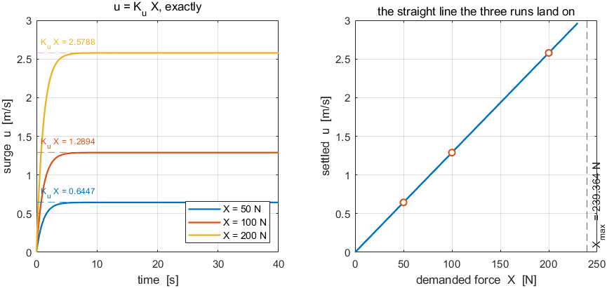
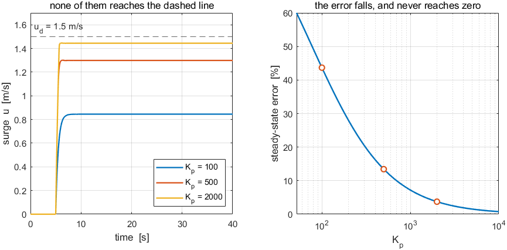
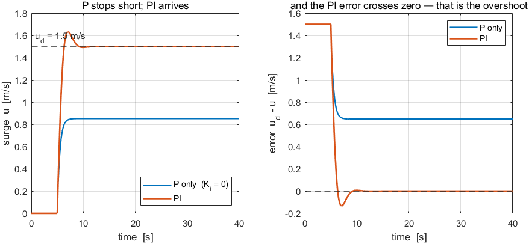

# Week 2 · Laboratory Problems — close the speed loop in Simulink

- Course: Sensor Signal Processing and Fusion · Department of Autonomous Vehicle System Engineering
- Time: **one hour**, immediately after the Week 2 lecture hour
- Three problems, in order. Each one adds one block to the previous answer.

---

## What this hour is for

Week 1 drove the hull with a command someone typed. This hour closes a loop around it, and the whole point is to see **what closing a loop can and cannot buy**.

The hull and the thrust map are provided. The thrust map is provided because turning a demanded force into two shaft speeds is Appendix A1's subject, and repeating it here would spend the hour on the wrong thing. Everything between the reference and the plant — the summing junction, the gains, the integrator — is built by hand.

Each problem ends with a **number measured in the lecture** and a **picture of the correct result**. There is no single correct diagram; the checker tests the physics.

---

## Before starting

```matlab
cd lectures/W02_simulink/problems
W02_P1_start                 % creates W02_P1.slx — hull and thrust map only
W02_check(1)                 % run this whenever, as often as needed
```

The solver is already set to fixed-step `ode4` at `h = 0.02` s. **Do not change it.**

> [!important] Two requirements on every model
> - a To Workspace block named **`xlog`**, format **`Structure With Time`**, fed by the plant's twelve-state output
> - a second one named **`Xlog`**, same format, carrying the demanded surge force that enters `X to n`
>
> Two logs and not one, because Week 2's subject is the relation between a demanded **force** and the **speed** it buys. A log of the states alone cannot show that a proportional controller has run out of force.

---

## Problem 1 · The open loop (20 minutes)

**Build.** A constant force straight into the thrust map, and two logs coming out.

```
Constant X_open  →  X to n  →  Otter USV  →  To Workspace (xlog)
```

**Predict before running.** In steady state the thrust balances linear surge damping, so

$$
u_{ss} = K_u X, \qquad K_u = \frac{1}{\lvert X_u \rvert} = 0.012894\ \text{(m/s)/N}
$$

Write down what $X = 50$, $100$ and $200$ N should give.

**Verify.** `W02_check(1)`.

| What the checker expects | |
|---|---|
| $u_{ss}$ at $X = 50$ N | $0.6447$ m/s |
| $u_{ss}$ at $X = 100$ N | $1.2894$ m/s |
| $u_{ss}$ at $X = 200$ N | $2.5788$ m/s |

**What a correct model produces**



| Reading the figure | |
|---|---|
| left | three first-order rises, each landing exactly on its own dashed $K_u X$ line. No overshoot: there is no loop yet |
| right | the same three results as points on the straight line $u = K_u X$, with the actuator ceiling marked |
| the check | if the rises overshoot, something is already fed back; if they land off the dashed lines, the thrust map is being bypassed |

**The point.** The relation is **exact**, not approximate. Surge damping in `otter.m` is linear, so the steady state is a straight line and not a curve that merely looks like one.

---

## Problem 2 · Proportional control (20 minutes)

**Build.** Add the reference, the summing junction, and one gain.

```
Step u_d  →  (+)(−)  →  Kp  →  X to n  →  Otter USV
                ↑                              ↓
                └──────────  u  ←──────────────┘
```

The feedback signal is **$u$, state 1** — not the speed over ground $\sqrt{u^2+v^2}$. With no current and no steering the two agree here, and in Week 4 they do not. A loop written against the wrong signal keeps working until exactly the moment it matters.

**Predict before running.** The final value theorem gives

$$
\frac{u_{ss}}{u_d} = \frac{K_p K_u}{1 + K_p K_u}
$$

Work out the steady error at $K_p = 100$ before touching the model.

**Verify.** `W02_check(2)`, with $u_d = 1.5$ m/s.

| $K_p$ | expected $u_{ss}$ | error |
|---|---|---|
| $100$ | $0.8448$ m/s | $44$ % |
| $500$ | $1.2986$ m/s | $13$ % |
| $2000$ | $1.4440$ m/s | $3.7$ % |

**What a correct model produces**



| Reading the figure | |
|---|---|
| left | three settled values, and **none of them touches the dashed reference** |
| right | the measured points land on the theoretical curve $K_pK_u/(1+K_pK_u)$, which approaches zero error and never arrives |
| the check | if any trace reaches $1.5$ m/s, an integrator has been added early |

**The point.** The plant has no free integrator, so the loop is **type 0**. The steady force that the damping demands can only be produced by a **non-zero error**. This is not a tuning failure and no value of $K_p$ removes it.

---

## Problem 3 · Add the integrator (20 minutes)

**Build.** One more branch: $K_i$ into a **discrete-time** integrator, summed with the proportional term.

The integrator must be discrete because the model is fixed-step. A continuous integrator inside a fixed-step loop invites a solver-order mismatch that shows up as a slow drift rather than as an error message.

**Verify.** `W02_check(3)`, with $K_p = 102$, $K_i = 192.38$.

| What the checker expects | |
|---|---|
| steady speed | $1.5000$ m/s |
| steady error | $0$, to tolerance |
| overshoot | **present** — the checker fails a response with none |

**What a correct model produces**



| Reading the figure | |
|---|---|
| left | the P trace stops short; the PI trace arrives at the dashed reference |
| right | the same runs as error. The P error settles on a non-zero value; **the PI error crosses zero and comes back** |
| the check | that crossing *is* the overshoot. A PI response with no crossing means $K_i$ is not actually in the loop |

**The point.** The integrator supplies the steady force that the damping demands, so the error no longer has to. The price is a state that keeps acting after the error has passed through zero — which is overshoot, and, when the actuator saturates, **windup**. Sections F to H of the lecture are about paying that price down.

---

## Marking

| | Weight | What is being marked |
|---|---|---|
| Problem 1 | 30 | `W02_check(1)` passes, and the three predicted speeds were written down **before** running |
| Problem 2 | 40 | `W02_check(2)` passes; the type-0 argument is stated in one sentence |
| Problem 3 | 30 | `W02_check(3)` passes; the answer to "what did the integrator cost" is stated |

A model that fails a check but whose written reasoning is right earns more than one that passes with no reasoning.

---

## If something goes wrong

| Symptom | Cause | Fix |
|---|---|---|
| `The model has no To Workspace block whose variable name is xlog` | the variable name is still `simout` | rename it |
| `xlog has 1 column` | a matrix signal reached the log | insert a Reshape set to `1-D array` |
| The speed settles at the reference in Problem 2 | an integrator is present | set $K_i = 0$; Problem 2 is proportional only |
| The response drifts slowly upward with PI | a **continuous** integrator in a fixed-step model | use Discrete-Time Integrator with sample time `h` |
| Dimension error at the thrust map | the loop is feeding the whole 12-state vector back | select state 1 first |
| Every number is slightly off | the solver was changed | fixed-step `ode4`, `h = 0.02` s |

Reference answers are in `../solutions/`. Read them **after** attempting the problem.
