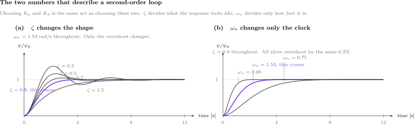
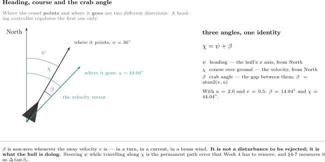
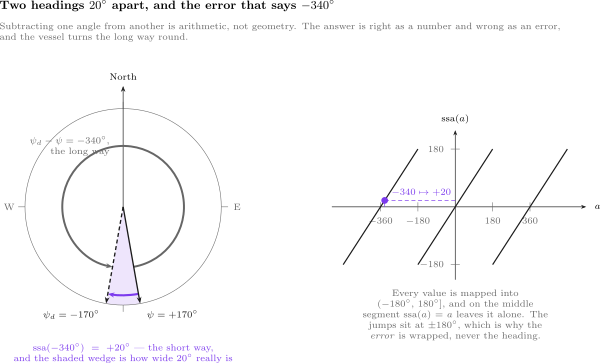
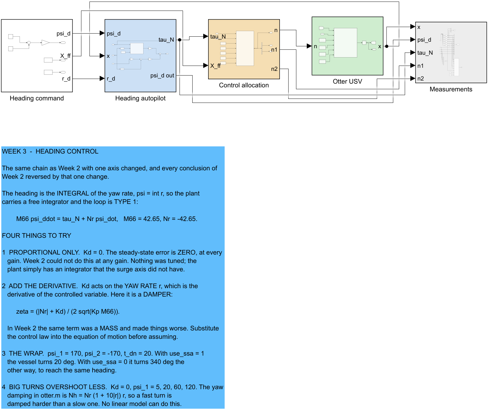
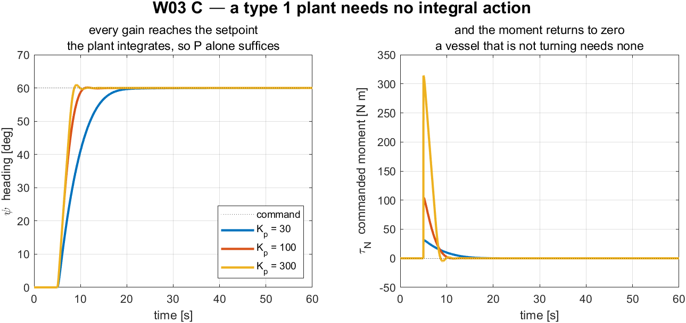
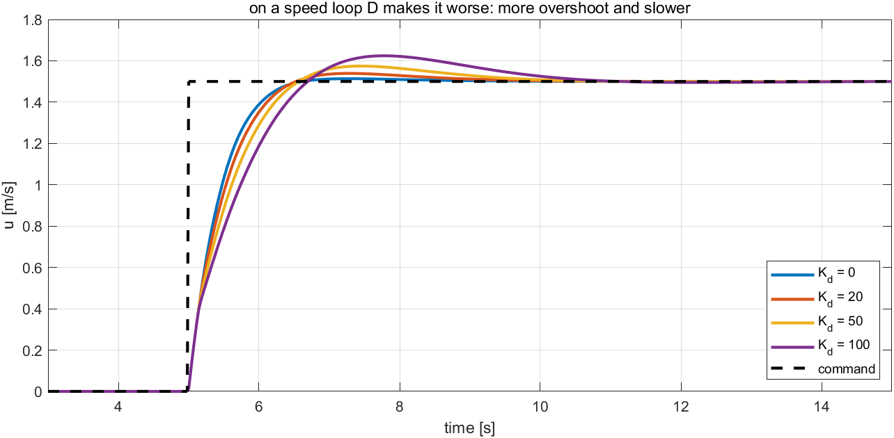
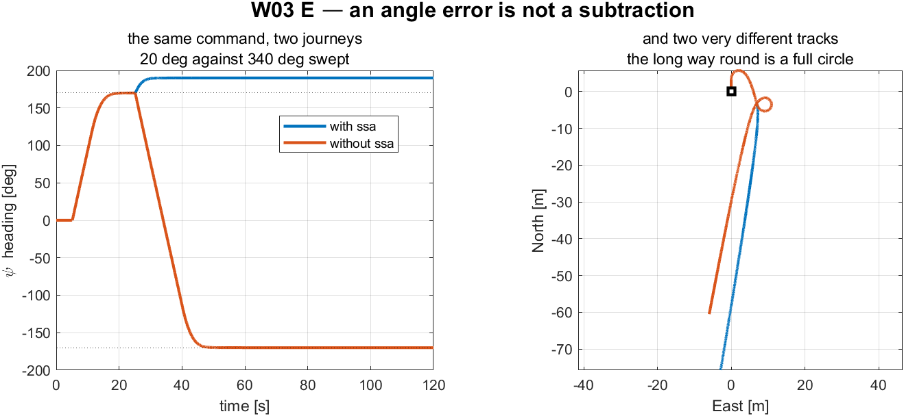
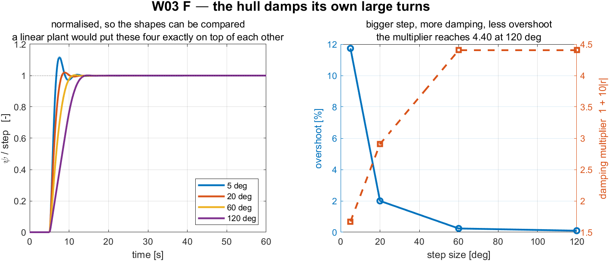

# Week 3 · Heading Control

> [!important] Reference material — read this first
> <span style="font-size:0.88em">The five courses below are **taught by the instructor of this course** and are the assumed background for it. They run from the fundamentals down to the graduate material, so start wherever the gap is. Every frame, symbol and derivation used here is developed in them at length; anyone whose prerequisites are thin should work through them first, then return.</span>
>
> | # | Course | Level | Lang. | Video | Slides and code |
> |---|---|---|---|---|---|
> | 1 | **Control Engineering** (제어공학) — the foundation: transfer functions, feedback, stability, root locus, PID | undergraduate | KO | [playlist](https://youtube.com/playlist?list=PLFaUxNRM4BvJMpF9HZS-Mp8tDv9dTdglk) | [drive](https://drive.google.com/drive/folders/1TNIPDNtS_Iy8li-olka5WJslSXDYf0aT) |
> | 2 | **Control System Design** (제어시스템설계) — design rather than analysis: specifications, loop shaping, discrete implementation | undergraduate | KO | [playlist](https://youtube.com/playlist?list=PLFaUxNRM4BvIGroZ5rgn7x08F7C79d9WZ) | [drive](https://drive.google.com/drive/folders/11m5Xxl_PHJvxgHghLSP-jhCpmRpbvoXh) |
> | 3 | **Advanced Control Engineering** (제어공학특론) — reference frames, the 6-DOF equation of motion, rotation matrices and Euler angles, linearisation and trim, vehicle control design | graduate | EN | [playlist](https://youtube.com/playlist?list=PLFaUxNRM4BvJmvF2ljx4KM5dj1P5jEcw0) | [drive](https://drive.google.com/drive/folders/1GUxbbONl916lNd0ggnFnXrNwNkd13-2-) |
> | 4 | **Sensor Signal Processing and Fusion** (센서신호처리 및 융합) — sensor models, noise, estimation and multi-sensor fusion | graduate | EN | [playlist](https://youtube.com/playlist?list=PLFaUxNRM4BvK-aP2Gdoyp5-AWvMn7Fo8E) | [drive](https://drive.google.com/drive/folders/1MEVJP7TzMcm8w6TZwUjhWJtL34WeNY3u) |
> | 5 | **Capstone Design** (캡스톤디자인) — a vehicle project carried end to end | undergraduate | KO | [playlist](https://youtube.com/playlist?list=PLFaUxNRM4BvLu7L0pDoLzDXTv8mm6rCmj) | [drive](https://drive.google.com/drive/folders/1haIQejlJfrdhtOuof-MpffR9ydVscXZS) |
>
> <span style="font-size:0.88em">**Not fluent in MATLAB or Simulink yet? Do these before Part 2.** Every laboratory in this course is Simulink, and the Onramp courses are free and take a few hours each.</span>
>
> | Tool | Where to start |
> |---|---|
> | MATLAB | [MATLAB Onramp](https://matlabacademy.mathworks.com/kr/details/matlab-onramp/gettingstarted) · [Core MATLAB Skills](https://matlabacademy.mathworks.com/details/core-matlab-skills/lpmlcms) |
> | Simulink | [Simulink Onramp](https://matlabacademy.mathworks.com/kr/details/simulink-onramp/simulink) · instructor's Simulink lectures [part 1](https://youtu.be/a-afHg_fSaU) · [part 2](https://youtu.be/070Yn0Hw5a0) |


- **Course**: USV Guidance, Navigation and Control (Graduate)
- **Department**: Autonomous Vehicle System Engineering, Chungnam National University
- **This week**: ① why proportional control alone reaches the setpoint on this axis and could not on the last ② where the derivative term goes when the controlled variable is an angle ③ the wrap at $\pm 180°$, and one line of arithmetic that fixes it

> [!important] Prerequisites from the previous week
> - The signal chain: **command → controller → allocation → plant → measurement**, each stage a subsystem.
> - The finding of §2-4: a term must be substituted into the equation of motion before its effect is assumed. This week is that lesson applied a second time, with the opposite answer.
> - From Week 1: $M_{66} = 42.65$ kg·m², $N_r = -42.65$ N·m per rad/s, and the nonlinear yaw damping $N_h = N_r(1 + 10|r|)r$.

---

## Learning Outcomes

Upon completion of this week, the learner is able to:

1. State why the heading loop is type 1 and predict, without computing, that proportional control leaves no steady-state error.
2. Choose $K_p$ and $K_d$ for a specified $\omega_n$ and $\zeta$ from the yaw equation of motion.
3. Explain why the derivative term damps this loop and did not damp the loop of Week 2, in terms of where each one lands in the equation of motion.
4. Implement the smallest-signed-angle wrap and state what a controller does without it.
5. Account for the difference between a predicted overshoot and a measured one when the hull's damping is not linear.

## Prerequisites and Setup

| Item | Requirement |
|---|---|
| MATLAB | R2024b, with Simulink |
| Toolboxes | none beyond Simulink for this week |
| MSS | `Tools/MSS`, added by the setup script |
| Course folder | `GradCourse/lectures/W03_simulink` |
| Expected duration | 60 min theory, 75 min laboratory |

---

# Part 1 · Theory

### Where this week goes

Six sections. The week is deliberately the **same question as Week 2, asked about a different axis**, and most of it is about why the answers come out opposite.

| | Question | Sections |
|---|---|---|
| 1 | **How is the yaw axis different from the surge axis?** It carries a free integrator, and that changes every steady-state answer | 3-1 |
| 2 | **What law, and where does the derivative go this time?** P–D on the yaw rate, not on the error | 3-2, 3-3 |
| 3 | **Two things that only appear on an angle.** The vessel does not travel where it points, and $+180°$ and $-180°$ are the same heading | 3-4, 3-5 |
| 4 | **Two demands into two propellers** | 3-6 |

**The structural fact the week rests on** is $\psi = \int r$. Week 2's plant had no free integrator and could not reach its setpoint at any gain; this one reaches it at every gain. Nothing was tuned to make that happen.

**The debt this week leaves unpaid** is 3-4: the crab angle means the vessel does not go where it points. Week 4 has to steer around it.

## 3-1. The yaw axis, and one structural difference

- The heading is not a velocity. It is the **integral** of one:

$$
\dot\psi = r .
$$

### Deriving the second-order heading equation

- This equation is the **third row** of the 3-DOF model of §1-7, and the derivation matters because the terms dropped here are not zero, unlike those dropped in §2-1.
- Start again from $\mathbf{M}\dot{\boldsymbol{\nu}} + \mathbf{C}(\boldsymbol{\nu})\boldsymbol{\nu} + \mathbf{D}(\boldsymbol{\nu})\boldsymbol{\nu} = \boldsymbol{\tau}$ with $\boldsymbol{\nu} = [u\ v\ r]^{\!\top}$. The yaw row is

$$
\underbrace{(m x_g - N_{\dot v})\,\dot v}_{\text{sway-yaw coupling}}
+ \underbrace{(I_z - N_{\dot r})\,\dot r}_{\textstyle =\ M_{66}\,\dot r\ \text{— this one survives}}
+ \underbrace{m x_g u r + (X_{\dot u} - Y_{\dot v})\,u v}_{\text{Coriolis}}
= N + N_r r + N_v v
$$

- The middle term is the only one that reaches the scalar plant, and it reaches it **unchanged**: its coefficient is by definition the $(6,6)$ entry of $\mathbf{M} = \mathbf{M}_{RB} + \mathbf{M}_A$. The callout below works the number through.
- Three terms stand between this and the scalar plant. Unlike §2-1, **none of them is identically zero**, and each is dropped for a stated reason:

| Term | Why it is dropped | When it bites |
|---|---|---|
| $(m x_g - N_{\dot v})\dot v$ | sway acceleration is small once the turn has settled | during the first seconds of a turn |
| $(X_{\dot u} - Y_{\dot v})\,u v$ | proportional to $uv$; $v$ is a few per cent of $u$ | at speed, in a hard turn |
| $N_v v$ | $N_v = 0$: `otter.m` applies linear damping **one axis at a time** (lines 160, 161, 165), so the damping matrix has no off-diagonal entries at all | never, for this hull — but it returns for any hull whose damping is cross-coupled |

> [!note] $N_v = 0$ is a statement about the damping *matrix*
> The three damping lines of `otter.m` are $X_h = X_u u_r$, $Y_h = Y_v v_r$ and $N_h = N_r(1 + 10\lvert r\rvert)r$: each axis is damped by its own velocity and nothing crosses between them. So $N_v$ — the yaw moment produced by a sway velocity — is absent by construction, and would remain absent even on a hull that damped sway strongly.
>
> In the release this course runs, sway happens to carry no linear damping either: line 137 is `Yv = 0`, and what resists sideways motion is the quadratic cross-flow drag of §1-12. **That second fact is release-specific** — the 2024 recalibration of `otter.m` replaced it with $Y_v = -M_{22}/T_{\text{sway}}$. $N_v = 0$ holds in both, because the reason for it is the structure of the damping and not the value of any one coefficient.

- Dropping them, writing $M_{66}$ for the $(6,6)$ entry of $\mathbf{M}$ and substituting $r = \dot\psi$ from the kinematics:

$$
\begin{aligned}
M_{66}\,\dot r &= N + N_r r \\[2pt]
M_{66}\,\ddot\psi &= \tau_N + N_r\,\dot\psi
\end{aligned}
$$

> [!warning] This reduction is an approximation, and Week 1 already measured the error
> In §2-1 the dropped terms were exactly zero and the reduction was exact. Here they are not. Week 1 measured $v = \pm 0.1264$ m/s in a turn — real sway, produced by the very Coriolis coupling dropped above. The linear model below is therefore a **design model**, and §3-5 shows where the vessel stops obeying it.

> [!important] $M_{66}$ **is** $I_z - N_{\dot r}$ — provided $I_z$ is taken about the body origin
> The substitution above is exact, not a relabelling: the coefficient of $\dot r$ in the yaw row *is* the $(6,6)$ entry of $\mathbf{M} = \mathbf{M}_{RB} + \mathbf{M}_A$. The one thing that must not be misread is **which point $I_z$ refers to**. It is the yaw inertia about the origin of $\{b\}$, not about the centre of gravity, and for this hull the two differ by $12\%$.
>
> `otter.m` builds it in four steps, and each one can be checked against the source (line numbers are those of the MSS 2021 release this course runs):
>
> | Step | `otter.m` | Value |
> |---|---|---|
> | hull alone, about CG | `Ig_CG = m*diag([R44^2, R55^2, R66^2])` | $13.7500$ kg·m² |
> | hull **and payload**, about CG | `Ig = Ig_CG - m*Smtrx(rg)^2 - mp*Smtrx(rp)^2` | $15.1021$ kg·m² |
> | shifted to CO — this is $I_z$ | `MRB = H'*MRB_CG*H`, line 109 | $16.9779$ kg·m² |
> | added mass, $-N_{\dot r}$ | `Nrdot = -1.7*Ig(3,3)`, line 103 | $25.6736$ kg·m² |
> | $M_{66} = I_z - N_{\dot r}$ | `M = MRB + MA`, line 109 | $\mathbf{42.6515}$ kg·m² |
>
> The third step is the parallel-axis theorem and nothing more: $15.1021 + m_{\text{tot}}x_g^2 = 15.1021 + 80 \times 0.153125^2 = 16.9779$ kg·m², with $x_g = 0.153$ m from §1-12. The same shift is what puts $m x_g = 12.25$ kg·m into the sway–yaw coupling term at the head of this row, so the two are one consequence, not two.
>
> Added mass contributes only through $-N_{\dot r}$ because `otter.m` builds $\mathbf{M}_A$ as a **diagonal** matrix. That is also why the Coriolis group above carries no $-Y_{\dot r}\,u r$ term: $Y_{\dot r} = 0$ for this hull, and a vessel whose added mass is not diagonal would keep it.

$$
M_{66}\,\ddot\psi = \tau_N + N_r\,\dot\psi .
$$

| Symbol | Quantity | Value / source |
|---|---|---|
| $M_{66}$ | yaw inertia including added mass | $42.65$ kg·m², `otter.m` |
| $N_r$ | linear yaw damping | $-42.65$ N·m per rad/s, $-M_{66}/T_{\text{yaw}}$ |
| $\tau_N$ | commanded yaw moment | the controller's output |

- Taking Laplace transforms:

$$
\frac{\psi(s)}{\tau_N(s)} = \frac{1}{s\left(M_{66}s + |N_r|\right)} .
$$

> [!important] There is a free $1/s$, and it changes everything
> Week 2's plant had no integrator, so the loop was **type 0** and proportional control could never reach the setpoint. This plant has one, so the loop is **type 1** and proportional control reaches the setpoint at every gain. Nothing was tuned to achieve that. It is a property of the axis.

- The reason is the same physical argument as Week 2, run backwards. Holding a steady **speed** needs a steady force, because damping never stops. Holding a steady **heading** needs no moment at all, because a vessel that is not turning has no yaw damping to overcome. A proportional controller can supply zero moment at zero error, and that is exactly what is required.

| | Week 2, surge | Week 3, heading |
|---|---|---|
| controlled variable | a velocity | an angle |
| plant | $K_u/(\tau_u s + 1)$ | $1/[s(M_{66}s + \lvert N_r\rvert)]$ |
| type | 0 | 1 |
| steady state needs | a non-zero force | no moment |
| P alone reaches the setpoint | no, at any gain | yes, at every gain |

### The same plant under its usual name: Nomoto

- The model just derived has a name. Every paper on ship steering writes it as **Nomoto's model** (Nomoto et al., 1957), and a student who does not recognise it will not recognise most of the steering literature.
- Keeping the sway–yaw coupling that §3-1 discarded and eliminating $v$ between the two rows gives a **second-order** relation between rudder angle $\delta$ and yaw rate:

$$
T_1 T_2\,\ddot r + (T_1 + T_2)\,\dot r + r = K\left(\delta + T_3\,\dot\delta\right)
$$

- The sway dynamics are fast compared with the yaw dynamics, so $T_2$ and $T_3$ nearly cancel. Dropping them leaves the **first-order Nomoto model**, which is what almost every autopilot is designed on:

$$
\boxed{\ T\,\dot r + r = K\,\delta\ },
\qquad
T = T_1 + T_2 - T_3
$$

| Symbol | Meaning |
|---|---|
| $K$ | rudder gain — how much steady yaw rate one degree of rudder buys |
| $T$ | time constant — how long the rate takes to build |
| $K/T$ | turning ability; large $K/T$ is a nimble vessel |

- The Otter has no rudder. Its yaw moment comes from the **difference between two propellers**, so $\delta$ is replaced by $\tau_N$ and the same first-order form appears directly from §3-1:

$$
M_{66}\,\dot r + |N_r|\,r = \tau_N
\qquad\Longleftrightarrow\qquad
\underbrace{\frac{M_{66}}{|N_r|}}_{T}\,\dot r + r = \underbrace{\frac{1}{|N_r|}}_{K}\,\tau_N
$$

- Putting in the two numbers from `otter.m`:

$$
T = \frac{42.6515}{42.6515} = 1.000000\ \text{s},
\qquad
K = \frac{1}{42.6515} = 0.023446\ \frac{\text{rad/s}}{\text{N}\cdot\text{m}}
$$

- Both numbers, and every other coefficient quoted in this course, are checked against the source rather than remembered:

```matlab
verify_constants
```

- That script rebuilds $\mathbf{M}$ exactly as `otter.m` lines 55–120 build it and compares all sixteen quoted values. It reports `every quoted value agrees with otter.m to its printed precision`.

> [!note] $T = 1$ s exactly, and it is not a coincidence
> `otter.m` sets the yaw damping as $N_r = -M_{66}/T_{\text{yaw}}$ with $T_{\text{yaw}} = 1$ s — the damping is *defined* from a chosen time constant rather than measured. So the Nomoto $T$ of this vessel is $1$ s by construction. Read the source before quoting a hydrodynamic coefficient as if it were a measurement.

- Adding the kinematics $\dot\psi = r$ turns the first-order Nomoto model into the type 1 plant used for the rest of this week:

$$
\frac{\psi(s)}{\tau_N(s)} = \frac{K}{s\,(Ts + 1)} = \frac{1}{s\left(M_{66}s + |N_r|\right)}
$$

- The two right-hand sides are the same expression, divided top and bottom by $|N_r|$. Nothing new has been introduced; the Nomoto form simply names the two numbers that matter.

> [!warning] Nomoto is linear, and this hull is not
> Nomoto's model has a constant $T$. Section 3-5 shows that the Otter's damping grows with $|r|$, so its effective $T$ **shrinks as the turn gets harder**. The nonlinear extension that repairs this is Norrbin's, $T\dot r + r + \alpha r^3 = K\delta$, and it is the reason a large turn overshoots less than a small one.

## 3-2. The control law

- The controller is proportional on the heading error and derivative on the **yaw rate**:

$$
\boxed{\ \tau_N = K_p\,\operatorname{ssa}\!\left(\psi_d - \psi\right) - K_d\,r\ }
$$

- Two choices are being made, and both are deliberate.

| Choice | Reason |
|---|---|
| $\operatorname{ssa}$ on the error | angles wrap; §3-5 is what happens without it |
| $-K_d r$, not $-K_d \dot e$ | $r$ is measured directly by the gyro. Differentiating the error would also differentiate every step in $\psi_d$ |

## 3-3. Where the derivative term goes this time

- Substitute the control law into the equation of motion, ignoring the wrap for a moment:

$$
\begin{aligned}
M_{66}\ddot\psi &= K_p(\psi_d - \psi) - K_d\dot\psi + N_r\dot\psi \\[4pt]
M_{66}\ddot\psi &+ \left(|N_r| + K_d\right)\dot\psi + K_p\psi = K_p\psi_d .
\end{aligned}
$$

### The closed loop, as a transfer function

- Taking Laplace transforms of the second line, with zero initial conditions:

$$
\left(M_{66}s^2 + \left(|N_r| + K_d\right)s + K_p\right)\psi(s) = K_p\,\psi_d(s) ,
$$

$$
\frac{\psi(s)}{\psi_d(s)}
= \frac{K_p}{M_{66}s^2 + \left(|N_r| + K_d\right)s + K_p}
= \frac{K_p/M_{66}}{s^2 + \dfrac{|N_r| + K_d}{M_{66}}\,s + \dfrac{K_p}{M_{66}}} .
$$

- Every second-order transfer function with a constant numerator can be written in one standard shape, and that shape has only two free numbers:

$$
\frac{\psi(s)}{\psi_d(s)} = \frac{\omega_n^2}{s^2 + 2\zeta\omega_n s + \omega_n^2} .
$$

- The two forms are the same expression, so matching them coefficient by coefficient defines $\omega_n$ and $\zeta$ rather than assuming anything:

| Coefficient of | This loop | Standard form | Gives |
|---|---|---|---|
| $s^0$ | $K_p/M_{66}$ | $\omega_n^2$ | $\omega_n = \sqrt{K_p/M_{66}}$ |
| $s^1$ | $\left(|N_r| + K_d\right)/M_{66}$ | $2\zeta\omega_n$ | $\zeta = \dfrac{|N_r| + K_d}{2\sqrt{K_p M_{66}}}$ |

- Inverting for a chosen pair:

$$
K_p = \omega_n^2 M_{66},
\qquad
K_d = 2\zeta\sqrt{K_p M_{66}} - |N_r| .
$$

- For $\omega_n = 1.53$ rad/s and $\zeta = 0.9$ this gives $K_p = 100.00$ and $K_d = 74.90$.

### This is pole placement

- The denominator $s^2 + 2\zeta\omega_n s + \omega_n^2$ is a quadratic, so it has two roots. Those roots are the **closed-loop poles**, and they are what the response is made of:

$$
s = -\zeta\omega_n \pm \mathrm{j}\,\omega_n\sqrt{1 - \zeta^2}
\qquad (\zeta < 1) .
$$

- $\omega_n$ is the distance of each pole from the origin and $\zeta$ fixes the angle. Choosing a $(\zeta, \omega_n)$ pair and choosing where to put the two poles are therefore **the same act**, described in two coordinate systems.
- Since $K_p$ and $K_d$ follow uniquely from $(\zeta, \omega_n)$, the design procedure of this section has a name: **pole placement.** Two gains, two poles, one solution — nothing is optimised and nothing is searched for.
- The real part $-\zeta\omega_n$ governs how fast the transient decays and the imaginary part $\omega_n\sqrt{1-\zeta^2}$ how fast it oscillates while decaying. The names follow directly: $\zeta$ is the **damping ratio** and $\omega_n$ the **natural frequency**.

### What the two numbers do



**Reading the figure**

| Element | Meaning |
|---|---|
| both panels | the step response of $\omega_n^2/(s^2 + 2\zeta\omega_n s + \omega_n^2)$, computed from the closed form |
| violet curve | the pair this course actually uses, $\omega_n = 1.53$ rad/s and $\zeta = 0.9$ |
| dotted line | the commanded heading, reached when the curve settles on $1$ |
| (a) | $\omega_n$ held fixed, $\zeta$ swept |
| (b) | $\zeta$ held fixed, $\omega_n$ swept |

**What the figure says**

The two numbers do completely different jobs, and the panels are arranged to show that one at a time.

In panel (a) only $\zeta$ changes. At $\zeta = 0.3$ the vessel swings $37\%$ past the commanded heading and rings for the rest of the run. Raising $\zeta$ damps that out: $16.3\%$ at $\zeta = 0.5$, $4.6\%$ at $0.7$, and $0.15\%$ at the $0.9$ this course uses. At $\zeta = 1.5$ the response no longer overshoots at all — the two poles have become real, so there is nothing left to oscillate — but it is visibly slower to arrive. **$\zeta$ buys smoothness and charges for it in speed.**

In panel (b) only $\omega_n$ changes, and the three curves are the **same curve**. All three overshoot by $0.15\%$, agreeing to within $0.001$ points. What changes is the clock: settling takes $6.28$ s at $\omega_n = 0.75$, $3.11$ s at $1.53$ and $1.61$ s at $3.0$ — inversely proportional to $\omega_n$, to within $2\%$.

So the design splits cleanly in two. **Pick $\zeta$ for the shape wanted and $\omega_n$ for the speed wanted**, and the two choices do not interfere. That independence is the reason the standard form is worth writing down at all.

> [!important] Why the textbook overshoot formula is trustworthy here and was not in Week 2
> The numerator above is $K_p$ alone — a constant, with no $s$ in it. The closed loop therefore has **no zero**, and the tabulated relation
>
> $$M_p = \exp\!\left(\frac{-\pi\zeta}{\sqrt{1-\zeta^2}}\right)$$
>
> applies exactly. `_tools/w03_second_order.m` checks this before drawing: computed against formula, the overshoots agree at every $\zeta$ in the figure — $37.23$, $16.30$, $4.60$, $0.15$ per cent.
>
> Week 2 §2-5 got $8.15\%$ where the same formula predicted $4.60\%$, because a **PI** controller puts $K_i/s$ in the forward path and that leaves a zero at $s = -K_i/K_p$ in the closed loop. The controller here is **PD**: $K_d$ contributes to the denominator only. The formula did not become more accurate; the loop became simpler.

> [!important] The same term, the opposite effect
> In Week 2 the controlled variable was a velocity, so $K_d$ multiplied an **acceleration** and landed beside the mass: $\left(M_{11} + K_d\right)\dot u$. Here the controlled variable is an angle, so $K_d$ multiplies a **rate** and lands beside the damping: $\left(|N_r| + K_d\right)\dot\psi$. Nothing about the controller changed. The axis did.

- One further remark, measurable in Part 2: **the hull already supplies damping.** At $K_p = 100$ and $K_d = 0$, $\zeta = 42.65/(2\sqrt{100 \times 42.65}) = 0.327$ — the vessel is not undamped when the controller stops damping it. Most of what steadies a heading loop on this hull is $N_r$, and $K_d$ only makes up the difference between $0.327$ and the $0.9$ asked for.

## 3-4. Heading is not course — the crab angle

- A heading controller regulates where the vessel **points**. It does not regulate where the vessel **goes**, and those are two different directions.



**Reading the figure**

| Element | Meaning |
|---|---|
| orange ray | the heading $\psi$ — the direction $x_b$ points |
| blue ray | the course $\chi$ — the direction the velocity actually goes |
| green arc | the crab angle $\beta$, the gap between them |

| Symbol | Definition | Unit |
|---|---|---|
| $\psi$ | heading, from North to $x_b$ | rad |
| $\chi$ | course over ground, from North to the velocity vector | rad |
| $\beta$ | crab angle | rad |

$$
\boxed{\ \beta = \operatorname{atan2}(v,\ u), \qquad \chi = \psi + \beta\ }
$$

- With the example of Week 1, $u = 2.0$ m/s and $v = 0.5$ m/s at $\psi = 30°$:

$$
\beta = \operatorname{atan2}(0.5,\ 2.0) = 14.04^\circ, \qquad \chi = 44.04^\circ .
$$

- And the check: $\operatorname{atan2}(\dot E, \dot N) = \operatorname{atan2}(1.4330,\ 1.4821) = 44.04°$. The course computed from the body velocity and the course computed from the NED velocity are the same number, as they must be.

> [!important] $\beta$ is not a disturbance
> The crab angle is non-zero whenever $v \neq 0$ — in a turn, in a current, in a beam wind. It is what the hull is doing, not an error to be removed. Week 1 measured $\beta = -20.3°$ in the turning run of a vessel with **no** sway actuation at all.

> [!note] Two definitions of $\beta$ are in circulation
> Fossen writes $\beta = \arcsin(v/U)$ with $U = \sqrt{u^2+v^2}$; the form used here is $\operatorname{atan2}(v,u)$. For $u > 0$ they are identical — at $u = 2.0$, $v = 0.5$ both give $14.036°$. They part company going astern: at $u = -1.0$, $v = 0.5$ the arcsin form gives $26.6°$ and `atan2` gives $153.4°$. Only the second is the direction the vessel is actually travelling, so this course uses `atan2` throughout.

- This week regulates $\psi$ and lets $\chi$ fall where it may. **Week 4 cannot**: a path-following law that steers the heading onto a track while the vessel travels along the course leaves a permanent cross-track error of the order of $\beta$ times the look-ahead distance.

## 3-5. The wrap

- Headings are angles, and angles are not numbers on a line. Commanding $-170°$ while the vessel heads $+170°$ gives

$$
\psi_d - \psi = -170° - 170° = -340° ,
$$

- which is a perfectly valid subtraction and a perfectly wrong error. The two headings are $20°$ apart.
- The **smallest signed angle** maps any angle into $(-\pi, \pi]$:

$$
\operatorname{ssa}(a) = \operatorname{atan2}\!\left(\sin a,\ \cos a\right) .
$$

- Applied to the example, $\operatorname{ssa}(-340°) = +20°$, and the vessel turns the short way.



**Reading the figure**

| Element | Meaning |
|---|---|
| left, solid arrow | the heading the vessel actually has, $\psi = +170°$ |
| left, dashed arrow | the heading commanded, $\psi_d = -170°$ |
| left, shaded wedge | the true separation of the two — $20°$, and no wider than it looks |
| left, grey arc | what the plain subtraction asks for: $340°$ to port, nearly a full circle |
| left, violet arc | what $\operatorname{ssa}$ asks for: $20°$ to starboard |
| right | $\operatorname{ssa}$ as a function. A sawtooth of period $360°$, identity on the middle segment, jumping at $\pm180°$ |

- Both arcs **end at the same place.** That is the point: the two commands are geometrically identical and operationally opposite. One turns the vessel through $340°$ of ocean, the other through $20°$.
- The wedge is drawn because a reader who is told "the headings are $20°$ apart" while looking at two arrows near due south needs to see that $20°$ is genuinely narrow. The grey arc sweeping around the whole compass is the same information told the other way.
- The right-hand panel says why the wrap must be applied to a **difference** and not to a state. $\operatorname{ssa}$ is discontinuous at $\pm180°$, and $\psi$ passes through $180°$ routinely on a mission. Wrapping $\psi$ would inject a $360°$ step into a signal that is differentiated; wrapping $\psi_d - \psi$ injects nothing, because the error is small whenever the loop is working.

> [!warning] Wrap the error, not the heading
> $\psi$ itself is left unwrapped throughout this course, exactly as `otter.m` produces it. Wrapping the state would put a $360°$ jump into a signal that is differentiated and plotted. The wrap belongs at the **one place an angle is subtracted from an angle**, which is inside the `heading error` block and nowhere else.

## 3-6. Allocation, now with two demands

- The controller asks for a yaw moment. A constant forward force $X_{\text{ff}}$ is added so that the vessel travels while it turns and the track is worth looking at. Week 2 had one demand and two propellers and split the force in half; this week there are **two** demands, and the split is no longer arbitrary.

### Where the two equations come from

- Each propeller produces a thrust $T_i$ directed **along the hull**, applied at its own pontoon. Appendix A1 §A1-3 built the general statement of this as $\boldsymbol{\tau} = \mathbf{B}\mathbf{T}$, with one column of $\mathbf{B}$ per thruster. Restricted to the two demands this week uses:

$$
\begin{bmatrix} X \\[2pt] N \end{bmatrix}
=
\underbrace{\begin{bmatrix} 1 & 1 \\[2pt] +y_{\text{pont}} & -y_{\text{pont}} \end{bmatrix}}_{\textstyle \mathbf{B}}
\begin{bmatrix} T_1 \\[2pt] T_2 \end{bmatrix},
\qquad y_{\text{pont}} = 0.395\ \text{m} .
$$

| Row | Reads | Why |
|---|---|---|
| $X = T_1 + T_2$ | both propellers push forward, so surge forces **add** | both columns of the first row are $+1$: neither thruster is tilted |
| $N = y_{\text{pont}}(T_1 - T_2)$ | a moment is force times lever arm, and the two arms point **opposite ways** | thruster 1 sits at $y = +y_{\text{pont}}$, thruster 2 at $y = -y_{\text{pont}}$ |

- Two equations, two unknowns. Solving is ordinary elimination — add the rows to remove $T_2$, subtract to remove $T_1$:

$$
X + \frac{N}{y_{\text{pont}}} = 2T_1
\qquad\Longrightarrow\qquad
T_1 = \frac{X}{2} + \frac{N}{2y_{\text{pont}}} ,
$$

$$
X - \frac{N}{y_{\text{pont}}} = 2T_2
\qquad\Longrightarrow\qquad
T_2 = \frac{X}{2} - \frac{N}{2y_{\text{pont}}} .
$$

- Equivalently, and this is the form Week 5 generalises, the result is the matrix inverse:

$$
\begin{bmatrix} T_1 \\[2pt] T_2 \end{bmatrix}
= \mathbf{B}^{-1}\begin{bmatrix} X \\[2pt] N \end{bmatrix}
= \frac{1}{2}\begin{bmatrix} 1 & +1/y_{\text{pont}} \\[2pt] 1 & -1/y_{\text{pont}} \end{bmatrix}
\begin{bmatrix} X \\[2pt] N \end{bmatrix} .
$$

- **Reading the answer.** Each propeller receives half the requested surge force plus or minus half the requested moment divided by the lever arm. The surge demand is shared equally; the yaw demand is shared *antisymmetrically*. Setting $N = 0$ recovers Week 2's even split, so nothing that worked last week has been changed.

> [!note] Two checks worth doing on any allocation
> **Dimensions.** $N/y_{\text{pont}}$ is N·m divided by m, which is newtons, so it may be added to $X/2$. Had the lever arm been left out, the two terms would not have been addable — the dimension check catches that immediately.
>
> **Limits.** $y_{\text{pont}} \to 0$ sends $T_1, T_2 \to \pm\infty$ for any $N \neq 0$: two propellers on the centreline cannot produce a yaw moment at all, and the algebra says so by diverging. Physically that is $\det\mathbf{B} = -2y_{\text{pont}} \to 0$.

- The map is **square** in the $(X, N)$ plane and $\det\mathbf{B} = -2y_{\text{pont}} = -0.79 \neq 0$, so the inverse exists and is unique. Nothing is optimised and nothing is chosen — there is exactly one thrust pair for each demand pair. Week 5 meets the case where there are more thrusters than demands, $\mathbf{B}$ is no longer square, and a choice genuinely has to be made.
- Each thrust is then converted to a shaft speed by inverting the propeller curve one propeller at a time, $n = \operatorname{sign}(T)\sqrt{|T|/k}$, and saturated.

> [!tip] Allocating thrust rather than shaft speed pays a dividend
> Appendix A1 derived, by hand, that a pure turn needs $n_2 = -n_1\sqrt{k_{\text{pos}}/k_{\text{neg}}}$ rather than $-n_1$. This allocation produces that pair **by itself**: a pure yaw moment gives $T_2 = -T_1$, and because $k_{\text{neg}} < k_{\text{pos}}$ the reverse shaft comes out faster. Doing the arithmetic in the right units removes a whole class of error.

---

# Part 2 · Laboratory

## A. Setting up (10 min)

```matlab
cd GradCourse/lectures/W03_simulink
W03_0_setup
```

Expected output:

```
  W03 setup complete
    plant           M66 = 42.65 kg m^2,  Nr = -42.65
    controller      Kp = 100, Kd = 74.9, ssa = 1
    closed loop     wn = 1.5312 rad/s,  zeta = 0.9000
    hull alone      zeta = 0.3265  (Kd = 0)
    reference       60 -> 60 deg at t = 5 s
    forward force   60 N
    simulation      40 s at h = 0.02 s
```

- `W03_0_setup.m` is **the only file to edit this week**. To restore a broken model: `W03_1_build_heading`.

**The files of this week, in the order the sections use them**

| Order | File | Section | What it produces |
|---|---|---|---|
| 0 | `W03_0_setup.m` | A | the base workspace, so the model can be run from Simulink |
| 1 | `W03_1_build_heading.m` | B | `W03_heading_control.slx` and `img/W03_heading_control.png` |
| C | `W03_C_proportional_only.m` | C | `img/W03_result_P.png` |
| D | `W03_D_derivative_action.m` | D | `img/W03_result_D.png` |
| E | `W03_E_the_wrap.m` | E | `img/W03_result_ssa.png` |
| F | `W03_F_big_turns_overshoot_less.m` | F | `img/W03_result_size.png` |

- Each laboratory section is one script. Running a section leaves exactly the numbers and the one figure that section discusses, so a class can work through the week a page at a time.
- Sections C to F build the model themselves if it is missing, so any one of them can be run first.
- The remaining files — `W03_vars.m`, `W03_read.m`, `W03_plot.m`, `W03_animate.m` — are called **by** the scripts above and by the model. They are never run by hand.
- The laboratory of the second hour lives in `W03_simulink/problems/` and `solutions/`, and is separate from these.

## B. Reading the model (10 min)

> [!note] To produce this figure
> `W03_1_build_heading` writes `W03_simulink/img/W03_heading_control.png` at the end of the build. The diagram belongs to the builder and to nothing else, so it changes when the model changes and not when a gain changes.



**Reading the figure**

| Element | Meaning |
|---|---|
| `Heading command` (white) | two steps in degrees, converted to radians once; and the constant forward force |
| `Heading autopilot` (blue) | selectors for $\psi$ and $r$, the wrapped error, and $K_p$, $K_d$ |
| `Control allocation` (sand) | $(\tau_N, X_{\text{ff}}) \to$ two shaft speeds, by the inverse of §3-6 |
| `Otter USV` (green) | `otter.m`, called unchanged |
| `Measurements` (grey) | selectors, scope, workspace log and live view |

- The chain is the same one as Week 2 with the controller replaced. **One signal travels backwards**: the state $\mathbf{x}$, from which the autopilot selects $\psi$ and $r$.
- Angles are in **degrees at the command and in the plots, and in radians everywhere between**. The single `deg2rad` gain inside `Heading command` is the boundary, and it is the only place a conversion happens on the way in.

## C. Proportional only (15 min)

```matlab
W03_C_proportional_only
```

> [!note] To produce this figure
> `W03_C_proportional_only.m` runs `W03_heading_control.slx` three times with `Kd = 0`, prints the table below, and writes `img/W03_result_P.png`.

$K_d = 0$, step to $60°$:

| $K_p$ | $\omega_n$ | $\zeta$ | steady error [deg] | overshoot [%] | $t_s$ (2%) [s] | peak $\lvert\tau_N\rvert$ [N·m] |
|---|---|---|---|---|---|---|
| 30 | $0.8387$ | $0.5962$ | $7.9\times10^{-3}$ | $-0.01$ | $12.24$ | $31.4$ |
| 100 | $1.5312$ | $0.3265$ | $1.8\times10^{-3}$ | $0.24$ | $5.06$ | $104.7$ |
| 300 | $2.6522$ | $0.1885$ | $5.7\times10^{-4}$ | $1.53$ | $3.46$ | $314.2$ |



**Reading the figure**

| Element | Meaning |
|---|---|
| left panel | three step responses; all three arrive at the dashed setpoint |
| right panel | the commanded yaw moment $\tau_N$, which returns to zero in every run |

- The steady-state error is **zero at every gain**, to the tolerance of the solver. Week 2's table at the same place read $43.68$, $13.43$ and $3.73$ per cent.
- The difference between the two weeks is one structural fact about the axis. No better controller was written.

**What the figure says**

The left panel is what the vessel did. The right panel is what the controller had to ask for to make it do that. Reading them together is what separates this week from the last.

Look at the left panel first. All three headings reach $60°$ and stay there — **with no integral term anywhere in the controller.** Week 2 needed one and still had to work for it. Here a plain proportional gain lands exactly on the setpoint, and it does so at $K_p = 30$, $100$ and $300$ alike.

The reason is in the plant, not the controller. Heading is the integral of yaw rate, $\psi = \int r$, so the vessel *already contains* an integrator. The loop is type 1, and a type 1 loop has zero steady-state error to a step at any finite gain. **Nothing was tuned to achieve this.**

The right panel is where that becomes visible rather than merely asserted. In steady state the demanded moment $\tau_N$ returns to **zero** in all three runs. A vessel that has stopped turning needs no moment to hold its heading, so the controller can sit exactly on its setpoint while asking for nothing at all. Week 2 could never do that: holding a speed needs a permanent force, a permanent force needs a non-zero error, and so the error never vanished.

What raising $K_p$ does buy is speed, and it is paid for in actuator demand. From $K_p = 30$ to $300$ the settling time falls from $12.24$ to $3.46$ s while the peak moment rises from $31.4$ to $314.2$ N·m — a factor of exactly ten, because at the instant of the step $\tau_N = K_p\psi_d$ and nothing else has happened yet. Overshoot grows too, from $-0.01\%$ to $1.53\%$, but stays small because the hull's own damping is doing most of the work.

So the bargain is different from Week 2's. There, gain bought accuracy the loop could not otherwise have. Here accuracy is free and gain buys only speed, until the actuator runs out. Section D adds the term that lets $K_p$ rise further without the response starting to ring.

## D. Derivative action (20 min)

```matlab
W03_D_derivative_action
```

> [!note] To produce this figure
> `W03_D_derivative_action.m` runs `W03_heading_control.slx` four times with `Kp` held and `Kd` swept, prints the table below, and writes `img/W03_result_D.png`.

$K_p = 100$ held, and a deliberately **small** step of $5°$:

| $K_d$ | $\zeta$ | predicted $M_p$ [%] | measured $M_p$ [%] | $t_s$ (2%) [s] |
|---|---|---|---|---|
| 0 | $0.3265$ | $33.78$ | $11.74$ | $5.40$ |
| 25 | $0.5179$ | $14.92$ | $4.10$ | $3.88$ |
| 74.90 | $0.9000$ | $0.15$ | $-0.02$ | $4.14$ |
| 150 | $1.4750$ | $0.00$ | $-0.02$ | $7.52$ |



**Reading the figure**

| Element | Meaning |
|---|---|
| left panel | four step responses; overshoot falls monotonically with $K_d$ |
| right panel, dashed | overshoot predicted from $\zeta$ by the second-order formula |
| right panel, solid | overshoot actually measured, for the same four gains |

- The **trend** is exactly as predicted: more $K_d$, more damping, less overshoot. Compare Week 2's table, where more $K_d$ meant *more* overshoot.
- The **magnitudes** are not. The measured overshoot is roughly a third of the predicted one at $K_d = 0$. Section F explains why, and the explanation is not a modelling error.

**What the figure says**

The left panel is the same $5°$ command answered by four controllers that differ in one number. The right panel puts the design formula beside the simulation, so it is visible where the paper agrees with the vessel and where it does not.

Derivative action works here. Overshoot falls from $11.74\%$ at $K_d = 0$ to nothing at $K_d = 74.9$ — the exact opposite of Week 2, where the same term made the same kind of controller worse.

The reason is one line of algebra. Substituting the control law into the equation of motion gives

$$M_{66}\ddot\psi + \left(\lvert N_r\rvert + K_d\right)\dot\psi + K_p\psi = K_p\psi_d ,$$

and $K_d$ lands **beside the damping**. In Week 2 the controlled variable was a velocity, so its derivative was an acceleration, and the identical term landed beside the *mass* instead. **The term did not change; the axis did.**

More $K_d$ is not simply better, though. At $K_d = 150$ the response also overshoots nothing but takes $7.52$ s to settle rather than $4.14$. The quickest gain in the table is $K_d = 25$, which still overshoots $4.1\%$. The smoothest gain and the fastest gain are not the same gain, and the design has to say which one it wants.

The right panel carries a second lesson. The two curves agree at the right-hand end and separate at the left. The prediction is linear, computed from $N_r$ alone, but the hull's real damping is $N_h = N_r(1 + 10\lvert r\rvert)r$ and grows whenever the vessel turns quickly. At $K_d = 0$ the motion is quickest, the extra damping is largest, and the true overshoot comes out a third of what was predicted. As $K_d$ rises the motion slows, $\lvert r\rvert$ falls, and the linear prediction becomes correct.

That is why the step here is only $5°$. Section F holds the gains fixed and varies the step size instead, which turns this same nonlinearity from a nuisance into the subject.

> [!note] Why the step is only 5 degrees here
> The design equations of §3-3 use $N_r$ alone. The hull's actual damping is $N_h = N_r(1 + 10|r|)r$, which is larger whenever the vessel is turning quickly. A small step keeps $|r|$ small and the linear prediction close. Section F makes the same nonlinearity the subject rather than a nuisance.

## E. The wrap (15 min)

```matlab
W03_E_the_wrap
```

> [!note] To produce this figure
> `W03_E_the_wrap.m` runs `W03_heading_control.slx` twice — once with `use_ssa = 1`, once with `use_ssa = 0` — prints the table below, and writes `img/W03_result_ssa.png`.

The vessel is commanded to $+170°$, allowed to settle, and then commanded to $-170°$ — a change of $20°$.

| `use_ssa` | peak $\lvert r\rvert$ [deg/s] | total turn [deg] | settled $\psi$ [deg] |
|---|---|---|---|
| 1 | $8.375$ | $20.0$ | $190.00$ |
| 0 | $19.640$ | $340.0$ | $-170.00$ |



**Reading the figure**

| Element | Meaning |
|---|---|
| left panel | the heading over time; the two dotted lines are $+170°$ and $-170°$ |
| left panel, blue | with `ssa` — the heading rises through $170°$ and stops at $190°$ |
| left panel, orange | without `ssa` — the heading falls all the way to $-170°$ |
| right panel | the two tracks over the ground, from the same start marker |

- Both vessels end pointing the same way. One turned $20°$ and the other turned $340°$ the other way.
- The settled headings read $190°$ and $-170°$ because $\psi$ is never wrapped in this course. They are the same heading, expressed differently, which is precisely the point.

**What the figure says**

Two runs of one model with a single flag changed. The left panel is what each vessel believed it had to do; the right panel is what that cost in the water.

For the first $25$ s the two are the same run. Both reach $+170°$ and hold it. Then the second command arrives and they part completely: the blue heading climbs $20°$ and stops, while the orange one falls $340°$ — through zero, past south, all the way round to $-170°$. Peak yaw rate more than doubles, $8.375$ to $19.640$ deg/s. On the right, the blue track is a gentle bend and the orange one **closes a full circle**, ending 60 m away and pointing exactly the same direction as the vessel that never left the line.

One subtraction caused all of it. Commanding $-170°$ while heading $+170°$ gives

$$\psi_d - \psi = -170° - 170° = -340° ,$$

which is a perfectly valid number and a perfectly wrong error — the two headings are only $20°$ apart. Wrapping it with $\operatorname{ssa}(a) = \operatorname{atan2}(\sin a, \cos a)$ returns $+20°$ and the vessel turns the short way. **The controller is identical in both runs. Only the arithmetic that forms its input differs.**

Note what is *not* wrong here. Neither loop is unstable, neither is mistuned, and both reach the commanded heading. The orange one simply reaches it the long way round, and no adjustment to $K_p$ or $K_d$ would have prevented that.

This is also why the fault is dangerous. Away from the $\pm180°$ boundary the two runs are indistinguishable, so the bug passes every test that does not happen to cross it — and a real mission crosses it routinely.

> [!important] One line of arithmetic separates the two runs
> The only difference is `e = atan2(sin(e), cos(e))`. It costs nothing, it is one line, and without it a heading controller is wrong near a boundary it will certainly cross during a mission.

## F. Big turns overshoot less (15 min)

```matlab
W03_F_big_turns_overshoot_less
```

> [!note] To produce this figure
> `W03_F_big_turns_overshoot_less.m` runs `W03_heading_control.slx` four times with the gains held and the step size swept, prints the table below, and writes `img/W03_result_size.png`.

$K_p = 100$, $K_d = 0$, four step sizes:

| step [deg] | peak $\lvert r\rvert$ [deg/s] | overshoot [%] | $t_s$ (2%) [s] |
|---|---|---|---|
| 5 | $3.840$ | $11.74$ | $5.40$ |
| 20 | $10.926$ | $2.00$ | $3.90$ |
| 60 | $19.505$ | $0.24$ | $5.06$ |
| 120 | $19.505$ | $0.10$ | $7.86$ |



**Reading the figure**

| Element | Meaning |
|---|---|
| left panel | the same steps normalised to $100\%$; a linear system would superimpose exactly |
| right panel, left axis | the measured overshoot, falling with step size |
| right panel, right axis | the damping multiplier $1 + 10\lvert r\rvert$ at the peak rate of each run |

**What the figure says**

A **larger** step overshoots **less**. The $5°$ command overshoots $11.74\%$ and the $120°$ command overshoots $0.10\%$, from a controller that was never retuned between the runs.

That is not something a linear system can do. The left panel is the proof: the four responses are divided by their own step size, so a linear plant would have to give one curve. These four are visibly different. **Superposition fails, and that is the definition of a nonlinear plant.**

The mechanism is the yaw damping in `otter.m`, which grows with how fast the vessel is already turning:

$$N_h = N_r\left(1 + 10|r|\right)r .$$

So a big turn damps itself. At the peak rate of the $120°$ step, $19.505$ deg/s $= 0.3404$ rad/s, the multiplier $1 + 10\lvert r\rvert$ reaches $4.40$ — against $1.67$ for the small step. In the right panel the overshoot curve and the damping curve are mirror images of each other, which is exactly the claim being made.

The $60°$ and $120°$ runs share the same peak rate because both saturate the propellers; beyond a certain command the vessel simply turns as fast as it can.

The practical consequence is worth stating plainly. The design equations of §3-3 use $N_r$ alone, so they are a **small-signal** result: right for small corrections, and for large ones **conservative rather than optimistic**. A design that predicts $11.7\%$ overshoot and delivers $0.1\%$ has erred in the safe direction, which is the only direction worth erring in.

---

# Summary

## Week Summary

| Step | What was done | How it was verified |
|---|---|---|
| 1 | Identified the heading loop as type 1 | steady-state error $\le 8\times10^{-3}$ deg at $K_p = 30$, $100$, $300$ |
| 2 | Derived $\omega_n$ and $\zeta$ from the yaw equation | $K_p = 100$, $K_d = 74.90$ gives the requested $\zeta = 0.900$ |
| 3 | Showed $K_d$ damping this axis | overshoot $11.74 \to 4.10 \to -0.02$ per cent as $K_d$ rises, the reverse of Week 2 |
| 4 | Implemented and removed the wrap | $20°$ of turn against $340°$, for the same commanded heading |
| 5 | Measured the nonlinear yaw damping | overshoot $11.74 \to 0.10$ per cent as the step grows; damping multiplier $1.67 \to 4.40$ |

## Progress Check

### Theory

- [ ] Able to state why the heading loop is type 1 without computing anything
- [ ] Able to obtain $K_p$ and $K_d$ from a required $\omega_n$ and $\zeta$
- [ ] Able to explain, from the equation of motion, why $K_d$ damps here and did not in Week 2
- [ ] Able to write $\operatorname{ssa}$ and say where in the model it belongs

### Laboratory

- [ ] `W03_0_setup` printed $\zeta = 0.9000$ and $\omega_n = 1.5312$
- [ ] Sections C, D, E and F were run in that order and together wrote four result PNG files into `W03_simulink/img/`
- [ ] The `use_ssa = 0` run was watched in the live view to the end

### Recorded observations

- [ ] The steady-state error at three gains, with the averaging window stated
- [ ] Predicted and measured overshoot for all four $K_d$, and the size of the gap
- [ ] Total turn with and without the wrap
- [ ] Peak $\lvert r\rvert$ for each step size, and the damping multiplier it implies

---

## In-class laboratory — build the heading autopilot by hand

The second hour of the Week 3 session is spent building, in Simulink, the loop this lecture built from a script.

```matlab
cd lectures/W03_simulink/problems
W03_P1_start                 % creates W03_P1.slx — hull and allocation only
W03_check(1)                 % run this whenever, as often as needed
```

| | Problem | Time | The number it must reproduce |
|---|---|---|---|
| 1 | Proportional only — and the error that is **already** zero | 20 min | steady error $0$ at $K_p = 30$, $100$, $300$; overshoot $0.24$ %, $1.53$ % |
| 2 | Derivative action — feed back $r$, not $\mathrm{d}e/\mathrm{d}t$ | 20 min | overshoot $11.74 \to 4.10 \to 0$ % as $K_d = 0 \to 25 \to 74.9$ |
| 3 | The wrap — $170° \to -170°$ with `ssa` and without | 20 min | $+20°$ against $-340°$ |

- The full problem sheet is [`W03_simulink/problems/README.md`](W03_simulink/problems/README.md), and reference answers are in [`W03_simulink/solutions/`](W03_simulink/solutions/README.md).
- The problem sheet carries **the result graphs a correct model produces**, so a plot can be compared against a plot and not only against a number.
- Problem 1 is deliberately the same question Week 2 asked and got the opposite answer to. The difference is $\psi = \int r$, and nothing else.

---

## Assignment 3

- **Due**: before the Week 4 session
- **Submit**: the modified `W03_0_setup.m`, a derivation, the numbers requested below, and one figure

### ① Requirements

1. Derive $\omega_n$ and $\zeta$ for the heading loop from the yaw equation of motion, showing each step. Then determine, by hand, the pair $(K_p, K_d)$ that gives $\omega_n = 1.0$ rad/s and $\zeta = 0.7$.
2. Determine the largest $K_p$ for which the hull's own damping alone, with $K_d = 0$, still gives $\zeta \ge 0.5$.
3. Determine, by hand, the yaw moment $\tau_N$ demanded at the instant a $90°$ step is applied with the design of ①.1, and state whether it lies inside the attainable set $|N| \le 73.62$ N·m of Appendix A1.

### ② Verification — mandatory

> [!important] A claim is not a result. Numbers are required, with the tolerance band and the averaging window stated

1. Run the design of ①.1 with a $5°$ step and report the measured overshoot and $2\%$ settling time. Compare with the prediction and state the gap.
2. Repeat ②.1 with a $90°$ step. Report both, and explain the difference using $1 + 10|r|$ at the measured peak rate.
3. Run the design of ①.2 and report the measured overshoot. State whether the hull alone was enough.
4. Command $+179°$, let it settle, then command $-179°$. Report the total turn with `use_ssa = 1` and with `use_ssa = 0`, and the time each takes to settle. Produce **one figure** of heading against time for both.

### ③ Analysis (6–10 lines)

- Item ②.2 shows a prediction that is wrong in a specific direction. State the direction, explain it from $N_h = N_r(1 + 10|r|)r$, and say whether a controller designed with the small-signal equations is therefore **safe** or **unsafe** for large steps. Then state one situation in which the same nonlinearity would be a problem rather than a help.

### Grading

| Criterion | Weight |
|---|---|
| Derivation in ① is complete and correct | 20% |
| **Verification performed and numbers reported with bands and windows stated** | 40% |
| The figure in ②.4 is correct and readable | 15% |
| Analysis in ③ identifies the direction of the error and its consequence | 25% |

---

## Troubleshooting

| Symptom | Cause | Fix |
|---|---|---|
| The vessel turns almost all the way round for a small heading change | `use_ssa = 0` | set `use_ssa = 1`; see §3-5 |
| The heading plot passes $360°$ and keeps rising | $\psi$ is not wrapped, by design | expected. Only the error is wrapped |
| The measured overshoot is far below the prediction | the step is large enough for $N_h = N_r(1+10\lvert r\rvert)r$ to matter | expected; see §F. Use a small step to test a linear design |
| Adding $K_d$ makes the response slower but not less damped | $K_d$ is already past critical, $\zeta > 1$ | reduce $K_d$; $\zeta = 1$ is at $K_d = 87.96$ for $K_p = 100$ |
| Peak yaw rate is the same for two different step sizes | the propellers are saturating | expected; the vessel turns as fast as it can |
| The vessel drifts sideways while turning | the crab angle of Week 1 | expected, and the subject of Week 4 |

---

## References

### Primary

- Fossen, T. I. *Handbook of Marine Craft Hydrodynamics and Motion Control*, 2nd ed. §12.2.7 (PID heading autopilot) and §15.3 (course and heading autopilots).
- MSS toolbox, `Tools/MSS/GNC/ssa.m` — the wrap used throughout MSS.
- MSS toolbox, `Tools/MSS/SIMULINK/mssSimulinkDemos/demoOtterUSVHeadingControl.slx` — the demonstration whose layout every model in this course follows.

### Course files

- `W03_simulink/W03_1_build_heading.m` — the model generator
- `W03_simulink/W03_0_setup.m` — the parameters, including the design equations
- `W03_simulink/W03_C_proportional_only.m` · `W03_D_derivative_action.m` · `W03_E_the_wrap.m` · `W03_F_big_turns_overshoot_less.m` — one script per laboratory section
- `W03_simulink/W03_vars.m` · `W03_read.m` — the same numbers as a struct, and the log with the angles in degrees
- `W03_simulink/W03_plot.m` — the summary figure, called by both the runner and the model's `StopFcn`
- `_tools/gnc_chain.m`, `_tools/add_subsys.m`, `_tools/add_measurement.m` — the standard layout

---

## Next Week

- **Week 4 — Waypoint Following and LOS Guidance**
- This week was told what heading to hold; a human typed the number into a step block. Week 4 asks where that number comes from, and the answer is a list of waypoints and a guidance law.
- The cross-track and along-track errors from one rotation, the line-of-sight law, and the two laws — integral and adaptive — that survive an ocean current.
- Preparation: §3-4 of this week, on the crab angle. Week 4 opens by quantifying exactly what it costs.
