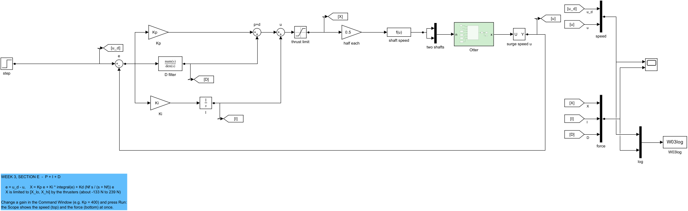
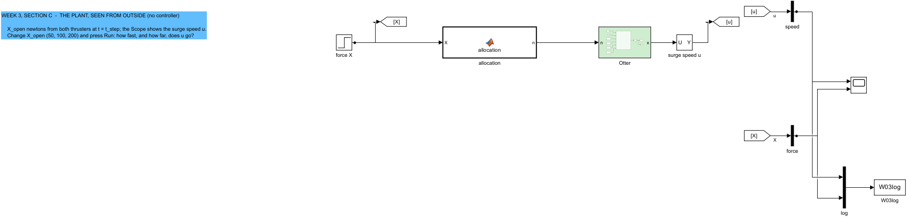
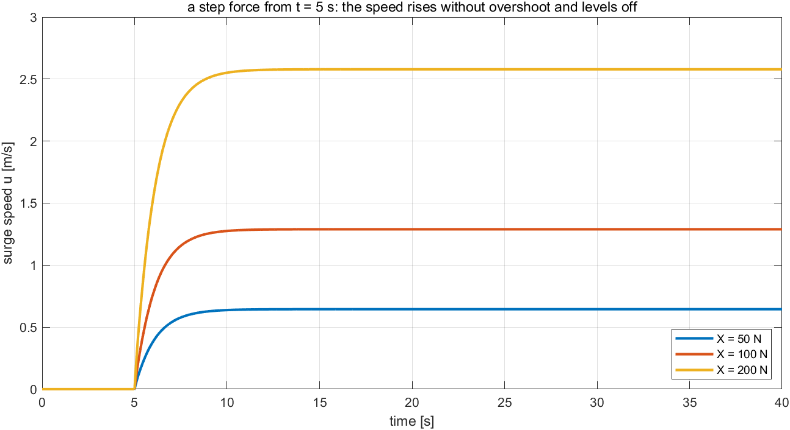
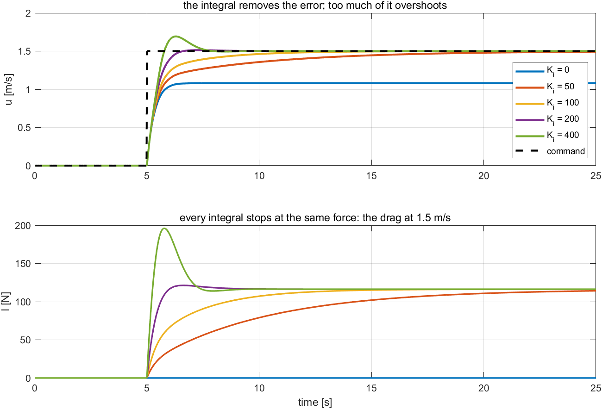
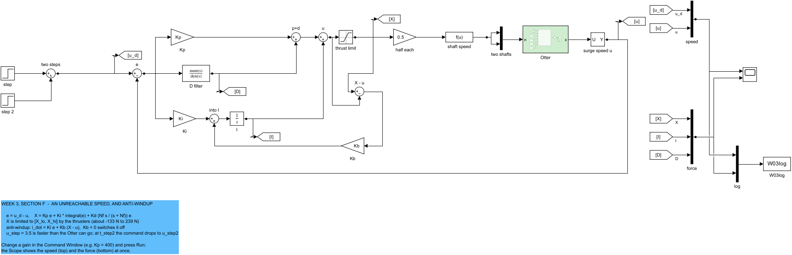
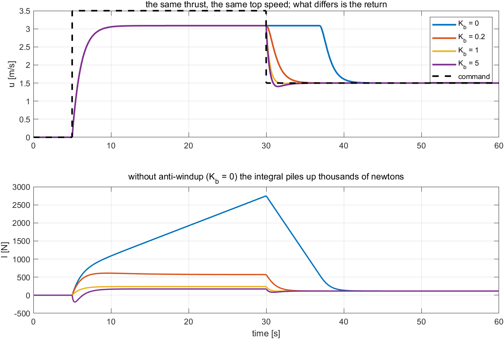
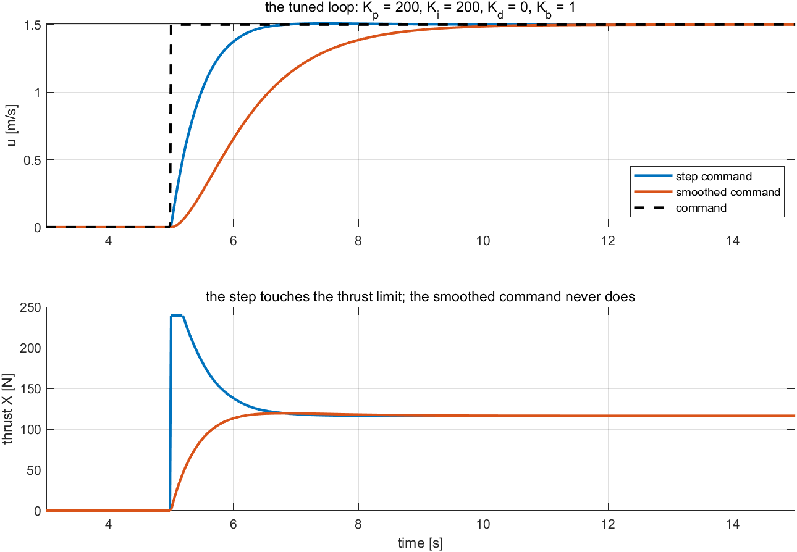

# Week 3 · Surge Speed Control

> [!important] Reference material — read this first
> <span style="font-size:0.88em">The five courses below are **taught by the instructor of this course** and are the assumed background for it. They run from the fundamentals down to the graduate material, so start wherever the gap is. Every frame, symbol and derivation used here is developed in them at length; anyone whose prerequisites are thin should work through them first, then return.</span>
>
> | # | Course | Level | Lang. | Video | Slides and code |
> |---|---|---|---|---|---|
> | 1 | **Control Engineering** (제어공학) — the foundation: transfer functions, feedback, stability, root locus, PID | undergraduate | KO | [playlist](https://youtube.com/playlist?list=PLFaUxNRM4BvJMpF9HZS-Mp8tDv9dTdglk) | [drive](https://drive.google.com/drive/folders/1TNIPDNtS_Iy8li-olka5WJslSXDYf0aT) |
> | 2 | **Control System Design** (제어시스템설계) — design rather than analysis: specifications, loop shaping, discrete implementation | undergraduate | KO | [playlist](https://youtube.com/playlist?list=PLFaUxNRM4BvIGroZ5rgn7x08F7C79d9WZ) | [drive](https://drive.google.com/drive/folders/11m5Xxl_PHJvxgHghLSP-jhCpmRpbvoXh) |
> | 3 | **Advanced Control Engineering** (제어공학특론) — reference frames, the 6-DOF equation of motion, rotation matrices and Euler angles, linearisation and trim, vehicle control design | graduate | EN | [playlist](https://youtube.com/playlist?list=PLFaUxNRM4BvJmvF2ljx4KM5dj1P5jEcw0) | [drive](https://drive.google.com/drive/folders/1GUxbbONl916lNd0ggnFnXrNwNkd13-2-) |
> | 4 | **Sensor Signal Processing and Fusion** (센서신호처리 및 융합) — sensor models, noise, estimation and multi-sensor fusion | graduate | EN | [playlist](https://youtube.com/playlist?list=PLFaUxNRM4BvK-aP2Gdoyp5-AWvMn7Fo8E) | [drive](https://drive.google.com/drive/folders/1MEVJP7TzMcm8w6TZwUjhWJtL34WeNY3u) |
> | 5 | **Capstone Design** (캡스톤디자인) — a vehicle project carried end to end | undergraduate | KO | [playlist](https://youtube.com/playlist?list=PLFaUxNRM4BvLu7L0pDoLzDXTv8mm6rCmj) | [drive](https://drive.google.com/drive/folders/1haIQejlJfrdhtOuof-MpffR9ydVscXZS) |
>
> <span style="font-size:0.88em">**Not fluent in MATLAB or Simulink yet? Do these before Part 2.** Every laboratory in this course is Simulink, and the Onramp courses are free and take a few hours each.</span>
>
> | Tool | Where to start |
> |---|---|
> | MATLAB | [MATLAB Onramp](https://matlabacademy.mathworks.com/kr/details/matlab-onramp/gettingstarted) · [Core MATLAB Skills](https://matlabacademy.mathworks.com/details/core-matlab-skills/lpmlcms) |
> | Simulink | [Simulink Onramp](https://matlabacademy.mathworks.com/kr/details/simulink-onramp/simulink) · instructor's Simulink lectures [part 1](https://youtu.be/a-afHg_fSaU) · [part 2](https://youtu.be/070Yn0Hw5a0) |


> [!tip] Getting the course files, and keeping them current (Windows)
> <span style="font-size:0.88em">The notes, models and scripts are kept in one Git repository that is updated through the semester. Clone it once; before every class, pull. A pull downloads only what has changed since the last one.</span>
>
> | When | Where to run it | Command |
> |---|---|---|
> | once | PowerShell — installs Git for Windows | `winget install --id Git.Git -e` |
> | once | the folder that will hold the course, e.g. `Documents` | `git clone https://github.com/wkyouncnu/Sensor-Signal-Processing-and-Fusion.git` |
> | before every class | inside the cloned folder `Sensor-Signal-Processing-and-Fusion` | `git pull` |
>
> - `git pull` prints `Already up to date.` when nothing has changed, and otherwise lists the files it updated.
> - The repository is private. When Git asks, sign in with the GitHub account the instructor has given access.
> - Experiment on copies, not on the cloned files: copy a week's `WXX_simulink` folder elsewhere first, and a pull can never collide with local edits. If it already has, `git stash`, then `git pull`, then `git stash pop` sets the edits aside, updates, and puts them back.
> - The MSS toolbox is not part of the repository. The weeks that simulate the Otter need it at `Tools\MSS` inside the cloned folder.

- **Course**: USV Guidance, Navigation and Control (Graduate)
- **Department**: Autonomous Vehicle System Engineering, Chungnam National University
- **This week**: ① the Week 2 controller around the Otter's surge speed, with no model of the vessel ② P, I and D read off the Scope, one at a time ③ an unreachable speed and anti-windup ④ the tuning order of Week 2, followed step by step on the vessel

> [!important] Prerequisites from the previous week
> - From Week 2: the five time-domain metrics (§2-4), what P, I and D each do (§2-6 to §2-8), the filtered derivative, back-calculation anti-windup (§2-11) and the tuning order (§2-12). This week uses all of them unchanged.
> - From Week 1: the Otter model and the propeller curve $T = k\,n\lvert n\rvert$: a shaft speed produces a thrust.
> - Nothing else. This week deliberately tunes **without a model of the plant**: every gain is chosen from what the Scope shows.

---

## Learning Outcomes

Upon completion of this week, the learner is able to:

1. Characterise a plant from the outside — its steady gain, its speed and its limits — by applying a step input and reading the Scope.
2. Predict, before running it, how P, I and D will each change the speed response, using what they did in Week 2 and one difference in the plant.
3. Explain why the derivative term makes a speed loop worse, and decide from a measurement to leave it out.
4. Reproduce integrator windup on the vessel with an unreachable speed command, and remove it with back-calculation.
5. Tune the speed loop by the Week 2 tuning order, stating the measurement that fixed each gain, and check the thrust against the limit.

## Prerequisites and Setup

| Item | Requirement |
|---|---|
| MATLAB | R2024b, with Simulink |
| MSS | `Tools/MSS`, found by `W03_0_setup` through `mss_path` |
| Course folder | `lectures/W03_simulink` |
| Models | one per example — `W03_C_open_loop`, `W03_D_P`, `W03_E_PID`, `W03_F_windup`, `W03_G_tuning` — all generated by `W03_1_build_speed`, never edited by hand |
| Time | lecture 40 min, laboratory 1 h 20 min |

---

# Part 1 · Principle and experiment, section by section

Every section states what is observed, says what follows from it, and then runs **the experiment that measures it**, on its own model. Nothing has to be looked up elsewhere: the numbers quoted in the text are printed by the run a few lines below it.

| Part of a section | What it holds |
|---|---|
| **What is observed** | the effect itself, with the numbers it produces |
| **What follows from it** | numbered lines, one step each — this week the reasoning is model-free, so each line rests on a measurement rather than on an equation of the vessel |
| **Experiment N-x** | the model, the commands, the output actually obtained, the figure, and a table that reads every feature of the figure back to **the numbered line that predicts it** |

## 3-0. Setting up (10 min)

```matlab
cd lectures/W03_simulink
W03_0_setup
W03_1_build_speed
```

Expected output:

```
  W03_0_setup
    thrust   X in [-133.42, 239.36] N
    gains    Kp = 200   Ki = 200   Kd = 0   Nf = 20   Kb = 1
    command  u_d = 0 -> 1.5 m/s at t = 5 s

  built  W03_C_open_loop.slx  (overlapping lines: 0)
  built  W03_D_P.slx          (overlapping lines: 0)
  built  W03_E_PID.slx        (overlapping lines: 0)
  built  W03_F_windup.slx     (overlapping lines: 0)
  built  W03_G_tuning.slx     (overlapping lines: 0)
```

- `W03_0_setup.m` is the only file edited by hand. It also finds MSS; if it stops with an error from `mss_path`, the MSS toolbox is not at `Tools\MSS`.
- The first line of `W03_0_setup` is `clear`. Run it again whenever a Scope does not match these notes.

## 3-1. The same controller, a new plant

This section answers: what changes when the controller of Week 2 is placed around a vessel, and what does not?

**Nothing in the controller changes.** Every model of this week is a Week 2 model with the mass-spring-damper removed and the vessel put in its place. The error, the three terms, the derivative filter, the limit and the back-calculation path are the same blocks in the same places.

**The plant becomes a chain of blocks.** The controller computes a surge force $X$; the vessel has two propellers, each turned at a shaft speed $n$. The chain between them is:

| Block in the model | What it does | Where it comes from |
|---|---|---|
| `thrust limit` | holds $X$ inside $[-133.42,\ 239.36]$ N | the largest thrust the two propellers produce forward and backward; derived in Appendix A1 |
| `allocation` | a MATLAB Function block, commented line by line: ① each propeller takes half of $X$, $T = X/2$; ② the thrust is turned into the shaft speed that produces it, $n = \mathrm{sign}(T)\sqrt{\lvert T\rvert/k}$; ③ both shafts get that speed | going straight, both propellers do the same work; the propeller curve $T = k\,n\lvert n\rvert$ of Week 1, solved for $n$, with $k$ different ahead and astern |
| `Otter` | the MSS model `otter.m`, twelve states | Week 1 |
| `surge speed u` | picks the first state, the surge speed $u$ | Week 1: $\mathbf{x} = [u\ v\ w\ p\ q\ r\ \dots]$ |

**The controller is tuned without a model of this chain.** Week 1 could supply one, but a controller that works only when its plant is known exactly is fragile. This week follows the practitioner's route: apply a step, read the Scope, and choose each gain from what is measured — **model-free tuning**. The five metrics of Week 2 §2-4 are the language, and the tuning order of Week 2 §2-12 is the procedure.

### Experiment 3-1 · The Week 2 controller, with a vessel in place of the spring (10 min)

**What it measures.** Nothing yet: this experiment matches the canvas to the paragraphs above, so that the three blocks between the controller and the vessel are recognised before any of them matters.

**The canvas.** `W03_E_PID` — the fullest model of the week, read here and measured in Experiment 3-3b. Its left half is the Week 2 canvas unchanged; its right half is the chain of the table above.

**Opening and running.**

```matlab
W03_0_setup
open_system('W03_E_PID')           % Run — 위 칸 속도, 아래 칸 힘 / speed above, force below
```

| In the law | On the canvas | Which changed since Week 2 |
|---|---|---|
| $e = u_d - u$ | the circle `e` | only the letter: a speed instead of a position |
| $K_p e + K_i\!\int e + K_d \dot e$ | `Kp`, `Ki` → `I`, `D filter`, `p+d`, `u` | nothing |
| the actuator's limit | `thrust limit` | the numbers, $[-133.42,\ 239.36]$ N instead of $\pm\tau_{\max}$ |
| the plant | `allocation` → `Otter` → `surge speed u` | **all of it** — this is the new part of the week |



| In the figure | Meaning |
|---|---|
| `step` → `e` | the speed command $u_d$ and the error $e = u_d - u$ |
| `Kp`, `D filter`, `Ki` → `I`, `p+d`, `u` | the PID of Week 2, block for block; `u` is the sum of the three terms, the force demanded |
| `thrust limit` | the force the propellers can give, $[-133.42,\ 239.36]$ N |
| `allocation` | the force split between the two propellers and turned into shaft speeds; double-click it to read the commented code |
| green `Otter` | the MSS vessel model |
| `surge speed u` and the long line along the bottom | the speed, fed back to `e` |
| `speed`, `force` → Scope | top: $u_d$ and $u$; bottom: the force $X$, the integral $I$, the derivative $D$ |

> [!tip] In class
> - **Purpose** — show that the controller is literally the Week 2 controller; only the green block and the blocks in front of it are new.
> - **Point to** — the `thrust limit`, present in every model: a real actuator is never unlimited, so the models never pretend it is.
> - **Ask** — "Why is the force halved and then square-rooted?" Two propellers share the force, and each propeller's thrust grows with the square of its shaft speed.
> - **Take away** — a controller is not tied to its plant; the same blocks move from a spring to a vessel.

## 3-2. What the vessel does, measured from outside

This section answers: what can be learned about the plant from one step input, with no equations?

Model `W03_C_open_loop` has no controller. At $t = 5$ s both propellers are asked for a constant total force $X$, and the Scope shows the speed. Measured by Experiment 3-2, below:

| $X$ [N] | final $u$ [m/s] | $u$ per newton [(m/s)/N] | time to 63 % of the final speed [s] |
|---|---|---|---|
| 50 | 0.645 | 0.01289 | 1.12 |
| 100 | 1.289 | 0.01289 | 1.12 |
| 200 | 2.579 | 0.01289 | 1.12 |

**What follows from it, one line at a time.** These three lines are all the tuning of this week needs, and no equation of the vessel is among them.

1. **The speed is proportional to the force.** The middle column is the same number at every force, $0.0129$ m/s per newton. A plant whose output is proportional to its input is **linear** over this range, so a gain chosen at one speed will not misbehave at another.
2. **Holding a speed takes a force, and the number is known.** Reading line 1 backwards, $1.5$ m/s needs $1.5/0.0129 = 116$ N — the drag at that speed. The controller must keep supplying it for as long as the speed is held, and a term that produces force from error alone cannot: this is the job of the integral (§3-3).
3. **The response is first order.** It rises without overshoot and reaches 63 % of its final value in $1.12$ s, the **time constant**. In the language of Week 2 §2-3 the plant stores energy in one place only — the moving mass — because nothing pulls the vessel back to a position the way a spring does. With nothing to oscillate with, **P alone cannot make it ring**, and the tuning order of Week 2 will therefore skip D.
4. **The speed has a ceiling.** The largest force the propellers give, $239.36$ N, holds at most $239.36 \times 0.01289 = 3.09$ m/s. No controller can command more, whatever its gains; §3-4 asks for more on purpose.

### Experiment 3-2 · The plant seen from outside (10 min)

**What it measures.** The four lines above, from one step input each: the gain in (m/s)/N, the force a wanted speed costs, the time constant, and the ceiling.

**The model.** `W03_C_open_loop` — **no controller at all**. A constant force goes in at $t = 5$ s, the speed comes out. This is how a plant is measured on the water: push it and watch.

**Opening and running.**

```matlab
W03_0_setup
open_system('W03_C_open_loop')     % Run — 50 N: 0.645 m/s 로 눕는다 / it levels off at 0.645 m/s
X_open = 200;                      % Run — 네 배 힘에 네 배 속도 / four times the force, four times the speed
W03_C_plant_from_outside           % 세 힘을 한 번에 재고 표를 찍는다 / all three forces, and the table
```



| In the figure | Meaning |
|---|---|
| `force X` | a step force of `X_open` newtons at $t = 5$ s |
| `allocation` → `Otter` → `surge speed u` | the plant chain of §3-1 |
| Scope | top: the speed $u$; bottom: the force $X$ |

Expected output:

```
  W03 Experiment 3-2  the plant seen from outside (no controller)
    X [N]   final u [m/s]   u per newton [(m/s)/N]   time to 63 % [s]
    50              0.645                  0.01289               1.12
    100             1.289                  0.01289               1.12
    200             2.579                  0.01289               1.12
```



**Reading the figure against the four lines.**

| Where to look | What is there | Which line it gives |
|---|---|---|
| the **final height** of each curve | $0.645$, $1.289$, $2.579$ m/s — doubling with the force | line 1: the plant is linear, with a gain of $0.0129$ (m/s)/N |
| the same heights **read backwards** | $1.5$ m/s would sit between the second and the third | line 2: $116$ N holds $1.5$ m/s |
| the **shape** of every curve | a bend with no overshoot, identical at all three forces | line 3: first order, time constant $1.12$ s |
| **how far up** the largest curve could go | $239.36$ N is only $20\,\%$ more than $200$ N | line 4: the ceiling is $3.09$ m/s |

**What the figure says**

- Doubling the force doubles the speed; the shape never changes. A first-order plant with a gain of $0.0129$ (m/s)/N and a time constant of $1.12$ s.

| What to try | What to watch |
|---|---|
| `X_open = -100;` Run | the vessel backs up at $-1.289$ m/s: the same $0.01289$ (m/s)/N. The hull is symmetric here; what differs astern is the **shaft speed** each newton costs, because the propeller coefficient $k$ of Week 1 is smaller backwards |
| `X_open = 300;` Run | the speed stops at $3.086$ m/s although 300 N was asked for: the thrust limit holds the command at $239.36$ N, which is line 4 |

> [!tip] In class
> - **Purpose** — learn the plant the way a field engineer does: push it and watch.
> - **Point to** — no overshoot in any curve; the 63 % point at the same $1.12$ s for all three forces.
> - **Ask** — "How much force holds 1.5 m/s?" About $1.5/0.0129 = 116$ N. That number returns in Experiment 3-3b as the value the integral settles at.
> - **Ask** — "What is the fastest speed any controller can reach?" $239.36 \times 0.0129 = 3.09$ m/s.
> - **Take away** — one step input gives the gain, the speed and the ceiling; that is enough to tune.

## 3-3. P, I and D on a speed loop

This section answers: what does each term do here, and why does one of them behave differently from Week 2?

**What is observed.** With the same three terms as Week 2, on this plant:

- P alone leaves an error at every gain — $0.912$ m/s at $K_p = 50$, still $0.133$ m/s at $K_p = 800$ — and **never rings**, at most $0.2\,\%$ of overshoot.
- Adding I closes the error at every positive gain, and the integral always stops at the same number: $116.3$ N.
- Adding D makes the result **worse** at every gain: overshoot $0.90 \to 8.28\,\%$, settling $1.30 \to 4.86$ s.

The last of the three is the opposite of Week 2, where D was the remedy. One missing part explains all three.

**What follows from it, one line at a time.**

1. **The spring is missing.** On the mass-spring-damper the plant pulled back towards a position; a vessel free-running in surge has nothing that pulls it back to a speed. It stores energy in one place, its motion, which is line 3 of §3-2.
2. **So P cannot ring.** Ringing is energy passed back and forth between two stores. With one store there is nowhere to pass it, and a proportional gain can only make the approach faster. Hence the overshoot column of $0.0\,\%$, and hence the tuning order will have **nothing for D to damp**.
3. **But P still leaves an error**, for the reason of Week 2 §2-6 line 7: force comes from error alone, and holding a speed costs force (line 2 of §3-2). At $K_p = 200$ the vessel settles at $1.081$ m/s, where $200 \times 0.419 = 84$ N is exactly the drag at that lower speed, $1.081/0.0129 = 84$ N.
4. **The integral finds the drag.** By Week 2 §2-8 line 5 an integrator stops where the error is zero, so it stops at the force that holds the commanded speed: $116$ N by line 2 of §3-2. It is the **same argument** as the spring force of Week 2, with drag in place of the spring.
5. **The derivative acts on an acceleration here, not on a velocity.** The output is a speed, so $\dot e$ is an acceleration, and a term that resists acceleration acts like **added mass**: the vessel becomes sluggish, the integral goes on charging while it is slow, and the result overshoots. The term did not change; the axis did. Week 4 returns to a position-like output, the heading, and there $K_d$ damps again.
6. **Nothing above used a model of the vessel.** Each line rests on Week 2 and on one measurement of §3-2.

| Term | On the mass-spring-damper (Week 2) | On the vessel's speed (this week) | Measured |
|---|---|---|---|
| P | a spring: faster, rings more, leaves an error | faster, leaves an error, **does not ring** — a first-order plant has nothing to oscillate with | Experiment 3-3a: error $0.912 \to 0.133$ m/s as $K_p$ rises $50 \to 800$, overshoot at most $0.2\,\%$ |
| I | a patient hand that finds the spring force | a patient hand that finds the **drag force** | Experiment 3-3b: every integral stops at $116.3$ N, the drag at $1.5$ m/s |
| D | a shock absorber on the position | acts on the **acceleration**: it pushes back whenever the vessel speeds up, as if the vessel were heavier | Experiment 3-3b: overshoot $0.90 \to 8.28\,\%$ and settling $1.30 \to 4.86$ s as $K_d$ rises $0 \to 100$ |

### Experiment 3-3a · P only (10 min)

**What it measures.** Lines 2 and 3: an error at every gain, and no ringing at any gain — plus what happens once the gain asks for more thrust than there is.

**The model.** `W03_D_P` — the loop of §3-1 with $K_i = K_d = 0$.

**Opening and running.**

```matlab
W03_0_setup
open_system('W03_D_P')             % Run — 1.081 m/s 에서 멈춘다 / it stops at 1.081 m/s
Kp = 800;                          % Run — 더 가까워지지만 여전히 못 미친다 / closer, still short
W03_D_proportional_only            % 다섯 게인을 한 번에 / all five gains at once
```

Expected output:

```
  W03 Experiment 3-3a  P only  (u_d = 1.5 m/s at t = 5 s)
    Kp    final u   error left   overshoot %   rise [s]   settle [s]   time at thrust limit [s]
    50      0.588        0.912           0.0       1.46         2.60                       0.00
    100     0.845        0.655           0.0       1.06         1.86                       0.00
    200     1.081        0.419           0.0       0.70         1.18                       0.12
    400     1.256        0.244           0.1       0.54         0.84                       0.38
    800     1.367        0.133           0.2       0.52         0.72                       0.56
```


| In the figure | Meaning |
|---|---|
| top | the speed for $K_p = 50$ to $800$ and the dashed command |
| bottom | the force; the dotted red line is the $239.36$ N limit |

**Reading the figure against the derivation.**

| Where to look | What is there | Which line predicts it |
|---|---|---|
| top panel, the **gap** to the dashed command | $0.912 \to 0.133$ m/s, never zero | line 3: force comes from error, and holding a speed costs force |
| top panel, **no curve overshoots** | $0.0$ to $0.2\,\%$ at every gain | line 2: one energy store, nothing to ring with |
| top panel, the final speed at $K_p = 200$ | $1.081$ m/s | line 3 in numbers: $200 \times 0.419 = 84$ N, the drag at $1.081$ m/s |
| bottom panel, the **flat top** on the red line | from $K_p = 200$ on, and for longer at every larger gain | §3-2 line 4: the thrust ceiling. The gain may ask for more; the propellers cannot give it |
| top panel, the rise times $0.70 \to 0.54 \to 0.52$ s | they stop improving | the same ceiling: beyond it the extra gain is spent on a demand that never leaves the limit |

**What the figure says**

- A larger gain leaves less error and never none, and no gain makes the speed ring. From $K_p = 200$ on, the step drives the thrust to its limit, and more gain buys less and less speed.

| What to try | What to watch |
|---|---|
| `Kp = 2000;` Run | $0.12\,\%$ of overshoot and a rise time of $0.56$ s — **no better** than $K_p = 800$: line 2 holds at any gain, and past the ceiling extra gain buys nothing |
| `u_step = 0.5; Kp = 200;` Run | the gap falls to $0.140$ m/s: line 3 in numbers again, $200 \times 0.140 = 28$ N, the drag at the $0.360$ m/s reached |

> [!tip] In class
> - **Purpose** — see P on a plant without a spring: the error of Week 2 remains, the ringing does not.
> - **Point to** — the error column falling but never reaching zero; the rise-time column flattening ($0.70$, $0.54$, $0.52$ s) as the thrust reaches its limit.
> - **Ask** — "Why no overshoot even at $K_p = 800$?" The vessel stores energy only as motion; there is no spring to throw it back.
> - **Ask** — "Why does raising $K_p$ from 400 to 800 hardly help the rise time?" The thrusters are already giving all they have; the gain can ask for more, the vessel cannot deliver it.
> - **Take away** — P alone always leaves a speed error, and gains beyond the actuator's reach are wasted.

### Experiment 3-3b · Add I, then try D (15 min)

**What it measures.** Lines 4 and 5: the integral closing the error and stopping at the drag of §3-2 line 2, and the derivative making every number worse because the axis is a speed.

**The model.** `W03_E_PID` — the full loop. First $K_i$ is raised with $K_d = 0$, then $K_d$ is raised with the gains fixed.

**Opening and running.**

```matlab
W03_0_setup
open_system('W03_E_PID')
Ki = 0;                            % Run — 1.081 m/s: 실험 3-3a 그대로 / as in Experiment 3-3a
Ki = 50;                           % Run — 오차는 사라지지만 느리다 / the gap closes, slowly
Ki = 200;                          % Run — 1.30 s 에 정착 / settled in 1.30 s
Kd = 50;                           % Run — 나빠진다 / it gets worse
W03_E_integral_and_derivative      % 두 스윕을 한 번에 / both sweeps at once
```

Expected output:

```
  W03 Experiment 3-3b  1) the integral  (Kp = 200, Kd = 0)
    Ki    u at 40 s   overshoot %   settle [s]   I at 40 s [N]
    0        1.0809           0.0          Inf             0.0
    50       1.4995           0.0        13.14           116.2
    100      1.5000           0.0         5.54           116.3
    200      1.5000           0.9         1.30           116.3
    400      1.5000          12.8         2.42           116.3

  2) the derivative  (Kp = 200, Ki = 200)
    Kd    overshoot %   rise [s]   settle [s]
    0            0.90       0.86         1.30
    20           2.60       0.94         2.92
    50           4.97       1.06         3.96
    100          8.28       1.24         4.86
```



| In the figure | Meaning |
|---|---|
| top | the speed for $K_i = 0$ to $400$ at $K_p = 200$ |
| bottom | the integral term; every curve with $K_i > 0$ levels off at the same force |


| In the figure | Meaning |
|---|---|
| traces | the speed for $K_d = 0, 20, 50, 100$ at $K_p = K_i = 200$ |

**Reading the figures against the derivation.**

| Where to look | What is there | Which line predicts it |
|---|---|---|
| first figure, top panel, every curve with $K_i > 0$ | reaches $1.5000$ m/s | line 4: an integrator stops only where the error is zero |
| first figure, bottom panel, where the curves **level off** | $116.2$, $116.3$, $116.3$, $116.3$ N — the same for every $K_i$ | line 4 with §3-2 line 2: the drag at $1.5$ m/s, found without being told. $K_i$ sets **how fast** it is found, not **where** |
| first figure, top panel at $K_i = 400$ | $12.8\,\%$ of overshoot | Week 2 §2-8 line 6: too much integral is late force, and late force arrives in phase with the swing |
| second figure, every trace with $K_d > 0$ | later rise, more overshoot, longer settling | line 5: on a speed axis the derivative resists **acceleration** — it acts like added mass |

**What the figure says**

- The integral removes the error at any positive gain, and stops at $116.3$ N — the drag at 1.5 m/s, found without being told. Too much of it ($K_i = 400$) overshoots by $12.8\,\%$.
- Every derivative gain makes the response worse: more overshoot and a longer settling time.

| What to try | What to watch |
|---|---|
| `Ki = 200; Kd = 0; u_step = 2.5;` Run | the integral levels off at $193.9$ N instead of $116.3$, which is $2.5/0.01289$: line 4 finds whatever the **commanded** speed costs |
| `Ki = 10; T_final = 120;` Run | the gap still closes, but the vessel is inside $2\,\%$ only after $71.8$ s — the integral of line 4 always arrives, and $K_i$ is only its patience |

> [!tip] In class
> - **Purpose** — see the one term that is different on this axis, and let the measurement decide.
> - **Point to** — the integral levelling off at 116 N, the number predicted in §3-2 from the open loop; the derivative curves rising later and overshooting more as $K_d$ grows.
> - **Ask** — "The derivative braked the mass in Week 2. Why does it hurt here?" The error of a speed loop changes with the acceleration; resisting acceleration is like adding mass, and a heavier vessel is slower and lets the integral overshoot.
> - **Ask** — "Which $K_i$ meets 'inside 2 % within 3 s'?" $K_i = 200$: $1.30$ s. At $100$ it takes $5.54$ s; at $400$ it overshoots.
> - **Take away** — PI is the speed controller; D is left out because the Scope says so.

## 3-4. The thrusters have a limit: windup on the vessel

This section answers: what happens when the command asks for more than the thrusters can give?

**What is observed.** The command asks for $3.5$ m/s at $t = 5$ s — faster than the $3.09$ m/s ceiling of §3-2 line 4 — and drops to a reachable $1.5$ m/s at $t = 30$ s:

- every run reaches the same top speed, about $3.08$ m/s, whatever the anti-windup,
- but without anti-windup the vessel then **keeps that speed for about seven more seconds** before it slows at all,
- and the integral is found holding $2747$ N at $t = 30$ s, against thrusters that can give $239$ N.

**What follows from it, one line at a time.**

1. From 5 to 30 s the thrusters sit on their limit, so the error cannot close: the vessel is as fast as it can be, and the command is still above it.
2. The integrator does not know about the limit. Its input is the error, which stays at about $0.4$ m/s, so it goes on accumulating for 25 s — hence the $2747$ N. This is **windup**, the experiment of Week 2 §2-11 on the vessel.
3. Stored force can be removed only by error of the opposite sign, that is, by the vessel going **faster than commanded**. After the command drops the thrust therefore stays on its limit until the store is spent, and the vessel ignores the order to slow down.
4. Back-calculation drains the store while the actuator is saturated: the integrator receives $K_i\,e + K_b\,(X - u)$, where $u = P + I + D$ is the demand and $X$ the thrust actually given, so $X - u$ is exactly what the limit cut off. It is zero whenever the actuator is not saturated, which is why the remedy is invisible in every other experiment.
5. $K_b$ sets how hard the store is drained, and **more is not better**: draining faster than the loop needs pulls the integral below the drag that cruising costs, and the vessel undershoots.

Measured by Experiment 3-4, below, $K_p = 200$, $K_i = 200$:

| $K_b$ | $u$ at 30 s [m/s] | integral at 30 s [N] | back within 2 % of 1.5 m/s after [s] | lowest $u$ afterwards [m/s] |
|---|---|---|---|---|
| 0 (no anti-windup) | 3.086 | **2747.2** | **11.20** | 1.500 |
| 0.2 | 3.086 | 570.0 | 4.34 | 1.500 |
| 1 | 3.073 | 238.3 | 1.38 | 1.491 |
| 5 | 3.070 | 172.3 | 3.10 | 1.405 |

- Line 1 in the first column: every run reaches the same top speed, because the thrust and the vessel are the same. What differs is only what the integral **remembers**.
- Line 2 in the second column: $2747$ N stored, eleven times what the thrusters can give.
- Line 4 in the fourth: $K_b = 1$ returns to the commanded speed in $1.38$ s instead of $11.20$ s.
- Line 5 in the last: at $K_b = 5$ the store is drained too hard and the vessel undershoots to $1.405$ m/s.

> [!note] The symbol $u$ appears twice on this page
> In `u = P + I + D` it is the controller's **demand**, the name of the sum block in the model, as in Week 2. Elsewhere this week $u$ is the **surge speed**. The distinction matters only in line 4 of the derivation, where both occur.

### Experiment 3-4 · An unreachable speed, and anti-windup (15 min)

**What it measures.** Lines 2 to 5: how much the integral stores during 25 s of an impossible order, how long the vessel then ignores a reachable one, and what each $K_b$ does about it.

**The model.** `W03_F_windup` — the tuned loop, given a command above the ceiling of §3-2 line 4, then a reachable one. The back-calculation path is the same as Week 2's, with $K_b = 0$ switching it off.

**Opening and running.**

```matlab
W03_0_setup
u_step = 3.5; t_step2 = 30; u_step2 = 1.5; T_final = 60;
open_system('W03_F_windup')
Kb = 0;                            % Run — 30 s 뒤에도 속도가 안 준다 / it does not slow after 30 s
Kb = 1;                            % Run — 1.38 s 만에 돌아온다 / back in 1.38 s
W03_F_unreachable_speed            % 네 개의 Kb 를 한 번에 / all four values of Kb
```

Expected output:

```
  W03 Experiment 3-4  3.5 m/s from 5 s (unreachable), 1.5 m/s from 30 s
    Kb     u at 30 s   I at 30 s [N]   back within 2 % of 1.5 m/s after [s]   lowest u [m/s]
    0          3.086          2747.2                                   11.20            1.500
    0.2        3.086           570.0                                    4.34            1.500
    1          3.073           238.3                                    1.38            1.491
    5          3.070           172.3                                    3.10            1.405
```



| In the figure | Meaning |
|---|---|
| `step`, `step 2`, `two steps` | the command: `u_step` at 5 s, then `u_step2` at `t_step2` |
| `X - u`, `Kb`, the line back to `into I` | back-calculation: the force cut off by the limit, fed back to drain the integral |



| In the figure | Meaning |
|---|---|
| top | the speed for four values of $K_b$ and the dashed command |
| bottom | the integral term |

**Reading the figure against the derivation.**

| Where to look | What is there | Which line predicts it |
|---|---|---|
| top panel, 5 to 30 s: **the four curves are one flat line** | about $3.08$ m/s | line 1: the thrusters are on their limit, and the limit is the same in every run |
| bottom panel, 5 to 30 s: the $K_b = 0$ curve **climbing steadily** | to $2747$ N | line 2: the error never closes, and the integrator adds it up for 25 s |
| top panel, after 30 s: the $K_b = 0$ curve **staying at the top** | for about seven seconds | line 3: the store can be spent only by running faster than commanded |
| bottom panel, the $K_b > 0$ curves **bending over** while the thrust is limited | $570$, $238$, $172$ N at 30 s | line 4: $X - u$ is non-zero only while the limit is cutting, and it drains the store |
| top panel, the $K_b = 5$ curve **dipping below** the command | to $1.405$ m/s | line 5: drained past the $116$ N that cruising costs |

**What the figure says**

- Until 30 s the four runs are one. After it, the vessel without anti-windup keeps full thrust for about seven more seconds, spending a store of $2747$ N; with $K_b = 1$ it is back in $1.38$ s.

| What to try | What to watch |
|---|---|
| `u_step = 2.5;` Run with `Kb = 0`, then `Kb = 1` | a reachable command: the integral holds $193.2$ N in **both** runs, the drag at $2.5$ m/s. $K_b$ makes no difference at all — line 4 is silent unless the limit is cutting |
| `t_step2 = 10;` Run with `Kb = 0` | 5 s of impossible order instead of 25: $1085.6$ N stored instead of $2747.2$, and the vessel is back inside the band after $6.00$ s instead of $11.20$. The damage grows with **how long** the actuator was saturated |

> [!tip] In class
> - **Purpose** — windup on the vessel, where it has a consequence: an order to slow down that is ignored.
> - **Point to** — the blue integral climbing steadily from 5 to 30 s while the speed is flat; then the flat blue speed after 30 s.
> - **Ask** — "Why does the integral keep growing when the speed has stopped changing?" The error, $3.5 - 3.09$, never closes, and the integral adds it up for 25 s.
> - **Ask** — "Why is $K_b = 5$ worse than $K_b = 1$?" It drains the integral below the $116$ N needed at 1.5 m/s, and the vessel dips to $1.405$ m/s.
> - **Take away** — every loop with a real actuator needs anti-windup, and a moderate $K_b$ is enough.

## 3-5. The tuning order, applied to the vessel

This section answers: how are the three gains chosen for this plant, without a model?

The procedure is Week 2 §2-12, step by step. The requirement: inside 2 % of $1.5$ m/s within 3 s of the step, overshoot below 5 %, thrust inside $[-133.42,\ 239.36]$ N.

| Step | What is done | What was measured | Decision |
|---|---|---|---|
| 0 | write down the requirement; check the plant is well behaved | §3-2: stable, first order, no delay | proceed |
| 1 | P only; choose the scale of $K_p$ from the units | the plant needs about 116 N at 1.5 m/s, so $K_p$ of order 100 N per m/s; above $K_p = 239.36/1.5 = 160$ the step already asks for the full thrust | start at $K_p = 200$ |
| 2 | read the P response | overshoot $0.0\,\%$, rise $0.70$ s, error left $0.419$ m/s; raising $K_p$ to 400 or 800 barely speeds the rise ($0.54$, $0.52$ s) because the thrust is already on its limit | keep $K_p = 200$ |
| 3 | add D only if the P response rings | it does not ring; Experiment 3-3b shows D only adds overshoot | $K_d = 0$ |
| 4 | add I until inside the band in time | $K_i = 50$: 13.34 s; $100$: 5.70 s; $200$: 1.40 s with $0.6\,\%$ overshoot | $K_i = 200$ |
| 5 | look at the thrust | at the step the thrust sits on its limit for $0.20$ s; with anti-windup ($K_b = 1$) this is harmless. A smoothed command, $1/(s + 1)$, keeps it at $119.4$ N at the cost of settling in $4.24$ s | keep the step command, $K_b = 1$ |

The result, $K_p = 200$, $K_i = 200$, $K_d = 0$, $K_b = 1$: overshoot $0.56\,\%$, inside 2 % after $1.40$ s. These are the defaults in `W03_0_setup.m`. No transfer function of the vessel was written down to find them.

> [!note] Model-free does not mean theory-free
> The tuning used two things learned from theory: what each term does (Week 2), and the time-domain metrics that say when to stop (Week 2 §2-4). What it did not use is a model of this particular plant. That is the situation of most controllers tuned in the field — and the reason the tuning order exists.

### Experiment 3-5 · The tuning order, step by step (15 min)

**What it measures.** The five steps of the table above, in order, each decision printed with the measurement it was taken from — and step 5, the thrust, which the response alone never shows.

**The model.** `W03_G_tuning` — the tuned loop, with a switch (`ref_filter`) that replaces the step command by a smoothed one.

**Opening and running.**

```matlab
W03_0_setup
open_system('W03_G_tuning')        % Run — 0.56 % 오버슛, 1.40 s / the tuned result
ref_filter = 1;                    % Run — 추력은 낮아지고 정착은 늦어진다 / less thrust, later
W03_G_tuning_by_hand               % 단계마다의 근거를 찍는다 / prints the reason for each step
```

Expected output:

```
  W03 Experiment 3-5  the tuning order on the Otter
    1-2  Kp = 200: overshoot 0.0 %, rise 0.70 s, error left 0.419 m/s
    3    no ringing, so nothing for D to damp: Kd = 0 (Exp 3-3b: D only adds overshoot)
    4    Ki = 50: 13.34 s (0.0 %)   100: 5.70 s (0.0 %)   200: 1.40 s (0.6 %)   -> Ki = 200
    5    force: 239.4 N, on the thrust limit for 0.20 s (anti-windup on); smoothed command: 119.4 N, settle 4.24 s
         final: Kp = 200, Ki = 200, Kd = 0, Kb = 1: overshoot 0.56 %, inside 2 % after 1.40 s
```



| In the figure | Meaning |
|---|---|
| top | the speed for the step command and for the command smoothed by $1/(s+1)$ |
| bottom | the thrust; the dotted red line is the limit |

**What the figure says**

- The tuned loop meets the requirement with margin. The step touches the thrust limit for a fifth of a second; the smoothed command never does, and pays with a slower arrival.

> [!tip] In class
> - **Purpose** — close the week with the full procedure on the vessel, and compare with Week 2: the same steps, different decisions, because the plant is different.
> - **Point to** — step 3, skipped here and needed in Week 2; step 4, where $K_i$ is raised until the requirement is met and no further.
> - **Ask** — "Settling here is 1.40 s, in Experiment 3-3b 1.30 s, with the same gains. Why?" This model has anti-windup on, and the step touches the limit; back-calculation changes the first second slightly. Both meet the requirement.
> - **Ask** — "When would the smoothed command be the right choice?" When the thrust must stay below its limit — to save power, to avoid cavitation, or because passengers feel the jolt.
> - **Take away** — requirements, P, D only if it rings, I until the band is met, then the actuator: the same order on every plant.

---

# Part 2 · Laboratory run order

The experiments of Part 1 are worked through in order; this table is the index of what was run, for repeating the week at home.

Every example has **its own model**, and every model looks the same as in Week 2: the controller on the left, the vessel in the middle, **one Scope** on the right with the speed on top and the force below. Open a model, press **Run**, and the Scope shows the response. Change a gain in the Command Window and press Run again.

| Experiment | Model | Script | What it shows |
|---|---|---|---|
| 3-0 | all of them | `W03_0_setup`, `W03_1_build_speed` | the parameters, and every model written from code |
| 3-1 | `W03_E_PID` | — | the Week 2 canvas with the vessel in place of the spring |
| 3-2 | `W03_C_open_loop` | `W03_C_plant_from_outside` | a step force, no controller |
| 3-3a | `W03_D_P` | `W03_D_proportional_only` | P only |
| 3-3b | `W03_E_PID` | `W03_E_integral_and_derivative` | P + I, then D |
| 3-4 | `W03_F_windup` | `W03_F_unreachable_speed` | an unreachable speed, then a reachable one |
| 3-5 | `W03_G_tuning` | `W03_G_tuning_by_hand` | the tuned loop, with a switch for a smoothed command |

- The scripts only repeat what Run already shows, for several gains at once, and print the numbers quoted in Part 1.
- Each experiment ends with an **In class** note: purpose, what to point at, a question with its answer, and the sentence to take away.

---

# Summary

## Week Summary

| Step | What was done | How it was verified |
|---|---|---|
| 1 | placed the Week 2 controller around the Otter's surge speed | the models differ from Week 2 only in the plant chain; `check_overlaps` 0 |
| 2 | measured the plant from outside | Experiment 3-2: $0.01289$ (m/s)/N at every force, time to 63 % $1.12$ s, ceiling $3.09$ m/s |
| 3 | P alone | Experiment 3-3a: error never zero; no ringing; more gain wasted at the thrust limit |
| 4 | I finds the drag; D hurts | Experiment 3-3b: integral $116.3$ N at every $K_i$; overshoot $0.90 \to 8.28\,\%$ with $K_d$ |
| 5 | windup on the vessel | Experiment 3-4: $2747$ N stored, $11.20$ s to return without anti-windup; $1.38$ s with $K_b = 1$ |
| 6 | the tuning order | Experiment 3-5: $K_p = 200$, $K_i = 200$, $K_d = 0$, $K_b = 1$; overshoot $0.56\,\%$, settled in $1.40$ s |

## Progress Check

> [!important] Minimum condition for following Week 4

### Theory

- [ ] Able to state the three facts a step input gave about the vessel, and the force needed to hold 1.5 m/s.
- [ ] Able to explain why P does not ring on this plant and why D makes it worse.
- [ ] Able to explain what the integral remembers during an unreachable command, and what $K_b$ does to it.

### Laboratory

- [ ] `W03_1_build_speed` ran and every model reported `overlapping lines: 0`.
- [ ] A gain was changed in the Command Window and the model's Scope showed the new response.
- [ ] `W03_check(1)`, `(2)` and `(3)` pass on a model built from `W03_P1_start`.

### Recorded observations

- [ ] The force the integral settled at in Experiment 3-3b, and where the same number appeared in Experiment 3-2.
- [ ] The time to return to 1.5 m/s with and without anti-windup in Experiment 3-4.

---

## In-class laboratory — close the speed loop by hand

The second hour of the Week 3 session is spent building the loop in Simulink from a model that holds only the vessel. Three problems, one hour, with a checker that compares the result against the numbers measured above.

```matlab
cd lectures/W03_simulink/problems
W03_P1_start                 % creates W03_P1.slx — hull and thrust map only
W03_check(1)                 % run this whenever, as often as needed
```

| | Problem | Time | The number it must reproduce |
|---|---|---|---|
| 1 | The open loop — a constant force in, a log out | 20 min | $0.6447$, $1.2894$, $2.5788$ m/s for 50, 100, 200 N |
| 2 | Proportional control — and the error that never closes | 20 min | $0.8448$ m/s at $K_p = 100$, against $u_d = 1.5$ |
| 3 | Add the integral — the tuned gains of §3-5 | 20 min | $1.5$ m/s with no error left, overshoot below 5 % |

- The problem sheet is [`W03_simulink/problems/README.md`](W03_simulink/problems/README.md), and reference answers are in [`W03_simulink/solutions/`](W03_simulink/solutions/README.md).

---

## Assignment 3

- **Due**: before the Week 4 session
- **Submit**: the modified `W03_0_setup.m`, the numbers requested below, and two figures

### ① Requirements

Double the payload, `mp = 50` kg, in `W03_0_setup.m` and `W03_vars.m`, and tune the speed loop again by the tuning order of §3-5 with the requirement: inside 2 % of $2.0$ m/s within 3 s, overshoot below 5 %, anti-windup on.

### ② Verification — mandatory

> [!important] A claim is not a result. Numbers are required, with the tolerance band stated

1. Repeat Experiment 3-2 with the new payload and report the speed per newton and the time to 63 %. State which of the two changed, and by how much.
2. For each step of the tuning order, the measurement that decided it, as in the table of §3-5.
3. The final gains, overshoot and 2 % settling time, measured with `step_metrics`.
4. Section F with the final gains at $K_b = 0$ and $K_b = 1$: the time to return.

### ③ Analysis (5–10 lines)

Compare the final gains with those of §3-5. Explain, from the measurement of ②.1 alone, why the gains moved in the direction they did.

### Grading

| Criterion | Weight |
|---|---|
| The model runs and produces the requested output | 25% |
| **Verification performed and numbers reported** | 40% |
| Correctness of the analysis | 25% |
| Readability of the code | 10% |

---

## Troubleshooting

| Symptom | Cause | Fix |
|---|---|---|
| `W03_0_setup` stops in `mss_path` | the MSS toolbox is not at `Tools\MSS` | place MSS there; see the first page |
| the speed never reaches the command, however large the gains | the command exceeds the $3.09$ m/s ceiling | expected; that is the experiment of §3-4 |
| the speed returns seconds late after a lower command | $K_b = 0$ | set `Kb = 1` |
| a Scope does not match these notes | a changed variable is still in the workspace | run `W03_0_setup` again |
| a `.slx` was edited by hand and now differs | the models are generated | run `W03_1_build_speed` again |
| `allocation` reports that `k_pos` is undefined | `W03_0_setup` was not run, so the block's parameters have no values | run `W03_0_setup`; the block reads `k_pos` and `k_neg` from the workspace |

---

## References

### Primary

- Fossen, T. I. *Handbook of Marine Craft Hydrodynamics and Motion Control*, 2nd ed., Wiley, 2021, §12.2 (PID control of marine craft) and §12.2.6 (integrator anti-windup).
- Åström, K. J. and Hägglund, T. *Advanced PID Control*, ISA, 2006, Ch. 3 (derivative filtering and anti-windup).
- MSS toolbox, `Tools/MSS/VESSELS/otter.m` — the vessel model.

### In this course

- Week 2 §2-4 (the metrics), §2-6 to §2-8 (P, D and I), §2-11 (anti-windup) and §2-12 (the tuning order).
- Appendix A1 — where the thrust limit $[-133.42,\ 239.36]$ N comes from.
- The previous, model-based version of this week — plant identification, pole placement, the three anti-windup schemes compared with the library block — is kept in `W03_simulink/_previous_version/` for reference.

---

## Next Week

- **Week 4 — Heading Control**
- The same controller, around the heading. The heading is an angle, the integral of the yaw rate, so the plant has something like a position again, and the derivative term, harmful on the speed loop of §3-3, damps once more.
- The angle wraps at $\pm 180^\circ$, and the smallest-signed-angle function `ssa` keeps the controller from steering the long way round.
