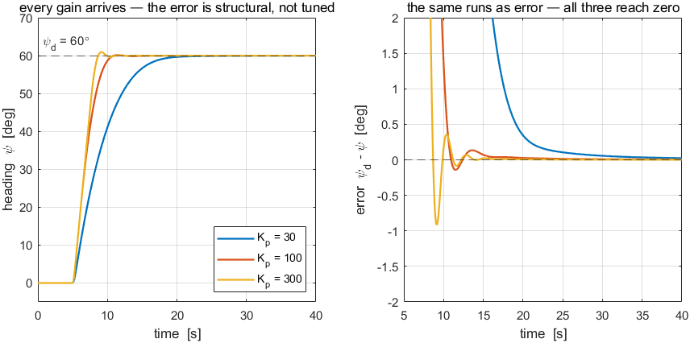
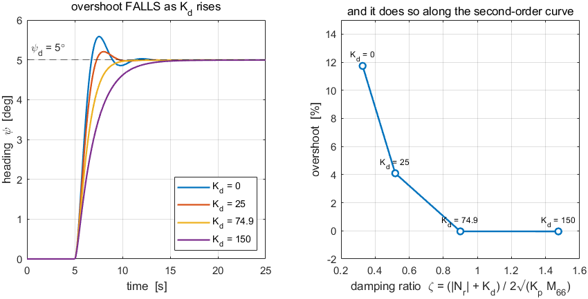
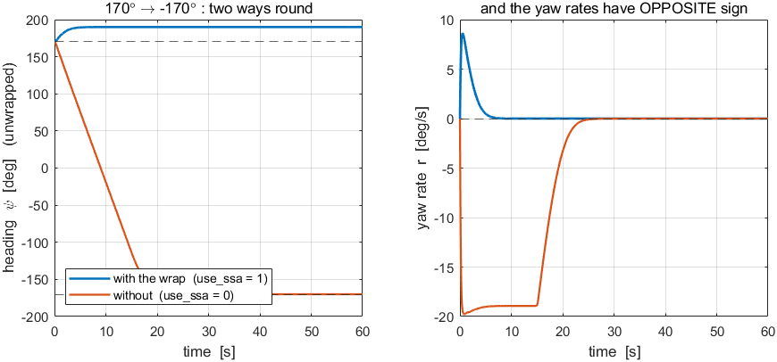

# Week 3 · Laboratory Problems — build the heading autopilot in Simulink

- Course: Sensor Signal Processing and Fusion · Department of Autonomous Vehicle System Engineering
- Time: **one hour**, immediately after the Week 3 lecture hour
- Three problems, in order. Each one adds one branch to the previous answer.

---

## What this hour is for

Week 2 closed a loop around a **velocity** and found that the error never reached zero. This hour closes a loop around an **angle** and finds the opposite. The whole point is that the difference is **structural** — a property of the axis being controlled — and not a better controller.

The hull and the control allocation are provided. The allocation is Appendix A1's subject; Week 3 is about the loop that decides what yaw moment to demand.

---

## Before starting

```matlab
cd lectures/W03_simulink/problems
W03_P1_start                 % creates W03_P1.slx — hull and allocation only
W03_check(1)                 % run this whenever, as often as needed
```

The solver is already set to fixed-step `ode4` at `h = 0.02` s. **Do not change it.**

> [!important] One requirement on every model
> A To Workspace block named **`xlog`**, format **`Structure With Time`**, fed by the plant's twelve-state output. The heading is state **12** and the yaw rate is state **6**.

---

## Problem 1 · Proportional only (20 minutes)

**Build.** Command, error, one gain, into the allocation.

```
Step ψ_d [deg] → deg2rad → (+)(−) → Kp → τ_N → Control allocation → Otter USV
                              ↑                                          ↓
                              └──────────────  ψ  ←──────────────────────┘
```

**Predict before running.** Week 2's plant had no free integrator and its steady error was $u_d\,/(1+K_pK_u)$ — 44 % at $K_p = 100$. Ask the same question here **before** running: what is the steady heading error at $K_p = 30$?

**Verify.** `W03_check(1)`, step to $60°$.

| $K_p$ | steady error | overshoot |
|---|---|---|
| $30$ | $0$ | $-0.01$ % |
| $100$ | $0$ | $0.24$ % |
| $300$ | $0$ | $1.53$ % |

**What a correct model produces**



| Reading the figure | |
|---|---|
| left | all three gains arrive at $60°$. Higher gain arrives faster and rings more |
| right | the same runs as error. **All three go to zero**, and nothing was tuned to make that happen |
| the check | if any trace settles short of $60°$, the feedback is not the heading — check that the Selector picks state 12 |

**The point.** $\psi = \int r$, so the plant carries a **free integrator** and the loop is **type 1**. Week 2's was type 0. That one structural fact — not a better controller — is why the error is zero here at every gain.

---

## Problem 2 · Derivative action (20 minutes)

**Build.** One more branch: $-K_d\,r$, added to the proportional term.

> [!warning] Feed back the yaw rate, not the derivative of the error
> The two agree while $\psi_d$ is constant and disagree at **every step**, where $\mathrm{d}\psi_d/\mathrm{d}t$ is an impulse. Differentiating the error puts that impulse straight into the actuator. The plant already **measures** $r$ — it is state 6 — so nothing in a correct model is differentiated anywhere.

**Predict before running.** Substitute the law into the yaw equation:

$$
M_{66}\,\ddot\psi + \big(\lvert N_r\rvert + K_d\big)\dot\psi + K_p\,\psi = K_p\,\psi_d
$$

$$
\omega_n = \sqrt{\frac{K_p}{M_{66}}}, \qquad
\zeta = \frac{\lvert N_r\rvert + K_d}{2\sqrt{K_p M_{66}}}
$$

**Which coefficient does $K_d$ sit beside?** Answer that, and the direction of the effect follows without simulating anything.

**Verify.** `W03_check(2)`, $K_p = 100$, $5°$ step.

| $K_d$ | $\zeta$ | overshoot |
|---|---|---|
| $0$ | $0.327$ | $11.74$ % |
| $25$ | $0.518$ | $4.10$ % |
| $74.9$ | $0.900$ | $\approx 0$ |

**What a correct model produces**



| Reading the figure | |
|---|---|
| left | four responses to the same step. **Overshoot falls as $K_d$ rises** |
| right | the same four as overshoot against $\zeta$, landing on the second-order curve |
| the check | if overshoot *rises* with $K_d$, the derivative is being taken of the error rather than fed back as $r$ — or its sign is wrong |

**The point.** $K_d$ sits beside the **damping**. In Week 2 the controlled variable was a velocity, its derivative was an acceleration, and the same term sat beside the **mass**, where it made the response worse. **The term did not change; the axis did.**

Note also that the hull alone already gives $\zeta = 0.327$ at $K_p = 100$, because $N_r$ is large. Most of the damping in this loop is not the controller's.

---

## Problem 3 · The wrap (20 minutes)

**Build.** Nothing new — one line inside the control law, and a switch to turn it off.

$$
e = \psi_d - \psi, \qquad
\text{ssa}(e) = \big((e + \pi) \bmod 2\pi\big) - \pi \ \in (-\pi,\ \pi]
$$

**Set up the test.** Start the vessel at $\psi = 170°$ and command $\psi_d = -170°$. The two headings are **$20°$ apart**.

**Verify.** `W03_check(3)`.

| | turn executed |
|---|---|
| with the wrap | $+20°$ |
| without it | $-340°$ |

**What a correct model produces**



| Reading the figure | |
|---|---|
| left | heading, **unwrapped**. Blue rises $20°$ to $190°$; orange falls $340°$ to $-170°$. Both end at the same physical heading |
| right | the yaw rates have **opposite sign** for the whole manoeuvre |
| the check | if the two traces are identical, `use_ssa` is not reaching the control law |

**The point.** Without the wrap the error is computed as $-340°$ and the vessel goes the long way round — **seventeen times further, for the same commanded heading**. `ssa` is one line of code and it is not optional. Week 4's guidance produces commands anywhere in $(-180°, 180°]$, so this seam is crossed routinely.

---

## Marking

| | Weight | What is being marked |
|---|---|---|
| Problem 1 | 30 | `W03_check(1)` passes; the type-1 argument is stated in one sentence |
| Problem 2 | 40 | `W03_check(2)` passes; the answer to "which coefficient does $K_d$ sit beside" is stated **and** the rate feedback is $r$, not $\mathrm{d}e/\mathrm{d}t$ |
| Problem 3 | 30 | `W03_check(3)` passes; the cost of omitting `ssa` is quantified |

---

## If something goes wrong

| Symptom | Cause | Fix |
|---|---|---|
| `The model has no To Workspace block whose variable name is xlog` | the variable name is still `simout` | rename it |
| Heading settles short of the command | the feedback is not state 12 | the Selector index must be 12 for $\psi$, 6 for $r$ |
| The vessel spins continuously | the error sign is reversed | the sum is $\psi_d - \psi$, not $\psi - \psi_d$ |
| Overshoot rises with $K_d$ | the derivative is taken of the error | feed back $r$ directly; the sign is $-K_d r$ |
| Huge spike in the actuator at each step | same cause | same fix |
| The two Problem 3 traces are identical | `use_ssa` never reaches the law | wire it in as a Constant, like $K_p$ and $K_d$ |
| Angles look 57 times too large or small | degrees and radians mixed | every angle inside the loop is in **radians**; convert once, at the command |

Reference answers are in `../solutions/`. Read them **after** attempting the problem.
