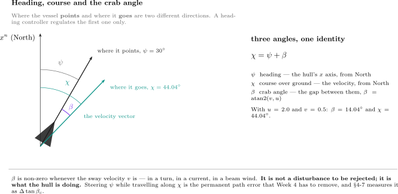
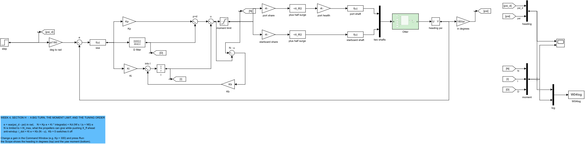
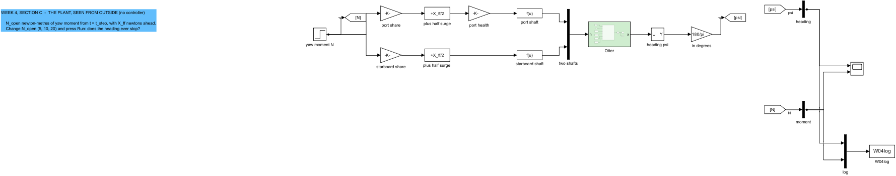
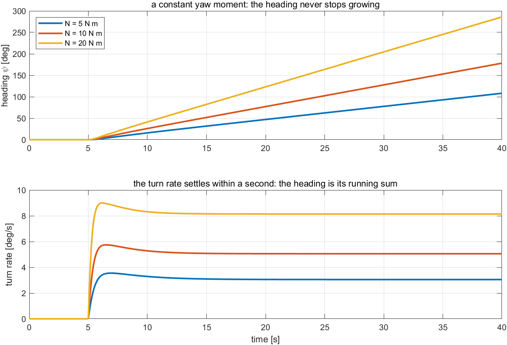
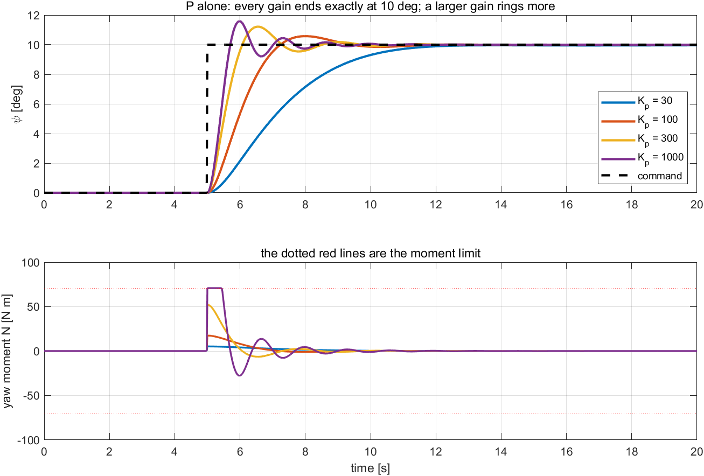
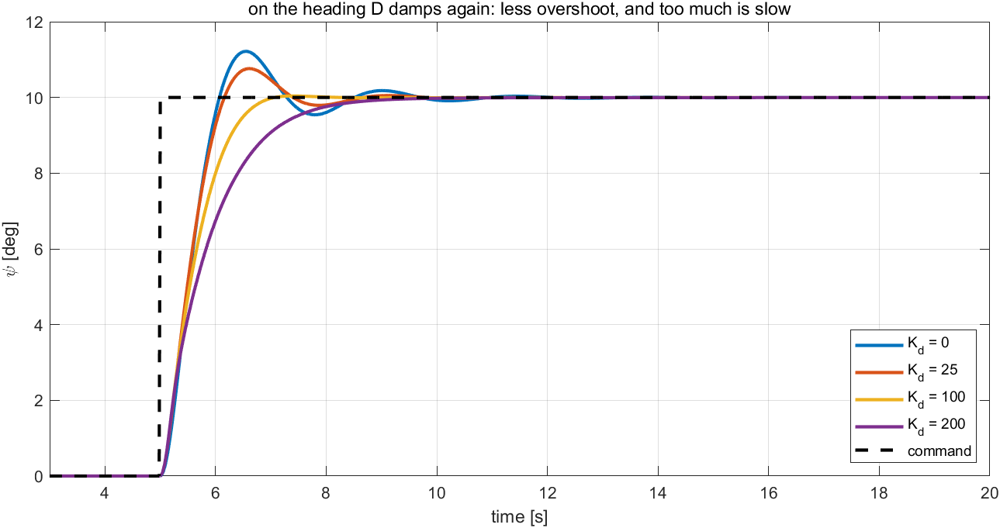
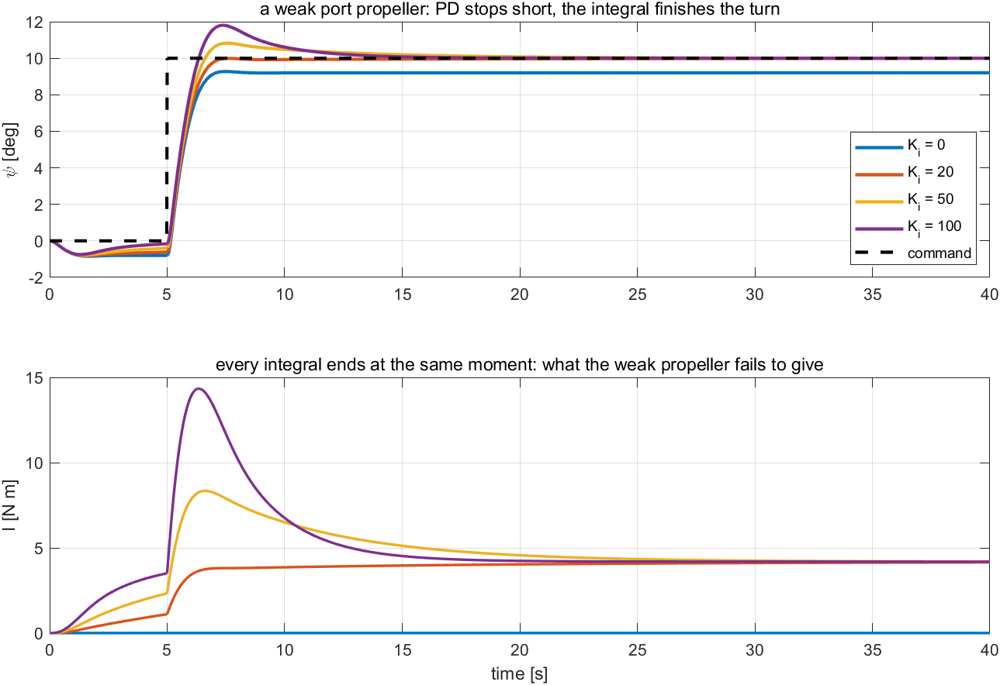
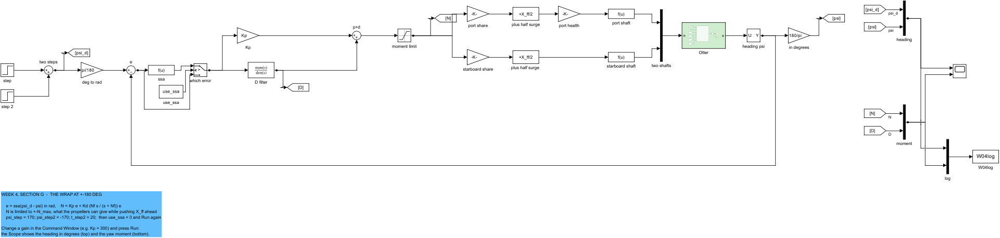
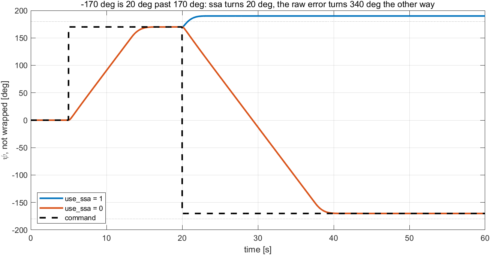
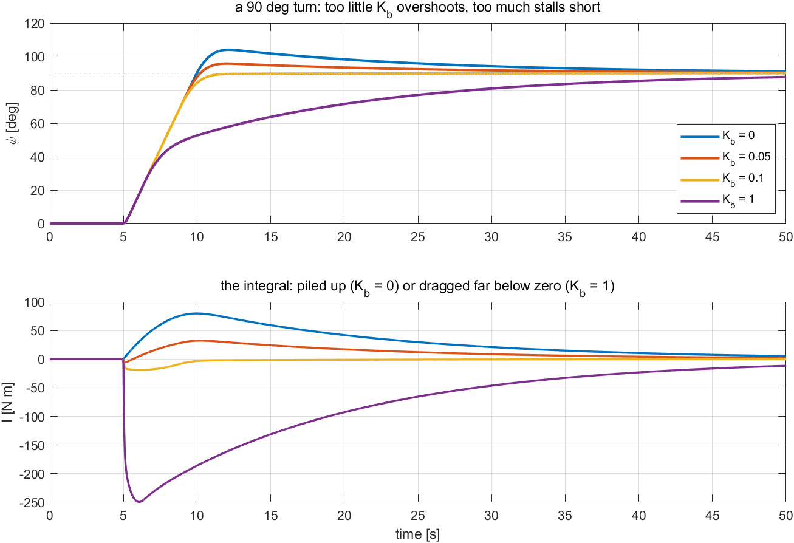

# Week 4 · Heading Control

> [!important] Reference material — read this first
> <span style="font-size:0.88em">The five courses below are **taught by the instructor of this course** and are the assumed background for it. They run from the fundamentals down to the graduate material, so start wherever the gap is. Every frame, symbol and derivation used here is developed in them at length; anyone whose prerequisites are thin should work through them first, then return.</span>
>
> | # | Course | Level | Lang. | Video | Slides and code |
> |---|---|---|---|---|---|
> | 1 | **Control Engineering** (제어공학) — the foundation: transfer functions, feedback, stability, root locus, PID | undergraduate | KO | [playlist](https://youtube.com/playlist?list=PLFaUxNRM4BvJMpF9HZS-Mp8tDv9dTdglk) | [drive](https://drive.google.com/drive/folders/1TNIPDNtS_Iy8li-olka5WJslSXDYf0aT) |
> | 2 | **Control System Design** (제어시스템설계) — design rather than analysis: specifications, loop shaping, discrete implementation | undergraduate | KO | [playlist](https://youtube.com/playlist?list=PLFaUxNRM4BvIGroZ5rgn7x08F7C79d9WZ) | [drive](https://drive.google.com/drive/folders/11m5Xxl_PHJvxgHghLSP-jhCpmRpbvoXh) |
> | 3 | **Advanced Control Engineering** (제어공학특론) — reference frames, the 6-DOF equation of motion, rotation matrices and Euler angles, linearisation and trim, vehicle control design | graduate | EN | [playlist](https://youtube.com/playlist?list=PLFaUxNRM4BvJmvF2ljx4KM5dj1P5jEcw0) | [drive](https://drive.google.com/drive/folders/1GUxbbONl916lNd0ggnFnXrNwNkd13-2-) |
> | 4 | **Sensor Signal Processing and Fusion** (센서신호처리 및 융합) — sensor models, noise, estimation and multi-sensor fusion | graduate | EN | [playlist](https://youtube.com/playlist?list=PLFaUxNRM4BvK-aP2Gdoyp5-AWvMn7Fo8E) | [drive](https://drive.google.com/drive/folders/1MEVJP7TzMcm8w6TZwUjhWJtL34WeNY3u) |
> | 5 | **Capstone Design** (캡스톤디자인) — a vehicle project carried end to end | undergraduate | KO | [playlist](https://youtube.com/playlist?list=PLFaUxNRM4BvLu7L0pDoLzDXTv8mm6rCmj) | [drive](https://drive.google.com/drive/folders/1haIQejlJfrdhtOuof-MpffR9ydVscXZS) |
>
> <span style="font-size:0.88em">**Not fluent in MATLAB or Simulink yet? Do these before Part 2.** Every laboratory in this course is Simulink, and the Onramp courses are free and take a few hours each.</span>
>
> | Tool | Where to start |
> |---|---|
> | MATLAB | [MATLAB Onramp](https://matlabacademy.mathworks.com/kr/details/matlab-onramp/gettingstarted) · [Core MATLAB Skills](https://matlabacademy.mathworks.com/details/core-matlab-skills/lpmlcms) |
> | Simulink | [Simulink Onramp](https://matlabacademy.mathworks.com/kr/details/simulink-onramp/simulink) · instructor's Simulink lectures [part 1](https://youtu.be/a-afHg_fSaU) · [part 2](https://youtu.be/070Yn0Hw5a0) |


> [!tip] Getting the course files, and keeping them current (Windows)
> <span style="font-size:0.88em">The notes, models and scripts are kept in one Git repository that is updated through the semester. Clone it once; before every class, pull. A pull downloads only what has changed since the last one.</span>
>
> | When | Where to run it | Command |
> |---|---|---|
> | once | PowerShell — installs Git for Windows | `winget install --id Git.Git -e` |
> | once | the folder that will hold the course, e.g. `Documents` | `git clone https://github.com/wkyouncnu/Sensor-Signal-Processing-and-Fusion.git` |
> | before every class | inside the cloned folder `Sensor-Signal-Processing-and-Fusion` | `git pull` |
>
> - `git pull` prints `Already up to date.` when nothing has changed, and otherwise lists the files it updated.
> - The repository is private. When Git asks, sign in with the GitHub account the instructor has given access.
> - Experiment on copies, not on the cloned files: copy a week's `WXX_simulink` folder elsewhere first, and a pull can never collide with local edits. If it already has, `git stash`, then `git pull`, then `git stash pop` sets the edits aside, updates, and puts them back.
> - The MSS toolbox is not part of the repository. The weeks that simulate the Otter need it at `Tools\MSS` inside the cloned folder.


- **Course**: USV Guidance, Navigation and Control (Graduate)
- **Department**: Autonomous Vehicle System Engineering, Chungnam National University
- **This week**: ① the Week 2 controller around the Otter's heading, tuned from the Scope with no model of the vessel ② why P alone reaches the command here and D damps again — the opposite of Week 3 ③ the crab angle: heading is not course ④ the moment limit, the back-calculation gain, and the wrap at $\pm 180°$

> [!important] Prerequisites from the previous week
> - From Weeks 2 and 3: the five time-domain metrics, what P, I and D do, the filtered derivative, back-calculation anti-windup and the tuning order. Nothing new is added to the controller this week.
> - From Week 3 §3-3: the same derivative term that damps a position loop made the speed loop worse. A term's effect is read from the axis, not assumed.
> - From Week 1: the two propellers sit $y_{\text{pont}} = 0.395$ m either side of the centreline, so a difference in their thrust turns the vessel.

---

## Learning Outcomes

Upon completion of this week, the learner is able to:

1. Characterise the yaw axis from the outside with one step of yaw moment, and explain from the result why P alone leaves no heading error.
2. Predict, from Weeks 2 and 3 and one fact about the axis, how P, I and D each change the heading response, and confirm it on the Scope.
3. Distinguish heading from course, and compute the crab angle from the body velocities.
4. Remove the heading error left by a weak propeller with the integral, and choose the back-calculation gain from a measured trade-off.
5. Explain why a heading error must be wrapped into $(-180°,\ 180°]$, and measure the cost of not wrapping it.

## Prerequisites and Setup

| Item | Requirement |
|---|---|
| MATLAB | R2024b, with Simulink |
| MSS | `Tools/MSS`, found by `W04_0_setup` through `mss_path` |
| Course folder | `lectures/W04_simulink` |
| Models | one per example — `W04_C_open_loop`, `W04_D_P`, `W04_E_PD`, `W04_F_PID`, `W04_G_wrap`, `W04_H_tuning` — all generated by `W04_1_build_heading`, never edited by hand |
| Time | lecture 40 min, laboratory 1 h 20 min |

---

# Part 1 · Theory

## 4-1. The same controller, a new output

This section answers: what changes when the controller of Weeks 2 and 3 steers the vessel instead of speeding it up?

**The controller does not change.** The error, the three terms, the derivative filter, the limit and the back-calculation path are the blocks of Week 3, in the same places. Three things around them are new.

| New block | What it does | Why |
|---|---|---|
| `deg to rad` | converts the command from degrees to radians | people command headings in degrees; the vessel model works in radians |
| `ssa` | wraps the error into $(-\pi,\ \pi]$: $\text{ssa}(e) = \operatorname{atan2}(\sin e,\ \cos e)$ | $-170°$ is $20°$ past $170°$, not $340°$ back; §4-6 |
| `port share` … `starboard shaft` | turns the demanded yaw moment $N$ into two propeller thrusts, then two shaft speeds | the Otter has no rudder; it turns by pushing one side harder |

**The yaw moment comes from a thrust difference.** Both propellers push forward to give the surge force $X_{ff}$; a yaw moment is added by pushing the port propeller harder and the starboard one less. Each propeller sits $y_{\text{pont}}$ from the centreline, so a thrust difference $T_1 - T_2$ gives a moment $y_{\text{pont}}(T_1 - T_2)$, and the two thrusts are

$$
T_1 = \frac{X_{ff}}{2} + \frac{N}{2\,y_{\text{pont}}}\ \ \text{(port)}, \qquad
T_2 = \frac{X_{ff}}{2} - \frac{N}{2\,y_{\text{pont}}}\ \ \text{(starboard)}
$$

| Symbol | Quantity | Value · source |
|---|---|---|
| $X_{ff}$ | surge force from both propellers together | $60$ N, `W04_0_setup.m` |
| $N$ | yaw moment demanded by the controller | N·m |
| $y_{\text{pont}}$ | propeller arm, half the distance between the pontoons | $0.395$ m, `otter_config` |
| $N_{\max}$ | largest yaw moment available while $X_{ff}$ is delivered | $70.85$ N·m: the port propeller reaches its $119.68$ N maximum at $N = 2\,y_{\text{pont}}\,(119.68 - 30)$ |

- Each thrust is then turned into a shaft speed exactly as in Week 3, $n = \mathrm{sign}(T)\sqrt{\lvert T\rvert/k}$.
- The `moment limit` block holds $N$ inside $\pm 70.85$ N·m. It plays the role the thrust limit played in Week 3, and it causes the windup of §4-5.

## 4-2. What the vessel does, measured from outside

This section answers: what can one step of yaw moment reveal about the heading?

Model `W04_C_open_loop` has no controller. The vessel runs ahead on $X_{ff} = 60$ N, and at $t = 5$ s a constant yaw moment $N$ is added. Measured in section C:

| $N$ [N·m] | final turn rate [deg/s] | turn rate per N·m | time to 63 % of the rate [s] | heading at 40 s [deg] |
|---|---|---|---|---|
| 5 | 3.05 | 0.610 | 0.36 | 108.2 |
| 10 | 5.06 | 0.506 | 0.30 | 178.3 |
| 20 | 8.14 | 0.407 | 0.24 | 286.0 |

Three facts follow:

- **The heading never stops.** A constant moment gives a constant turn rate, and the heading grows for as long as the moment is applied. The heading is the running sum — the integral — of the turn rate. In the language of Week 2 §2-4, the plant is **type 1** by itself: a controller needs no integrator of its own to end at the command.
- **The turn rate answers fast.** It reaches 63 % of its final value within $0.36$ s — the vessel starts to turn almost at once, and the slow part is the heading adding up.
- **The turn rate is not proportional to the moment.** Doubling the moment from 10 to 20 N·m raises the rate by only 61 %. The yaw damping grows with the turn rate (Week 1: $N_r(1 + 10\lvert r\rvert)\,r$), so a quick turn meets more resistance. Unlike the speed of Week 3, this axis is visibly nonlinear — another reason to tune by measurement.

## 4-3. P, I and D on the heading

This section answers: what does each term do on this axis, and how does it compare with Weeks 2 and 3?

The heading behaves like the position of Week 2 — it can overshoot — but without the spring: nothing pulls the vessel back to a particular heading.

| Term | Week 2, position | Week 3, speed | This week, heading | Measured |
|---|---|---|---|---|
| P | faster, rings, leaves an error | faster, never rings, leaves an error | faster, **rings**, and leaves **no error** | section D: overshoot $5.8 \to 15.9\,\%$ as $K_p$ rises $100 \to 1000$; final heading $10.000°$ |
| D | damps | makes it worse | **damps again** | section E: overshoot $12.18 \to 0.39\,\%$, settling $3.26 \to 1.72$ s as $K_d$ rises $0 \to 100$ at $K_p = 300$ |
| I | removes the error | removes the error | removes an error only when something **pushes back**: a weak propeller | section F: $0.80°$ left by PD with the port propeller at 70 %; removed by $K_i = 20$ |

- **Why no error with P alone.** At the command the error is zero, so $N = 0$ — and zero moment is exactly what holding a heading takes, because nothing on this axis resists a heading. Compare Week 3: holding a speed took a steady 116 N against the drag.
- **Why D damps.** The derivative of a heading error is a turn rate; resisting a turn rate is damping, as resisting the velocity of the mass was in Week 2.
- **When I is needed.** A propeller that delivers only 70 % of its thrust — fouled, damaged or badly calibrated — makes a steady yaw moment that the controller must oppose for ever. A PD controller opposes it only from error, and settles $0.80°$ off. The integral finds the missing moment by itself: $4.15$ N·m at $K_i = 20$, the $4.19$ N·m that PD held with its error.

## 4-4. Heading is not course — the crab angle

This section answers: does a vessel go where it points?

- A heading controller regulates where the vessel **points**. It does not regulate where the vessel **goes**, and those are two different directions.



| In the figure | Meaning |
|---|---|
| orange ray | the heading $\psi$ — the direction $x_b$ points |
| blue ray | the course $\chi$ — the direction the velocity actually goes |
| green arc | the crab angle $\beta$, the gap between them |

$$
\beta = \operatorname{atan2}(v,\ u), \qquad \chi = \psi + \beta
$$

| Symbol | Definition | Unit |
|---|---|---|
| $\psi$ | heading, from North to $x_b$ | rad |
| $\chi$ | course over ground, from North to the velocity vector | rad |
| $\beta$ | crab angle | rad |
| $u,\ v$ | surge and sway velocity (Week 1) | m/s |

- With the example of Week 1, $u = 2.0$ m/s and $v = 0.5$ m/s at $\psi = 30°$: $\beta = \operatorname{atan2}(0.5,\ 2.0) = 14.04°$ and $\chi = 44.04°$.
- The crab angle is non-zero whenever $v \neq 0$ — in a turn, in a current, in a beam wind. It is what the hull is doing, not an error to be removed. Week 1 measured $\beta = -20.3°$ in a turning run of a vessel with no sway actuation at all.
- Fossen writes $\beta = \arcsin(v/U)$; for $u > 0$ it is the same number. The form $\operatorname{atan2}(v,u)$ remains correct going astern.
- This week regulates $\psi$ and lets $\chi$ fall where it may. **Week 5 cannot**: a path-following law that steers the heading while the vessel travels along the course leaves a cross-track error of the order of $\beta$ times the look-ahead distance.

## 4-5. The tuning order, applied to the heading

This section answers: how are the gains chosen for this axis, without a model — and what does the moment limit add?

The procedure of Week 2 §2-12. The requirement: a $10°$ turn inside 2 % within 3 s with overshoot below 5 %; no heading error with a weak propeller; no windup in a $90°$ turn.

| Step | What is done | What was measured | Decision |
|---|---|---|---|
| 0 | requirement; is the plant well behaved? | §4-2: stable turn rate, integrating heading, mildly nonlinear | proceed |
| 1 | P only; scale of $K_p$ from the units | a $10°$ error is $0.175$ rad; $K_p = 300$ asks $52$ N·m of the $70.85$ available | $K_p = 300$ |
| 2 | read the P response | overshoot $12.2\,\%$, settling $3.26$ s: it rings | add D |
| 3 | raise $K_d$ while the response improves | $K_d = 25$: $7.61\,\%$, $2.98$ s; $50$: $4.10\,\%$, $2.22$ s; $100$: $0.39\,\%$, $1.72$ s; $150$: $0\,\%$, $2.42$ s | $K_d = 100$, the fastest settling |
| 4 | add I if something pushes back | a 70 % port propeller leaves $0.80°$; $K_i = 20$ removes it, settling $1.98$ s | $K_i = 20$ |
| 5 | look at the moment: a big turn | a $90°$ turn saturates the moment; the back-calculation gain $K_b$ decides what the integral does meanwhile | below |

**The moment limit and $K_b$.** Measured in section H, settling time and overshoot for three turns:

| $K_b$ | $10°$ turn | weak propeller, $10°$ | $90°$ turn |
|---|---|---|---|
| 0 (no anti-windup) | 12.42 s, 4.35 % | 1.98 s, 0 % | 37.12 s, **15.57 %** |
| 0.05 | 7.28 s, 3.20 % | 2.18 s, 0 % | 24.14 s, 6.38 % |
| **0.1** | **2.64 s, 2.06 %** | 9.38 s, 0 % | **5.80 s, 0 %** |
| 1 | 33.68 s, 0 % | 35.00 s or more, 0 % | 48.50 s, 0 % |

- **Too little $K_b$: windup.** While the moment is on its limit the integral keeps charging — to $79.7$ N·m in the $90°$ turn — and the vessel overshoots by $15.6\,\%$ and takes 37 s to come back. Even the $10°$ turn winds up a little: the derivative kick at the step touches the limit for a moment.
- **Too much $K_b$: the integral is dragged down.** While saturated, back-calculation pulls the integral towards the value that makes the demand equal to the limit. With $K_p e$ alone asking for several hundred N·m, that value is far below zero — $-249.5$ N·m at $K_b = 1$ — and the vessel stalls short of its heading for tens of seconds. This is the $I^\star$ of Week 2 §2-11, on the vessel.
- **$K_b = 0.1$** is the compromise: the $90°$ turn behaves as if there were no integral at all ($5.80$ s against $5.60$ s for PD alone), the $10°$ turn meets the requirement, and the weak propeller is still corrected, more slowly.

The result, $K_p = 300$, $K_d = 100$, $K_i = 20$, $K_b = 0.1$, is the default in `W04_0_setup.m`. No transfer function of the vessel was written down.

## 4-6. The wrap

This section answers: why is the heading error passed through `ssa`?

A heading of $-170°$ and one of $170°$ are $20°$ apart, across the $\pm 180°$ seam. The raw difference $-170 - 170 = -340°$ tells the controller to turn $340°$ the other way. $\text{ssa}(e) = \operatorname{atan2}(\sin e,\ \cos e)$ returns the equivalent angle in $(-180°,\ 180°]$, here $+20°$.

Measured in section G, the vessel at $170°$ commanded to $-170°$ at $t = 20$ s:

| `use_ssa` | turn executed after 20 s |
|---|---|
| 1 | $20.0°$ |
| 0 | $340.0°$, the other way |

- Seventeen times further, for the same commanded heading. Week 5's guidance produces commands anywhere in $(-180°,\ 180°]$, so the seam is crossed routinely.

---

# Part 2 · Laboratory

Every example has **its own model**, laid out as in Weeks 2 and 3: the controller on the left, the thrust split and the vessel in the middle, **one Scope** on the right with the heading in degrees on top and the yaw moment below.

| Section | Model | What it shows |
|---|---|---|
| C | `W04_C_open_loop` | a step yaw moment, no controller |
| D | `W04_D_P` | P only |
| E | `W04_E_PD` | P + D |
| F | `W04_F_PID` | P + I + D, with a weak port propeller |
| G | `W04_G_wrap` | a command across $\pm 180°$, with an `ssa` switch |
| H | `W04_H_tuning` | the tuning order, a big turn, and the back-calculation gain |

Each section ends with an **In class** note: purpose, what to point at, a question with its answer, and the sentence to take away.

## A. Setting up (10 min)

```matlab
cd lectures/W04_simulink
W04_0_setup
W04_1_build_heading
```

Expected output:

```
  W04_0_setup
    thrust   X_ff = 60 N forward, yaw moment |N| <= 70.85 N m
    gains    Kp = 300   Ki = 20   Kd = 100   Nf = 20   Kb = 0.1
    command  psi_d = 0 -> 10 deg at t = 5 s

  built  W04_C_open_loop.slx  (overlapping lines: 0)
  built  W04_D_P.slx          (overlapping lines: 0)
  built  W04_E_PD.slx         (overlapping lines: 0)
  built  W04_F_PID.slx        (overlapping lines: 0)
  built  W04_G_wrap.slx       (overlapping lines: 0)
  built  W04_H_tuning.slx     (overlapping lines: 0)
```

- `W04_0_setup.m` is the only file edited by hand. If it stops in `mss_path`, the MSS toolbox is not at `Tools\MSS`.
- The first line of `W04_0_setup` is `clear`. Run it again whenever a Scope does not match these notes.

## B. The models (10 min)

```matlab
open_system('W04_H_tuning')
```



| In the figure | Meaning |
|---|---|
| `step` → `deg to rad` → `e` → `ssa` | the command in degrees, the error in radians, wrapped |
| `Kp`, `D filter`, `Ki` → `I`, `p+d`, `u` | the PID of Weeks 2 and 3, block for block |
| `moment limit`, `N - u`, `Kb` | the moment limit and the back-calculation path of Week 3 |
| `port share`, `starboard share`, `plus half surge` | $T_1$ and $T_2$ of §4-1 |
| `port health` | the port propeller's efficiency, `port_eff`; 1 unless section F lowers it |
| `port shaft`, `starboard shaft` → `Otter` → `heading psi` → `in degrees` | shaft speeds, the vessel, and the heading back in degrees for the Scope |
| `heading`, `moment` → Scope | top: $\psi_d$ and $\psi$; bottom: $N$, $I$ and $D$ |

> [!tip] In class
> - **Purpose** — show that the controller is still the Week 2 controller; the new parts are the degree conversion, the wrap, and the thrust split that makes a moment out of two propellers.
> - **Point to** — the two rows behind the `moment limit`: one moment in, two thrusts out, one larger and one smaller.
> - **Ask** — "Why is there a `moment limit` at all, when each propeller has its own limit?" Because the demand must be limited where the controller can see it; otherwise the integral cannot know it was cut, and windup follows (§4-5).
> - **Take away** — to steer a rudderless vessel, push one side harder.

## C. The plant seen from outside (10 min)

```matlab
open_system('W04_C_open_loop')           % press Run; then N_open = 20, Run
W04_C_plant_from_outside
```



| In the figure | Meaning |
|---|---|
| `yaw moment N` | a step of `N_open` N·m at $t = 5$ s |
| the thrust split, `Otter`, `heading psi`, `in degrees` | the plant chain of §4-1 |
| Scope | top: the heading $\psi$; bottom: the moment $N$ |

Expected output:

```
  W04 C  the plant seen from outside (no controller, X_ff = 60 N ahead)
    N [N m]   final turn rate [deg/s]   rate per N m   time to 63 % of the rate [s]   heading at 40 s [deg]
    5                            3.05          0.610                           0.36                   108.2
    10                           5.06          0.506                           0.30                   178.3
    20                           8.14          0.407                           0.24                   286.0
```



| In the figure | Meaning |
|---|---|
| top | the heading after a step moment of 5, 10 and 20 N·m |
| bottom | the turn rate, the slope of the top curves |

**What the figure says**

- The heading grows without end while the turn rate levels off within a few seconds. The heading is the running sum of the turn rate.

> [!tip] In class
> - **Purpose** — contrast with Week 3's open loop: there a constant force gave a constant speed; here a constant moment gives a heading that never stops.
> - **Point to** — the straight lines in the top panel; the flat rates in the bottom one.
> - **Ask** — "What moment does it take to hold a heading?" None: a vessel on a steady heading needs no yaw moment. That is why P alone will leave no error (section D).
> - **Ask** — "Why does 20 N·m give less than twice the rate of 10 N·m?" The yaw damping grows with the turn rate.
> - **Take away** — the heading is an integral; the plant brings its own.

## D. P only (10 min)

```matlab
open_system('W04_D_P')                   % press Run; then Kp = 1000, Run
W04_D_proportional_only
```

Expected output:

```
  W04 D  P only  (psi_d = 10 deg at t = 5 s)
    Kp     final psi [deg]   overshoot %   rise [s]   settle [s]   peak |N| [N m]
    30               9.989           0.0       3.94         6.36              5.2
    100              9.997           5.8       1.50         3.96             17.5
    300              9.999          12.2       0.74         3.26             52.4
    1000            10.000          15.9       0.48         3.12             70.8
```



| In the figure | Meaning |
|---|---|
| top | the heading for $K_p = 30$ to $1000$ and the dashed command |
| bottom | the yaw moment; the dotted red lines are $\pm 70.85$ N·m |

**What the figure says**

- Every gain ends at $10°$; a larger gain is faster and rings more. At $K_p = 1000$ the moment is on its limit and more gain buys little.

> [!tip] In class
> - **Purpose** — the two differences from Week 3 on one plot: no error left, and ringing.
> - **Point to** — the final-heading column, all $10°$ to within $0.011°$; the overshoot column growing with the gain.
> - **Ask** — "Week 3 at $K_p = 800$ still missed by 0.133 m/s. Why is this different?" Holding a speed needs force against drag; holding a heading needs no moment.
> - **Take away** — on an integrating axis P reaches the command; the question becomes how much it rings.

## E. Add D (10 min)

```matlab
open_system('W04_E_PD')                  % press Run; then Kd = 0, Run; Kd = 200, Run
W04_E_derivative
```

Expected output:

```
  W04 E  P + D  (Kp = 300, psi_d = 10 deg)
    Kd     overshoot %   rise [s]   settle [s]
    0            12.18       0.74         3.26
    10           10.23       0.76         3.20
    25            7.61       0.80         2.98
    50            4.10       0.88         2.22
    100           0.39       1.12         1.72
    150           0.00       1.44         2.42
    200           0.00       1.78         3.14
```



| In the figure | Meaning |
|---|---|
| traces | the heading for $K_d = 0, 25, 100, 200$ at $K_p = 300$ |

**What the figure says**

- The derivative removes the ringing; beyond $K_d = 100$ it only slows the turn.

> [!tip] In class
> - **Purpose** — the derivative on its home ground again, after it failed on the speed loop.
> - **Point to** — the settling column: it falls to $1.72$ s at $K_d = 100$ and rises again — too much damping is slow (Week 2 §2-3, $\zeta > 1$).
> - **Ask** — "The same block made Week 3 worse. What changed?" The axis: the derivative of a heading error is a turn rate, and resisting it is damping.
> - **Take away** — use D where the output can overshoot, and stop raising it where the settling time turns up.

## F. A weak port propeller (10 min)

```matlab
open_system('W04_F_PID')                 % port_eff = 0.7; Ki = 0; Run; then Ki = 20, Run
W04_F_weak_propeller
```

Expected output:

```
  W04 F  1) PD only (Kp = 300, Kd = 100), port propeller at reduced efficiency
    port_eff   final psi [deg]   error left [deg]   steady N [N m]
    1                    9.999              0.001             0.00
    0.7                  9.200              0.800             4.19
    0.5                  8.490              1.510             7.90

  2) add the integral, port_eff = 0.7
    Ki     final psi [deg]   overshoot %   settle [s]   I at 40 s [N m]
    0                9.200          0.00          Inf              0.00
    20               9.993          0.00         1.98              4.15
    50              10.002          8.27         9.82              4.20
    100             10.000         18.07         7.66              4.19
```



| In the figure | Meaning |
|---|---|
| top | the heading with the port propeller at 70 %, for $K_i = 0$ to $100$ |
| bottom | the integral term; every curve ends at the same moment |

**What the figure says**

- PD stops $0.80°$ short, because holding the heading now needs $4.19$ N·m that only an error can produce. The integral supplies it and the error goes; too much integral overshoots.

> [!tip] In class
> - **Purpose** — show when the integral is needed on an axis that already integrates: when something pushes back.
> - **Point to** — the steady $N$ column: $4.19$ N·m with PD, the same $4.15$–$4.20$ N·m in the integral once $K_i > 0$.
> - **Ask** — "Why does the weak propeller make a yaw moment at all?" Both propellers are asked for 30 N; the port one gives 21 N, so the starboard side pushes harder and the vessel turns to port.
> - **Take away** — the integral finds whatever steady effort the plant demands, whether drag (Week 3) or a fault (here).

## G. The wrap (10 min)

```matlab
open_system('W04_G_wrap')                % psi_step = 170; psi_step2 = -170; t_step2 = 20; T_final = 60; Run; then use_ssa = 0, Run
W04_G_the_wrap
```



| In the figure | Meaning |
|---|---|
| `ssa`, `use_ssa`, `which error` | the wrapped error when `use_ssa = 1`, the raw error when 0 |
| `step`, `step 2`, `two steps` | $170°$ at 5 s, then $-170°$ at `t_step2` |

Expected output:

```
  W04 G  170 deg, then -170 deg at t = 20 s
    use_ssa   heading at 20 s [deg]   heading at 60 s [deg]   turned after 20 s [deg]
    1                         170.0                   190.0                      20.0
    0                         170.0                  -170.0                     340.0
```



| In the figure | Meaning |
|---|---|
| traces | the heading, not wrapped, with and without `ssa`; the dotted lines are $\pm 180°$ |

**What the figure says**

- $190°$ and $-170°$ are the same heading. With `ssa` the vessel reaches it by a $20°$ turn; without it, by $340°$ the other way.

> [!tip] In class
> - **Purpose** — one line of code, and the cost of leaving it out.
> - **Point to** — the two curves leaving $170°$ in opposite directions at 20 s.
> - **Ask** — "Why does the plotted heading end at $190°$ and not at $-170°$?" The plot shows the heading without wrapping, to make the direction of the turn visible; physically they are the same.
> - **Take away** — wrap every heading error before any gain sees it.

## H. The tuning order, and a big turn (15 min)

```matlab
open_system('W04_H_tuning')              % psi_step = 90; T_final = 60; Run; then Kb = 0, Run; Kb = 1, Run
W04_H_tuning_by_hand
```

Expected output:

```
  W04 H  the tuning order on the heading
    1-2  Kp = 300 (10 deg asks 52 N m of the 70.8 available): overshoot 12.2 %, settle 3.26 s: it rings, so D
    3    Kd = 25: 7.61 %, 2.98 s   50: 4.10 %, 2.22 s   100: 0.39 %, 1.72 s   150: 0.00 %, 2.42 s   -> Kd = 100 (fastest settling)
    4    weak port propeller (0.7): PD leaves 0.80 deg; Ki = 20 removes it: 0.007 deg left, settle 1.98 s
    5    the moment limit: Kb against three turns (settle [s], overshoot %)
         Kb      10 deg turn        weak propeller     90 deg turn
         0       12.42 s   4.35 %    1.98 s   0.00 %   37.12 s  15.57 %
         0.05     7.28 s   3.20 %    2.18 s   0.00 %   24.14 s   6.38 %
         0.1      2.64 s   2.06 %    9.38 s   0.00 %    5.80 s   0.00 %
         1       33.68 s   0.00 %   35.00 s   0.00 %   48.50 s   0.00 %
         PD alone, 90 deg turn: 5.60 s, 0.00 %
         final: Kp = 300, Kd = 100, Ki = 20, Kb = 0.1
```



| In the figure | Meaning |
|---|---|
| top | the heading in a $90°$ turn for $K_b = 0, 0.05, 0.1, 1$ |
| bottom | the integral term |

**What the figure says**

- With too little $K_b$ the integral piles up and the vessel overshoots; with too much it is dragged far below zero and the vessel stalls short. $K_b = 0.1$ turns as cleanly as PD alone.

> [!tip] In class
> - **Purpose** — the full procedure, and one decision that cannot be made without looking at the actuator.
> - **Point to** — the blue integral rising to 80 N·m and the purple one diving to $-250$ N·m, while the heading curves separate from about 8 s on.
> - **Ask** — "Why does a larger $K_b$ make things worse here, when it helped in Week 3?" In a big turn $K_p e$ alone asks for several hundred N·m; back-calculation drags the integral towards the value that would cancel it, far below zero, and that has to be undone afterwards.
> - **Ask** — "Why is the weak-propeller case slower at $K_b = 0.1$?" The derivative kick at the step touches the limit, back-calculation pulls the integral down, and the integral must then climb to the $4.19$ N·m the fault needs.
> - **Take away** — the back-calculation gain is a trade-off, and it is chosen by running the turns that matter.

---

# Summary

## Week Summary

| Step | What was done | How it was verified |
|---|---|---|
| 1 | placed the Week 2 controller around the heading, with `ssa` and a thrust split | `check_overlaps` 0 in six models |
| 2 | measured the yaw axis from outside | section C: the heading grows without end; turn rate within 0.36 s to 63 %; rate per N·m falls from 0.610 to 0.407 |
| 3 | P alone | section D: no error at any gain; overshoot $5.8 \to 15.9\,\%$ |
| 4 | D damps | section E: $12.18 \to 0.39\,\%$, fastest at $K_d = 100$ |
| 5 | I against a weak propeller | section F: $0.80°$ removed; integral $4.15$ N·m |
| 6 | the wrap | section G: $20°$ with `ssa`, $340°$ without |
| 7 | the tuning order and $K_b$ | section H: $K_p = 300$, $K_d = 100$, $K_i = 20$, $K_b = 0.1$; $90°$ turn in $5.80$ s without overshoot |

## Progress Check

> [!important] Minimum condition for following Week 5

### Theory

- [ ] Able to explain from one open-loop test why P alone leaves no heading error.
- [ ] Able to state what P, I and D do on the heading and compare with Weeks 2 and 3.
- [ ] Able to compute the crab angle and course from $u$, $v$ and $\psi$.
- [ ] Able to explain both failure modes of the back-calculation gain.

### Laboratory

- [ ] `W04_1_build_heading` ran and every model reported `overlapping lines: 0`.
- [ ] `W04_check(1)`, `(2)` and `(3)` pass on a model built from `W04_P1_start`.

### Recorded observations

- [ ] The heading error left by PD with a 70 % port propeller, and the moment the integral found.
- [ ] The $90°$-turn settling time at $K_b = 0$, $0.1$ and $1$.

---

## In-class laboratory — build the heading autopilot by hand

The second hour of the Week 4 session is spent building the autopilot in Simulink around a vessel whose allocation is given.

```matlab
cd lectures/W04_simulink/problems
W04_P1_start                 % creates W04_P1.slx — hull and allocation only
W04_check(1)                 % run this whenever, as often as needed
```

| | Problem | Time | The number it must reproduce |
|---|---|---|---|
| 1 | P only | 20 min | no error; overshoot $5.8\,\%$ at $K_p = 100$, $12.2\,\%$ at $300$ |
| 2 | add the filtered derivative | 20 min | overshoot $12.18$, $4.10$, $0.39\,\%$ at $K_d = 0$, $50$, $100$ |
| 3 | the wrap | 20 min | a $20°$ turn with `ssa`, $340°$ without |

- The problem sheet is [`W04_simulink/problems/README.md`](W04_simulink/problems/README.md), and reference answers are in [`W04_simulink/solutions/`](W04_simulink/solutions/README.md).

---

## Assignment 4

- **Due**: before the Week 5 session
- **Submit**: the modified `W04_0_setup.m`, the numbers requested below, and two figures

### ① Requirements

Halve the surge force, `X_ff = 30` N, in `W04_0_setup.m` and `W04_vars.m`, and tune the heading loop again by the tuning order of §4-5 with the same requirement.

### ② Verification — mandatory

> [!important] A claim is not a result. Numbers are required, with the tolerance band stated

1. The new $N_{\max}$, computed from §4-1 and read from `W04_0_setup`'s output.
2. Section C with the new $X_{ff}$: the turn rate per N·m at 10 N·m.
3. For each step of the tuning order, the measurement that decided it.
4. The $K_b$ table of §4-5 for the final gains.

### ③ Analysis (5–10 lines)

Explain why the available yaw moment depends on the surge force, and how that moved the gains.

### Grading

| Criterion | Weight |
|---|---|
| The model runs and produces the requested output | 25% |
| **Verification performed and numbers reported** | 40% |
| Correctness of the analysis | 25% |
| Readability of the code | 10% |

---

## Troubleshooting

| Symptom | Cause | Fix |
|---|---|---|
| `W04_0_setup` stops in `mss_path` | the MSS toolbox is not at `Tools\MSS` | place MSS there; see the first page |
| the vessel stalls short of a big turn for tens of seconds | $K_b$ too large | `Kb = 0.1` |
| a big turn overshoots and creeps back | $K_b = 0$: windup | `Kb = 0.1` |
| the vessel turns the long way round | `use_ssa = 0` | `use_ssa = 1` |
| a Scope does not match these notes | a changed variable is still in the workspace | run `W04_0_setup` again |
| a block name with `/` stops the build | Simulink reads `/` as a path separator | the builder names the Bias blocks `plus half surge` |

---

## References

### Primary

- Fossen, T. I. *Handbook of Marine Craft Hydrodynamics and Motion Control*, 2nd ed., Wiley, 2021, §12.2 (PID control of marine craft) and §12.2.6 (anti-windup); the crab angle and course are defined with the kinematics of Ch. 2.
- Åström, K. J. and Hägglund, T. *Advanced PID Control*, ISA, 2006, Ch. 3.
- MSS toolbox, `Tools/MSS/VESSELS/otter.m` and `GNC/ssa.m`.

### In this course

- Week 2 §2-4, §2-6 to §2-8, §2-11 and §2-12; Week 3 §3-3 and §3-5.
- The previous, model-based version of this week — the Nomoto model, pole placement and the second-order formulas — is kept in `W04_simulink/_previous_version/` for reference.

---

## Next Week

- **Week 5 — Waypoint Following and LOS Guidance**
- A heading autopilot follows a commanded heading; guidance decides what heading to command. Week 5 builds the line-of-sight law that turns a list of waypoints into $\psi_d$, and meets the crab angle of §4-4 as a cross-track error.
