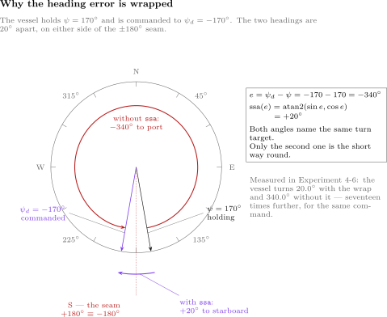

# Week 4 · Heading Control

> [!important] Reference material — read this first
> <span style="font-size:0.88em">The five courses below are **taught by the instructor of this course** and are the assumed background for it. They run from the fundamentals down to the graduate material, so start wherever the gap is. Every frame, symbol and derivation used here is developed in them at length; anyone whose prerequisites are thin should work through them first, then return.</span>
>
> | # | Course | Level | Lang. | Video | Slides and code |
> |---|---|---|---|---|---|
> | 1 | **Control Engineering** (제어공학) — the foundation: transfer functions, feedback, stability, root locus, PID | undergraduate | KO | [playlist](https://youtube.com/playlist?list=PLFaUxNRM4BvJMpF9HZS-Mp8tDv9dTdglk) | [drive](https://drive.google.com/drive/folders/1TNIPDNtS_Iy8li-olka5WJslSXDYf0aT) |
> | 2 | **Control System Design** (제어시스템설계) — design rather than analysis: specifications, loop shaping, discrete implementation | undergraduate | KO | [playlist](https://youtube.com/playlist?list=PLFaUxNRM4BvIGroZ5rgn7x08F7C79d9WZ) | [drive](https://drive.google.com/drive/folders/11m5Xxl_PHJvxgHghLSP-jhCpmRpbvoXh) |
> | 3 | **Advanced Control Engineering** (제어공학특론) — reference frames, the 6-DOF equation of motion, rotation matrices and Euler angles, linearisation and trim, vehicle control design | graduate | EN | [playlist](https://youtube.com/playlist?list=PLFaUxNRM4BvJmvF2ljx4KM5dj1P5jEcw0) | [drive](https://drive.google.com/drive/folders/1GUxbbONl916lNd0ggnFnXrNwNkd13-2-) |
> | 4 | **Sensor Signal Processing and Fusion** (센서신호처리 및 융합) — sensor models, noise, estimation and multi-sensor fusion | graduate | EN | [playlist](https://youtube.com/playlist?list=PLFaUxNRM4BvK-aP2Gdoyp5-AWvMn7Fo8E) | [drive](https://drive.google.com/drive/folders/1MEVJP7TzMcm8w6TZwUjhWJtL34WeNY3u) |
> | 5 | **Capstone Design** (캡스톤디자인) — a vehicle project carried end to end | undergraduate | KO | [playlist](https://youtube.com/playlist?list=PLFaUxNRM4BvLu7L0pDoLzDXTv8mm6rCmj) | [drive](https://drive.google.com/drive/folders/1haIQejlJfrdhtOuof-MpffR9ydVscXZS) |
>
> <span style="font-size:0.88em">**Not fluent in MATLAB or Simulink yet? Do these before Part 2.** Every laboratory in this course is Simulink, and the Onramp courses are free and take a few hours each.</span>
>
> | Tool | Where to start |
> |---|---|
> | MATLAB | [MATLAB Onramp](https://matlabacademy.mathworks.com/kr/details/matlab-onramp/gettingstarted) · [Core MATLAB Skills](https://matlabacademy.mathworks.com/details/core-matlab-skills/lpmlcms) |
> | Simulink | [Simulink Onramp](https://matlabacademy.mathworks.com/kr/details/simulink-onramp/simulink) · instructor's Simulink lectures [part 1](https://youtu.be/a-afHg_fSaU) · [part 2](https://youtu.be/070Yn0Hw5a0) |


> [!tip] Getting the course files, and keeping them current (Windows)
> <span style="font-size:0.88em">The notes, models and scripts are kept in one Git repository that is updated through the semester. Clone it once; before every class, pull. A pull downloads only what has changed since the last one.</span>
>
> | When | Where to run it | Command |
> |---|---|---|
> | once | PowerShell — installs Git for Windows | `winget install --id Git.Git -e` |
> | once | the folder that will hold the course, e.g. `Documents` | `git clone https://github.com/wkyouncnu/Sensor-Signal-Processing-and-Fusion.git` |
> | before every class | inside the cloned folder `Sensor-Signal-Processing-and-Fusion` | `git pull` |
>
> - `git pull` prints `Already up to date.` when nothing has changed, and otherwise lists the files it updated.
> - The repository is private. When Git asks, sign in with the GitHub account the instructor has given access.
> - Experiment on copies, not on the cloned files: copy a week's `WXX_simulink` folder elsewhere first, and a pull can never collide with local edits. If it already has, `git stash`, then `git pull`, then `git stash pop` sets the edits aside, updates, and puts them back.
> - The MSS toolbox is not part of the repository. The weeks that simulate the Otter need it at `Tools\MSS` inside the cloned folder.


- **Course**: USV Guidance, Navigation and Control (Graduate)
- **Department**: Autonomous Vehicle System Engineering, Chungnam National University
- **This week**: ① the Week 2 controller around the Otter's heading, tuned from the Scope with no model of the vessel ② why P alone reaches the command here and D damps again — the opposite of Week 3 ③ the crab angle: heading is not course ④ the moment limit, the back-calculation gain, and the wrap at $\pm 180°$

> [!important] Prerequisites from the previous week
> - From Weeks 2 and 3: the five time-domain metrics, what P, I and D do, the filtered derivative, back-calculation anti-windup and the tuning order. Nothing new is added to the controller this week.
> - From Week 3 §3-3: the same derivative term that damps a position loop made the speed loop worse. A term's effect is read from the axis, not assumed.
> - From Week 1: the two propellers sit $y_{\text{pont}} = 0.395$ m either side of the centreline, so a difference in their thrust turns the vessel.

---

## Learning Outcomes

Upon completion of this week, the learner is able to:

1. Characterise the yaw axis from the outside with one step of yaw moment, and explain from the result why P alone leaves no heading error.
2. Predict, from Weeks 2 and 3 and one fact about the axis, how P, I and D each change the heading response, and confirm it on the Scope.
3. Distinguish heading from course, and compute the crab angle from the body velocities.
4. Remove the heading error left by a weak propeller with the integral, and choose the back-calculation gain from a measured trade-off.
5. Explain why a heading error must be wrapped into $(-180°,\ 180°]$, and measure the cost of not wrapping it.

## Prerequisites and Setup

| Item | Requirement |
|---|---|
| MATLAB | R2024b, with Simulink |
| MSS | `Tools/MSS`, found by `W04_0_setup` through `mss_path` |
| Course folder | `lectures/W04_simulink` |
| Models | one per example — `W04_C_open_loop`, `W04_D_P`, `W04_E_PD`, `W04_F_PID`, `W04_G_wrap`, `W04_H_tuning` — all generated by `W04_1_build_heading`, never edited by hand |
| Time | lecture 40 min, laboratory 1 h 20 min |

---

# Part 1 · Principle and experiment, section by section

Every section states what is observed, says what follows from it, and then runs **the experiment that measures it**, on its own model. The numbers quoted in the text are printed by the run a few lines below it.

| Part of a section | What it holds |
|---|---|
| **What is observed** | the effect itself, with the numbers it produces |
| **What follows from it** | numbered lines, one step each, resting on Weeks 2 and 3 and on one measurement of this axis |
| **Experiment N-x** | the model, the commands, the output actually obtained, the figure, and a table that reads every feature of the figure back to **the numbered line that predicts it** |

## 4-0. Setting up (10 min)

```matlab
cd lectures/W04_simulink
W04_0_setup
W04_1_build_heading
```

Expected output:

```
  W04_0_setup
    thrust   X_ff = 60 N forward, yaw moment |N| <= 70.85 N m
    gains    Kp = 300   Ki = 20   Kd = 100   Nf = 20   Kb = 0.1
    command  psi_d = 0 -> 10 deg at t = 5 s

  built  W04_C_open_loop.slx  (overlapping lines: 0)
  built  W04_D_P.slx          (overlapping lines: 0)
  built  W04_E_PD.slx         (overlapping lines: 0)
  built  W04_F_PID.slx        (overlapping lines: 0)
  built  W04_G_wrap.slx       (overlapping lines: 0)
  built  W04_H_tuning.slx     (overlapping lines: 0)
```

- `W04_0_setup.m` is the only file edited by hand. If it stops in `mss_path`, the MSS toolbox is not at `Tools\MSS`.
- The first line of `W04_0_setup` is `clear`. Run it again whenever a Scope does not match these notes.

## 4-1. The same controller, a new output

This section answers: what changes when the controller of Weeks 2 and 3 steers the vessel instead of speeding it up?

**The controller does not change.** The error, the three terms, the derivative filter, the limit and the back-calculation path are the blocks of Week 3, in the same places. Three things around them are new.

| New block | What it does | Why |
|---|---|---|
| `deg to rad` | converts the command from degrees to radians | people command headings in degrees; the vessel model works in radians |
| `ssa` | wraps the error into $(-\pi,\ \pi]$: $\text{ssa}(e) = \operatorname{atan2}(\sin e,\ \cos e)$ | $-170°$ is $20°$ past $170°$, not $340°$ back; §4-6 |
| `allocation` | a MATLAB Function block, commented line by line: turns the demanded yaw moment $N$ into two propeller thrusts, then two shaft speeds | the Otter has no rudder; it turns by pushing one side harder |

**The yaw moment comes from a thrust difference.** Both propellers push forward to give the surge force $X_{ff}$; a yaw moment is added by pushing the port propeller harder and the starboard one less. Each propeller sits $y_{\text{pont}}$ from the centreline, so a thrust difference $T_1 - T_2$ gives a moment $y_{\text{pont}}(T_1 - T_2)$, and the two thrusts are

$$
T_1 = \frac{X_{ff}}{2} + \frac{N}{2\,y_{\text{pont}}}\ \ \text{(port)}, \qquad
T_2 = \frac{X_{ff}}{2} - \frac{N}{2\,y_{\text{pont}}}\ \ \text{(starboard)}
$$

| Symbol | Quantity | Value · source |
|---|---|---|
| $X_{ff}$ | surge force from both propellers together | $60$ N, `W04_0_setup.m` |
| $N$ | yaw moment demanded by the controller | N·m |
| $y_{\text{pont}}$ | propeller arm, half the distance between the pontoons | $0.395$ m, `otter_config` |
| $N_{\max}$ | largest yaw moment available while $X_{ff}$ is delivered | $70.85$ N·m: the port propeller reaches its $119.68$ N maximum at $N = 2\,y_{\text{pont}}\,(119.68 - 30)$ |

- Each thrust is then turned into a shaft speed exactly as in Week 3, $n = \mathrm{sign}(T)\sqrt{\lvert T\rvert/k}$.
- The `moment limit` block holds $N$ inside $\pm 70.85$ N·m. It plays the role the thrust limit played in Week 3, and it causes the windup of §4-5.

### Experiment 4-1 · The Week 3 controller, steering instead of speeding up (10 min)

**What it measures.** Nothing yet: the canvas is matched to the three new blocks and to the thrust split of the formula above, so that each is recognised when it matters.

**The canvas.** `W04_H_tuning` — the fullest model of the week, read here and measured in Experiment 4-5. Everything between `e` and `u` is the Week 3 canvas unchanged.

**Opening and running.**

```matlab
W04_0_setup
open_system('W04_H_tuning')        % Run — 위 칸 선수각, 아래 칸 모멘트 / heading above, moment below
```

| In the law | On the canvas | Which changed since Week 3 |
|---|---|---|
| the command in degrees | `step` → `deg to rad` | new: people command headings in degrees |
| $e = \text{ssa}(\psi_d - \psi)$ | `e` → `ssa` | new: the wrap of §4-6 |
| $K_p e + K_i\!\int e - K_d r$ | `Kp`, `Ki` → `I`, `D filter` | the derivative now acts on the measured rate (§4-3 line 4) |
| the actuator's limit | `moment limit` | the quantity: $\pm 70.85$ N·m instead of a force |
| $T_1$, $T_2$ and two shaft speeds | `allocation` | new: a moment out of two propellers |


| In the figure | Meaning |
|---|---|
| `step` → `deg to rad` → `e` → `ssa` | the command in degrees, the error in radians, wrapped |
| `Kp`, `D filter`, `Ki` → `I`, `p+d`, `u` | the PID of Weeks 2 and 3, block for block |
| `moment limit`, `N - u`, `Kb` | the moment limit and the back-calculation path of Week 3 |
| `allocation` | $T_1$ and $T_2$ of §4-1, the port propeller's efficiency `port_eff` (1 unless Experiment 4-3c lowers it), and the two shaft speeds; double-click it to read the commented code |
| `Otter` → `heading psi` → `in degrees` | the vessel, and the heading back in degrees for the Scope |
| `heading`, `moment` → Scope | top: $\psi_d$ and $\psi$; bottom: $N$, $I$ and $D$ |

> [!tip] In class
> - **Purpose** — show that the controller is still the Week 2 controller; the new parts are the degree conversion, the wrap, and the thrust split that makes a moment out of two propellers.
> - **Point to** — open the `allocation` block behind the `moment limit`: one moment in, two thrusts out, one larger and one smaller, each turned into a shaft speed.
> - **Ask** — "Why is there a `moment limit` at all, when each propeller has its own limit?" Because the demand must be limited where the controller can see it; otherwise the integral cannot know it was cut, and windup follows (§4-5).
> - **Take away** — to steer a rudderless vessel, push one side harder.

## 4-2. What the vessel does, measured from outside

This section answers: what can one step of yaw moment reveal about the heading?

Model `W04_C_open_loop` has no controller. The vessel runs ahead on $X_{ff} = 60$ N, and at $t = 5$ s a constant yaw moment $N$ is added. Measured by Experiment 4-2, below:

| $N$ [N·m] | final turn rate [deg/s] | turn rate per N·m | time to 63 % of the rate [s] | heading at 40 s [deg] |
|---|---|---|---|---|
| 5 | 3.05 | 0.610 | 0.36 | 108.2 |
| 10 | 5.06 | 0.506 | 0.30 | 178.3 |
| 20 | 8.14 | 0.407 | 0.24 | 286.0 |

**What follows from it, one line at a time.**

1. **The heading never stops.** A constant moment gives a constant turn rate, and the heading grows for as long as the moment is applied: $108°$, $178°$, $286°$ at 40 s. The heading is the running sum — the integral — of the turn rate.
2. **So the plant contains an integrator of its own.** In the language of Week 2 §2-4 it is **type 1** without any help from the controller, and by the final value theorem a proportional controller alone will therefore end **exactly** at the command. This is the opposite of Weeks 2 and 3, where P always left a gap.
3. **Holding a heading costs no moment.** Line 1 read backwards: zero moment gives zero turn rate, so a vessel already on its heading needs nothing to stay there. There is no drag and no spring on this axis to be held against — which is why line 2 comes out as it does.
4. **The turn rate answers quickly.** It is within 63 % of its final value in $0.36$ s or less, so the slow part of a heading change is not the vessel's response but the **adding up** of the rate.
5. **The turn rate is not proportional to the moment.** Doubling the moment from 10 to 20 N·m raises the rate by only $61\,\%$: the yaw damping grows with the rate itself (Week 1: $N_r(1 + 10\lvert r\rvert)\,r$), so a quick turn meets more resistance. Unlike the surge speed of Week 3 this axis is visibly **nonlinear**, which is one more reason to tune by measurement rather than from a model.

### Experiment 4-2 · The heading seen from outside (10 min)

**What it measures.** Lines 1, 4 and 5: a heading that grows without end, a turn rate that settles within a third of a second, and a rate per N·m that falls as the moment grows.

**The model.** `W04_C_open_loop` — no controller. The vessel runs ahead on $X_{ff} = 60$ N and a constant yaw moment is added at $t = 5$ s.

**Opening and running.**

```matlab
W04_0_setup
open_system('W04_C_open_loop')     % Run — 선수각이 멈추지 않는다 / the heading never stops
N_open = 20;                       % Run — 모멘트는 네 배, 회두율은 2.7 배뿐 / not proportional
W04_C_plant_from_outside           % 세 모멘트를 한 번에 / all three moments at once
```


| In the figure | Meaning |
|---|---|
| `yaw moment N` | a step of `N_open` N·m at $t = 5$ s |
| the thrust split, `Otter`, `heading psi`, `in degrees` | the plant chain of §4-1 |
| Scope | top: the heading $\psi$; bottom: the moment $N$ |

Expected output:

```
  W04 Experiment 4-2  the plant seen from outside (no controller, X_ff = 60 N ahead)
    N [N m]   final turn rate [deg/s]   rate per N m   time to 63 % of the rate [s]   heading at 40 s [deg]
    5                            3.05          0.610                           0.36                   108.2
    10                           5.06          0.506                           0.30                   178.3
    20                           8.14          0.407                           0.24                   286.0
```


| In the figure | Meaning |
|---|---|
| top | the heading after a step moment of 5, 10 and 20 N·m |
| bottom | the turn rate, the slope of the top curves |

**Reading the figure against the derivation.**

| Where to look | What is there | Which line predicts it |
|---|---|---|
| top panel, the curves are **straight and never level off** | $108°$, $178°$, $286°$ at 40 s | line 1: a constant rate integrated is a heading that grows without end |
| bottom panel, each rate **flat** after a fraction of a second | $3.05$, $5.06$, $8.14$ deg/s | line 4: the rate is the fast part; $0.36$ s to 63 % |
| top panel, the **slope** of each straight line | equals the flat value below it | line 1 again: the heading is the running sum of the rate |
| the three flat rates against $5$, $10$, $20$ N·m | $4\times$ the moment gives only $2.7\times$ the rate | line 5: the yaw damping grows with the rate |
| the bottom panel **before** $t = 5$ s | zero moment, zero rate, heading unchanged | line 3: holding a heading costs nothing |

**What the figure says**

- The heading grows without end while the turn rate levels off within a few seconds. The heading is the running sum of the turn rate.

| What to try | What to watch |
|---|---|
| `N_open = 40;` Run | twice the moment of the last row gives $12.82$ deg/s against $8.14$ — a factor $1.57$, not 2: line 5 bites harder the faster the vessel turns |
| `N_open = 0;` Run | the rate is $0.00$ deg/s and the heading is still $0°$ at 40 s: line 3, holding a heading costs no moment |

> [!tip] In class
> - **Purpose** — contrast with Week 3's open loop: there a constant force gave a constant speed; here a constant moment gives a heading that never stops.
> - **Point to** — the straight lines in the top panel; the flat rates in the bottom one.
> - **Ask** — "What moment does it take to hold a heading?" None: a vessel on a steady heading needs no yaw moment. That is why P alone will leave no error (Experiment 4-3a).
> - **Ask** — "Why does 20 N·m give less than twice the rate of 10 N·m?" The yaw damping grows with the turn rate.
> - **Take away** — the heading is an integral; the plant brings its own.

## 4-3. P, I and D on the heading

This section answers: what does each term do on this axis, and how does it compare with Weeks 2 and 3?

**What is observed.** With the same three terms again, on this axis:

- P alone **rings** — overshoot $5.8 \to 15.9\,\%$ as $K_p$ rises from 100 to 1000 — and yet leaves **no error at all**: the final heading is $10.000°$.
- D damps it, as in Week 2 and unlike Week 3: overshoot $12.18 \to 0.39\,\%$, settling $3.26 \to 1.72$ s.
- I is not needed to reach the command, and becomes necessary only when something pushes back — a port propeller at $70\,\%$ leaves PD $0.80°$ off.

The heading is therefore the third of three different answers from the same controller, and the two lines of §4-2 explain all of them.

**What follows from it, one line at a time.**

1. **The heading can overshoot, because it is an integral.** The vessel keeps turning while the moment is removed, so the heading passes the command before the rate reaches zero — the store that Week 3's speed axis did not have.
2. **P alone leaves no error**, by §4-2 lines 2 and 3: the plant already contains an integrator, and holding a heading costs no moment. At the command the error is zero, hence $N = 0$, and zero is exactly what is needed. Compare Week 3, where holding a speed cost a steady $116$ N and P therefore had to keep an error to produce it.
3. **D damps here.** The derivative of a heading error is a **turn rate**, and resisting a rate is damping, as resisting the mass's velocity was in Week 2. On the speed axis of Week 3 the same derivative was an acceleration, which is why it hurt there. The term has not changed; the axis has, for the third time.
4. **The models of this week differentiate the error**, exactly as Weeks 2 and 3 did: the block `D filter` is $K_d N_f s/(s + N_f)$ fed by $\text{ssa}(\psi_d - \psi)$. That is the textbook form, and it is kept here so that its one weakness can be measured rather than described — see "Why the derivative is better taken from the yaw rate" below.
5. **I is needed only against a steady disturbance.** A propeller delivering $70\,\%$ of its thrust makes a yaw moment that never goes away; PD can oppose it only from error, and settles $0.80°$ off, holding $4.19$ N·m. The integral finds that moment by itself — $4.15$ N·m at $K_i = 20$ — which is Week 2 §2-8 line 5 once more, with a fouled propeller in place of a spring.

| Term | Week 2, position | Week 3, speed | This week, heading | Measured |
|---|---|---|---|---|
| P | faster, rings, leaves an error | faster, never rings, leaves an error | faster, **rings**, and leaves **no error** | Experiment 4-3a: overshoot $5.8 \to 15.9\,\%$ as $K_p$ rises $100 \to 1000$; final heading $10.000°$ |
| D | damps | makes it worse | **damps again** | Experiment 4-3b: overshoot $12.18 \to 0.39\,\%$, settling $3.26 \to 1.72$ s as $K_d$ rises $0 \to 100$ at $K_p = 300$ |
| I | removes the error | removes the error | removes an error only when something **pushes back**: a weak propeller | Experiment 4-3c: $0.80°$ left by PD with the port propeller at 70 %; removed by $K_i = 20$ |

### Experiment 4-3a · P only (10 min)

**What it measures.** Lines 1 and 2: a heading that ends exactly at the command whatever the gain, and an overshoot that grows with the gain because the plant integrates.

**The model.** `W04_D_P` — the loop of §4-1 with $K_i = K_d = 0$.

**Opening and running.**

```matlab
W04_0_setup
open_system('W04_D_P')             % Run — 10.000 도에서 정확히 멈춘다 / it ends exactly at 10.000 deg
Kp = 1000;                         % Run — 빨라지고 더 넘친다 / faster, and it overshoots more
W04_D_proportional_only            % 네 게인을 한 번에 / all four gains at once
```

Expected output:

```
  W04 Experiment 4-3a  P only  (psi_d = 10 deg at t = 5 s)
    Kp     final psi [deg]   overshoot %   rise [s]   settle [s]   peak |N| [N m]
    30               9.989           0.0       3.94         6.36              5.2
    100              9.997           5.8       1.50         3.96             17.5
    300              9.999          12.2       0.74         3.26             52.4
    1000            10.000          15.9       0.48         3.12             70.8
```


| In the figure | Meaning |
|---|---|
| top | the heading for $K_p = 30$ to $1000$ and the dashed command |
| bottom | the yaw moment; the dotted red lines are $\pm 70.85$ N·m |

**Reading the figure against the derivation.**

| Where to look | What is there | Which line predicts it |
|---|---|---|
| top panel, where **every** curve ends | $10.000°$, on the dashed command | line 2: the plant's own integrator, and no moment needed to stay |
| top panel, the **peak above the command** | $0.0 \to 15.9\,\%$ as $K_p$ grows | line 1: the vessel is still turning when the moment is taken away |
| bottom panel, the moment **at the command** | back to zero in every run | line 2 again: zero error, zero moment, and that is enough |
| bottom panel, the **negative** moment after the peak | present in every ringing run | line 1: the moment must be reversed to stop the turn the vessel is still doing |
| bottom panel at $K_p = 1000$, the **flat top** | on the $70.85$ N·m line | §4-1: the moment limit, which is what §4-5 must then manage |

**What the figure says**

- Every gain ends at $10°$; a larger gain is faster and rings more. At $K_p = 1000$ the moment is on its limit and more gain buys little.

| What to try | What to watch |
|---|---|
| `Kp = 30;` Run | slow but still exact: $9.989°$ with no overshoot at all. Line 2 does not depend on the size of $K_p$ |
| `psi_step = 90; Kp = 300; T_final = 60;` Run | the moment sits on its limit for $4.24$ s, and the overshoot is **smaller**, $0.91\,\%$ against $12.18\,\%$ at $10°$: a saturated P loop simply turns at its largest rate, and there is no integrator to store anything. §4-5 adds one, and the same turn then overshoots by $15.6\,\%$ |

> [!tip] In class
> - **Purpose** — the two differences from Week 3 on one plot: no error left, and ringing.
> - **Point to** — the final-heading column, all $10°$ to within $0.011°$; the overshoot column growing with the gain.
> - **Ask** — "Week 3 at $K_p = 800$ still missed by 0.133 m/s. Why is this different?" Holding a speed needs force against drag; holding a heading needs no moment.
> - **Take away** — on an integrating axis P reaches the command; the question becomes how much it rings.

### Experiment 4-3b · Add D (10 min)

**What it measures.** Lines 3 and 4: the derivative damping the ringing of Experiment 4-3a, and doing it from the measured turn rate rather than from the error.

**The model.** `W04_E_PD` — the same loop with the `-Kd r` path switched on. $K_i$ is still zero.

**Opening and running.**

```matlab
W04_0_setup
open_system('W04_E_PD')            % Run — Kd = 100: 거의 넘치지 않는다 / almost no overshoot
Kd = 0;                            % Run — 4-3a 의 울림이 돌아온다 / the ringing of 4-3a is back
Kd = 200;                          % Run — 넘침은 0, 대신 느리다 / no overshoot, but slow
W04_E_derivative                   % 일곱 값을 한 번에 / all seven gains at once
```

Expected output:

```
  W04 Experiment 4-3b  P + D  (Kp = 300, psi_d = 10 deg)
    Kd     overshoot %   rise [s]   settle [s]
    0            12.18       0.74         3.26
    10           10.23       0.76         3.20
    25            7.61       0.80         2.98
    50            4.10       0.88         2.22
    100           0.39       1.12         1.72
    150           0.00       1.44         2.42
    200           0.00       1.78         3.14
```


| In the figure | Meaning |
|---|---|
| traces | the heading for $K_d = 0, 25, 100, 200$ at $K_p = 300$ |

**Reading the figure against the derivation.**

| Where to look | What is there | Which line predicts it |
|---|---|---|
| the **peak** of each trace | $12.18 \to 0.39\,\%$ as $K_d$ grows to 100 | line 3: a term against the turn rate is damping on this axis |
| the traces at $K_d = 150$ and $200$ | no overshoot, but rise $1.44$ and $1.78$ s | Week 2 §2-3: past $\zeta = 1$ more damping only costs speed |
| the **settling** column | falls to $1.72$ s at $K_d = 100$, then rises | the two lines above pulling in opposite directions; the measurement picks $K_d = 100$ |
| the moment at the instant of the step | a spike of $325.8$ N·m, against a $70.85$ N·m limit | line 4: the derivative of a step, $K_d N_f$ times the jump — the kick of Week 2 §2-10, and the reason for the subsection below |

**What the figure says**

- The derivative removes the ringing; beyond $K_d = 100$ it only slows the turn.

| What to try | What to watch |
|---|---|
| `Kd = 400;` Run | no overshoot at all, but the rise time is $3.24$ s against $1.12$ s at $K_d = 100$: the brake now outweighs the push |
| `Kp = 1000; Kd = 100;` Run | $5.83\,\%$ of overshoot returns, where the same $K_d$ left $0.39\,\%$ at $K_p = 300$ — $K_d$ is read against the $K_p$ it damps, never on its own |

> [!tip] In class
> - **Purpose** — the derivative on its home ground again, after it failed on the speed loop.
> - **Point to** — the settling column: it falls to $1.72$ s at $K_d = 100$ and rises again — too much damping is slow (Week 2 §2-3, $\zeta > 1$).
> - **Ask** — "The same block made Week 3 worse. What changed?" The axis: the derivative of a heading error is a turn rate, and resisting it is damping.
> - **Take away** — use D where the output can overshoot, and stop raising it where the settling time turns up.

### Experiment 4-3c · A weak port propeller, and the integral (10 min)

**What it measures.** Line 5: a disturbance that never goes away, the error PD keeps in order to oppose it, and the integral finding the same moment without an error.

**The model.** `W04_F_PID` — the full loop, with `port_eff` scaling the port propeller's thrust. At `port_eff = 1` nothing is wrong and the integral has nothing to do; at `0.7` the vessel is pulled off heading for as long as it runs.

**Opening and running.**

```matlab
W04_0_setup
port_eff = 0.7; Ki = 0;            % 좌현 30 % 약함, 적분 없음 / a weak port propeller, no integral
open_system('W04_F_PID')           % Run — 9.200 도에서 멈춘다 / it stops 0.8 deg short
Ki = 20;                           % Run — 목표에 도달한다 / it reaches the command
W04_F_weak_propeller               % 두 스윕을 한 번에 / both sweeps at once
```

Expected output:

```
  W04 Experiment 4-3c  1) PD only (Kp = 300, Kd = 100), port propeller at reduced efficiency
    port_eff   final psi [deg]   error left [deg]   steady N [N m]
    1                    9.999              0.001             0.00
    0.7                  9.200              0.800             4.19
    0.5                  8.490              1.510             7.90

  2) add the integral, port_eff = 0.7
    Ki     final psi [deg]   overshoot %   settle [s]   I at 40 s [N m]
    0                9.200          0.00          Inf              0.00
    20               9.993          0.00         1.98              4.15
    50              10.002          8.27         9.82              4.20
    100             10.000         18.07         7.66              4.19
```


| In the figure | Meaning |
|---|---|
| top | the heading with the port propeller at 70 %, for $K_i = 0$ to $100$ |
| bottom | the integral term; every curve ends at the same moment |

**Reading the figure against the derivation.**

| Where to look | What is there | Which line predicts it |
|---|---|---|
| top panel, the $K_i = 0$ curve | flat at $9.200°$ | line 5: PD can produce the needed $4.19$ N·m only by keeping $0.80°$ of error |
| bottom panel, where **every** integral levels off | $4.15$ to $4.20$ N·m, whatever $K_i$ | Week 2 §2-8 line 5: an integrator stops where the error is zero, at the moment the fault demands |
| top panel, $K_i = 20$ against $K_i = 100$ | $0.00\,\%$ against $18.07\,\%$ of overshoot | too much integral is late moment, on an axis that already integrates twice over |
| the `port_eff` table, $1 \to 0.7 \to 0.5$ | steady $N$ of $0.00 \to 4.19 \to 7.90$ N·m | line 5: the worse the propeller, the larger the moment to be held, and the larger the error PD keeps |

**What the figure says**

- PD stops $0.80°$ short, because holding the heading now needs $4.19$ N·m that only an error can produce. The integral supplies it and the error goes; too much integral overshoots.

| What to try | What to watch |
|---|---|
| `port_eff = 1; Ki = 20;` Run | with nothing to oppose, the integral settles at $0.22$ N·m and the heading ends at $10.043°$: an integral is insurance, not a gain to be raised for its own sake |
| `port_eff = 0.5; Ki = 20;` Run | the same $K_i$ still reaches the command, $9.947°$, now holding $7.64$ N·m — the term finds whatever the fault costs |

> [!tip] In class
> - **Purpose** — show when the integral is needed on an axis that already integrates: when something pushes back.
> - **Point to** — the steady $N$ column: $4.19$ N·m with PD, the same $4.15$–$4.20$ N·m in the integral once $K_i > 0$.
> - **Ask** — "Why does the weak propeller make a yaw moment at all?" Both propellers are asked for 30 N; the port one gives 21 N, so the starboard side pushes harder and the vessel turns to port.
> - **Take away** — the integral finds whatever steady effort the plant demands, whether drag (Week 3) or a fault (here).

### Why the derivative is better taken from the yaw rate

This subsection answers: the autopilot must brake the turn — why measure the **yaw rate** rather than differentiate the heading error?

**The two forms.** Both are called "the D term", and they are not the same expression:

$$
\text{error form:}\quad N = K_p\,e + K_d\,\dot e ,
\qquad
\text{rate form:}\quad N = K_p\,e - K_d\,r ,
\qquad e = \text{ssa}(\psi_d - \psi)
$$

**Why they are usually equal.** Differentiating the error gives $\dot e = \dot\psi_d - \dot\psi = \dot\psi_d - r$. **Whenever the command is not moving**, $\dot\psi_d = 0$ and the two forms are identical, term for term. Everything the derivative does while the vessel settles on a fixed heading is the same in both.

**Where they part, one line at a time.**

1. They differ **only** through $\dot\psi_d$: the error form adds $K_d\,\dot\psi_d$, and nothing else.
2. A step command makes $\dot\psi_d$ an impulse. Filtered as §2-10 filters it, the term does not go to infinity but starts at $K_d N_f$ times the jump: $100 \times 20 \times 0.1745\ \mathrm{rad} = 349$ N·m for the $10°$ step, against a moment limit of $70.85$ N·m. **The rate form cannot do this**, because $r$ is a velocity of a vessel with inertia and cannot jump.
3. That spike is spent on the actuator, not on the vessel: it is cut off by the limit within a few hundredths of a second, and §4-5 records the windup it causes even in a $10°$ turn.
4. **The seam makes it worse.** When a command crosses $\pm180°$, the wrapped error jumps by a full $2\pi$ — that is what `ssa` does, and §4-6 shows why it must. Differentiating that jump asks for $K_d N_f\,2\pi = 12\,566$ N·m, some 177 times the limit, for a turn of a few degrees. The rate form is untouched by it.
5. **The sensor decides it too.** A vessel carries a **gyroscope**, and $r$ is what it reports directly. The error form has no measurement of $\dot\psi$: it must compute one by differentiating the heading, and a derivative multiplies every frequency by $\omega$ (§2-10) — so it amplifies heading noise, and then needs the filter $N_f$, whose phase lag costs some of the damping it was added for.
6. The price of the rate form is that it does not anticipate a **moving** command; a ramped command is followed with a small lag. A reference model that supplies $\psi_d$ together with $\dot\psi_d$ removes even that, and is the subject of Week 8.

| | error form, $K_d\,\dot e$ | rate form, $-K_d\,r$ |
|---|---|---|
| on a fixed command | identical | identical |
| at a step in $\psi_d$ | $349$ N·m demanded | $-1.1$ N·m: nothing happens |
| at a $\pm180°$ seam crossing | $12\,566$ N·m | nothing happens |
| sensor needed | a differentiated heading, and a filter | the gyro, as it is |
| when the command ramps | anticipates it | lags slightly behind |
| used in | this week's models, so that the kick can be measured | **Week 5**, where guidance moves $\psi_d$ at every waypoint |

### Experiment 4-3d · The kick, and what the rate form would have asked for (5 min)

**What it measures.** Lines 2 and 5: the D term actually demanded at the $10°$ step, and what $-K_d\,r$ would have demanded in the same run.

**The run.** The log of Experiment 4-3b, on `W04_E_PD` — no new model and no new simulation. Both forms are read from the same run, because both see the same vessel.

**Opening and running.**

```matlab
W04_0_setup
R = W04_read('W04_E_PD', 'Kp', 300, 'Kd', 100);
r = gradient(deg2rad(R.psi), R.t);        % 기록된 선수각에서 회두율 / yaw rate from the log
[max(abs(R.D))  max(abs(Kd*r))  N_max]    % 오차 미분 / 회두율 되먹임 / 한계
```

Expected output:

```
ans =

  325.7948   20.9746   70.8488
```

**Reading the output.**

| Printed | What it is | Which line it shows |
|---|---|---|
| $325.79$ | the largest D term the models actually demand | line 2: the kick, $4.6$ times the moment the propellers can produce |
| $20.97$ | the largest $\lvert K_d\,r\rvert$ in the same run | line 2: the rate form never asks for more than the vessel is doing — the peak yaw rate is $12.02$ deg/s, and $100 \times 0.2097 = 21.0$ N·m |
| $70.85$ | the moment limit | the line both are judged against |

- At the instant of the step the two are $325.8$ N·m and $-1.1$ N·m. A second later, with the command no longer moving, they agree — which is line 1.

| What to try | What to watch |
|---|---|
| `Nf = 5;` then rerun the two lines | the kick falls to $85.8$ N·m, close to the $K_d N_f \times 0.1745 = 87.3$ the formula gives, and **still above the limit**: filtering reduces the kick but cannot remove it, because it is the command that jumped. The rate form meanwhile rises slightly, to $26.4$ N·m, because the slower filter lets the turn run harder |
| `psi_step = 90; T_final = 60;` then rerun | the kick grows with the step: $2932$ N·m, against $K_d N_f \times 1.571 = 3142$ from the formula. The rate form reaches $33.3$ N·m — still within what the hull can be asked for |

## 4-4. Heading is not course — the crab angle

This section answers: does a vessel go where it points?

- A heading controller regulates where the vessel **points**. It does not regulate where the vessel **goes**, and those are two different directions.


| In the figure | Meaning |
|---|---|
| orange ray | the heading $\psi$ — the direction $x_b$ points |
| blue ray | the course $\chi$ — the direction the velocity actually goes |
| green arc | the crab angle $\beta$, the gap between them |

$$
\beta = \operatorname{atan2}(v,\ u), \qquad \chi = \psi + \beta
$$

| Symbol | Definition | Unit |
|---|---|---|
| $\psi$ | heading, from North to $x_b$ | rad |
| $\chi$ | course over ground, from North to the velocity vector | rad |
| $\beta$ | crab angle | rad |
| $u,\ v$ | surge and sway velocity (Week 1) | m/s |

- With the example of Week 1, $u = 2.0$ m/s and $v = 0.5$ m/s at $\psi = 30°$: $\beta = \operatorname{atan2}(0.5,\ 2.0) = 14.04°$ and $\chi = 44.04°$.
- The crab angle is non-zero whenever $v \neq 0$ — in a turn, in a current, in a beam wind. It is what the hull is doing, not an error to be removed. Week 1 measured $\beta = -20.3°$ in a turning run of a vessel with no sway actuation at all.
- Fossen writes $\beta = \arcsin(v/U)$; for $u > 0$ it is the same number. The form $\operatorname{atan2}(v,u)$ remains correct going astern.
- This week regulates $\psi$ and lets $\chi$ fall where it may. **Week 5 cannot**: a path-following law that steers the heading while the vessel travels along the course leaves a cross-track error of the order of $\beta$ times the look-ahead distance.

### Experiment 4-4 · The crab angle, from two velocities (3 min)

**What it measures.** The formula above, on the numbers Week 1 measured. There is no model here: the crab angle is a property of the velocity, and two lines in the Command Window are the whole calculation.

**Opening and running.**

```matlab
u = 2.0;  v = 0.5;  psi = 30;                  % 1주차의 값 / the Week 1 example
beta = atan2d(v, u)                            % 크랩각 / the crab angle
chi  = psi + beta                              % 침로 / the course over ground
```

Expected output:

```
beta =

   14.0362


chi =

   44.0362
```

| What to try | What to watch |
|---|---|
| `v = -0.5;` | $\beta = -14.04°$: sway to port carries the vessel to port of where it points |
| `v = 0;` | $\beta = 0$ and $\chi = \psi$ — the only case in which a heading controller is also a course controller |
| `u = -2.0; v = 0.5;` | $\beta = 165.96°$: going astern, $\operatorname{atan2}$ still returns the true direction of travel, where $\arcsin(v/U)$ would not |

- The vessel of this week is never asked for a particular $\chi$, so the crab angle is only observed. Week 5 steers a **path**, and then $\beta$ becomes the standing error that ILOS has to remove.

## 4-5. The tuning order, applied to the heading

This section answers: how are the gains chosen for this axis, without a model — and what does the moment limit add?

The procedure of Week 2 §2-12. The requirement: a $10°$ turn inside 2 % within 3 s with overshoot below 5 %; no heading error with a weak propeller; no windup in a $90°$ turn.

| Step | What is done | What was measured | Decision |
|---|---|---|---|
| 0 | requirement; is the plant well behaved? | §4-2: stable turn rate, integrating heading, mildly nonlinear | proceed |
| 1 | P only; scale of $K_p$ from the units | a $10°$ error is $0.175$ rad; $K_p = 300$ asks $52$ N·m of the $70.85$ available | $K_p = 300$ |
| 2 | read the P response | overshoot $12.2\,\%$, settling $3.26$ s: it rings | add D |
| 3 | raise $K_d$ while the response improves | $K_d = 25$: $7.61\,\%$, $2.98$ s; $50$: $4.10\,\%$, $2.22$ s; $100$: $0.39\,\%$, $1.72$ s; $150$: $0\,\%$, $2.42$ s | $K_d = 100$, the fastest settling |
| 4 | add I if something pushes back | a 70 % port propeller leaves $0.80°$; $K_i = 20$ removes it, settling $1.98$ s | $K_i = 20$ |
| 5 | look at the moment: a big turn | a $90°$ turn saturates the moment; the back-calculation gain $K_b$ decides what the integral does meanwhile | below |

**The moment limit and $K_b$.** Measured by Experiment 4-5, below, settling time and overshoot for three turns:

| $K_b$ | $10°$ turn | weak propeller, $10°$ | $90°$ turn |
|---|---|---|---|
| 0 (no anti-windup) | 12.42 s, 4.35 % | 1.98 s, 0 % | 37.12 s, **15.57 %** |
| 0.05 | 7.28 s, 3.20 % | 2.18 s, 0 % | 24.14 s, 6.38 % |
| **0.1** | **2.64 s, 2.06 %** | 9.38 s, 0 % | **5.80 s, 0 %** |
| 1 | 33.68 s, 0 % | 35.00 s or more, 0 % | 48.50 s, 0 % |

- **Too little $K_b$: windup.** While the moment is on its limit the integral keeps charging — to $79.7$ N·m in the $90°$ turn — and the vessel overshoots by $15.6\,\%$ and takes 37 s to come back. Even the $10°$ turn winds up a little: the derivative kick at the step touches the limit for a moment.
- **Too much $K_b$: the integral is dragged down.** While saturated, back-calculation pulls the integral towards the value that makes the demand equal to the limit. With $K_p e$ alone asking for several hundred N·m, that value is far below zero — $-249.5$ N·m at $K_b = 1$ — and the vessel stalls short of its heading for tens of seconds. This is the $I^\star$ of Week 2 §2-11, on the vessel.
- **$K_b = 0.1$** is the compromise: the $90°$ turn behaves as if there were no integral at all ($5.80$ s against $5.60$ s for PD alone), the $10°$ turn meets the requirement, and the weak propeller is still corrected, more slowly.

The result, $K_p = 300$, $K_d = 100$, $K_i = 20$, $K_b = 0.1$, is the default in `W04_0_setup.m`. No transfer function of the vessel was written down.

### Experiment 4-5 · The tuning order, and a big turn (15 min)

**What it measures.** The five steps of the table above, and then the one number that only a saturating turn can decide: $K_b$, measured on three turns at once.

**The model.** `W04_H_tuning` — the full loop with the moment limit and the back-calculation path. The $90°$ turn is what drives the moment onto its limit for long enough to matter.

**Opening and running.**

```matlab
W04_0_setup
psi_step = 90; T_final = 60;
open_system('W04_H_tuning')        % Run — Kb = 0.1: PD 만큼 깔끔하다 / as clean as PD alone
Kb = 0;                            % Run — 적분이 쌓여 15.6 % 넘친다 / windup, 15.6 % overshoot
Kb = 1;                            % Run — 너무 끌어내려 한참 못 미친다 / dragged down, and slow
W04_H_tuning_by_hand               % 다섯 단계와 Kb 세 선회를 한 번에 / all five steps and three turns
```

Expected output:

```
  W04 Experiment 4-5  the tuning order on the heading
    1-2  Kp = 300 (10 deg asks 52 N m of the 70.8 available): overshoot 12.2 %, settle 3.26 s: it rings, so D
    3    Kd = 25: 7.61 %, 2.98 s   50: 4.10 %, 2.22 s   100: 0.39 %, 1.72 s   150: 0.00 %, 2.42 s   -> Kd = 100 (fastest settling)
    4    weak port propeller (0.7): PD leaves 0.80 deg; Ki = 20 removes it: 0.007 deg left, settle 1.98 s
    5    the moment limit: Kb against three turns (settle [s], overshoot %)
         Kb      10 deg turn        weak propeller     90 deg turn
         0       12.42 s   4.35 %    1.98 s   0.00 %   37.12 s  15.57 %
         0.05     7.28 s   3.20 %    2.18 s   0.00 %   24.14 s   6.38 %
         0.1      2.64 s   2.06 %    9.38 s   0.00 %    5.80 s   0.00 %
         1       33.68 s   0.00 %   35.00 s   0.00 %   48.50 s   0.00 %
         PD alone, 90 deg turn: 5.60 s, 0.00 %
         final: Kp = 300, Kd = 100, Ki = 20, Kb = 0.1
```


| In the figure | Meaning |
|---|---|
| top | the heading in a $90°$ turn for $K_b = 0, 0.05, 0.1, 1$ |
| bottom | the integral term |

**Reading the figure against the steps.**

| Where to look | What is there | Which step or rule it shows |
|---|---|---|
| top panel, all four curves **before** about 8 s | one line | the moment is on its limit and the vessel turns as fast as it can, whatever the integral is doing |
| bottom panel, the $K_b = 0$ curve **climbing** | to $79.7$ N·m | step 5, windup: the error is large for seconds, and nothing drains the store |
| top panel, the $K_b = 0$ curve **past** $90°$ | $15.57\,\%$, and 37 s to return | Week 2 §2-11: the store can be spent only by going past the command |
| bottom panel, the $K_b = 1$ curve **diving** | to $-249.5$ N·m | Week 2 §2-11's $I^\star$: with $K_p e$ asking hundreds of N·m, the value that cancels it is far below zero |
| top panel, the $K_b = 1$ curve **stalling** short | tens of seconds | the same: that store has to be undone before the heading can finish |
| top panel, the $K_b = 0.1$ curve | $5.80$ s, no overshoot — PD alone gives $5.60$ s | step 5's compromise: the integral is neither stored nor over-drained |

**What the figure says**

- With too little $K_b$ the integral piles up and the vessel overshoots; with too much it is dragged far below zero and the vessel stalls short. $K_b = 0.1$ turns as cleanly as PD alone.

| What to try | What to watch |
|---|---|
| `psi_step = 10; Kb = 0;` Run | even a small turn winds up a little: the moment touches its limit for an instant and the settling grows to $12.42$ s |
| `Ki = 0; psi_step = 90;` Run | with no integral there is nothing to wind up, and $K_b$ makes no difference at all — the remedy exists only because the term does |

> [!tip] In class
> - **Purpose** — the full procedure, and one decision that cannot be made without looking at the actuator.
> - **Point to** — the blue integral rising to 80 N·m and the purple one diving to $-250$ N·m, while the heading curves separate from about 8 s on.
> - **Ask** — "Why does a larger $K_b$ make things worse here, when it helped in Week 3?" In a big turn $K_p e$ alone asks for several hundred N·m; back-calculation drags the integral towards the value that would cancel it, far below zero, and that has to be undone afterwards.
> - **Ask** — "Why is the weak-propeller case slower at $K_b = 0.1$?" The derivative kick at the step touches the limit, back-calculation pulls the integral down, and the integral must then climb to the $4.19$ N·m the fault needs.
> - **Take away** — the back-calculation gain is a trade-off, and it is chosen by running the turns that matter.

## 4-6. The wrap

This section answers: why is the heading error passed through `ssa`?

**What is observed.** The vessel holds $170°$ and is commanded to $-170°$. With one block removed from the error path it turns **all the way round the other way**: $340°$ instead of $20°$.

**What follows from it, one line at a time.**

1. An angle and that angle plus $360°$ are the same heading, so the difference of two angles is only defined up to $360°$. The raw subtraction $-170 - 170 = -340°$ is arithmetically correct and physically absurd.
2. A controller acts on the number it is given: $-340°$ asks for a $340°$ turn to port, and the vessel obeys.
3. The remedy is to map the error onto the shortest equivalent angle, $\text{ssa}(e) = \operatorname{atan2}(\sin e,\ \cos e)$, which returns a value in $(-180°,\ 180°]$ — here $+20°$. The sine and the cosine are unchanged by adding $360°$, which is exactly why they are used.
4. This is not an edge case. Week 5's guidance produces commanded headings anywhere in $(-180°,\ 180°]$, and a mission of a few legs crosses the seam routinely.



| In the figure | Meaning |
|---|---|
| the grey circle | every heading, measured from North clockwise, as the vessel's compass reads it |
| the dotted red line at S | the seam, where $+180°$ and $-180°$ are the same direction and the number jumps |
| the black ray | where the vessel is pointing, $\psi = 170°$ |
| the violet ray | where it is asked to point, $\psi_d = -170°$, which is $190°$ |
| the violet arc outside the circle | the turn the wrapped error asks for: $+20°$ to starboard |
| the red arc inside the circle | the turn the raw subtraction asks for: $-340°$ to port, the whole circle but for $20°$ |
| the box on the right | the two numbers, and the one line that turns the second into the first |

**Reading the figure, one angle at a time.**

| Step | The number | What the controller does with it |
|---|---|---|
| the vessel holds | $\psi = 170°$ | nothing yet |
| the command arrives | $\psi_d = -170°$ | the same direction as $190°$; a compass cannot tell them apart |
| the raw subtraction | $e = -170 - 170 = -340°$ | a large **negative** error: turn hard to **port**, and keep turning for $340°$ |
| wrapped | $\text{ssa}(-340°) = +20°$ | a small **positive** error: ease $20°$ to **starboard** |
| after the turn | $190°$, or $-170°$ | the same heading either way — only the route differed |

- **What `ssa` does, in one sentence.** It leaves every error under $180°$ exactly as it is, and replaces every error over $180°$ by the equivalent turn in the other direction. It never changes the heading that is being asked for — only the route taken to it.
- **Why $\operatorname{atan2}(\sin e, \cos e)$ and not an `if`.** Adding or subtracting $360°$ changes neither $\sin e$ nor $\cos e$, so the pair $(\sin e, \cos e)$ already **is** the wrapped angle; `atan2` merely reads it back. One expression covers every case, including $e = \pm 540°$ and beyond, with no branch to get wrong.
- **What it costs.** Nothing in steady running: for $\lvert e\rvert < 180°$ the output equals the input, so every gain tuned in §4-3 is unaffected. It only ever acts when the seam is crossed.
- **The one thing it must come before.** The wrap belongs in front of **every** gain, and the models put it there: `e` → `ssa` → `Kp`, `D filter`, `Ki`. A $340°$ error reaching the integrator would store a turn the vessel is not going to make.

Measured by Experiment 4-6, below, the vessel at $170°$ commanded to $-170°$ at $t = 20$ s:

| `use_ssa` | turn executed after 20 s |
|---|---|
| 1 | $20.0°$ |
| 0 | $340.0°$, the other way |

- Seventeen times further, for the same commanded heading.

### Experiment 4-6 · The wrap (10 min)

**What it measures.** Lines 2 and 3: the turn the vessel actually performs with the wrap in the error path and with it removed, for one and the same command.

**The model.** `W04_G_wrap` — the tuned loop with a switch, `use_ssa`, between the wrapped error and the raw difference. Nothing else differs between the two runs.

**Opening and running.**

```matlab
W04_0_setup
psi_step = 170; psi_step2 = -170; t_step2 = 20; T_final = 60;
open_system('W04_G_wrap')          % Run — 20 도만 돌린다 / a 20 deg turn
use_ssa = 0;                       % Run — 반대로 340 도 / 340 deg, the other way
W04_G_the_wrap                     % 두 실행을 한 번에 / both runs at once
```


| In the figure | Meaning |
|---|---|
| `ssa`, `use_ssa`, `which error` | the wrapped error when `use_ssa = 1`, the raw error when 0 |
| `step`, `step 2`, `two steps` | $170°$ at 5 s, then $-170°$ at `t_step2` |

Expected output:

```
  W04 Experiment 4-6  170 deg, then -170 deg at t = 20 s
    use_ssa   heading at 20 s [deg]   heading at 60 s [deg]   turned after 20 s [deg]
    1                         170.0                   190.0                      20.0
    0                         170.0                  -170.0                     340.0
```


| In the figure | Meaning |
|---|---|
| traces | the heading, not wrapped, with and without `ssa`; the dotted lines are $\pm 180°$ |

**Reading the figure against the derivation.**

| Where to look | What is there | Which line predicts it |
|---|---|---|
| both traces **up to** $t = 20$ s | identical, at $170°$ | the seam has not been crossed yet, and the two error paths agree everywhere else |
| the two traces **leaving** $170°$ in opposite directions | $+20°$ and $-340°$ | line 2: the controller turns the way the number it was handed points |
| where each trace **ends** | $190°$ and $-170°$ | line 1: the same heading, written two ways. The plot leaves the heading unwrapped so that the turn is visible |
| the $340°$ trace **crossing** the dotted $\pm 180°$ lines | it sweeps the whole circle | line 3: what `ssa` exists to prevent |

**What the figure says**

- $190°$ and $-170°$ are the same heading. With `ssa` the vessel reaches it by a $20°$ turn; without it, by $340°$ the other way.

| What to try | What to watch |
|---|---|
| `psi_step2 = 150;` with `use_ssa = 0` | no seam is crossed, and the two settings agree exactly: the bug hides until the command happens to cross $\pm 180°$ |
| `psi_step = -170; psi_step2 = 170;` with `use_ssa = 0` | the same fault in the other direction — a $340°$ turn to starboard |

> [!tip] In class
> - **Purpose** — one line of code, and the cost of leaving it out.
> - **Point to** — the two curves leaving $170°$ in opposite directions at 20 s.
> - **Ask** — "Why does the plotted heading end at $190°$ and not at $-170°$?" The plot shows the heading without wrapping, to make the direction of the turn visible; physically they are the same.
> - **Take away** — wrap every heading error before any gain sees it.

---

# Part 2 · Laboratory run order

The experiments of Part 1 are worked through in order; this table is the index of what was run, for repeating the week at home.

Every example has **its own model**, laid out as in Weeks 2 and 3: the controller on the left, the thrust split and the vessel in the middle, **one Scope** on the right with the heading in degrees on top and the yaw moment below.

| Experiment | Model | Script | What it shows |
|---|---|---|---|
| 4-0 | all of them | `W04_0_setup`, `W04_1_build_heading` | the parameters, and every model written from code |
| 4-1 | `W04_H_tuning` | — | the Week 3 canvas with `ssa` in front and the thrust split behind |
| 4-2 | `W04_C_open_loop` | `W04_C_plant_from_outside` | a step yaw moment, no controller |
| 4-3a | `W04_D_P` | `W04_D_proportional_only` | P only |
| 4-3b | `W04_E_PD` | `W04_E_derivative` | P + D |
| 4-3c | `W04_F_PID` | `W04_F_weak_propeller` | P + I + D, with a weak port propeller |
| 4-4 | none — two lines in the Command Window | — | the crab angle from $u$ and $v$ |
| 4-5 | `W04_H_tuning` | `W04_H_tuning_by_hand` | the tuning order, a big turn, and the back-calculation gain |
| 4-6 | `W04_G_wrap` | `W04_G_the_wrap` | a command across $\pm 180°$, with an `ssa` switch |

- The scripts only repeat what Run already shows, for several gains at once, and print the numbers quoted in Part 1.
- Each experiment ends with an **In class** note: purpose, what to point at, a question with its answer, and the sentence to take away.

---

# Summary

## Week Summary

| Step | What was done | How it was verified |
|---|---|---|
| 1 | placed the Week 2 controller around the heading, with `ssa` and a thrust split | `check_overlaps` 0 in six models |
| 2 | measured the yaw axis from outside | Experiment 4-2: the heading grows without end; turn rate within 0.36 s to 63 %; rate per N·m falls from 0.610 to 0.407 |
| 3 | P alone | Experiment 4-3a: no error at any gain; overshoot $5.8 \to 15.9\,\%$ |
| 4 | D damps | Experiment 4-3b: $12.18 \to 0.39\,\%$, fastest at $K_d = 100$ |
| 5 | I against a weak propeller | Experiment 4-3c: $0.80°$ removed; integral $4.15$ N·m |
| 6 | the wrap | Experiment 4-6: $20°$ with `ssa`, $340°$ without |
| 7 | the tuning order and $K_b$ | Experiment 4-5: $K_p = 300$, $K_d = 100$, $K_i = 20$, $K_b = 0.1$; $90°$ turn in $5.80$ s without overshoot |

## Progress Check

> [!important] Minimum condition for following Week 5

### Theory

- [ ] Able to explain from one open-loop test why P alone leaves no heading error.
- [ ] Able to state what P, I and D do on the heading and compare with Weeks 2 and 3.
- [ ] Able to compute the crab angle and course from $u$, $v$ and $\psi$.
- [ ] Able to explain both failure modes of the back-calculation gain.

### Laboratory

- [ ] `W04_1_build_heading` ran and every model reported `overlapping lines: 0`.
- [ ] `W04_check(1)`, `(2)` and `(3)` pass on a model built from `W04_P1_start`.

### Recorded observations

- [ ] The heading error left by PD with a 70 % port propeller, and the moment the integral found.
- [ ] The $90°$-turn settling time at $K_b = 0$, $0.1$ and $1$.

---

## In-class laboratory — build the heading autopilot by hand

The second hour of the Week 4 session is spent building the autopilot in Simulink around a vessel whose allocation is given.

```matlab
cd lectures/W04_simulink/problems
W04_P1_start                 % creates W04_P1.slx — hull and allocation only
W04_check(1)                 % run this whenever, as often as needed
```

| | Problem | Time | The number it must reproduce |
|---|---|---|---|
| 1 | P only | 20 min | no error; overshoot $5.8\,\%$ at $K_p = 100$, $12.2\,\%$ at $300$ |
| 2 | add the filtered derivative | 20 min | overshoot $12.18$, $4.10$, $0.39\,\%$ at $K_d = 0$, $50$, $100$ |
| 3 | the wrap | 20 min | a $20°$ turn with `ssa`, $340°$ without |

- The problem sheet is [`W04_simulink/problems/README.md`](W04_simulink/problems/README.md), and reference answers are in [`W04_simulink/solutions/`](W04_simulink/solutions/README.md).

---

## Assignment 4

- **Due**: before the Week 5 session
- **Submit**: the modified `W04_0_setup.m`, the numbers requested below, and two figures

### ① Requirements

Halve the surge force, `X_ff = 30` N, in `W04_0_setup.m` and `W04_vars.m`, and tune the heading loop again by the tuning order of §4-5 with the same requirement.

### ② Verification — mandatory

> [!important] A claim is not a result. Numbers are required, with the tolerance band stated

1. The new $N_{\max}$, computed from §4-1 and read from `W04_0_setup`'s output.
2. Section C with the new $X_{ff}$: the turn rate per N·m at 10 N·m.
3. For each step of the tuning order, the measurement that decided it.
4. The $K_b$ table of §4-5 for the final gains.

### ③ Analysis (5–10 lines)

Explain why the available yaw moment depends on the surge force, and how that moved the gains.

### Grading

| Criterion | Weight |
|---|---|
| The model runs and produces the requested output | 25% |
| **Verification performed and numbers reported** | 40% |
| Correctness of the analysis | 25% |
| Readability of the code | 10% |

---

## Troubleshooting

| Symptom | Cause | Fix |
|---|---|---|
| `W04_0_setup` stops in `mss_path` | the MSS toolbox is not at `Tools\MSS` | place MSS there; see the first page |
| the vessel stalls short of a big turn for tens of seconds | $K_b$ too large | `Kb = 0.1` |
| a big turn overshoots and creeps back | $K_b = 0$: windup | `Kb = 0.1` |
| the vessel turns the long way round | `use_ssa = 0` | `use_ssa = 1` |
| a Scope does not match these notes | a changed variable is still in the workspace | run `W04_0_setup` again |
| `allocation` reports that `X_ff` or `k_pos` is undefined | `W04_0_setup` was not run, so the block's parameters have no values | run `W04_0_setup`; the block reads `X_ff`, `y_pont`, `k_pos`, `k_neg` and `port_eff` from the workspace |

---

## References

### Primary

- Fossen, T. I. *Handbook of Marine Craft Hydrodynamics and Motion Control*, 2nd ed., Wiley, 2021, §12.2 (PID control of marine craft) and §12.2.6 (anti-windup); the crab angle and course are defined with the kinematics of Ch. 2.
- Åström, K. J. and Hägglund, T. *Advanced PID Control*, ISA, 2006, Ch. 3.
- MSS toolbox, `Tools/MSS/VESSELS/otter.m` and `GNC/ssa.m`.

### In this course

- Week 2 §2-4, §2-6 to §2-8, §2-11 and §2-12; Week 3 §3-3 and §3-5.
- The previous, model-based version of this week — the Nomoto model, pole placement and the second-order formulas — is kept in `W04_simulink/_previous_version/` for reference.

---

## Next Week

- **Week 5 — Waypoint Following and LOS Guidance**
- A heading autopilot follows a commanded heading; guidance decides what heading to command. Week 5 builds the line-of-sight law that turns a list of waypoints into $\psi_d$, and meets the crab angle of §4-4 as a cross-track error.
