# Week 4 · Waypoint Following and LOS Guidance

> [!important] Reference material — read this first
> <span style="font-size:0.88em">The five courses below are **taught by the instructor of this course** and are the assumed background for it. They run from the fundamentals down to the graduate material, so start wherever the gap is. Every frame, symbol and derivation used here is developed in them at length; anyone whose prerequisites are thin should work through them first, then return.</span>
>
> | # | Course | Level | Lang. | Video | Slides and code |
> |---|---|---|---|---|---|
> | 1 | **Control Engineering** (제어공학) — the foundation: transfer functions, feedback, stability, root locus, PID | undergraduate | KO | [playlist](https://youtube.com/playlist?list=PLFaUxNRM4BvJMpF9HZS-Mp8tDv9dTdglk) | [drive](https://drive.google.com/drive/folders/1TNIPDNtS_Iy8li-olka5WJslSXDYf0aT) |
> | 2 | **Control System Design** (제어시스템설계) — design rather than analysis: specifications, loop shaping, discrete implementation | undergraduate | KO | [playlist](https://youtube.com/playlist?list=PLFaUxNRM4BvIGroZ5rgn7x08F7C79d9WZ) | [drive](https://drive.google.com/drive/folders/11m5Xxl_PHJvxgHghLSP-jhCpmRpbvoXh) |
> | 3 | **Advanced Control Engineering** (제어공학특론) — reference frames, the 6-DOF equation of motion, rotation matrices and Euler angles, linearisation and trim, vehicle control design | graduate | EN | [playlist](https://youtube.com/playlist?list=PLFaUxNRM4BvJmvF2ljx4KM5dj1P5jEcw0) | [drive](https://drive.google.com/drive/folders/1GUxbbONl916lNd0ggnFnXrNwNkd13-2-) |
> | 4 | **Sensor Signal Processing and Fusion** (센서신호처리 및 융합) — sensor models, noise, estimation and multi-sensor fusion | graduate | EN | [playlist](https://youtube.com/playlist?list=PLFaUxNRM4BvK-aP2Gdoyp5-AWvMn7Fo8E) | [drive](https://drive.google.com/drive/folders/1MEVJP7TzMcm8w6TZwUjhWJtL34WeNY3u) |
> | 5 | **Capstone Design** (캡스톤디자인) — a vehicle project carried end to end | undergraduate | KO | [playlist](https://youtube.com/playlist?list=PLFaUxNRM4BvLu7L0pDoLzDXTv8mm6rCmj) | [drive](https://drive.google.com/drive/folders/1haIQejlJfrdhtOuof-MpffR9ydVscXZS) |
>
> <span style="font-size:0.88em">**Not fluent in MATLAB or Simulink yet? Do these before Part 2.** Every laboratory in this course is Simulink, and the Onramp courses are free and take a few hours each.</span>
>
> | Tool | Where to start |
> |---|---|
> | MATLAB | [MATLAB Onramp](https://matlabacademy.mathworks.com/kr/details/matlab-onramp/gettingstarted) · [Core MATLAB Skills](https://matlabacademy.mathworks.com/details/core-matlab-skills/lpmlcms) |
> | Simulink | [Simulink Onramp](https://matlabacademy.mathworks.com/kr/details/simulink-onramp/simulink) · instructor's Simulink lectures [part 1](https://youtu.be/a-afHg_fSaU) · [part 2](https://youtu.be/070Yn0Hw5a0) |


- **Course**: USV Guidance, Navigation and Control (Graduate)
- **Department**: Autonomous Vehicle System Engineering, Chungnam National University
- **This week**: where the heading command comes from; the two errors that define path following, both from one rotation; and three guidance laws — LOS, ILOS, ALOS — each derived, each with its stability argument, all four vessels racing side by side on one model

> [!important] Prerequisites from the previous week
> - Week 3 must run. `W03_0_setup` followed by `W03_C_proportional_only` should report $\zeta = 0.9000$ and a heading that settles at $60°$.
> - This week reuses that heading autopilot **unchanged and unretuned**. If Week 3 does not run, nothing in this week will.
> - Week 3 §3-4 measured the crab angle and predicted that a path-following law would pay for it. §4-7 is that bill.

---

## Learning Outcomes

After this week the learner should be able to:

1. Derive the along-track and cross-track errors as the two components of a single rotation, and state which of the two the guidance law regulates and which the switching logic uses.
2. Derive the LOS law from the geometry of the aim point, and state its three limits and the bound they place on the commanded turn.
3. Predict the steady cross-track error that an ocean current leaves under plain LOS, and confirm the prediction against measurement to better than 1 %.
4. Derive the ILOS integral law, explain **why its denominator has the form it has**, and identify the anti-windup that is built into the law rather than bolted onto it.
5. Derive the ALOS adaptation law from a Lyapunov function, showing that the update is **forced** by the derivation rather than chosen, and state the assumption under which the argument holds and what is lost when it fails.
6. Select $\Delta$, $R_{switch}$, $\kappa$ and $\gamma$ from measured sweeps rather than from rules of thumb, and give the physical unit of each.
7. Explain why a guidance block that carries memory must be given a discrete sample time, and what breaks when it is not.

## Prerequisites and Setup

| From | What is needed here |
|---|---|
| Week 1 §1-3 | $\boldsymbol{\eta} = [x^n\ y^n\ \psi]^\top$, $\boldsymbol{\nu} = [u\ v\ r]^\top$, and the rotation $\mathbf{R}(\psi)$ |
| Week 1 §1-4 | body velocity is not the rate of change of position — the same rotation reappears in §4-3 |
| Week 1 §1-9 | the ocean current enters as a velocity, so the vessel's speed **through the water** differs from its speed over ground |
| Week 3 §3-4 | the crab angle and the course $\chi = \psi + \beta_c$. **Weeks 1 and 3 write this angle $\beta$; this week writes $\beta_c$**, following Fossen, because §4-9 needs $\beta$ free for the estimated quantity. The two symbols mean the same thing: $\operatorname{atan2}(v,u)$ |
| Week 3 §3-5 | the P–D heading autopilot, used here **unchanged** so that the only difference between the four vessels is the guidance law |
| Appendix A1 | the column rule and the allocation $\boldsymbol{\tau} = \mathbf{B}\mathbf{f}$ |

| Software | Requirement |
|---|---|
| MATLAB / Simulink | R2023b or later |
| MSS toolbox | found automatically by `_tools/mss_path.m` — it is not inside this vault |
| Model | `lectures/W04_simulink/W04_guidance.slx`, built by `W04_1_build_guidance.m` |

---

# Part 1 · Theory

## 4-1. Aiming at a point is not following a path

- Weeks 1 to 3 were **told** what heading to hold. A human typed $60°$ into a step block and the autopilot delivered it. Nothing in those three weeks said where the number should come from.
- **Guidance** is where it comes from. Given a list of waypoints and the vessel's present position, guidance produces $\psi_d$; the autopilot of Week 3 then does what it already does. Guidance and control are separate layers, and this separation is the reason the Week 3 autopilot can be reused untouched.
- The obvious first law is to point the bow at the next waypoint:

$$
\psi_d = \operatorname{atan2}\!\left(y_{i+1}^n - y^n,\; x_{i+1}^n - x^n\right)
$$

| Symbol | Quantity | Unit / source |
|---|---|---|
| $x^n,\ y^n$ | present position of the vessel, in $\{n\}$. In NED, $x$ **is** North and $y$ **is** East | m — from the plant |
| $x_{i+1}^n,\ y_{i+1}^n$ | the waypoint being approached | m — `WP_N`, `WP_E` in `W04_vars.m` |
| $\psi_d$ | commanded heading | rad — into the Week 3 autopilot |

- This law reaches every waypoint. It is nonetheless the wrong law, and the reason is worth stating precisely: **it regulates the distance to a point, and a point carries no information about the line it sits on.**

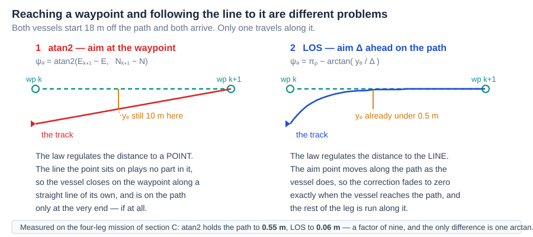

**Reading the figure**

| Element | Meaning |
|---|---|
| dashed green, both panels | the planned path — the line the vessel was asked to follow, from $\mathbf{p}_i^{\,n}$ to $\mathbf{p}_{i+1}^{\,n}$ |
| left, red track | the track under `atan2`: a straight line from wherever the vessel happens to be to the waypoint |
| right, blue track | the track under LOS: a curve that joins the path early and then runs along it |
| orange ticks | the cross-track error at a comparable point of the leg — 10 m against under 0.5 m |
| bottom strip | the same comparison as measured on the four-leg mission of section C |

- A vessel displaced from the path — by a corner, by a current, or simply by where it started — is *nearer the waypoint* than a vessel on the path. The `atan2` law therefore sees nothing wrong, and the vessel arrives from whatever direction it drifted into.
- For open water that is acceptable. For a survey line, a dredged channel, a cable route or a berth approach it is not: the mission specified a **path**, and the vehicle followed a **point**.

> [!note] This is a statement about the objective, not about tuning
> No choice of autopilot gain makes `atan2` follow the path, because the path does not appear anywhere in the law. Section C measures the gap on the same mission with the same autopilot: on leg 2, `atan2` holds the line to $0.547$ m and LOS to $0.060$ m, a factor of nine. Leg 1 is excluded because the vessel starts on it, already pointing along it, so both laws read zero and the comparison is empty.

### Where this week goes

Eleven sections is a lot to enter without a map. They answer four questions, in this order, and each one is forced by the answer before it.

| | Question | Sections |
|---|---|---|
| 1 | **What is the path, and where is the vessel relative to it?** Two waypoints give an angle; one rotation gives two errors | 4-2, 4-3 |
| 2 | **What heading closes that error?** The LOS law, what $\Delta$ trades away, and when to move to the next leg | 4-4, 4-5, 4-6 |
| 3 | **Why is that not enough?** In a current the law settles *beside* the path and stays there — with the heading error already zero | 4-7 |
| 4 | **Two ways to fix it.** ILOS invents the missing term; ALOS estimates it | 4-8, 4-9 |

Sections 4-10 and 4-11 then set the equations against the code, and point at what lies beyond straight legs.

**Everything after 4-7 exists because of one number**: $\Delta\tan\beta_c$, the offset the plain law is left holding. A reader short of time can go 4-2 → 4-3 → 4-4 → 4-7 and still have the argument.

## 4-2. The path is a straight leg between two waypoints

- A mission is a list of waypoints. The path is what runs **between** them, and this section reduces the active leg to the single number every later section uses: its direction.
- One notational matter has to be settled first, because three different frames appear in the same equation from here on.

> [!important] The notation of this week, and why every symbol carries a superscript
> From here on this week uses the notation of Fossen's TTK 4190 lecture notes and of the *Handbook of Marine Craft Hydrodynamics and Motion Control*, 2nd ed. (2021), §12.3. It is worth one paragraph, because the superscripts are not decoration.
>
> Three different frames appear in the same equation in this week, and a quantity is meaningless until its frame is named:
>
> | Frame | Written | What it is |
> |---|---|---|
> | $\{n\}$ | superscript $n$ | NED. North, East, Down. Does not move |
> | $\{p\}$ | superscript $p$ | the **path** frame. Its $x$ axis runs along the active leg |
> | $\{b\}$ | subscript $b$ | the hull. Its $x$ axis runs from stern to bow |
>
> - Waypoints are points in $\{n\}$: $\mathbf{p}_i^{\,n} = [\,x_i^n\ \ y_i^n\,]^\top$. The index is $i$, and the active leg runs from $\mathbf{p}_i^{\,n}$ to $\mathbf{p}_{i+1}^{\,n}$.
> - The vessel is at $\mathbf{p}^{\,n} = [\,x^n\ \ y^n\,]^\top$. In NED, $x$ **is** North and $y$ **is** East — the letters $x^n$ and $y^n$ are not used once a superscript is available.
> - The two errors are resolved in $\{p\}$, so they are written $x_e^{\,p}$ and $y_e^{\,p}$. Writing them without the superscript is the single most common way of confusing a cross-track error with an East error, and the two differ by $\pi_p$.
>
> **The code cannot carry superscripts.** MATLAB identifiers have no place to put them, so `_tools/crosstrack_err.m` returns `x_e` and `y_e`, and the Simulink signals are named the same way. Every such identifier means the path-frame quantity. §4-10 sets the equations and the code side by side.

- The mission is an ordered list $\mathbf{p}_1^{\,n}, \dots, \mathbf{p}_N^{\,n}$. Between consecutive waypoints the path is a straight line, and the **active leg** runs from $\mathbf{p}_i^{\,n}$ to $\mathbf{p}_{i+1}^{\,n}$.
- One number describes that leg — its direction measured from North:

$$
\boxed{\ \pi_p = \operatorname{atan2}\!\left(y_{i+1}^n - y_i^n,\; x_{i+1}^n - x_i^n\right)\ }
$$

| Symbol | Quantity | Unit / source |
|---|---|---|
| $\pi_p$ | path-tangential angle, from North, positive towards East | rad — recomputed whenever $i$ changes |
| $\mathbf{p}_i^{\,n}$ | the leg's origin, the waypoint most recently passed | m — `WP_N(k)`, `WP_E(k)` |
| $d_i$ | leg length $\lVert \mathbf{p}_{i+1}^{\,n} - \mathbf{p}_i^{\,n} \rVert$ | m — 60, 60, 60, 84.85 m this week |
| $x^n$ | number of waypoints | 5, giving 4 legs |

- The two-argument `atan2` and not `atan`: the leg may point into any of the four quadrants, and only the two-argument form separates North-East from South-West. The single-argument form would fold the third quadrant onto the first and send the vessel backwards along its own path.
- $\pi_p$ is constant on a leg. Every quantity downstream of it in this week — $x_e^{\,p}$, $y_e^{\,p}$, $\psi_d$ — changes continuously as the vessel moves, but $\pi_p$ changes only at a switch.

> [!note] Curved paths are deferred, and nothing here has to change for them
> Lekkas and Fossen (2014) replace the straight leg by a Hermite spline and $\pi_p$ by the spline's tangent angle at the closest point. Everything downstream of $\pi_p$ in this week — §4-3 through §4-9 — is unchanged by that substitution. §4-11 gives the reference.

## 4-3. Along-track and cross-track error, derived

- The leg defines a frame of its own: $\hat{\mathbf{t}}$ pointing along it and $\hat{\mathbf{n}}$ pointing to starboard of it. The whole of this section is **one rotation into that frame**, and both errors fall out of it together.

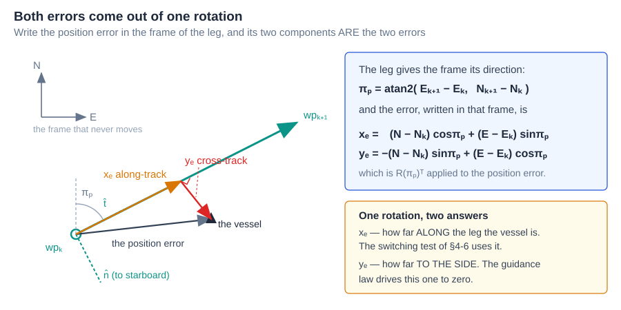

**Reading the figure**

| Element | Meaning |
|---|---|
| grey axes, upper left | NED — the frame that does not move |
| green line with arrow | the active leg, from $\mathbf{p}_i^{\,n}$ towards $\mathbf{p}_{i+1}^{\,n}$ |
| green dashed pair | $\hat{\mathbf{t}}$ along the leg and $\hat{\mathbf{n}}$ to starboard — the frame the leg defines |
| grey arrow | the position error $\mathbf{p} - \mathbf{p}_i^{\,n}$, expressed in NED |
| orange | its component along $\hat{\mathbf{t}}$ — the along-track error $x_e^{\,p}$ |
| red, with the right-angle mark | its component along $\hat{\mathbf{n}}$ — the cross-track error $y_e^{\,p}$ |
| blue panel | the same statement as algebra |
| amber panel | which of the two errors each part of the guidance system consumes |

### The derivation

Written in NED, the two unit vectors of the leg frame are

$$
\hat{\mathbf{t}} = \begin{bmatrix}\cos\pi_p \\[2pt] \sin\pi_p\end{bmatrix},
\qquad
\hat{\mathbf{n}} = \begin{bmatrix}-\sin\pi_p \\[2pt] \cos\pi_p\end{bmatrix}
$$

$\hat{\mathbf{t}}$ is a unit vector at angle $\pi_p$ from North, which is the leg's direction by the definition of §4-2. $\hat{\mathbf{n}}$ is $\hat{\mathbf{t}}$ turned by $+90°$, which in a North-East frame points to **starboard** of the leg. The two are orthonormal, so the pair is a basis and the decomposition below is unique.

The vessel at $\mathbf{p}^{\,n} = [\,x^n\ \ y^n\,]^\top$ has position error $\mathbf{p}^{\,n} - \mathbf{p}_i^{\,n}$ relative to the leg's origin. Its components in the leg frame are its projections onto the two basis vectors:

$$
x_e^{\,p} = \hat{\mathbf{t}}^\top\big(\mathbf{p}^{\,n} - \mathbf{p}_i^{\,n}\big),
\qquad
y_e^{\,p} = \hat{\mathbf{n}}^\top\big(\mathbf{p}^{\,n} - \mathbf{p}_i^{\,n}\big)
$$

Stacking the two projections turns them into one matrix product, and that matrix is the transpose of the planar rotation of Week 1 §1-4. Written with the frames named, it is the rotation **from** $\{p\}$ **to** $\{n\}$, transposed:

$$
\mathbf{R}_p^{\,n}(\pi_p) =
\begin{bmatrix} \cos\pi_p & -\sin\pi_p \\[2pt] \sin\pi_p & \cos\pi_p \end{bmatrix} \in SO(2)
$$

$$
\boxed{\
\begin{bmatrix} x_e^{\,p} \\[2pt] y_e^{\,p} \end{bmatrix}
= \mathbf{R}_p^{\,n}(\pi_p)^\top
\left(\begin{bmatrix} x^n \\[2pt] y^n \end{bmatrix} -
      \begin{bmatrix} x_i^n \\[2pt] y_i^n \end{bmatrix}\right)\ }
$$

Multiplied out, that is the pair most often quoted:

$$
\begin{aligned}
x_e^{\,p} &= \phantom{-}\big(x^n - x_i^n\big)\cos\pi_p + \big(y^n - y_i^n\big)\sin\pi_p\\[3pt]
y_e^{\,p} &= -\big(x^n - x_i^n\big)\sin\pi_p + \big(y^n - y_i^n\big)\cos\pi_p
\end{aligned}
$$

| Symbol | Quantity | Unit |
|---|---|---|
| $x_e^{\,p}$ | along-track error — how far **along** the leg the vessel has come | m |
| $y_e^{\,p}$ | cross-track error — how far **to the side** of the leg it is | m |
| $\mathbf{R}_p^{\,n}(\pi_p)$ | the planar rotation from the path frame $\{p\}$ to NED $\{n\}$ | — |
| $\mathbf{R}_p^{\,n}(\pi_p)^\top$ | its inverse, $\{n\}$ to $\{p\}$, because $\mathbf{R}$ is orthogonal | — |

- Written out, the two rows are exactly the expressions printed in the figure and coded in `_tools/crosstrack_err.m`:

$$
x_e^{\,p} = \ \ \,(N - x_i^n)\cos\pi_p + (E - y_i^n)\sin\pi_p
$$
$$
y_e^{\,p} = -(N - x_i^n)\sin\pi_p + (E - y_i^n)\cos\pi_p
$$

### Verification of the derived pair

| Check | Result |
|---|---|
| **Dimension** | both rows are metres times a dimensionless cosine — metres, as required |
| **Limit** $\mathbf{p} = \mathbf{p}_i^{\,n}$ | $x_e^{\,p} = y_e^{\,p} = 0$ — at the leg's origin both errors vanish |
| **Limit** $\mathbf{p} = \mathbf{p}_{i+1}^{\,n}$ | $x_e^{\,p} = d_k$, $y_e^{\,p} = 0$ — at the far end the vessel has run the whole leg and is on it |
| **Sign** | a point displaced by $+\varepsilon\hat{\mathbf{n}}$ gives $y_e^{\,p} = +\varepsilon$ — positive is to starboard |
| **Orthogonality** | $x_e^2 + y_e^2 = \lVert\mathbf{p}-\mathbf{p}_i^{\,n}\rVert^2$, since $\mathbf{R}^\top$ preserves length |
| **Source** | `_tools/verify_guidance.m` compares against MSS `crosstrackWpt.m` at eight test points; largest disagreement $0$, exactly |

### What each error is for

| | consumed by | because |
|---|---|---|
| $x_e^{\,p}$ | the **switching** logic of §4-6 | it says how much of the leg has been run, so $d_k - x_e^{\,p}$ is how much is left |
| $y_e^{\,p}$ | the **guidance law** of §4-4 and every law after it | it is the quantity that "follow the path" means to drive to zero |

- **The sign matters and is easy to get backwards.** $y_e^{\,p} > 0$ places the vessel to **starboard** of the leg, because $\{n\}$ is North-East-Down and a positive rotation carries North towards East. A positive $y_e^{\,p}$ must therefore be answered by turning to **port**, which is why every law in this week *subtracts* its correction from $\pi_p$. Getting this backwards produces a law that drives the vessel away from the path at a rate proportional to how far off it already is.

> [!warning] Two forms are in circulation and only one of them is safe
> MSS `crosstrack.m` obtains the same quantity by solving a $3\times3$ linear system whose coefficients contain $\tan\pi_p$. That is singular at $\pi_p = \pm 90°$ — a due-East or due-West leg, which is half the legs of any lawnmower survey pattern. The rotation form above contains no tangent and has no such point. MSS `crosstrackWpt.m` uses the rotation form, and this course follows it.

## 4-4. The LOS law, derived

- The idea is one sentence: **do not aim at the waypoint; aim at a point on the path a fixed distance ahead of the nearest point of the path.**
- The name is literal. The vessel steers along its line of sight to a point that is always on the path and always moving forward as the vessel moves.

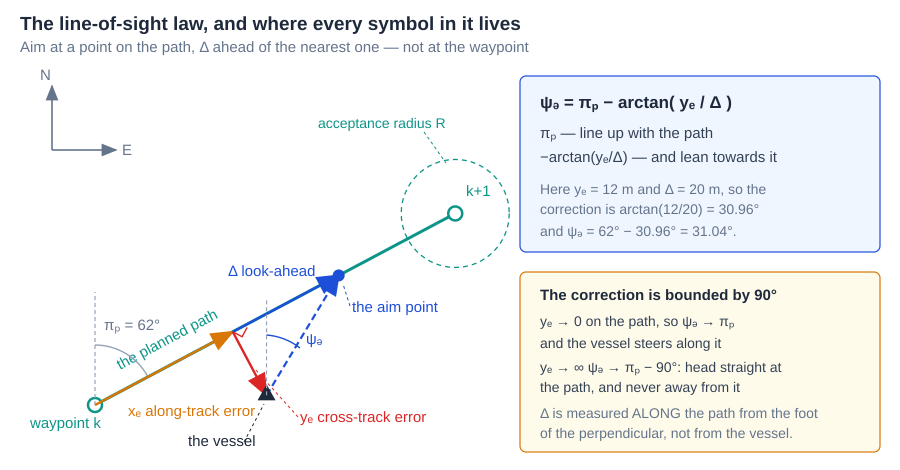

**Reading the figure**

| Element | Meaning |
|---|---|
| grey axes, upper left | NED, so that every angle in the figure is measured from North |
| black line, filled circles | the active leg, from $\mathbf{p}_i^{\,n}$ to $\mathbf{p}_{i+1}^{\,n}$ |
| grey dashed vertical, $x_n$ | North through the vessel — the reference every angle is measured from |
| grey arc, $\pi_p$ | the leg's direction from North |
| amber, from $\mathbf{p}_i^{\,n}$ | $x_e^{\,p}$, the along-track error, out to the foot of the perpendicular |
| red, with right-angle mark | $y_e^{\,p}$, the cross-track error — the perpendicular distance to the path |
| amber, beyond the foot | $\Delta$, laid off **along the path** from the foot of the perpendicular |
| violet filled circle | the aim point, at the far end of $\Delta$ |
| violet arrow, "LOS vector" | the line of sight from the vessel to the aim point |
| grey arc at the aim point | $\tan^{-1}(y_e^{p}/\Delta)$ — the correction, between the path and the line of sight |
| three arcs at the hull | $\psi$ where the bow points, $\chi$ where the vessel goes, $\chi_d$ where the law says to go |
| violet arc at the hull | $\beta_c$, the crab angle between $\psi$ and $\chi$ |
| grey dashed, lower right | the right-angle construction that makes $\Delta$ and $y_e^{p}$ the two legs of one triangle |

> [!note] This figure follows Fossen's own
> The layout and every symbol are those of Fossen's TTK 4190 lecture notes and of the *Handbook*, 2nd ed. (2021), §12.3, so that this course and the standard reference can be read against each other without translation. The geometry is computed by `_tools/w04_losgeo.m`, which checks that the perpendicular really is perpendicular and that the drawn line of sight really is at $\chi_d$ before it emits a single coordinate.

### The derivation

Let $F$ be the foot of the perpendicular from the vessel to the leg, and let the **aim point** $A$ lie a further distance $\Delta$ along the leg. Work in the path frame $\{p\}$ of §4-3, where the vessel sits at $(x_e^{\,p},\ y_e^{\,p})$ and, by construction, $F$ sits at $(x_e^{\,p},\ 0)$ and $A$ at $(x_e^{\,p} + \Delta,\ 0)$.

The vector from the vessel to the aim point, **in $\{p\}$**, is therefore

$$
A - P = \begin{bmatrix} (x_e^{\,p} + \Delta) - x_e^{\,p} \\[2pt] 0 - y_e^{\,p} \end{bmatrix}
      = \begin{bmatrix} \Delta \\[2pt] -y_e^{\,p} \end{bmatrix}
$$

Its direction, measured from the path's own $\hat{\mathbf{t}}$ axis, is

$$
\operatorname{atan2}\big(-y_e^{\,p},\ \Delta\big) = -\tan^{-1}\!\left(\frac{y_e^{\,p}}{\Delta}\right)
$$

where the two-argument form collapses to the one-argument form because $\Delta > 0$ always, so the vector never leaves the right half-plane of $\{p\}$. The path frame is itself rotated by $\pi_p$ from North. Adding the two angles converts the direction into $\{n\}$ and gives the law:

$$
\boxed{\ \chi_d = \pi_p - \tan^{-1}\!\left(\frac{y_e^{\,p}}{\Delta}\right),
\qquad K_p = \frac{1}{\Delta}\ }
$$

| Symbol | Quantity | Unit | Value and origin |
|---|---|---|---|
| $\pi_p$ | path-tangential angle | rad | §4-2, from the two waypoints |
| $y_e^{\,p}$ | cross-track error, resolved in $\{p\}$ | m | §4-3, from the rotation |
| $\Delta$ | look-ahead distance, measured **along the path** | m | $8$ m — chosen in §4-5, justified by the sweep of section E |
| $K_p$ | proportional gain, $1/\Delta$ | $\text{m}^{-1}$ | **not free** — fixed by $\Delta$. §4-8 names it, and it is the same number |
| $y_e^{\,p}/\Delta$ | argument of the arctan | — | dimensionless, as the argument of a trigonometric function must be |
| $\chi_d$ | commanded **course** | rad | what the law produces |
| $\psi_d$ | commanded **heading** | rad | what this course sends to the Week 3 autopilot |

> [!important] The law commands a course; this course commands a heading
> Fossen writes the law with $\chi_d$ on the left, because the line of sight is the direction the vessel should **travel** in. What Week 3 built is a **heading** autopilot, so from here on this course writes
>
> $$\psi_d = \pi_p - \tan^{-1}\!\left(\frac{y_e^{\,p}}{\Delta}\right)$$
>
> — the same expression, with $\psi_d$ in place of $\chi_d$. The substitution is exact when the crab angle $\beta_c$ is zero, and MSS ships both variants for the same reason: `LOSchi.m` commands $\chi_d$ and `LOSpsi.m` commands $\psi_d$.
> **The substitution is not free, and this week measures its price.** §4-7 shows that using $\psi_d$ in a current leaves the vessel permanently $\Delta\tan\beta_c$ to one side of the path; §4-8 and §4-9 are two ways of paying it back.

- Read the law as two terms with two jobs. $\pi_p$ says *line up with the path*. The arctan says *and lean towards it, by an amount that grows with how far off it the vessel is*.
- The figure's own arithmetic is the smallest possible worked example: $y_e^{\,p} = 12$ m and $\Delta = 20$ m give a correction of $\arctan(12/20) = 30.96°$, so $\psi_d = 62° - 30.96° = 31.04°$. The vessel is to starboard, so it is commanded to port, and by less than $90°$.

### The limits, and why they are the right ones

| Limit | Result | Interpretation |
|---|---|---|
| $y_e^{\,p} \to 0$ | $\psi_d \to \pi_p$ | on the path, steer along it; the correction vanishes **smoothly**, so there is no chatter and no limit cycle at convergence |
| $y_e^{\,p} \to +\infty$ | $\psi_d \to \pi_p - 90°$ | far to starboard: head **straight at** the path, perpendicular to it |
| $y_e^{\,p} \to -\infty$ | $\psi_d \to \pi_p + 90°$ | far to port: the mirror image |
| $\Delta \to 0^+$ | $\psi_d \to \pi_p \mp 90°$ for every $y_e^{\,p} \ne 0$ | the law degenerates to bang-bang — full correction at any error, however small |
| $\Delta \to \infty$ | $\psi_d \to \pi_p$ for every finite $y_e^{\,p}$ | the law stops correcting at all and becomes a heading hold |

- The two infinite limits are the reason the law is safe to use from any initial condition: because $\lvert\arctan(\cdot)\rvert < 90°$ strictly, **the commanded heading is never more than $90°$ off the path direction**. However far off the path the vessel starts, it is never commanded to turn away from it. Comparable laws built on $\psi_d = \pi_p - K y_e^{\,p}$ have no such bound and can command a full reversal.
- The two degenerate limits are the two ends of §4-5's trade, and section E measures both of them.

> [!note] $\Delta$ is measured along the path, not from the vessel
> The aim point sits $\Delta$ ahead of the **foot of the perpendicular**, not at distance $\Delta$ from the boat. The distance from the boat to the aim point is $\sqrt{\Delta^2 + y_e^2}$, which is larger and which depends on $y_e^{\,p}$. Placing the aim point at a fixed range from the vessel instead makes the correction depend on $y_e^{\,p}$ twice over and destroys the clean limits above.

### Verification of the LOS law

| Check | How, and result |
|---|---|
| **Dimension** | $y_e^{\,p}/\Delta$ is m/m; $\arctan$ of it is rad; $\pi_p$ is rad — the sum is an angle |
| **Limits** | the five rows of the table above, all checked numerically in `_tools/verify_guidance.m` |
| **Sign** | $y_e^{\,p} = +1$ m, $\Delta = 8$ m, $\pi_p = 0$ gives $\psi_d = -7.125°$ — starboard error, port command |
| **Numeric** | against MSS `LOSchi.m` on eight configurations; largest disagreement $0$ |
| **Source** | Fossen, *Handbook of Marine Craft Hydrodynamics and Motion Control*, 2nd ed., §12.3.1 |

## 4-5. What the look-ahead distance does

- $\Delta$ is the only free number in the LOS law, and it fixes a **trade between arriving quickly and arriving smoothly**.

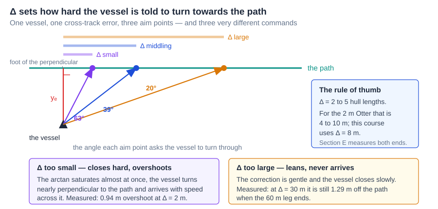

**Reading the figure**

| Element | Meaning |
|---|---|
| three coloured bars, top | three values of $\Delta$, drawn to scale against each other |
| green line | the path; the vessel is one and the same in all three cases |
| red | the cross-track error, identical in all three cases |
| three filled circles | the aim point each $\Delta$ produces, all on the path |
| three rays with arrows | the commanded heading each aim point produces |
| $63°$, $39°$, $20°$ | how far the vessel is told to turn — **for one and the same cross-track error** |
| blue panel | the rule of thumb and this course's value |
| violet and amber panels | the two failure modes, with the numbers section E measures |

- The three angles are the whole content of the figure: **the error has not changed, only $\Delta$ has, and the command has changed by a factor of three.**

| $\Delta$ | behaviour of the correction | how it fails |
|---|---|---|
| small | saturates almost immediately, approaching $90°$ | closes hard and **overshoots** — measured $0.939$ m of overshoot at $\Delta = 2$ m |
| middling | proportional over the range of errors that occur | the intended regime |
| large | gentle at every $y_e^{\,p}$ | **never arrives** — at $\Delta = 30$ m the vessel has not reached the first leg before it ends |

- Measured in section E on the same mission, autopilot and current:

| $\Delta$ [m] | $\Delta/L$ | settling distance [m] | overshoot [m] | settled $\lvert y_e^{\,p}\rvert$ [m] |
|---|---|---|---|---|
| 2 | 1.0 | 12.82 | 0.939 | 0.0134 |
| 4 | 2.0 | 20.06 | 0.630 | 0.0559 |
| 8 | 4.0 | 35.82 | 0.473 | 0.2321 |
| 16 | 8.0 | never settles on leg 1 | 0.415 | 0.2796 |
| 30 | 15.0 | never settles on leg 1 | $-0.679$ | 1.2871 |

- The vessel starts $8$ m off the path in every run, and "settling distance" is how far North it had travelled when $\lvert y_e^{\,p}\rvert$ last left the $0.4$ m band. The two largest look-aheads never enter that band before the $60$ m leg ends, so **the table reports no settling distance for them** rather than quoting the leg length as though it were one.
- Settling distance grows monotonically with $\Delta$ and overshoot falls monotonically with it: there is no value that is best at both, which is what makes this a trade rather than a tuning problem with an answer.
- The last column is the third failure. At $\Delta = 30$ m the vessel is still $1.29$ m off the path at the end of the leg — **the law is no longer following the path, only leaning towards it.** A negative overshoot in that row means the same thing: the vessel never crossed the path at all.
- The common rule of thumb is $\Delta$ between 2 and 5 hull lengths. The Otter is $2$ m long, so that range is $4$ to $10$ m. This course uses $\Delta = 8$ m — **and section E is the justification, with the rule of thumb only as a sanity check.**

> [!tip] The third cost of a large $\Delta$ appears in §4-7
> Besides slow convergence, a large $\Delta$ multiplies the steady offset that a current leaves. That is a stronger argument against large $\Delta$ than slow settling is, and it does not become visible until the current is switched on.

## 4-6. Deciding that a waypoint has been passed

- A leg has to end. Something must decide when, and two criteria are in common use that are **not the same criterion**.

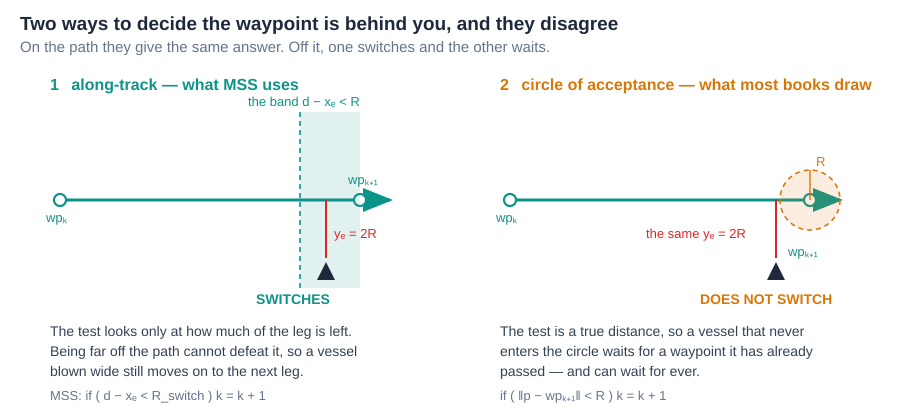

**Reading the figure**

| Element | Meaning |
|---|---|
| left panel, teal band | along-track: the band of positions where the **remaining** along-track distance $d_k - x_e^{\,p}$ is below $R$ |
| right panel, amber circle | circle of acceptance: the disc where the **true distance** to $\mathbf{p}_{i+1}^{\,n}$ is below $R$ |
| black hull, both panels | the same vessel, at the same place relative to the leg, with $y_e^{\,p} = 2R$ |
| verdict lines | the along-track test switches; the circle test does not |
| grey code lines | the two tests as they are actually written |

$$
\text{along-track:}\quad d_k - x_e^{\,p} < R
\qquad\qquad
\text{circle of acceptance:}\quad \lVert \mathbf{p} - \mathbf{p}_{i+1}^{\,n}\rVert < R
$$

| Symbol | Quantity | Unit / value |
|---|---|---|
| $d_k$ | length of the active leg | m — 60 m for legs 1–3 this week |
| $x_e^{\,p}$ | along-track error of §4-3 | m |
| $d_k - x_e^{\,p}$ | along-track distance **remaining** on the leg | m |
| $R$ | switching radius | m — `R_switch`, $5$ m this week |

### Where the two criteria part company

- **On the path they agree**, because $y_e^{\,p} = 0$ makes $\lVert\mathbf{p}-\mathbf{p}_{i+1}^{\,n}\rVert = d_k - x_e^{\,p}$ exactly. Off it they do not, because

$$
\lVert \mathbf{p} - \mathbf{p}_{i+1}^{\,n}\rVert = \sqrt{(d_k - x_e^{\,p})^2 + y_e^2} \;\ge\; d_k - x_e^{\,p}
$$

- The true distance is never smaller than the along-track remainder, so **the circle test is always the stricter of the two**, and it is stricter by an amount that grows with $y_e^{\,p}$. The figure's vessel has $d_k - x_e^{\,p} < R$ but $y_e^{\,p} = 2R$, so its true distance is at least $2R$ and the circle test fails.
- Section F puts numbers on the figure. A vessel $4.50$ m short of waypoint 2 along the leg and $10.0$ m to the side of it has a true distance of $10.97$ m: the along-track test passes at $4.50 < 5$, and the circle test fails by more than a factor of two.
- The along-track test is the safer one for exactly this reason: it cannot be defeated by being far from the path. A vessel blown wide of a waypoint **never enters that waypoint's circle**, and a mission that waits for it waits for ever.
- This course uses the along-track test by default (`sw_mode = 1`), and section F runs both so that the difference can be seen rather than argued.

### The upper bound on $R$

- $R$ has a hard limit that has nothing to do with tuning:

$$
R < \min_k d_k
$$

- If $R$ exceeded the shortest leg, the switching test for that leg would already be satisfied at the moment the leg became active — before the vessel had travelled any of it. The waypoint would be skipped without being approached, and with several short legs in a row the vehicle could skip an arbitrary number of them.
- `_tools/wp_switch.m` raises an error on it rather than silently misbehaving, as MSS does. This week's shortest leg is $60$ m and $R = 5$ m, which is comfortable.

### What $R$ costs

Measured in section F on the same mission:

| $R$ [m] | corner cut [m] | switch times [s] |
|---|---|---|
| 2 | 0.44 | 76, 154, 232 |
| 5 | 2.26 | 72, 147, 222 |
| 15 | 7.02 | 59, 128, 196 |
| 25 | 9.62 | 46, 111, 176 |

- Corner cut grows with $R$ and switch times fall: a large $R$ turns early and rounds the corner, a small $R$ runs the leg to its end and turns sharply. The choice is a statement about whether the mission cares more about corner accuracy or about turn rate.

> [!warning] A documentation slip in MSS, worth meeting once
> The help text of `ILOSpsi.m` says that the next waypoint is taken when "the along-track distance $x_e^{\,p}$ is less than R_switch". The code tests `d - x_e < R_switch`, which is the distance **remaining**, not the distance travelled. The code is the sensible one and the sentence is wrong. This is precisely why the standing rule of this course is to check an equation against the **source**, not against the description of the source.

### The end of the mission

- On the last leg there is no $\mathbf{p}_{i+2}^{\,n}$ to switch to, and the two implementations differ.
- The **2021** MSS holds the final waypoint as *both* ends of the leg. Then $y_{i+1}^n - y_i^n = x_{i+1}^n - x_i^n = 0$, so $\pi_p = \operatorname{atan2}(0,0) = 0$ by the IEEE convention, and the vessel is silently commanded due North for ever.
- **Fossen fixed this in the 2023 release.** `ALOSpsi.m` extends the last leg along its own bearing instead:

```matlab
else                            % else, continue with last bearing
    bearing = atan2((wpt.pos.y(n)-wpt.pos.y(n-1)), (wpt.pos.x(n)-wpt.pos.x(n-1)));
    R = 1e10;
    xk_next = wpt.pos.x(n) + R * cos(bearing);
    yk_next = wpt.pos.y(n) + R * sin(bearing);
end
```

- This course does the same thing by a different route: it stops the leg index at $n-1$ and keeps the last leg active, so the vessel continues along its extension. The two give the same track.
- **Neither of these is a mission-termination policy.** A real vehicle needs one — hold station at the last waypoint, loiter around it, or stop the propellers — and the choice belongs to the mission, not to the guidance law. Week 7 puts a Stateflow chart in charge of it.

## 4-7. Heading is not course — the debt from Week 3

- Week 3 §3-4 measured the crab angle and warned that a path-following law would eventually pay for it. This section is that bill, and it is the reason the two remaining laws of this week exist.
- LOS commands a **heading**, and the autopilot delivers that heading faithfully. But the vessel travels along its **course**, which differs from its heading by the crab angle:

$$
\chi = \psi + \beta_c, \qquad \beta_c = \operatorname{atan2}(v,\,u)
$$

| Symbol | Quantity | Unit |
|---|---|---|
| $\psi$ | heading — where the bow points | rad |
| $\chi$ | course — the direction the vessel actually moves over ground | rad |
| $\beta_c$ | crab angle, over ground, from the Week 3 definition | rad |
| $U$ | speed over ground, $\sqrt{u^2+v^2}$ | m/s |

### The cross-track error dynamics

- Before the offset can be derived, the rate of change of $y_e^{\,p}$ is needed, and it is used again in §4-8 and §4-9.
- The vessel's velocity over ground has magnitude $U$ and direction $\chi$, both measured in NED. Its component along $\hat{\mathbf{n}}$ — which is $\hat{\mathbf{t}}$ turned by $90°$, so the angle between the velocity and $\hat{\mathbf{n}}$ is $\chi - \pi_p - 90°$ — gives the rate at which the cross-track error grows:

$$
\boxed{\ \dot y_e^{\,p} = U\sin(\chi - \pi_p)\ }
$$

| Check | Result |
|---|---|
| **Dimension** | m/s on both sides |
| **Limit** $\chi = \pi_p$ | $\dot y_e^{\,p} = 0$ — travelling along the path, the offset is frozen at whatever it is |
| **Limit** $\chi = \pi_p + 90°$ | $\dot y_e^{\,p} = U$ — travelling straight to starboard, the offset grows at full speed |
| **Sign** | $\chi > \pi_p$ turns the velocity towards starboard and increases $y_e^{\,p}$, consistent with §4-3 |

- Note what this equation contains: $U$ and $\chi$, both **over ground**. The current has already been absorbed into them, which is why no current term appears explicitly.

### The steady offset, derived

In steady state on a straight leg the cross-track error has stopped changing, which by the equation above requires the **course** to lie along the path:

$$
\dot y_e^{\,p} = 0 \quad\Longrightarrow\quad \sin(\chi - \pi_p) = 0 \quad\Longrightarrow\quad \chi = \pi_p
$$

The autopilot has by then delivered its command, $\psi = \psi_d$, and $\psi_d$ is the LOS law of §4-4. Substituting both:

$$
\pi_p \;=\; \chi \;=\; \psi + \beta_c \;=\; \psi_d + \beta_c \;=\; \pi_p - \arctan\!\left(\frac{y_e^{\,p}}{\Delta}\right) + \beta_c
$$

The $\pi_p$ cancels from both sides — which is the point, because it means the result does not depend on which leg the vessel is on:

$$
\arctan\!\left(\frac{y_e^{\,p}}{\Delta}\right) = \beta_c
$$

and therefore

$$
\boxed{\ y_{e,ss}^{\,p} = \Delta\,\tan\beta_c\ }
$$

| Reading | |
|---|---|
| **What it says** | the vessel settles **parallel to the path and beside it**, offset by an amount proportional to $\Delta$ |
| **Why it is not a tuning failure** | the loop is doing exactly what it was asked. It is holding $\psi_d$ to the last decimal, and $\psi_d$ was computed by a law in which $\beta_c$ never appears |
| **Why more autopilot gain does not help** | the heading error is already zero. There is nothing left for the autopilot to act on |
| **The third cost of a large $\Delta$** | the offset is *linear* in $\Delta$: doubling the look-ahead doubles the steady error. §4-5's trade has a third term after all |

### Verification against measurement

Section G sweeps the current speed with everything else held fixed and compares the measured settled offset against the prediction:

| $V_c$ [m/s] | $\beta_c$ [deg] | measured $y_e^{\,p}$ [m] | $\Delta\tan\beta_c$ [m] | difference [m] |
|---|---|---|---|---|
| 0.0 | $-0.10$ | $-0.014$ | $-0.013$ | 0.001 |
| 0.1 | 5.10 | 0.713 | 0.714 | 0.001 |
| 0.2 | 10.37 | 1.463 | 1.464 | 0.001 |
| 0.3 | 15.74 | 2.253 | 2.254 | 0.001 |
| 0.4 | 21.26 | 3.111 | 3.112 | 0.001 |
| 0.5 | 27.38 | 4.145 | 4.143 | 0.002 |

- The largest disagreement across the whole sweep is $0.002$ m on an offset of $4.1$ m — better than one part in two thousand. The derivation is not an approximation; it is what the loop does.
- The remainder of this week is two different ways of removing this offset. §4-8 integrates it away without ever learning what caused it. §4-9 estimates the cause and cancels it directly.

### Three answers, in one picture

- Before either derivation, it is worth seeing what the two remaining laws are *for*. The figure below is the whole of §4-8 and §4-9 with no algebra in it.

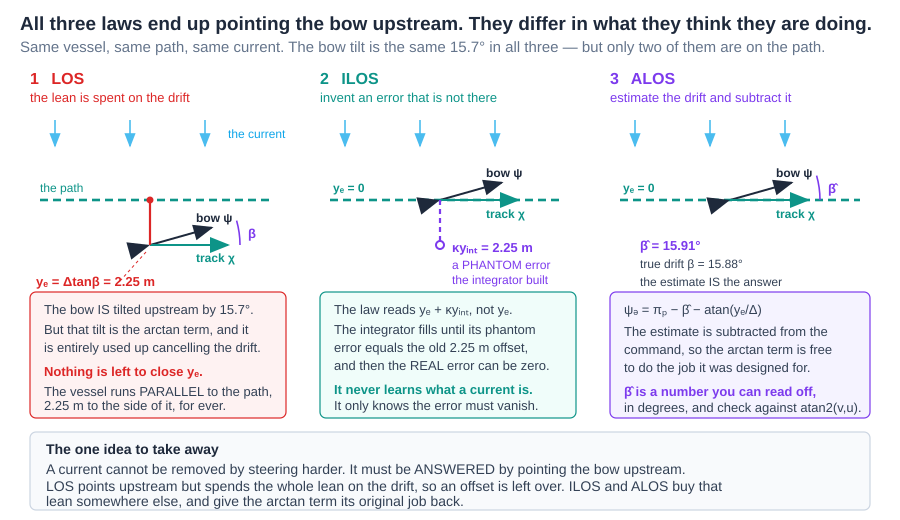

**Reading the figure**

| Element | Meaning |
|---|---|
| blue arrows, all three panels | the current, identical in each |
| dashed green line | the path |
| black hull and arrow | where the **bow** points — the heading $\psi$ |
| solid green arrow | where the vessel actually **travels** — the course $\chi$ |
| violet arc | the angle between them, the crab angle |
| panel 1, red line | the steady offset $\Delta\tan\beta = 2.25$ m that plain LOS is left holding |
| panel 2, violet dashed line | the **phantom** cross-track error the ILOS integrator has built. There is no vessel there |
| panel 3, violet arc | the estimate $\hat\beta$, subtracted from the command |

**What the figure says**

One vessel, one path, one current, three guidance laws. Each panel answers the same question: where does the bow end up pointing, and is the vessel on the path?

Start with what all three have in common. The bow is tilted upstream by $15.7°$ in **every** panel. That tilt is not a choice any of the laws made — it is the only way to travel along a line while water pushes sideways, so any law that works at all must produce it. Comparing the three laws means comparing *how each one pays for the same tilt*.

LOS cannot pay for it. It has exactly one way to tilt the bow, the $\arctan(y_e^{\,p}/\Delta)$ term, and spending that term on cancelling the drift leaves nothing to close the gap with. The vessel ends up parallel to the path and $2.25$ m beside it, permanently. **The law is not short of authority; it is short of terms.**

ILOS buys a second term with an integrator, placed **inside** the same arctan. Once the integral has grown to $\kappa y_{int} = 2.25$ m, the law is being told there is a $2.25$ m error at a moment when the vessel is exactly on the path — so it holds the bow tilted while the true error sits at zero. **The integrator is a lie the law tells itself, and the lie is exactly the size of the truth it replaced.**

ALOS buys its second term differently, **outside** the arctan, by subtracting an estimate of the drift angle straight from the command. The bow tilts by $\hat\beta$ and the arctan term gets its original job back. Nothing is invented; the disturbance is estimated and removed.

Both end with the same picture — on the path, bow upstream — so the outcome does not separate them. What separates them is the state each carries. ILOS carries $7.52$, a number in seconds that means nothing on its own. ALOS carries $15.91°$ against a true crab angle of $15.88°$. **Only one of those can be checked against a measurement**, and that is the practical difference between the two laws.

> [!tip] If only one sentence from this week is remembered
> A current is not resisted, it is **answered**. The vessel must point upstream, and the three laws differ only in where they find the authority to do it.

### The same three laws, as equations

- The figure above shows what the three laws *achieve*. This one shows how they *differ*, and the difference turns out to be a single structural choice.

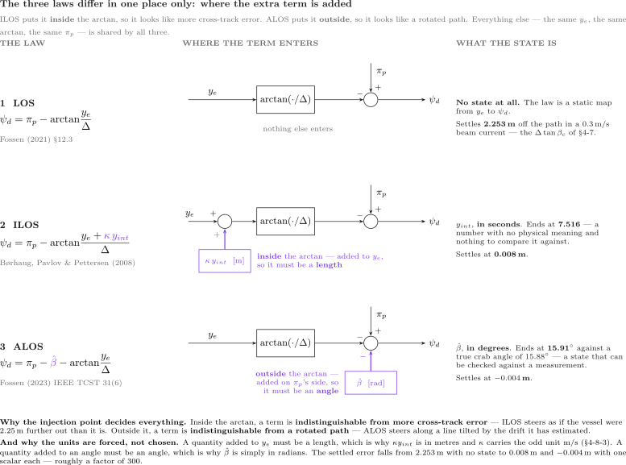

**Reading the figure**

| Element | Meaning |
|---|---|
| left column | the law itself, with the term that distinguishes it printed in violet |
| middle column | the same law as a signal path: $y_e^{\,p}$ enters, the arctan acts, $\pi_p$ is added, $\psi_d$ leaves |
| violet arrow | where the extra state is injected — **into the arctan block** for ILOS, **into the summing junction** for ALOS |
| right column | what that state physically is, and the settled error it produces |

**What the figure says**

Three laws drawn on one skeleton. Every row has the same $y_e^{\,p}$, the same arctan and the same $\pi_p$; only the violet arrow moves. That is the point of drawing them this way — the difference between the three is one arrow, not three algorithms.

What the arrow buys is large. Settled cross-track error falls from $2.253$ m with no extra state to $0.008$ m and $-0.004$ m with one scalar each — **roughly a factor of three hundred**, from adding a single number to the law.

Where that number enters is the whole of §4-8 and §4-9:

- **Inside** the arctan, the added quantity reaches $y_e^{\,p}$ before the nonlinearity sees it, so the law **cannot tell it apart from real cross-track error**. ILOS therefore steers as though the vessel were $2.25$ m further off the line than it is.
- **Outside** the arctan, the added quantity lands on $\pi_p$'s side of the sum, so the law **cannot tell it apart from a rotated path**. ALOS therefore steers as though following a line tilted by the drift it has estimated.

That single distinction also settles the unit puzzle of §4-8-3, which otherwise looks arbitrary. A quantity added to $y_e^{\,p}$ has to be a **length**, which is why $\kappa y_{int}$ is in metres and $\kappa$ carries the odd unit of m/s. A quantity added to an angle has to be an **angle**, which is why $\hat\beta$ is simply in radians. **The units are not a convention someone chose; they are forced by where the term enters.**

## 4-8. ILOS — integral line of sight, derived

> [!important] Sections 4-8 and 4-9 are worked to a different standard
> These are the two advanced laws of the course, and for them **every equation and every parameter is derived rather than quoted**. Each section gives the error dynamics first, then the reason for the particular Lyapunov function and the particular weight in it, then the derivative expanded line by line with nothing skipped, then the point at which the update law is *forced* rather than chosen, then a table of every parameter with its unit, and finally the assumptions and what is lost when they fail.

### How this section is laid out

Five questions, in this order. Nothing later depends on skipping anything earlier.

| | Question | Where |
|---|---|---|
| 1 | **Why is a new law needed?** What plain LOS cannot do, measured | §4-8-1 |
| 2 | **What is the idea?** One sentence, before any algebra | §4-8-1a |
| 3 | **What is the law, and where does it come from?** | §4-8-2, §4-8-4 to §4-8-6 |
| 4 | **How is it applied?** Every parameter, with its unit and its source | §4-8-3, §4-8-8 |
| 5 | **What does it achieve, and what does it cost?** | §4-8-5a, §4-8-7 |

### 4-8-1. Why a new law is needed at all

Plain LOS is not badly tuned, and it is not badly implemented. It is doing exactly what it was asked to do, and the result is still wrong. That is the situation this section starts from, and it is worth stating in three steps.

- **The measurement.** Section 4-7 ran plain LOS in a $0.3$ m/s beam current. The vessel settled **$2.253$ m to one side of the path** and stayed there for the rest of the run. It did not oscillate and it did not drift further; it simply held station beside the line it was asked to follow.
- **The reason more gain cannot help.** At that steady state the heading error is **already zero**. The autopilot is holding $\psi$ on $\psi_d$ to the last decimal. There is no error left anywhere in the loop for a larger gain to act on, so raising $K_p$ or $K_d$ in the autopilot changes nothing at all.
- **What is actually missing.** To travel along a line while water pushes the hull sideways, the bow must be tilted **upstream** by the crab angle $\beta_c$. Plain LOS has exactly one term that can tilt the bow, namely $\arctan(y_e^{\,p}/\Delta)$, and once that term is spent producing the tilt it is no longer available to close the remaining gap. **The law is not short of authority; it is short of terms.**

The classical fix for a steady offset is an integrator, and the classical failure of that fix is windup. The law of this section does both at once: it puts the integrator **inside the arctan**, which turns out to make the anti-windup part of the law rather than something bolted on afterwards.

### 4-8-1a. The idea, in one sentence

> **ILOS invents a cross-track error that is not there, of exactly the size needed to keep the bow tilted upstream once the real error has reached zero.**

That is the whole of it. The arctan is left untouched and is still the only thing that tilts the bow; what changes is *what the arctan is told*. Section 4-8-2 turns the sentence into an equation, and §4-8-5 shows that the invented error settles at precisely $\Delta\tan\beta_c$ — the same number the plain law was stuck at, now carried by the integrator instead of by the vessel's position.

### 4-8-2. The law

Børhaug, Pavlov and Pettersen (2008) replace the LOS argument by a proportional-plus-integral combination:

$$
\boxed{\ \psi_d = \pi_p - \arctan\!\big(K_p\,y_e^{\,p} + K_i\,y_{int}\big),
\qquad K_p = \frac{1}{\Delta},\quad K_i = \kappa K_p\ }
$$

$$
\boxed{\ \dot y_{int} = \frac{\Delta\, y_e^{\,p}}{\Delta^2 + \big(y_e^{\,p} + \kappa\,y_{int}\big)^2}\ }
$$

- **Where $K_p = 1/\Delta$ comes from.** It is not a new gain. The plain LOS law of §4-4 is $\psi_d = \pi_p - \arctan(y_e^{\,p}/\Delta)$, and writing $y_e^{\,p}/\Delta$ as $K_p y_e^{\,p}$ merely names the coefficient. The proportional gain of *every* LOS law in this week is $1/\Delta$, in units of $\text{m}^{-1}$, and §4-5's trade is therefore a statement about a proportional gain.
- **Where $K_i = \kappa K_p$ comes from.** Writing the integral gain as a multiple of the proportional gain makes $\kappa$ the single tuning number, and it makes the whole argument of the arctan collapse to

$$
K_p y_e^{\,p} + K_i y_{int} = \frac{y_e^{\,p} + \kappa\,y_{int}}{\Delta}
$$

which is the same $y_e^{\,p}/\Delta$ as before with $y_e^{\,p}$ replaced by $y_e^{\,p} + \kappa y_{int}$. **The integral term acts as a fictitious extra cross-track error**, and that is the cleanest way to hold the law in mind. Write

$$
a \;\triangleq\; y_e^{\,p} + \kappa\,y_{int}, \qquad D \;\triangleq\; \sqrt{\Delta^2 + a^2}
$$

so that the law is $\psi_d = \pi_p - \arctan(a/\Delta)$ and the update is $\dot y_{int} = \Delta y_e^{\,p}/D^2$.

### 4-8-3. Every parameter, with its unit

| Symbol | Quantity | Unit | Where it comes from |
|---|---|---|---|
| $\Delta$ | look-ahead distance | m | §4-5; $8$ m, from the sweep of section E |
| $K_p$ | proportional gain, $1/\Delta$ | $\text{m}^{-1}$ | **not free** — fixed by $\Delta$ |
| $\kappa$ | integral gain constant | **m/s** | §4-8-7; $0.3$ m/s, from the sweep of section H |
| $K_i$ | integral gain, $\kappa/\Delta$ | $\text{s}^{-1}$ | **not free** — fixed by $\Delta$ and $\kappa$ |
| $y_{int}$ | integral state | **s** | a state of the guidance block |
| $a$ | $y_e^{\,p} + \kappa y_{int}$ | m | the effective cross-track error |
| $D$ | $\sqrt{\Delta^2 + a^2}$ | m | distance from vessel to aim point, with $a$ in place of $y_e^{\,p}$ |

> [!warning] The units of $\kappa$ and $y_{int}$ are not what most readers assume
> $\dot y_{int} = \Delta y_e^{\,p}/(\Delta^2+a^2)$ has metres times metres over metres squared, so **$\dot y_{int}$ is dimensionless** and $y_{int}$ carries the unit of **seconds**. For $\kappa y_{int}$ to be a length, $\kappa$ must therefore be a **speed**, in m/s.
> The course-angle sibling `ILOSchi.m` normalises differently — $\dot y_{int} = U y_e^{\,p} / \sqrt{\Delta^2 + a^2}$, which is $(\text{m/s})\cdot\text{m}/\text{m} = \text{m/s}$ — so there $y_{int}$ is a **length** and $\kappa$ is **dimensionless**. The same symbol $\kappa$ means two different physical quantities in two files of the same toolbox. A value of $\kappa$ carried from one to the other is not merely mistuned, it is dimensionally wrong. §4-8-6 explains why the two normalisations exist.

### 4-8-4. Why the denominator has that form — the anti-windup is in the law

- Compare the update with a plain integrator, $\dot y_{int} = y_e^{\,p}$. The ILOS update is that plain integrator multiplied by a scaling factor:

$$
\dot y_{int} = \underbrace{y_e^{\,p}}_{\text{plain integral}} \times \underbrace{\frac{\Delta}{\Delta^2 + a^2}}_{\text{the scaling}}
$$

- The scaling depends on $a$, and $a$ is **exactly the argument of the arctan in the law**. That is the whole design: the integrator is throttled by how saturated the guidance law is.

| regime | $\lvert a\rvert$ against $\Delta$ | scaling | behaviour |
|---|---|---|---|
| linear | $\lvert a\rvert \ll \Delta$ | $\to 1/\Delta$ | a plain integrator with gain $1/\Delta$ |
| knee | $\lvert a\rvert = \Delta$ | $1/(2\Delta)$ | half rate — the arctan is at $45°$ |
| saturated | $\lvert a\rvert \gg \Delta$ | $\to \Delta/a^2$ | the integrator all but stops |

Computed for $\Delta = 8$ m:

| $\lvert a\rvert/\Delta$ | scaling | as a fraction of $1/\Delta$ |
|---|---|---|
| 0.01 | 0.12499 | 0.9999 |
| 0.10 | 0.12376 | 0.9901 |
| 1.00 | 0.06250 | 0.5000 |
| 5.00 | 0.00481 | 0.0385 |
| 20.00 | 0.00031 | 0.0025 |

- **This is the textbook definition of anti-windup**, and it arrives without a saturation block, without a clamp, and without a back-calculation gain. Week 2 §F built anti-windup by hand for the surge integrator, with a limiter and a feedback path; here the same effect is a property of the equation.
- The rate is also bounded. With $y_{int}$ following $y_e^{\,p}$ in sign, as it does in operation,

$$
\max_{y_e^{\,p}}\ \frac{\Delta\,y_e^{\,p}}{\Delta^2 + y_e^2} = \frac{1}{2}
\quad\text{at}\quad y_e^{\,p} = \Delta
$$

verified numerically as $0.500000$. The integral state can never run away faster than half a second per second, whatever the cross-track error.

### 4-8-5. The equilibrium — where the offset goes

- Set both derivatives to zero. The integrator condition comes first and it is decisive:

$$
\dot y_{int} = \frac{\Delta\,y_e^{\,p}}{D^2} = 0
\quad\Longrightarrow\quad
y_e^{\,p} = 0
$$

because $\Delta > 0$ and $D^2 \ge \Delta^2 > 0$, so the fraction vanishes only through its numerator. **The integrator has no equilibrium other than zero cross-track error.** This one line is the entire reason for adding it, and it holds regardless of $\kappa$, $\Delta$, the current, or the vessel.

- Now the position condition. From §4-7, $\dot y_e^{\,p} = 0$ requires $\chi = \pi_p$, and $\chi = \psi_d + \beta_c$ once the autopilot has converged:

$$
\pi_p = \pi_p - \arctan\!\left(\frac{y_e^{\,p} + \kappa y_{int}}{\Delta}\right) + \beta_c
$$

With $y_e^{\,p} = 0$ from the first condition,

$$
\arctan\!\left(\frac{\kappa\,y_{int}^{eq}}{\Delta}\right) = \beta_c
\quad\Longrightarrow\quad
\boxed{\ y_{int}^{eq} = \frac{\Delta\tan\beta_c}{\kappa}\ }
$$

- Read the last line against §4-7. The quantity $\kappa y_{int}^{eq} = \Delta\tan\beta_c$ is **exactly the offset that plain LOS was left holding**. The integrator does not remove the crab angle and does not know it exists; it accumulates until the fictitious cross-track error it contributes equals the real one that the crab angle was producing, and from then on the real one can be zero.

| Verification | Result |
|---|---|
| $\Delta = 8$ m, $\kappa = 0.3$ m/s, $\beta_c = 15.74°$ | $y_{int}^{eq} = 7.5158$ s |
| $\kappa y_{int}^{eq}$ against $\Delta\tan\beta_c$ | $2.254726$ m against $2.254726$ m — difference exactly $0$ |
| both derivatives evaluated at the equilibrium | $\dot y_e^{\,p} = 0$, $\dot y_{int} = 0$, to machine zero |
| integrating the pair for $400$ s from $y_e^{\,p} = 5$ m, $y_{int} = 0$ | $y_e^{\,p} \to 1.05\times10^{-9}$ m, $y_{int} \to 7.5158$ s — the predicted value |
| measured on the full model, section G | $y_e^{\,p} = 0.008$ m against LOS's $2.253$ m |

### 4-8-5a. Watching the integrator fill

- The equilibrium above says *where* the integrator ends. This table says *how it gets there*, and it is the clearest way to see what the law is doing. It integrates the error dynamics of §4-8-6 directly, with no autopilot in the loop, so it is the idealised picture rather than the full model.
- Printed by `W04_G_current_and_integral.m`, at the end of its output.

| $t$ [s] | $y_e^{\,p}$ [m] | $y_{int}$ [s] | $\kappa y_{int}$ [m] | bow tilt [deg] |
|---|---|---|---|---|
| 0 | 0.000 | 0.000 | 0.000 | 0.00 |
| 10 | 1.622 | 1.289 | 0.387 | 14.09 |
| 25 | 1.337 | 3.997 | 1.199 | 17.59 |
| 50 | 0.472 | 6.440 | 1.932 | 16.72 |
| 100 | 0.036 | 7.437 | 2.231 | 15.82 |
| 200 | 0.000 | 7.515 | 2.255 | **15.74** |
| 400 | 0.000 | 7.516 | 2.255 | **15.74** |

- Read the table left to right and then top to bottom.

| What to notice | Why it happens |
|---|---|
| $y_e^{\,p}$ **grows first**, to $1.62$ m at $t = 10$ s | at $t = 0$ the integrator is empty, so the law is plain LOS and the current pushes the vessel off the path exactly as §4-7 says it must |
| $\kappa y_{int}$ climbs towards $2.255$ | the fourth column is the phantom error of the figure, filling up |
| bow tilt **overshoots** to $17.59°$ at $t = 25$ s | the integrator does not know when to stop; it overshoots and comes back, which is why §4-8-8's sweep has an interior minimum |
| the last column settles on $15.74°$ | which is $\beta_c$ — **the tilt the vessel needed all along**, now supplied by the integrator instead of by a standing error |
| $\kappa y_{int} \to 2.255$ m | the same $\Delta\tan\beta_c$ that plain LOS carried as a *real* offset, now carried as a *phantom* one |

- **The last two rows are the whole idea.** The vessel is on the path, $y_e^{\,p} = 0.000$, and the bow is still tilted $15.74°$ upstream. Plain LOS could only produce that tilt by being $2.255$ m off the path. ILOS produces it from a state instead.

### 4-8-6. Stability — and why there are two normalisations

This is the longest derivation of the week, so it is worth knowing where it lands before starting.

| | | |
|---|---|---|
| 1 | **The current is eliminated, exactly.** Substituting the equilibrium of §4-8-5 makes $\beta_c$ cancel out of the error dynamics algebraically — not approximately | below |
| 2 | **A Lyapunov function is chosen, and its weight is forced.** The cross term has to vanish, and that requirement picks the weight; nothing is guessed | *Choosing the Lyapunov function* |
| 3 | **The course form closes; the heading form does not.** That is why MSS ships two normalisations, and it is not an inconsistency | *The course form closes…* |

- To argue stability, put the closed loop into error coordinates. Let $\tilde y = y_{int} - y_{int}^{eq}$ be the integrator's error, and assume for the argument that the autopilot is fast enough that $\psi = \psi_d$ and that $\beta_c$ is constant. Starting from §4-7's $\dot y_e^{\,p} = U\sin(\chi - \pi_p)$ with $\chi - \pi_p = \beta_c - \arctan(a/\Delta)$:

$$
\dot y_e^{\,p} = U\sin\!\left(\beta_c - \arctan\frac{a}{\Delta}\right)
$$

Expand the sine of a difference, and use $\cos(\arctan(a/\Delta)) = \Delta/D$ and $\sin(\arctan(a/\Delta)) = a/D$:

$$
\dot y_e^{\,p} = U\left[\sin\beta_c\cdot\frac{\Delta}{D} - \cos\beta_c\cdot\frac{a}{D}\right]
        = \frac{U}{D}\Big[\Delta\sin\beta_c - a\cos\beta_c\Big]
$$

Substitute $a = y_e^{\,p} + \kappa y_{int} = y_e^{\,p} + \kappa\tilde y + \Delta\tan\beta_c$, using the equilibrium value from §4-8-5:

$$
\Delta\sin\beta_c - \big(y_e^{\,p} + \kappa\tilde y + \Delta\tan\beta_c\big)\cos\beta_c
= \underbrace{\Delta\sin\beta_c - \Delta\tan\beta_c\cos\beta_c}_{=\ 0} - (y_e^{\,p} + \kappa\tilde y)\cos\beta_c
$$

The bracketed pair cancels identically, because $\tan\beta_c\cos\beta_c = \sin\beta_c$. **The current disappears from the error dynamics**, which is the formal statement of what the integrator achieved:

$$
\boxed{\ \dot y_e^{\,p} = -\,\frac{U\cos\beta_c}{D}\,\big(y_e^{\,p} + \kappa\tilde y\big)\ },
\qquad
\dot{\tilde y} = \frac{\Delta\,y_e^{\,p}}{D^2}
$$

| Verification | Result |
|---|---|
| the closed form against the original $U\sin(\beta_c - \arctan(a/\Delta))$ | agreement to $6.7\times10^{-16}$ over $10^4$ random states |

#### Choosing the Lyapunov function

- The state is $(y_e^{\,p}, \tilde y)$ and both should go to zero, so the natural candidate is a weighted sum of squares:

$$
V = \tfrac{1}{2}y_e^2 + \tfrac{c}{2}\tilde y^2, \qquad c > 0
$$

- $V$ is positive definite and radially unbounded for any $c > 0$. The weight $c$ is not decoration: it is the **one free quantity**, and the entire argument turns on whether a constant $c$ exists that removes the indefinite cross term. Differentiating along the trajectories, with nothing omitted:

$$
\dot V = y_e^{\,p}\dot y_e^{\,p} + c\,\tilde y\,\dot{\tilde y}
$$

$$
\dot V = y_e^{\,p}\left[-\frac{U\cos\beta_c}{D}(y_e^{\,p} + \kappa\tilde y)\right] + c\,\tilde y\left[\frac{\Delta y_e^{\,p}}{D^2}\right]
$$

$$
\dot V = -\frac{U\cos\beta_c}{D}\,y_e^2
\;\underbrace{-\;\frac{U\kappa\cos\beta_c}{D}\,y_e^{\,p}\tilde y \;+\; \frac{c\,\Delta}{D^2}\,y_e^{\,p}\tilde y}_{\text{the cross term}}
$$

- The first term is what is wanted: negative whenever $y_e^{\,p} \ne 0$, provided $\cos\beta_c > 0$. The cross term has no definite sign and must be made to vanish. Collecting it,

$$
y_e^{\,p}\tilde y\left[\frac{c\Delta}{D^2} - \frac{U\kappa\cos\beta_c}{D}\right] = 0
\quad\Longleftrightarrow\quad
c = \frac{U\kappa\,D\cos\beta_c}{\Delta}
$$

- **and this is where the heading form runs out of room**: $D$ is a function of the state, so the required $c$ is not constant and $V$ as written is not a Lyapunov function. Substituting the constant $c = \kappa\cos\beta_c$ and measuring what is left over $10^4$ random states gives a residual with rms $2.94$ — it is genuinely non-zero, not a small error.

#### The course form closes where the heading form does not

- Repeat the calculation with the normalisation of `ILOSchi.m`, $\dot{\tilde y} = U y_e^{\,p} / D$. Only the second term of $\dot V$ changes:

$$
\dot V = -\frac{U\cos\beta_c}{D}y_e^2 - \frac{U\kappa\cos\beta_c}{D}y_e^{\,p}\tilde y + c\,\frac{U}{D}y_e^{\,p}\tilde y
$$

Now both cross terms carry the same $1/D$, and the choice

$$
c = \kappa\cos\beta_c \;>\; 0 \quad\text{for}\ \lvert\beta_c\rvert < 90°
$$

is a genuine constant. It cancels them exactly and leaves

$$
\boxed{\ \dot V = -\,\frac{U\cos\beta_c}{D}\,y_e^2 \;\le\; 0\ }
$$

| Verification | Result |
|---|---|
| $\dot V$ against $-U\cos\beta_c\,y_e^2/D$, course form | agreement to $1.1\times10^{-14}$ over $10^4$ random states |
| $\dot V \le 0$ over all $10^4$ samples | true |

- $\dot V \le 0$ gives stability and boundedness. It is only negative *semi*definite — $\dot V = 0$ on the whole line $y_e^{\,p} = 0$ — so LaSalle's invariance principle supplies the rest: on that line $\dot y_e^{\,p} = -U\cos\beta_c\,\kappa\tilde y/D$, which is non-zero unless $\tilde y = 0$, so the largest invariant set inside $\dot V = 0$ is the single point $(0,0)$, and the equilibrium is asymptotically stable.

> [!note] What this does and does not settle
> The clean cancellation above is for the **course** form. The heading form of `ILOSpsi.m` differs from it only by the positive state-dependent factor $\Delta/(U D)$ multiplying the integrator, so it has the **same equilibrium** and the **same sign of integration** — §4-8-5 is untouched, and the numerical integration of §4-8-5 confirms convergence. What it does not have is this one-line quadratic proof. Børhaug, Pavlov and Pettersen (2008) prove the heading case by a cascade argument instead, and their result is uniform global asymptotic stability of the $(y_e^{\,p},y_{int})$ subsystem under a bound on $\kappa$.
> The two normalisations in MSS are therefore not an inconsistency. They are two laws for two different autopilots, and each is normalised so that *its own* stability argument closes.

### 4-8-7. The assumptions, and what breaks without them

| Assumption | Used where | What fails if it does not hold |
|---|---|---|
| $\psi = \psi_d$ — the autopilot is infinitely fast | $\chi = \psi_d + \beta_c$ in §4-8-5 and §4-8-6 | with real autopilot lag the true system is a cascade; $V$ is no longer monotone during transients. §4-9-7 measures exactly this |
| $\beta_c$ constant | the cancellation $\Delta\sin\beta_c - \Delta\tan\beta_c\cos\beta_c = 0$ | a time-varying current leaves a residual proportional to $\dot\beta_c$; the integrator tracks it with a lag |
| $\lvert\beta_c\rvert < 90°$ | $\cos\beta_c > 0$, the sign of both the leading term and the weight $c$ | the vessel is moving backwards relative to its heading; the law's sign inverts |
| $U > 0$ | $\dot V < 0$ | at rest there is no guidance at all — the law commands a heading but nothing moves along the path |
| $\Delta > 0$ | $D \ge \Delta > 0$, and $K_p = 1/\Delta$ | division by zero |
| straight leg, $\pi_p$ constant | $\dot y_e^{\,p} = U\sin(\chi-\pi_p)$ | on a curved path an extra curvature term appears; Lekkas and Fossen (2014) carry it |

### 4-8-8. Choosing $\kappa$

- $\kappa$ sets how fast the integrator fills. From §4-8-5 the state must reach $\Delta\tan\beta_c/\kappa$, and from §4-8-4 it fills at up to $1/2$ per second, so the time to converge scales roughly as $\Delta\tan\beta_c/(2\kappa)\cdot 2 = \Delta\tan\beta_c/\kappa$ — **a larger $\kappa$ needs a smaller final state and therefore converges sooner**, at the cost of a larger contribution per unit of $y_{int}$ and hence more overshoot.
- Section H measures it on the full model rather than arguing it. Mean absolute cross-track error over the final $100$ s:

| $\kappa$ [m/s] | $K_i$ [$\text{s}^{-1}$] | settled $\lvert y_e^{\,p}\rvert$ [m] | peak $\lvert y_e^{\,p}\rvert$ [m] | settling time [s] |
|---|---|---|---|---|
| 0.02 | 0.0025 | 1.3425 | 3.6388 | never |
| 0.05 | 0.0063 | 0.6742 | 3.4835 | never |
| 0.10 | 0.0125 | 0.2033 | 3.2855 | never |
| 0.30 | 0.0375 | **0.0103** | 2.8057 | 66.9 |
| 1.00 | 0.1250 | 0.0260 | 2.1178 | 73.2 |

- The curve has an interior minimum at $\kappa = 0.3$, which is the signature of a genuine trade rather than a monotone gain. Below it the integral state has not finished filling by the end of the run — the "never" entries are not instability but an integrator still climbing. Above it the loop begins to ring and the settled error grows again.
- The peak column moves the other way: a larger $\kappa$ pulls harder and so *reduces* the worst excursion while *worsening* the settled value. Choosing $\kappa$ is therefore a choice about which of those two matters.
- **This course uses $\kappa = 0.3$ m/s because the sweep says so**, not because it is a round number.

## 4-9. ALOS — adaptive line of sight, derived

> [!important] How this section was written, and how it was checked
> The MSS release vendored for this course is the **2021** one, which contains `ILOSpsi.m` and `ILOSchi.m` but no `ALOSpsi.m` — adaptive LOS entered MSS in 2023. The derivation below was therefore carried out **from first principles**, without reading an implementation.
> It has since been checked against the official one. `_tools/verify_alos.m` drives Fossen's `ALOSpsi.m` (MSS 2023+) and the equations of §4-9-2 side by side for 400 steps on this week's mission: **the largest disagreement in $\psi_d$ and in $y_e^{\,p}$ is exactly zero.** The law derived here is the published law, to the letter.
>
> **Source.** T. I. Fossen (2023). *An Adaptive Line-of-sight (ALOS) Guidance Law for Path Following of Aircraft and Marine Craft.* IEEE Transactions on Control Systems Technology **31**(6), 2887–2894. [doi:10.1109/TCST.2023.3259819](https://doi.org/10.1109/TCST.2023.3259819) — cited in the header of `ALOSpsi.m` itself.

### How this section is laid out

The same five questions as §4-8, in the same order.

| | Question | Where |
|---|---|---|
| 1 | **Why a second law, when ILOS already works?** | §4-9-1 |
| 2 | **What is the idea?** One sentence, before any algebra | §4-9-1a |
| 3 | **What is the law, and where does it come from?** | §4-9-2, §4-9-4 to §4-9-6 |
| 4 | **How is it applied?** Every parameter, with its unit and its source | §4-9-3, §4-9-8 |
| 5 | **What does it achieve, and what does it cost?** | §4-9-6a, §4-9-7, §4-9-9 |

### 4-9-1. Why a second law, when ILOS already works

Section 4-8 ends with the cross-track error at $0.008$ m. On the accuracy of this mission there is nothing left to improve, so a second law has to justify itself on something other than accuracy. It does, and the argument is about **what the controller knows**.

- **ILOS removes the offset without ever learning what caused it.** Its integral state settles at whatever value drives the error to zero — on this mission, $7.516$. That number is in seconds, it is not a current speed, it is not a drift angle, and there is no measurement anywhere on the vessel that it can be compared against.
- **A state that cannot be checked cannot be trusted.** If the integrator drifts because of a sensor fault, a wrong $\Delta$, or a mission that never leaves a turn, nothing in the run will look wrong until the vessel is off the path. The law has no opinion about whether its own state is sensible.
- **The disturbance itself is a physical quantity.** Section 4-7 showed that the entire problem is one unknown angle, the crab angle $\beta_c$. It is an angle, it is measurable after the fact as $\operatorname{atan2}(v,u)$, and a controller that estimates *it* produces a number that can be plotted, logged, alarmed on, and compared with a second sensor.

### 4-9-1a. The idea, in one sentence

> **ALOS estimates the drift angle and subtracts it from the command, so that the arctan term is handed back the job it was designed for — closing the cross-track error.**

The contrast with §4-8 is exactly one word: ILOS adds its extra term **inside** the arctan, ALOS adds it **outside**. Everything that follows — the units, the stability argument, and the fact that one state is meaningful and the other is not — comes from that single structural choice, and §4-7's figure shows it side by side before any algebra.

### 4-9-2. The law

$$
\boxed{\ \psi_d = \pi_p - \hat\beta - \arctan\!\left(\frac{y_e^{\,p}}{\Delta}\right)\ }
$$

$$
\boxed{\ \dot{\hat\beta} = \gamma\,\frac{\Delta\,y_e^{\,p}}{\sqrt{\Delta^2 + y_e^2}}\ }
$$

| Source | Where |
|---|---|
| Fossen (2023), *IEEE TCST* **31**(6), 2887–2894 | the law and its USGES proof |
| MSS `ALOSpsi.m` (2023+) | `psi_ref = pi_h - beta_hat - atan(y_e/Delta_h)` and `beta_hat + h*gamma_h*Delta_h*y_e/sqrt(Delta_h^2 + y_e^2)` — the two boxed lines above, in code |
| `_tools/verify_alos.m` | drives both for 400 steps; largest disagreement **exactly zero** |

- The guidance term is the plain LOS law of §4-4 with one extra term: the estimate of the crab angle, subtracted so that the *course* rather than the *heading* points where LOS wants it.
- The second line is written here as a differential equation and in `ALOSpsi.m` as its forward-Euler step. They are the same law; §4-10 puts the two side by side.
- The rest of this section derives the second equation. It is not a design choice — the Lyapunov argument leaves no alternative.

### 4-9-3. Every parameter, with its unit

| Symbol | Quantity | Unit | Where it comes from |
|---|---|---|---|
| $\Delta$ | look-ahead distance | m | §4-5; $8$ m |
| $\hat\beta$ | estimate of the crab angle | rad | a state of the guidance block |
| $\beta$ | the true crab angle — **the same $\beta_c$ used in §4-7 and §4-8**, written without the subscript here so that $\hat\beta$ and $\tilde\beta$ stay legible | rad | unknown to the law; measured only for verification |
| $\tilde\beta$ | estimation error $\beta - \hat\beta$ | rad | appears only in the analysis |
| $\gamma$ | adaptation gain | **rad/(m·s)** | §4-9-8; $0.005$, from the sweep of section H. `ALOSpsi.m` suggests $\gamma_h \approx 0.001$ and $\Delta_h = 5$–$20$ m as typical; the sweep of section H picks a faster gain for this hull and mission |
| $U$ | speed over ground | m/s | $\approx 1.31$ m/s for the Otter at this thrust |

- **The unit of $\gamma$ is worth checking**, because it is the one number a reader is likely to carry across from another vehicle. $\dot{\hat\beta}$ is rad/s. The fraction $\Delta y_e^{\,p}/\sqrt{\Delta^2+y_e^2}$ has metres times metres over metres, so it is a **length**. For the product to be rad/s, $\gamma$ must be $\text{rad}/(\text{m}\cdot\text{s})$. It is not dimensionless, and a value tuned on a vehicle of a different size is not transferable without rescaling.

### 4-9-4. The error dynamics

- Start from §4-7, unchanged:

$$
\dot y_e^{\,p} = U\sin(\chi - \pi_p), \qquad \chi = \psi + \beta
$$

- Assume the autopilot has converged, $\psi = \psi_d$, and substitute the ALOS law:

$$
\chi - \pi_p = \psi_d + \beta - \pi_p
= \left[\pi_p - \hat\beta - \arctan\frac{y_e^{\,p}}{\Delta}\right] + \beta - \pi_p
= \tilde\beta - \arctan\frac{y_e^{\,p}}{\Delta}
$$

using $\tilde\beta = \beta - \hat\beta$. The path direction has cancelled, and the cross-track dynamics reduce to

$$
\boxed{\ \dot y_e^{\,p} = U\sin\!\left(\tilde\beta - \arctan\frac{y_e^{\,p}}{\Delta}\right)\ }
$$

- **Read this before going on.** If the estimate were perfect, $\tilde\beta = 0$ and this is the plain LOS convergence of §4-4 with no offset at all. The whole problem has been reduced to driving one scalar, $\tilde\beta$, to zero.
- The current is unknown but constant, so $\dot\beta = 0$ and therefore

$$
\dot{\tilde\beta} = -\dot{\hat\beta}
$$

which is the equation that lets the adaptation law enter the Lyapunov derivative at all.

### 4-9-5. The Lyapunov function, and why its weight is what it is

- Two quantities must go to zero and they have different units — $y_e^{\,p}$ in metres, $\tilde\beta$ in radians. A Lyapunov function has to add them, so it must carry a weight that reconciles the units, and the weight is not free once the cancellation is demanded.

$$
V = \tfrac{1}{2}y_e^2 + \frac{U}{2\gamma}\,\tilde\beta^2
$$

| Term | Unit | Why this weight |
|---|---|---|
| $\tfrac12 y_e^2$ | $\text{m}^2$ | the quantity actually being regulated |
| $\frac{U}{2\gamma}\tilde\beta^2$ | $\dfrac{\text{m/s}}{\text{rad}/(\text{m}\,\text{s})}\text{rad}^2 = \text{m}^2$ | the $1/\gamma$ is what makes $\gamma$ cancel out of $\dot V$; the $U$ is what makes the two cross terms carry the same factor and so become cancellable at all |

- $V$ is positive definite in $(y_e^{\,p},\tilde\beta)$ and radially unbounded, for any $\gamma > 0$ and $U > 0$.

- Differentiate, treating $U$ as constant:

$$
\dot V = y_e^{\,p}\,\dot y_e^{\,p} + \frac{U}{\gamma}\,\tilde\beta\,\dot{\tilde\beta}
       = y_e^{\,p}\,U\sin\!\left(\tilde\beta - \arctan\frac{y_e^{\,p}}{\Delta}\right) - \frac{U}{\gamma}\,\tilde\beta\,\dot{\hat\beta}
$$

- Expand the sine of a difference. Writing $b = \arctan(y_e^{\,p}/\Delta)$, the right triangle of §4-4 gives

$$
\cos b = \frac{\Delta}{\sqrt{\Delta^2 + y_e^2}},
\qquad
\sin b = \frac{y_e^{\,p}}{\sqrt{\Delta^2 + y_e^2}}
$$

so that

$$
\sin(\tilde\beta - b) = \sin\tilde\beta\cos b - \cos\tilde\beta\sin b
= \frac{\Delta\sin\tilde\beta - y_e^{\,p}\cos\tilde\beta}{\sqrt{\Delta^2 + y_e^2}}
$$

and therefore, with every step written out,

$$
\dot V = U\,y_e^{\,p}\,\frac{\Delta\sin\tilde\beta - y_e^{\,p}\cos\tilde\beta}{\sqrt{\Delta^2+y_e^2}} - \frac{U}{\gamma}\tilde\beta\,\dot{\hat\beta}
$$

$$
\dot V = \underbrace{\frac{U\,\Delta\,y_e^{\,p}\sin\tilde\beta}{\sqrt{\Delta^2+y_e^2}} - \frac{U}{\gamma}\tilde\beta\,\dot{\hat\beta}}_{\text{indefinite — must be dealt with}}
\;\underbrace{-\;\frac{U\,y_e^2\cos\tilde\beta}{\sqrt{\Delta^2+y_e^2}}}_{\text{negative for }\lvert\tilde\beta\rvert<90°}
$$

### 4-9-6. The adaptation law is forced, not chosen

- The second group is already what is wanted. The first group contains the unknown $\tilde\beta$ and has no sign, so the argument can only succeed if it is made to vanish. There is exactly one quantity still unspecified — $\dot{\hat\beta}$ — and one way to spend it.
- Replace $\sin\tilde\beta$ by $\tilde\beta$ for the moment, so that the two terms of the first group share the factor $\tilde\beta$:

$$
\tilde\beta\left[\frac{U\Delta y_e^{\,p}}{\sqrt{\Delta^2+y_e^2}} - \frac{U}{\gamma}\dot{\hat\beta}\right] = 0
$$

- This must hold for **every** value of $\tilde\beta$, because $\tilde\beta$ is unknown — that is the entire premise of adaptive control. A condition that must hold for all $\tilde\beta$ forces the bracket itself to be zero, and the bracket contains only known quantities:

$$
\frac{U}{\gamma}\dot{\hat\beta} = \frac{U\,\Delta\,y_e^{\,p}}{\sqrt{\Delta^2+y_e^2}}
\quad\Longrightarrow\quad
\boxed{\ \dot{\hat\beta} = \gamma\,\frac{\Delta\,y_e^{\,p}}{\sqrt{\Delta^2+y_e^2}}\ }
$$

- **Note what the $U$ did.** It cancelled. The adaptation law does not contain the speed, so it does not need a speed measurement — and this is why the Lyapunov weight had to carry $U$ rather than being a bare $1/(2\gamma)$. Choosing the weight was the same act as choosing not to need a speedometer.
- Substituting back, what survives is

$$
\dot V = \frac{U\Delta y_e^{\,p}\big(\sin\tilde\beta - \tilde\beta\big)}{\sqrt{\Delta^2+y_e^2}} \;-\; \frac{U\,y_e^2\cos\tilde\beta}{\sqrt{\Delta^2+y_e^2}}
$$

| Term | Sign | Size |
|---|---|---|
| second | negative for $\lvert\tilde\beta\rvert < 90°$ | order $y_e^2$ |
| first | either sign | order $\tilde\beta^3/6$, since $\sin\tilde\beta - \tilde\beta = -\tilde\beta^3/6 + O(\tilde\beta^5)$ |

- The first term is **third order** in the estimation error while the second is second order in $y_e^{\,p}$, so for small enough $\tilde\beta$ the negative term dominates and $\dot V < 0$. This is why the result is **uniform semiglobal exponential stability** and not a global one: the region of attraction is a ball whose size depends on how large an initial crab-angle error is admitted, and it does not extend to $\lvert\tilde\beta\rvert \ge 90°$.
- The linear-in-$\tilde\beta$ step above is the only approximation in the derivation, and it is the reason for the word *semiglobal*. Fossen's own treatment reaches the same law and the same USGES conclusion.

#### Verification

| Check | How | Result |
|---|---|---|
| **Dimension** | $\gamma\cdot[\text{m}]$ must be rad/s | $\gamma$ in rad/(m·s), as tabulated |
| **Sign** | $y_e^{\,p} > 0$ (starboard) must raise $\hat\beta$, since a starboard offset under an unmodelled current means $\beta$ was underestimated | $\dot{\hat\beta} > 0$ for $y_e^{\,p} > 0$ — correct |
| **Limit** $y_e^{\,p} \to 0$ | adaptation must stop when on the path | $\dot{\hat\beta} \to 0$ |
| **Limit** $y_e^{\,p} \to \infty$ | the rate must not run away | $\dot{\hat\beta} \to \gamma\Delta$, bounded — a built-in rate limit, as in §4-8-4 |
| **Numeric** | measured in section G: does $\hat\beta$ converge to the true crab angle? | $\hat\beta = 15.91°$ against a true $\beta_c = 15.88°$ — an error of $0.04°$ |
| **Numeric** | settled cross-track error under current, section G | $-0.004$ m, against LOS's $2.253$ m |
| **Source** | `_tools/verify_alos.m` drives this derivation and Fossen's `ALOSpsi.m` (MSS 2023+) for 400 steps | largest disagreement in $\psi_d$ and $y_e^{\,p}$: **exactly zero** |

- The estimate converging to the true crab angle to within $0.04°$ is the strongest available evidence that the law is right, since nothing in the law was ever told what the current was.

### 4-9-6a. Watching the estimate converge

- The same idealised integration as §4-8-5a, run with the ALOS law instead, and printed by the same script. Compare the two tables column by column: they are doing the same job with different bookkeeping.

| $t$ [s] | $y_e^{\,p}$ [m] | $\hat\beta$ [deg] |
|---|---|---|
| 0 | 0.000 | 0.00 |
| 10 | 1.602 | 3.01 |
| 25 | 1.203 | 9.32 |
| 50 | 0.323 | 14.28 |
| 100 | 0.013 | 15.69 |
| 200 | 0.000 | **15.74** |
| 400 | 0.000 | **15.74** |

| What to notice | Why it happens |
|---|---|
| $y_e^{\,p}$ grows to $1.60$ m first | with $\hat\beta = 0$ the law *is* plain LOS, so the vessel drifts off exactly as in §4-7 |
| $\hat\beta$ climbs **monotonically**, with no overshoot | the update $\dot{\hat\beta} = \gamma\Delta y_e^{\,p}/\sqrt{\Delta^2+y_e^2}$ has the same sign as $y_e^{\,p}$, and $y_e^{\,p}$ never changes sign here |
| $\hat\beta \to 15.74°$ | which is $\beta_c$ exactly. **The law was never told the current speed or direction, and it recovered the drift angle to two decimals** |
| $y_e^{\,p} \to 0.000$ | once the estimate is right, $\tilde\beta = 0$ and §4-9-4 reduces to plain LOS with no disturbance left |

> [!tip] The one difference a beginner should take from the two tables
> ILOS's state ends at $7.516$ — **seven and a half what?** Seconds, as §4-8-3 shows, and the number means nothing on its own.
> ALOS's state ends at $15.74$ **degrees**, and it is the angle the water is pushing the vessel through. Point a drift-angle sensor at the hull and it would read the same number.
> Both vessels are on the path. Only one of them can say why.

### 4-9-7. The assumptions, and the honest picture of $V(t)$

| Assumption | Used where | What fails if it does not hold |
|---|---|---|
| $\dot\beta = 0$ — constant current | $\dot{\tilde\beta} = -\dot{\hat\beta}$, §4-9-4 | a time-varying current leaves a term $\frac{U}{\gamma}\tilde\beta\dot\beta$ in $\dot V$ with no sign; the estimate lags and $V$ need not decrease |
| $\lvert\tilde\beta\rvert$ small | the linearisation of $\sin\tilde\beta$, §4-9-6 | the cubic term can dominate; this is what makes the result semiglobal rather than global |
| $\lvert\tilde\beta\rvert < 90°$ | $\cos\tilde\beta > 0$ | the leading negative term changes sign |
| $\psi = \psi_d$ — no autopilot lag | $\chi - \pi_p = \tilde\beta - \arctan(y_e^{\,p}/\Delta)$ | **this one is violated in every real system**, including this week's, and the consequence is visible below |
| $U > 0$ and roughly constant | $V$'s weight, and the differentiation of $V$ | a decelerating vessel adds a $\dot U$ term to $\dot V$ |

> [!warning] $V(t)$ measured on the real model is not monotone, and it should not be expected to be
> Section H computes $V$ from the logged states of the full model. It **rises** from $5.80$ to $12.94$ over the first $17.5$ s, then falls to $0.5588$ — a net reduction by a factor of $23.2$, but with only $62.2$ % of samples decreasing.
> The derivation above assumes $\psi = \psi_d$ instantly. The real vessel has a heading autopilot with finite bandwidth, so during the initial turn $\chi - \pi_p$ is set by where the bow actually is rather than by where the guidance law asked it to be, and the equation $\dot y_e^{\,p} = U\sin(\tilde\beta - \arctan(y_e^{\,p}/\Delta))$ — on which the whole $\dot V \le 0$ argument rests — does not yet describe the system.
> This is not a defect in the derivation and not a bug in the model. It is the price of the cascade assumption, and quoting a monotone $V$ from a simulation that does not produce one would be the actual error. The correct claim is the one the cascade literature makes: the guidance subsystem is USGES, the autopilot is exponentially stable, and the cascade of the two is stable — but $V$ of the *guidance* subsystem alone is not a Lyapunov function for the *whole* system.

### 4-9-8. Choosing $\gamma$

- $\gamma$ sets how fast the estimate moves. Too small and the vessel spends the leg still learning; too large and the estimate chases the transient rather than the current, which couples the estimator into the autopilot's own dynamics.
- Section H measures it, mean absolute cross-track error over the final $100$ s:

| $\gamma$ [rad/(m·s)] | settled $\lvert y_e^{\,p}\rvert$ [m] | $\hat\beta$ [deg] | true crab [deg] |
|---|---|---|---|
| 0.0005 | 0.9353 | 9.31 | 15.75 |
| 0.0010 | 0.4303 | 12.81 | 15.68 |
| 0.0020 | 0.0869 | 15.07 | 15.61 |
| 0.0050 | **0.0059** | **15.91** | **15.88** |
| 0.0200 | 0.1737 | 15.21 | 15.59 |

- Again an interior minimum, and this table shows *why* in a way the ILOS one cannot: **the estimate itself is observable.** At $\gamma = 0.0005$ the estimate is still $6.4°$ short of the true crab angle after $500$ s — the adaptation simply has not finished. At $\gamma = 0.02$ it overshoots the other way and chases the corner transients instead of the current, so the estimate ends *further* from the truth than at $\gamma = 0.005$.
- Only at $\gamma = 0.005$ does the estimate land on the true crab angle, and that is also where the cross-track error is smallest. The two columns agreeing is the confirmation that the law converges for the reason the derivation says it does, rather than by accident.
- The default follows the measurement: **$\gamma = 0.005$ rad/(m·s)**.

### 4-9-9. ILOS against ALOS

| | ILOS | ALOS |
|---|---|---|
| what the extra state is | $y_{int}$, an integral of scaled error — **no physical meaning** | $\hat\beta$, an estimate of the crab angle — **reads out in degrees** |
| unit of the state | s (heading form) | rad |
| tuning number | $\kappa$, in m/s | $\gamma$, in rad/(m·s) |
| removes the current by | accumulating until the offset it contributes matches the one the current caused | measuring the effect and cancelling the cause |
| stability | UGAS for the course form, by a quadratic $V$; cascade argument for the heading form | USGES — semiglobal, limited by $\lvert\tilde\beta\rvert < 90°$ |
| anti-windup | built into the denominator, §4-8-4 | built into the bounded $\Delta y_e^{\,p}/\sqrt{\Delta^2+y_e^2}$ |
| measured settled $y_e^{\,p}$, section G | $0.008$ m | $-0.004$ m |
| diagnostic value | none — the state says nothing about the sea | the state **is** the crab angle, usable by other subsystems |
| reference implementation available | yes, MSS `ILOSpsi.m` | no, in the 2021 release used here |

- On this mission they perform equivalently, and both are two orders of magnitude better than plain LOS. **The reason to prefer one is not accuracy.** ALOS produces a number that means something; ILOS has a proof that closes in one line and an implementation to check against.

## 4-10. Equation against MATLAB, side by side

- Every line of the guidance block is generated by `guidance_code(law)` inside `W04_1_build_guidance.m`, so the four laws share every line except the body. The tables below put each line beside the equation it implements.

### The part all four laws share

| Equation | MATLAB, as the block runs it |
|---|---|
| $\pi_p = \operatorname{atan2}(y_{i+1}^n-y_i^n,\ x_{i+1}^n-x_i^n)$ | `pi_p = atan2(En - Ek, Nn - Nk);` |
| $x_e^{\,p} = \ \ \,(x^n-x_i^n)\cos\pi_p + (y^n-y_i^n)\sin\pi_p$ | `x_e =  dN*cos(pi_p) + dE*sin(pi_p);` |
| $y_e^{\,p} = -(x^n-x_i^n)\sin\pi_p + (y^n-y_i^n)\cos\pi_p$ | `y_e = -dN*sin(pi_p) + dE*cos(pi_p);` |
| $d_k = \lVert\mathbf{p}_{i+1}^{\,n}-\mathbf{p}_i^{\,n}\rVert$ | `d = sqrt((Nn-Nk)^2 + (En-Ek)^2);` |
| $d_k - x_e^{\,p} < R$ | `hit = (d - x_e) < R_switch;` |
| $\lVert\mathbf{p}-\mathbf{p}_{i+1}^{\,n}\rVert < R$ | `hit = sqrt((N-Nn)^2 + (E-En)^2) < R_switch;` |
| stop the index at $n-1$, §4-6 | `if hit && k < n-1, k = k + 1; end` |

### The four bodies

| Law | Equation | MATLAB |
|---|---|---|
| atan2 | $\psi_d = \operatorname{atan2}(y_{i+1}^n-y^n,\ x_{i+1}^n-x^n)$ | `psi_d = atan2(En - E, Nn - N);` |
| LOS | $\psi_d = \pi_p - \arctan(y_e^{\,p}/\Delta)$ | `psi_d = pi_p - atan(y_e / Delta);` |
| ILOS | $\psi_d = \pi_p - \arctan(K_p y_e^{\,p} + K_i y_{int})$ | `psi_d = pi_p - atan(Kp*y_e + Ki*y_int);` |
| | $\dot y_{int} = \dfrac{\Delta y_e^{\,p}}{\Delta^2 + (y_e^{\,p}+\kappa y_{int})^2}$ | `y_int = y_int + h * Delta*y_e / (Delta^2 + (y_e + kappa*y_int)^2);` |
| ALOS | $\psi_d = \pi_p - \hat\beta - \arctan(y_e^{\,p}/\Delta)$ | `psi_d = pi_p - b_hat - atan(y_e / Delta);` |
| | $\dot{\hat\beta} = \gamma\dfrac{\Delta y_e^{\,p}}{\sqrt{\Delta^2+y_e^2}}$ | `b_hat = b_hat + h * gamma * Delta * y_e / sqrt(Delta^2 + y_e^2);` |

- The two update lines are **forward Euler**, `state = state + h * derivative`, exactly as MSS integrates its own integral state. The step $h$ arrives in the parameter vector rather than being hard-coded, so changing the block's rate changes the integration consistently.

### `persistent` inside a block is not `persistent` in a script

- Three quantities carry across time steps: the leg index $k$, the ILOS integral, and the ALOS estimate. All three are declared `persistent`, and this is the one place where the Simulink implementation behaves **better** than the MSS script it is derived from.

| | MSS `ILOSpsi.m` called from a script | this week's MATLAB Function block |
|---|---|---|
| who owns the state | the **function**, one copy per MATLAB session | the **block**, one copy per block |
| running two laws at once | impossible — they would share `k` and `y_int` | four blocks, four independent copies |
| resetting between runs | `clear ILOSpsi` by hand, and forgetting it silently corrupts the next run | Simulink resets at the start of every simulation |
| the failure it causes | a second run starts on waypoint 4 with a full integrator | cannot occur |

- This is the mechanism that makes the four-vessel comparison of Part 2 possible at all. Four rows of the same model run four laws simultaneously with the same waypoints, the same current and the same autopilot gains, and none of them can see another's state.

> [!warning] A block that carries memory needs a discrete sample time
> A MATLAB Function block containing `persistent` cannot run under a continuous sample time: there is no well-defined "previous step" for the solver to carry the state across, and Simulink rejects the model. The guidance blocks are therefore declared discrete at rate $h$.
> The rate is **not** a block parameter. A MATLAB Function block is a masked Stateflow object, so the rate is set through its Stateflow properties — `ChartUpdate = 'DISCRETE'` and `SampleTime = h` — which is what the fifth argument of `_tools/set_mlfcn.m` does. Setting `'SampleTime'` on the block itself raises `SubSystem block does not have a parameter named 'SampleTime'`.
> Because $h$ appears both as the block's rate and inside the Euler update, the two are guaranteed to agree. A block that ran at one rate and integrated with another would produce a law that is neither the continuous one nor the discrete one.

## 4-11. Beyond LOS

- LOS, ILOS and ALOS are the three laws this course implements. They are not the only ones, and a graduate reader should know what the alternatives buy and what they cost.

| Approach | The idea | Buys | Costs | Reference |
|---|---|---|---|---|
| **Curved paths (Hermite spline)** | replace the straight leg by a monotone cubic spline; $\pi_p$ becomes the spline's tangent angle at the closest point | continuous curvature, so no corner transient at all — the switching logic of §4-6 disappears | a closest-point search each step, and a curvature term in the error dynamics | Lekkas and Fossen (2014), *IEEE TCST* 22(6), 2287–2301 |
| **Vector field guidance** | define a desired course at *every* point of the plane, not only along the path | provably no overshoot; extends naturally to 3-D and to orbits | the field must be designed, and the argument is no longer one arctan | Nelson et al. (2007), *IEEE Trans. Robotics* 23(3), 519–529 |
| **Model predictive path following** | optimise the future track over a horizon subject to the actuator limits of Week 5 | handles input saturation and obstacles *inside* the guidance layer | an optimisation every step; no closed-form law to verify by hand | Faulwasser and Findeisen (2016), *IEEE TAC* 61(4), 1026–1039 |
| **ALOS in 3-D** | estimate both the sideslip and the angle of attack, for a vehicle that can dive | underwater path following with the same structure as §4-9 | two adaptive states, and a coupled stability argument | Fossen and Aguiar (2024), *Ocean Engineering* |

- The common thread is that **every one of them still consumes $y_e^{\,p}$ and produces a course or heading command**. The interface built this week does not change; only the box between the two does. That is the practical value of keeping guidance and control in separate layers.

> [!note] What this week deliberately leaves out
> Obstacle avoidance, collision regulations, and any form of replanning. Those change the *waypoint list*, which is a layer above guidance, not a change to the guidance law. Week 7 introduces the state machine that owns that layer.

---

# Part 2 · Laboratory

- **One script per section.** There is no single runner. Each section below names the one file that produces its figure, and that file can be run on its own.
- Every script is in `lectures/W04_simulink/`. All of them drive the same model, `W04_guidance.slx`, and all of them read it back with the same `W04_read.m`.
- The shared files are `W04_vars.m` (every number), `W04_read.m` (unpacks the log), `W04_plot.m` (the standard track figure) and `W04_1_build_guidance.m` (builds the model from nothing).

## A. Setting up

> [!important] To produce every result in this section
> ```matlab
> cd lectures/W04_simulink
> W04_0_setup
> ```

`W04_0_setup.m` is **the only file a student edits.** It copies every number out of `W04_vars.m` into the base workspace, so the model can be opened and run by hand.

Expected output:

```
  W04 setup complete
    mission         5 waypoints, 4 legs, shortest 60.0 m
    guidance        Delta = 8 m, R_switch = 5 m, mode = 1 (along-track)
    feasibility     R_switch < shortest leg?  yes
    Delta / L       4.0 x hull length (rule of thumb: 2 to 5)
    ILOS            kappa = 0.3   ->  Ki = 0.0375
    ALOS            gamma = 0.005
    autopilot       Kp = 100, Kd = 74.9,  X_ff = 60 N
    current         0.00 m/s at 0 deg
    simulation      500 s at h = 0.02 s
```

### The files of this week, in the order the sections use them

| Order | File | Section | What it produces |
|---|---|---|---|
| 0 | `W04_0_setup.m` | A | the base workspace. **The only file to edit this week** |
| 1 | `W04_1_build_guidance.m` | B | `W04_guidance.slx` and its block diagram |
| C | `W04_C_aim_at_the_waypoint.m` | C | `img/W04_result_atan2.png` |
| D | `W04_D_line_of_sight.m` | D | `img/W04_result_los.png` |
| E | `W04_E_lookahead_distance.m` | E | `img/W04_result_lookahead.png` |
| F | `W04_F_waypoint_switching.m` | F | `img/W04_result_switching.png` |
| G | `W04_G_current_and_integral.m` | G | `img/W04_result_current.png` |
| H | `W04_H_adaptive_and_stability.m` | H | `img/W04_result_stability.png` |

- **One script per section.** Running a section leaves exactly the numbers and figures that section discusses.
- Every section script builds the model if it is missing, so any one of them can be run first.
- The remaining files — `W04_vars.m`, `W04_read.m`, `W04_plot.m`, `W04_animate.m` — are called **by** the section scripts and by the model. They are never run by hand.
- The laboratory of the second hour lives in `W04_simulink/problems/` and `solutions/`, and is separate from these.

| Line | What to check, and why |
|---|---|
| `shortest 60.0 m` | the mission is four legs: three sides of a square, then a diagonal, giving two $90°$ corners and one of $135°$ |
| `feasibility ... yes` | the §4-6 condition $R < \min_k d_k$. If this ever prints `NO`, stop: a waypoint will be skipped |
| `Delta / L 4.0` | the rule of thumb of §4-5, printed as a sanity check on a value that section E actually justifies |
| `Ki = 0.0375` | $\kappa/\Delta = 0.3/8$, the derived gain of §4-8-2 — not an independent number |
| `current 0.00 m/s` | sections C to F run in still water. G and H switch the current on |

## B. Building the model

> [!important] To produce every figure in this section
> ```matlab
> cd lectures/W04_simulink
> W04_1_build_guidance
> ```
> This writes `W04_guidance.slx` and `img/W04_guidance.png`. Every other section calls it automatically if the model is missing, so it need only be run by hand after the model has been broken.

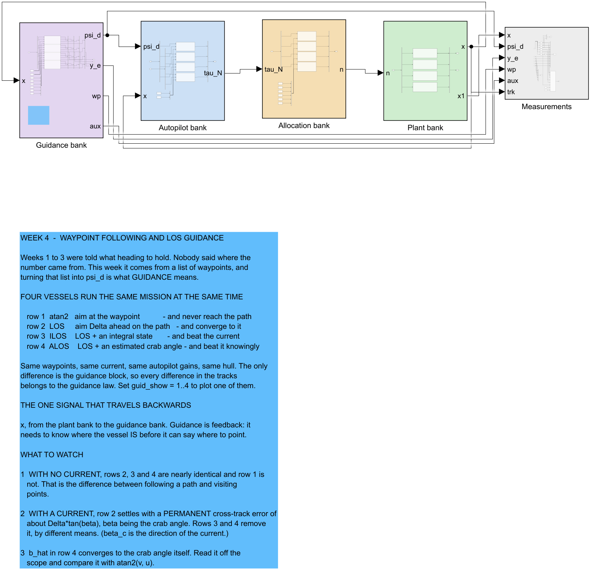

**Reading the figure**

| Element | Meaning |
|---|---|
| violet, **Guidance bank** | four rows, one per law. Takes the state $x$ and produces $\psi_d$, $y_e^{\,p}$, the waypoint index, and the auxiliary state |
| blue, **Autopilot bank** | four identical copies of the Week 3 P–D law. Nothing here is retuned between rows |
| amber, **Allocation bank** | four copies of the square allocation of Appendix A1, turning $\tau_N$ into propeller speeds |
| green, **Plant bank** | four Otter hulls, identical, sharing one ocean current |
| grey, **Measurements** | the log. The first six columns are `[u v r N E psi]`, as in every week of this course |
| the one line going right to left | $x$, from the plant bank back to the guidance bank |
| blue annotation | what to watch, and why the four rows are laid out this way |

- **The backward line is the whole point of the week.** Weeks 1 to 3 had a command that came from outside the model. Guidance is feedback: it cannot say where to point until it is told where the vessel is.
- The four rows share the waypoint list, the current, the autopilot gains and the hull. **The only difference between them is the guidance block**, so any difference in the tracks belongs to the guidance law and to nothing else.
- Set `guid_show = 1..4` in `W04_0_setup.m` to plot a single row instead of all four.

> [!tip] Checking the model is still sound
> ```matlab
> check_overlaps('W04_guidance')
> ```
> The pass mark is **0**. The function walks the top level and every subsystem, and reports any two signal lines that lie on top of each other. It ignores segments that share a source port, because a fan-out branch is meant to overlap.

## C. Aiming at the waypoint

> [!important] To produce every figure in this section
> ```matlab
> cd lectures/W04_simulink
> W04_0_setup
> W04_C_aim_at_the_waypoint
> ```
> Produces `img/W04_result_atan2.png`.

Expected output:

```
  W04 section C — psi_d = atan2(E_next - E, N_next - N)

    leg       atan2 |y_e|      LOS |y_e|      atan2 max          ratio
    ----------------------------------------------------------------------
    1               0.000          0.000          0.000      both zero
    2               0.547          0.060          0.611            9.1
    3               0.514          0.062          0.566            8.3
    4               1.184          0.014          2.077           86.7
```

| Column | How it is measured |
|---|---|
| `atan2 |y_e|`, `LOS |y_e|` | mean $\lvert y_e^{\,p}\rvert$ over **the last third of each leg**, so the number describes steady tracking and not the turn onto the leg |
| `atan2 max` | the worst excursion anywhere on that leg |
| leg 1 | both laws read exactly zero: the vessel starts on the path, already pointing along it, so there is nothing to correct and the ratio would be $0/0$ |

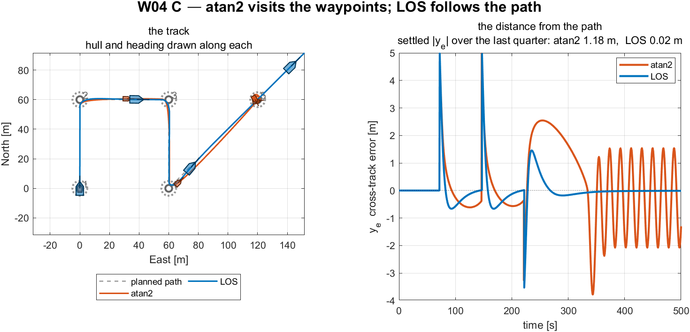

**Reading the figure**

| Element | Meaning |
|---|---|
| left, dashed grey line | the planned path — the thing the vessel is supposed to be on |
| left, numbered open circles | the waypoints, in mission order |
| left, dotted circles | the switching parameter $R$ drawn around each waypoint |
| left, hull outlines | the vessel drawn along its own track, so its **heading** is visible where a bare line would hide it |
| left, orange / blue tracks | `atan2` and LOS, run from the same start with the same autopilot |
| right | $y_e^{\,p}$, the perpendicular distance from the path, one curve per law; zero is the path itself |

**What the figure says**

Two vessels, identical in every respect except the guidance law, running the same four-leg mission in still water. The left panel is where they went; the right is how far each was from the line it was supposed to be on.

Both reach every waypoint. Only the blue one travels along the lines between them. On the three legs where the comparison is meaningful, `atan2` stays within $0.547$, $0.514$ and $1.184$ m of the path while LOS stays within $0.060$, $0.062$ and $0.014$ m — better by factors of $9.1$, $8.3$ and $86.7$.

The shape of the orange curve after each corner explains why. It rises to a peak and comes down *slowly*, because the `atan2` law is not trying to get back to the line at all. It is only trying to reduce the distance to the next waypoint, and drifting sideways barely changes that distance. The blue curve is pulled back within one look-ahead length, because its arctan term grows with exactly the quantity that is wrong.

The two laws differ by one line of code. **`atan2` measures to a point; LOS measures to a line.** Everything in the right panel follows from that.

One feature is easy to miss and worth pointing out. After about $340$ s the orange curve breaks into a **sustained oscillation** of roughly $\pm2$ m that never decays. It is neither noise nor a plotting artefact: the vessel passed the final waypoint at about $332$ s, so the point it is chasing is now **behind it**. The command flips by $180°$, the vessel turns around, overshoots the waypoint again, and repeats — a limit cycle created entirely by the guidance law. That is also why the leg-4 entry of $1.184$ m should be read as an oscillation amplitude rather than a tracking error.

LOS does nothing at all at the same moment, because its aim point sits $\Delta$ ahead on the *extension* of the last leg and therefore stays ahead of the vessel for ever. Neither behaviour is a mission-termination policy, as §4-6 notes; this figure is what the absence of one looks like.

## D. The line-of-sight law

> [!important] To produce every figure in this section
> ```matlab
> cd lectures/W04_simulink
> W04_0_setup
> W04_D_line_of_sight
> ```
> Produces `img/W04_result_los.png`.

Expected output:

```
  W04 section D — psi_d = pi_p - atan(y_e / Delta)

    Delta = 8 m,  path-tangential angle on leg 1 = 0.0 deg

    recomputed psi_d against the logged one, leg 1:  0.000e+00 deg
    (the same arithmetic, so this is a check on the LOG, not the law)

    law         settled |y_e|        max |y_e|        RMS |y_e|
    ------------------------------------------------------------
    atan2              1.1753           4.9800           1.4489
    LOS                0.0159           4.9799           0.5670
```

| Quantity | Interval it is measured over |
|---|---|
| `settled |y_e|` | mean $\lvert y_e^{\,p}\rvert$ over the **last quarter** of the run, $375$ to $500$ s — the same window `W04_plot.m` prints on every track figure |
| `max |y_e|` | the whole run, so it is dominated by the corner transients and is nearly identical for both laws |
| `RMS |y_e|` | $t > 80$ s, that is, after the first corner |

- The first number is a check on the **logging**, not on the law: $\psi_d$ is recomputed here from the logged $y_e^{\,p}$ using the equation of §4-4, and compared with the logged $\psi_d$. Agreement to $0.000\text{e}{+}00$ confirms that the signal named `y_e` in the log really is the one the block used.

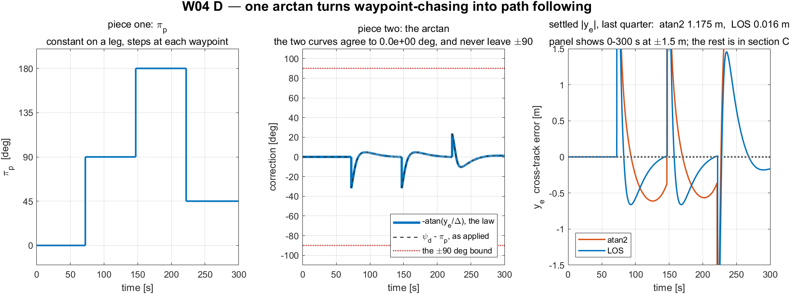

**Reading the figure**

| Element | Meaning |
|---|---|
| panel 1 | $\pi_p$, the direction of the current leg — the first term of the law, and pure geometry |
| panel 2, solid | $-\arctan(y_e^{\,p}/\Delta)$, the correction the law **prescribes** |
| panel 2, dashed | $\psi_d - \pi_p$, the correction the model **applied**; the two should coincide |
| panel 2, red dotted | the $\pm90°$ bound the arctan can never cross |
| panel 3 | $y_e^{\,p}$ for `atan2` and LOS, zoomed to $\pm1.5$ m |

**What the figure says**

The three panels take the law $\psi_d = \pi_p - \arctan(y_e^{\,p}/\Delta)$ apart into its two terms and then show what the pair achieves together.

The first panel is $\pi_p$ alone, and it is a **staircase** — $0°$, then $90°$, then $180°$, then $45°$ — changing only at the three switching instants near $72$, $147$ and $222$ s and flat in between. This term is pure mission geometry with no feedback in it whatever.

The second panel is the correction term, drawn twice: once as the law *prescribes* it, $-\arctan(y_e^{\,p}/\Delta)$, and once as it was actually *applied*, $\psi_d - \pi_p$. The two lie exactly on top of each other, agreeing to $0.0\text{e}{+}00$ degrees. That is the implementation verified graphically rather than argued from the source.

Read that panel's size as well as its shape. The correction is zero on the straight parts, dips to about $-33°$ at each of the first two corners, reaches $+23°$ at the $135°$ corner, and **never approaches the $\pm90°$ bound** drawn in red. That bound is the guarantee of §4-4: the vessel can be told to head straight at the path, but never away from it.

The third panel zooms to $\pm1.5$ m and compares the two laws. They start from the same place and take comparable excursions at each corner — but LOS returns to the line and stays, and `atan2` does not. Settled over the last quarter of the run that is $0.016$ m against $1.175$ m, a factor of **seventy-four**.

The panels stop at $300$ s while the settled numbers are measured over $375$–$500$ s, and that is deliberate: the last quarter is where `atan2` enters the limit cycle of section C, which would squash everything else into a band. The comparison of settled values belongs here; the picture of the limit cycle belongs to section C.

## E. The look-ahead distance

> [!important] To produce every figure in this section
> ```matlab
> cd lectures/W04_simulink
> W04_0_setup
> W04_E_lookahead_distance
> ```
> Produces `img/W04_result_lookahead.png`. Five runs, one per value of $\Delta$.

- The vessel is started **$8$ m off the path** in every run, so each has the same disturbance to recover from. A run that starts on the path measures nothing about how hard the law pulls.

Expected output:

```
       Delta  Delta/L     settle [m]  overshoot [m]  settled |y_e|  max |psi_d'|
    ----------------------------------------------------------------------------------
           2      1.0          12.82          0.939         0.0134          14.64
           4      2.0          20.06          0.630         0.0559           5.76
           8      4.0          35.82          0.473         0.2321           2.23
          16      8.0    not on leg 1          0.415         0.2796           0.80
          30     15.0    not on leg 1         -0.679         1.2871           0.27
```

| Column | Definition |
|---|---|
| `settle [m]` | how far **North** the vessel had travelled when $\lvert y_e^{\,p}\rvert$ last left the $0.4$ m band. A distance rather than a time, because the speed is identical in every run and distance is what a chart shows |
| `not on leg 1` | the vessel never entered the band before the $60$ m leg ended. There is no settling distance, and the table says so rather than quoting the leg length as though it were one |
| `overshoot [m]` | the furthest the vessel went **past** the path. A negative value means it never crossed |
| `max |psi_d'|` | the largest rate of change of the command, in deg/s — how hard the guidance law is working the autopilot |

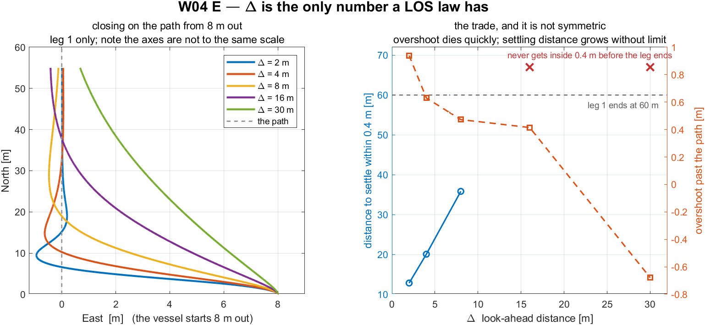

**Reading the figure**

| Element | Meaning |
|---|---|
| left, five tracks | the same approach to leg 1 from the same $8$ m offset, one curve per $\Delta$ |
| left, horizontal axis | East. **Not to the same scale as North** — the leg is $60$ m long and everything happens within $9$ m |
| right, left axis | settling distance: how far along the leg before the vessel stays within $0.4$ m of it |
| right, right axis | overshoot: how far past the path it swung on the way in |
| right, red crosses | runs that never settled inside the leg, drawn above the dashed end-of-leg line |

**What the figure says**

Five approaches to the same path, from the same $8$ m offset, differing only in $\Delta$. The right panel reduces each run to the two things $\Delta$ costs.

At $\Delta = 2$ m the vessel turns almost perpendicular to the path, reaches it by $x^n \approx 13$ m and **overshoots**, swinging $0.94$ m to the far side before recovering. At $\Delta = 30$ m it leans in so gently that after the whole $60$ m leg it is still $1.29$ m out and has never crossed at all. The three between fan out in order.

All five obey the identical law and differ in one length. The arctan works on the *ratio* $y_e^{\,p}/\Delta$, so a small $\Delta$ saturates that ratio immediately and the command sits near $90°$ for most of the approach. That is why the peak turn rate runs from $14.64$ deg/s at $\Delta = 2$ down to $0.27$ deg/s at $\Delta = 30$ — a factor of fifty, from one number.

The right panel is where the choice is actually made, and the trade is **not symmetric**. Overshoot falls quickly and then flattens: moving from $\Delta = 2$ to $4$ removes $0.31$ m of it, but moving from $8$ to $16$ removes only $0.06$ m. Settling distance grows without ever flattening — $12.82$, $20.06$, $35.82$ m, and then off the end of the leg. **Past about $\Delta = 8$ m there is nothing left to buy and a great deal still to pay**, which is why this course uses $8$ m.

Two details of the drawing are worth stating so they are not misread. The two red crosses sit above the dashed line marking the end of leg 1, because that is where "no settling distance" honestly belongs — those runs did not fail to be *measured*, they failed to *settle*. And the left panel is not to a true aspect ratio: the leg is $60$ m long while everything interesting happens within $9$ m of East, so at true scale all five tracks would collapse onto the path and show nothing.

## F. Waypoint switching

> [!important] To produce every figure in this section
> ```matlab
> cd lectures/W04_simulink
> W04_0_setup
> W04_F_waypoint_switching
> ```
> Produces `img/W04_result_switching.png`. Four runs, one per value of $R$.

Expected output:

```
    A vessel 4.5 m short of waypoint 2 along the leg, 10.0 m to the side:

      along-track,  d - x_e = 4.50 < R = 5   ->  SWITCH
      circle,      |P - wp| = 10.97 < R = 5   ->  hold

       R [m] corner cut [m] switch times [s]    settled |y_e|
    ------------------------------------------------------------
           2           0.44     [76 154 232]            0.004
           5           2.26     [72 147 222]            0.016
          15           7.02     [59 128 196]            0.019
          25           9.62     [46 111 176]            0.018
```

- The first block is §4-6 as arithmetic. One position, two tests, two different answers: the along-track remainder is $4.50$ m and passes; the true distance is $10.97$ m and fails by more than a factor of two.

| Column | Definition |
|---|---|
| `corner cut [m]` | the **closest** the vessel came to waypoint 2. A large $R$ turns early and misses the corner by more |
| `switch times [s]` | when each of the three switches occurred |
| `settled |y_e|` | mean $\lvert y_e^{\,p}\rvert$ over the last quarter of the run |

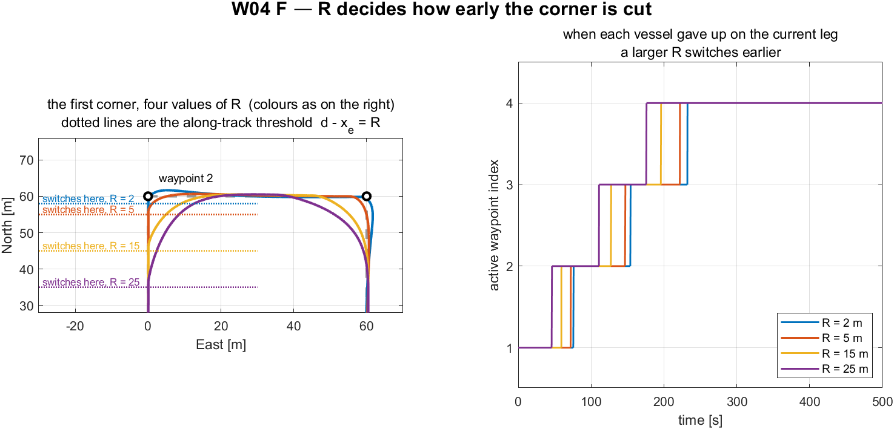

**Reading the figure**

| Element | Meaning |
|---|---|
| left | the first $90°$ corner only, at four values of $R$, drawn to equal axes |
| left, horizontal dotted lines | the **switching thresholds**. They are lines and not circles because the test is $d_k - x_e^{\,p} < R$ along the leg — §4-6 |
| left, four tracks | colours matched to the right panel |
| right | which waypoint each vessel was steering to, against time — a staircase with one step per switch |

**What the figure says**

The left panel is the first $90°$ corner, with four tracks and the four **switching thresholds** drawn as horizontal dotted lines. The right panel is the active waypoint index against time for the same four runs.

Notice first that the thresholds are **lines, not circles**. Leg 1 runs due North along $E = 0$, so the along-track test $d_k - x_e^{\,p} < R$ is the half-plane $N > 60 - R$, and its boundary is horizontal. That is the distinction §4-6 draws, shown here on the data — circles would have contradicted the page before.

Each track leaves the leg exactly where its own dotted line crosses it, and the corner cut follows directly: $0.44$ m at $R = 2$, then $2.26$, $7.02$ and $9.62$ m. The $R = 25$ track begins turning at $x^n = 35$ m — a full $25$ m before the waypoint — and passes almost $10$ m from it.

So **$R$ does not tune accuracy. It decides how early the vessel gives up on the current leg**, and the corner cut is the consequence. The right panel says the same thing in time: four staircases with the same three steps, shifted earlier as $R$ grows, from $[76\ 154\ 232]$ s at $R = 2$ to $[46\ 111\ 176]$ s at $R = 25$. Cutting the corners saves $56$ s over the mission.

The straight-line column of the table barely moves across all of this — $0.004$ to $0.019$ m. **$R$ costs almost nothing on the straights and everything at the corners.** A survey that must hold each line to its end wants a small $R$; a transit that only needs to pass near the waypoints wants a large one. Neither choice is wrong, and the figure is how the trade is made visible before choosing.

## G. The current, and the two laws that beat it

> [!important] To produce every figure in this section
> ```matlab
> cd lectures/W04_simulink
> W04_0_setup
> W04_G_current_and_integral
> ```
> Produces `img/W04_result_current.png`. One four-vessel run, a six-point sweep of the current speed, and finally the two state-filling tables printed in §4-8-5a and §4-9-6a.

Expected output:

```
  W04 section G — a current of 0.30 m/s at 90 deg

    law         settled y_e     crab [deg]      aux state
    --------------------------------------------------------
    atan2             1.910          -4.60          0.000
    LOS               2.253          15.74          0.000
    ILOS              0.008          15.77          7.519
    ALOS             -0.004          15.88          0.278

      Delta tan(beta) = 8.0 x tan(15.74 deg) = 2.2545 m
      measured                                = 2.2533 m
      difference                              = 0.0012 m

         V_c     crab [deg]        LOS y_e      predicted       ILOS y_e
    ----------------------------------------------------------------------
        0.00          -0.10         -0.014         -0.013         -0.019
        0.10           5.10          0.713          0.714         -0.007
        0.20          10.37          1.463          1.464         -0.001
        0.30          15.74          2.253          2.254          0.008
        0.40          21.26          3.111          3.112          0.035
        0.50          27.38          4.145          4.143          0.054
```

| Row | What it confirms |
|---|---|
| `LOS 2.253` | the §4-7 prediction $y_{e,ss}^{\,p} = \Delta\tan\beta_c$, to $0.0012$ m |
| `ILOS 0.008` with `aux 7.519` | the §4-8-5 equilibrium: $y_{int}^{eq} = \Delta\tan\beta_c/\kappa = 7.5158$ s predicted, $7.519$ s measured |
| `ALOS -0.004` with `aux 0.278` | $0.278$ rad is $15.91°$, against a true crab angle of $15.88°$ |
| the sweep | the prediction holds at every current speed, to at most $0.002$ m |

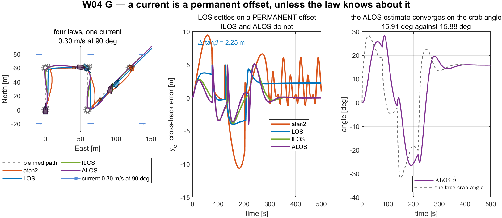

**Reading the figure**

| Element | Meaning |
|---|---|
| left | the tracks of all four laws, with the path, waypoints and hull outlines as before |
| left, small arrows | the ocean current, $0.30$ m/s from the East |
| middle | $y_e^{\,p}$ for each law against time |
| middle, dashed grey | $\Delta\tan\beta_c = 2.25$ m — **predicted in §4-7 before the run**, not fitted to it |
| right, dashed black | the true crab angle, computed from the log as $\operatorname{atan2}(v,u)$ |
| right, solid | $\hat\beta$, what the ALOS vessel believes that angle to be |

**What the figure says**

All four laws, one mission, one current of $0.30$ m/s from the East. Left: the tracks, with the current drawn as arrows. Middle: each law's cross-track error. Right: what the ALOS vessel believes the crab angle to be, against what it actually is.

The blue LOS curve in the middle panel is the most important line in the week. It settles onto the dashed grey line — and that grey line was **not fitted to the data.** It is $\Delta\tan\beta_c = 2.25$ m, drawn from §4-7 before the run was made.

**LOS has not failed and is not mistuned.** Its heading error is zero, its autopilot is doing exactly what it was told, and it still sits $2.25$ m off the path. The law commands a *heading* while the vessel travels along a *course*, and the offset is precisely what the law asked for. No amount of tuning removes it, because nothing is wrong.

ILOS and ALOS both remove that offset — $0.008$ m and $-0.004$ m — by opposite routes. ILOS accumulates an integral until it happens to cancel the error, and the state settles at $7.519$: **a number with no physical meaning**, carrying units of seconds. ALOS estimates the crab angle itself and settles at $15.91°$ against a true $15.88°$: **a number that can be read off and checked against $\operatorname{atan2}(v,u)$.** Both finish within $0.01$ m of the path. Only one can say why.

The right panel repays slow reading. The dashed true crab angle swings between $+28°$ and $-32°$ over the first $300$ s, and that is not disturbance. The current comes from one fixed direction, so as the vessel turns through each corner the water strikes the hull at a different angle and the crab angle genuinely changes. The estimate follows with a visible **lag**, which is what a first-order adaptation law does. Only on the final leg, where the heading holds still, do the two settle together at about $15.9°$.

That lag is the honest limit of the method: the estimate is good while §4-9-7's assumption of a slowly-varying $\beta$ holds, and lags whenever it does not. The sweep table shows the same limit from the other side — the ILOS residual grows from $-0.019$ m in still water to $0.054$ m at $0.5$ m/s, because a stronger current needs a larger integral state and a fixed-length run gives it less time to get there.

## H. The gains, and the Lyapunov function

> [!important] To produce every figure in this section
> ```matlab
> cd lectures/W04_simulink
> W04_0_setup
> W04_H_adaptive_and_stability
> ```
> Produces `img/W04_result_stability.png`. Ten runs — five values of $\kappa$, five of $\gamma$ — plus the Lyapunov computation on leg 1. The $\kappa$ sweep is reported as the table below rather than as a third panel; the figure keeps only what the section is about.

Expected output:

```
  1) ILOS: kappa, with Ki = kappa / Delta

       kappa         Ki    settled |y_e|       peak |y_e|     settling [s]
    ------------------------------------------------------------------------
        0.02     0.0025           1.3425           3.6388              NaN
        0.05     0.0063           0.6742           3.4835              NaN
        0.10     0.0125           0.2033           3.2855              NaN
        0.30     0.0375           0.0103           2.8057             66.9
        1.00     0.1250           0.0260           2.1178             73.2

  2) ALOS: gamma

         gamma    settled |y_e|      b_hat [deg]  true crab [deg]     settling [s]
    ----------------------------------------------------------------------------------
        0.0005           0.9353             9.31            15.75              NaN
        0.0010           0.4303            12.81            15.68              NaN
        0.0020           0.0869            15.07            15.61              NaN
        0.0050           0.0059            15.91            15.88              NaN
        0.0200           0.1737            15.21            15.59              NaN

  3) the Lyapunov function on leg 1

    V at the start of the leg  5.8005
    V at its peak              12.9433  at t = 17.5 s
    V at the end of the leg    0.5588
    fall from the peak         23.2 x
    samples with dV <= 0       62.2 %
```

- A `NaN` in the settling column means the run never met the settling criterion inside the leg. For the small gains that is because the state was **still moving**, not because anything diverged.

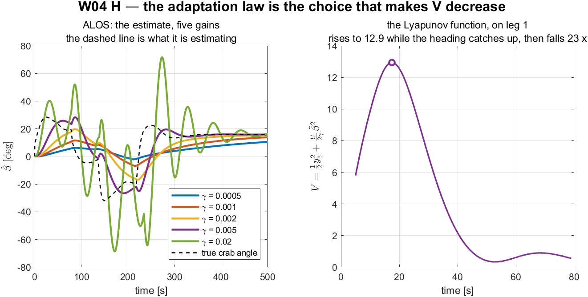

**Reading the figure**

| Element | Meaning |
|---|---|
| left, five coloured curves | $\hat\beta$ for five values of the adaptation gain $\gamma$ |
| left, dashed black | the true crab angle — what all five are trying to estimate |
| right | $V = \tfrac12 y_e^2 + \tfrac{U}{2\gamma}\tilde\beta^2$, the Lyapunov function of §4-9-5, over leg 1 only |
| right, open marker | the peak of $V$, at $t = 17.5$ s |

**What the figure says**

The left panel is what each $\gamma$ believes the crab angle to be, against the truth. The right panel is the Lyapunov function of §4-9-5, evaluated on the actual vessel over leg 1.

Choosing $\gamma$ is choosing between two failures. At $\gamma = 0.0005$ the estimate crawls, reaching only $9.31°$ after $500$ s — too slow to finish the job. At $\gamma = 0.02$ it does the opposite, swinging between $\pm70°$ as it chases the *corner transients* instead of the current; those excursions also come within sight of breaking the $\lvert\tilde\beta\rvert < 90°$ assumption the derivation rests on. At $\gamma = 0.005$ the estimate follows with a modest lag and settles at $15.91°$ against a true $15.88°$.

The right panel reports something less comfortable. $V$ starts at $5.80$, **rises to $12.94$ at $t = 17.5$ s**, and only then falls, to $0.5588$ — down $23.2\times$ from its peak, but with just $62.2\%$ of samples decreasing.

That rise is not a contradiction of §4-9-6, and it is worth being precise about why. The proof gives $\dot V < 0$ *on the assumption that $\psi = \psi_d$ exactly*. Between the guidance law and the water sits a Week 3 autopilot with its own settling time, and while the heading is still catching up the error dynamics the proof describes are not yet the dynamics the vessel has.

This is reported rather than smoothed away deliberately. A monotone $V$ was available — plot the kinematic subsystem on its own and it decreases everywhere — but that would have been a picture of an assumption rather than of a vessel. What the reference actually supports is that the guidance subsystem is USGES and that its cascade with a stable autopilot is stable. It does **not** claim that $V$ of the outer loop falls at every instant of a real run, and this figure is what the difference looks like.

---

# Summary

## Week Summary

| Step | What was done | How it was verified |
|---|---|---|
| §4-2, §4-3 | derived $\pi_p$ and the pair $(x_e^{\,p}, y_e^{\,p})$ from one rotation | compared against MSS `crosstrackWpt.m` at eight test points; largest disagreement $0$ |
| §4-4 | derived the LOS law from the aim-point geometry | five limits checked numerically; compared against MSS `LOSchi.m`; recomputed from the log in section D, agreement $0.0\text{e}{+}00$ deg |
| §4-5 | fixed $\Delta = 8$ m | five-point sweep, section E: settling distance and overshoot move in opposite directions and $8$ m is where the second stops improving |
| §4-6 | established the two switching criteria and $R < \min_k d_k$ | section F evaluates both tests on one position — $4.50$ m passes, $10.97$ m fails; four-point sweep of $R$ |
| §4-7 | derived $\dot y_e^{\,p} = U\sin(\chi-\pi_p)$ and $y_{e,ss}^{\,p} = \Delta\tan\beta_c$ | six-point current sweep, section G; worst disagreement $0.002$ m on a $4.1$ m offset |
| §4-8 | derived ILOS, its units, its built-in anti-windup and its equilibrium | $y_{int}^{eq} = \Delta\tan\beta_c/\kappa$ predicted $7.5158$ s, measured $7.519$ s; closed form of $\dot y_e^{\,p}$ checked to $6.7\times10^{-16}$ over $10^4$ states |
| §4-8-6 | showed the course normalisation admits a constant-weight Lyapunov function and the heading one does not | $\dot V$ matches $-U\cos\beta_c y_e^2/D$ to $1.1\times10^{-14}$; the heading form leaves a residual of rms $2.94$ |
| §4-9 | derived ALOS and showed the adaptation law is forced | $\hat\beta = 15.91°$ against a true $15.88°$, with nothing in the law told what the current was; and the derived law checked against Fossen's `ALOSpsi.m` over 400 steps — **disagreement exactly zero** |
| §4-10 | put every equation beside the line of MATLAB that implements it | the code shown is generated by `guidance_code(law)`, so it cannot drift from the model |
| Part 2 | eight scripts, six result figures | every number quoted in this document appears in the console output of the script named above it |

## Progress Check

- [ ] `W04_0_setup` prints `feasibility ... yes` and `Ki = 0.0375`.
- [ ] `check_overlaps('W04_guidance')` returns **0**.
- [ ] Section C reproduces the leg-2 ratio of $9.1$ between `atan2` and LOS.
- [ ] Section D reports the recomputed $\psi_d$ agreeing with the logged one to $0.000\text{e}{+}00$ deg.
- [ ] Section E shows settling distance rising and overshoot falling as $\Delta$ grows, with two values that never settle.
- [ ] Section F prints $4.50 < 5$ passing the along-track test while $10.97$ fails the circle test.
- [ ] Section G reproduces $\Delta\tan\beta_c = 2.2545$ m against a measured $2.2533$ m.
- [ ] Section H shows the ILOS settled error with a minimum at $\kappa = 0.3$ and the ALOS estimate landing on the true crab angle at $\gamma = 0.005$.
- [ ] The learner can state, without looking, which of $x_e^{\,p}$ and $y_e^{\,p}$ the switching logic uses and why.
- [ ] The learner can explain why $V(t)$ in section H is not monotone.

## In-class laboratory — build the guidance layer by hand

The second hour of the Week 4 session is spent building the guidance block in Simulink. A complete Week 3 vessel is provided with one input left dangling: the commanded heading.

```matlab
cd lectures/W04_simulink/problems
W04_P1_start                 % creates W04_P1.slx — a Week 3 vessel, no guidance
W04_check(1)                 % run this whenever, as often as needed
```

| | Problem | Time | The number it must reproduce |
|---|---|---|---|
| 1 | The LOS law on leg 1 | 25 min | $\pi_p = 0$ exactly; $y_e^{\,p}$ from $18$ m to $0$; $\psi_d \to \pi_p$ |
| 2 | atan2 against LOS, same vessel | 20 min | worst $\lvert y_e^{\,p}\rvert$: $0.09$ m against $3.78$ m |
| 3 | A current, and the offset that stays | 15 min | settled $y_e^{\,p} = \Delta\tan\beta_c$, heading error $0$ |

- The full problem sheet is [`W04_simulink/problems/README.md`](W04_simulink/problems/README.md), and reference answers are in [`W04_simulink/solutions/`](W04_simulink/solutions/README.md).
- The problem sheet carries **the result graphs a correct model produces**.
- **Nothing inside the Week 3 autopilot changes.** That is the practical content of "guidance and control are separate layers", and the laboratory model makes the seam visible.
- Problem 3 ends where §4-8 begins: a vessel holding its commanded heading perfectly and still $3.3$ m from where it was asked to be.

---

## Assignment 4

### ① Requirements

1. **Add a fifth row to the guidance bank** implementing the *course-angle* ILOS of MSS `ILOSchi.m`, that is, with the normalisation $\dot y_{int} = U y_e^{\,p} / \sqrt{\Delta^2 + (y_e^{\,p} + \kappa y_{int})^2}$ and the command applied to $\chi$ rather than $\psi$. Note that $\kappa$ is now **dimensionless**, so the value $0.3$ from this week must not be carried across unchanged; state the correct scaling and justify it.
2. **Sweep the current direction** $\beta_c \in \{0°, 45°, 90°, 135°, 180°\}$ at a fixed $V_c = 0.3$ m/s, for LOS, ILOS and ALOS. Report the settled $\lvert y_e^{\,p}\rvert$ for each of the fifteen combinations in one table.
3. **Change the mission** so that one leg is shorter than $R_{switch}$ and show what `wp_switch.m` does. Do not remove the check; demonstrate it firing.

### ② Verification (required — an unverified result scores zero)

Each of the following must be reported as a number produced by a script, not as an assertion:

| Claim | Required evidence |
|---|---|
| the fifth row implements the course law | its $\psi_d$ recomputed from the logged $y_e^{\,p}$ and $y_{int}$, agreeing to better than $10^{-9}$ deg |
| the rescaled $\kappa$ is right | a dimensional argument in the report **and** an equilibrium check: $\kappa y_{int}^{eq}$ against $\Delta\tan\beta_c$ |
| the current sweep | for the LOS rows, each measured offset against $\Delta\tan\beta_c$ computed from the *measured* $\beta_c$ of that run |
| the short-leg case | the error text, and an explanation of which inequality was violated |
| the model is still readable | `check_overlaps` returning 0 |

### ③ Analysis

Answer in at most two pages:

- At $\beta_c = 0°$ and $180°$ the current is along the path. Predict the settled offset for all three laws **before** running, then compare. Explain any discrepancy.
- ILOS and ALOS reach almost identical settled errors in section G. Give two circumstances in which they would **not**, and state which law is preferable in each.
- Section H shows $V$ rising for the first $17.5$ s. Propose a change to the *model* — not to the guidance law — that would reduce that rise, and predict what it would cost.

| Item | Marks |
|---|---|
| ① requirements, all three implemented and running | 30 |
| ② verification, every row evidenced | 40 |
| ③ analysis, with predictions made before measurement | 25 |
| presentation: figures readable, numbers traceable to a script | 5 |

## Troubleshooting

Only problems actually encountered while building this week.

| Symptom | Cause | Fix |
|---|---|---|
| `Invalid setting for parameter 'Value' ... 'mp'` when building | Constant blocks hold variable **names**, which Simulink validates at creation, and the base workspace was empty | `ensure_base_vars(W04_vars)` at the top of the builder |
| `SubSystem block does not have a parameter named 'SampleTime'` | a MATLAB Function block is a masked Stateflow object; the rate is a chart property | set `ChartUpdate = 'DISCRETE'` and `SampleTime` on the chart — the fifth argument of `set_mlfcn` |
| `Persistent variables are not supported with continuous sample time` | the guidance block carries $k$, $y_{int}$ and $\hat\beta$ across steps | give it the discrete rate $h$, as above |
| Measurements port width $48$ against $12$ | the plant bank exposed only the stacked state | added the separate `x1` output |
| `check_overlaps` reported 572 overlapping segments | 32 separate constant-to-block lines crossing the diagram | collect the tuning into the vectors `par`, `gains` and `apar`, and route them through one lane each |
| `SampleTime 'h'` suddenly invalid, with no edit to the model | an ad-hoc diagnostic in the base workspace had overwritten `h` with a port-handle struct | never reuse a model variable's name in a scratch command; re-run `W04_0_setup` |
| A section's figure looks identical to the previous section's | `W04_plot` was called for both | it is a defect, not a style choice — section D now plots the decomposition of the law instead |

## References

| Source | Where |
|---|---|
| Fossen, T. I. (2021). *Handbook of Marine Craft Hydrodynamics and Motion Control*, 2nd ed., Wiley | §12.3 path following; §10.3 the Otter |
| Børhaug, E., Pavlov, A. and Pettersen, K. Y. (2008). Integral LOS control for path following of underactuated marine surface vessels in the presence of constant ocean currents | *Proc. 47th IEEE CDC*, 4984–4991. The ILOS law of §4-8 |
| Lekkas, A. M. and Fossen, T. I. (2014). Integral LOS path following for curved paths based on a monotone cubic Hermite spline parametrization | *IEEE TCST* 22(6), 2287–2301. The course-angle ILOS and the curved-path extension |
| Nelson, D. R. et al. (2007). Vector field path following for miniature air vehicles | *IEEE Trans. Robotics* 23(3), 519–529. §4-11 |
| Faulwasser, T. and Findeisen, R. (2016). Nonlinear model predictive control for constrained output path following | *IEEE TAC* 61(4), 1026–1039. §4-11 |
| **Fossen, T. I. (2023). An Adaptive Line-of-sight (ALOS) Guidance Law for Path Following of Aircraft and Marine Craft** | *IEEE TCST* **31**(6), 2887–2894, [doi:10.1109/TCST.2023.3259819](https://doi.org/10.1109/TCST.2023.3259819). The ALOS law of §4-9 and its USGES proof |
| MSS `ILOSpsi.m`, `ILOSchi.m`, `LOSchi.m`, `crosstrackWpt.m` | the vendored 2021 release, located by `_tools/mss_path.m` |
| MSS `ALOSpsi.m` (2023+) | not in the vendored release; `_tools/verify_alos.m` locates a newer copy on this machine and checks §4-9 against it |

> [!note] A correction worth recording
> An earlier draft of this week stated that ALOS had **no reference implementation to check against**, because the vendored MSS is the 2021 release. That was wrong: `ALOSpsi.m` exists in MSS 2023 and later, and a copy is present on this machine. The derivation of §4-9 was written before that copy was found and turned out to match it **exactly** — `_tools/verify_alos.m` reports zero disagreement in both $\psi_d$ and $y_e^{\,p}$ over 400 steps.
> The error was not in the derivation but in the claim that no source existed. **"There is no implementation" is a statement about one release on one day, and it has to be checked before it is written.**

## Next Week

**Week 5 — Control Allocation.** This week gave all four vessels the same square allocation from Appendix A1 and never questioned it. Week 5 asks what happens when there are more actuators than degrees of freedom, when a thruster saturates, and when one fails outright — and turns $\boldsymbol{\tau} = \mathbf{B}\mathbf{f}$ from a matrix inverse into an optimisation.
