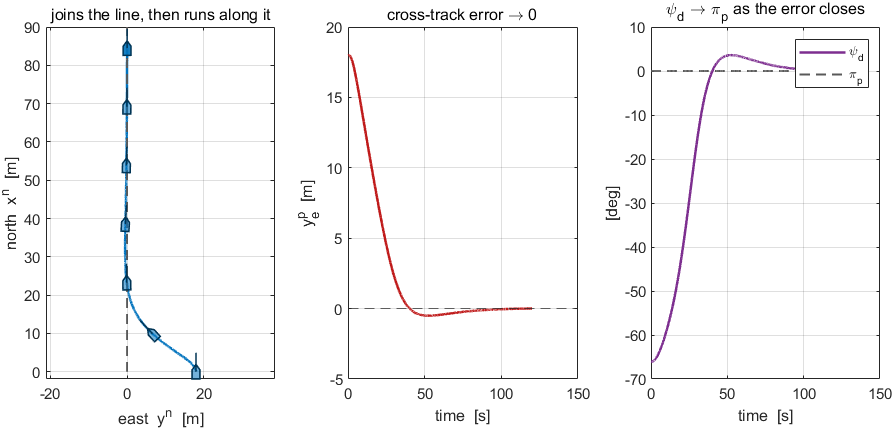
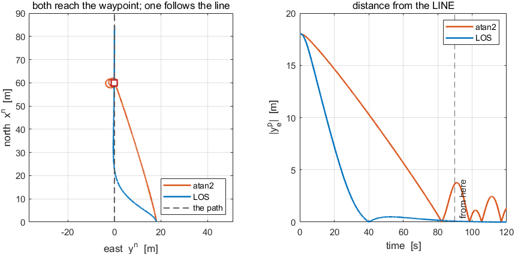
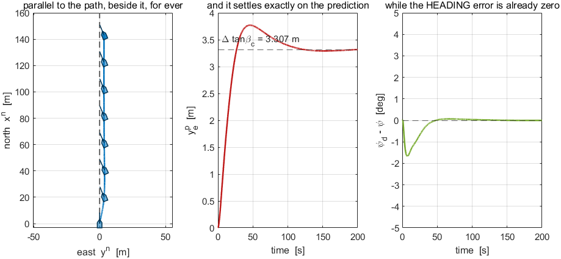

# Week 4 · Laboratory Problems — build the guidance layer in Simulink

- Course: Sensor Signal Processing and Fusion · Department of Autonomous Vehicle System Engineering
- Time: **one hour**, immediately after the Week 4 lecture hour
- Three problems, in order.

---

## What this hour is for

Weeks 1 to 3 were **told** what heading to hold. This hour builds the layer that decides it.

A complete Week 3 vessel is provided — heading autopilot, control allocation, hull — with one input left dangling: the commanded heading. That split is the point of the week. **Nothing inside the autopilot changes between Week 3 and Week 4**, and this model makes that seam visible.

---

## Before starting

```matlab
cd lectures/W04_simulink/problems
W04_P1_start                 % creates W04_P1.slx — a Week 3 vessel, no guidance
W04_check(1)                 % run this whenever, as often as needed
```

The solver is already set to fixed-step `ode4` at `h = 0.02` s. **Do not change it.**

> [!important] Two requirements on every model
> - **`xlog`** — To Workspace, `Structure With Time`, the plant's twelve states
> - **`glog`** — To Workspace, `Structure With Time`, carrying $[\,\pi_p\ ;\ y_e^{\,p}\ ;\ \psi_d\,]$ in **radians and metres, in that order**
>
> The guidance log is required because Problems 1 and 3 are about quantities that never appear in the state vector. A model can put the vessel in the right place with a wrong $y_e^{\,p}$, and only `glog` can tell.

The waypoints are already in the workspace as `WP_N` and `WP_E`. **Leg 1** runs from $\mathbf{p}_1^{\,n} = (0,0)$ to $\mathbf{p}_2^{\,n} = (60,0)$ — due north, so $\pi_p$ is exactly zero. That is deliberate: a leg whose angle is zero makes a sign error in the rotation visible immediately.

---

## Problem 1 · The LOS law (25 minutes)

**Build.** A guidance block taking the position and producing $\psi_d$.

$$
\pi_p = \operatorname{atan2}\!\big(y_{i+1}^n - y_i^n,\ x_{i+1}^n - x_i^n\big)
$$

$$
y_e^{\,p} = -\big(x^n - x_i^n\big)\sin\pi_p + \big(y^n - y_i^n\big)\cos\pi_p
$$

$$
\psi_d = \pi_p - \tan^{-1}\!\left(\frac{y_e^{\,p}}{\Delta}\right)
$$

Leg 1 only; no waypoint switching this hour.

> [!warning] Two different arctangents, and they are not interchangeable
> $\pi_p$ **must** use the two-argument `atan2` — a leg can point into any of the four quadrants, and the one-argument form folds two of them onto the others.
> The correction term may use the one-argument `atan`, because $\Delta > 0$ always and the aim-point vector therefore never leaves the right half-plane of $\{p\}$.

**Verify.** `W04_check(1)`. The vessel starts $18$ m east of the leg.

| What the checker expects | |
|---|---|
| $\pi_p$ on leg 1 | exactly $0$ rad |
| initial $y_e^{\,p}$ | $18$ m |
| settled $y_e^{\,p}$ | $0$ |
| settled $\psi_d$ | $0$ rad, i.e. $\psi_d \to \pi_p$ |

**What a correct model produces**



| Reading the figure | |
|---|---|
| left | the vessel curves onto the dashed path and then runs along it. Hulls are drawn so the heading is visible |
| middle | $y_e^{\,p}$ falls smoothly to zero without crossing — with $\Delta = 8$ m it does not overshoot |
| right | $\psi_d$ starts well off $\pi_p$ and **converges onto it** as the error closes |
| the check | if the initial $y_e^{\,p}$ comes out $-18$ m, the two sine terms have swapped sign |

---

## Problem 2 · Aiming at a point is not following a path (20 minutes)

**Build.** Add a second law to the same block, selected by a flag:

$$
\psi_d = \operatorname{atan2}\!\big(y_{i+1}^n - y^n,\ x_{i+1}^n - x^n\big)
$$

**Both laws must share one plant, one autopilot and one allocation.** If they do not, the comparison measures something other than the guidance.

**Verify.** `W04_check(2)`, same start.

| | worst $\lvert y_e^{\,p}\rvert$ after 90 s |
|---|---|
| LOS | $0.09$ m |
| atan2 | $3.78$ m |

Both still reach the waypoint. That is essential to the argument: `atan2` is **not broken**.

**What a correct model produces**



| Reading the figure | |
|---|---|
| left | both tracks end at the red waypoint marker. Only the blue one lies on the dashed path while doing so |
| right | distance from the **line**. The orange trace stays an order of magnitude above the blue one |
| the check | if the two tracks are identical, the law flag is not reaching the guidance block |

**The point.** `atan2` regulates the distance to a **point**, and a point carries no information about the line it sits on. No autopilot gain fixes this, because the path does not appear anywhere in the law. **It is answering a different question.**

---

## Problem 3 · A current, and the offset that stays (15 minutes)

**Build.** Nothing. Set $V_c = 0.3$ m/s and $\beta_c = 90°$ and run the LOS law again.

**Predict before running.** Section 4-7 derives

$$
y_e^{\,p,ss} = \Delta\tan\beta_c
$$

Measure $\beta_c$ from the run as $\operatorname{atan2}(v, u)$ and work out what the offset should be.

**Verify.** `W04_check(3)`.

| What the checker expects | |
|---|---|
| settled $y_e^{\,p}$ | equal to $\Delta\tan\beta_c$ to within $0.15$ m |
| heading error while that offset persists | $0$ |

**What a correct model produces**



| Reading the figure | |
|---|---|
| left | the track runs **parallel** to the path and beside it. The hulls lean upstream |
| middle | $y_e^{\,p}$ rises and settles **exactly on the dashed prediction** $\Delta\tan\beta_c$ |
| right | the heading error is $0$ the whole time the offset persists |
| the check | if the offset keeps growing, the guidance is reading a stale position; if it returns to zero, an integrator has crept in |

**The point.** The loop is doing exactly what it was asked. The heading error is **already zero**, so there is nothing left for a larger autopilot gain to act on. **The law is not short of authority; it is short of terms.** Sections 4-8 and 4-9 are two ways of supplying the missing one, and neither of them uses gain.

---

## Marking

| | Weight | What is being marked |
|---|---|---|
| Problem 1 | 40 | `W04_check(1)` passes; the reason $\pi_p$ needs `atan2` and the correction does not is stated |
| Problem 2 | 30 | `W04_check(2)` passes; the sentence "it regulates a point, not a line" is argued rather than quoted |
| Problem 3 | 30 | `W04_check(3)` passes; the predicted $\Delta\tan\beta_c$ was written down **before** running |

---

## If something goes wrong

| Symptom | Cause | Fix |
|---|---|---|
| `The model has no To Workspace block whose variable name is glog` | only `xlog` was added | add the second log, three signals, `Structure With Time` |
| `glog has 1 column; 3 were expected` | a matrix signal reached the log | the MATLAB Function output is $3\times1$; insert a Reshape set to `1-D array` |
| Initial $y_e^{\,p}$ is $-18$ m | the two sine terms are swapped | $y_e^{\,p} = -\Delta x\,\sin\pi_p + \Delta y\,\cos\pi_p$ |
| The vessel turns away from the path | the sign of the correction is reversed | the law **subtracts** the arctangent from $\pi_p$ |
| The vessel spirals | $\pi_p$ was computed with one-argument `atan` | use `atan2` |
| $\psi_d$ jumps by $360°$ | the command was wrapped in the guidance | do not wrap it there; the autopilot wraps the **error**, which is the only place a wrap belongs |

Reference answers are in `../solutions/`. Read them **after** attempting the problem.
