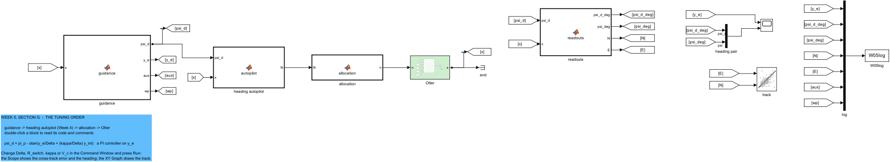
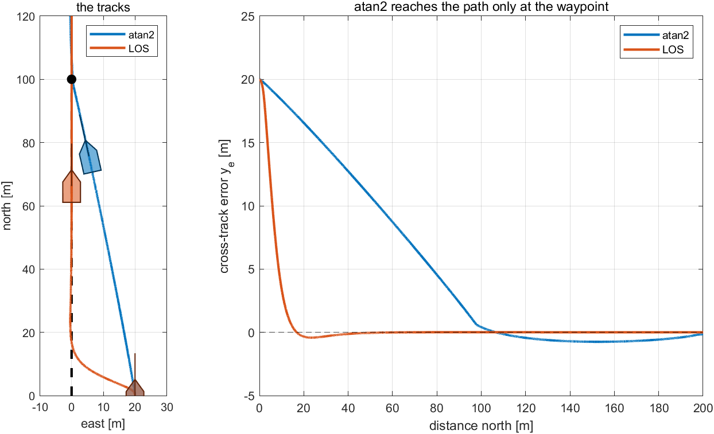
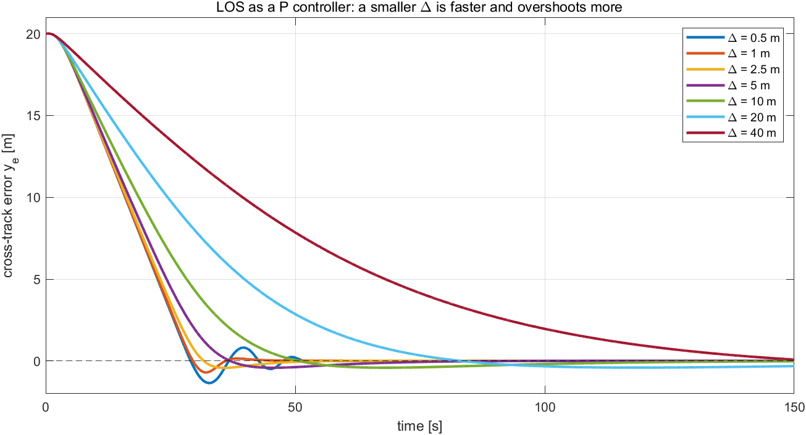
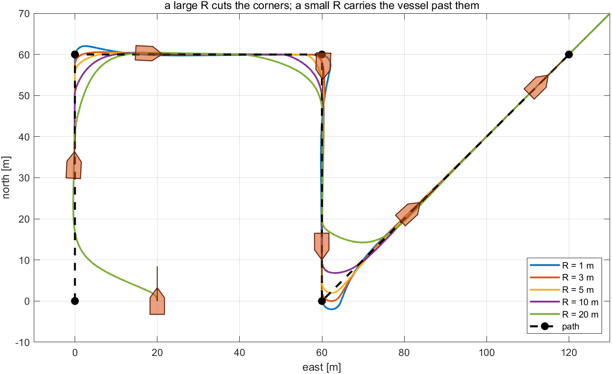
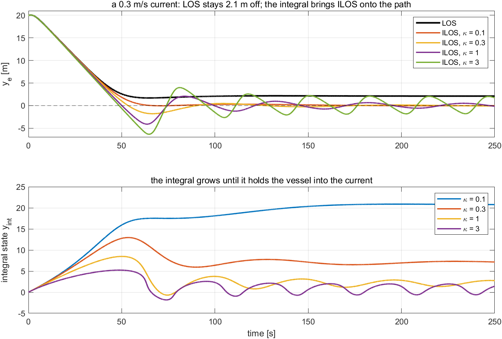
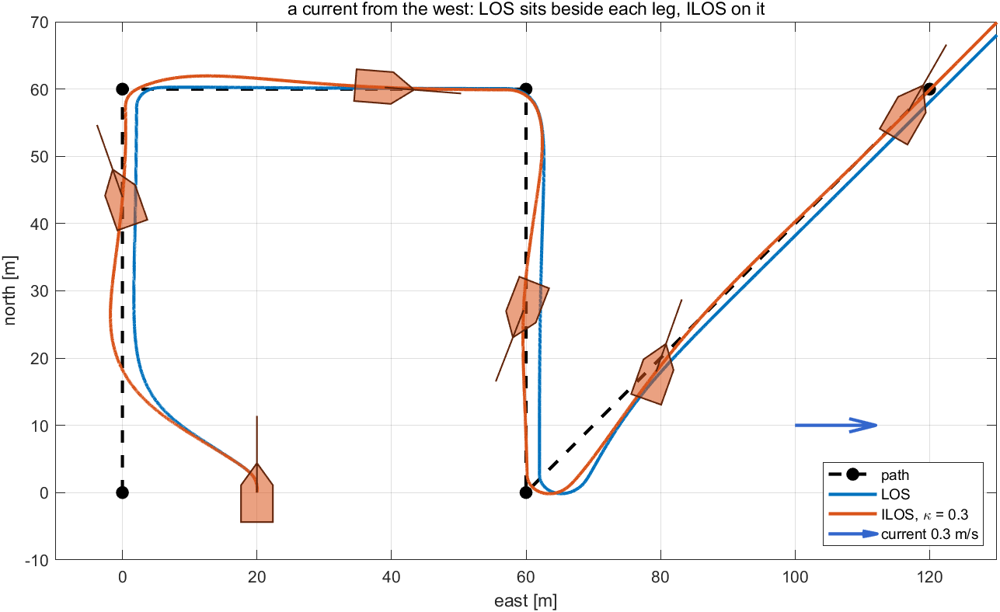

# Week 5 · Waypoint Following and LOS Guidance

> [!important] Reference material — read this first
> <span style="font-size:0.88em">The five courses below are **taught by the instructor of this course** and are the assumed background for it. They run from the fundamentals down to the graduate material, so start wherever the gap is. Every frame, symbol and derivation used here is developed in them at length; anyone whose prerequisites are thin should work through them first, then return.</span>
>
> | # | Course | Level | Lang. | Video | Slides and code |
> |---|---|---|---|---|---|
> | 1 | **Control Engineering** (제어공학) — the foundation: transfer functions, feedback, stability, root locus, PID | undergraduate | KO | [playlist](https://youtube.com/playlist?list=PLFaUxNRM4BvJMpF9HZS-Mp8tDv9dTdglk) | [drive](https://drive.google.com/drive/folders/1TNIPDNtS_Iy8li-olka5WJslSXDYf0aT) |
> | 2 | **Control System Design** (제어시스템설계) — design rather than analysis: specifications, loop shaping, discrete implementation | undergraduate | KO | [playlist](https://youtube.com/playlist?list=PLFaUxNRM4BvIGroZ5rgn7x08F7C79d9WZ) | [drive](https://drive.google.com/drive/folders/11m5Xxl_PHJvxgHghLSP-jhCpmRpbvoXh) |
> | 3 | **Advanced Control Engineering** (제어공학특론) — reference frames, the 6-DOF equation of motion, rotation matrices and Euler angles, linearisation and trim, vehicle control design | graduate | EN | [playlist](https://youtube.com/playlist?list=PLFaUxNRM4BvJmvF2ljx4KM5dj1P5jEcw0) | [drive](https://drive.google.com/drive/folders/1GUxbbONl916lNd0ggnFnXrNwNkd13-2-) |
> | 4 | **Sensor Signal Processing and Fusion** (센서신호처리 및 융합) — sensor models, noise, estimation and multi-sensor fusion | graduate | EN | [playlist](https://youtube.com/playlist?list=PLFaUxNRM4BvK-aP2Gdoyp5-AWvMn7Fo8E) | [drive](https://drive.google.com/drive/folders/1MEVJP7TzMcm8w6TZwUjhWJtL34WeNY3u) |
> | 5 | **Capstone Design** (캡스톤디자인) — a vehicle project carried end to end | undergraduate | KO | [playlist](https://youtube.com/playlist?list=PLFaUxNRM4BvLu7L0pDoLzDXTv8mm6rCmj) | [drive](https://drive.google.com/drive/folders/1haIQejlJfrdhtOuof-MpffR9ydVscXZS) |
>
> <span style="font-size:0.88em">**Not fluent in MATLAB or Simulink yet? Do these before Part 2.** Every laboratory in this course is Simulink, and the Onramp courses are free and take a few hours each.</span>
>
> | Tool | Where to start |
> |---|---|
> | MATLAB | [MATLAB Onramp](https://matlabacademy.mathworks.com/kr/details/matlab-onramp/gettingstarted) · [Core MATLAB Skills](https://matlabacademy.mathworks.com/details/core-matlab-skills/lpmlcms) |
> | Simulink | [Simulink Onramp](https://matlabacademy.mathworks.com/kr/details/simulink-onramp/simulink) · instructor's Simulink lectures [part 1](https://youtu.be/a-afHg_fSaU) · [part 2](https://youtu.be/070Yn0Hw5a0) |


> [!tip] Getting the course files, and keeping them current (Windows)
> <span style="font-size:0.88em">The notes, models and scripts are kept in one Git repository that is updated through the semester. Clone it once; before every class, pull. A pull downloads only what has changed since the last one.</span>
>
> | When | Where to run it | Command |
> |---|---|---|
> | once | PowerShell — installs Git for Windows | `winget install --id Git.Git -e` |
> | once | the folder that will hold the course, e.g. `Documents` | `git clone https://github.com/wkyouncnu/Sensor-Signal-Processing-and-Fusion.git` |
> | before every class | inside the cloned folder `Sensor-Signal-Processing-and-Fusion` | `git pull` |
>
> - `git pull` prints `Already up to date.` when nothing has changed, and otherwise lists the files it updated.
> - The repository is private. When Git asks, sign in with the GitHub account the instructor has given access.
> - Experiment on copies, not on the cloned files: copy a week's `WXX_simulink` folder elsewhere first, and a pull can never collide with local edits. If it already has, `git stash`, then `git pull`, then `git stash pop` sets the edits aside, updates, and puts them back.
> - The MSS toolbox is not part of the repository. The weeks that simulate the Otter need it at `Tools\MSS` inside the cloned folder.

- **Course**: USV Guidance, Navigation and Control (Graduate)
- **Department**: Autonomous Vehicle System Engineering, Chungnam National University
- **This week**: ① where the heading command comes from: guidance turns a list of waypoints into $\psi_d$ ② line of sight (LOS) as a P controller on the cross-track error, tuned by its look-ahead distance ③ when to move to the next leg ④ a current, and the integral that removes the offset it leaves (ILOS) — all tuned from measurements, with no model of the vessel

> [!important] Prerequisites from the previous week
> - Week 4 tuned a heading autopilot on the Otter. This week puts a guidance law in front of it and does not retune it: the autopilot follows whatever heading it is given.
> - Week 4 §4-4: heading is not course. A vessel in a current points one way and travels another; §5-5 is where that difference costs a path error.
> - From Weeks 2 to 4: P speeds a loop up and leaves an error when something pushes back; I removes that error; the tuning order.

---

## Learning Outcomes

Upon completion of this week, the learner is able to:

1. Compute the cross-track error of a vessel from the two waypoints of a leg, and explain why aiming at a waypoint does not follow the line between waypoints.
2. Write the LOS law, recognise it as a P controller on the cross-track error with gain $1/\Delta$, and choose $\Delta$ from a measured sweep.
3. Choose the switching distance from the corner behaviour it produces on a mission.
4. Predict the offset a cross current leaves under LOS, $\Delta\tan$ of the heading held, and remove it with ILOS.
5. Tune a guidance law by the order $\Delta \to R \to \kappa$, stating the measurement behind each choice.

## Prerequisites and Setup

| Item | Requirement |
|---|---|
| MATLAB | R2024b, with Simulink |
| MSS | `Tools/MSS`, found by `W05_0_setup` through `mss_path` |
| Course folder | `lectures/W05_simulink` |
| Models | one per example — `W05_C_atan2`, `W05_D_LOS`, `W05_E_switching`, `W05_F_ILOS`, `W05_G_tuning` — all generated by `W05_1_build_guidance`, never edited by hand |
| Time | lecture 40 min, laboratory 1 h 20 min |

---

# Part 1 · Theory

## 5-1. What guidance adds

This section answers: where does the heading command come from?

- Weeks 3 and 4 were given their commands by hand: a speed, a heading. A vessel on a mission is given **waypoints** instead, and something must turn them into a heading to steer. That something is **guidance**.
- Guidance is a controller around the heading autopilot. Its output, $\psi_d$, is the autopilot's input; its input is the vessel's position; its error is the distance from the path.

Every model this week has the same four blocks. Each is a MATLAB Function with commented code; double-clicking one shows the equations of this section.

| Block | Input → output | This week |
|---|---|---|
| `guidance` | position → commanded heading $\psi_d$ | the subject: atan2, LOS or ILOS |
| `heading autopilot` | $\psi_d$ and the state → yaw moment $N$ | the gains of Week 4, $K_p = 300$, $K_d = 100$, with P on the wrapped heading error and D on the measured yaw rate — so that the jump in $\psi_d$ at a waypoint switch gives no derivative kick (Week 2 §2-10); not retuned |
| `allocation` | $N$ → two shaft speeds | Week 4 §4-1, with a constant surge force $X_{ff} = 60$ N (about 0.77 m/s) |
| `Otter` | shaft speeds → twelve states | Week 1 |

**The error guidance works on.** The path is a straight leg from waypoint $k$ to waypoint $k{+}1$, in the direction $\pi_p$. Rotating the vessel's position into that direction splits it into how far along the leg it is, $x_e$, and how far off it, $y_e$:

$$
\pi_p = \operatorname{atan2}(E_{k+1} - E_k,\ N_{k+1} - N_k), \qquad
\begin{aligned}
x_e &= \ \ (N - N_k)\cos\pi_p + (E - E_k)\sin\pi_p\\
y_e &= -(N - N_k)\sin\pi_p + (E - E_k)\cos\pi_p
\end{aligned}
$$

| Symbol | Quantity | Unit |
|---|---|---|
| $(N_k, E_k)$, $(N_{k+1}, E_{k+1})$ | the two waypoints of the active leg | m |
| $(N, E)$ | the vessel's position, north and east | m |
| $\pi_p$ | the direction of the leg | rad |
| $x_e$ | distance travelled along the leg | m |
| $y_e$ | **cross-track error**: distance off the leg, positive to its right | m |

- The goal of path following is $y_e \to 0$. The rotation gives the same $y_e$ as MSS `crosstrackWpt.m` (`verify_w05_guidance` check 5).

## 5-2. Aiming at a point is not following a line

This section answers: why not simply point at the next waypoint?

The obvious law points the vessel at the next waypoint, $\psi_d = \operatorname{atan2}(E_{k+1} - E,\ N_{k+1} - N)$. Measured in section C, on a straight path north with the vessel starting 20 m east of it:

| Law | $y_e$ at 50 m north | at 100 m (the waypoint) | at 150 m |
|---|---|---|---|
| atan2 | 10.75 m | 0.50 m | −0.74 m |
| LOS (§5-3) | −0.04 m | 0.01 m | 0.01 m |

- atan2 closes the distance to a **point**, not to the **line**: halfway there it is still more than half its starting offset away, and it reaches the path only at the waypoint. On a real mission the waypoints are far apart and the space between them is where the vessel must be.

## 5-3. Line of sight: a P controller on the cross-track error

This section answers: what law brings the vessel onto the line, and what is its one tuning knob?

**The law.** Instead of the waypoint, aim at a point on the path a distance $\Delta$ ahead:

$$
\psi_d = \pi_p - \arctan\!\left(\frac{y_e}{\Delta}\right)
$$

- $\pi_p$ says "line up with the path"; the arctan says "lean towards it, by an angle that grows with how far off the vessel is". On the path, $y_e = 0$ and the vessel simply heads along the leg; far from it, the lean approaches $90°$ and the vessel heads straight at the path.

**It is a P controller.** For errors small against $\Delta$, $\arctan(y_e/\Delta) \approx y_e/\Delta$ (within 1.4 % for $\lvert y_e\rvert \le 0.2\Delta$, `verify_w05_guidance` check 2), and

$$
\psi_d - \pi_p \approx -\frac{1}{\Delta}\, y_e \qquad\Longrightarrow\qquad K_p = \frac{1}{\Delta}
$$

| Symbol | Quantity | Value |
|---|---|---|
| $\Delta$ | look-ahead distance | $5$ m, `W05_0_setup.m` |
| $1/\Delta$ | the P gain: heading correction per metre of error | $0.2$ rad/m |

So $\Delta$ is tuned like $K_p$ in Weeks 2 to 4, backwards: a **smaller** $\Delta$ is a **larger** gain. Measured in section D:

| $\Delta$ [m] | $1/\Delta$ | within 1 m after [s] | overshoot [m] | zero crossings |
|---|---|---|---|---|
| 0.5 | 2.000 | 27.7 | 1.35 | 7 |
| 1 | 1.000 | 27.9 | 0.70 | 2 |
| 2.5 | 0.400 | 29.1 | 0.42 | 2 |
| 5 | 0.200 | 32.4 | 0.41 | 2 |
| 10 | 0.100 | 41.7 | 0.41 | 2 |
| 20 | 0.050 | 65.2 | 0.40 | 1 |
| 40 | 0.025 | 118.3 | 0.40 | 1 |

- A large $\Delta$ is slow; a small one overshoots and swings. $\Delta = 5$ m — two to three hull lengths — reaches the path almost as fast as the smallest values without swinging, and is the choice.

## 5-4. When to move to the next leg

This section answers: at a corner, when does guidance switch to the next leg?

The guidance moves on when less than $R$ remains to the end of the active leg along the path, $d - x_e < R$, with $d$ the leg's length — the test MSS uses. Measured in section E, on the five-waypoint mission with $\Delta = 5$ m:

| $R$ [m] | largest distance from the new leg at corners 1, 2, 3 [m] | last waypoint reached at [s] |
|---|---|---|
| 1 | 2.06, 2.08, 3.70 | 363.5 |
| 3 | 2.98, 2.98, 2.29 | 352.8 |
| 5 | 4.98, 4.98, 3.53 | 344.0 |
| 10 | 9.97, 9.98, 7.04 | 328.0 |
| 20 | 19.97, 19.98, 14.08 | 305.4 |

- **A large $R$ cuts the corner.** At the moment of switching the vessel is still on the old leg, $R$ before the corner, which puts it $R$ from the new leg.
- **A small $R$ carries the vessel past the corner.** It turns only at the corner itself and, at 0.77 m/s, sweeps outside it: 3.70 m at the $135°$ corner for $R = 1$ m.
- $R = 3$ m has the smallest worst corner, 2.98 m, and is the choice. Cutting corners is not always wrong — it also finishes the mission sooner — but the choice here is to stay close to the path.

## 5-5. A current, and the integral that removes its offset (ILOS)

This section answers: what does LOS do when a current pushes the vessel sideways, and how is it fixed?

**LOS leaves an offset.** To hold a straight line across a current the vessel must point partly into it — the crab angle of Week 4 §4-4. LOS points it there only while an error remains, exactly as a P controller holds a spring only with an error (Week 2 §2-6). In the steady state $\psi_d = \pi_p - \arctan(y_e/\Delta)$ equals the heading held, and so

$$
y_e = \Delta\,\tan(\pi_p - \psi)
$$

Measured in section F, a current flowing east across a path north:

| current [m/s] | $y_e$ left [m] | heading held [deg] | $\Delta\tan(\text{heading})$ [m] |
|---|---|---|---|
| 0.1 | 0.658 | −7.5 | 0.658 |
| 0.2 | 1.344 | −15.0 | 1.344 |
| 0.3 | 2.107 | −22.8 | 2.107 |
| 0.4 | 3.012 | −31.1 | 3.012 |

- The prediction matches to the millimetre (`verify_w05_guidance` check 3). Heading $\ne$ course: the vessel points 22.8° into a 0.3 m/s current and travels north.

**ILOS adds the integral.** As in Weeks 2 to 4, the cure for the error a P controller leaves is an integral:

$$
\psi_d = \pi_p - \arctan\!\left(\frac{y_e}{\Delta} + \frac{\kappa}{\Delta}\, y_{\text{int}}\right),
\qquad
\dot y_{\text{int}} = \frac{\Delta\, y_e}{\Delta^2 + (y_e + \kappa\, y_{\text{int}})^2}
$$

| Symbol | Quantity | Value |
|---|---|---|
| $y_{\text{int}}$ | the integral state | m·s scaled; starts at 0 |
| $\kappa$ | integral constant; the I gain is $\kappa/\Delta$ | $0.3$, `W05_0_setup.m` |

- Near the path the law is $\psi_d - \pi_p \approx -(1/\Delta)\,y_e - (\kappa/\Delta)\,y_{\text{int}}$: PI on the cross-track error.
- The denominator grows with $y_e$, so the integral barely integrates while the vessel is far off the path — anti-windup built into the law (Børhaug, Pavlov and Pettersen, 2008; Fossen, *Handbook*, 2nd ed., §12.3).

Measured in section F at 0.3 m/s, with $\Delta = 5$ m:

| $\kappa$ | mean $y_e$, last 100 s [m] | overshoot [m] |
|---|---|---|
| LOS ($\kappa = 0$) | 2.107 | 0 |
| 0.1 | 0.009 | 0.03 |
| 0.3 | 0.011 | 1.79 |
| 1 | −0.011 | 4.10 |
| 3 | 0.169 | 6.32 |

- Every $\kappa$ removes the offset; a larger one overshoots more, and at 3 it swings. On a single long leg, $\kappa = 0.1$ is the cleanest. §5-6 chooses on the mission, where the legs are short.

## 5-6. The tuning order, applied to guidance

This section answers: in what order are the three parameters chosen?

The order of Week 2 §2-12: the proportional part first, the integral only for an error that remains.

| Step | What is chosen | From what measurement | Choice |
|---|---|---|---|
| 1 | $\Delta$, the P gain | section D: fast without swinging on a straight leg | 5 m |
| 2 | $R$, the switching distance | section E: the smallest worst corner | 3 m |
| 3 | $\kappa$, the I gain | section G: the mission in a 0.3 m/s current | below |

Measured in section G, mean $\lvert y_e\rvert$ on each leg from 25 s after entering it:

| $\kappa$ | leg 1 | leg 2 | leg 3 | leg 4 | sum of legs 2–4 [m] | last waypoint at [s] |
|---|---|---|---|---|---|---|
| 0 (LOS) | 3.29 | 0.12 | 2.14 | 1.38 | 3.64 | 330.4 |
| 0.1 | 2.04 | 1.22 | 1.33 | 0.55 | 3.10 | 337.0 |
| **0.3** | 2.29 | 0.40 | 0.38 | 0.14 | **0.92** | 338.8 |
| 0.5 | 2.44 | 0.30 | 0.48 | 0.15 | 0.93 | 342.6 |
| 1 | 2.62 | 0.24 | 0.66 | 0.18 | 1.07 | 349.8 |

- Leg 1 includes the 20 m start offset and is left out of the comparison. LOS leaves 2.14 m and 1.38 m on the legs that cross the current and almost nothing on leg 2, which runs with it.
- On 60 m legs $\kappa = 0.1$ is too slow. $\kappa = 0.3$ and $0.5$ are nearly equal; section F showed a larger $\kappa$ overshoots more, so $\kappa = 0.3$.

The result, $\Delta = 5$ m, $R = 3$ m, $\kappa = 0.3$, is the default in `W05_0_setup.m`. No model of the vessel was used; only what the Scope and the track showed.

> [!note] What is left out this week
> The previous version of this week derived the laws in full, proved their stability with Lyapunov functions, and added a third law, ALOS, which estimates the crab angle directly. That material is kept in `W05_simulink/_previous_version/` for reference; nothing in this week's tuning depends on it.

---

# Part 2 · Laboratory

Every example has **its own model**, laid out the same way: `guidance` → `heading autopilot` → `allocation` → `Otter`, each a commented MATLAB Function except the vessel. On the right, **one Scope** (top: cross-track error; bottom: commanded and actual heading) and an **XY Graph** that draws the track while the simulation runs.

| Section | Model | What it shows |
|---|---|---|
| C | `W05_C_atan2` | aiming at the next waypoint |
| D | `W05_D_LOS` | LOS and the look-ahead distance |
| E | `W05_E_switching` | the switching distance on a mission |
| F | `W05_F_ILOS` | a current, and the integral |
| G | `W05_G_tuning` | the tuning order on the mission in a current |

Each section ends with an **In class** note: purpose, what to point at, a question with its answer, and the sentence to take away.

## A. Setting up (10 min)

```matlab
cd lectures/W05_simulink
W05_0_setup
W05_1_build_guidance
```

Expected output:

```
  W05_0_setup
    path      5 waypoints, legs of 60 m
    guidance  Delta = 5 m (P gain 0.200), R_switch = 3 m, kappa = 0.3
    start     20 m east of the path;  current 0 m/s

  built  W05_C_atan2.slx      (overlapping lines: 0)
  built  W05_D_LOS.slx        (overlapping lines: 0)
  built  W05_E_switching.slx  (overlapping lines: 0)
  built  W05_F_ILOS.slx       (overlapping lines: 0)
  built  W05_G_tuning.slx     (overlapping lines: 0)
```

- `W05_0_setup.m` is the only file edited by hand. If it stops in `mss_path`, the MSS toolbox is not at `Tools\MSS`.
- The first line of `W05_0_setup` is `clear`. Run it again whenever a Scope does not match these notes.

## B. The models (10 min)

```matlab
open_system('W05_G_tuning')
```



| In the figure | Meaning |
|---|---|
| `guidance` | the guidance law of §5-3 and §5-5; outputs $\psi_d$, $y_e$, the integral `aux` and the leg number `wp` |
| `heading autopilot` | the Week 4 gains, D on the yaw rate (§5-1), not retuned |
| `allocation`, `Otter` | the thrust split of Week 4 and the vessel |
| Goto `[x]` after the Otter | the twelve states, sent to the guidance, the autopilot and the readouts |
| `readouts` | the headings in degrees and the position, for display only |
| Scope, `track` (XY Graph), `W05log` | the cross-track error and headings; the track, east against north; the log |

> [!tip] In class
> - **Purpose** — show where guidance sits: one block in front of the autopilot of Week 4, which is not touched.
> - **Point to** — double-click `guidance` and read the numbered comments: the leg, the rotation to $y_e$, the switching test, the law.
> - **Ask** — "What does the autopilot know about the path?" Nothing. It follows $\psi_d$; the path lives only in the guidance.
> - **Take away** — guidance is a controller whose output is another controller's command.

## C. Aiming at the waypoint (10 min)

```matlab
open_system('W05_C_atan2')               % WP_N = [0 100 200 300]'; WP_E = [0 0 0 0]'; Run
W05_C_aim_at_the_waypoint
```

Expected output:

```
  W05 C  aiming at the waypoint against line of sight (start 20 m east of the path)
    law     y_e at N = 50 m   N = 100 m   N = 150 m
    atan2            10.75        0.50       -0.74
    LOS              -0.04        0.01        0.01
```



| In the figure | Meaning |
|---|---|
| left | the two tracks with hull silhouettes; the dashed line is the path, the dot the waypoint at 100 m |
| right | the cross-track error against the distance north |

**What the figure says**

- atan2 draws a straight line to the waypoint and meets the path only there; LOS is on the path within 20 m.

> [!tip] In class
> - **Purpose** — show that "go to the waypoint" and "follow the path" are different goals.
> - **Point to** — the blue track cutting diagonally to the waypoint while the orange one turns onto the path at once.
> - **Ask** — "Why is atan2 still 10.75 m off halfway?" It reduces the distance to the waypoint, and the line to the waypoint is not the path.
> - **Take away** — guidance must measure the distance to the line, $y_e$, and act on it.

## D. The look-ahead distance (15 min)

```matlab
open_system('W05_D_LOS')                 % WP_N = [0 400]'; WP_E = [0 0]'; Run; then Delta = 0.5, Run; Delta = 40, Run
W05_D_lookahead_distance
```

Expected output:

```
  W05 D  LOS, the look-ahead distance  (start 20 m east of the path)
    Delta [m]   P gain 1/Delta   within 1 m after [s]   overshoot [m]   zero crossings
    0.5                  2.000                   27.7            1.35                7
    1                    1.000                   27.9            0.70                2
    2.5                  0.400                   29.1            0.42                2
    5                    0.200                   32.4            0.41                2
    10                   0.100                   41.7            0.41                2
    20                   0.050                   65.2            0.40                1
    40                   0.025                  118.3            0.40                1
```



| In the figure | Meaning |
|---|---|
| traces | the cross-track error against time from 20 m off the path, one per $\Delta$ |

**What the figure says**

- The curves fan out exactly as a P gain sweep does: the small $\Delta$ drops fast and crosses back and forth; the large one creeps.

> [!tip] In class
> - **Purpose** — recognise a familiar controller in an unfamiliar law.
> - **Point to** — the $\Delta = 0.5$ m trace crossing zero repeatedly; the $\Delta = 40$ m trace still 5 m off after 100 s.
> - **Ask** — "Which way does the gain go when $\Delta$ is halved?" Up: $K_p = 1/\Delta$ doubles.
> - **Take away** — tune $\Delta$ as $K_p$ was tuned: the smallest value that does not swing.

## E. Waypoint switching (10 min)

```matlab
open_system('W05_E_switching')           % Run; then R_switch = 20, Run; R_switch = 1, Run
W05_E_waypoint_switching
```

Expected output:

```
  W05 E  waypoint switching on the mission  (LOS, Delta = 5 m, no current)
    R_switch [m]   largest distance from the new leg at corners 1, 2, 3 [m]   last waypoint at [s]
    1                      2.06   2.08   3.70                                363.5
    3                      2.98   2.98   2.29                                352.8
    5                      4.98   4.98   3.53                                344.0
    10                     9.97   9.98   7.04                                328.0
    20                    19.97  19.98  14.08                                305.4
```



| In the figure | Meaning |
|---|---|
| coloured tracks | the mission for $R = 1$ to $20$ m; hulls drawn on $R = 3$ m |
| dashed line and dots | the path and its five waypoints |

**What the figure says**

- The green track rounds every corner early and wide; the blue one runs past each corner before turning. $R = 3$ m sits between them.

> [!tip] In class
> - **Purpose** — the second tuning knob, set from what the corners look like.
> - **Point to** — the corner at (60, 0), where the tracks spread the most.
> - **Ask** — "Why does the largest distance equal $R$ for large $R$?" At the switch the vessel is on the old leg, $R$ before the corner — $R$ from the new leg.
> - **Take away** — too early cuts, too late overshoots; choose from the worst corner.

## F. A current, and ILOS (15 min)

```matlab
open_system('W05_F_ILOS')                % WP_N = [0 400]'; WP_E = [0 0]'; V_c = 0.3; Run; then kappa = 1, Run
W05_F_current_and_ILOS
```

Expected output:

```
  W05 F  1) LOS in a current flowing east  (Delta = 5 m)
    V_c [m/s]   error left [m]   heading held [deg]   Delta*tan(heading) [m]
    0.1                  0.658                 -7.5                    0.658
    0.2                  1.344                -15.0                    1.344
    0.3                  2.107                -22.8                    2.107
    0.4                  3.012                -31.1                    3.012

  2) ILOS at 0.3 m/s  (I gain = kappa / Delta)
    kappa   mean y_e, last 100 s [m]   overshoot [m]   integral state at 400 s
    0.1                        0.009            0.03                    20.95
    0.3                        0.011            1.79                     7.03
    1                         -0.011            4.10                     2.35
    3                          0.169            6.32                    -0.50
```



| In the figure | Meaning |
|---|---|
| top | the cross-track error: LOS in black, ILOS for four values of $\kappa$ |
| bottom | the integral state of each ILOS run |

**What the figure says**

- LOS settles 2.1 m off the path; every ILOS settles on it, and a larger $\kappa$ gets there by swinging past.

> [!tip] In class
> - **Purpose** — the same story as the P and I of Week 2, now on a path.
> - **Point to** — the black line holding 2.1 m; the integral states levelling off at different values that all produce the same steady lean into the current.
> - **Ask** — "Why does LOS not reach the path, when its heading is exactly what it commanded?" To hold the line across the current, the vessel must point into it, and LOS only commands that while $y_e \ne 0$.
> - **Take away** — a steady push leaves an error under P; the integral removes it.

## G. The tuning order (15 min)

```matlab
open_system('W05_G_tuning')              % V_c = 0.3; T_final = 450; Run; then kappa = 0, Run
W05_G_tuning_by_hand
```

Expected output:

```
  W05 G  the tuning order  (Delta = 5 m, R_switch = 3 m, current 0.3 m/s east)
    kappa   mean |y_e| on legs 1, 2, 3, 4 [m]   sum of legs 2-4 [m]   last waypoint at [s]
    0           3.29   0.12   2.14   1.38                  3.64                  330.4
    0.1         2.04   1.22   1.33   0.55                  3.10                  337.0
    0.3         2.29   0.40   0.38   0.14                  0.92                  338.8
    0.5         2.44   0.30   0.48   0.15                  0.93                  342.6
    1           2.62   0.24   0.66   0.18                  1.07                  349.8
```



| In the figure | Meaning |
|---|---|
| blue | LOS: beside each leg that crosses the current |
| orange with hulls | ILOS, $\kappa = 0.3$: on the legs; the hulls point into the current while the track stays on the path |
| arrow | the current, 0.3 m/s towards the east |

**What the figure says**

- The tuned ILOS follows the legs; the hulls show the crab angle it holds to do so.

> [!tip] In class
> - **Purpose** — close the week with the full order on a mission, and see Week 4 §4-4 in the picture.
> - **Point to** — the hull on the southbound leg, pointing west of south while the track runs due south.
> - **Ask** — "Why is $\kappa$ chosen on the mission and not on the long leg of section F?" Short legs leave little time to integrate; the gain that is best on 400 m is too slow on 60 m.
> - **Take away** — choose each parameter on the task it will face, in the order P, switching, I.

---

# Summary

## Week Summary

| Step | What was done | How it was verified |
|---|---|---|
| 1 | put a guidance law in front of the Week 4 autopilot | `check_overlaps` 0 in five models; $y_e$ equals MSS `crosstrackWpt` |
| 2 | atan2 against LOS | section C: 10.75 m against 0.04 m halfway to the waypoint |
| 3 | $\Delta$ as the P gain $1/\Delta$ | section D: 118 s at 40 m, swinging at 0.5 m; $\Delta = 5$ m |
| 4 | the switching distance | section E: worst corner 2.98 m at $R = 3$ m |
| 5 | a current and ILOS | section F: LOS offset $= \Delta\tan$(heading) to the millimetre; ILOS removes it |
| 6 | the tuning order on the mission | section G: $\kappa = 0.3$, legs 2–4 summed 0.92 m against 3.64 m for LOS |

## Progress Check

> [!important] Minimum condition for following Week 6

### Theory

- [ ] Able to compute $y_e$ from two waypoints and a position.
- [ ] Able to explain why LOS is a P controller and which way $\Delta$ moves its gain.
- [ ] Able to predict the LOS offset in a cross current from the heading held.
- [ ] Able to explain what the integral of ILOS does and why its denominator limits windup.

### Laboratory

- [ ] `W05_1_build_guidance` ran and every model reported `overlapping lines: 0`.
- [ ] A parameter was changed in the Command Window and the XY Graph showed the new track.
- [ ] `W05_check(1)`, `(2)` and `(3)` pass on a model built from `W05_P1_start`.

---

## In-class laboratory — build the guidance layer by hand

The second hour of the Week 5 session is spent building the guidance block in Simulink. A complete Week 4 vessel is provided with one input left open: the commanded heading.

```matlab
cd lectures/W05_simulink/problems
W05_P1_start                 % creates W05_P1.slx — a Week 4 vessel, no guidance
W05_check(1)                 % run this whenever, as often as needed
```

| | Problem | Time | The number it must reproduce |
|---|---|---|---|
| 1 | The LOS law on leg 1 | 25 min | $\pi_p = 0$ exactly; $y_e$ from 18 m to 0; $\psi_d \to \pi_p$ |
| 2 | atan2 against LOS, same vessel | 20 min | LOS holds the line; atan2 does not |
| 3 | A current, and the offset that stays | 15 min | settled $y_e = \Delta\tan$ of the crab angle |

- The problem sheet is [`W05_simulink/problems/README.md`](W05_simulink/problems/README.md), and reference answers are in [`W05_simulink/solutions/`](W05_simulink/solutions/README.md).
- Problem 3 ends where §5-5 continues: the integral that removes the offset.

---

## Assignment 5

- **Due**: before the Week 6 session
- **Submit**: the modified `W05_0_setup.m`, the numbers requested below, and two figures

### ① Requirements

Double the legs of the mission (every waypoint coordinate times two, legs of 120 m) and tune $\Delta$, $R$ and $\kappa$ again by the order of §5-6 in a 0.3 m/s current.

### ② Verification — mandatory

> [!important] A claim is not a result. Numbers are required, with the averaging window stated

1. The table of section D on one 240 m leg with the chosen $\Delta$ and its neighbours.
2. The table of section E on the new mission.
3. The table of section G on the new mission, and the $\kappa$ chosen.
4. The LOS offset in the current, next to $\Delta\tan$ of the heading held.

### ③ Analysis (5–10 lines)

Compare the chosen $\kappa$ with 0.3, and explain from the leg length why it moved in that direction.

### Grading

| Criterion | Weight |
|---|---|
| The model runs and produces the requested output | 25% |
| **Verification performed and numbers reported** | 40% |
| Correctness of the analysis | 25% |
| Readability of the code | 10% |

---

## Troubleshooting

| Symptom | Cause | Fix |
|---|---|---|
| `W05_0_setup` stops in `mss_path` | the MSS toolbox is not at `Tools\MSS` | place MSS there; see the first page |
| the XY Graph shows nothing | the track is outside its axes | the axes are −20 to 140 m; a custom path needs `set_param(... '/track', 'xmax', ...)` |
| the vessel circles a waypoint | $R$ smaller than the vessel can turn inside | raise `R_switch` |
| `guidance` complains that `WP_N` is undefined | `W05_0_setup` was not run | run it; the guidance block reads the waypoints from the workspace |
| a Scope does not match these notes | a changed variable is still in the workspace | run `W05_0_setup` again |

---

## References

### Primary

- Fossen, T. I. *Handbook of Marine Craft Hydrodynamics and Motion Control*, 2nd ed., Wiley, 2021, §12.3 (line-of-sight guidance and its integral form).
- Børhaug, E., Pavlov, A. and Pettersen, K. Y. "Integral LOS control for path following of underactuated marine surface vessels in the presence of constant ocean currents." *47th IEEE Conference on Decision and Control*, 2008, pp. 4984–4991. DOI: 10.1109/CDC.2008.4739352.
- MSS toolbox, `Tools/MSS/GNC/crosstrackWpt.m` and `ILOSpsi.m`.

### In this course

- Week 2 §2-6 to §2-8 and §2-12: P, I and the tuning order. Week 4 §4-4: heading is not course.
- The previous, model-based version of this week — full derivations, Lyapunov stability and ALOS — is kept in `W05_simulink/_previous_version/`.

---

## Next Week

**Week 6 — Control Allocation.** This week gave the vessel the square allocation of Week 4 and never questioned it. Week 6 asks what happens when there are more actuators than degrees of freedom, when a thruster saturates, and when one fails.
