# Week 5 · Waypoint Following and LOS Guidance

> [!important] Reference material — read this first
> <span style="font-size:0.88em">The five courses below are **taught by the instructor of this course** and are the assumed background for it. They run from the fundamentals down to the graduate material, so start wherever the gap is. Every frame, symbol and derivation used here is developed in them at length; anyone whose prerequisites are thin should work through them first, then return.</span>
>
> | # | Course | Level | Lang. | Video | Slides and code |
> |---|---|---|---|---|---|
> | 1 | **Control Engineering** (제어공학) — the foundation: transfer functions, feedback, stability, root locus, PID | undergraduate | KO | [playlist](https://youtube.com/playlist?list=PLFaUxNRM4BvJMpF9HZS-Mp8tDv9dTdglk) | [drive](https://drive.google.com/drive/folders/1TNIPDNtS_Iy8li-olka5WJslSXDYf0aT) |
> | 2 | **Control System Design** (제어시스템설계) — design rather than analysis: specifications, loop shaping, discrete implementation | undergraduate | KO | [playlist](https://youtube.com/playlist?list=PLFaUxNRM4BvIGroZ5rgn7x08F7C79d9WZ) | [drive](https://drive.google.com/drive/folders/11m5Xxl_PHJvxgHghLSP-jhCpmRpbvoXh) |
> | 3 | **Advanced Control Engineering** (제어공학특론) — reference frames, the 6-DOF equation of motion, rotation matrices and Euler angles, linearisation and trim, vehicle control design | graduate | EN | [playlist](https://youtube.com/playlist?list=PLFaUxNRM4BvJmvF2ljx4KM5dj1P5jEcw0) | [drive](https://drive.google.com/drive/folders/1GUxbbONl916lNd0ggnFnXrNwNkd13-2-) |
> | 4 | **Sensor Signal Processing and Fusion** (센서신호처리 및 융합) — sensor models, noise, estimation and multi-sensor fusion | graduate | EN | [playlist](https://youtube.com/playlist?list=PLFaUxNRM4BvK-aP2Gdoyp5-AWvMn7Fo8E) | [drive](https://drive.google.com/drive/folders/1MEVJP7TzMcm8w6TZwUjhWJtL34WeNY3u) |
> | 5 | **Capstone Design** (캡스톤디자인) — a vehicle project carried end to end | undergraduate | KO | [playlist](https://youtube.com/playlist?list=PLFaUxNRM4BvLu7L0pDoLzDXTv8mm6rCmj) | [drive](https://drive.google.com/drive/folders/1haIQejlJfrdhtOuof-MpffR9ydVscXZS) |
>
> <span style="font-size:0.88em">**Not fluent in MATLAB or Simulink yet? Do these before Part 2.** Every laboratory in this course is Simulink, and the Onramp courses are free and take a few hours each.</span>
>
> | Tool | Where to start |
> |---|---|
> | MATLAB | [MATLAB Onramp](https://matlabacademy.mathworks.com/kr/details/matlab-onramp/gettingstarted) · [Core MATLAB Skills](https://matlabacademy.mathworks.com/details/core-matlab-skills/lpmlcms) |
> | Simulink | [Simulink Onramp](https://matlabacademy.mathworks.com/kr/details/simulink-onramp/simulink) · instructor's Simulink lectures [part 1](https://youtu.be/a-afHg_fSaU) · [part 2](https://youtu.be/070Yn0Hw5a0) |


> [!tip] Getting the course files, and keeping them current (Windows)
> <span style="font-size:0.88em">The notes, models and scripts are kept in one Git repository that is updated through the semester. Clone it once; before every class, pull. A pull downloads only what has changed since the last one.</span>
>
> | When | Where to run it | Command |
> |---|---|---|
> | once | PowerShell — installs Git for Windows | `winget install --id Git.Git -e` |
> | once | the folder that will hold the course, e.g. `Documents` | `git clone https://github.com/wkyouncnu/Sensor-Signal-Processing-and-Fusion.git` |
> | before every class | inside the cloned folder `Sensor-Signal-Processing-and-Fusion` | `git pull` |
>
> - `git pull` prints `Already up to date.` when nothing has changed, and otherwise lists the files it updated.
> - The repository is private. When Git asks, sign in with the GitHub account the instructor has given access.
> - Experiment on copies, not on the cloned files: copy a week's `WXX_simulink` folder elsewhere first, and a pull can never collide with local edits. If it already has, `git stash`, then `git pull`, then `git stash pop` sets the edits aside, updates, and puts them back.
> - The MSS toolbox is not part of the repository. The weeks that simulate the Otter need it at `Tools\MSS` inside the cloned folder.

- **Course**: USV Guidance, Navigation and Control (Graduate)
- **Department**: Autonomous Vehicle System Engineering, Chungnam National University
- **This week**: ① where the heading command comes from: guidance turns a list of waypoints into $\psi_d$ ② line of sight (LOS) as a P controller on the cross-track error, tuned by its look-ahead distance ③ when to move to the next leg ④ a current, and the integral that removes the offset it leaves (ILOS) — all tuned from measurements, with no model of the vessel

> [!important] Prerequisites from the previous week
> - Week 4 tuned a heading autopilot on the Otter. This week puts a guidance law in front of it and does not retune it: the autopilot follows whatever heading it is given.
> - Week 4 §4-4: heading is not course. A vessel in a current points one way and travels another; §5-5 is where that difference costs a path error.
> - From Weeks 2 to 4: P speeds a loop up and leaves an error when something pushes back; I removes that error; the tuning order.

---

## Learning Outcomes

Upon completion of this week, the learner is able to:

1. Compute the cross-track error of a vessel from the two waypoints of a leg, and explain why aiming at a waypoint does not follow the line between waypoints.
2. Write the LOS law, recognise it as a P controller on the cross-track error with gain $1/\Delta$, and choose $\Delta$ from a measured sweep.
3. Choose the switching distance from the corner behaviour it produces on a mission.
4. Predict the offset a cross current leaves under LOS, $\Delta\tan$ of the heading held, and remove it with ILOS.
5. Tune a guidance law by the order $\Delta \to R \to \kappa$, stating the measurement behind each choice.
6. Derive the allocation of a surge force and a yaw moment onto two fixed propellers, and state the moment limit it leaves as a function of the surge force.
7. Run the speed loop of Week 3 and the guidance of Week 5 on one hull, and account for what the combination costs.

## Prerequisites and Setup

| Item | Requirement |
|---|---|
| MATLAB | R2024b, with Simulink |
| MSS | `Tools/MSS`, found by `W05_0_setup` through `mss_path` |
| Course folder | `lectures/W05_simulink` |
| Models | **one per experiment** — `W05_C_atan2`, `W05_D_LOS`, `W05_E_switching`, `W05_F_LOS`, `W05_F_ILOS`, `W05_G_tuning` — all generated by `W05_1_build_guidance`, never edited by hand |
| Time | lecture 40 min, laboratory 1 h 20 min |

---

# Part 1 · Principle and experiment, section by section

Every section states what is observed, says what follows from it, and then runs **the experiment that measures it**, on its own model. The numbers quoted in the text are printed by the run a few lines below it.

| Part of a section | What it holds |
|---|---|
| **What is observed** | the effect itself, with the numbers it produces |
| **What follows from it** | numbered lines, one step each, from the geometry of the path to the law |
| **Experiment N-x** | the model, the commands, the output actually obtained, the figure, and a table that reads every feature of the figure back to **the numbered line that predicts it** |

## 5-0. Setting up (10 min)

```matlab
cd lectures/W05_simulink
W05_0_setup
W05_1_build_guidance
```

Expected output:

```
  W05_0_setup
    path      5 waypoints, legs of 60 m
    guidance  Delta = 5 m (P gain 0.200), R_switch = 3 m, kappa = 0.3
    start     20 m east of the path;  current 0 m/s

  built  W05_C_atan2.slx      (overlapping lines: 0)
  built  W05_D_LOS.slx        (overlapping lines: 0)
  built  W05_E_switching.slx  (overlapping lines: 0)
  built  W05_F_LOS.slx        (overlapping lines: 0)
  built  W05_F_ILOS.slx       (overlapping lines: 0)
  built  W05_G_tuning.slx     (overlapping lines: 0)
```

- `W05_0_setup.m` is the only file edited by hand. If it stops in `mss_path`, the MSS toolbox is not at `Tools\MSS`.
- The first line of `W05_0_setup` is `clear`. Run it again whenever a Scope does not match these notes.

## 5-1. What guidance adds

This section answers: where does the heading command come from?

- Weeks 3 and 4 were given their commands by hand: a speed, a heading. A vessel on a mission is given **waypoints** instead, and something must turn them into a heading to steer. That something is **guidance**.
- Guidance is a controller around the heading autopilot. Its output, $\psi_d$, is the autopilot's input; its input is the vessel's position; its error is the distance from the path.

Every model this week has the same four blocks. Each is a MATLAB Function with commented code; double-clicking one shows the equations of this section.

| Block | Input → output | This week |
|---|---|---|
| `guidance` | position → commanded heading $\psi_d$ | the subject: atan2, LOS or ILOS |
| `heading autopilot` | $\psi_d$ and the state → yaw moment $N$ | the gains of Week 4, $K_p = 300$, $K_d = 100$, with P on the wrapped heading error and D on the measured yaw rate — so that the jump in $\psi_d$ at a waypoint switch gives no derivative kick (Week 2 §2-10); not retuned |
| `allocation` | $N$ → two shaft speeds | Week 4 §4-1, with a constant surge force $X_{ff} = 60$ N (about 0.77 m/s) |
| `Otter` | shaft speeds → twelve states | Week 1 |

**The error guidance works on.** "Follow the path" has to become a number before a controller can act on it, and **one number is not enough**. The path is a straight leg from waypoint $k$ to waypoint $k{+}1$; what is needed is how far **along** it the vessel has come and how far **off** it the vessel is. Both come out of one construction.

**Step 1 — the leg gives the frame its direction.** The two waypoints fix a direction measured from north:

$$
\pi_p = \operatorname{atan2}\big(E_{k+1} - E_k,\ N_{k+1} - N_k\big)
$$

- $\pi_p$ is **constant along a leg** and is recomputed only when the waypoint index changes.
- It must be the two-argument `atan2`. A leg can run into any of the four quadrants, and the one-argument $\arctan$ folds two of them onto the other two — the same reason Week 4 §4-6 needs it.

**Step 2 — the leg carries two unit vectors.** Along the leg, and to its right:

$$
\hat{\mathbf t} = \begin{bmatrix}\cos\pi_p\\ \sin\pi_p\end{bmatrix}
\qquad
\hat{\mathbf n} = \begin{bmatrix}-\sin\pi_p\\ \ \ \cos\pi_p\end{bmatrix}
$$

They are perpendicular and of unit length, so together they are a **frame** — the path frame $\{p\}$ — and $\hat{\mathbf n}$ points to starboard of a vessel running along the leg.

**Step 3 — resolve the position error in that frame.** Take the vector from the waypoint to the vessel and ask for its two components:

$$
\begin{bmatrix} x_e \\ y_e \end{bmatrix}
= \mathbf{R}(\pi_p)^{\mathsf T}\begin{bmatrix} N - N_k \\ E - E_k \end{bmatrix},
\qquad
\mathbf{R}(\pi_p) = \begin{bmatrix}\cos\pi_p & -\sin\pi_p\\ \sin\pi_p & \ \ \cos\pi_p\end{bmatrix}
$$

which written out is the pair this week uses everywhere:

$$
\begin{aligned}
x_e &= \ \ (N - N_k)\cos\pi_p + (E - E_k)\sin\pi_p \qquad &&\text{along the leg}\\
y_e &= -(N - N_k)\sin\pi_p + (E - E_k)\cos\pi_p \qquad &&\text{across it, positive to starboard}
\end{aligned}
$$

| Symbol | Quantity | Unit · source |
|---|---|---|
| $(N_k, E_k)$, $(N_{k+1}, E_{k+1})$ | the two waypoints of the active leg | m · `WP_N`, `WP_E` |
| $(N, E)$ | the vessel's position, north and east | m · states 7 and 8 |
| $\pi_p$ | the direction of the leg, from north | rad |
| $x_e$ | **along-track error**: distance travelled along the leg | m · §5-4 switches on it |
| $y_e$ | **cross-track error**: distance off the leg, positive to its right | m · §5-3 drives it to zero |
| $d = \lVert \mathbf p_{k+1} - \mathbf p_k\rVert$ | the leg's length | m · $d - x_e$ is what is left to run |

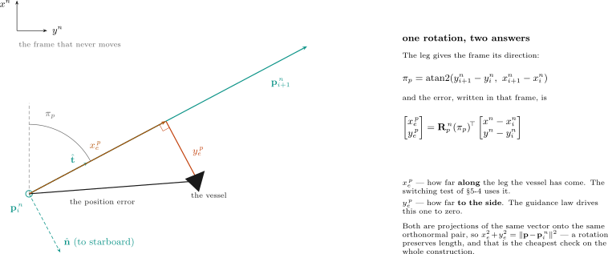

**Reading the figure.**

| Where to look | What is there | Why |
|---|---|---|
| the dashed pair at waypoint $k$ | $\hat{\mathbf t}$ along the leg, $\hat{\mathbf n}$ to starboard | step 2: the leg carries its own frame |
| the black arrow | the position error, before it is resolved | the one vector both errors are components of |
| the brown segment on the leg | $x_e$ — how far along | step 3, first row |
| the red segment perpendicular to it | $y_e$ — how far off | step 3, second row |
| the right angle where they meet | $\hat{\mathbf t} \perp \hat{\mathbf n}$ | which is what makes them independent |
| the grey arc at the waypoint | $\pi_p$, measured from north | step 1 |

**Three properties worth stating before they are used.**

1. **It is a rotation, so it preserves length.** $x_e^2 + y_e^2 = \lVert\mathbf p - \mathbf p_k\rVert^2$ exactly. That identity is the cheapest check on the whole construction, and it is what `verify_w05_guidance` check 5 tests.
2. **The sign of $y_e$ is a convention with consequences.** Written as above, $y_e > 0$ means the vessel is to **starboard** of the leg, and §5-3's law then subtracts a positive correction — turning to port, back towards the path. Swap the two sine terms and the vessel runs away from the path at the same speed.
3. **Do not compute $y_e$ from a distance formula.** The perpendicular distance $\lvert(N-N_k)\sin\pi_p - (E-E_k)\cos\pi_p\rvert$ gives the magnitude but throws away the sign and gives no $x_e$ at all — and §5-4 needs $x_e$. One rotation answers both questions and cannot make them disagree.

> [!note] The same two lines, in Fossen's notation
> This is the form used throughout the field, and the reference implementation is Fossen's TTK4190 lecture code — the source of the version taught in *2. USV 제어기 설계*:
>
> ```matlab
> pi_p = atan2(yk_next-yk, xk_next-xk);        % path-tangential angle w.r.t. North
> % along-track and cross-track errors (x_e, y_e) expressed in NED
> x_e =  (x-xk) * cos(pi_p) + (y-yk) * sin(pi_p);
> y_e = -(x-xk) * sin(pi_p) + (y-yk) * cos(pi_p);
> ```
>
> with $(x, y)$ north and east. The `guidance` block of this week is these lines, and §5-4's switching test is the next two. The rotation gives the same $y_e$ as MSS `crosstrackWpt.m` to machine precision (`verify_w05_guidance` check 5).

- The goal of path following is $y_e \to 0$; $x_e$ is not driven anywhere, it is only **watched**, and §5-4 is what watches it.

### Experiment 5-1 · The guidance layer on the canvas (10 min)

**What it measures.** Nothing yet: the four blocks of the table above are matched to the canvas, and the rotation that produces $y_e$ is read inside the block that performs it.

**The canvas.** `W05_G_tuning` — the fullest model of the week, read here and measured in Experiment 5-6. Everything except the `guidance` block is Week 4, unchanged and not retuned.

**Opening and running.**

```matlab
W05_0_setup
open_system('W05_G_tuning')        % Run — XY 그래프에 항적이 그려진다 / the track is drawn live
```

- Double-click `guidance` and read the numbered comments: the active leg, the rotation into $(x_e, y_e)$, the switching test of §5-4, and the law of §5-3 and §5-5.
- Double-click `heading autopilot`: the two gains of Week 4 and nothing else. The path does not appear anywhere in it.

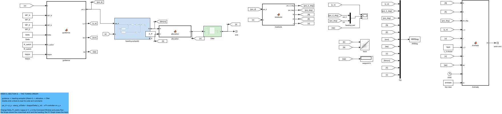

| In the figure | Meaning |
|---|---|
| `guidance` | the guidance law of §5-3 and §5-5; outputs $\psi_d$, $y_e$, the integral `aux` and the leg number `wp` |
| `heading autopilot` | the Week 4 gains, D on the yaw rate (§5-1), not retuned |
| `allocation`, `Otter` | the thrust split of Week 4 and the vessel |
| Goto `[x]` after the Otter | the twelve states, sent to the guidance, the autopilot and the readouts |
| `readouts` | the headings in degrees and the position, for display only |
| Scope, `track` (XY Graph), `W05log` | the cross-track error and headings; the track, east against north; the log |

> [!tip] In class
> - **Purpose** — show where guidance sits: one block in front of the autopilot of Week 4, which is not touched.
> - **Point to** — double-click `guidance` and read the numbered comments: the leg, the rotation to $y_e$, the switching test, the law.
> - **Ask** — "What does the autopilot know about the path?" Nothing. It follows $\psi_d$; the path lives only in the guidance.
> - **Take away** — guidance is a controller whose output is another controller's command.

## 5-2. Aiming at a point is not following a line

This section answers: why not simply point at the next waypoint?

**What is observed.** The vessel starts 20 m east of a path running north and is steered by the obvious law, $\psi_d = \operatorname{atan2}(E_{k+1} - E,\ N_{k+1} - N)$ — point at the next waypoint:

- halfway to the waypoint it is still $10.75$ m off the path, more than half its starting offset,
- it reaches the path only **at** the waypoint, and then leaves it again on the next leg,
- while the law of §5-3, given the same start, is within $0.04$ m of the path at the same point.

**What follows from it, one line at a time.**

1. `atan2` closes the distance to a **point**. The line it draws is the line from the vessel to the waypoint, and that line is not the path unless the vessel is already on it.
2. The quantity that measures "off the path" is therefore not the distance to the waypoint but the perpendicular distance to the **line**, the cross-track error $y_e$ of §5-1.
3. `atan2` never uses $y_e$, so nothing in it drives $y_e$ to zero: the error falls only as a side effect of arriving, which is why it vanishes exactly at the waypoint and not before.
4. A guidance law that follows a path must take $y_e$ as its input and return a heading that reduces it. That is §5-3, and it makes the law a feedback controller like every other one in this course.
5. On a real mission the waypoints are far apart and the space **between** them is where the vessel is asked to be, so the error of line 1 is the whole mission rather than an approach transient.

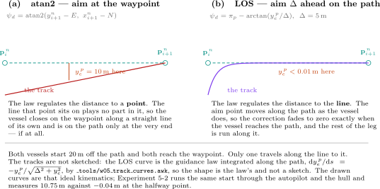

**Reading the figure.**

| Where to look | What is there | Which line predicts it |
|---|---|---|
| (a), the red track | a straight line from the start to the waypoint | line 1: `atan2` closes the distance to a **point**, and the shortest way to a point is a straight line |
| (a), the label at halfway | $y_e = 10$ m, half the starting offset, purely by geometry | line 3: nothing in the law is acting on $y_e$ |
| (a), where the track meets the path | only at the waypoint itself | line 3: the error vanishes as a side effect of arriving |
| (b), the purple track | it bends onto the path and then runs along it | line 4: the law takes $y_e$ as its input |
| (b), the label at halfway | under $0.01$ m — the law has already finished | §5-3: the correction fades as the error does |
| both panels | the same start, the same waypoint, the same vessel | the only difference is which quantity the law reads |

- The drawn curves are the guidance law **integrated along the path**, $\mathrm{d}y_e/\mathrm{d}s = -y_e/\sqrt{\Delta^2 + y_e^2}$, not sketches — so the shape is the law's own. Experiment 5-2 puts the same start through the autopilot and the hull, where the vessel lags slightly:

Measured by Experiment 5-2, below:

| Law | $y_e$ at 50 m north | at 100 m (the waypoint) | at 150 m |
|---|---|---|---|
| atan2 | 10.75 m | 0.50 m | −0.74 m |
| LOS (§5-3) | −0.04 m | 0.01 m | 0.01 m |

### Experiment 5-2 · Aiming at the waypoint (10 min)

**What it measures.** Lines 1 and 3: how far from the path the obvious law leaves the vessel, at three points along one leg, against the law that uses $y_e$.

**The model.** `W05_C_atan2` — the guidance block switched to the `atan2` law, everything behind it (autopilot, allocation, Otter) exactly as Week 4 left it. The waypoints are set to one straight path north, so that the two laws differ in nothing but their own definition.

**Opening and running.**

```matlab
W05_0_setup
WP_N = [0 100 200 300]'; WP_E = [0 0 0 0]';    % 북쪽으로 곧은 경로 / a straight path north
open_system('W05_C_atan2')         % Run — XY 그래프에서 대각선으로 접근한다 / a diagonal approach
W05_C_aim_at_the_waypoint          % 두 법칙을 나란히 / both laws, side by side
```

Expected output:

```
  W05 Experiment 5-2  aiming at the waypoint against line of sight (start 20 m east of the path)
    law     y_e at N = 50 m   N = 100 m   N = 150 m
    atan2            10.75        0.50       -0.74
    LOS              -0.04        0.01        0.01
```

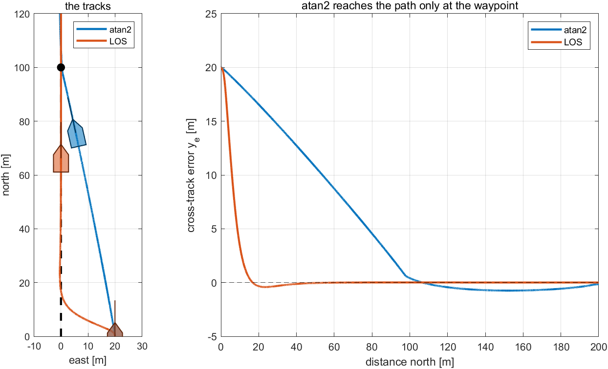

| In the figure | Meaning |
|---|---|
| left | the two tracks with hull silhouettes; the dashed line is the path, the dot the waypoint at 100 m |
| right | the cross-track error against the distance north |

**Reading the figure against the derivation.**

| Where to look | What is there | Which line predicts it |
|---|---|---|
| left panel, the **straightness** of the atan2 track | a diagonal drawn at the waypoint | line 1: the law aims at a point, and a constant bearing gives a straight run |
| right panel, the atan2 curve at $N = 100$ m | it touches zero, and only there | line 3: the error vanishes on arrival, not before |
| right panel, the atan2 curve **past** the waypoint | it leaves zero again, $-0.74$ m | line 1 on the next leg: a new point, a new diagonal |
| right panel, the LOS curve | on zero within about 20 m and staying there | line 4: a law that is fed $y_e$ drives $y_e$ |
| left panel, the hull silhouettes on the atan2 track | pointing at the waypoint throughout | line 1 again: that heading is exactly what the law asks for |

**What the figure says**

- atan2 draws a straight line to the waypoint and meets the path only there; LOS is on the path within 20 m.

| What to try | What to watch |
|---|---|
| `E0 = 5;` Run | $2.80$ m left at $N = 50$ m instead of $10.75$ — **the same fraction** of the starting offset, $0.56$ against $0.54$. Line 1 is a geometric fault, not a matter of size; LOS leaves $0.02$ m in the same run |
| `WP_N = [0 400]'; WP_E = [0 0]'; E0 = 20;` Run | on one long leg the atan2 track is $10.70$ m off at the halfway point and $5.58$ m off three-quarters of the way: line 5, the error **is** the mission |

> [!tip] In class
> - **Purpose** — show that "go to the waypoint" and "follow the path" are different goals.
> - **Point to** — the blue track cutting diagonally to the waypoint while the orange one turns onto the path at once.
> - **Ask** — "Why is atan2 still 10.75 m off halfway?" It reduces the distance to the waypoint, and the line to the waypoint is not the path.
> - **Take away** — guidance must measure the distance to the line, $y_e$, and act on it.

## 5-3. Line of sight: a P controller on the cross-track error

This section answers: what law brings the vessel onto the line, and what is its one tuning knob?

**The law.** Instead of the waypoint, aim at a point on the path a distance $\Delta$ ahead:

$$
\psi_d = \pi_p - \arctan\!\left(\frac{y_e}{\Delta}\right)
$$

- $\pi_p$ says "line up with the path"; the arctan says "lean towards it, by an angle that grows with how far off the vessel is". On the path, $y_e = 0$ and the vessel simply heads along the leg; far from it, the lean approaches $90°$ and the vessel heads straight at the path.

**Where the arctan comes from.** It is not a choice of function — it is the angle of a right triangle. Drop a perpendicular from the vessel to the path; its foot is the point on the path abeam the vessel. Now step a distance $\Delta$ **along the path** from that foot: that is the aim point. The triangle with legs $\Delta$ (along the path) and $y_e$ (across it) has

$$
\tan(\text{the lean}) = \frac{y_e}{\Delta}
\qquad\Longrightarrow\qquad
\text{the lean} = \arctan\!\left(\frac{y_e}{\Delta}\right)
$$

and the command is $\pi_p$ turned by that lean, towards the path — hence the minus sign, with $y_e$ positive to starboard.

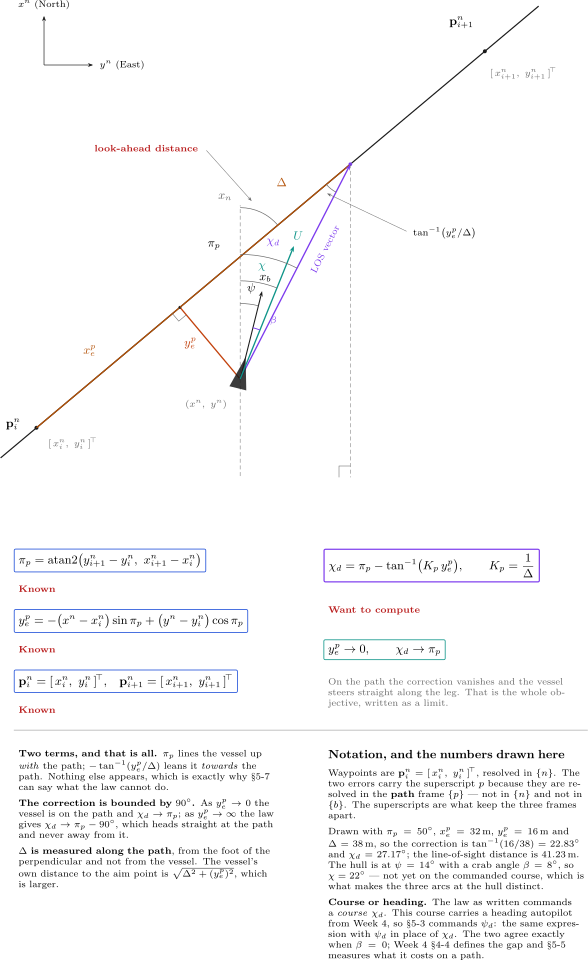

**Reading the figure.**

| Where to look | What is there | Why |
|---|---|---|
| the right angle on the path | the foot of the perpendicular, abeam the vessel | it is the origin the look-ahead is measured from |
| the segment marked $\Delta$ | measured **along the path**, from the foot | not from the vessel: the vessel's own distance to the aim point is $\sqrt{\Delta^2 + y_e^2}$, which is longer |
| the purple ray | the line of sight, vessel to aim point | the name of the law: the vessel looks at a point and steers at it |
| the arc marked $\arctan(y_e/\Delta)$ | the lean, between the path direction and the line of sight | the right triangle above |
| $\pi_p$ at the lower waypoint | the path direction, from north | §5-1 step 1 |
| the two brown segments | $x_e$ and $y_e$ of §5-1 | the law uses only the second of them |
| the three arcs at the hull | $\psi$, $\chi$ and $\chi_d$ — heading, course and commanded course | they differ by the crab angle of Week 4 §4-4, which is §5-5's subject |

- **Two terms, and that is all.** $\pi_p$ lines the vessel up *with* the path; $-\arctan(y_e/\Delta)$ leans it *towards* the path. Nothing else appears — which is exactly why §5-5 can say what this law cannot do.
- **The correction is bounded by $90°$.** As $y_e \to 0$ the lean goes to zero and $\psi_d \to \pi_p$; as $y_e \to \pm\infty$ it approaches $\mp 90°$, heading straight at the path and never away from it. A law built from a raw gain $-K y_e$ has no such bound and would command absurd headings far from the path.

**It is a P controller.** For errors small against $\Delta$, $\arctan(y_e/\Delta) \approx y_e/\Delta$ (within 1.4 % for $\lvert y_e\rvert \le 0.2\Delta$, `verify_w05_guidance` check 2), and

$$
\psi_d - \pi_p \approx -\frac{1}{\Delta}\, y_e \qquad\Longrightarrow\qquad K_p = \frac{1}{\Delta}
$$

| Symbol | Quantity | Value |
|---|---|---|
| $\Delta$ | look-ahead distance | $5$ m, `W05_0_setup.m` |
| $1/\Delta$ | the P gain: heading correction per metre of error | $0.2$ rad/m |

So $\Delta$ is tuned like $K_p$ in Weeks 2 to 4, backwards: a **smaller** $\Delta$ is a **larger** gain.

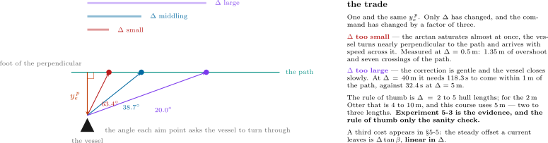

**Reading the figure.**

| Where to look | What is there | Why |
|---|---|---|
| the three aim points on the path | all three lie on the path, at $\Delta$ = small, middling, large from the same foot | only $\Delta$ has changed |
| the single red segment $y_e$ | one and the same error in all three cases | so the figure isolates $\Delta$ and nothing else |
| the three angles, $53.1°$, $38.7°$, $20.0°$ | what each aim point asks the vessel to turn through | $\arctan(y_e/\Delta)$ with one numerator and three denominators |
| the ratio between them | a factor of about three in the command, from a factor of three in $\Delta$ | $\Delta$ is the gain, read backwards |

- The trade is the P sweep of Week 2 §2-6 in new clothing: too small a $\Delta$ saturates the arctan, turns the vessel nearly perpendicular to the path, and arrives with speed across it; too large a $\Delta$ closes gently and slowly.

Measured by Experiment 5-3, below:

| $\Delta$ [m] | $1/\Delta$ | within 1 m after [s] | overshoot [m] | zero crossings |
|---|---|---|---|---|
| 0.5 | 2.000 | 27.7 | 1.35 | 7 |
| 1 | 1.000 | 27.9 | 0.70 | 2 |
| 2.5 | 0.400 | 29.1 | 0.42 | 2 |
| 5 | 0.200 | 32.4 | 0.41 | 2 |
| 10 | 0.100 | 41.7 | 0.41 | 2 |
| 20 | 0.050 | 65.2 | 0.40 | 1 |
| 40 | 0.025 | 118.3 | 0.40 | 1 |

- A large $\Delta$ is slow; a small one overshoots and swings. $\Delta = 5$ m — two to three hull lengths — reaches the path almost as fast as the smallest values without swinging, and is the choice.

### Experiment 5-3 · The look-ahead distance (15 min)

**What it measures.** That $\Delta$ behaves exactly as $1/K_p$: the sweep below is the P sweep of Week 2 §2-6 read backwards, on one long leg so that nothing but the gain is in play.

**The model.** `W05_D_LOS` — the guidance block switched to the LOS law. The waypoints are one 400 m leg, long enough for the transient to finish before any corner.

**Opening and running.**

```matlab
W05_0_setup
WP_N = [0 400]'; WP_E = [0 0]';    % 긴 다리 하나 / one long leg
open_system('W05_D_LOS')           % Run — Delta = 5 m / the chosen value
Delta = 0.5;                       % Run — 지그재그로 다가간다 / it zigzags onto the path
Delta = 40;                        % Run — 한참 걸린다 / it creeps
W05_D_lookahead_distance           % 일곱 값을 한 번에 / all seven values at once
```

Expected output:

```
  W05 Experiment 5-3  LOS, the look-ahead distance  (start 20 m east of the path)
    Delta [m]   P gain 1/Delta   within 1 m after [s]   overshoot [m]   zero crossings
    0.5                  2.000                   27.7            1.35                7
    1                    1.000                   27.9            0.70                2
    2.5                  0.400                   29.1            0.42                2
    5                    0.200                   32.4            0.41                2
    10                   0.100                   41.7            0.41                2
    20                   0.050                   65.2            0.40                1
    40                   0.025                  118.3            0.40                1
```

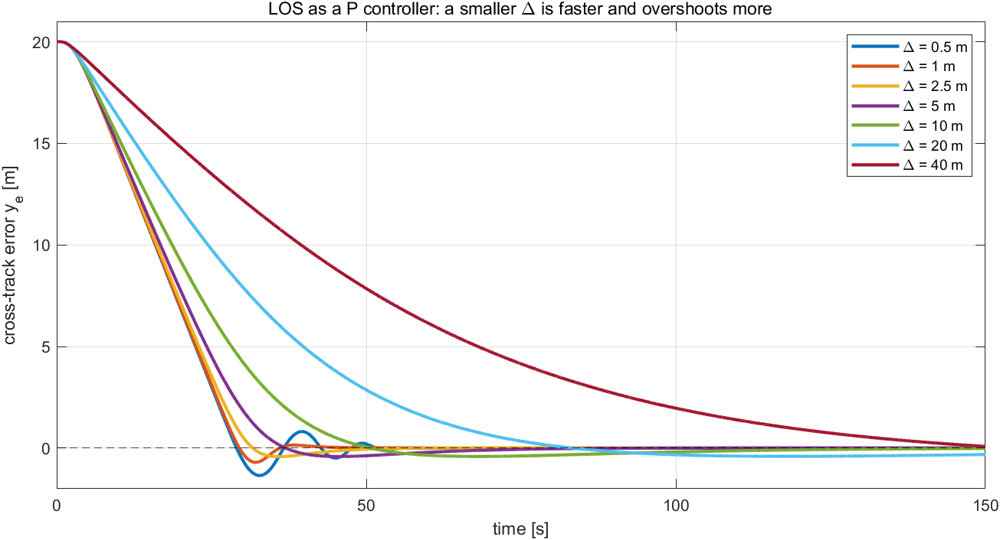

| In the figure | Meaning |
|---|---|
| traces | the cross-track error against time from 20 m off the path, one per $\Delta$ |

**Reading the figure against the law.**

| Where to look | What is there | What it corresponds to |
|---|---|---|
| the **steepness** of each trace at the start | steeper the smaller $\Delta$ is | $K_p = 1/\Delta$: a larger gain pushes harder on the same error |
| the $\Delta = 0.5$ m trace **crossing zero** repeatedly | 7 crossings, overshoot $1.35$ m | too large a gain rings, as in Week 2 §2-6 — here the ringing is a zigzag across the path |
| the $\Delta = 40$ m trace | within 1 m only after $118.3$ s | too small a gain is slow, and $1/40$ is a very small gain |
| the middle traces, $\Delta = 2.5$ to $10$ m | all reach 1 m within 29 to 42 s with the same $0.41$ m of overshoot | the flat part of the trade-off, where the choice is made |
| every trace, once on the path | it stays there | the law has no steady-state error to leave on a straight path with no current — §5-5 is where that changes |

**What the figure says**

- The curves fan out exactly as a P gain sweep does: the small $\Delta$ drops fast and crosses back and forth; the large one creeps.

| What to try | What to watch |
|---|---|
| `Delta = 0.2;` Run | the zigzag never stops: **44** crossings of the path and still $1.20$ m off at the end of the leg. This is a $K_p$ raised past its limit, with the hull's own turn rate as the slow element |
| `Delta = 100;` Run | one crossing and no zigzag at all, but the path is reached only after $286$ s — a gain of $0.01$ rad/m spends the whole leg converging |

> [!tip] In class
> - **Purpose** — recognise a familiar controller in an unfamiliar law.
> - **Point to** — the $\Delta = 0.5$ m trace crossing zero repeatedly; the $\Delta = 40$ m trace still 5 m off after 100 s.
> - **Ask** — "Which way does the gain go when $\Delta$ is halved?" Up: $K_p = 1/\Delta$ doubles.
> - **Take away** — tune $\Delta$ as $K_p$ was tuned: the smallest value that does not swing.

## 5-4. When to move to the next leg

This section answers: at a corner, when does guidance switch to the next leg?

**What is observed.** The same mission is run with five switching distances, and the corners are where the tracks differ:

- with $R = 20$ m the vessel turns early and passes almost $20$ m from the new leg,
- with $R = 1$ m it runs **past** the corner before turning, and sweeps $3.70$ m outside the sharpest one,
- and the mission finishes sooner the larger $R$ is: $305$ s against $364$ s.

**What follows from it, one line at a time.**

1. The switch is a test on the **along-track** coordinate: the guidance moves to the next leg when less than $R$ of the active leg remains, $d - x_e < R$, with $d$ the leg's length. This is the test MSS uses, and it is a distance along the path rather than a circle round the waypoint.

**The two tests, and why they are not the same.** Both are one line of code and they disagree:

$$
\text{along-track:}\quad d - x_e < R
\qquad\qquad
\text{acceptance circle:}\quad \lVert \mathbf p - \mathbf p_{k+1}\rVert \le R
$$

| Symbol | Quantity | Value · source |
|---|---|---|
| $d$ | the length of the active leg | m · $\lVert\mathbf p_{k+1} - \mathbf p_k\rVert$ |
| $x_e$ | how far along it the vessel has come | m · §5-1 |
| $d - x_e$ | what is **left to run** along the leg | m · negative once the vessel is past the waypoint |
| $R$ | the switching distance | $3$ m · `R_switch`, chosen in line 4 |

Writing the true distance in path-frame components shows the relation exactly:

$$
\lVert \mathbf p - \mathbf p_{k+1}\rVert = \sqrt{(d - x_e)^2 + y_e^2} \;\ge\; d - x_e
$$

2. **On the path the two agree; off it they never do.** With $y_e = 0$ the square root collapses to $d - x_e$ and the tests are identical. With $y_e \neq 0$ the circle test is **always the stricter of the two**, by an amount that grows with how far off the path the vessel is — so a vessel that is running wide can satisfy the along-track test and fail the circle at the same instant.

3. **The circle can be missed altogether.** A vessel whose cross-track error never falls below $R$ never enters the circle, passes the waypoint, and waits for an arrival that has already happened — for ever. The along-track test cannot fail that way: $d - x_e$ goes negative the moment the vessel crosses the line through the waypoint perpendicular to the leg, whatever its cross-track error. This is not a hypothetical; Week 9 §9-5 loses a whole mission to it at $1.3$ m/s of current.

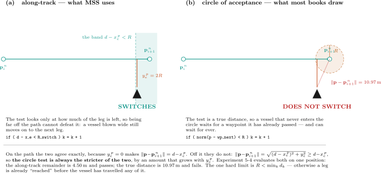

**Reading the figure.**

| Where to look | What is there | Which line predicts it |
|---|---|---|
| (a), the shaded band before the waypoint | the region where $d - x_e < R$ | line 1: the test is a distance **along** the leg |
| (a), the vessel a whole $y_e = 2R$ off the path | still inside the band, and it switches | line 3: being off the path cannot defeat the along-track test |
| (b), the circle of radius $R$ round the waypoint | the region where $\lVert\mathbf p - \mathbf p_{k+1}\rVert \le R$ | the other test, drawn |
| (b), the same vessel, outside the circle | $10.97$ m away, and it does **not** switch | line 2: the circle is the stricter test |
| the two code lines under the panels | `d - x_e < R_switch` against `norm(p - wp_next) < R` | one line of difference, and the whole behaviour |
| the caption's arithmetic | along-track remainder $4.50$ m passes; true distance $10.97$ m fails | line 2: $\sqrt{(d-x_e)^2 + y_e^2} \ge d - x_e$, here by $6.47$ m |

4. **There is one hard limit on $R$**, and it belongs to the along-track test: $R < \min_k d_k$. If $R$ exceeds a leg's own length, then $d - x_e < R$ is true the instant the leg becomes active, and that leg is "reached" before the vessel has travelled any of it.

5. **A large $R$ cuts the corner.** At the instant of the switch the vessel is still on the old leg, $R$ before its end, so it is about $R$ away from the new leg — and the new leg is what $y_e$ is now measured against. Hence the largest distance is close to $R$ itself in the last three rows.
6. **A small $R$ carries the vessel past the corner.** The turn begins only at the corner, and the hull cannot turn instantly: at $0.77$ m/s it sweeps outside, $3.70$ m at the $135°$ corner for $R = 1$ m. The sharper the corner, the further it goes.
7. Lines 5 and 6 pull in opposite directions, so the best $R$ is the one whose **worst** corner is smallest — $R = 3$ m, at $2.98$ m.
8. Cutting corners is not wrong in itself; it also finishes sooner. The choice made here is to stay close to the path, and a survey that must cover its lines exactly would choose differently.

Measured by Experiment 5-4, below, on the five-waypoint mission with $\Delta = 5$ m:

| $R$ [m] | largest distance from the new leg at corners 1, 2, 3 [m] | last waypoint reached at [s] |
|---|---|---|
| 1 | 2.06, 2.08, 3.70 | 363.5 |
| 3 | 2.98, 2.98, 2.29 | 352.8 |
| 5 | 4.98, 4.98, 3.53 | 344.0 |
| 10 | 9.97, 9.98, 7.04 | 328.0 |
| 20 | 19.97, 19.98, 14.08 | 305.4 |

### Experiment 5-4 · Waypoint switching (10 min)

**What it measures.** Lines 5, 6 and 7: how far from the new leg each switching distance leaves the vessel at the three corners, and how long the mission then takes.

**The model.** `W05_E_switching` — the LOS law on the full five-waypoint mission, with $\Delta$ fixed at the value Experiment 5-3 chose. Only `R_switch` changes between runs, and the XY Graph shows the corners as they are rounded.

**Opening and running.**

```matlab
W05_0_setup
open_system('W05_E_switching')     % Run — R = 3 m / the chosen value
R_switch = 20;                     % Run — 모퉁이를 크게 자른다 / it cuts the corners wide
R_switch = 1;                      % Run — 모퉁이를 지나쳐서 돈다 / it runs past them
W05_E_waypoint_switching           % 다섯 값을 한 번에 / all five values at once
```

Expected output:

```
  W05 Experiment 5-4  waypoint switching on the mission  (LOS, Delta = 5 m, no current)
    R_switch [m]   largest distance from the new leg at corners 1, 2, 3 [m]   last waypoint at [s]
    1                      2.06   2.08   3.70                                363.5
    3                      2.98   2.98   2.29                                352.8
    5                      4.98   4.98   3.53                                344.0
    10                     9.97   9.98   7.04                                328.0
    20                    19.97  19.98  14.08                                305.4
```

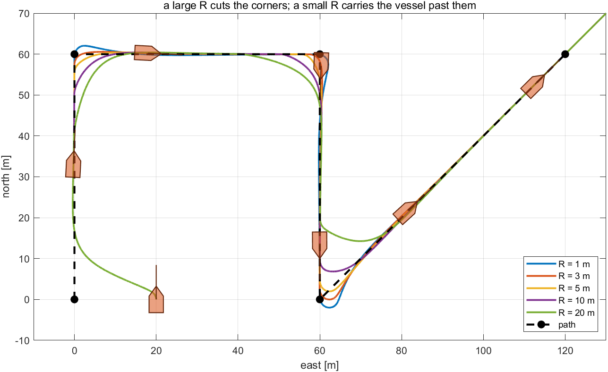

| In the figure | Meaning |
|---|---|
| coloured tracks | the mission for $R = 1$ to $20$ m; hulls drawn on $R = 3$ m |
| dashed line and dots | the path and its five waypoints |

**Reading the figure against the derivation.**

| Where to look | What is there | Which line predicts it |
|---|---|---|
| the $R = 20$ m track at the first corner | it leaves the leg some $20$ m early | line 2: the switch happens $R$ before the end of the leg |
| the largest-distance columns for $R = 5$, $10$, $20$ | $4.98$, $9.97$, $19.97$ m — each equal to $R$ | line 2 again, in numbers |
| the $R = 1$ m track at the **third** corner | the widest sweep of all, $3.70$ m | line 3: the turn starts at the corner, and the $135°$ corner is the sharpest |
| the $R = 3$ m columns | $2.98$, $2.98$, $2.29$ m — the smallest worst case | line 4: the compromise between the two |
| the last column, top to bottom | $363.5 \to 305.4$ s | line 5: cutting corners shortens the mission |
| the straight parts between corners | every track lies on the path | §5-3: the switching distance decides the corners only |

**What the figure says**

- The green track rounds every corner early and wide; the blue one runs past each corner before turning. $R = 3$ m sits between them.

| What to try | What to watch |
|---|---|
| `R_switch = 50;` Run | almost as long as a 60 m leg: the guidance switches as soon as a leg begins, the vessel is never nearer than $49.98$ m to the leg it is supposed to follow, and it reaches the last leg in $146.9$ s by flying the diagonal |
| `Delta = 20; R_switch = 3;` Run | the worst corner grows to $7.93$ m although $R$ has not changed — a gain of $1/20$ cannot pull the vessel onto the new leg quickly, so $\Delta$ and $R$ are read together |

> [!tip] In class
> - **Purpose** — the second tuning knob, set from what the corners look like.
> - **Point to** — the corner at (60, 0), where the tracks spread the most.
> - **Ask** — "Why does the largest distance equal $R$ for large $R$?" At the switch the vessel is on the old leg, $R$ before the corner — $R$ from the new leg.
> - **Take away** — too early cuts, too late overshoots; choose from the worst corner.

## 5-5. A current, and the integral that removes its offset (ILOS)

This section answers: what does LOS do when a current pushes the vessel sideways, and how is it fixed?

**What is observed.** The same LOS law, the same $\Delta$, with a current flowing east across a path running north:

- the vessel settles **parallel to the path but beside it** — $2.107$ m off in a $0.3$ m/s current, and it stays there,
- while pointing $22.8°$ into the current,
- and the offset grows with the current: $0.658$, $1.344$, $2.107$, $3.012$ m.

**What follows from it, one line at a time.**

1. To travel north across an eastward current the vessel must **point** west of north: the crab angle of Week 4 §4-4. Its course is along the path while its heading is not.
2. LOS produces that heading only through $\arctan(y_e/\Delta)$, so it can hold a heading away from $\pi_p$ **only while $y_e \neq 0$**. This is Week 2 §2-6 line 7 once more: a proportional law makes its output out of error alone.
3. In the steady state the heading held equals the heading asked for, $\psi = \psi_d = \pi_p - \arctan(y_e/\Delta)$. Solving for the error,
$$
y_e = \Delta\,\tan(\pi_p - \psi)
$$
4. The offset is therefore **predictable, not mysterious**: it is $\Delta$ times the tangent of the crab angle the current forces. The measurements below match it to the millimetre (`verify_w05_guidance` check 3).
5. Reducing $\Delta$ would shrink the offset, by line 4 — but $\Delta$ was already chosen in §5-3 for the transient, and a smaller one zigzags. Two requirements, one knob: the standing answer of this course is to add the **integral** instead.

Measured by Experiment 5-5a, below, a current flowing east across a path north:

| current [m/s] | $y_e$ left [m] | heading held [deg] | $\Delta\tan(\text{heading})$ [m] |
|---|---|---|---|
| 0.1 | 0.658 | −7.5 | 0.658 |
| 0.2 | 1.344 | −15.0 | 1.344 |
| 0.3 | 2.107 | −22.8 | 2.107 |
| 0.4 | 3.012 | −31.1 | 3.012 |

- The last two columns are line 4: prediction and measurement agree to the millimetre in every row. Heading is not course — the vessel points $22.8°$ into a $0.3$ m/s current and travels due north.

**ILOS adds the integral.** As in Weeks 2 to 4, the cure for the error a P controller leaves is an integral:

$$
\psi_d = \pi_p - \arctan\!\left(\frac{y_e}{\Delta} + \frac{\kappa}{\Delta}\, y_{\text{int}}\right),
\qquad
\dot y_{\text{int}} = \frac{\Delta\, y_e}{\Delta^2 + (y_e + \kappa\, y_{\text{int}})^2}
$$

| Symbol | Quantity | Value |
|---|---|---|
| $y_{\text{int}}$ | the integral state | m·s scaled; starts at 0 |
| $\kappa$ | integral constant; the I gain is $\kappa/\Delta$ | $0.3$, `W05_0_setup.m` |

6. Near the path $\arctan x \approx x$ again, so the law reads $\psi_d - \pi_p \approx -(1/\Delta)\,y_e - (\kappa/\Delta)\,y_{\text{int}}$: **PI on the cross-track error**, with $K_p = 1/\Delta$ from §5-3 and $K_i = \kappa/\Delta$.
7. The integral state therefore does for the current what the integral of Week 3 did for the drag: it holds the crab angle by itself, so that line 2 no longer needs an error to produce one.
8. The denominator $\Delta^2 + (y_e + \kappa y_{\text{int}})^2$ grows with the error, so the state barely integrates while the vessel is far off the path — **anti-windup built into the law**, in place of the back-calculation bolted on in Weeks 2 to 4 (Børhaug, Pavlov and Pettersen, 2008; Fossen, *Handbook*, 2nd ed., §12.3).

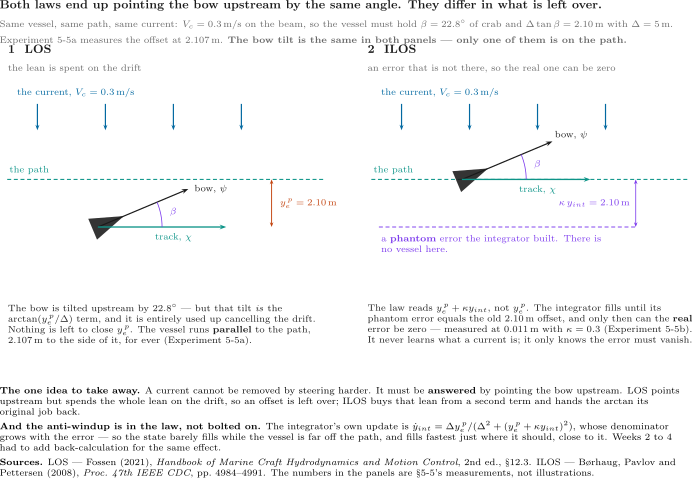

**Reading the figure against the derivation.**

| Where to look | What is there | Which line predicts it |
|---|---|---|
| both panels, the bow arrow | tilted upstream by the **same** $22.8°$ | line 1: the crab angle is set by the current and the speed, not by the law |
| panel 1, where the hull sits | below the path, and its track is **parallel** to it | line 2: LOS can hold that tilt only while $y_e \neq 0$ |
| panel 1, the red marker | $y_e = 2.10$ m, which is $\Delta\tan\beta$ | line 3: the offset is the tangent, measured at $2.107$ m |
| panel 2, where the hull sits | **on** the path, with the same tilt | line 7: the integral now holds the tilt, so the error need not |
| panel 2, the dashed line below the path | $\kappa y_{\text{int}} = 2.10$ m — a **phantom** error, with no vessel on it | line 6: the law reads $y_e + \kappa y_{\text{int}}$, and that sum is what must vanish |
| the two together | nothing about the current appears in either law | line 7: ILOS never learns what a current is; it only knows the sum must be zero |

**What the figure says**

- The integral does not fight the current. It **replaces the error the current was producing** with one of its own, so that the arctan keeps leaning the bow by exactly as much as before while the real error goes to zero.

Measured by Experiment 5-5b at 0.3 m/s, with $\Delta = 5$ m:

| $\kappa$ | mean $y_e$, last 100 s [m] | overshoot [m] |
|---|---|---|
| LOS ($\kappa = 0$) | 2.107 | 0 |
| 0.1 | 0.009 | 0.03 |
| 0.3 | 0.011 | 1.79 |
| 1 | −0.011 | 4.10 |
| 3 | 0.169 | 6.32 |

- Every $\kappa$ removes the offset — line 7 — and a larger one overshoots more, which is the price of every integral since Week 2. On a single long leg $\kappa = 0.1$ is the cleanest; §5-6 chooses on the mission, where the legs are short and the integral has less time.

### Experiment 5-5a · The offset a current leaves under LOS (7 min)

**What it measures.** Lines 3 and 4: the error LOS settles at in four currents, against $\Delta\tan$ of the heading it holds.

**The model.** `W05_F_LOS` — the LOS law of §5-3 on one straight 400 m leg, long enough for the offset to settle. Only the current changes between runs.

**Opening and running.**

```matlab
W05_0_setup
WP_N = [0 400]'; WP_E = [0 0]'; V_c = 0.3;     % 동쪽으로 0.3 m/s / 0.3 m/s to the east
open_system('W05_F_LOS')           % Run — 경로와 나란히, 2.1 m 옆으로 / parallel, 2.1 m beside it
V_c = 0.4;                         % Run — 더 비스듬히 서고 더 벌어진다 / further off
W05_F_LOS_in_a_current             % 조류 네 가지를 한 번에 / all four currents at once
```

Expected output:

```
  W05 Experiment 5-5a  LOS in a current flowing east  (Delta = 5 m)
    V_c [m/s]   error left [m]   heading held [deg]   Delta*tan(heading) [m]
    0.1                  0.658                 -7.5                    0.658
    0.2                  1.344                -15.0                    1.344
    0.3                  2.107                -22.8                    2.107
    0.4                  3.012                -31.1                    3.012
```

- The last two columns are line 4, to the millimetre in every row. The vessel points $22.8°$ into a $0.3$ m/s current and travels due north — Week 4 §4-4, now costing a path error.

### Experiment 5-5b · The integral that removes it (8 min)

**What it measures.** Line 7: the same current with the integral state switched on, for four values of $\kappa$ — and what each one costs in overshoot.

**The model.** `W05_F_ILOS` — the same guidance block with the integral state of the law above. The black line in the figure is the run of Experiment 5-5a, for comparison.

> [!important] What to open, and what to read inside it
> The integral of this week is **not** a Simulink `Integrator` block. It lives inside the `guidance` MATLAB Function, because its update depends on the very quantity it is producing — and that is easier to read as two lines than as a loop of blocks.
>
> Double-click `guidance` in `W05_F_ILOS` and look for three things:
>
> ```matlab
> persistent k y_int                    % 이 블록이 기억하는 것 둘: 지금 다리, 적분 상태
> if isempty(k), k = 1; y_int = 0; end  % Run 을 누를 때마다 처음으로 돌아간다
>
> psi_d = pi_p - atan(y_e/Delta + (kappa/Delta)*y_int);          % ① 법칙
> y_int = y_int + h * Delta*y_e / (Delta^2 + (y_e + kappa*y_int)^2);   % ② 적분
> ```
>
> | Read this | And see |
> |---|---|
> | `persistent k y_int` | the block has **memory**: the active leg and the integral state. Nothing else in the guidance block does |
> | line ① against §5-3's law | one extra term inside the same arctan — that is the whole of ILOS |
> | line ②'s denominator | $\Delta^2 + (y_e + \kappa y_{\text{int}})^2$, growing with the error: the anti-windup of line 8, with no saturation block and no back-calculation gain |
> | `kappa = 0` | line ② still runs but contributes nothing to line ①, so the block becomes exactly the LOS of §5-3. Not approximately: run this way it reproduces `W05_F_LOS` to $0.000\times10^{0}$ m, which is how Experiment 5-5a and this one are kept comparable |
>
> The block is discrete at $h$ (`set_mlfcn`'s sample-time argument), because a block with memory must be told how often to update it.

**Opening and running.**

```matlab
W05_0_setup
WP_N = [0 400]'; WP_E = [0 0]'; V_c = 0.3;
open_system('W05_F_ILOS')          % Run — 같은 조류, 오차가 사라진다 / the same current, no offset
open_system('W05_F_ILOS/guidance') % 적분 두 줄을 직접 본다 / the two lines above
kappa = 1;                         % Run — 더 빨리 없애지만 더 넘어간다 / faster, and past it
kappa = 0;                         % Run — 같은 블록이 LOS 가 된다 / the same block becomes LOS
kappa = 0.3;
W05_F_ILOS_removes_it              % kappa 네 가지를 한 번에 / all four values at once
```

Expected output:

```
  W05 Experiment 5-5b  ILOS at 0.3 m/s  (I gain = kappa / Delta)
    kappa   mean y_e, last 100 s [m]   overshoot [m]   integral state at 400 s
    0.1                        0.009            0.03                    20.95
    0.3                        0.011            1.79                     7.03
    1                         -0.011            4.10                     2.35
    3                          0.169            6.32                    -0.50
```

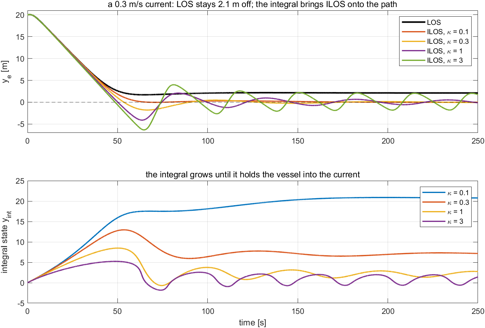

| In the figure | Meaning |
|---|---|
| top | the cross-track error: LOS in black, ILOS for four values of $\kappa$ |
| bottom | the integral state of each ILOS run |

**Reading the figure against the derivation.**

| Where to look | What is there | Which line predicts it |
|---|---|---|
| top panel, the black LOS line | flat at $2.107$ m, for ever | lines 2 and 3: the error is what produces the lean, so it cannot go |
| the LOS table, last two columns | equal in all four rows | line 4: $y_e = \Delta\tan$(crab angle) |
| top panel, every coloured trace | reaches zero and stays | line 7: the integral holds the lean instead |
| bottom panel, the states **levelling off** at $20.95$, $7.03$, $2.35$ | different values, same effect | line 6: what matters is the product $(\kappa/\Delta)\,y_{\text{int}}$, so a smaller $\kappa$ needs a larger state |
| top panel, the overshoot at $\kappa = 1$ and $3$ | $4.10$ m and $6.32$ m | the price of every integral since Week 2 §2-8: late correction arrives after it was needed |
| the first seconds of every trace, from 20 m off | no wind-up, no spike | line 8: while $y_e$ is large the denominator is large and the state hardly moves |

**What the figure says**

- LOS settles 2.1 m off the path; every ILOS settles on it, and a larger $\kappa$ gets there by swinging past.

| What to try | What to watch |
|---|---|
| `V_c = 0.5;` on `W05_F_LOS` | $4.234$ m off, holding $-40.3°$ — and $5\tan 40.3° = 4.234$ m: line 4 holds at any current |
| `Delta = 2.5; V_c = 0.3;` on `W05_F_LOS` | half the look-ahead distance halves the offset, $1.054$ m at the same $-22.9°$ heading, exactly as line 4 says. It also sharpens the transient, which is why §5-6 fixes $\Delta$ on the transient and leaves the current to $\kappa$ |

> [!tip] In class
> - **Purpose** — the same story as the P and I of Week 2, now on a path.
> - **Point to** — the black line holding 2.1 m; the integral states levelling off at different values that all produce the same steady lean into the current.
> - **Ask** — "Why does LOS not reach the path, when its heading is exactly what it commanded?" To hold the line across the current, the vessel must point into it, and LOS only commands that while $y_e \ne 0$.
> - **Take away** — a steady push leaves an error under P; the integral removes it.

## 5-6. The tuning order, applied to guidance

This section answers: in what order are the three parameters chosen?

The order of Week 2 §2-12: the proportional part first, the integral only for an error that remains.

| Step | What is chosen | From what measurement | Choice |
|---|---|---|---|
| 1 | $\Delta$, the P gain | Experiment 5-3: fast without swinging on a straight leg | 5 m |
| 2 | $R$, the switching distance | Experiment 5-4: the smallest worst corner | 3 m |
| 3 | $\kappa$, the I gain | Experiment 5-6: the mission in a 0.3 m/s current | below |

Measured by Experiment 5-6, below, mean $\lvert y_e\rvert$ on each leg from 25 s after entering it:

| $\kappa$ | leg 1 | leg 2 | leg 3 | leg 4 | sum of legs 2–4 [m] | last waypoint at [s] |
|---|---|---|---|---|---|---|
| 0 (LOS) | 3.29 | 0.12 | 2.14 | 1.38 | 3.64 | 330.4 |
| 0.1 | 2.04 | 1.22 | 1.33 | 0.55 | 3.10 | 337.0 |
| **0.3** | 2.29 | 0.40 | 0.38 | 0.14 | **0.92** | 338.8 |
| 0.5 | 2.44 | 0.30 | 0.48 | 0.15 | 0.93 | 342.6 |
| 1 | 2.62 | 0.24 | 0.66 | 0.18 | 1.07 | 349.8 |

- Leg 1 includes the 20 m start offset and is left out of the comparison. LOS leaves 2.14 m and 1.38 m on the legs that cross the current and almost nothing on leg 2, which runs with it.
- On 60 m legs $\kappa = 0.1$ is too slow. $\kappa = 0.3$ and $0.5$ are nearly equal; Experiment 5-5b showed a larger $\kappa$ overshoots more, so $\kappa = 0.3$.

The result, $\Delta = 5$ m, $R = 3$ m, $\kappa = 0.3$, is the default in `W05_0_setup.m`. No model of the vessel was used; only what the Scope and the track showed.

> [!note] What is left out this week
> The previous version of this week derived the laws in full, proved their stability with Lyapunov functions, and added a third law, ALOS, which estimates the crab angle directly. That material is kept in `W05_simulink/_previous_version/` for reference; nothing in this week's tuning depends on it.

### Experiment 5-6 · The tuning order (15 min)

**What it measures.** Step 3 of the order above, on the mission the guidance is actually for: mean $\lvert y_e\rvert$ leg by leg, in a current, for five values of $\kappa$ — and the time the mission takes.

**The model.** `W05_G_tuning` — ILOS on the five-waypoint mission with $\Delta$ and $R$ already fixed by Experiments 5-3 and 5-4. Only $\kappa$ changes.

**Opening and running.**

```matlab
W05_0_setup
V_c = 0.3; T_final = 450;          % 동쪽 조류 / a current to the east
open_system('W05_G_tuning')        % Run — kappa = 0.3 / the chosen value
kappa = 0;                         % Run — LOS 로 돌아간다 / back to LOS: it runs beside the path
W05_G_tuning_by_hand               % 다섯 값을 다리별로 / all five values, leg by leg
```

Expected output:

```
  W05 Experiment 5-6  the tuning order  (Delta = 5 m, R_switch = 3 m, current 0.3 m/s east)
    kappa   mean |y_e| on legs 1, 2, 3, 4 [m]   sum of legs 2-4 [m]   last waypoint at [s]
    0           3.29   0.12   2.14   1.38                  3.64                  330.4
    0.1         2.04   1.22   1.33   0.55                  3.10                  337.0
    0.3         2.29   0.40   0.38   0.14                  0.92                  338.8
    0.5         2.44   0.30   0.48   0.15                  0.93                  342.6
    1           2.62   0.24   0.66   0.18                  1.07                  349.8
```

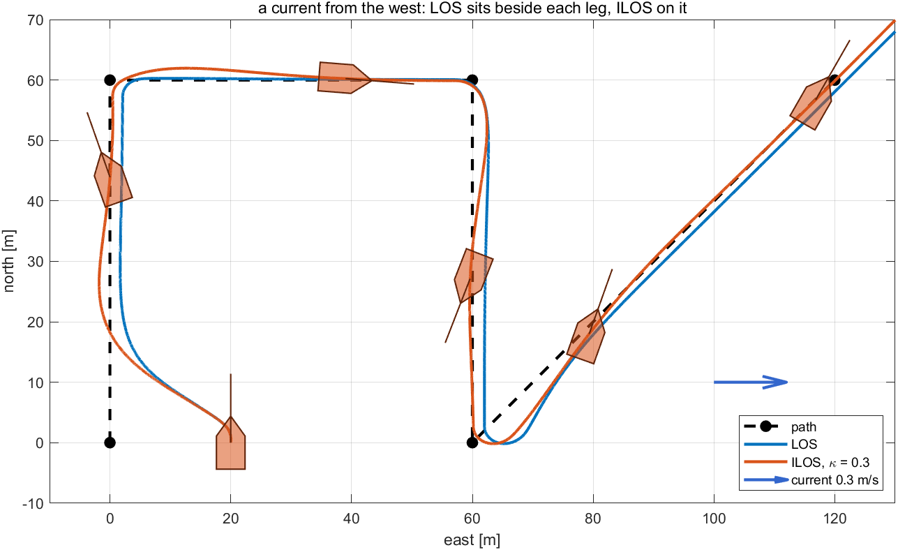

| In the figure | Meaning |
|---|---|
| blue | LOS: beside each leg that crosses the current |
| orange with hulls | ILOS, $\kappa = 0.3$: on the legs; the hulls point into the current while the track stays on the path |
| arrow | the current, 0.3 m/s towards the east |

**Reading the figure and the table against the three steps.**

| Where to look | What is there | Which step or section it settles |
|---|---|---|
| the blue track beside legs 3 and 4 | $2.14$ m and $1.38$ m of mean error | §5-5 lines 2 to 4: the offset LOS must leave, now on a mission |
| the blue track **on** leg 2 | $0.12$ m only | that leg runs with the current, so there is almost no crab angle to hold |
| the orange track on every leg | $0.40$, $0.38$, $0.14$ m | §5-5 line 7: the integral holds the lean instead |
| the hulls on the orange track | pointing into the current while the track runs along the leg | Week 4 §4-4: heading is not course, seen directly |
| the $\kappa = 0.1$ row | $3.10$ m, barely better than LOS | short legs: the value that was cleanest on 400 m has no time to act on 60 m |
| the last column, $330 \to 350$ s | the mission grows slower as $\kappa$ grows | the integral's swing costs distance as well as accuracy |
| leg 1 in every row | $2.0$ to $3.3$ m, and left out of the sum | it contains the 20 m start offset, which is a transient and not a following error |

**What the figure says**

- The tuned ILOS follows the legs; the hulls show the crab angle it holds to do so.

| What to try | What to watch |
|---|---|
| `kappa = 3;` Run | the swing of Experiment 5-5 now happens at every corner: mean $\lvert y_e\rvert$ after 60 s is $1.18$ m against $0.64$ m at $\kappa = 0.3$, and the last waypoint is reached at $385.9$ s instead of $338.8$ — **both slower and less accurate** |
| `V_c = 0; kappa = 0.3;` Run | with no current there is nothing to find: $0.30$ m against $0.20$ m for LOS, and the same mission time. The integral is insurance, and it is not free |

> [!tip] In class
> - **Purpose** — close the week with the full order on a mission, and see Week 4 §4-4 in the picture.
> - **Point to** — the hull on the southbound leg, pointing west of south while the track runs due south.
> - **Ask** — "Why is $\kappa$ chosen on the mission and not on the long leg of Experiment 5-5b?" Short legs leave little time to integrate; the gain that is best on 400 m is too slow on 60 m.
> - **Take away** — choose each parameter on the task it will face, in the order P, switching, I.

---

## 5-7. Both loops at once: the speed of Week 3 and the path of Week 5

**What is observed.** Every model up to this point has pushed the hull with a constant surge force, `X_ff = 60` N. Nothing in the week ever asked what speed that produces. The answer is $0.767$ m/s, and it is not a chosen number at all: it is the speed at which the drag of the Otter happens to balance 60 N. Ask for a different speed and there is no way to ask. Put the Week 3 speed loop in front of the same allocator and the vessel holds $1.000$ m/s instead, and reaches the last leg of the mission at $188.7$ s rather than $244.9$ s.

**The result.** The two controllers do not meet, and never exchange a signal. They meet in the **allocator**, because there are two propellers and the surge force and the yaw moment must both come out of the same two. Writing that sharing down gives one $2\times2$ system, its inverse, and a limit on the yaw moment that **depends on the surge force**:

$$
X = T_L + T_R, \qquad N = y_p\,(T_L - T_R)
\qquad\Longrightarrow\qquad
T_L = \frac{X}{2} + \frac{N}{2 y_p}, \qquad
T_R = \frac{X}{2} - \frac{N}{2 y_p}
$$

$$
\lvert N\rvert \;\le\; N_{\lim}(X) \;=\; \min\left\{\, 2 y_p\!\left(k_{pos} n_{\max}^2 - \tfrac{X}{2}\right),\;\; 2 y_p\!\left(\tfrac{X}{2} + k_{neg} n_{\min}^2\right) \right\}
$$

| Symbol | Quantity | Value · source |
|---|---|---|
| $X$ | surge force asked for | $60$ N constant, or the speed loop's output; `W05_0_setup` |
| $N$ | yaw moment asked for | the autopilot's output, §5-1 |
| $T_L, T_R$ | thrust of the port and starboard propeller | N |
| $y_p$ | half the distance between the two pontoons | $0.3950$ m, `otter.m` |
| $k_{pos}, k_{neg}$ | thrust coefficients ahead and astern | $0.011080$, $0.006445$; `otter.m` |
| $n_{\max}, n_{\min}$ | shaft-speed limits | $103.931$, $-101.737$ rad/s; `otter.m` |
| $N_{\lim}(60)$ | the moment left at the old constant force | $70.85$ N·m, Experiment 5-7 |
| $N_{\lim}(120)$ | the moment left at full surge force | $47.15$ N·m, Experiment 5-7 |

**Derivation.**

1. **Where the two forces come from.** The Otter has two fixed propellers, one on each pontoon, both pointing forward. Each produces a thrust $T_i$ along the body $x$ axis. Nothing steers; the hull turns because one side pushes harder than the other.

2. **The two forces they can make.** Body $y$ is positive to starboard, so the port propeller sits at $y = -y_p$ and the starboard one at $y = +y_p$. A force $T$ along $x$ applied at $y$ makes a yaw moment $-yT$. Summing both:

$$
\underbrace{\begin{bmatrix} X \\ Y \\ N \end{bmatrix}}_{\tau}
=
\underbrace{\begin{bmatrix} 1 & 1 \\ 0 & 0 \\ y_p & -y_p \end{bmatrix}}_{\mathbf{B}}
\begin{bmatrix} T_L \\ T_R \end{bmatrix}
$$

   The middle row is zero, and that row is the whole story of the week: **this hull cannot make a sideways force.** It is why guidance must turn the vessel to move it sideways, and why §5-5's current is fought with a heading and not with a thrust. `_tools/otter_B.m` builds this $\mathbf{B}$ from the column rule and returns exactly the matrix above.

   The two non-zero rows can be read straight off a drawing of the vessel seen from above, and the figure below does exactly that. The same matrix, written out at $y_p = 0.395$ m as $\begin{bmatrix} 1 & 1 \\ 0.395 & -0.395\end{bmatrix}$, sits as a Constant block inside the `Allocation` subsystem of the MSS demonstration model `demoOtterUSVPathFollowingHeadingControl`.

![What the matrix [1 1; 0.395 −0.395] means: read off the hull, inverted, and checked against the logged numbers](../figures/w05-allocation.svg)

| In the figure | Meaning |
|---|---|
| left, the two upward arrows | both propellers push the same way, which is the row $[\,1\ \ 1\,]$ |
| left, the two blue arms | the port propeller is $y_p$ to one side and the starboard one $y_p$ to the other, which is the row $[\,y_p\ \ {-y_p}\,]$ and the reason the two signs differ |
| left, the curved arrow | the port side pushing harder turns the vessel to starboard: $N > 0$ |
| centre | the two rows assembled, and inverted because $\det \mathbf{B} = -2y_p \neq 0$ |
| right | Experiment 5-7's own two rows put through that inverse |

3. **Solving for the two thrusts.** Delete the zero row and $\mathbf{B}$ becomes $2\times2$ with determinant $-2y_p \ne 0$, so there is exactly one solution — no pseudo-inverse is needed, and no freedom is left over. Inverting it, or equally adding and subtracting the two remaining equations, gives

$$
\begin{bmatrix} T_L \\ T_R \end{bmatrix}
= \mathbf{B}^{-1} \begin{bmatrix} X \\ N \end{bmatrix}
\qquad\Longrightarrow\qquad
T_L = \frac{X}{2} + \frac{N}{2 y_p}, \qquad T_R = \frac{X}{2} - \frac{N}{2 y_p}
$$

   Read in words: **both propellers carry half the surge force, and the moment is made by adding to one and taking the same amount from the other.** The two tasks are superposed, and $y_p$ is the lever that converts moment into thrust difference. A short lever costs more thrust for the same moment: $N = 47$ N·m over $2 y_p = 0.79$ m needs $60$ N of difference.

   The `allocation` block writes it as the solve, not as the two expressions, so that the code and this line say the same thing:

```matlab
B = [1        1;              % 전진력  X = T_L + T_R        / surge force
     y_pont  -y_pont];        % 요 모멘트 N = y_pont(T_L-T_R) / yaw moment
T = B \ [X; N];               % 좌현, 우현 / port, starboard
```

4. **From thrust to shaft speed.** A propeller's thrust goes as the square of its shaft speed, with a different coefficient going astern because the blade is the wrong way round:

$$
T = \begin{cases} k_{pos}\, n^2, & n \ge 0\\[2pt] -k_{neg}\, n^2, & n < 0\end{cases}
\qquad\Longrightarrow\qquad
n = \begin{cases} +\sqrt{T/k_{pos}}, & T \ge 0\\[2pt] -\sqrt{-T/k_{neg}}, & T < 0\end{cases}
$$

   This is where the linearity ends. Everything above was a linear sharing of two forces; the square root is not linear, so **equal steps in $N$ are not equal steps in $n$**. Near zero thrust a small change in $T$ moves $n$ a great deal, and near full thrust it barely moves it.

5. **What the propellers can actually give.** Putting the shaft limits through the same curve gives the thrust each propeller can reach:

$$
T_{\max} = k_{pos}\,n_{\max}^2 = 119.68\ \text{N}, \qquad
T_{\min} = -k_{neg}\,n_{\min}^2 = -66.71\ \text{N}
$$

   Astern is weaker than ahead by almost a factor of two — the same blade, run backwards.

6. **The limit on the moment, and why it moves.** Both thrusts must lie in $[T_{\min}, T_{\max}]$. Substituting line 3 and solving each inequality for $\lvert N\rvert$:

$$
\frac{X}{2} + \frac{\lvert N\rvert}{2y_p} \le T_{\max} \;\Longrightarrow\; \lvert N\rvert \le 2y_p\!\left(T_{\max} - \frac{X}{2}\right), \qquad
\frac{X}{2} - \frac{\lvert N\rvert}{2y_p} \ge T_{\min} \;\Longrightarrow\; \lvert N\rvert \le 2y_p\!\left(\frac{X}{2} - T_{\min}\right)
$$

   The smaller of the two is $N_{\lim}(X)$. The first branch falls as $X$ grows — the harder the vessel is pushed, the less headroom the loaded propeller has. The second rises — a faster-turning inside propeller has further to fall before it reaches its astern limit. They cross at

$$
X^\star = T_{\max} + T_{\min} = 52.97\ \text{N}, \qquad N_{\lim}(X^\star) = 73.62\ \text{N·m}
$$

   so **the turning authority of this hull is greatest at a moderate surge force, not at full power.** The Week 4 constant `N_max` is nothing more than this expression evaluated once, at $X = X_{ff} = 60$ N.

7. **What breaks when $X$ stops being constant.** The Week 4 autopilot clamps its output with an ordinary Saturation block holding a fixed `N_max` computed from $X_{ff} = 60$ N. Leave that number in place and add a speed loop that can push to $X_{\max} = 120$ N, and line 6 says the true limit there is $47.15$ N·m while the block still holds $70.85$. The allocator then asks for $n_R = 116.2$ rad/s against a limit of $103.9$ — **an impossible command, produced by arithmetic that was correct one week earlier.**

   The fix is not a gain and not a new block. It is to evaluate line 6 **at the largest surge force this model can ask for** rather than at the one it used to ask for. `W05_0_setup` therefore holds two numbers, and every model's Saturation names the one that belongs to it:

$$
N_{\max} = N_{\lim}(X_{ff}) = 70.85\ \text{N·m}, \qquad
N_{speed} = N_{\lim}(X_{\max}) = 47.15\ \text{N·m}
$$

   This is deliberately the conservative choice: while the speed loop is only asking for $77.6$ N the true limit is $63.9$ N·m, and the vessel is being held to $47.15$. Line 3 of the reading table below measures what that costs. The alternative — recomputing $N_{\lim}$ from the live $X$ at every step — buys back that margin at the price of four more blocks in the diagram, and is left as the last **What to try**.

8. **And the plant clamps anyway.** MSS `otter.m` limits $n$ to $[n_{\min}, n_{\max}]$ inside itself (lines 167–170). An allocator that does not clamp therefore logs a shaft speed the vessel never turned, and every later reading of that log is wrong by however much was cut off. The allocator clamps, so the log records **what the plant received**.

> [!note] The speed loop itself is not new
> It is Week 3 unchanged, gains included: $X = K_{p,u}(u_d - u) + I$, $\lvert X\rvert \le X_{\max}$, with the integral that a drag-only axis needs and no derivative term. What §5-7 adds is not a controller but the accounting between two controllers that were designed separately.

### Experiment 5-7 · Speed control and waypoint following together (15 min)

The same mission and the same ILOS law are run twice, with the heading autopilot of Week 4 untouched. The single change is where the surge force comes from.

| Model | Surge force | The Saturation in its autopilot holds |
|---|---|---|
| `W05_G_tuning` | the constant `X_ff` = 60 N, from a Constant block on the canvas | `N_max` = 70.85 N·m |
| `W05_H_speed_path` | the output of a `speed loop` subsystem, holding `u_d` = 1.0 m/s | `N_speed` = 47.15 N·m |

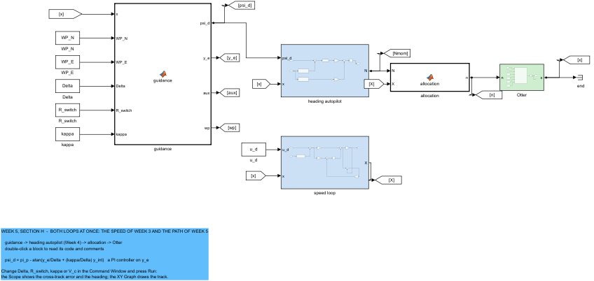

| In the diagram | What it is |
|---|---|
| the six Constant blocks on the left | the guidance inputs, on the canvas rather than in a mask: `WP_N`, `WP_E`, `Delta`, `R_switch`, `kappa` |
| `guidance` | the ILOS law of §5-5, giving $\psi_d$ and publishing $y_e$, the integral state and the leg index |
| `heading autopilot` | the Week 4 law, as a **subsystem of Simulink blocks** |
| `speed loop` | the Week 3 law, likewise. Its command `u_d` arrives from a Constant on this canvas |
| `allocation` | line 3 of the derivation, taking `N` and `X` and giving `n` |
| `Otter` | the hull. It receives exactly the `n` that appears in the log |

Only the left half of the canvas is shown; the measurement, Scope, XY Graph, log and Animate blocks continue to the right.

Neither controller is a block of code. Opening either one shows the equation as a diagram, with the same blocks and the same names Weeks 3 and 4 used — one `Fcn` block for `ssa`, `Gain` blocks whose value is the name of a workspace variable, and an ordinary `Saturation`:

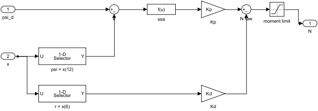

| In the diagram | Which part of the Week 4 law |
|---|---|
| the two `Selector` blocks | $\psi = x(12)$ and $r = x(6)$, the only two states the law uses |
| the summing junction and `ssa` | $e = \operatorname{ssa}(\psi_d - \psi)$, wrapped by one `Fcn` holding `atan2(sin(u), cos(u))` |
| `Kp` and `minus Kd` | $K_p e$ and $-K_d r$. **The D term is fed by the yaw-rate Selector, not by a derivative block** — there is no derivative block in the diagram |
| `moment limit` | the Saturation of line 7, holding `N_speed` here and `N_max` in the other six models |

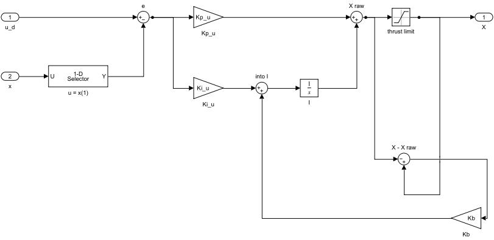

| In the diagram | Which part of the Week 3 law |
|---|---|
| `u_d` on the left | the commanded speed, arriving as an ordinary signal from the canvas outside |
| `e` | $e = u_d - u$, with the command on the left edge and the measurement entering from below |
| `Kp_u` | the proportional term |
| `Ki_u` into `I` | the integral. `I` is an ordinary **continuous Integrator**, $1/s$ — the plant is continuous, and so is every controller in this course |
| `X raw` and `thrust limit` | $X_{raw} = K_{p,u}e + I$, then $\lvert X\rvert \le X_{\max}$ |
| `X - X raw` into `Kb`, back into `into I` | the **anti-windup**, and the reason the loop has one |

The anti-windup deserves its own line, because on a diagram it is the only path that runs right to left. It is **back-calculation**, the method of Week 3 §3-F, and the whole of it is one subtraction and one gain:

$$
\dot{I} = K_{i,u}\, e \;+\; K_b\,\bigl(X - X_{raw}\bigr), \qquad X = \operatorname{sat}(X_{raw})
$$

| Symbol | Quantity | Value · source |
|---|---|---|
| $X_{raw}$ | what the controller asked for, before the limit | N |
| $X$ | what the propellers were actually given | N, $\lvert X\rvert \le X_{\max} = 120$ |
| $K_b$ | back-calculation gain | $1$ s⁻¹, the value Week 3 chose; `W05_0_setup` |

While the force is inside its limit, $X - X_{raw} = 0$ and the term is not there at all — the loop is the plain PI of Week 3. The moment the limit bites, the term goes negative and **the integral is pushed back down by exactly the amount that was thrown away**, so it stops climbing towards a force that cannot be produced. Without it the integral keeps growing while the vessel accelerates, and then has to be unwound before the loop can respond at all, which is seen as an overshoot.

Setting `Kb = 0` removes it, and Experiment 5-7 runs both:

| $K_b$ | $X$ at its limit for | speed overshoot |
|---|---|---|
| $1$ | $0.66$ s | $0.0216$ m/s |
| $0$ | $0.92$ s | $0.0380$ m/s |

The difference is real but small, and the reason is worth saying plainly: **this mission barely saturates.** The surge force reaches $120$ N only in the first second, while the vessel is accelerating from rest, and for the remaining 400 s it sits at $77.6$ N. Anti-windup earns its place where a limit is held for a long time — the step of Week 3 §3-F, or a current strong enough to keep the force against its stop. It is carried here because it costs two blocks and because the case it protects against is not visible in advance.

> [!note] Where the numbers live
> Commands are Constant blocks on the canvas — `WP_N`, `WP_E`, `Delta`, `R_switch`, `kappa`, `u_d`. Gains are the values of `Gain` blocks, written as the variable's name. Both read the workspace, so `Kp = 400` in the Command Window followed by Run is the whole edit. The MSS demonstration model is arranged the same way: its waypoint lists, $\Delta$, $R$ and desired surge thrust are Constant blocks, and its autopilot gains are `Gain` blocks inside the `Heading autopilot` subsystem.

**To produce every figure and number in this section**

```matlab
cd lectures/W05_simulink
W05_0_setup
W05_H_speed_and_path
```

Actual output:

```
  W05 Experiment 5-7  speed control and path following at once
    surge force from    u mean [m/s]   last leg at [s]   mean |y_e| legs 2-4 [m]   X mean [N]
    a constant X_ff        0.767             244.9                    0.353        60.00
    the speed loop         1.000             189.7                    0.577        78.48

    the allocation, checked by hand   (y_pont = 0.3950 m, k_pos = 0.01108)
      case              X [N]    N [N m]   T_L [N]   T_R [N]   n_L      n_R     n_L by hand
      straight leg      77.59      -0.50     38.16     39.43   58.683   59.651     58.686
      hardest turn     120.00     -47.15      0.32    119.68    5.357  103.931      5.357

    X [N]               0      20      40      60      80     100     120     140
    N_lim [N m]     52.70   60.60   68.50   70.85   62.95   55.05   47.15   39.25
    the constants the models hold:  N_max = N_lim(60) = 70.85,  N_speed = N_lim(120) = 47.15 N m

    the anti-windup (back-calculation), measured
      Kb      X at its limit for [s]   speed overshoot [m/s]
      1                     0.66               0.0216
      0                     0.92               0.0380
```

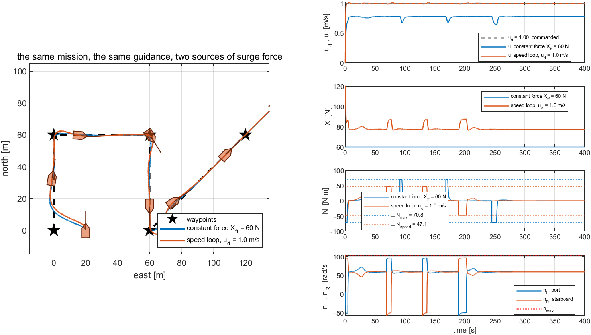

| In the figure | Meaning |
|---|---|
| left, blue and orange | the two tracks, almost on top of each other — the guidance is identical |
| panel 1 | the commanded speed, and the two speeds actually made |
| panel 2 | the surge force: flat at 60 N, or worked for by the loop |
| panel 3 | the yaw moment, with each run's own dotted limit |
| panel 4 | the two shaft speeds of the speed-loop run, against $n_{\max}$ |

**Reading the figure and the table against the derivation.**

| Where to look | What is there | Which line it settles |
|---|---|---|
| `u mean` column | $0.767$ against $1.000$ m/s | line 1: a constant force gives the speed that balances drag, and $0.767$ was never chosen by anyone |
| panel 2, the flat blue line | exactly $60.00$ N for the whole run | the old models have no speed loop to vary it |
| panel 2, the orange line | $77.59$ N on a straight leg, rising to $120$ N after each corner | holding $1.0$ m/s costs $77.6$ N of drag; a turn costs more, and the loop pays it until it reaches $X_{\max}$ |
| `straight leg` row | $T_L = 38.16$, $T_R = 39.43$ N from $X = 77.59$, $N = -0.50$ | line 3: $77.59/2 = 38.80$ each, then $\mp 0.50/0.79 = \mp 0.63$ |
| `n_L by hand` column | $58.686$ against $58.683$ logged | line 4 reproduced from the logged $X$ and $N$ alone, through the same square root |
| `hardest turn` row | $N = -47.15$ N·m exactly | line 7: the Saturation is holding `N_speed`, and the corner is asking for more than it |
| the same row | $T_R = 119.68$ N and $n_R = 103.931$ | lines 5 and 7 together: at that moment the starboard propeller is **exactly at** $T_{\max}$, so its shaft is exactly at $n_{\max}$. The constant was chosen to make this the worst case, and it is |
| panel 4, the orange trace at the corners | touching the red $n_{\max}$ line and never crossing it | the allocator can no longer ask for the impossible |
| the $N_{\lim}$ row | $70.85$ at $X = 60$, $47.15$ at $X = 120$ | line 6: the first branch, falling as the surge force takes the headroom |
| the same row at $X = 0$ | $52.70$ N·m, **below** the value at 60 N | line 6: the second branch, rising; the peak is between, at $X^\star = 52.97$ N |
| panel 3, the two dotted pairs | $\pm 70.85$ for the constant-force run, $\pm 47.15$ for the speed-loop run | the price of the speed, stated as a number before any track is drawn |
| `mean |y_e|` column | $0.577$ against $0.353$ m | going 30 % faster on two-thirds of the moment costs 63 % more cross-track error |
| `last leg at` column | $189.7$ against $244.9$ s | 23 % of the mission time, bought with the accuracy in the previous row |

**What the figure says**

- Choosing the speed is possible, and it costs both moment headroom and following accuracy; neither cost is visible until the surge force stops being a constant.

Pressing Run on `W05_H_speed_path` alone produces the same numbers and a figure of the single run, because the model's `StopFcn` calls `W05_plot`:

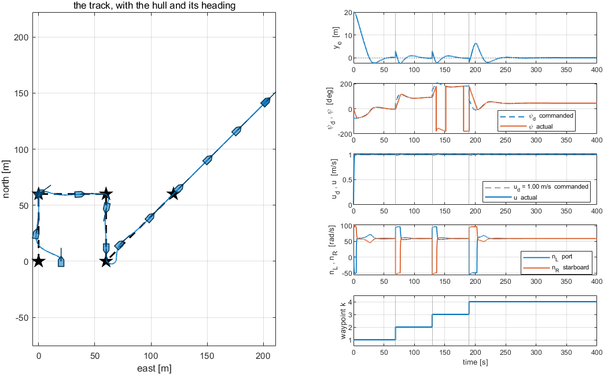

| In the figure | Meaning |
|---|---|
| left | the track with the hull drawn along it, and the five waypoints |
| $y_e$ | the cross-track error, with a grey line at each switching instant |
| $\psi_d, \psi$ | the commanded heading and the one achieved; the jumps to $\pm 180°$ are the wrap of §5-2 |
| $u_d, u$ | the commanded speed and the actual one — they lie on top of each other, which is the point |
| $n_L, n_R$ | the two shaft speeds, crossing over at every corner |
| waypoint $k$ | the leg index, stepping $1 \to 2 \to 3 \to 4$ as §5-4's test becomes true |

> [!warning] The track continues past the last waypoint
> There is no mission-end logic in Week 5. When the last leg is reached it is simply held, so the vessel sails along its extension until `T_final`. That is why the track in the figure above runs to 210 m east. Stopping a mission is a state-machine question and is built in Week 8.

| What to try | What to watch |
|---|---|
| `u_d = 1.6;` Run | the loop sits at $X_{\max} = 120$ N for most of the run, the corners are visibly wider, and the mission is barely faster — the drag has begun to win |
| `u_d = 0.4;` Run | slower, and `N_speed` is still $47.15$: the vessel is being held to a limit it is nowhere near needing. The cost of a conservative constant, seen directly |
| `X_max = 70;` Run, after re-running `W05_0_setup` | `N_speed` rises to $66.40$ N·m and the corners tighten, but the loop can no longer reach $1.0$ m/s. The two are the same trade seen from the other end |
| `Kb = 0;` Run | the anti-windup path is switched off. The speed overshoot grows from $0.0216$ to $0.0380$ m/s — small here, because this mission holds the limit for well under a second |
| `animate = 1; pace = 1;` Run | the run takes as long as the mission does, and the live view draws the track, the error, both speeds and both shafts while it happens |
| Replace the Saturation in `heading autopilot` with a **Saturation Dynamic** fed by $N_{\lim}(X)$, built from line 6 | the margin between $47.15$ and the true limit comes back, and the corners tighten. Measure `mean |y_e|` on legs 2–4 before and after, and decide whether the extra blocks earned their place |

> [!tip] In class
> - **Purpose** — show that two controllers designed a week apart share one piece of hardware, and that the sharing has arithmetic.
> - **Point to** — the `hardest turn` row: $T_R = 119.68$ N, and $T_{\max} = 119.68$ N. It is exactly at the limit, by construction, because `N_speed` was chosen to put it there.
> - **Ask** — "The vessel is pushed harder, so why can it turn *less* hard?" Both jobs come out of the same two propellers; surge takes headroom from yaw, and line 6 says how much.
> - **Ask** — "Why is the turning authority greatest at 53 N and not at 0 N?" Below $X^\star$ the inside propeller runs out of astern thrust first, and astern is the weaker direction.
> - **Ask** — "The Saturation holds 47.15 even while the true limit at $X = 77.6$ N is 63.9. Why not compute it live?" Because a constant is one block and a live limit is five, and the margin is thrown away only at the corners. Which of the two to build is an engineering question, not a matter of correctness — the last **What to try** turns it into a measurement.
> - **Take away** — when a constant becomes a signal, every limit that was computed from it has to be computed again.

---

# Part 2 · Laboratory run order

The experiments of Part 1 are worked through in order; this table is the index of what was run, for repeating the week at home.

Every example has **its own model**, laid out the same way: `guidance` → `heading autopilot` → `allocation` → `Otter`, each a commented MATLAB Function except the vessel. Every input those blocks take is a **Constant block on the canvas** — the waypoint lists, $\Delta$, $R$, $\kappa$ and the surge force are read off the diagram rather than hidden inside a block mask.

On the right of each model sit four things:

| | What it shows | When |
|---|---|---|
| **Scope** | the cross-track error; the commanded and actual heading; the waypoint index stepping up | while it runs |
| **XY Graph** | the track, east against north | while it runs |
| **Display** | the active leg as a number | while it runs |
| **Animate** block | the live view: path, waypoints, track and hull on the left; $y_e$, $u$ against $u_d$, $n_L$ and $n_R$, and the leg index on the right | while it runs, when `animate = 1` |

Setting `pace = 1` in the workspace runs the model **at wall-clock speed**, so the live view moves at the speed the vessel would; `pace = 0` runs it as fast as it can. The results are identical and only the waiting differs — a 10 s mission takes 12.7 s of wall clock at `pace = 1` and 1.4 s at `pace = 0`. When a run finishes, the model's `StopFcn` calls `W05_plot`, which prints the leg-by-leg table and draws the track with five traces beside it, so **pressing Run alone produces the same figure a section script does.**

| Experiment | Model | Script | What it shows |
|---|---|---|---|
| 5-0 | all of them | `W05_0_setup`, `W05_1_build_guidance` | the parameters, and every model written from code |
| 5-1 | `W05_G_tuning` | — | where guidance sits, and the rotation that gives $y_e$ |
| 5-2 | `W05_C_atan2` | `W05_C_aim_at_the_waypoint` | aiming at the next waypoint |
| 5-3 | `W05_D_LOS` | `W05_D_lookahead_distance` | LOS and the look-ahead distance |
| 5-4 | `W05_E_switching` | `W05_E_waypoint_switching` | the switching distance on a mission |
| 5-5a | `W05_F_LOS` | `W05_F_LOS_in_a_current` | the offset a current leaves under LOS |
| 5-5b | `W05_F_ILOS` | `W05_F_ILOS_removes_it` | the integral that removes it |
| 5-6 | `W05_G_tuning` | `W05_G_tuning_by_hand` | the tuning order on the mission in a current |
| 5-7 | `W05_H_speed_path` | `W05_H_speed_and_path` | the speed loop of Week 3 on the same hull, and how $X$ and $N$ split into $n_L$ and $n_R$ |

- The scripts only repeat what Run already shows, for several values at once, and print the numbers quoted in Part 1.
- Each experiment ends with an **In class** note: purpose, what to point at, a question with its answer, and the sentence to take away.

---

# Summary

## Week Summary

| Step | What was done | How it was verified |
|---|---|---|
| 1 | put a guidance law in front of the Week 4 autopilot | `check_overlaps` 0 in all seven models; $y_e$ equals MSS `crosstrackWpt` |
| 2 | atan2 against LOS | Experiment 5-2: 10.75 m against 0.04 m halfway to the waypoint |
| 3 | $\Delta$ as the P gain $1/\Delta$ | Experiment 5-3: 118 s at 40 m, swinging at 0.5 m; $\Delta = 5$ m |
| 4 | the switching distance | Experiment 5-4: worst corner 2.98 m at $R = 3$ m |
| 5 | a current and ILOS | Experiments 5-5a and 5-5b: LOS offset $= \Delta\tan$(heading) to the millimetre; ILOS removes it |
| 6 | the tuning order on the mission | Experiment 5-6: $\kappa = 0.3$, legs 2–4 summed 0.92 m against 3.64 m for LOS |
| 7 | added the Week 3 speed loop to the same allocator | Experiment 5-7: $1.000$ m/s held, last leg 23 % sooner; $n_L$ by hand $58.686$ against $58.683$ logged |
| 8 | derived the moment limit the surge force leaves | Experiment 5-7: $N_{\lim} = 70.85$ N·m at $X = 60$ N, $47.15$ at $120$ N, peak $73.62$ at $52.97$ N |
| 9 | drew both controllers as Simulink blocks, not code | `check_overlaps` 0 inside every subsystem; §5-2 to §5-6 reproduce every number of the MATLAB Function version unchanged |

## Progress Check

> [!important] Minimum condition for following Week 6

### Theory

- [ ] Able to compute $y_e$ from two waypoints and a position.
- [ ] Able to explain why LOS is a P controller and which way $\Delta$ moves its gain.
- [ ] Able to predict the LOS offset in a cross current from the heading held.
- [ ] Able to explain what the integral of ILOS does and why its denominator limits windup.
- [ ] Able to write $T_L$ and $T_R$ from a surge force and a yaw moment, and convert them to shaft speeds.
- [ ] Able to explain why pushing the hull harder leaves less yaw moment, and where the moment limit peaks.

### Laboratory

- [ ] `W05_1_build_guidance` ran and every model reported `overlapping lines: 0`.
- [ ] A parameter was changed in the Command Window and the XY Graph showed the new track.
- [ ] `W05_H_speed_path` was run with `animate = 1` and the live view drew the track, the error, both speeds and both shafts.
- [ ] `W05_check(1)`, `(2)` and `(3)` pass on a model built from `W05_P1_start`.

---

## In-class laboratory — build the guidance layer by hand

The second hour of the Week 5 session is spent building the guidance block in Simulink. A complete Week 4 vessel is provided with one input left open: the commanded heading.

```matlab
cd lectures/W05_simulink/problems
W05_P1_start                 % creates W05_P1.slx — a Week 4 vessel, no guidance
W05_check(1)                 % run this whenever, as often as needed
```

| | Problem | Time | The number it must reproduce |
|---|---|---|---|
| 1 | The LOS law on leg 1 | 25 min | $\pi_p = 0$ exactly; $y_e$ from 18 m to 0; $\psi_d \to \pi_p$ |
| 2 | atan2 against LOS, same vessel | 20 min | LOS holds the line; atan2 does not |
| 3 | A current, and the offset that stays | 15 min | settled $y_e = \Delta\tan$ of the crab angle |

- The problem sheet is [`W05_simulink/problems/README.md`](W05_simulink/problems/README.md), and reference answers are in [`W05_simulink/solutions/`](W05_simulink/solutions/README.md).
- Problem 3 ends where §5-5 continues: the integral that removes the offset.

---

## Assignment 5

- **Due**: before the Week 6 session
- **Submit**: the modified `W05_0_setup.m`, the numbers requested below, and two figures

### ① Requirements

Double the legs of the mission (every waypoint coordinate times two, legs of 120 m) and tune $\Delta$, $R$ and $\kappa$ again by the order of §5-6 in a 0.3 m/s current.

### ② Verification — mandatory

> [!important] A claim is not a result. Numbers are required, with the averaging window stated

1. The table of Experiment 5-3 on one 240 m leg with the chosen $\Delta$ and its neighbours.
2. The table of Experiment 5-4 on the new mission.
3. The table of Experiment 5-6 on the new mission, and the $\kappa$ chosen.
4. The LOS offset in the current, next to $\Delta\tan$ of the heading held.

### ③ Analysis (5–10 lines)

Compare the chosen $\kappa$ with 0.3, and explain from the leg length why it moved in that direction.

### Grading

| Criterion | Weight |
|---|---|
| The model runs and produces the requested output | 25% |
| **Verification performed and numbers reported** | 40% |
| Correctness of the analysis | 25% |
| Readability of the code | 10% |

---

## Troubleshooting

| Symptom | Cause | Fix |
|---|---|---|
| `W05_0_setup` stops in `mss_path` | the MSS toolbox is not at `Tools\MSS` | place MSS there; see the first page |
| the XY Graph shows nothing | the track is outside its axes | the axes are −20 to 140 m; a custom path needs `set_param(... '/track', 'xmax', ...)` |
| the vessel circles a waypoint | $R$ smaller than the vessel can turn inside | raise `R_switch` |
| `guidance` complains that `WP_N` is undefined | `W05_0_setup` was not run | run it; the guidance block reads the waypoints from the workspace |
| a Scope does not match these notes | a changed variable is still in the workspace | run `W05_0_setup` again |

---

## References

### Primary

- Fossen, T. I. *Handbook of Marine Craft Hydrodynamics and Motion Control*, 2nd ed., Wiley, 2021, §12.3 (line-of-sight guidance and its integral form).
- Børhaug, E., Pavlov, A. and Pettersen, K. Y. "Integral LOS control for path following of underactuated marine surface vessels in the presence of constant ocean currents." *47th IEEE Conference on Decision and Control*, 2008, pp. 4984–4991. DOI: 10.1109/CDC.2008.4739352.
- MSS toolbox, `Tools/MSS/GNC/crosstrackWpt.m` and `ILOSpsi.m`.

### In this course

- Week 2 §2-6 to §2-8 and §2-12: P, I and the tuning order. Week 4 §4-4: heading is not course.
- The previous, model-based version of this week — full derivations, Lyapunov stability and ALOS — is kept in `W05_simulink/_previous_version/`.

---

## Next Week

**Week 6 — Control Allocation.** This week gave the vessel the square allocation of Week 4 and never questioned it. Week 6 asks what happens when there are more actuators than degrees of freedom, when a thruster saturates, and when one fails.
