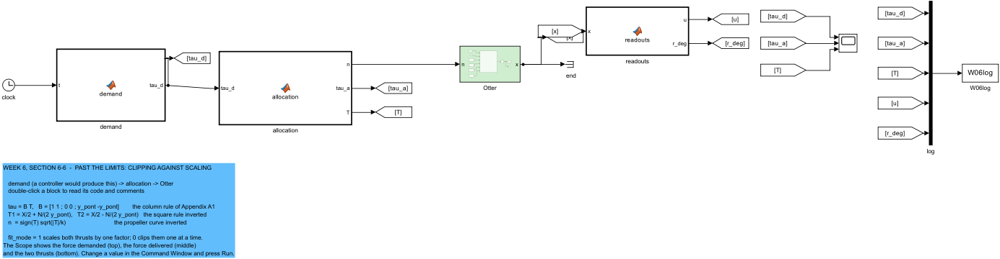
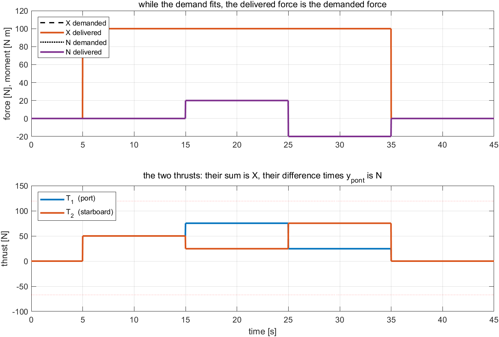
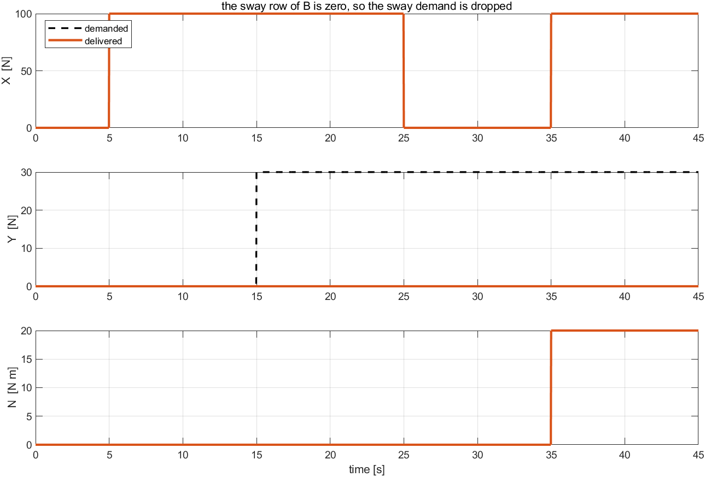
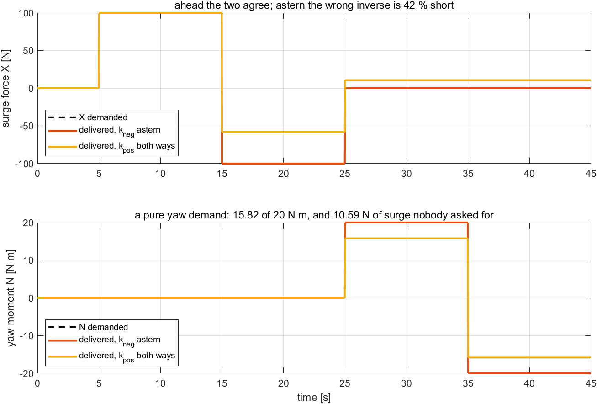
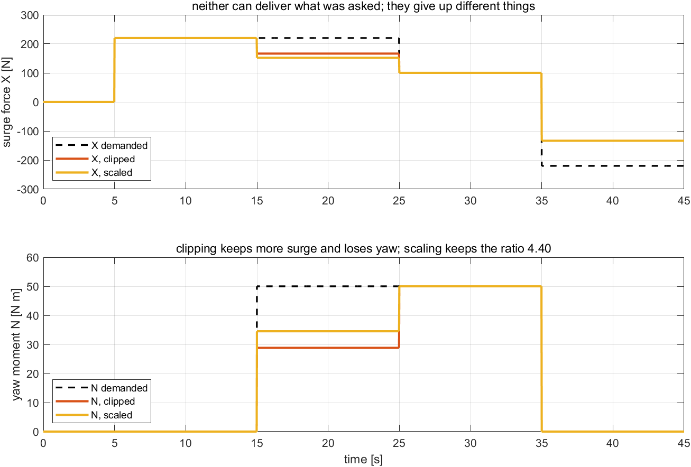
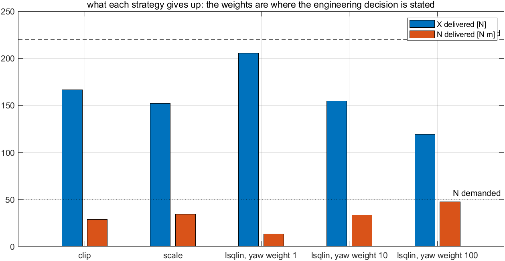

# Week 6 · Control Allocation

> [!important] Reference material — read this first
> <span style="font-size:0.88em">The five courses below are **taught by the instructor of this course** and are the assumed background for it. They run from the fundamentals down to the graduate material, so start wherever the gap is. Every frame, symbol and derivation used here is developed in them at length; anyone whose prerequisites are thin should work through them first, then return.</span>
>
> | # | Course | Level | Lang. | Video | Slides and code |
> |---|---|---|---|---|---|
> | 1 | **Control Engineering** (제어공학) — the foundation: transfer functions, feedback, stability, root locus, PID | undergraduate | KO | [playlist](https://youtube.com/playlist?list=PLFaUxNRM4BvJMpF9HZS-Mp8tDv9dTdglk) | [drive](https://drive.google.com/drive/folders/1TNIPDNtS_Iy8li-olka5WJslSXDYf0aT) |
> | 2 | **Control System Design** (제어시스템설계) — design rather than analysis: specifications, loop shaping, discrete implementation | undergraduate | KO | [playlist](https://youtube.com/playlist?list=PLFaUxNRM4BvIGroZ5rgn7x08F7C79d9WZ) | [drive](https://drive.google.com/drive/folders/11m5Xxl_PHJvxgHghLSP-jhCpmRpbvoXh) |
> | 3 | **Advanced Control Engineering** (제어공학특론) — reference frames, the 6-DOF equation of motion, rotation matrices and Euler angles, linearisation and trim, vehicle control design | graduate | EN | [playlist](https://youtube.com/playlist?list=PLFaUxNRM4BvJmvF2ljx4KM5dj1P5jEcw0) | [drive](https://drive.google.com/drive/folders/1GUxbbONl916lNd0ggnFnXrNwNkd13-2-) |
> | 4 | **Sensor Signal Processing and Fusion** (센서신호처리 및 융합) — sensor models, noise, estimation and multi-sensor fusion | graduate | EN | [playlist](https://youtube.com/playlist?list=PLFaUxNRM4BvK-aP2Gdoyp5-AWvMn7Fo8E) | [drive](https://drive.google.com/drive/folders/1MEVJP7TzMcm8w6TZwUjhWJtL34WeNY3u) |
> | 5 | **Capstone Design** (캡스톤디자인) — a vehicle project carried end to end | undergraduate | KO | [playlist](https://youtube.com/playlist?list=PLFaUxNRM4BvLu7L0pDoLzDXTv8mm6rCmj) | [drive](https://drive.google.com/drive/folders/1haIQejlJfrdhtOuof-MpffR9ydVscXZS) |
>
> <span style="font-size:0.88em">**Not fluent in MATLAB or Simulink yet? Do these before Part 2.** Every laboratory in this course is Simulink, and the Onramp courses are free and take a few hours each.</span>
>
> | Tool | Where to start |
> |---|---|
> | MATLAB | [MATLAB Onramp](https://matlabacademy.mathworks.com/kr/details/matlab-onramp/gettingstarted) · [Core MATLAB Skills](https://matlabacademy.mathworks.com/details/core-matlab-skills/lpmlcms) |
> | Simulink | [Simulink Onramp](https://matlabacademy.mathworks.com/kr/details/simulink-onramp/simulink) · instructor's Simulink lectures [part 1](https://youtu.be/a-afHg_fSaU) · [part 2](https://youtu.be/070Yn0Hw5a0) |


> [!tip] Getting the course files, and keeping them current (Windows)
> <span style="font-size:0.88em">The notes, models and scripts are kept in one Git repository that is updated through the semester. Clone it once; before every class, pull. A pull downloads only what has changed since the last one.</span>
>
> | When | Where to run it | Command |
> |---|---|---|
> | once | PowerShell — installs Git for Windows | `winget install --id Git.Git -e` |
> | once | the folder that will hold the course, e.g. `Documents` | `git clone https://github.com/wkyouncnu/Sensor-Signal-Processing-and-Fusion.git` |
> | before every class | inside the cloned folder `Sensor-Signal-Processing-and-Fusion` | `git pull` |
>
> - `git pull` prints `Already up to date.` when nothing has changed, and otherwise lists the files it updated.
> - The repository is private. When Git asks, sign in with the GitHub account the instructor has given access.
> - Experiment on copies, not on the cloned files: copy a week's `WXX_simulink` folder elsewhere first, and a pull can never collide with local edits. If it already has, `git stash`, then `git pull`, then `git stash pop` sets the edits aside, updates, and puts them back.
> - The MSS toolbox is not part of the repository. The weeks that simulate the Otter need it at `Tools\MSS` inside the cloned folder.


- **Course**: USV Guidance, Navigation and Control (Graduate)
- **Department**: Autonomous Vehicle System Engineering, Chungnam National University
- **This week**: ① the last step of every loop so far: a demanded force becomes two shaft speeds ② the square rule of Weeks 3 to 5, derived as a least-squares solution ③ what an allocator does with a demand the hull cannot produce, and with one it cannot reach ④ clipping against scaling, and the weights that state which demand matters

> [!important] Prerequisites from the previous week
> - Appendix A1 derived the control effectiveness matrix $\mathbf{B}$ from the column rule, and this week inverts it. Read §A1-2 and §A1-6 first.
> - From Weeks 3 to 5: every controller so far ended by writing $T_1$ and $T_2$ into a MATLAB Function block. That block is the subject of this week.
> - From Week 1 §1-10: the propeller curve $T = k\,n\lvert n\rvert$, with a different $k$ ahead and astern.

---

## Learning Outcomes

Upon completion of this week, the learner is able to:

1. State the allocation problem as $\boldsymbol{\tau} = \mathbf{B}\mathbf{T}$ and say, from the shape and rank of $\mathbf{B}$, whether it has one solution, none, or infinitely many.
2. Derive the square allocation rule of Weeks 3 to 5 as the least-squares solution for this hull, and verify it against `pinv(B)`.
3. Predict which part of a demand a least-squares allocator will drop, and measure that the rest is delivered untouched.
4. Choose between exact solutions when there are many, using a weighting that states which thruster is expensive.
5. Invert the propeller curve with the coefficient that belongs to the direction of thrust, and quantify what the wrong coefficient costs.
6. Compare clipping and scaling when a demand exceeds the thrusters, in terms of the **direction** of the delivered force, and state the same choice as a constrained least-squares problem.

## Prerequisites and Setup

| Item | Requirement |
|---|---|
| MATLAB | R2024b, with Simulink; Experiment 6-7 also uses the Optimization Toolbox (`lsqlin`) |
| MSS | `Tools/MSS`, found by `W06_0_setup` through `mss_path` |
| Course folder | `lectures/W06_simulink` |
| Models | **one per experiment** — `W06_C_square`, `W06_D_pseudo`, `W06_E_curve`, `W06_F_limits` — all generated by `W06_1_build_allocation`, never edited by hand |
| Time | lecture 40 min, laboratory 1 h 20 min |

---

# Part 1 · Principle and experiment, section by section

Every section states what is observed, says what follows from it, and then runs **the experiment that measures it**. Four experiments have a model; three are a few lines in the Command Window, because the question is about a matrix rather than about a vessel.

| Part of a section | What it holds |
|---|---|
| **What is observed** | the effect itself, with the numbers it produces |
| **What follows from it** | numbered lines, one step each, from $\boldsymbol{\tau} = \mathbf{B}\mathbf{T}$ to the rule the block implements |
| **Experiment N-x** | the model, the commands, the output actually obtained, the figure, and a table that reads every feature of the figure back to **the numbered line that predicts it** |

## 6-0. Setting up (10 min)

```matlab
cd lectures/W06_simulink
W06_0_setup
W06_1_build_allocation
```

Expected output:

```
  W06_0_setup
    hull      arm y_pont = 0.395 m,  one propeller gives T in [-66.71, 119.68] N
    curve     T = k n|n| with k_pos = 0.01108 ahead, k_neg = 0.00645 astern
    demand    X = 100 N, N = 20 N m;  the sway asked for in 6-3 is Y = 30 N
    allocator fit_mode = 1 (1 scales, 0 clips),  use_kneg = 1

  built  W06_C_square.slx   (overlapping lines: 0)
  built  W06_D_pseudo.slx   (overlapping lines: 0)
  built  W06_E_curve.slx    (overlapping lines: 0)
  built  W06_F_limits.slx   (overlapping lines: 0)
```

- `W06_0_setup.m` is the only file edited by hand. Every block holds a variable name from it.
- The two switches of the week are in it: `fit_mode` decides what happens past the limits (§6-6), and `use_kneg` which coefficient inverts the propeller curve (§6-5).

> [!warning] The first line of `W06_0_setup` is `clear`
> It resets the workspace to the lecture's values. Run it again whenever a Scope does not match these notes.

## 6-1. The step that has been taken for granted

This section answers: what happens between a controller's output and a propeller's input?

- Week 3 produced a surge force, Week 4 a yaw moment, Week 5 a heading that became a yaw moment. None of them could be sent to a propeller: a propeller takes a **shaft speed**.
- Every one of those weeks ended with the same block, and the same two lines inside it, written without derivation. This week derives them and then asks what they do when the demand is impossible.

$$
\underbrace{\boldsymbol{\tau}_d = \begin{bmatrix} X \\ Y \\ N \end{bmatrix}}_{\text{what the controller wants}}
\quad\longrightarrow\quad
\underbrace{\mathbf{T} = \begin{bmatrix} T_1 \\ T_2 \end{bmatrix}}_{\text{allocation}}
\quad\longrightarrow\quad
\underbrace{\mathbf{n} = \begin{bmatrix} n_1 \\ n_2 \end{bmatrix}}_{\text{the propeller curve}}
$$

| Symbol | Quantity | Unit · source |
|---|---|---|
| $\boldsymbol{\tau}_d$ | the generalised force demanded | N, N, N·m — the controller of Weeks 3 to 5 |
| $\mathbf{T}$ | the thrust of each propeller | N |
| $\mathbf{B}$ | control effectiveness matrix, $\boldsymbol{\tau} = \mathbf{B}\mathbf{T}$ | Appendix A1, the column rule |
| $\mathbf{n}$ | shaft speeds, what the vessel actually takes | rad/s |
| $k_{\text{pos}},\ k_{\text{neg}}$ | propeller coefficients ahead and astern | $0.01108$, $0.00645$ N/(rad/s)² — Week 1 §1-10 |

- **The two steps are different in kind.** $\boldsymbol{\tau} = \mathbf{B}\mathbf{T}$ is linear and may have no solution or many; $T = k\,n\lvert n\rvert$ is nonlinear and has exactly one, as long as the sign of $k$ is chosen correctly. §6-2 to §6-4 are about the first, §6-5 about the second, and §6-6 and §6-7 about the limits that sit at the end of both.

### Experiment 6-1 · The chain on the canvas (5 min)

**What it measures.** Nothing yet: the three blocks between the demand and the vessel are matched to the three arrows above.

**The canvas.** `W06_F_limits` — the fullest model of the week, read here and measured in Experiment 6-6. The other three models differ from it only in the demand they are given and in whether the limit step is present.

**Opening and running.**

```matlab
W06_0_setup
open_system('W06_F_limits')     % Run — 위: 요구한 힘, 가운데: 전달된 힘, 아래: 추력 둘
```



| In the figure | Meaning |
|---|---|
| `clock` → `demand` | the controller of Weeks 3 to 5, replaced by a timetable so that the allocator can be studied on its own |
| `allocation` | the four steps of this week: least squares, the limits, the propeller curve, and the force actually delivered |
| green `Otter` | the MSS vessel model, which takes the two shaft speeds |
| `readouts`, Goto tags, Scope | the demanded force, the delivered force and the two thrusts, on one Scope |

- Double-click `allocation` and read the four numbered steps. Everything in §6-2 to §6-6 is one of them.

## 6-2. Two demands, two propellers: the square rule

This section answers: where do the two lines of Weeks 3 to 5 come from, and when are they exact?

**What is observed.** Experiment 6-2 asks for $100$ N of surge, then adds $\pm 20$ N·m of yaw:

- the delivered force equals the demanded force, to $10^{-15}$, in every leg,
- the two thrusts are $50/50$ N with no yaw asked for, and $75.32/24.68$ N with $20$ N·m asked for,
- and their sum is $100$ N in both cases.

**What follows from it, one line at a time.**

1. By the column rule of Appendix A1, the two propellers of this hull give
$$
\boldsymbol{\tau} = \mathbf{B}\mathbf{T},
\qquad
\mathbf{B} = \begin{bmatrix} 1 & 1 \\ 0 & 0 \\ y_{\text{pont}} & -y_{\text{pont}} \end{bmatrix},
\qquad y_{\text{pont}} = 0.395\ \text{m}
$$
2. The middle row is zero, so **no thrust pair produces sway**. That row is the subject of §6-3; set it aside and keep the two rows that can be produced.
3. What remains is square: $X = T_1 + T_2$ and $N = y_{\text{pont}}(T_1 - T_2)$ — two equations in two unknowns.
4. Adding and subtracting them gives the rule the block writes, and the rule Weeks 3 to 5 used:
$$
T_1 = \frac{X}{2} + \frac{N}{2\,y_{\text{pont}}},
\qquad
T_2 = \frac{X}{2} - \frac{N}{2\,y_{\text{pont}}}
$$
5. It is an **inverse**, not an approximation: put those two thrusts back into line 1 and the demanded $X$ and $N$ come out exactly. This is why every result of Weeks 3 to 5 could be read as though the controller commanded force directly.
6. The rule holds only while both thrusts lie inside what a propeller can produce, $[-66.71,\ 119.68]$ N. §6-6 is what happens when they do not.

### Experiment 6-2 · The square rule, measured (10 min)

**What it measures.** Line 5: that the delivered force equals the demanded force while the demand fits, and line 3 in the thrusts themselves.

**The model.** `W06_C_square` — the chain of §6-1 with no limit step, given a demand of surge alone and then surge with yaw.

**Opening and running.**

```matlab
W06_0_setup
open_system('W06_C_square')     % Run — 요구와 전달이 겹쳐 그려진다 / demand and delivery coincide
N_cmd = 40;                     % Run — 추력이 갈라지고 합은 그대로다 / the thrusts part, their sum does not
W06_C_square_rule               % 구간마다의 표와 그림 / the table and the figure
```

Expected output:

```
  W06 Experiment 6-2  the square rule  (y_pont = 0.395 m)
    t [s]   demanded X    N        delivered X    N        T1      T2   T1+T2
       10       100.00   0.00        100.00   0.00    50.00   50.00  100.00
       20       100.00  20.00        100.00  20.00    75.32   24.68  100.00
       30       100.00 -20.00        100.00 -20.00    24.68   75.32  100.00
```



**Reading the figure against the derivation.**

| Where to look | What is there | Which line predicts it |
|---|---|---|
| top panel, the dashed and solid lines | they lie on one another | line 5: the rule is the exact inverse of line 1 |
| bottom panel, the **sum** of the two thrusts | $100$ N in every leg | line 3: $X = T_1 + T_2$ |
| bottom panel, the **difference** at $t = 20$ s | $75.32 - 24.68 = 50.64$ N, times $0.395$ = $20$ N·m | line 3: $N = y_{\text{pont}}(T_1 - T_2)$ |
| bottom panel, the two traces **crossing** at $t = 30$ s | the yaw demand changes sign | line 4: only the $N/(2y_{\text{pont}})$ term changes sign |
| bottom panel, the red limit lines | never touched | line 6: this demand fits |

**What the figure says**

- While the demand fits, allocation is exact and invisible: the vessel behaves as though the controller commanded force directly, which is what Weeks 3 to 5 assumed.

| What to try | What to watch |
|---|---|
| `N_cmd = 40;` Run | the thrusts split further, $100.6$ and $-0.6$ N, and the sum stays $100$ N: line 3 does not care how the pair is split |
| `X_cmd = 0; N_cmd = 20;` Run | a pure yaw moment makes the thrusts equal and opposite, $\pm 25.32$ N — the vessel turns without going anywhere |

> [!tip] In class
> - **Purpose** — show that the two lines used since Week 3 are a derivation, not a convention.
> - **Point to** — the sum and the difference of the two thrusts in the bottom panel, read against $X$ and $N$ above.
> - **Ask** — "Why is there no gain to tune here?" Allocation is an inverse, not a controller: it has no error to act on.
> - **Take away** — while the demand fits, allocation delivers it exactly.

## 6-3. Three demands, two propellers: what least squares drops

This section answers: what does an allocator do with a demand the hull cannot produce?

**What is observed.** Experiment 6-3 adds a sway demand of $30$ N to the same timetable:

- the delivered sway is $0.0$ N in every leg, whatever else is asked for,
- the delivered surge and yaw are **untouched**: $100$ N and $20$ N·m, exactly as in §6-2,
- and the size of what went missing is $30$ N — the sway, and nothing else.

**What follows from it, one line at a time.**

1. $\mathbf{B}$ is $3\times 2$ with rank 2 (Appendix A1 §A1-3). Its columns span a **plane** in the three-dimensional space of $(X, Y, N)$, and every demand off that plane is impossible.
2. The plane is $Y = 0$: the middle row of $\mathbf{B}$ is zero because neither propeller can push sideways.
3. With no exact solution, the allocator must choose one. The standard choice is the **least-squares** solution, the $\mathbf{T}$ that minimises $\lVert \mathbf{B}\mathbf{T} - \boldsymbol{\tau}_d\rVert$, and it is written with the pseudo-inverse:
$$
\mathbf{T} = \mathbf{B}^{\dagger}\boldsymbol{\tau}_d,
\qquad
\mathbf{B}^{\dagger} = \bigl(\mathbf{B}^{\!\top}\mathbf{B}\bigr)^{-1}\mathbf{B}^{\!\top}
$$
4. Least squares is a **projection**: it delivers the part of $\boldsymbol{\tau}_d$ that lies in the plane and drops the part perpendicular to it. Here the perpendicular part is exactly the sway, so the residual is $\lvert Y \rvert$ and the surge and yaw arrive unharmed.
5. Computed for this hull, $\mathbf{B}^{\dagger}$ has rows $[0.5,\ 0,\ 1.2658]$ and $[0.5,\ 0,\ -1.2658]$, and $1.2658 = 1/(2\times 0.395)$. **This is the square rule of §6-2**, with a zero in the middle column that says what to do with the impossible part: ignore it.
6. So nothing new has to be implemented. What is new is the knowledge of **what the rule is doing** when a demand is impossible — and that it does it silently, which is the danger.

### Experiment 6-3 · Three demands, two propellers (10 min)

**What it measures.** Lines 4 and 5: that the residual equals the sway demanded and that the other two components are untouched, and that `pinv(B)` computed in MATLAB is the block's two lines.

**The model.** `W06_D_pseudo` — the same chain, given a timetable that asks for sway.

**Opening and running.**

```matlab
W06_0_setup
open_system('W06_D_pseudo')     % Run — 가운데 칸의 Y 는 끝까지 0 이다 / the delivered Y stays zero
Y_cmd = 100;                    % Run — 더 크게 요구해도 결과는 같다 / a larger demand changes nothing
W06_D_least_squares             % 표와 pinv(B), 그리고 세 성분 그림
```

Expected output:

```
  W06 Experiment 6-3  three demands, two propellers
    t [s]   demanded X      Y      N     delivered X      Y      N    dropped
       10       100.0    0.0   0.00         100.0    0.0   0.00        0.0
       20       100.0   30.0   0.00         100.0    0.0   0.00       30.0
       30         0.0   30.0   0.00           0.0    0.0   0.00       30.0
       40       100.0   30.0  20.00         100.0    0.0  20.00       30.0

    B = [1.00  1.00 ; 0.00  0.00 ; 0.395 -0.395]   rank 2
    pinv(B) row 1 = [ 0.500 0.000  1.2658]   the block writes T1 = X/2 + N/(2 y_pont)
    pinv(B) row 2 = [ 0.500 0.000 -1.2658]   the block writes T2 = X/2 - N/(2 y_pont)
```



**Reading the figure against the derivation.**

| Where to look | What is there | Which line predicts it |
|---|---|---|
| middle panel, the delivered trace | flat on zero throughout | line 2: the sway row of $\mathbf{B}$ is zero |
| top and bottom panels | demanded and delivered coincide | line 4: the projection leaves the in-plane part alone |
| the `dropped` column | $30.0$ N whenever sway is asked for | line 4: the residual is the perpendicular part, which is the sway |
| the third leg, $t = 30$ s | sway alone is demanded, and **nothing happens at all** | lines 1 and 4: the whole demand was perpendicular to the plane |
| the two printed rows of `pinv(B)` | $[0.5,\ 0,\ \pm 1.2658]$ | line 5: the pseudo-inverse **is** the square rule |

**What the figure says**

- An allocator does not warn. Ask a two-propeller catamaran to move sideways and it will steam ahead, deliver the surge and the yaw exactly, and say nothing about the sway.

| What to try | What to watch |
|---|---|
| `Y_cmd = 100;` Run | the delivered sway is still $0.0$ N: line 2 does not depend on the size of the demand |
| compare with §A1-6 | the attainable set of the appendix is this plane, drawn; the residual measured here is the distance to it |

> [!tip] In class
> - **Purpose** — connect the rank of $\mathbf{B}$ to something the vessel visibly does not do.
> - **Point to** — the middle panel: a demand that produces no motion and no error message.
> - **Ask** — "How would the operator find out?" Only by comparing the demanded and the delivered force, which is why the models of this week log both.
> - **Take away** — least squares gives the nearest attainable force, and calls the rest nobody's business.

## 6-4. More thrusters than demands: which exact solution?

This section answers: when there are infinitely many exact solutions, what chooses one?

**What is observed.** Experiment 6-4 takes the aft-azimuth layout of Week 10 — two thrusters that can point, hence four columns — and asks for $X = 100$ N, $Y = 30$ N, $N = 20$ N·m:

- three different thrust vectors deliver that demand **exactly**, to $10^{-14}$,
- they have different sizes: $\lVert \mathbf{f}\rVert = 116.02$, $117.74$ and $116.72$,
- and they differ **only** in how the sway is shared between the two units, $15/15$, $0.86/29.14$ or $24/6$.

**What follows from it, one line at a time.**

1. This layout has $\mathbf{B}$ of size $3 \times 4$ with rank 3: more columns than rows, and every demand in the plane's place — now the whole space — is attainable.
2. The solutions of $\mathbf{B}\mathbf{f} = \boldsymbol{\tau}$ form a family: any $\mathbf{f} + \mathbf{z}$ with $\mathbf{B}\mathbf{z} = \mathbf{0}$ is also a solution. Here the null space has dimension $4 - 3 = 1$, so the family is a line.
3. The null direction moves the second and fourth components only. **The surge and yaw shares are already decided**; what is free is how much sway each unit produces.
4. For a wide $\mathbf{B}$ the pseudo-inverse $\mathbf{B}^{\dagger} = \mathbf{B}^{\!\top}(\mathbf{B}\mathbf{B}^{\!\top})^{-1}$ picks the member of the family with the **smallest norm** — here the equal share, $15/15$. Smallest norm is a reasonable default because thrust costs power.
5. A weighting says that one thruster is more expensive than another. Minimising $\mathbf{f}^{\!\top}\mathbf{W}\mathbf{f}$ instead gives
$$
\mathbf{f} = \mathbf{W}^{-1}\mathbf{B}^{\!\top}\bigl(\mathbf{B}\mathbf{W}^{-1}\mathbf{B}^{\!\top}\bigr)^{-1}\boldsymbol{\tau}
$$
and with the aft unit four times as expensive the sway share moves to $24/6$, at a cost of $0.6$ in the norm.
6. The base Otter of this course has **no** such freedom: two columns, rank 2, null space empty. Weeks 10 to 12 are where this section is used.

### Experiment 6-4 · Three exact solutions, and what chooses between them (7 min)

**What it measures.** Lines 2 to 5, on the aft-azimuth layout: that the family exists, that it moves only the sway share, and what the pseudo-inverse and a weighting each pick out of it.

**The model.** None — this is a question about a matrix. Four lines in the Command Window.

**Opening and running.**

```matlab
W06_0_setup
W06_E_more_thrusters            % 세 해를 나란히 / the three solutions side by side
```

Expected output:

```
  W06 Experiment 6-4  more thrusters than demands  (B is 3 x 4, rank 3)
    the null space of B has dimension 1
    solution                    f1x      f1y      f2x      f2y   |f|     residual
    least norm  (pinv)       113.29    15.00   -13.29    15.00  116.02    2.9e-14
    shifted along null       113.29     0.86   -13.29    29.14  117.74    2.9e-14
    weighted, W = 1,1,4,4    113.29    24.00   -13.29     6.00  116.72    1.4e-14
```

**Reading the output against the derivation.**

| Where to look | What is there | Which line predicts it |
|---|---|---|
| the `residual` column | $10^{-14}$ in all three rows | line 1: with rank 3 the demand is attainable, and all three solve it |
| the `f1x` and `f2x` columns | identical in all three rows | line 3: the surge and yaw shares are not free |
| the `f1y` and `f2y` columns | $15/15$, $0.86/29.14$, $24/6$ | line 2: the family is a line, and these are three points on it |
| the `|f|` column, first row | the smallest of the three | line 4: that is what the pseudo-inverse optimises |
| the third row against the first | sway moved to the cheap unit, norm up $0.6$ | line 5: the weighting buys a cheaper solution with a larger one |

| What to try | What to watch |
|---|---|
| `W = diag([1 1 100 100])` in the script | the aft unit is almost switched off: the share goes to $29.1/0.9$, the end of the family |
| `null(otter_B(otter_config('base')))` | empty: the base Otter has no choice to make, which is why §6-2 needed no weighting |

> [!tip] In class
> - **Purpose** — separate two questions that look alike: "is there a solution?" (§6-3) and "which one?" (here).
> - **Point to** — the two columns that never change, against the two that do.
> - **Ask** — "Why is the least-norm solution a sensible default?" Thrust costs power, and power is what a survey vessel runs out of.
> - **Take away** — with spare thrusters the allocator stops being an inverse and starts being an optimiser.

## 6-5. From thrust to shaft speed

This section answers: the allocator produced thrusts, but the propellers take shaft speeds — what is between them?

**What is observed.** Experiment 6-5 runs the same timetable twice, once with the correct inverse of the propeller curve and once with $k_{\text{pos}}$ used in both directions:

- going **ahead** the two runs are identical,
- going **astern** the wrong inverse delivers $-58.17$ N of the $-100$ N asked for,
- and a **pure yaw** demand of $20$ N·m becomes $15.82$ N·m **plus $10.59$ N of surge that nobody asked for**.

**What follows from it, one line at a time.**

1. Week 1 §1-10 measured the propeller: $T = k\,n\lvert n\rvert$, with $k_{\text{pos}} = 0.01108$ ahead and $k_{\text{neg}} = 0.00645$ astern. A propeller is worse backwards.
2. Inverting it is straightforward, $n = \operatorname{sign}(T)\sqrt{\lvert T\rvert/k}$, **provided the $k$ used is the one that belongs to the sign of $T$**.
3. With $k_{\text{pos}}$ used for a negative thrust, the shaft turns at $\sqrt{\lvert T\rvert/k_{\text{pos}}}$ but the hull produces $k_{\text{neg}}$ times its square: the delivered thrust is $(k_{\text{neg}}/k_{\text{pos}})\,T = 0.582\,T$.
4. That factor is what the second row of the table shows: $-58.17$ N instead of $-100$ N, a ratio of $0.582$ measured.
5. The yaw case is worse than a scale error. A yaw moment needs one propeller ahead and one astern, so **only one of the pair falls short**: the sum $T_1 + T_2$ is no longer zero, and a demand for pure yaw produces surge. An error in one step of the chain has become **cross-coupling** between axes.
6. This is the only nonlinear step in the chain, and the only one where the direction of thrust changes which equation applies. It is also the step most easily written once and never checked, because ahead — where most testing happens — both coefficients give the same answer.

### Experiment 6-5 · The inverse of the propeller curve (10 min)

**What it measures.** Lines 3 to 5: the factor $k_{\text{neg}}/k_{\text{pos}}$ astern, and the surge that appears when only one propeller of a pair is short.

**The model.** `W06_E_curve` — the chain with a switch, `use_kneg`, on the inverse. The timetable runs ahead, astern, and then yaw in both directions.

**Opening and running.**

```matlab
W06_0_setup
open_system('W06_E_curve')      % Run — 옳은 역곡선 / the correct inverse
use_kneg = 0;                   % Run — 후진 구간이 짧아진다 / the astern leg falls short
W06_F_curve_inverse             % 두 실행을 한 번에 / both runs at once
```

Expected output:

```
  W06 Experiment 6-5  the inverse of the propeller curve
    t [s]   demanded X      N     delivered (k_neg astern)   delivered (k_pos both ways)
       10        100.0   0.00             100.00   0.00          100.00   0.00
       20       -100.0   0.00            -100.00   0.00          -58.17   0.00
       30          0.0  20.00              -0.00  20.00           10.59  15.82
       40          0.0 -20.00              -0.00 -20.00           10.59 -15.82
    astern ratio measured 0.582,  k_neg/k_pos = 0.582
```



**Reading the figure against the derivation.**

| Where to look | What is there | Which line predicts it |
|---|---|---|
| top panel, the ahead leg | the two runs are one line | line 2: ahead, both choices use $k_{\text{pos}}$ |
| top panel, the astern leg | $-58.17$ against $-100$ N | line 3: the delivered thrust is $(k_{\text{neg}}/k_{\text{pos}})\,T$ |
| the printed ratio | $0.582$, and $k_{\text{neg}}/k_{\text{pos}} = 0.582$ | line 4: the same number, from the curve rather than from the run |
| bottom panel, the yaw legs | $15.82$ of $20$ N·m | line 5: one propeller of the pair is short |
| top panel, the yaw legs | $10.59$ N of surge, with **zero** surge demanded | line 5: the pair no longer sums to zero — cross-coupling |

**What the figure says**

- One wrong coefficient does not merely weaken the vessel. It makes a turn push the hull forward, which no amount of tuning in Weeks 3 to 5 would explain.

| What to try | What to watch |
|---|---|
| `use_kneg = 0; N_cmd = 40;` Run | the unwanted surge grows with the yaw demanded: it is a fixed fraction of the astern thrust, not an offset |
| `k_neg = k_pos;` with `use_kneg = 0` | the fault disappears, because now the vessel really is symmetric. The bug lives in the **mismatch**, not in either value |

> [!tip] In class
> - **Purpose** — show the one nonlinear step of the chain, and the class of error it produces when it is inverted carelessly.
> - **Point to** — the surge trace during the pure-yaw legs: a signal that should be zero and is not.
> - **Ask** — "Why would this bug survive a sea trial?" Ahead, both coefficients agree; the vessel only misbehaves when something runs astern.
> - **Take away** — invert the curve with the coefficient that belongs to the direction of the thrust.

## 6-6. When the demand does not fit: clipping and scaling

This section answers: with more demanded than the propellers can give, what should be given up?

**What is observed.** Experiment 6-6 asks for $X = 220$ N together with $N = 50$ N·m, which needs $173.3$ N from the port propeller against a limit of $119.68$ N:

- **clipping** each thrust into its limits delivers $X = 166.4$ N and $N = 28.8$ N·m,
- **scaling** both by one factor delivers $X = 151.9$ N and $N = 34.5$ N·m,
- clipping therefore delivers **more force**, and scaling delivers the **same direction**: the ratio $X/N$ is $5.77$ against the $4.40$ that was asked for, and $4.40$ exactly.

**What follows from it, one line at a time.**

1. A propeller produces at most $119.68$ N ahead and $-66.71$ N astern (Appendix A1 §A1-6). The square rule of §6-2 knows nothing about this.
2. **Clipping** applies the limits one thrust at a time: $T_i \leftarrow \min(\max(T_i, T_{\min}), T_{\max})$. Each thrust is then legal, but the **pair** is no longer the pair the rule produced.
3. Since $X$ is the sum and $N$ the difference, changing one thrust alone changes both — in different proportions. The delivered force therefore points somewhere else: $X/N$ moves from $4.40$ to $5.77$.
4. **Scaling** multiplies both thrusts by the largest single factor $s \le 1$ that brings them inside the limits. Both $X$ and $N$ are linear in $\mathbf{T}$, so both are multiplied by $s$ and the ratio is preserved exactly.
5. The price of scaling is that it gives up force it could have delivered: $151.9$ N against $166.4$ N here, a difference of $14.5$ N that clipping would have used.
6. Neither is right in general. The question is which of the two demands matters, and **neither rule asks** — which is where §6-7 begins.

### Experiment 6-6 · Clipping against scaling (15 min)

**What it measures.** Lines 3 and 4: what each rule delivers, and what each does to the **direction** of the delivered force.

**The model.** `W06_F_limits` — the chain with the limit step switched on, and `fit_mode` choosing between the two rules. The timetable goes past the limits in surge alone, in surge with yaw, and astern.

**Opening and running.**

```matlab
W06_0_setup
open_system('W06_F_limits')     % Run — fit_mode = 1, 비율로 줄인다 / scaling
fit_mode = 0;                   % Run — 잘라 낸다: 힘은 커지고 방향이 달라진다 / clipping
W06_G_limits                    % 두 방식을 한 번에 / both rules at once
```

Expected output:

```
  W06 Experiment 6-6  past the limits  (one propeller: -66.71 to 119.68 N)
    t [s]   demanded X      N    X/N      clip X      N    X/N     scale X      N    X/N
       10       220.0    0.0     --       220.0    0.0     --       220.0    0.0     --
       20       220.0   50.0   4.40       166.4   28.8   5.77       151.9   34.5   4.40
       30       100.0   50.0   2.00       100.0   50.0   2.00       100.0   50.0   2.00
       40      -220.0    0.0     --      -133.4    0.0     --      -133.4    0.0     --
```



**Reading the figure against the derivation.**

| Where to look | What is there | Which line predicts it |
|---|---|---|
| both panels, the third leg | the two runs and the demand all coincide | line 1: $(100,\ 50)$ needs $113.3$ N, which fits |
| the first leg, $220$ N of surge alone | both rules deliver all $220$ N | lines 2 and 4: $110$ N each is legal, so neither rule acts |
| the second leg, top panel | clipping is above scaling, $166.4$ against $151.9$ N | line 5: clipping spends the thrust that scaling gives up |
| the second leg, bottom panel | clipping is **below** scaling, $28.8$ against $34.5$ N·m | line 3: what clipping gained in surge it took out of yaw |
| the `X/N` columns | $5.77$ against $4.40$ | lines 3 and 4: only scaling keeps the direction |
| the last leg, $-220$ N | both deliver $-133.4$ N | line 1: astern the limit is $-66.71$ N each, and with $N = 0$ the two rules coincide |

**What the figure says**

- Saturation does not simply weaken a command; it **turns** it. The vessel of the second leg is being pushed harder and turned less than the controller believes.

| What to try | What to watch |
|---|---|
| `X_big = 150; N_big = 50;` Run both modes | $(150,\ 50)$ needs $138.3$ N: still past the limit, and the two rules still part, but by less |
| `fit_mode = 0;` with `X_big = -220` | astern, with no yaw asked for, the two rules agree exactly — a saturating demand parts them only when more than one component is involved |

> [!tip] In class
> - **Purpose** — show that the interesting question at saturation is not "how much" but "in which direction".
> - **Point to** — the `X/N` column, and the fact that the controller upstream never learns about either choice.
> - **Ask** — "Which rule would a docking manoeuvre want?" Scaling: the heading matters more than arriving quickly, and a turned force is a wrong heading.
> - **Take away** — clipping keeps the magnitude and loses the direction; scaling keeps the direction and loses magnitude.

## 6-7. Saying which demand matters: allocation as a constrained problem

This section answers: instead of choosing a rule, can the choice itself be stated?

**What is observed.** Experiment 6-7 gives the demand of §6-6 to a constrained least-squares solver, minimising $\lVert \mathbf{W}^{1/2}(\mathbf{B}\mathbf{T} - \boldsymbol{\tau}_d)\rVert$ inside the thrust limits:

- with equal weights it delivers $X = 205.5$ N and $N = 13.4$ N·m — it gives up almost all the yaw,
- with the yaw weighted ten times it lands at $(154.7,\ 33.5)$, close to scaling,
- with the yaw weighted a hundred times it keeps the yaw, $47.5$ N·m, and gives up the surge.

**What follows from it, one line at a time.**

1. Written as an optimisation, allocation is: choose $\mathbf{T}$ to minimise a cost, subject to $T_{\min} \le T_i \le T_{\max}$. The limits are constraints rather than an afterthought, which is the whole difference from §6-6.
2. The natural cost is the weighted error in the delivered force,
$$
\min_{\mathbf{T}} \ \bigl(\mathbf{B}\mathbf{T} - \boldsymbol{\tau}_d\bigr)^{\!\top}\mathbf{W}\bigl(\mathbf{B}\mathbf{T} - \boldsymbol{\tau}_d\bigr)
\qquad \text{subject to} \quad T_{\min} \le T_i \le T_{\max}
$$
which is a **quadratic program**: quadratic cost, linear constraints. `lsqlin` solves exactly this form.
3. **The weights are the engineering decision, and they are not optional.** $X$ is in newtons and $N$ in newton-metres; with $\mathbf{W} = \mathbf{I}$ the solver treats one newton-metre of yaw error as worth one newton of surge error. On this hull surge is cheap to buy, so it buys surge — hence the $13.4$ N·m of the first row.
4. Weighting the yaw by ten produces almost exactly what scaling produced. **Scaling is not a different idea from the optimiser; it is one particular weighting**, the one that happens to preserve the ratio for this demand.
5. Weighting the yaw by a hundred states a different intention — hold the heading, lose the speed — and the solver carries it out: $119.2$ N and $47.5$ N·m.
6. Clipping is not the answer to any weighting. It solves no stated problem; it merely happens to be legal.
7. The cost of the method is that it must be solved at every time step, which is why a fixed rule is still common in small craft, and why the Otter of this course uses scaling. Weeks 10 to 12, with four thrusters and a null space to exploit, are where the optimiser earns its place.

### Experiment 6-7 · The same demand, five allocations (12 min)

**What it measures.** Lines 3 to 6: what each weighting gives up, and that scaling falls inside the family the optimiser produces while clipping does not.

**The model.** None — one demand, five allocations, in the Command Window. `lsqlin` comes from the Optimization Toolbox.

**Opening and running.**

```matlab
W06_0_setup
W06_H_quadratic_program         % 다섯 가지 배분을 한 표로 / the five allocations in one table
```

Expected output:

```
  W06 Experiment 6-7  the same demand, five allocations   (demanded X 220 N, N 50 N m)
    strategy                   T1 [N]   T2 [N]     X [N]  N [N m]     X/N
    clip                       119.68    46.71    166.39    28.82    5.77
    scale                      119.68    32.26    151.94    34.53    4.40
    lsqlin, yaw weight 1       119.68    85.85    205.53    13.36   15.38
    lsqlin, yaw weight 10      119.68    34.98    154.66    33.46    4.62
    lsqlin, yaw weight 100     119.68    -0.44    119.24    47.45    2.51
    demanded                                      220.00    50.00    4.40
```



**Reading the figure against the derivation.**

| Where to look | What is there | Which line predicts it |
|---|---|---|
| every row, the `T1` column | $119.68$ N, the limit, in all five | line 1: the constraint is active in every solution |
| the `yaw weight 1` row | $X$ almost delivered, $N$ nearly abandoned | line 3: with $\mathbf{W} = \mathbf{I}$ the units decide, and surge is cheap |
| the `yaw weight 10` row against `scale` | $(154.7,\ 33.5)$ against $(151.9,\ 34.5)$ | line 4: scaling is a weighting, not a separate idea |
| the `yaw weight 100` row | $N = 47.5$ of $50$ N·m, $X$ down to $119.2$ N | line 5: the solver does what it is told, including giving up the surge |
| the `clip` row | between the others, and on no line of the family | line 6: legal, but the answer to no stated question |
| the two dashed lines on the figure | the demand, which no bar reaches | §6-6 line 1: the demand is outside what the propellers can produce |

**What the figure says**

- The optimiser does not find a better answer. It finds **the answer to the question that was asked**, and the weights are where that question is written down.

| What to try | What to watch |
|---|---|
| change `w = [1 10 100]` to `[2 5 20]` in the script | the family is continuous: the solution slides from surge-first to yaw-first as the weight grows |
| set `lo = [0; 0]` (no astern thrust allowed) | the yaw-weighted solution can no longer put the starboard propeller in reverse, and the yaw it can hold falls |

> [!tip] In class
> - **Purpose** — end the week with the reason allocation is a research subject: the rules of §6-6 are answers, but only the optimiser makes the question explicit.
> - **Point to** — the first `lsqlin` row, and ask what went wrong. Nothing went wrong: the weights said newtons and newton-metres were interchangeable.
> - **Ask** — "Why does this course still use scaling on the Otter?" Two propellers, no spare freedom, and a rule that runs in a fixed number of operations.
> - **Take away** — a constrained allocator is a stated preference; a fixed rule is an assumed one.

---

# Part 2 · Laboratory run order

The experiments of Part 1 are worked through in order; this table is the index of what was run, for repeating the week at home.

Every experiment with a model has **its own model**, and they are all the same chain: a demand, the allocator, the Otter, and one Scope showing the force demanded, the force delivered and the two thrusts.

| Experiment | Model | Script | What it shows |
|---|---|---|---|
| 6-0 | all of them | `W06_0_setup`, `W06_1_build_allocation` | the parameters, and every model written from code |
| 6-1 | `W06_F_limits` | — | the chain from a demanded force to two shaft speeds |
| 6-2 | `W06_C_square` | `W06_C_square_rule` | the square rule, exact while the demand fits |
| 6-3 | `W06_D_pseudo` | `W06_D_least_squares` | what least squares drops, and what it leaves alone |
| 6-4 | none — the Command Window | `W06_E_more_thrusters` | three exact solutions, and what chooses between them |
| 6-5 | `W06_E_curve` | `W06_F_curve_inverse` | the propeller curve inverted, rightly and wrongly |
| 6-6 | `W06_F_limits` | `W06_G_limits` | clipping against scaling at the limits |
| 6-7 | none — the Command Window | `W06_H_quadratic_program` | the same demand under five strategies |

- The scripts only repeat what Run already shows, for several settings at once, and print the numbers quoted in Part 1.
- Each experiment ends with an **In class** note: purpose, what to point at, a question with its answer, and the sentence to take away.

---

# Summary

## Week Summary

| Step | What was done | How it was verified |
|---|---|---|
| 1 | wrote the allocation problem as $\boldsymbol{\tau} = \mathbf{B}\mathbf{T}$ and read its shape | `check_overlaps` 0 in four models; $\mathbf{B}$ from `otter_B`, rank 2 |
| 2 | derived the square rule of Weeks 3 to 5 | Experiment 6-2: delivered equals demanded to $10^{-15}$; `verify_w06_allocation` checks 2 and 3 |
| 3 | showed what least squares drops | Experiment 6-3: sway delivered $0.0$ N, residual $= \lvert Y\rvert$, surge and yaw untouched; check 4 |
| 4 | chose between exact solutions with a weighting | Experiment 6-4: three solutions, residual $10^{-14}$, norms $116.02$, $117.74$, $116.72$ |
| 5 | inverted the propeller curve | Experiment 6-5: $0.582 = k_{\text{neg}}/k_{\text{pos}}$ astern; $10.59$ N of unwanted surge on a pure yaw demand |
| 6 | compared clipping and scaling | Experiment 6-6: $X/N$ of $5.77$ against $4.40$; check 5 |
| 7 | stated the choice as a constrained problem | Experiment 6-7: five allocations of one demand, from $(205.5,\ 13.4)$ to $(119.2,\ 47.5)$ |

## Progress Check

> [!important] Minimum condition for following Week 7

### Theory

- [ ] Able to write $\mathbf{B}$ for the base Otter from the column rule, and to say what its rank means for sway.
- [ ] Able to derive $T_1$ and $T_2$ from $X$ and $N$, and to say when the result is exact.
- [ ] Able to state what a least-squares allocator does with an unattainable demand, and what it leaves untouched.
- [ ] Able to explain why a null space exists for four thrusters and not for two, and what a weighting does with it.
- [ ] Able to say why the wrong propeller coefficient turns a yaw demand into surge.
- [ ] Able to state the difference between clipping and scaling in terms of the direction of the delivered force.

### Laboratory

- [ ] `W06_1_build_allocation` ran and every model reported `overlapping lines: 0`.
- [ ] A value was changed in the Command Window and the model's Scope showed the new result.
- [ ] `verify_w06_allocation` printed `ALL CHECKS PASSED`.

### Recorded observations

- [ ] The two thrusts at $X = 100$ N with $N = 20$ N·m, and their sum.
- [ ] The delivered sway when $30$ N of sway is demanded, and the residual.
- [ ] The surge that appears during a pure yaw demand when `use_kneg = 0`.
- [ ] The ratio $X/N$ delivered by clipping and by scaling.

## Assignment 6

### ① Requirements

1. Take the mission of Week 5 (`W05_G_tuning`, the five waypoints in a $0.3$ m/s current) and replace its allocation step by one that **clips** instead of scaling.
2. Report the mean $\lvert y_e\rvert$ on legs 2 to 4 for both allocators, by the definition of Week 5 §5-6.
3. Raise the surge force `X_ff` until the allocator saturates during the corners, and report the smallest value at which the two allocators differ by more than $0.1$ m on any leg.

### ② Verification — mandatory

- `verify_w06_allocation` prints `ALL CHECKS PASSED`.
- The two mission runs are reported with the same table as Week 5 §5-6, so that the numbers can be compared line by line.
- State which propeller saturates first at the corners, and why it is that one.

### ③ Analysis (5–10 lines)

- The corners of the mission are where the guidance asks for the most yaw. Explain, from §6-6, why a clipping allocator turns a corner differently from a scaling one, and say which of the two a survey would prefer.

### Grading

| Item | Points |
|---|---|
| the clipping allocator, built from the model of this week | 30 |
| the two tables, with the mean error on legs 2 to 4 | 30 |
| the saturation threshold, found by measurement | 20 |
| the analysis | 20 |

## Troubleshooting

| Symptom | Cause | Fix |
|---|---|---|
| the delivered force is a fixed fraction of the demand astern | `use_kneg = 0`: the inverse uses $k_{\text{pos}}$ both ways | `W06_0_setup`, or set `use_kneg = 1` |
| a pure yaw demand makes the vessel accelerate | the same fault: only one propeller of the pair is short (§6-5) | as above |
| the delivered sway is always zero | that is the result of §6-3, not a fault | the sway row of $\mathbf{B}$ is zero for this hull |
| `lsqlin` is undefined | the Optimization Toolbox is not installed | Experiment 6-7 only; the rest of the week does not need it |
| the Scope shows the demand but no motion | the demand is below what overcomes drag, or the timetable has not started (it starts at $t = 5$ s) | run to $t = 45$ s |

## References

### Primary

- Fossen, T. I. *Handbook of Marine Craft Hydrodynamics and Motion Control*, 2nd ed. §11.2, control allocation: the unconstrained and weighted pseudo-inverse, and the constrained problem.
- Johansen, T. A. and Fossen, T. I. (2013). Control allocation — a survey. *Automatica* **49**(5), 1087–1103. DOI 10.1016/j.automatica.2013.01.035. The origin of the phrase "control allocation" as used here, and a catalogue of the methods §6-7 only opens.
- MSS toolbox, `GNC/` — the allocation used by the demonstration models this course follows.

### In this course

- Appendix A1 — the column rule that builds $\mathbf{B}$, the rank of the four layouts, and the attainable set that §6-3 measures the distance to.
- Week 1 §1-10 — the propeller curve inverted in §6-5, and Experiment 1-10b, where an operator's stick demand was allocated by hand.
- Weeks 3 to 5 — the `allocation` block used without derivation, which §6-2 explains.

## Next Week

Week 7 leaves the actuators and turns to what the sea does to the vessel: environmental loads, and the wave filtering that keeps a controller from chasing them.
