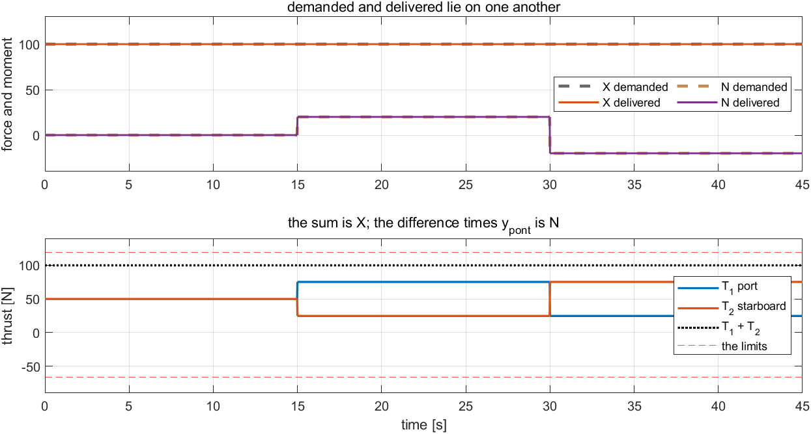
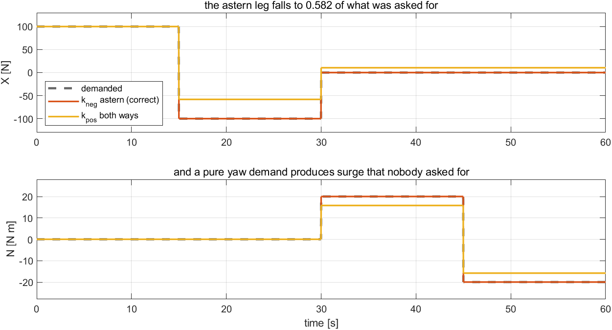
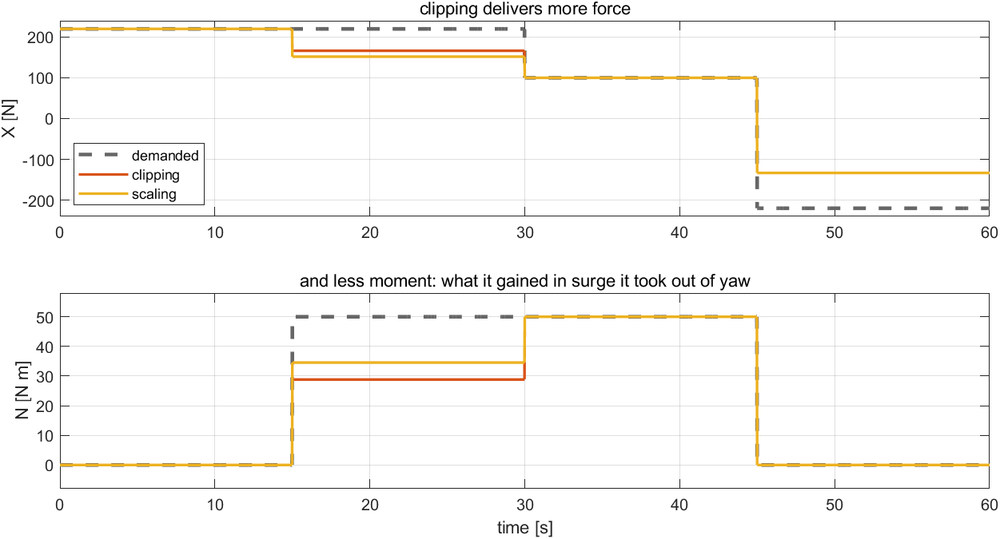

# Week 6 · Laboratory Problems — build the allocator in Simulink

- Course: Sensor Signal Processing and Fusion · Department of Autonomous Vehicle System Engineering
- Time: **one hour**, immediately after the Week 6 lecture hour
- Three problems, in order.

---

## What this hour is for

Weeks 3 to 5 commanded **forces**. A vessel has no force input; it has two propellers.

This hour builds the step that has been taken for granted since Week 3 — and then breaks it twice, in the two ways it is usually broken. Problem 1 builds the map. Problem 2 inverts the propeller curve carelessly and finds that a pure turn pushes the hull forward. Problem 3 asks for more than the propellers can give and finds that saturation does not weaken a command, it **turns** it.

---

## Before starting

```matlab
cd lectures/W06_simulink/problems
W06_P1_start                 % creates W06_P1.slx — the demand and the hull, nothing between
W06_check(1)                 % run this whenever, as often as needed
```

The solver is already set to fixed-step `ode4` at `h = 0.02` s. **Do not change it.**

> [!important] One requirement on every model
> **`alog`** — To Workspace, `Structure With Time`, carrying $[\,X_{\text{cmd}}\ ;\ N_{\text{cmd}}\ ;\ n_1\ ;\ n_2\,]$ in **newtons, newton-metres and rad/s, in that order**.
>
> The thrusts are deliberately **not** logged. The checker recovers them from the shaft speeds through the propeller curve, which is what the hull does — so a wrong inverse cannot be hidden by logging the thrust that was intended. Problem 2 is exactly this distinction, and a contract that let the intended thrust stand in for the delivered one would not test it.

The demand is a timetable set by the checker through `T_SW`, `X_SEQ` and `N_SEQ`, and is published as the tags `X_cmd` and `N_cmd`. The hull, the limits and the propeller coefficients are all in the workspace already: `y_pont`, `k_pos`, `k_neg`, `T_max`, `T_min`, `fit_mode`.

---

## Problem 1 · The square rule, and the curve (20 minutes)

**Build.** An allocator taking the demanded force and moment and producing two shaft speeds.

$$
T_1 = \frac{X}{2} + \frac{N}{2\,y_{\text{pont}}},
\qquad
T_2 = \frac{X}{2} - \frac{N}{2\,y_{\text{pont}}},
\qquad
n_i = \operatorname{sign}(T_i)\sqrt{\frac{\lvert T_i\rvert}{k}}
$$

| Symbol | Quantity | Value · source |
|---|---|---|
| $y_{\text{pont}}$ | half the distance between the pontoons | $0.395$ m · `otter_config` |
| $k$ | the propeller coefficient | $k_{\text{pos}} = 0.01108$ ahead · Week 1 §1-10 |
| $T_i$ | the thrust of propeller $i$ | N · positive forward |

No limits yet. Every demand in Problems 1 and 2 fits inside the propellers, so a limit step would never act.

> [!note] There is no gain in this block, and there is nothing to tune
> Allocation is the **inverse** of $X = T_1 + T_2$ and $N = y_{\text{pont}}(T_1 - T_2)$, not a controller. An inverse has no error to act on. If the answer is wrong it is wrong in the algebra, and no amount of tuning upstream will disguise it.

**Verify.** `W06_check(1)`.

| What the checker expects | |
|---|---|
| delivered $X$, all three legs | equal to the demand, to $0.05$ N |
| delivered $N$, all three legs | equal to the demand, to $0.02$ N·m |
| $T_1$, $T_2$ on the second leg | $75.32$ and $24.68$ N |
| $T_1 + T_2$ | $100$ N |

**What a correct model produces**



| Reading the figure | |
|---|---|
| top | demanded and delivered lie on one another. While the demand fits, allocation is invisible |
| bottom, the dotted line | $T_1 + T_2 = 100$ N in every leg, whatever the yaw demand does to the split |
| bottom, the gap at $t = 20$ s | $75.32 - 24.68 = 50.64$ N, times $0.395 = 20$ N·m — the demanded moment |
| bottom, the two traces crossing at $t = 30$ s | only the $N/(2y_{\text{pont}})$ term changed sign |
| bottom, the red limit lines | never touched. That is Problem 3's subject |
| the check | if $N$ comes out with the wrong sign, $T_1$ and $T_2$ have been swapped: port is the one that goes **ahead** for a positive moment |

---

## Problem 2 · Astern is a different curve (20 minutes)

**Build.** Nothing new — one line of Problem 1, made correct. The inverse must use the coefficient that belongs to the **sign of the thrust**:

$$
k = \begin{cases} k_{\text{pos}} = 0.01108 & T_i \ge 0 \\[2pt] k_{\text{neg}} = 0.00645 & T_i < 0 \end{cases}
$$

A propeller is worse backwards. It is the only nonlinear step in the chain and the only one where the direction of the thrust changes which equation applies.

**Predict before running.** If $k_{\text{pos}}$ were used in both directions, the shaft would turn at $\sqrt{\lvert T\rvert/k_{\text{pos}}}$ and the hull would answer with $k_{\text{neg}}$ times its square. Work out the factor, and then work out what a demand of **pure yaw** would do — one propeller of that pair runs astern and the other does not.

**Verify.** `W06_check(2)`. The timetable runs ahead, astern, and then yaw in both directions.

| What the checker expects | |
|---|---|
| ahead, $100$ N | delivered |
| astern, $-100$ N | delivered |
| pure yaw, $\pm 20$ N·m | delivered |
| surge during either yaw leg | $0$ N, to $0.05$ N |

That last row is the real test, and it is the one a careless inverse fails.

**What a correct model produces**



| Reading the figure | |
|---|---|
| top, the ahead leg | the two runs are one line: ahead, both choices use $k_{\text{pos}}$ |
| top, the astern leg | $-58.17$ against $-100$ N, a ratio of $0.582 = k_{\text{neg}}/k_{\text{pos}}$ |
| bottom, the yaw legs | $15.82$ of the $20$ N·m asked for |
| top, the yaw legs | $10.59$ N of surge, with **zero** surge demanded |
| the check | if the astern leg is correct but the yaw legs produce surge, the sign test is on the shaft speed rather than on the thrust |

**The point.** One wrong coefficient does not merely weaken the vessel. It makes a turn push the hull forward — cross-coupling between axes, produced by an error in a single scalar. And it would survive a sea trial, because ahead the two coefficients agree.

---

## Problem 3 · When the demand does not fit (20 minutes)

**Build.** A limit step, **in front of the curve**, choosing between two rules by `fit_mode`:

$$
\text{clip:}\quad T_i \leftarrow \min\big(\max(T_i,\ T_{\min}),\ T_{\max}\big)
\qquad\qquad
\text{scale:}\quad T_i \leftarrow s\,T_i,\quad s = \max\{\,s \le 1 : \mathbf{T}\ \text{fits}\,\}
$$

| Symbol | Quantity | Value · source |
|---|---|---|
| $T_{\max}$ | most one propeller can give ahead | $119.68$ N · Appendix A1 §A1-6 |
| $T_{\min}$ | most it can give astern | $-66.71$ N · same |
| `fit_mode` | $0$ clip, $1$ scale | set by the checker |

> [!warning] The limit is a limit on **thrust**, so it goes before the curve
> Clamping the shaft speeds instead gives the same answer for clipping and the **wrong** answer for scaling. Scaling is linear in $T$; the curve is not, so scaling a shaft speed does not scale a thrust.

**Predict before running.** The demand $(220,\ 50)$ needs $173.3$ N from the port propeller against a limit of $119.68$ N. Work out what each rule delivers, and in particular what each does to the ratio $X/N$ — which was $4.40$ when it was asked for.

**Verify.** `W06_check(3)`. The same timetable is flown twice, once under each rule.

| What the checker expects, on the second leg | clip | scale |
|---|---|---|
| delivered $X$ | $166.4$ N | $151.9$ N |
| delivered $N$ | $28.8$ N·m | $34.5$ N·m |
| the ratio $X/N$ | $5.77$ | $4.40$ |

The first, third and fourth legs must come out **the same under both rules** — they fit, or they saturate in only one component.

**What a correct model produces**



| Reading the figure | |
|---|---|
| both panels, third leg | the two runs and the demand all coincide: $(100,\ 50)$ needs $113.3$ N, which fits |
| first leg | $220$ N of surge alone is $110$ N each, which is legal — neither rule acts |
| second leg, top | clipping above scaling, $166.4$ against $151.9$ N |
| second leg, bottom | clipping **below** scaling, $28.8$ against $34.5$ N·m |
| last leg | both deliver $-133.4$ N: astern the limit is $-66.71$ N each, and with $N = 0$ the two rules coincide |
| the check | if the two runs are identical everywhere, `fit_mode` is not reaching the allocator |

**The point.** Saturation does not simply weaken a command; it **turns** it. The vessel on the second leg is being pushed harder and turned less than the controller believes — and the controller is never told. Clipping keeps the magnitude and loses the direction; scaling keeps the direction and loses magnitude. Neither is right in general, and **neither rule asks which demand mattered**. That question is §6-7.

---

## Marking

| | Weight | What is being marked |
|---|---|---|
| Problem 1 | 30 | `W06_check(1)` passes; the sentence "allocation is an inverse, not a controller" is argued rather than quoted |
| Problem 2 | 35 | `W06_check(2)` passes; the factor $k_{\text{neg}}/k_{\text{pos}}$ and the reason pure yaw produces surge were both written down **before** running |
| Problem 3 | 35 | `W06_check(3)` passes; the reason the limit step precedes the curve is stated |

---

## If something goes wrong

| Symptom | Cause | Fix |
|---|---|---|
| `The model has no To Workspace block whose variable name is alog` | only the provided `xlog` is there | add the second log: four signals, `Structure With Time` |
| `alog has 2 columns; 4 were expected` | the shaft-speed vector reached the Mux as a $2\times1$ matrix | insert a Reshape set to `1-D array` before the Mux |
| Delivered $N$ has the wrong sign | $T_1$ and $T_2$ are swapped | port is the one that goes ahead for a positive moment: $T_1 = X/2 + N/(2y_{\text{pont}})$ |
| The astern leg is short by a factor of $0.582$ | $k_{\text{pos}}$ is being used in both directions | choose $k$ by the sign of $T_i$, not by the sign of the demand |
| A pure yaw demand produces surge | the same fault, seen through a pair where only one propeller runs astern | as above |
| Scaling delivers the right magnitude and a wrong ratio | the limit is being applied to the shaft speeds | move it in front of the curve |
| Both `fit_mode` runs are identical | the flag is not reaching the block | it must be a MATLAB Function parameter, not a literal |

Reference answers are in `../solutions/`. Read them **after** attempting the problem.
