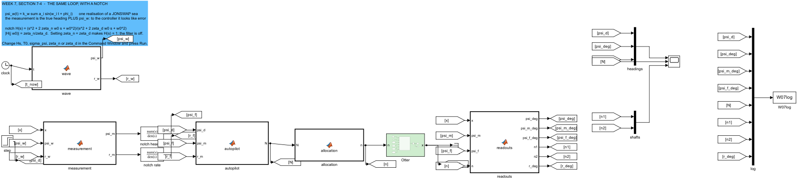
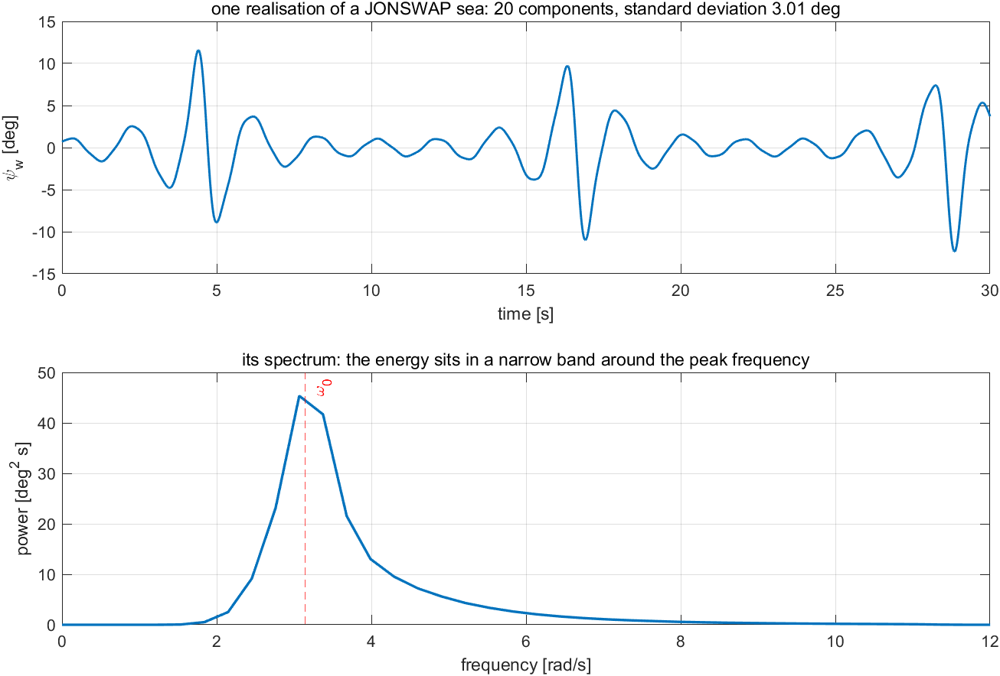
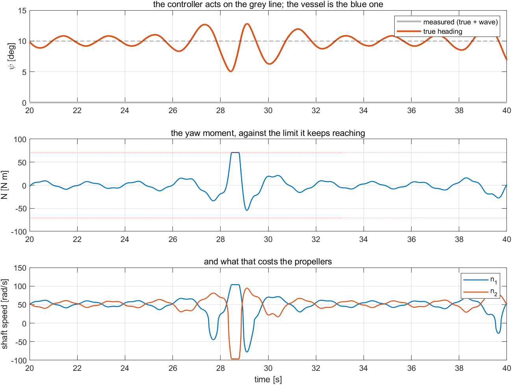
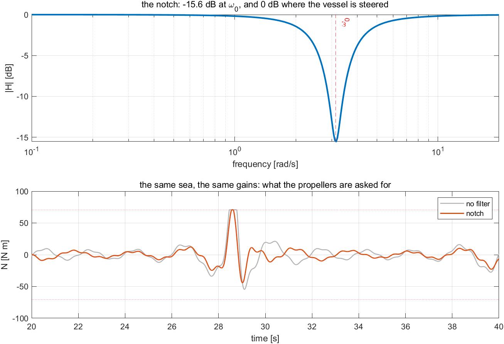
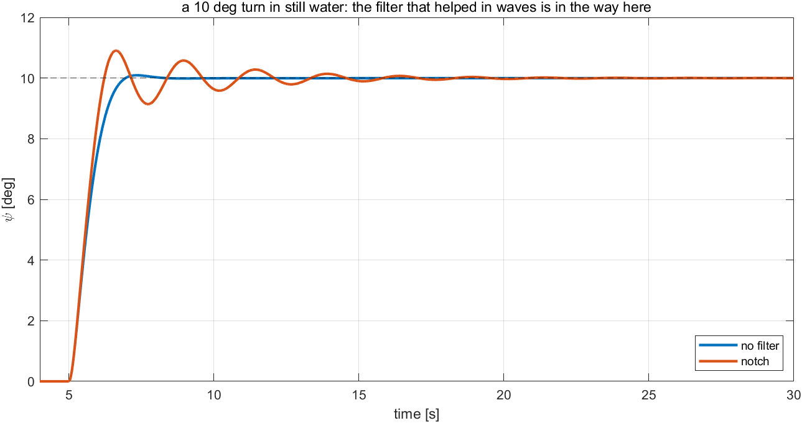
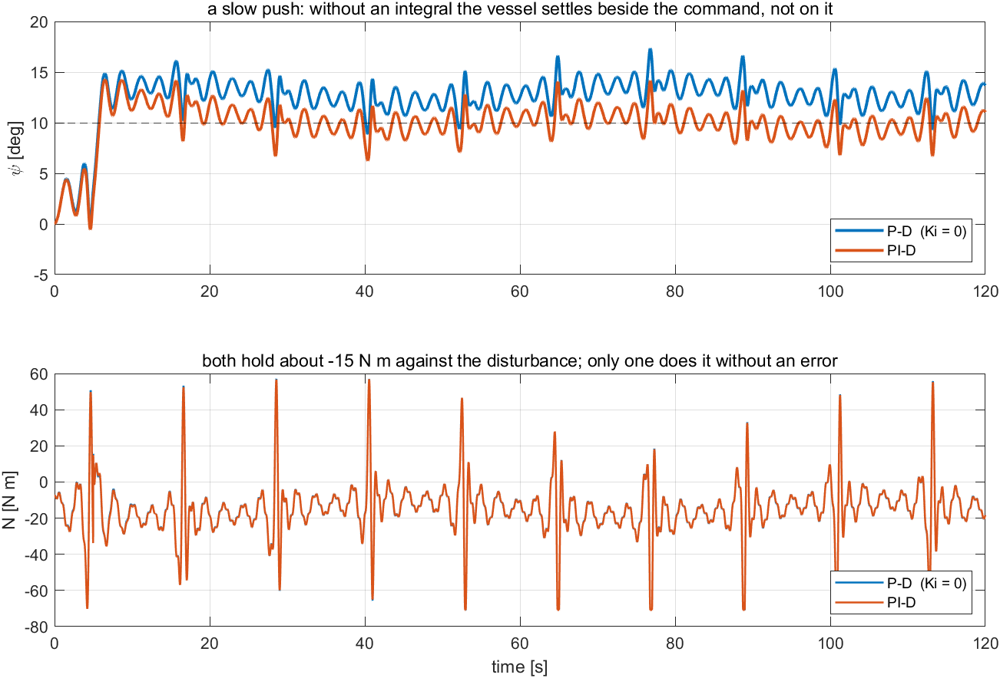
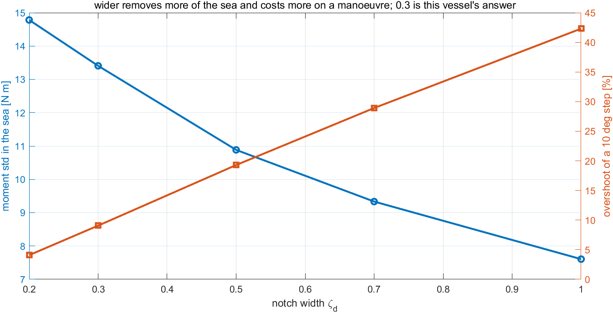

# Week 7 · Environmental Loads and Wave Filtering

> [!important] Reference material — read this first
> <span style="font-size:0.88em">The five courses below are **taught by the instructor of this course** and are the assumed background for it. They run from the fundamentals down to the graduate material, so start wherever the gap is. Every frame, symbol and derivation used here is developed in them at length; anyone whose prerequisites are thin should work through them first, then return.</span>
>
> | # | Course | Level | Lang. | Video | Slides and code |
> |---|---|---|---|---|---|
> | 1 | **Control Engineering** (제어공학) — the foundation: transfer functions, feedback, stability, root locus, PID | undergraduate | KO | [playlist](https://youtube.com/playlist?list=PLFaUxNRM4BvJMpF9HZS-Mp8tDv9dTdglk) | [drive](https://drive.google.com/drive/folders/1TNIPDNtS_Iy8li-olka5WJslSXDYf0aT) |
> | 2 | **Control System Design** (제어시스템설계) — design rather than analysis: specifications, loop shaping, discrete implementation | undergraduate | KO | [playlist](https://youtube.com/playlist?list=PLFaUxNRM4BvIGroZ5rgn7x08F7C79d9WZ) | [drive](https://drive.google.com/drive/folders/11m5Xxl_PHJvxgHghLSP-jhCpmRpbvoXh) |
> | 3 | **Advanced Control Engineering** (제어공학특론) — reference frames, the 6-DOF equation of motion, rotation matrices and Euler angles, linearisation and trim, vehicle control design | graduate | EN | [playlist](https://youtube.com/playlist?list=PLFaUxNRM4BvJmvF2ljx4KM5dj1P5jEcw0) | [drive](https://drive.google.com/drive/folders/1GUxbbONl916lNd0ggnFnXrNwNkd13-2-) |
> | 4 | **Sensor Signal Processing and Fusion** (센서신호처리 및 융합) — sensor models, noise, estimation and multi-sensor fusion | graduate | EN | [playlist](https://youtube.com/playlist?list=PLFaUxNRM4BvK-aP2Gdoyp5-AWvMn7Fo8E) | [drive](https://drive.google.com/drive/folders/1MEVJP7TzMcm8w6TZwUjhWJtL34WeNY3u) |
> | 5 | **Capstone Design** (캡스톤디자인) — a vehicle project carried end to end | undergraduate | KO | [playlist](https://youtube.com/playlist?list=PLFaUxNRM4BvLu7L0pDoLzDXTv8mm6rCmj) | [drive](https://drive.google.com/drive/folders/1haIQejlJfrdhtOuof-MpffR9ydVscXZS) |
>
> <span style="font-size:0.88em">**Not fluent in MATLAB or Simulink yet? Do these before Part 2.** Every laboratory in this course is Simulink, and the Onramp courses are free and take a few hours each.</span>
>
> | Tool | Where to start |
> |---|---|
> | MATLAB | [MATLAB Onramp](https://matlabacademy.mathworks.com/kr/details/matlab-onramp/gettingstarted) · [Core MATLAB Skills](https://matlabacademy.mathworks.com/details/core-matlab-skills/lpmlcms) |
> | Simulink | [Simulink Onramp](https://matlabacademy.mathworks.com/kr/details/simulink-onramp/simulink) · instructor's Simulink lectures [part 1](https://youtu.be/a-afHg_fSaU) · [part 2](https://youtu.be/070Yn0Hw5a0) |


> [!tip] Getting the course files, and keeping them current (Windows)
> <span style="font-size:0.88em">The notes, models and scripts are kept in one Git repository that is updated through the semester. Clone it once; before every class, pull. A pull downloads only what has changed since the last one.</span>
>
> | When | Where to run it | Command |
> |---|---|---|
> | once | PowerShell — installs Git for Windows | `winget install --id Git.Git -e` |
> | once | the folder that will hold the course, e.g. `Documents` | `git clone https://github.com/wkyouncnu/Sensor-Signal-Processing-and-Fusion.git` |
> | before every class | inside the cloned folder `Sensor-Signal-Processing-and-Fusion` | `git pull` |
>
> - `git pull` prints `Already up to date.` when nothing has changed, and otherwise lists the files it updated.
> - The repository is private. When Git asks, sign in with the GitHub account the instructor has given access.
> - Experiment on copies, not on the cloned files: copy a week's `WXX_simulink` folder elsewhere first, and a pull can never collide with local edits. If it already has, `git stash`, then `git pull`, then `git stash pop` sets the edits aside, updates, and puts them back.
> - The MSS toolbox is not part of the repository. The weeks that simulate the Otter need it at `Tools\MSS` inside the cloned folder.


- **Course**: USV Guidance, Navigation and Control (Graduate)
- **Department**: Autonomous Vehicle System Engineering, Chungnam National University
- **This week**: ① the sea written as one signal, from a spectrum ② what happens when the autopilot of Week 4 is given that signal ③ the notch filter that removes one frequency from the measurement ④ what the filter costs on a manoeuvre, and the slow part of the sea that it must leave alone

> [!important] Prerequisites from the previous week
> - From Week 4: the heading autopilot, its gains, and the wrap. This week does not retune it — it changes only what the autopilot is allowed to see.
> - From Week 6: the allocation that turns a demanded moment into two shaft speeds, and the limits it works inside.
> - From Week 2 §2-10: a low-pass filter, and the phase lag every filter charges for its attenuation. The notch of this week is that idea, aimed at one frequency.

---

## Learning Outcomes

Upon completion of this week, the learner is able to:

1. Write one realisation of a wave spectrum as a sum of components, and state which of its properties the controller cares about: the mean, the standard deviation, the rate and the peak frequency.
2. Explain why a vessel cannot follow the first-order wave motion, and measure what an autopilot spends trying.
3. Design a notch filter from the peak frequency, and state its attenuation and its phase lag from its two parameters.
4. Measure that filtering improves both the control effort **and** the true heading in a seaway.
5. Measure what the filter costs on a manoeuvre, and choose the notch width from that trade rather than from the attenuation alone.
6. Distinguish the oscillatory part of the sea, which must be filtered out, from the slow part, which must reach the integral.

## Prerequisites and Setup

| Item | Requirement |
|---|---|
| MATLAB | R2024b, with Simulink, the Control System Toolbox (`bode`) and the Signal Processing Toolbox (`pwelch`) |
| MSS | `Tools/MSS`, found by `W07_0_setup` through `mss_path`; `wavespec` supplies the JONSWAP spectrum |
| Course folder | `lectures/W07_simulink` |
| Models | **one per experiment** — `W07_C_wave`, `W07_D_no_filter`, `W07_E_notch`, `W07_G_slow`, `W07_H_tuning` — all generated by `W07_1_build_waves`, never edited by hand |
| Time | lecture 40 min, laboratory 1 h 20 min |

---

# Part 1 · Principle and experiment, section by section

Every section states what is observed, says what follows from it, and then runs **the experiment that measures it**, on its own model.

| Part of a section | What it holds |
|---|---|
| **What is observed** | the effect itself, with the numbers it produces |
| **What follows from it** | numbered lines, one step each, from the spectrum to the filter |
| **Experiment N-x** | the model, the commands, the output actually obtained, the figure, and a table that reads every feature of the figure back to **the numbered line that predicts it** |

## 7-0. Setting up (10 min)

```matlab
cd lectures/W07_simulink
W07_0_setup
W07_1_build_waves
```

Expected output:

```
  W07_0_setup
    sea       Hs = 0.30 m, T0 = 2.0 s  ->  w0 = 3.142 rad/s;  20 components
    response  the wave-induced heading has a standard deviation of 3.0 deg
    notch     zeta_n = 0.05, zeta_d = 0.30  ->  |H(j w0)| = 0.167 (-15.6 dB)
    autopilot Kp = 300, Kd = 100, Ki = 20;  |N| <= 70.85 N m

  built  W07_C_wave.slx     (overlapping lines: 0)
  built  W07_D_no_filter.slx (overlapping lines: 0)
  built  W07_E_notch.slx    (overlapping lines: 0)
  built  W07_G_slow.slx     (overlapping lines: 0)
  built  W07_H_tuning.slx   (overlapping lines: 0)
```

- `W07_0_setup.m` is the only file edited by hand. The sea is set by four numbers — $H_s$, $T_0$, the JONSWAP peak factor and the number of components — and the filter by two, $\zeta_n$ and $\zeta_d$.
- `wave_on = 0` switches the sea off without removing anything from a model: every experiment of this week is run both ways.

> [!warning] The first line of `W07_0_setup` is `clear`
> It resets the workspace to the lecture's values. Run it again whenever a Scope does not match these notes.

## 7-1. Three disturbances, and where each one enters

This section answers: what does the environment do to a control loop, and at which point?

- Weeks 1 to 6 met one disturbance: a **current**, which Week 1 modelled as a velocity of the water and Week 5 measured as a standing cross-track error. This week adds the other two.

| Disturbance | What it is | Where it enters | Where it is met in this course |
|---|---|---|---|
| current | a velocity of the water | the force balance, through $\boldsymbol{\nu}_r = \boldsymbol{\nu} - \boldsymbol{\nu}_c$ | Week 1 §1-13, Week 5 §5-5 |
| wind and second-order wave drift | a slowly varying **force** on the hull | added to the force the propellers produce | §7-6 |
| first-order waves | a fast **oscillation**, of the vessel and of what the sensor reports | the measurement the controller acts on | §7-2 to §7-5 |

- The three differ in frequency by orders of magnitude, and that is what makes them separable: a current is constant, wind and drift vary over minutes, and the waves of this week oscillate at $3.14$ rad/s — a period of two seconds.
- **The controller can and should reject the first two, and can neither reject nor usefully follow the third.** Everything in this week follows from that sentence.

> [!note] What this week does not derive
> How much a given sea turns a given hull — the response amplitude operator — belongs to hydrodynamics, not to control. This week takes the wave-induced heading as **given**, stated by its standard deviation (`sigma_psi`), and asks what a controller should do about it. Fossen's *Handbook* Chapter 8 derives the response; MSS computes it with `waveresponse345`.

### Experiment 7-1 · The chain, and where the sea is added (5 min)

**What it measures.** Nothing yet: the canvas is matched to the table above, and the one arrow that is new this week is found.

**The canvas.** `W07_E_notch` — the fullest model of the week, read here and measured in Experiment 7-4. The vessel, the autopilot and the allocation are those of Weeks 4 and 6, unchanged.

**Opening and running.**

```matlab
W07_0_setup
open_system('W07_E_notch')      % Run — 위: 선수각 셋, 가운데: 모멘트, 아래: 회전수 둘
```



| In the figure | Meaning |
|---|---|
| `clock` → `wave` | the sea, as a sum of components with fixed phases: the same sea on every run |
| `measurement` | where the sea enters: the true heading and rate **plus** the wave |
| `notch heading`, `notch rate` | the filter of §7-4, one for each measured signal |
| `autopilot` → `allocation` → green `Otter` | Weeks 4 and 6, not retuned and not rewritten |
| Scope | the command, the true heading and the measured heading; then the moment; then the two shaft speeds |

- Double-click `measurement` and read the two lines. The vessel is **not** being pushed by the wave in this model: the sensor reports an oscillation, and the controller treats it as error. That is the situation wave filtering exists for.

## 7-2. The sea as one signal

This section answers: what does a seaway look like from inside a controller?

**What is observed.** Experiment 7-2 runs the sea with no vessel and no controller:

- the wave-induced heading has a standard deviation of $3.008°$ and reaches $12.79°$,
- its **rate** has a standard deviation of $11.64$ deg/s and reaches $59.45$ deg/s,
- the mean of both is zero to three decimals,
- and the spectrum of the heading peaks at $3.07$ rad/s, against $\omega_0 = 2\pi/T_0 = 3.142$ rad/s.

**What follows from it, one line at a time.**

1. A sea state is a **spectrum**, not a waveform: $S(\omega)$ says how much energy sits at each frequency. This week uses JONSWAP, from MSS `wavespec`, with $H_s = 0.3$ m and $T_0 = 2$ s — a short wind chop, the sea a 2 m vessel actually meets.
2. One **realisation** of that spectrum is a sum of components,
$$
\psi_w(t) = k_w \sum_{i=1}^{N} a_i \sin(\omega_i t + \phi_i),
\qquad
a_i = \sqrt{2\,S(\omega_i)\,\Delta\omega}
$$
with the amplitudes taken from the spectrum and the phases chosen. Fixing the phases makes the sea **repeatable**, so that a table in these notes can be reproduced; MSS's `waveresponse345` builds a realisation the same way.
3. **The mean is zero.** A first-order wave shakes the vessel; it does not push it. Whatever pushing the sea does is the slow part of §7-6, and it is a different signal.
4. **The rate is the problem, not the amplitude.** $3°$ of heading is nothing, but $11.64$ deg/s of heading **rate** is about what this vessel can turn at with its full $70.85$ N·m (Week 4 §4-2: $8.14$ deg/s at $20$ N·m). A controller with a derivative term sees that rate directly.
5. The energy is narrow-banded around $\omega_0$. That is what makes a **notch** the right instrument: one frequency to remove, not a whole band above some corner.
6. $\omega_0 = 3.14$ rad/s sits **above** the loop's bandwidth. Week 4's step response rises in about $1.1$ s, so $\omega_B \approx 1.8/t_r \approx 1.6$ rad/s (Week 2 §2-3): the vessel could not follow the sea even if it should.

### Experiment 7-2 · The sea as one signal (8 min)

**What it measures.** Lines 3 to 6: the mean, the standard deviation of the heading and of its rate, and where the spectrum peaks.

**The model.** `W07_C_wave` — the wave block, a Scope and a log. No vessel and no controller: the sea on its own.

**Opening and running.**

```matlab
W07_0_setup
open_system('W07_C_wave')       % Run — 위: 선수각, 아래: 그 변화율 / heading above, its rate below
Hs = 0.6;                       % Run — 거친 바다 / a rougher sea: everything doubles
Hs = 0.3; T0 = 4;               % Run — 긴 너울 / a longer swell: slower, and far gentler in rate
W07_C_sea_as_signal             % 통계와 스펙트럼 / the statistics and the spectrum
```

Expected output:

```
  W07 Experiment 7-2  the sea as one signal  (Hs 0.30 m, T0 2.0 s)
    signal                            std      max     mean
    wave-induced heading            3.008   12.792   0.0089   [deg]
    its rate                       11.637   59.454  -0.0108   [deg/s]
    the heading spectrum peaks at 3.068 rad/s;  w0 = 2 pi / T0 = 3.142 rad/s
```



**Reading the figure against the derivation.**

| Where to look | What is there | Which line predicts it |
|---|---|---|
| top panel, the trace | an irregular oscillation, never repeating within the run | line 2: many components at different frequencies |
| top panel, **where it sits** | centred on zero | line 3: a first-order wave has no mean |
| top panel, the slope of the trace | steep everywhere | line 4: the rate, not the amplitude, is what a derivative sees |
| bottom panel, the peak | at $\omega_0 = 3.14$ rad/s, marked | line 1: JONSWAP with $T_0 = 2$ s |
| bottom panel, the **width** of the peak | narrow, with little energy below 2 rad/s | line 5: a notch is enough; a low-pass is not needed |

**What the figure says**

- The sea the controller sees is one narrow-band signal with zero mean and a rate the vessel can barely match.

| What to try | What to watch |
|---|---|
| `Hs = 0.6;` Run | every amplitude doubles: the spectrum is linear in the energy, and the realisation with it |
| `T0 = 4;` Run | the peak moves to $1.57$ rad/s, **below** the loop bandwidth. The vessel would then partly follow the sea, and a notch there would fight the steering itself — the case §7-7 warns about |

> [!tip] In class
> - **Purpose** — replace "there are waves" by four numbers a controller can be reasoned about with.
> - **Point to** — the rate panel, and Week 4's measured turn rate of $8.14$ deg/s at $20$ N·m.
> - **Ask** — "Why does the mean matter?" Because a zero-mean disturbance cannot be corrected on average; only its effect on effort can be.
> - **Take away** — a sea state is a spectrum, and what reaches the controller is one narrow-band signal.

## 7-3. The loop that chases the waves

This section answers: what happens if the autopilot of Week 4 is simply left switched on?

**What is observed.** Experiment 7-3 runs the Week 4 loop with the sea on and off:

- with the sea off, the heading holds to $0.001°$ and the moment is $0.00$ N·m,
- with the sea on, the moment works at $18.85$ N·m of standard deviation and **reaches its $70.85$ N·m limit**, spending $1.18$ s of the window saturated,
- the shaft speeds wander by $29.14$ rad/s,
- and the **true** heading — the vessel's own, not the measurement — has a standard deviation of $1.551°$.

**What follows from it, one line at a time.**

1. The controller cannot tell the wave apart from a real heading error: both arrive on the same wire. It therefore acts on all of it.
2. The P term alone would demand $K_p\,\psi_w \approx 300 \times 0.052\ \text{rad} = 16$ N·m of standard deviation, and the D term $K_d\,r_w \approx 100 \times 0.203\ \text{rad/s} = 20$ N·m. The measured $18.85$ N·m is that order, with the limit clipping the peaks.
3. **The vessel cannot follow.** At $3.14$ rad/s the loop is past its bandwidth (§7-2 line 6), so almost none of that moment turns into the motion it was asked for.
4. **It is not merely wasted, it is harmful.** The moment is large enough to shake the vessel at wave frequency, and the true heading is $1.551°$ worse than the $0.001°$ of the calm run. The controller has become a disturbance.
5. The propellers pay for all of it: continual reversals, $29$ rad/s of variation, and a limit reached over a thousand times an hour. This is the wear and the power that wave filtering exists to prevent.
6. Nothing here is a tuning fault. The gains are the ones Week 4 chose and verified; what is wrong is **what the controller is allowed to see**.

### Experiment 7-3 · The loop in waves, unfiltered (12 min)

**What it measures.** Lines 2, 4 and 5: the effort, the harm to the true heading, and what the propellers do.

**The model.** `W07_D_no_filter` — the loop of Weeks 4 and 6 with the measurement wired straight in. There is no filter anywhere in this model.

**Opening and running.**

```matlab
W07_0_setup
open_system('W07_D_no_filter')  % Run — 아래 두 칸을 본다 / watch the lower two panels
wave_on = 0;                    % Run — 조용한 바다: 모멘트가 0 이다 / a calm sea: the moment is zero
wave_on = 1; Hs = 0.15;         % Run — 절반의 바다 / half the sea
W07_D_chasing_waves             % 두 경우를 한 번에 / both cases at once
```

Expected output:

```
  W07 Experiment 7-3  the loop in waves, with no filter  (after t = 20 s)
    sea         heading std   moment std   moment max   shaft n1 std   time on the limit
    off            0.001 deg        0.00 Nm       0.01 Nm        0.00 rad/s       0.00 s
    on             1.551 deg       18.85 Nm      70.85 Nm       29.14 rad/s       1.18 s
```



**Reading the figure against the derivation.**

| Where to look | What is there | Which line predicts it |
|---|---|---|
| top panel, the grey line | the measurement, swinging by $\pm 10°$ | line 1: the wave and the heading arrive on one wire |
| top panel, the blue line | the true heading, wandering by $1.55°$ | line 4: the controller is shaking the vessel |
| top panel, blue against grey | the blue is far smaller | line 3: the vessel cannot follow at $3.14$ rad/s |
| middle panel, the flat tops | the moment on its $\pm 70.85$ N·m limit | line 2: the demand exceeds what the propellers have |
| bottom panel | the shafts reversing continually | line 5: the cost is paid in wear and power |

**What the figure says**

- Everything in the lower two panels is spent on a motion the vessel cannot make, and the top panel shows it made the heading worse.

| What to try | What to watch |
|---|---|
| `Hs = 0.15;` Run | half the sea halves the effort, and the heading still degrades: the fault scales with the sea, it is not a threshold effect |
| `Kd = 0;` Run | the effort falls sharply — the derivative was the larger contributor (line 2) — but Week 4's damping goes with it, which is why the answer is a filter and not a smaller gain |

> [!tip] In class
> - **Purpose** — show that a correct, verified controller can be made harmful by its measurement alone.
> - **Point to** — the calm row and the seaway row of the table: the same gains, and every column different.
> - **Ask** — "Which term is doing the damage?" Mostly D: the wave rate is $11.6$ deg/s against a heading of $3°$.
> - **Take away** — a loop that cannot follow a disturbance should not be shown it.

## 7-4. The notch filter

This section answers: how is one frequency removed from a measurement, and what does removing it change?

**What is observed.** Experiment 7-4 puts a notch on both measured signals and changes nothing else:

- the moment falls from $18.85$ to $13.41$ N·m of standard deviation,
- the shaft speeds from $29.14$ to $20.58$ rad/s,
- and the **true heading improves as well**, from $1.551°$ to $1.042°$.

**What follows from it, one line at a time.**

1. The filter must remove one narrow band and leave everything else alone, because the heading the vessel is actually steering lives below it (§7-2 lines 5 and 6). The second-order **notch** does exactly that:
$$
H(s) = \frac{s^2 + 2\zeta_n \omega_0 s + \omega_0^2}{s^2 + 2\zeta_d \omega_0 s + \omega_0^2},
\qquad \zeta_n < \zeta_d
$$
2. At the notch frequency the two quadratic terms cancel except for their damping, so the attenuation is the **ratio of the two damping ratios**:
$$
\lvert H(j\omega_0)\rvert = \frac{\zeta_n}{\zeta_d} = \frac{0.05}{0.3} = 0.167 = -15.6\ \text{dB}
$$
3. Far from $\omega_0$, in both directions, the numerator and denominator agree and $\lvert H \rvert \to 1$. A notch **passes** the slow disturbances of §7-6 and the steering itself.
4. Setting $\zeta_n = \zeta_d$ makes $H(s) = 1$ identically. That is how the filter is switched off in these models — no block is removed, and the comparison stays honest.
5. Both measured signals must be filtered. The rate carries the wave at $11.6$ deg/s (§7-2 line 4), so filtering the heading alone would leave the larger of the two contributions in place.
6. The true heading improving is the result worth keeping. Filtering does not merely save effort: by not shaking the vessel at wave frequency, it steers better.

### Experiment 7-4 · The notch, measured (12 min)

**What it measures.** Lines 2 and 6: the attenuation the formula predicts, and what the filter does to the effort and to the true heading in the same sea.

**The model.** `W07_E_notch` — the model of §7-3 with two Transfer Fcn blocks added, `notch heading` and `notch rate`, both carrying the coefficients of line 1.

**Opening and running.**

```matlab
W07_0_setup
open_system('W07_E_notch')      % Run — 가운데 칸의 모멘트가 작아졌다 / a quieter moment
zeta_n = zeta_d;                % Run — 필터를 끈다 (H(s) = 1) / the filter switched off
zeta_n = 0.05;  zeta_d = 1.0;   % Run — 더 넓게 / a wider notch
W07_E_notch_filter              % 두 모델을 같은 바다에서 / both models, in the same sea
```

Expected output:

```
  W07 Experiment 7-4  the notch  (zeta_n 0.05, zeta_d 0.30  ->  |H(j w0)| = 0.167)
    filter        heading std   moment std   moment max   shaft n1 std
    none             1.551 deg       18.85 Nm      70.85 Nm       29.14 rad/s
    notch            1.042 deg       13.41 Nm      70.85 Nm       20.58 rad/s
```



**Reading the figure against the derivation.**

| Where to look | What is there | Which line predicts it |
|---|---|---|
| top panel, the dip | $-15.6$ dB at the marked $\omega_0$ | line 2: $\zeta_n/\zeta_d = 0.167$ |
| top panel, away from the dip | back to 0 dB on both sides | line 3: everything else is passed |
| top panel, the width of the dip | about a decade | line 1: $\zeta_d$ sets it, and §7-7 chooses it |
| bottom panel, grey against blue | the same sea, a visibly quieter demand | line 6: the effort saved |
| bottom panel, the flat tops that remain | the limit is still reached occasionally | the notch attenuates by $-15.6$ dB, it does not delete |
| the heading column of the table | $1.551 \to 1.042$ deg | line 6: not shaking the vessel steers it better |

**What the figure says**

- One filter, two numbers, and every column of the table improves at once. Nothing was retuned.

| What to try | What to watch |
|---|---|
| `zeta_n = zeta_d;` Run | $H(s) = 1$: the model with the filter reproduces the model without it, which is the check that the comparison is fair (line 4) |
| `zeta_d = 1.0;` Run | the moment falls further, to $7.61$ N·m — and §7-5 shows what that costs |

> [!tip] In class
> - **Purpose** — one filter, derived from one number of the sea, with its attenuation known before it is run.
> - **Point to** — the Bode dip and the moment trace under it, then the heading column.
> - **Ask** — "Why filter the rate as well?" It carries the wave at $11.6$ deg/s; leaving it in would leave most of the problem in.
> - **Take away** — a notch removes one frequency and returns to unity everywhere else.

## 7-5. What the filter costs

This section answers: is the notch free, and may it be left in on a calm day?

**What is observed.** Experiment 7-5 switches the sea off and gives both models the same $10°$ step:

- unfiltered: overshoot $0.93\,\%$, settling $1.72$ s — the Week 4 result,
- with the notch: overshoot $9.07\,\%$, settling $7.76$ s,
- and the notch's phase at $1.6$ rad/s, the loop's bandwidth, is $-18.5°$.

**What follows from it, one line at a time.**

1. Attenuation and phase cannot be separated: any filter that removes energy at one frequency delays signals at neighbouring ones. Week 2 §2-10 charged the same price for the derivative's low-pass.
2. The loop is steered at frequencies near $\omega_B \approx 1.6$ rad/s, and the notch adds $-18.5°$ of phase there.
3. That phase falls on the **D term**, which is what supplies the damping (Week 4 §4-3 line 3). A brake that arrives late is a weaker brake, so the overshoot grows from $0.93$ to $9.07\,\%$.
4. The wider the notch, the more phase it spends at the steering frequencies — which is §7-7's trade, measured.
5. So the filter is **not free, and not always right**. In a seaway it saves effort and steers better; in still water it makes a manoeuvre worse.
6. A vessel that must both manoeuvre hard and sit in a seaway switches the filter out for the manoeuvre, which in these models is one line: $\zeta_n = \zeta_d$.

### Experiment 7-5 · The cost, on a step (8 min)

**What it measures.** Lines 2 and 3: the phase the notch adds at the bandwidth, and what it does to a manoeuvre with no sea at all.

**The models.** `W07_D_no_filter` and `W07_E_notch`, the two of §7-3 and §7-4, with `wave_on = 0`. Nothing else differs between them.

**Opening and running.**

```matlab
W07_0_setup
wave_on = 0;                    % 바다를 끈다 / the sea off
open_system('W07_D_no_filter')  % Run — 4주차의 계단응답 그대로 / the Week 4 step
open_system('W07_E_notch')      % Run — 같은 계단, 더 크게 넘친다 / the same step, more overshoot
W07_F_what_it_costs             % 두 응답과 지표 / both responses and their metrics
```

Expected output:

```
  W07 Experiment 7-5  what the filter costs  (the sea switched off)
    filter        overshoot   rise [s]   settle [s]   phase of H at 1.6 rad/s
    none              0.93 %      1.14        1.72               0.0 deg
    notch             9.07 %      0.86        7.76             -18.5 deg
```



**Reading the figure against the derivation.**

| Where to look | What is there | Which line predicts it |
|---|---|---|
| the two traces before the peak | almost the same, the notched one slightly faster | line 3: the damping is what weakens, not the push |
| the peak of the notched trace | $9.07\,\%$ against $0.93\,\%$ | line 3: $-18.5°$ of phase on the D term |
| the tail of the notched trace | a long slow approach, $7.76$ s | line 3 again: less damping leaves a slower settling |
| the phase column | $0.0°$ and $-18.5°$ at $1.6$ rad/s | lines 1 and 2: the price of the attenuation, charged where the vessel is steered |

**What the figure says**

- The filter that improved every column of §7-4 makes this manoeuvre visibly worse. Both are true at once, and which matters depends on the day.

| What to try | What to watch |
|---|---|
| `zeta_d = 1.0;` then rerun | overshoot $42.32\,\%$ and settling $20.82$ s: a wider notch is a worse manoeuvre, monotonically |
| `zeta_n = zeta_d;` then rerun | the two models agree exactly again: the cost is the filter's, not the model's |

> [!tip] In class
> - **Purpose** — refuse the idea that a filter is a free improvement.
> - **Point to** — the phase column, and Week 2 §2-10 where the same trade was paid for the derivative.
> - **Ask** — "Why is the rise time slightly shorter with the filter?" Less damping is a faster rise and a worse peak; both come from the same lost phase.
> - **Take away** — attenuation is bought with phase, and phase is what damping is made of.

## 7-6. The slow part, which must not be filtered

This section answers: the sea also pushes. What happens to that part?

**What is observed.** Experiment 7-6 adds a slowly varying yaw moment of $15$ N·m, varying over $60$ s, to the hull — wind and second-order wave drift, as one signal — with the notch in place:

- with P–D alone the vessel settles $3.071°$ off the commanded heading,
- with the integral of Week 4 it settles $0.084°$ off,
- and both hold the same $-15.13$ N·m against the disturbance.

**What follows from it, one line at a time.**

1. Wind and second-order wave drift vary over minutes, not seconds: on the frequency axis they sit two decades below $\omega_0$.
2. The notch is unity there (§7-4 line 3), so it **passes** them. A filter that removed them would hide a real push from the controller, and the vessel would be carried off heading with the measurement showing nothing.
3. A steady moment demands a steady counter-moment, and a P controller can only produce one from error: $300 \times 3.071° \times \pi/180 = 16.1$ N·m, which is the $-15.13$ N·m measured plus what the D term contributes in the swings. This is Week 2 §2-6 line 7 once more.
4. The integral removes that error, exactly as in Weeks 2 to 5: $0.084°$ left.
5. **The wave does not wind the integral up**, because it has zero mean (§7-2 line 3). The integral accumulates the slow part and ignores the fast one — which is why a notch and an integral can be used together without one spoiling the other.
6. So the two halves of the sea are handled by two different mechanisms, and neither can do the other's work: the notch for what cannot be followed, the integral for what must be opposed.

### Experiment 7-6 · The slow part, and the integral (10 min)

**What it measures.** Lines 3 to 5: the error a P–D loop keeps against a slow push, the integral removing it, and that the wave does not wind it up.

**The model.** `W07_G_slow` — the notched loop with the integral of Week 4 switched on and a slow disturbance moment added to the hull, after the controller, where the sea adds it.

**Opening and running.**

```matlab
W07_0_setup
open_system('W07_G_slow')       % Run — 명령 위에 앉는다 / it settles on the command
Ki = 0;                         % Run — 3 도 옆에 앉는다 / it settles 3 deg beside it
Ki = 20; N_slow = 40;           % Run — 더 센 바람 / a stronger push, and the same conclusion
W07_G_slow_part                 % 두 경우를 한 번에 / both cases at once
```

Expected output:

```
  W07 Experiment 7-6  a slow disturbance of 15 N m, varying over 60 s
    controller              mean heading error   mean moment   heading std
    P-D  (Ki = 0)                   3.071 deg       -15.13 Nm      1.198 deg
    PI-D                            0.084 deg       -15.13 Nm      1.191 deg
```



**Reading the figure against the derivation.**

| Where to look | What is there | Which line predicts it |
|---|---|---|
| top panel, the P–D trace | riding $3°$ above the dashed command | line 3: the error is what makes the counter-moment |
| top panel, the PI–D trace | on the command, with the same wave ripple | line 4: the integral removes the offset and nothing else |
| top panel, the ripple on both | the same size, $1.19°$ | line 5: the integral does not touch the zero-mean part |
| bottom panel, both traces | around $-15$ N·m, following the slow variation | lines 1 and 2: the notch passed the slow part, so the loop can oppose it |
| the two `mean moment` entries | identical to two decimals | line 3: the physics decides the moment; the controller decides who pays for it |

**What the figure says**

- The notch kept what the controller must act on and removed what it must not. The two parts of the sea leave by two different doors.

| What to try | What to watch |
|---|---|
| `N_slow = 40;` with `Ki = 0` | the offset grows in proportion, to about $8°$: line 3 is linear in the disturbance |
| `T_slow = 6;` | a disturbance ten times faster is now close to the loop bandwidth and partly attenuated by the notch's skirt — the boundary between "slow" and "wave" is not sharp, and §7-7 is where it is drawn |

> [!tip] In class
> - **Purpose** — close the loop of the week: the filter must be selective, not merely attenuating.
> - **Point to** — the identical ripple on both traces, and the offset on only one.
> - **Ask** — "What would happen if the notch also removed the slow part?" The vessel would be pushed off heading and the measurement would not show it — the worst failure in this week.
> - **Take away** — filter what cannot be followed, integrate what must be opposed.

## 7-7. Choosing the notch

This section answers: what decides the two numbers of the filter?

**What is observed.** Experiment 7-7 sweeps the width $\zeta_d$ with $\zeta_n$ fixed at $0.05$:

| $\zeta_d$ | $\lvert H(j\omega_0)\rvert$ | moment std [N·m] | heading std [deg] | overshoot [%] | settling [s] |
|---|---|---|---|---|---|
| 0.2 | 0.250 | 14.78 | 1.166 | 4.09 | 6.12 |
| **0.3** | **0.167** | **13.41** | **1.042** | **9.07** | **7.76** |
| 0.5 | 0.100 | 10.88 | 0.812 | 19.29 | 10.22 |
| 0.7 | 0.071 | 9.33 | 0.715 | 28.92 | 14.14 |
| 1.0 | 0.050 | 7.61 | 0.537 | 42.32 | 20.82 |

- every column improves monotonically with width in the sea, and every column worsens monotonically on the step.

**What follows from it, one line at a time.**

1. **$\omega_0$ is not tuned; it is measured.** It comes from the sea, through $T_0$, and a wave filter that is centred on the wrong frequency attenuates nothing useful. On a vessel it is estimated on line, from the measured heading spectrum — which is what Experiment 7-2 did with `pwelch`.
2. $\zeta_n$ sets the depth, $\zeta_n/\zeta_d$, and there is little reason to make it large. This week keeps it at $0.05$ throughout.
3. $\zeta_d$ sets the width, and it is the only real decision: wider removes more of the sea (§7-4) and spends more phase at the steering frequencies (§7-5).
4. The two columns to read together are therefore **moment std** and **overshoot**. The first is what the filter is for; the second is what it costs.
5. For this vessel and this sea, $\zeta_d = 0.3$: the moment falls from $18.85$ to $13.41$ N·m while the overshoot stays below $10\,\%$. A wider notch buys another $6$ N·m at the price of a manoeuvre four times worse.
6. The tuning order is therefore: **measure $\omega_0$ → fix $\zeta_n$ small → raise $\zeta_d$ until the manoeuvre is as bad as can be accepted → check in the sea.** It is the order of Week 2 §2-12 with the roles of "good" and "cheap" exchanged.
7. Beyond a notch there is an **observer**: a model of the vessel and of the wave, estimating the low-frequency heading rather than filtering the measured one. That is what MSS's `demoPassiveWavefilterAutopilot1` and `demoKalmanWavefilterAutop` do, and what Week 8 leads to.

### Experiment 7-7 · Choosing the width (12 min)

**What it measures.** Lines 3 to 5: the two columns that decide, measured on five widths — the same sweep that produced the table above.

**The model.** `W07_H_tuning` — the notched loop of §7-4 again, this time as the model the filter is **chosen** on. It is run twice for each width: once in the sea for the effort, once with the sea off for the step.

**Opening and running.**

```matlab
W07_0_setup
W07_H_tuning_order              % 다섯 너비, 두 수치씩 / five widths, two numbers each
```

Expected output:

```
  W07 Experiment 7-7  choosing the notch  (zeta_n = 0.05 throughout)
    zeta_d   |H(j w0)|   moment std   heading std   overshoot   settle [s]
     0.20       0.250       14.78 Nm      1.166 deg      4.09 %      6.12
     0.30       0.167       13.41 Nm      1.042 deg      9.07 %      7.76
     0.50       0.100       10.88 Nm      0.812 deg     19.29 %     10.22
     0.70       0.071        9.33 Nm      0.715 deg     28.92 %     14.14
     1.00       0.050        7.61 Nm      0.537 deg     42.32 %     20.82
```



**Reading the figure against the derivation.**

| Where to look | What is there | Which line predicts it |
|---|---|---|
| the left-hand curve | falling from $14.78$ to $7.61$ N·m | line 3: a wider notch removes more of the sea |
| the right-hand curve | rising from $4.09$ to $42.32\,\%$ | line 3 again, the other side of it |
| where the two curves cross in usefulness | around $\zeta_d = 0.3$ | line 5: the chosen value of this week |
| the `|H(j w0)|` column | exactly $\zeta_n/\zeta_d$ in every row | §7-4 line 2, once per row |
| the `heading std` column | improving with width, like the moment | §7-4 line 6: the two go together in the sea |

**What the figure says**

- There is no best notch, only a chosen one, and the choice is written in two columns of one table.

| What to try | What to watch |
|---|---|
| `T0 = 4;` then rerun the sweep | $\omega_0$ halves, the notch lands at $1.57$ rad/s — inside the loop's bandwidth — and every width costs far more. Line 1: the sea decides where the filter goes, and some seas cannot be filtered this way |
| `zeta_n = 0.2;` at $\zeta_d = 0.3$ | a shallow notch: little attenuation and little phase. The depth is the cheap parameter, the width the expensive one |

> [!tip] In class
> - **Purpose** — end the week with a decision made from measurements, as every week of this course ends.
> - **Point to** — the two curves crossing purposes, and the single row that was chosen.
> - **Ask** — "What would make a wide notch the right answer?" A vessel that never manoeuvres hard — a survey ship on a line, or a rig on station.
> - **Take away** — measure $\omega_0$, keep the notch shallow and no wider than the manoeuvre can pay for.

---

# Part 2 · Laboratory run order

The experiments of Part 1 are worked through in order; this table is the index of what was run, for repeating the week at home.

| Experiment | Model | Script | What it shows |
|---|---|---|---|
| 7-0 | all of them | `W07_0_setup`, `W07_1_build_waves` | the parameters, and every model written from code |
| 7-1 | `W07_E_notch` | — | the chain, and where the sea is added |
| 7-2 | `W07_C_wave` | `W07_C_sea_as_signal` | one realisation of a JONSWAP sea, and its spectrum |
| 7-3 | `W07_D_no_filter` | `W07_D_chasing_waves` | the Week 4 loop, shown the sea |
| 7-4 | `W07_E_notch` | `W07_E_notch_filter` | the notch, and what it saves |
| 7-5 | `W07_D_no_filter`, `W07_E_notch` | `W07_F_what_it_costs` | the same step with the sea off |
| 7-6 | `W07_G_slow` | `W07_G_slow_part` | a slow push, and the integral |
| 7-7 | `W07_H_tuning` | `W07_H_tuning_order` | five widths, and the choice |

- The scripts only repeat what Run already shows, for several settings at once, and print the numbers quoted in Part 1.
- Each experiment ends with an **In class** note: purpose, what to point at, a question with its answer, and the sentence to take away.

---

# Summary

## Week Summary

| Step | What was done | How it was verified |
|---|---|---|
| 1 | wrote one sea as a sum of components from a JONSWAP spectrum | `check_overlaps` 0 in four models; `verify_w07_waves` check 2: $H_s$ exact, peak at $\omega_0$ |
| 2 | measured what reaches the controller | Experiment 7-2: heading std $3.008°$, rate std $11.64$ deg/s, zero mean; check 3 |
| 3 | showed the Week 4 loop chasing it | Experiment 7-3: moment std $18.85$ N·m, on the limit for $1.18$ s, true heading $1.551°$ |
| 4 | derived and measured the notch | Experiment 7-4: $-15.6$ dB at $\omega_0$; moment $18.85 \to 13.41$ N·m and heading $1.551 \to 1.042°$; checks 4 and 5 |
| 5 | measured what it costs | Experiment 7-5: overshoot $0.93 \to 9.07\,\%$, settling $1.72 \to 7.76$ s, phase $-18.5°$ at $1.6$ rad/s |
| 6 | separated the slow part from the fast | Experiment 7-6: $3.071°$ of offset with P–D, $0.084°$ with the integral, the same $-15.13$ N·m held |
| 7 | chose the width from the trade | Experiment 7-7: five widths measured both ways; $\zeta_d = 0.3$ |

## Progress Check

> [!important] Minimum condition for following Week 8

### Theory

- [ ] Able to write one realisation of a wave spectrum, and to say why the phases are fixed.
- [ ] Able to state the four numbers of a sea that a controller cares about, and which of them is the dangerous one.
- [ ] Able to explain why a vessel can neither follow nor usefully oppose the first-order wave motion.
- [ ] Able to write the notch and state its attenuation at $\omega_0$ from its two parameters.
- [ ] Able to explain why a filter that attenuates must also delay, and where that delay is felt.
- [ ] Able to say which part of the sea the integral must see, and why the notch does not remove it.

### Laboratory

- [ ] `W07_1_build_waves` ran and every model reported `overlapping lines: 0`.
- [ ] The sea was changed in the Command Window and the Scope showed the new sea.
- [ ] `verify_w07_waves` printed `ALL CHECKS PASSED`.

### Recorded observations

- [ ] The standard deviation of the wave-induced heading and of its rate.
- [ ] The moment standard deviation with and without the notch, in the same sea.
- [ ] The overshoot of a $10°$ step with and without the notch, with the sea off.
- [ ] The heading error left by P–D against a slow disturbance, and by PI–D.

## Assignment 7

### ① Requirements

1. Estimate $\omega_0$ **from the measurement alone**: run `W07_D_no_filter`, take the measured heading, and find the peak of its spectrum with `pwelch`. Report the estimate and its error against $2\pi/T_0$.
2. Detune the notch on purpose: centre it at $0.8\,\omega_0$ and at $1.25\,\omega_0$, with $\zeta_d = 0.3$, and report the moment standard deviation for each against the correctly centred one.
3. Repeat the sweep of Experiment 7-7 for a longer sea, $T_0 = 4$ s, and state whether a notch is still the right instrument for this vessel.

### ② Verification — mandatory

- `verify_w07_waves` prints `ALL CHECKS PASSED`.
- Every number is reported with the window it was measured over, as Part 1 does ($t > 20$ s).
- The estimate of $\omega_0$ is reported with the length of record it was made from.

### ③ Analysis (5–10 lines)

- From ② and ③: a wave filter must be centred on a frequency that the sea itself decides and that changes with the weather. State what that implies for a vessel that runs for a day, and what would have to be added to the models of this week.

### Grading

| Item | Points |
|---|---|
| $\omega_0$ estimated from the measurement | 25 |
| the detuned notch, both directions | 25 |
| the sweep at $T_0 = 4$ s, with a conclusion | 30 |
| the analysis | 20 |

## Troubleshooting

| Symptom | Cause | Fix |
|---|---|---|
| the two models give the same result in waves | `zeta_n` equals `zeta_d`, so the notch is unity | set `zeta_n = 0.05` |
| the sea looks different from the notes | `Hs`, `T0` or `N_comp` was changed; the components are rebuilt from them | run `W07_0_setup` again |
| the moment sits on its limit even with the notch | expected: the notch attenuates by $-15.6$ dB, it does not delete (§7-4) | a wider notch, at the cost of §7-5 |
| the step response is much worse than Week 4's | the notch is in and the sea is off — that is §7-5, not a fault | `zeta_n = zeta_d` to switch it out |
| `pwelch` is undefined | the Signal Processing Toolbox is not installed | Experiment 7-2's spectrum only; the rest of the week does not need it |

## References

### Primary

- Fossen, T. I. *Handbook of Marine Craft Hydrodynamics and Motion Control*, 2nd ed. Chapter 8, environmental forces and moments: wind, waves and current, and the linear wave response used here. The wave-filtering chapter develops the notch and the observers that replace it.
- MSS toolbox — `GNC/wavespec.m` (the JONSWAP spectrum this week samples), `GNC/waveresponse345.m` (a realisation built the same way), and the demonstration models `demoPassiveWavefilterAutopilot1.slx` and `demoKalmanWavefilterAutop.slx`, which are where §7-7 line 7 leads.
- Fossen, T. I. and Perez, T. (2009). Kalman filtering for positioning and heading control of ships and offshore rigs. *IEEE Control Systems Magazine* **29**(6), 32–46. DOI 10.1109/MCS.2009.934408. Why the estimator replaced the fixed notch in practice.

### In this course

- Week 2 §2-10 — a filter's attenuation is bought with phase, first met on the derivative.
- Week 4 §4-2 and §4-3 — the autopilot this week does not retune, and the turn rate its moment can produce.
- Week 6 — the allocation between the moment and the two shaft speeds whose chatter §7-3 measures.
- Week 1 §1-13 — the current, the third disturbance of §7-1, modelled as a velocity.

## Next Week

Week 8 stops filtering the measurement and starts estimating the state behind it: an observer that carries a model of the vessel and of the wave, and delivers the low-frequency heading the controller wanted all along.
