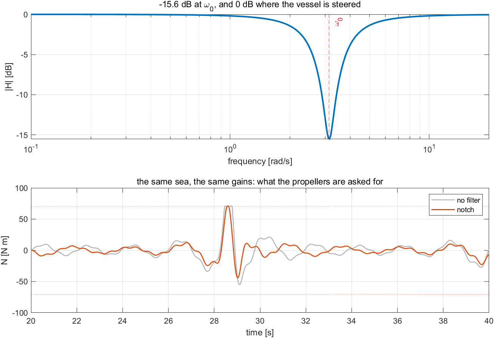
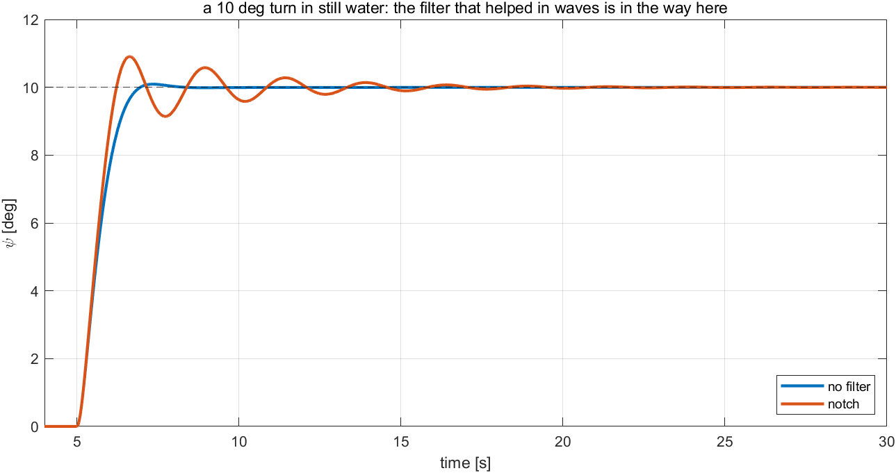
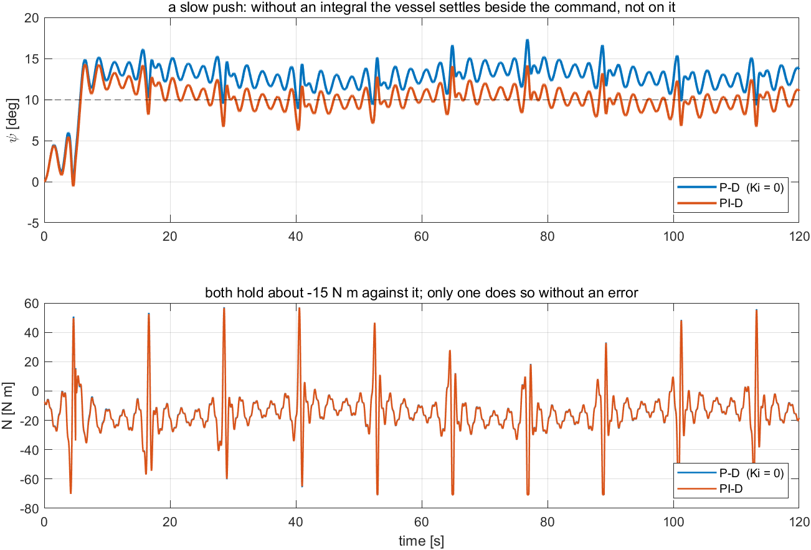

# Week 7 · Laboratory Problems — build the measurement path in Simulink

- Course: Sensor Signal Processing and Fusion · Department of Autonomous Vehicle System Engineering
- Time: **one hour**, immediately after the Week 7 lecture hour
- Three problems, in order.

---

## What this hour is for

Every week so far handed the controller a clean state. A real sensor reports what the vessel really does — including the part of it that is the sea.

This hour builds the path between the hull and the autopilot, and then asks the question that decides its shape: **which part of what is measured should be acted on?** Problem 1 removes what cannot be followed and measures what that saves. Problem 2 switches the sea off and measures what the same filter costs. Problem 3 adds a disturbance that is slow, shows that the filter passes it, and removes it with the one term Week 4 left out.

The autopilot's gains are **not touched** in any of the three. A sea is not answered by retuning.

---

## Before starting

```matlab
cd lectures/W07_simulink/problems
W07_P1_start                 % creates W07_P1.slx — the sea, the hull, nothing between
W07_check(1)                 % run this whenever, as often as needed
```

The solver is already set to fixed-step `ode4` at `h = 0.02` s. **Do not change it.**

> [!important] One requirement on every model
> **`flog`** — To Workspace, `Structure With Time`, carrying $[\,\psi_m\ ;\ \psi_f\ ;\ N\,]$: the measurement, **what the controller actually uses**, and the moment it asks for, in degrees, degrees and newton-metres.
>
> $\psi_f$ is logged because no outcome can say whether the filter is *in the loop*. A model can steer well with the notch built and never connected. With $\zeta_n = \zeta_d$ the checker requires $\psi_f = \psi_m$ **exactly**, and with the notch in it requires them to differ — which is a structural test, not a performance one.

The sea, the hull, the commanded heading, the slow disturbance and Week 6's allocation are all provided. The wave is one fixed realisation of a JONSWAP spectrum, so every student's sea is the same sea and the lecture's numbers are a fair pass mark.

> [!warning] The filter is switched off by a number, never by deleting a block
> Setting $\zeta_n = \zeta_d$ makes $H(s) = 1$ identically. The same model then reproduces the unfiltered one **exactly**, and the comparison is between two runs of one model rather than between two models that might differ elsewhere. The checker relies on this and tests it.

---

## Problem 1 · The measurement, and the notch (25 minutes)

**Build.** Three things, in this order.

$$
\psi_m = \psi + \psi_w, \qquad r_m = r + r_w
$$

$$
H(s) = \frac{s^2 + 2\zeta_n \omega_0 s + \omega_0^2}{s^2 + 2\zeta_d \omega_0 s + \omega_0^2},
\qquad \zeta_n < \zeta_d,
\qquad \lvert H(j\omega_0)\rvert = \frac{\zeta_n}{\zeta_d}
$$

$$
N = K_p\,\operatorname{ssa}(\psi_d - \psi_f) - K_d\,r_f, \qquad \lvert N\rvert \le N_{\max}
$$

| Symbol | Quantity | Value · source |
|---|---|---|
| $\omega_0$ | the peak frequency of the sea | $2\pi/T_0 = 3.14$ rad/s · §7-2 |
| $\zeta_n$, $\zeta_d$ | the depth and the width of the notch | $0.05$ and $0.30$ · §7-4 |
| $K_p$, $K_d$ | the heading gains | $300$, $100$ · Week 4, **unchanged** |

> [!important] Filter the rate as well as the heading
> The wave carries $11.64$ deg/s of yaw rate, which is as much as this vessel can produce. A notch on the heading alone leaves most of the problem in the loop, through the D term.

**Verify.** `W07_check(1)`. The same sea is flown twice, once with $\zeta_n = \zeta_d$ and once with $\zeta_n = 0.05$.

| What the checker expects | no filter | notch |
|---|---|---|
| heading std, $t > 20$ s | $1.551°$ | $1.042°$ |
| moment std, $t > 20$ s | $18.85$ N·m | $13.41$ N·m |
| $\psi_f$ against $\psi_m$ | identical, to $10^{-6}$ | visibly different |

**What a correct model produces**



| Reading the figure | |
|---|---|
| top, the dip | $-15.6$ dB at the marked $\omega_0$, which is $20\log_{10}(\zeta_n/\zeta_d)$ |
| top, away from the dip | back to $0$ dB on both sides: everything else is passed |
| bottom, grey against blue | the same sea and the same gains, a visibly quieter demand |
| bottom, the flat tops that remain | the notch attenuates by $-15.6$ dB; it does not delete |
| the check | if the heading std does not move, the filtered signals are built but not wired into the autopilot — look at the `what it filters` column |

**The point.** One filter, two numbers, and **every column improves at once**. Nothing was retuned: the vessel steers better because it is no longer being shaken.

---

## Problem 2 · What it costs (15 minutes)

**Build.** Nothing. Set `wave_on = 0` and give the same $10°$ step, once with $\zeta_n = \zeta_d$ and once with the notch.

**Predict before running.** The notch adds phase where it attenuates, and some of that phase reaches the frequency at which the vessel is steered. Decide, before looking, whether that will show up as overshoot, as settling time, or as both.

**Verify.** `W07_check(2)`.

| What the checker expects | no filter | notch |
|---|---|---|
| overshoot | $0.93\,\%$ | $9.07\,\%$ |
| settling | $1.72$ s | $7.76$ s |
| phase of $H$ at $1.6$ rad/s | $0.0°$ | $-18.5°$ |

**What a correct model produces**



| Reading the figure | |
|---|---|
| the two traces before the peak | almost the same, the notched one slightly **faster** |
| the peak of the notched trace | $9.07\,\%$ against $0.93\,\%$ |
| the tail of the notched trace | a long slow approach, $7.76$ s |
| the check | if the two traces coincide, `wave_on = 0` has switched off the filter rather than the sea |

**The point.** The filter that improved every column of Problem 1 makes this manoeuvre visibly worse, and **both are true at once**. Attenuation is bought with phase, and phase is what damping is made of — the same trade Week 2 §2-10 paid for the derivative, paid again here.

---

## Problem 3 · The slow part must not be filtered (20 minutes)

**Build.** One term, in the autopilot of Problem 1:

$$
u = K_p e + I - K_d r_f, \qquad N = \operatorname{sat}(u), \qquad I \leftarrow I + h\big(K_i e + K_b (N - u)\big)
$$

The back-calculation is Week 2 §2-11, unchanged.

**Predict before running.** A slow yaw moment of $15$ N·m is switched on. Work out, from $K_p = 300$, the heading error a P–D loop must hold in order to produce a counter-moment of that size — and then say why the integral does **not** wind up on the wave, which is far larger.

**Verify.** `W07_check(3)`. The window is $t > 60$ s, because the disturbance varies over $60$ s and a mean means nothing before one period has passed.

| What the checker expects | P–D ($K_i = 0$) | PI–D |
|---|---|---|
| mean heading error | $3.071°$ | $0.084°$ |
| mean moment | $-15.13$ N·m | $-15.13$ N·m |
| heading std | the same on both, to $0.06°$ |

That last row is the one worth reading twice: the integral removes the offset and **touches nothing else**.

**What a correct model produces**



| Reading the figure | |
|---|---|
| top, the P–D trace | riding $3°$ above the dashed command |
| top, the PI–D trace | on the command, with the same wave ripple |
| top, the ripple on both | the same size, $1.19°$: the integral does not touch the zero-mean part |
| bottom, both traces | around $-15$ N·m, following the slow variation |
| the two mean moments | identical to two decimals — the physics decides the moment, the controller decides who pays for it |
| the check | if the integral drifts away, the notch is filtering the slow push as well: check that $H$ is unity two decades below $\omega_0$ |

**The point.** The notch kept what the controller must act on and removed what it must not. **Filter what cannot be followed; integrate what must be opposed.** A filter that also removed the slow part would be the worst failure of this week — the vessel would be pushed off heading and the measurement would not show it.

---

## Marking

| | Weight | What is being marked |
|---|---|---|
| Problem 1 | 40 | `W07_check(1)` passes; the rate channel is filtered too, and the reason is stated |
| Problem 2 | 25 | `W07_check(2)` passes; the prediction about phase was written down **before** running |
| Problem 3 | 35 | `W07_check(3)` passes; the reason the wave does not wind up the integral is argued rather than quoted |

---

## If something goes wrong

| Symptom | Cause | Fix |
|---|---|---|
| `The model has no To Workspace block whose variable name is flog` | only the provided `xlog` is there | add the second log: three signals, `Structure With Time` |
| `the notch removes nothing — is it wired?` | the filtered signals were built but the autopilot still reads $\psi_m$ | wire $\psi_f$ and $r_f$ into the autopilot |
| The heading std barely moves | the notch is on the heading only | filter the rate as well: it carries $11.64$ deg/s |
| `zeta_n = zeta_d leaves it untouched` fails | the filter is not a pure $H(s)$ — an extra lag or gain has crept in | numerator and denominator must differ in one coefficient only |
| The vessel drifts off heading with a large steady error | the notch is attenuating the slow disturbance too | $\omega_0$ is wrong: check $2\pi/T_0$ |
| Problem 2's two runs are identical | `wave_on = 0` was set but $\zeta_n$ was not restored | the checker sets both; do not set them in the model |
| The integral runs away | no back-calculation, or $K_b$ has the wrong sign | $I \mathrel{+}= h(K_i e + K_b(N - u))$, with $K_b > 0$ |

Reference answers are in `../solutions/`. Read them **after** attempting the problem.
