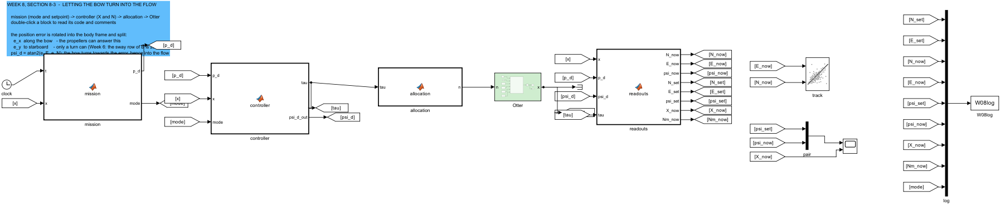
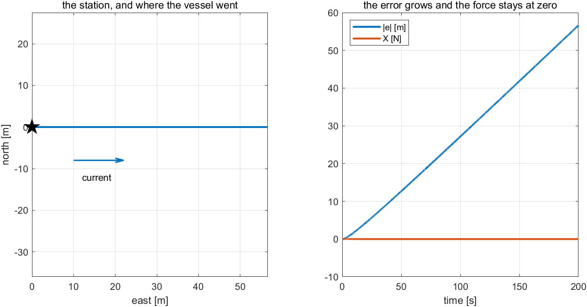
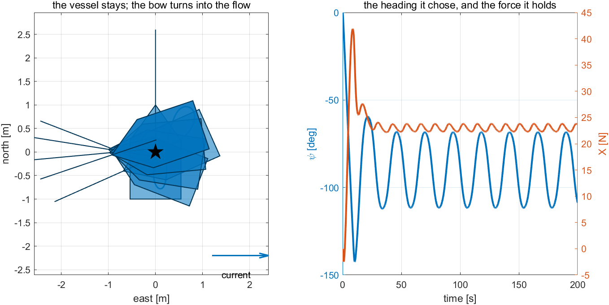
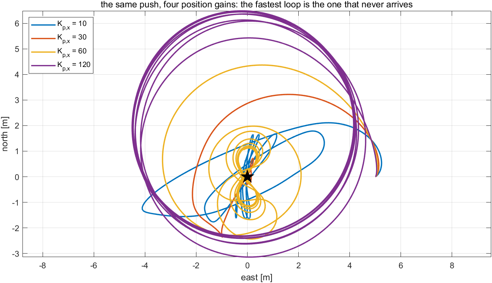
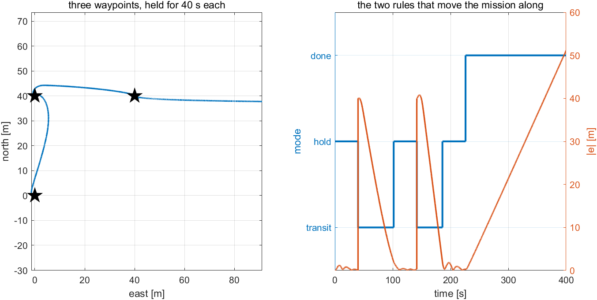

# Week 8 · Dynamic Positioning and Mission Integration

> [!important] Reference material — read this first
> <span style="font-size:0.88em">The five courses below are **taught by the instructor of this course** and are the assumed background for it. They run from the fundamentals down to the graduate material, so start wherever the gap is. Every frame, symbol and derivation used here is developed in them at length; anyone whose prerequisites are thin should work through them first, then return.</span>
>
> | # | Course | Level | Lang. | Video | Slides and code |
> |---|---|---|---|---|---|
> | 1 | **Control Engineering** (제어공학) — the foundation: transfer functions, feedback, stability, root locus, PID | undergraduate | KO | [playlist](https://youtube.com/playlist?list=PLFaUxNRM4BvJMpF9HZS-Mp8tDv9dTdglk) | [drive](https://drive.google.com/drive/folders/1TNIPDNtS_Iy8li-olka5WJslSXDYf0aT) |
> | 2 | **Control System Design** (제어시스템설계) — design rather than analysis: specifications, loop shaping, discrete implementation | undergraduate | KO | [playlist](https://youtube.com/playlist?list=PLFaUxNRM4BvIGroZ5rgn7x08F7C79d9WZ) | [drive](https://drive.google.com/drive/folders/11m5Xxl_PHJvxgHghLSP-jhCpmRpbvoXh) |
> | 3 | **Advanced Control Engineering** (제어공학특론) — reference frames, the 6-DOF equation of motion, rotation matrices and Euler angles, linearisation and trim, vehicle control design | graduate | EN | [playlist](https://youtube.com/playlist?list=PLFaUxNRM4BvJmvF2ljx4KM5dj1P5jEcw0) | [drive](https://drive.google.com/drive/folders/1GUxbbONl916lNd0ggnFnXrNwNkd13-2-) |
> | 4 | **Sensor Signal Processing and Fusion** (센서신호처리 및 융합) — sensor models, noise, estimation and multi-sensor fusion | graduate | EN | [playlist](https://youtube.com/playlist?list=PLFaUxNRM4BvK-aP2Gdoyp5-AWvMn7Fo8E) | [drive](https://drive.google.com/drive/folders/1MEVJP7TzMcm8w6TZwUjhWJtL34WeNY3u) |
> | 5 | **Capstone Design** (캡스톤디자인) — a vehicle project carried end to end | undergraduate | KO | [playlist](https://youtube.com/playlist?list=PLFaUxNRM4BvLu7L0pDoLzDXTv8mm6rCmj) | [drive](https://drive.google.com/drive/folders/1haIQejlJfrdhtOuof-MpffR9ydVscXZS) |
>
> <span style="font-size:0.88em">**Not fluent in MATLAB or Simulink yet? Do these before Part 2.** Every laboratory in this course is Simulink, and the Onramp courses are free and take a few hours each.</span>
>
> | Tool | Where to start |
> |---|---|
> | MATLAB | [MATLAB Onramp](https://matlabacademy.mathworks.com/kr/details/matlab-onramp/gettingstarted) · [Core MATLAB Skills](https://matlabacademy.mathworks.com/details/core-matlab-skills/lpmlcms) |
> | Simulink | [Simulink Onramp](https://matlabacademy.mathworks.com/kr/details/simulink-onramp/simulink) · instructor's Simulink lectures [part 1](https://youtu.be/a-afHg_fSaU) · [part 2](https://youtu.be/070Yn0Hw5a0) |


> [!tip] Getting the course files, and keeping them current (Windows)
> <span style="font-size:0.88em">The notes, models and scripts are kept in one Git repository that is updated through the semester. Clone it once; before every class, pull. A pull downloads only what has changed since the last one.</span>
>
> | When | Where to run it | Command |
> |---|---|---|
> | once | PowerShell — installs Git for Windows | `winget install --id Git.Git -e` |
> | once | the folder that will hold the course, e.g. `Documents` | `git clone https://github.com/wkyouncnu/Sensor-Signal-Processing-and-Fusion.git` |
> | before every class | inside the cloned folder `Sensor-Signal-Processing-and-Fusion` | `git pull` |
>
> - `git pull` prints `Already up to date.` when nothing has changed, and otherwise lists the files it updated.
> - The repository is private. When Git asks, sign in with the GitHub account the instructor has given access.
> - Experiment on copies, not on the cloned files: copy a week's `WXX_simulink` folder elsewhere first, and a pull can never collide with local edits. If it already has, `git stash`, then `git pull`, then `git stash pop` sets the edits aside, updates, and puts them back.
> - The MSS toolbox is not part of the repository. The weeks that simulate the Otter need it at `Tools\MSS` inside the cloned folder.


- **Course**: USV Guidance, Navigation and Control (Graduate)
- **Department**: Autonomous Vehicle System Engineering, Chungnam National University
- **This week**: ① what dynamic positioning asks for, and the one direction this hull cannot deliver ② the rule that gets round it: point the bow along the force that is needed ③ how fast the position loop may be, given that its output is a heading command ④ a mission that transits, holds and moves on, and what a change of mode costs

> [!important] Prerequisites from the previous week
> - From Week 6 §6-3: the sway row of $\mathbf{B}$ is zero. This week is what that costs, and what is done about it.
> - From Week 4: the heading autopilot, used unchanged as the inner loop.
> - From Week 5: waypoints and arriving at them; from Week 2 §2-13: a cascade needs its inner loop several times faster than its outer one.
> - From Week 2 §2-11: an integrator that keeps accumulating while it is not in charge.

---

## Learning Outcomes

Upon completion of this week, the learner is able to:

1. State the dynamic positioning problem as holding $(N, E, \psi)$, and say from the rank of $\mathbf{B}$ which part of it this hull can do.
2. Measure that a two-propeller craft on a fixed heading cannot hold station against a beam current, and explain why the controller is not at fault.
3. Derive the rule that makes station-keeping possible on such a craft — point the bow along the force the position loop asks for — and measure the heading it settles at.
4. Choose the position-loop gain from the cascade rule, and recognise the failure that follows from breaking it.
5. Write a mission as a state machine of two rules, and measure what a change of mode does to an integrator that was not reset.

## Prerequisites and Setup

| Item | Requirement |
|---|---|
| MATLAB | R2024b, with Simulink |
| MSS | `Tools/MSS`, found by `W08_0_setup` through `mss_path` |
| Course folder | `lectures/W08_simulink` |
| Models | **one per experiment** — `W08_C_fixed`, `W08_D_weathervane`, `W08_E_cascade`, `W08_F_mission` — all generated by `W08_1_build_dp`, never edited by hand |
| Time | lecture 40 min, laboratory 1 h 20 min |

---

# Part 1 · Principle and experiment, section by section

| Part of a section | What it holds |
|---|---|
| **What is observed** | the effect itself, with the numbers it produces |
| **What follows from it** | numbered lines, one step each, from the rank of $\mathbf{B}$ to the rule the block implements |
| **Experiment N-x** | the model, the commands, the output actually obtained, the figure, and a table that reads every feature of the figure back to **the numbered line that predicts it** |

## 8-0. Setting up (10 min)

```matlab
cd lectures/W08_simulink
W08_0_setup
W08_1_build_dp
```

Expected output:

```
  W08_0_setup
    station   hold (N, E) = (0, 0) m;  the current runs at 0.30 m/s towards 90 deg
    position  Kp_x = 30 N/m, Ki_x = 3, Kd_x = 60;  |X| <= 120 N
    heading   the Week 4 autopilot, Kp = 300, Kd = 100;  |N| <= 47.15 N m
    mission   3 waypoints, arrive within 2 m, hold 40 s at each

  built  W08_C_fixed.slx      (overlapping lines: 0)
  built  W08_D_weathervane.slx (overlapping lines: 0)
  built  W08_E_cascade.slx    (overlapping lines: 0)
  built  W08_F_mission.slx    (overlapping lines: 0)
```

- The disturbance of this week is the current of Week 1, at $0.3$ m/s. The sea of Week 7 is left off so that one effect is studied at a time; a real vessel would carry the notch of §7-4 as well.

## 8-1. What dynamic positioning asks for

This section answers: what is DP, and which part of it can this vessel do?

- **Dynamic positioning** is holding a vessel at a point and on a heading, against the environment, using thrusters alone — no anchors, no moorings. The three numbers to hold are $(N, E, \psi)$.
- The controller therefore has to produce three things: a force north, a force east, and a moment. Whether it can is decided by $\mathbf{B}$, and Week 6 §6-3 already answered it:

$$
\boldsymbol{\tau} = \mathbf{B}\mathbf{T},
\qquad
\mathbf{B} = \begin{bmatrix} 1 & 1 \\ 0 & 0 \\ y_{\text{pont}} & -y_{\text{pont}} \end{bmatrix},
\qquad \operatorname{rank}\mathbf{B} = 2
$$

| Quantity | Symbol | This hull |
|---|---|---|
| things to hold | $N$, $E$, $\psi$ | three |
| independent forces available | $\operatorname{rank}\mathbf{B}$ | **two**: along the bow, and a moment |
| the direction that is missing | the sway row | nothing can push sideways |

- A vessel with fewer independent actuators than degrees of freedom to hold is **underactuated**. The Otter is; a DP vessel with azimuth thrusters (Week 10) is not.
- **This does not make station-keeping impossible.** The force this hull can make is fixed in the **body** frame, and the body frame can be turned. §8-2 measures the failure, §8-3 the way round it.

### Experiment 8-1 · The chain, and where the position loop sits (5 min)

**What it measures.** Nothing yet: the four blocks are matched to the loops they implement.

**The canvas.** `W08_D_weathervane` — the fullest model of the week, read here and measured in Experiment 8-3.

**Opening and running.**

```matlab
W08_0_setup
open_system('W08_D_weathervane')   % Run — XY 그래프에 항적, Scope 에 선수각과 힘
```



| In the figure | Meaning |
|---|---|
| `mission` | which station to hold and in which mode; in §8-5 it becomes a state machine |
| `controller` | the position loop **and** the Week 4 heading loop, in one commented block |
| `allocation` | Week 6, now receiving a surge force that varies as well as a moment |
| green `Otter` | the vessel, with the current given to it as a velocity (Week 1 §1-13) |
| XY Graph, Scope | the track, and the heading against the force |

- Double-click `controller`: the four numbered steps are §8-2 to §8-4.

## 8-2. The direction it cannot hold

This section answers: what happens when a two-propeller craft is asked to hold station against a beam current?

**What is observed.** Experiment 8-2 fixes the heading north and switches on a $0.3$ m/s current running east:

- the vessel is carried east — $12.68$ m at $50$ s, $27.16$ m at $100$ s, $56.64$ m at $200$ s, with no sign of stopping,
- and the surge force stays at $0.0$ N throughout.

**What follows from it, one line at a time.**

1. The position error is a vector in NED. Rotated into the body frame it splits into a part **along the bow**, $e_x$, and a part **across it**, $e_y$.
2. The propellers can answer only the first: the force this hull makes is $X$ along the bow, by §8-1.
3. Here the error is entirely across the bow — the current pushes east and the bow points north — so $e_x = 0$ and the controller, correctly, asks for nothing. **The $0.0$ N is not a fault; it is the answer to an impossible request.**
4. Nothing in the error is ever converted into something the vessel can act on, so the error grows without bound: $0.3$ m/s of current is $18$ m every minute.
5. The heading loop meanwhile works perfectly, holding north to a tenth of a degree. **A loop can be correct, verified, and useless**, if what it can produce is perpendicular to what is needed.
6. The way out cannot be a better gain. It has to change **which direction the available force points** — that is, the heading.

### Experiment 8-2 · A fixed heading in a beam current (10 min)

**What it measures.** Lines 3 and 4: the error growing without limit while the force stays at zero.

**The model.** `W08_C_fixed` — the position loop with the heading held at `psi_fix`. Everything else is the model of §8-3.

**Opening and running.**

```matlab
W08_0_setup
open_system('W08_C_fixed')      % Run — XY 그래프에서 배가 동쪽으로 흘러간다
psi_fix = 90;                   % Run — 뱃머리를 조류와 나란히: 이제 붙잡는다
psi_fix = 0;
W08_C_the_direction_it_cannot_hold
```

Expected output:

```
  W08 Experiment 8-2  a fixed heading in a 0.30 m/s current towards 90 deg
    t [s]      N [m]     E [m]    |e| [m]   psi [deg]    X [N]
        0       0.00      0.00       0.00         0.0      0.0
       50      -0.00     12.68      12.68        -0.0      0.0
      100      -0.00     27.16      27.16        -0.0      0.0
      200      -0.00     56.64      56.64        -0.0      0.0
```



**Reading the figure against the derivation.**

| Where to look | What is there | Which line predicts it |
|---|---|---|
| left panel, the track | a straight line east from the station | line 4: nothing opposes the current |
| left panel, the heading | north throughout | line 5: the heading loop is doing its job |
| right panel, the error | growing at about $0.28$ m/s | line 4: the current, less a little drag |
| right panel, the force | flat on zero | line 3: the request is perpendicular to what the hull can make |

**What the figure says**

- The controller is not failing. It is answering the only question it can answer, and the answer is zero.

| What to try | What to watch |
|---|---|
| `psi_fix = 90;` Run | pointing east, along the current: now the error **is** along the bow, and the vessel holds station. The fixed heading was not wrong, it was wrongly **chosen** |
| `beta_c = 0;` (a current from astern) with `psi_fix = 0` | the same conclusion the other way: with the flow along the bow the hull can hold, whatever the gain |

> [!tip] In class
> - **Purpose** — make underactuation something the class watches happen, rather than a property of a matrix.
> - **Point to** — the force trace at zero while the error grows.
> - **Ask** — "Would a larger gain help?" No: the gain multiplies a component that is zero.
> - **Take away** — a force fixed in the body frame can only answer errors that lie along it.

## 8-3. Pointing the bow along the force

This section answers: how does an underactuated craft hold station at all?

**What is observed.** Experiment 8-3 changes one thing — the heading is no longer fixed:

- the error settles at $0.193$ m on average, never exceeding $0.294$ m,
- the bow settles at $-90.6°$, pointing into the oncoming flow,
- and the surge force settles at $23.0$ N, against the $0.3/0.01289 = 23.3$ N of drag the current produces.

**What follows from it, one line at a time.**

1. Write the position loop as a PID in **NED**, producing the force the vessel would need if it could push in any direction:
$$
\mathbf{f} = K_{p,x}\,\mathbf{e} + K_{i,x}\!\int\!\mathbf{e}\,\mathrm{d}t - K_{d,x}\,\mathbf{v},
\qquad \mathbf{e} = \mathbf{p}_d - \mathbf{p}
$$
2. The hull can make that force only if the bow points along it (§8-2 line 2). So **the heading command is the direction of $\mathbf{f}$**:
$$
\psi_d = \operatorname{atan2}(f_E,\ f_N)
$$
3. What actually reaches the water is the projection of $\mathbf{f}$ on the bow, $X = f_N\cos\psi + f_E\sin\psi$. The part across the bow is lost — but once the heading has converged, there is none left to lose.
4. **The integral is what makes it settle.** A steady current needs a steady force; the integral learns it, and once it dominates $\mathbf{f}$, the direction of $\mathbf{f}$ stops moving and so does $\psi_d$.
5. That direction is **upstream**: the force needed to stand still in a flow opposes the flow. The measured $-90.6°$ against a current running towards $90°$ is exactly that. The vessel has **weathervaned**.
6. The residual $0.193$ m is what the P and D terms need to keep the integral company; it is not drift, and it does not grow.
7. **Below a threshold the direction of $\mathbf{f}$ means nothing.** When $\lvert\mathbf{f}\rvert$ is small the block holds the last heading, which is `e_min` in the code — without it the bow would chase numerical noise.

### Experiment 8-3 · The bow set free (12 min)

**What it measures.** Lines 4 to 6: that the station is held, where the bow settles, and that the force it holds is the drag.

**The model.** `W08_D_weathervane` — the same loop as §8-2 with $\psi_d$ taken from the direction of $\mathbf{f}$ instead of fixed.

**Opening and running.**

```matlab
W08_0_setup
open_system('W08_D_weathervane')   % Run — 뱃머리가 조류 쪽으로 돌아 선다
V_c = 0.5;                         % Run — 더 센 조류: 같은 방향, 더 큰 힘
V_c = 0.3; beta_c = 0;             % Run — 북쪽으로 흐르는 조류: 뱃머리는 남쪽을 본다
W08_D_weathervaning
```

Expected output:

```
  W08 Experiment 8-3  the bow set free, in the same current
    over the last 50 s:  |e| mean 0.193 m, max 0.294 m
    the bow settles at -90.6 deg;  the current runs towards 90 deg
    surge force 23.0 N;  the drag at 0.30 m/s is 23.3 N
```



**Reading the figure against the derivation.**

| Where to look | What is there | Which line predicts it |
|---|---|---|
| left panel, the track | a small knot around the station, not a line | lines 4 and 6: it settles, and stays |
| left panel, the hulls | all pointing the same way, into the flow | line 5: the direction of $\mathbf{f}$ is upstream |
| right panel, the heading | turning once, early, then flat at $-90.6°$ | line 4: the integral takes over and stops the command moving |
| right panel, the force | rising to $23.0$ N and staying | line 3 with Week 1: that is the drag at $0.3$ m/s |
| the $0.193$ m of error | small, and not growing | line 6: the error the P and D terms keep |

**What the figure says**

- The same hull, the same gains and the same current: only the heading was allowed to move, and the drift became a station.

| What to try | What to watch |
|---|---|
| `V_c = 0.5;` Run | the bow holds the same direction and the force rises to about $39$ N — the drag at $0.5$ m/s. The **direction** comes from the flow, the **size** from its speed |
| `beta_c = 0;` (a current towards the north) | the bow settles pointing south: line 5 again, in another direction |

> [!tip] In class
> - **Purpose** — one rule, derived rather than adopted: the bow follows the force, not the error.
> - **Point to** — the hulls in the left panel, all aligned, and the heading trace going flat.
> - **Ask** — "What told the vessel where the current came from?" Nothing did: the integral learned the force needed, and the bow followed it.
> - **Take away** — an underactuated craft holds station by turning the direction it can push into the direction it must push.

## 8-4. How fast the position loop may be

This section answers: the position loop commands a heading — what does that imply for its gain?

**What is observed.** Experiment 8-4 pushes the vessel $5$ m off station, sideways, and sweeps $K_{p,x}$:

| $K_{p,x}$ | back within 1 m [s] | $\lvert e\rvert$ over the last 50 s [m] | $\psi$ std [deg] | total turn [deg] |
|---|---|---|---|---|
| 10 | 32.1 | 0.950 | 37.08 | 1211 |
| **30** | **30.3** | **0.192** | **15.96** | **1020** |
| 60 | 43.0 | 0.753 | 48.35 | 2818 |
| 120 | never | 4.513 | 197.36 | 2734 |

**What follows from it, one line at a time.**

1. This is a **cascade**: the position loop's output is not a force but a **heading command**, which the Week 4 loop then has to follow. Week 2 §2-13 requires the inner loop to be several times faster than the outer one.
2. The inner loop's speed is fixed: Week 4 settles a $10°$ turn in about $1.7$ s, so its bandwidth is near $1.6$ rad/s.
3. Raising $K_{p,x}$ makes $\mathbf{f}$ — and therefore $\psi_d$ — respond faster to position error. Past a point the command moves faster than the bow can follow.
4. Then the vessel is always turning towards a direction that has already changed: at $K_{p,x} = 120$ the heading standard deviation is $197°$, the vessel turns through $2734°$ in 200 s, and it **never gets back** within a metre.
5. Too small a gain is a different failure, and a milder one: at $K_{p,x} = 10$ the vessel returns but sits $0.950$ m off, because $\mathbf{f}$ is too weak to hold the bow steadily upstream.
6. $K_{p,x} = 30$ is the choice, and the table is the reason. Note that **the best gain is not the fastest one**: the column that decides is the error it holds afterwards, not the time to get there.

### Experiment 8-4 · Four position gains (12 min)

**What it measures.** Lines 4 to 6: what each gain does to the recovery, to the error it settles at, and to how much the vessel turns.

**The model.** `W08_E_cascade` — the model of §8-3 again, here as the model the gain is **chosen** on.

**Opening and running.**

```matlab
W08_0_setup
x0 = zeros(12,1); x0(8) = 5;       % 자리에서 동쪽으로 5 m / 5 m east of the station
open_system('W08_E_cascade')       % Run — Kp_x = 30
Kp_x = 120;                        % Run — 배가 제자리에서 돈다 / the vessel spins
Kp_x = 30;
W08_E_cascade_gains                % 네 게인을 한 번에 / all four gains at once
```

Expected output:

```
  W08 Experiment 8-4  pushed 5 m off station, sideways
    Kp_x   back within 1 m [s]   |e| mean last 50 s   psi std [deg]   total turn [deg]
      10               32.1              0.950 m          37.08             1211
      30               30.3              0.192 m          15.96             1020
      60               43.0              0.753 m          48.35             2818
     120                Inf              4.513 m         197.36             2734
```



**Reading the figure against the derivation.**

| Where to look | What is there | Which line predicts it |
|---|---|---|
| the $K_{p,x} = 30$ track | a short loop back to the station | line 6: the chosen gain |
| the $K_{p,x} = 120$ track | a tangle that never closes | line 4: the command outruns the bow |
| the `psi std` column | $15.96°$ against $197.36°$ | line 4: the heading never settles at the high gain |
| the `total turn` column | $1020°$ against $2734°$ | line 4: turning is what the extra gain buys |
| the $K_{p,x} = 10$ row | back in time, but $0.950$ m off | line 5: the other failure, and the milder one |

**What the figure says**

- On an underactuated vessel the position gain is limited by how fast the **heading** loop is, not by the position loop's own stability.

| What to try | What to watch |
|---|---|
| `Kp_x = 120; Kd = 300;` Run | a faster heading loop makes the high position gain workable again: it is the **ratio** that matters, which is the cascade rule |
| `Kp_x = 30; Ki_x = 0;` Run | the vessel returns and then drifts off again: without the integral there is no steady force to point the bow by (§8-3 line 4) |

> [!tip] In class
> - **Purpose** — show a cascade rule failing in a way that looks like a mechanical fault.
> - **Point to** — the $K_{p,x} = 120$ track, and the turn column beside it.
> - **Ask** — "Why does a faster position loop make the vessel turn more?" Its output is a heading command; faster means it changes its mind sooner.
> - **Take away** — when the outer loop commands the inner loop's setpoint, the outer loop must be the slower one.

## 8-5. A mission: transit, hold, transit

This section answers: how are the transit of Week 5 and the hold of this week put in one vessel?

**What is observed.** Experiment 8-5 gives the vessel three waypoints, each to be held for $40$ s:

- the modes run `hold → transit → hold → transit → hold → done`, changing at $40.0$, $101.7$, $141.7$, $186.0$ and $226.0$ s,
- each hold keeps the station to $0.42$–$0.76$ m on average, worse than §8-3's $0.193$ m,
- and if the integral is **not** reset when the mode changes, the first force of a hold saturates at $120$ N and the error opens to $25.6$ m.

**What follows from it, one line at a time.**

1. A mission is a **state machine**. This one has two rules and needs nothing else: in transit and inside $R_{\text{arrive}}$, switch to hold and start the clock; in hold and past $T_{\text{hold}}$, take the next waypoint and switch to transit.
2. The two modes want different things from the same actuators: transit wants a constant push and a heading towards the waypoint, hold wants the force of §8-3 and the heading that goes with it.
3. So the controller is one block with a switch in it, not two controllers. What changes at a mode boundary is which lines of that block run.
4. **The holds are worse than §8-3's** because the vessel arrives with way on: it has $0.5$ m/s to take off before it can settle, inside a $2$ m radius. Arriving slowly, or shrinking $R_{\text{arrive}}$, would trade mission time for station accuracy.
5. **The integrator is the thing that does not respect modes.** In transit the position error is tens of metres, and an integrator left running accumulates all of it. When the hold begins it demands what it has stored — $120$ N, the limit — and throws the vessel $25$ m past the station before it unwinds.
6. Handing over cleanly is therefore part of the mission logic, not an afterthought: **a controller that is not in charge must not integrate.** In these models that is `hand_over`, one line in the block.

### Experiment 8-5 · The mission, and the handover (15 min)

**What it measures.** Lines 1, 4 and 5: the timeline the two rules produce, the station-keeping of each hold, and what the integral does across a mode change.

**The model.** `W08_F_mission` — the `mission` block becomes a state machine, and the `controller` block gains the transit branch.

**Opening and running.**

```matlab
W08_0_setup
T_final = 400;
open_system('W08_F_mission')    % Run — XY 그래프에 세 지점, Scope 에 모드가 바뀌는 순간
hand_over = 0;                  % Run — 유지로 들어가는 순간 배가 튄다 / the vessel is thrown
hand_over = 1;
W08_F_the_mission               % 시간표와 넘겨받기의 값 / the timeline, and what the handover is worth
```

Expected output:

```
  W08 Experiment 8-5  the mission
    t =   40.0 s   hold    -> transit   at (N   0.01, E  -0.00)
    t =  101.7 s   transit -> hold      at (N  40.19, E   1.99)
    t =  141.7 s   hold    -> transit   at (N  39.71, E   0.00)
    t =  186.0 s   transit -> hold      at (N  40.83, E  38.20)
    t =  226.0 s   hold    -> done      at (N  39.73, E  39.96)
    hold at waypoint 1: |e| mean 0.48 m, max 1.20 m over 40 s
    hold at waypoint 2: |e| mean 0.42 m, max 2.00 m over 40 s
    hold at waypoint 3: |e| mean 0.76 m, max 1.98 m over 40 s

    hand_over   peak |X| in the first 10 s of the second hold   |e| over that hold
           1                                  43.3 N              0.420 m
           0                                 120.0 N             25.626 m
```



**Reading the figure against the derivation.**

| Where to look | What is there | Which line predicts it |
|---|---|---|
| left panel, the track | straight runs between knots at the waypoints | line 2: two modes, two behaviours |
| right panel, the mode staircase | five changes, alternating, ending in `done` | line 1: the two rules, and nothing else |
| right panel, the error | falling into each hold and rising in each transit | line 4: the error is only meaningful in a hold |
| the three hold rows | $0.42$ to $0.76$ m against §8-3's $0.193$ m | line 4: the vessel arrives with way on |
| the two `hand_over` rows | $43.3$ N against $120$ N, $0.420$ m against $25.626$ m | line 5: an integrator that ran while it was not in charge |

**What the figure says**

- Integration is where a controller that works and a mission that works stop being the same thing.

| What to try | What to watch |
|---|---|
| `R_arrive = 0.5;` Run | the vessel must arrive far more accurately before it may hold, so the transits take longer and the holds start closer — line 4's trade, measured |
| `T_hold = 10;` Run | the mission finishes sooner, and each hold is worse: $40$ s was mostly spent settling |

> [!tip] In class
> - **Purpose** — put the whole course in one model, and show that the new failures are in the seams.
> - **Point to** — the mode staircase beside the error trace, and then the two handover rows.
> - **Ask** — "Which of this week's numbers would a survey customer read?" The hold error; and it is set by how the vessel arrives, not by the position loop.
> - **Take away** — a mission is two rules and one careful handover.

---

# Part 2 · Laboratory run order

| Experiment | Model | Script | What it shows |
|---|---|---|---|
| 8-0 | all of them | `W08_0_setup`, `W08_1_build_dp` | the parameters, and every model written from code |
| 8-1 | `W08_D_weathervane` | — | the chain, and where the position loop sits |
| 8-2 | `W08_C_fixed` | `W08_C_the_direction_it_cannot_hold` | a fixed heading in a beam current |
| 8-3 | `W08_D_weathervane` | `W08_D_weathervaning` | the bow set free, and the station held |
| 8-4 | `W08_E_cascade` | `W08_E_cascade_gains` | four position gains, and the cascade rule |
| 8-5 | `W08_F_mission` | `W08_F_the_mission` | the mission, and the handover |

- The scripts only repeat what Run already shows, for several settings at once, and print the numbers quoted in Part 1.

---

# Summary

## Week Summary

| Step | What was done | How it was verified |
|---|---|---|
| 1 | stated DP, and read the rank of $\mathbf{B}$ against it | `verify_w08_dp` check 2: rank 2, sway row zero |
| 2 | measured what underactuation costs | Experiment 8-2: $56.64$ m of drift in 200 s with $X = 0.0$ N; check 3 |
| 3 | derived the rule that gets round it | Experiment 8-3: $0.193$ m held, bow at $-90.6°$, force $23.0$ N against a drag of $23.3$ N; check 4 |
| 4 | chose the position gain from the cascade rule | Experiment 8-4: $K_{p,x} = 30$; at $120$ the vessel turns $2734°$ and never returns |
| 5 | wrote the mission as two rules | Experiment 8-5: five mode changes in the right order, holds of exactly $40$ s; check 5 |
| 6 | measured the cost of a careless handover | Experiment 8-5: $120$ N and $25.6$ m against $43.3$ N and $0.42$ m |

## Progress Check

> [!important] Minimum condition for following Week 9

### Theory

- [ ] Able to say, from the rank of $\mathbf{B}$, which part of DP this hull can do.
- [ ] Able to explain why the surge force stays at zero in §8-2 without the controller being at fault.
- [ ] Able to derive $\psi_d = \operatorname{atan2}(f_E, f_N)$ and say why the integral is what makes it settle.
- [ ] Able to state the cascade rule and the failure that follows from breaking it.
- [ ] Able to say what must happen to an integrator when a mission changes mode.

### Laboratory

- [ ] `W08_1_build_dp` ran and every model reported `overlapping lines: 0`.
- [ ] `verify_w08_dp` printed `ALL CHECKS PASSED`.
- [ ] A gain or a mission parameter was changed in the Command Window and the model's XY Graph showed the new result.

### Recorded observations

- [ ] The drift and the surge force after 200 s on a fixed heading.
- [ ] The heading and the force the vessel settles at when the bow is free.
- [ ] The position gain at which the vessel stops returning to station.
- [ ] The peak force of the first hold, with and without the handover.

## Assignment 8

### ① Requirements

1. Repeat Experiment 8-3 with the sea of Week 7 switched on (bring `wave_train` and the notch across), and report the station-keeping error with and without the notch.
2. Find the current speed at which this vessel can no longer hold station, by measurement, and compare it with the speed the thrust limit predicts, $X_{\max}\,K_u$.
3. Make the arrival into a hold gentler: slow the vessel down inside $2\,R_{\text{arrive}}$ during transit, and report the hold error against the mission time, for three deceleration distances.

### ② Verification — mandatory

- `verify_w08_dp` prints `ALL CHECKS PASSED`.
- Every station-keeping number is reported over a stated window, as Part 1 does (the last 50 s).
- The current limit of ② is reported both ways: measured, and from $X_{\max}\,K_u$.

### ③ Analysis (5–10 lines)

- Weathervaning gives up the heading in order to keep the position. Name a mission for which that trade is unacceptable, and say what would have to change on the vessel — with reference to the rank of $\mathbf{B}$ — for it to hold both.

### Grading

| Item | Points |
|---|---|
| station-keeping in a seaway, with and without the notch | 30 |
| the current limit, measured and predicted | 25 |
| the gentler arrival, three distances | 25 |
| the analysis | 20 |

## Troubleshooting

| Symptom | Cause | Fix |
|---|---|---|
| the vessel drifts away with the force at zero | the heading is fixed across the needed force | that is §8-2; set the bow free (§8-3) |
| the vessel turns continually and never settles | the position gain outruns the heading loop | lower `Kp_x`, or raise `Kd` — §8-4 |
| the hold begins with a violent lurch | `hand_over = 0`: the transit integral is still there | `hand_over = 1` (§8-5) |
| the bow wanders slowly while on station | `e_min` too small: the block is steering by a force that is nearly zero | raise `e_min` |
| the mission never leaves the first waypoint | `R_arrive` smaller than the error the vessel can achieve on arrival | raise `R_arrive`, or slow the approach |

## References

### Primary

- Fossen, T. I. *Handbook of Marine Craft Hydrodynamics and Motion Control*, 2nd ed. The dynamic positioning chapter, for the three-degree-of-freedom problem this week solves two of; and §11.2 for the allocation used here.
- Fossen, T. I. and Strand, J. P. (2001). Nonlinear passive weather optimal positioning control (WOPC) system for ships and rigs. *Automatica* **37**(5), 701–715. DOI 10.1016/S0005-1098(01)00006-1. Weathervaning as a control objective rather than as a consequence.
- MSS toolbox — `demoOtterUSVPathFollowingHeadingControl.slx`, the demonstration whose structure the models of Weeks 5 to 8 follow.

### In this course

- Week 6 §6-3 — the rank of $\mathbf{B}$, which is where this week begins.
- Week 4 — the heading autopilot used unchanged as the inner loop.
- Week 2 §2-13 — the cascade rule §8-4 measures, and §2-11 — the windup §8-5 meets again, now across a mode change.
- Week 1 §1-13 — the current, given to the vessel as a velocity.

## Next Week

Week 9 closes the main course: the eight weeks are put together as one vessel and one mission, and what each week contributed is read off a single run.
