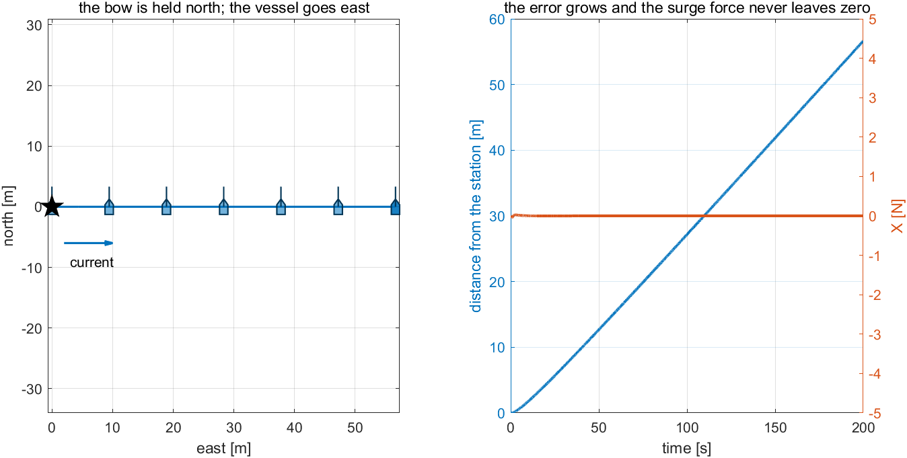
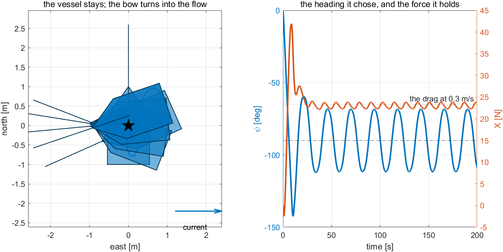
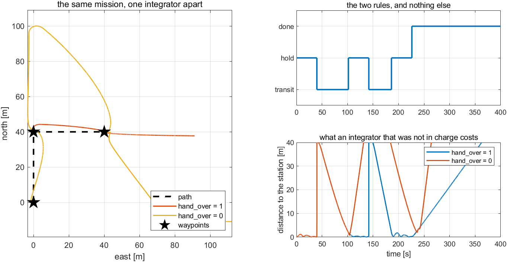

# Week 8 · Laboratory Problems — build the position controller in Simulink

- Course: Sensor Signal Processing and Fusion · Department of Autonomous Vehicle System Engineering
- Time: **one hour**, immediately after the Week 8 lecture hour
- Three problems, in order.

---

## What this hour is for

Week 6 §6-3 established that the sway row of $\mathbf{B}$ is zero: this hull cannot push sideways. This hour is what that costs, and what is done about it.

Problem 1 builds a position controller that is **correct** and watches it fail — the force it asks for is right, the whole time, and none of it can be delivered. Problem 2 changes one line and the same vessel holds station in the same current. Problem 3 gives it three waypoints and meets the failure that only appears when a working controller is put inside a mission.

---

## Before starting

```matlab
cd lectures/W08_simulink/problems
W08_P1_start                 % creates W08_P1.slx — the mission, the hull, nothing between
W08_check(1)                 % run this whenever, as often as needed
```

The solver is already set to fixed-step `ode4` at `h = 0.02` s. **Do not change it.**

> [!important] One requirement on every model
> **`dlog`** — To Workspace, `Structure With Time`, carrying $[\,\psi_d\ ;\ X\ ;\ N\,]$: the heading **the controller commands**, in degrees, and the two demands it makes, in newtons and newton-metres.
>
> $\psi_d$ is logged because Problem 2 is about a heading the controller **chooses**, and a vessel can end up pointing into a current for reasons that have nothing to do with the rule under test. The checker compares the command with the heading actually reached, which no position measurement could do.

The mission logic, Week 6's allocation and the hull are provided. `mlog` carries $[\,N_d\ ;\ E_d\ ;\ \text{mode}\,]$ — what the mission asked for — and `xlog` the twelve states.

---

## Problem 1 · The direction it cannot hold (20 minutes)

**Build.** A PID on the position error, **in both north and east**, and then the only part of it that can reach the propellers.

$$
f_N = K_{p,x} e_N + I_N - K_{d,x} v_N,
\qquad
f_E = K_{p,x} e_E + I_E - K_{d,x} v_E
$$

$$
X = f_N\cos\psi + f_E\sin\psi, \qquad \psi_d = \psi_{\text{fix}}
$$

| Symbol | Quantity | Value · source |
|---|---|---|
| $K_{p,x}$, $K_{i,x}$, $K_{d,x}$ | the position gains | $30$ N/m, $3$, $60$ · §8-4 |
| $v_N$, $v_E$ | the velocity **in NED** | m/s · $u\cos\psi - v\sin\psi$ and $u\sin\psi + v\cos\psi$ |
| $\psi_{\text{fix}}$ | the heading this problem holds | $0°$, due north |
| $V_c$, $\beta_c$ | the current | $0.3$ m/s towards $90°$ · Week 1 §1-13 |

The integral needs the anti-windup of Week 2 §2-11: accumulate only while $\lvert X\rvert$ is inside its limit.

> [!note] $X$ is a projection, not a choice
> The position loop asks for a force in a direction. The propellers can produce force in **one** direction — along the bow. What reaches them is therefore $\mathbf{f}$ projected onto the bow, and the component across it is not weakened or delayed: it is unavailable.

**Predict before running.** The current runs east; the vessel is asked to hold a station; the bow is held north. Work out which way $\mathbf{f}$ will point once the integral has settled, and then what its projection on a northward bow will be.

**Verify.** `W08_check(1)`.

| What the checker expects, after $200$ s | |
|---|---|
| distance from the station | $56.64$ m |
| the largest surge force ever asked of it | $0$ N |
| the heading | never moves |

**What a correct model produces**



| Reading the figure | |
|---|---|
| left | the hulls all point north while the track runs east |
| right, the error | rising without limit; nothing arrests it |
| right, the force | flat on zero for the whole run |
| the check | if $X$ is large and the vessel still drifts, the projection has been written with $\sin$ and $\cos$ exchanged |

**The point.** Nothing here is a fault of the controller, and no gain will repair it. The loop asks for a force to the west, correctly and continuously; its projection on a northward bow is zero; and the sway row of $\mathbf{B}$ is zero, so no pair of shaft speeds can produce what is missing. **This is underactuation, not bad tuning** — and the failure looks exactly like bad tuning, which is why it is worth building.

---

## Problem 2 · Point the bow along the force (20 minutes)

**Build.** One line, replacing $\psi_d = \psi_{\text{fix}}$:

$$
\psi_d = \operatorname{atan2}(f_E,\ f_N) \quad\text{while } \lVert\mathbf{f}\rVert > e_{\min}
$$

and then Week 4's autopilot, **gains unchanged**:

$$
N = K_p\,\operatorname{ssa}(\psi_d - \psi) - K_d\,r, \qquad \lvert N\rvert \le N_{\max}
$$

> [!warning] Hold the last heading when the force is small
> Near the station $\mathbf{f}$ is almost zero and its direction means nothing: $\operatorname{atan2}$ of two numbers that are both noise is noise. Below $e_{\min} = 0.3$ N, keep the heading the rule last produced.

**Predict before running.** The integral will settle on a force that exactly opposes the current. Say, before running, which way the bow will end up pointing and how large $X$ will be — the drag of this hull at $0.3$ m/s is $0.3/0.012894$ N.

**Verify.** `W08_check(2)`, over the last $50$ s.

| What the checker expects | |
|---|---|
| distance from the station | $0.193$ m |
| the heading it settles at | $-90.6°$ |
| the surge force it holds | $23.0$ N, against a drag of $23.3$ N |
| the heading error | $0$ — the bow really did follow the command |

**What a correct model produces**



| Reading the figure | |
|---|---|
| left | the vessel stays on the star while the hulls swing round to face the flow |
| right, $\psi$ | settling onto the dashed $-90°$, which is **into** a current running towards $+90°$ |
| right, $X$ | settling onto the dotted drag line |
| the check | if the bow spins slowly and never settles, $e_{\min}$ is too small and the rule is steering by a force that is almost zero |

**The point.** The same current, the same gains, and the station is held. **Nothing was added to the position loop.** The integral learned an upstream force and the bow was allowed to follow it — and that the force it settles on equals the drag at $0.3$ m/s is the check that the vessel is doing physics rather than merely holding still.

This is weathervaning, and it buys position by giving up heading. A mission that needs both would need a different hull, and §6-3 says exactly which row of $\mathbf{B}$ would have to stop being zero.

---

## Problem 3 · The mission, and the handover (20 minutes)

**Build.** Two conditions, in the controller of Problem 2.

- In transit (`mode == 1`): push with a constant $X_{\text{ff}} = 60$ N and aim the bow at the waypoint, $\psi_d = \operatorname{atan2}(e_E, e_N)$.
- At a change of mode, **empty the position integrals** — that is `hand_over`.

**Predict before running.** During a transit the position error is tens of metres and the integral is accumulating all of it. Work out what $I_N$ would demand at the instant a hold begins, and compare it with $X_{\max} = 120$ N.

**Verify.** `W08_check(3)`. Three waypoints, $40$ s at each, flown twice.

| What the checker expects | |
|---|---|
| the modes | five changes, alternating, ending in `done` |
| each hold | exactly $40$ s |
| `hand_over = 1` | peak $\lvert X\rvert$ of $43.3$ N in the first $10$ s of the second hold; that hold keeps $0.420$ m |
| `hand_over = 0` | $120.0$ N — the limit — and $25.626$ m |

**What a correct model produces**



| Reading the figure | |
|---|---|
| left, the orange track | straight runs between knots at the waypoints |
| left, the yellow track | the same controller, thrown $60$ m past the first station and $70$ m past the second |
| top right | five changes, alternating, and then `done`: the two rules and nothing else |
| bottom right | the error falling into each hold and rising in each transit, on one trace only |
| the check | if the modes never leave `hold`, the transit branch is not reading `mode` |

**The point.** **The integrator is the one state that does not respect modes.** Everything else in the controller is a function of the present error; the integral is a memory, and when the mode changes it is a memory of a situation that has ended. It demands what it stored — the limit — and throws the vessel past the station before it unwinds.

A controller that is not in charge must not integrate. **Integration is where a controller that works and a mission that works stop being the same thing.**

---

## Marking

| | Weight | What is being marked |
|---|---|---|
| Problem 1 | 30 | `W08_check(1)` passes; the sentence "this is underactuation, not bad tuning" is argued from the rank of $\mathbf{B}$ |
| Problem 2 | 35 | `W08_check(2)` passes; the settling heading and the drag force were predicted **before** running |
| Problem 3 | 35 | `W08_check(3)` passes; the size of the demand a carried-over integral makes was worked out before it was measured |

---

## If something goes wrong

| Symptom | Cause | Fix |
|---|---|---|
| `The model has no To Workspace block whose variable name is dlog` | only the provided logs are there | add the third: three signals, `Structure With Time` |
| The vessel drifts away with $X$ large | $\sin$ and $\cos$ exchanged in the projection | $X = f_N\cos\psi + f_E\sin\psi$ |
| The vessel drifts away with $X$ at zero | that is Problem 1, and it is the correct answer | set the bow free — Problem 2 |
| The bow wanders slowly on station | $e_{\min}$ too small: steering by a force that is nearly zero | raise it, or hold the last heading below it |
| The bow points **downstream** | the arguments of `atan2` are exchanged | $\psi_d = \operatorname{atan2}(f_E,\ f_N)$, east first |
| The vessel turns continually and never settles | the position loop is outrunning the heading loop | that is §8-4's cascade rule; lower $K_{p,x}$ |
| The mission never leaves the first waypoint | the transit branch is not reading `mode` | it is an input to the controller, not a parameter |
| Every hold begins with a violent lurch | `hand_over = 0` | that is Problem 3, and it is the point of it |

Reference answers are in `../solutions/`. Read them **after** attempting the problem.
