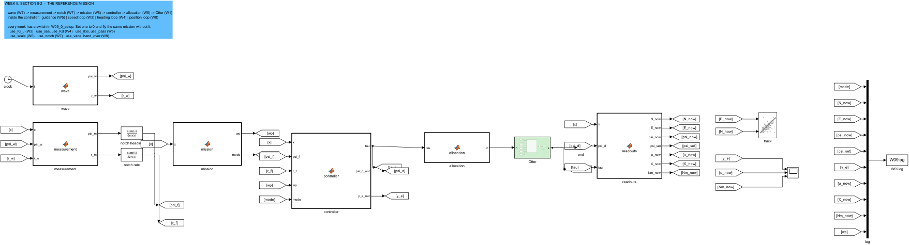
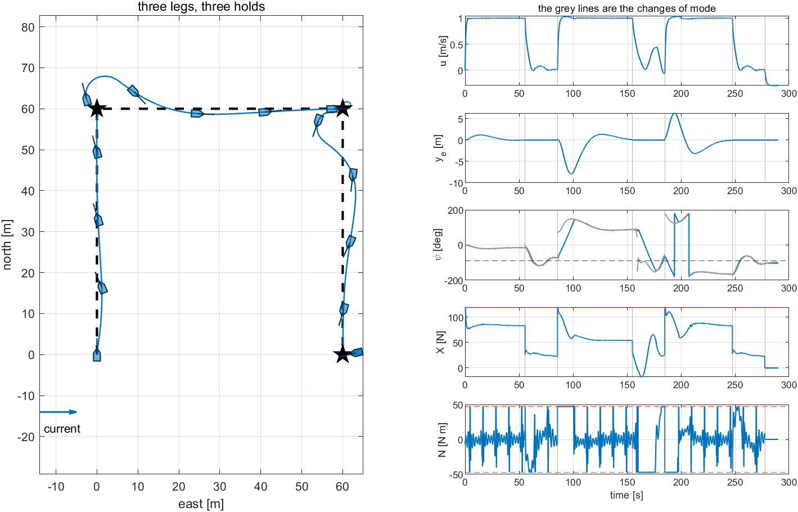
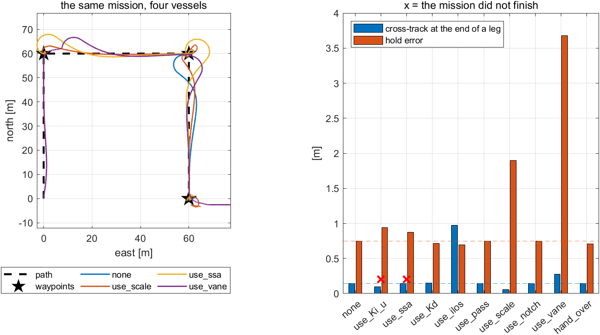
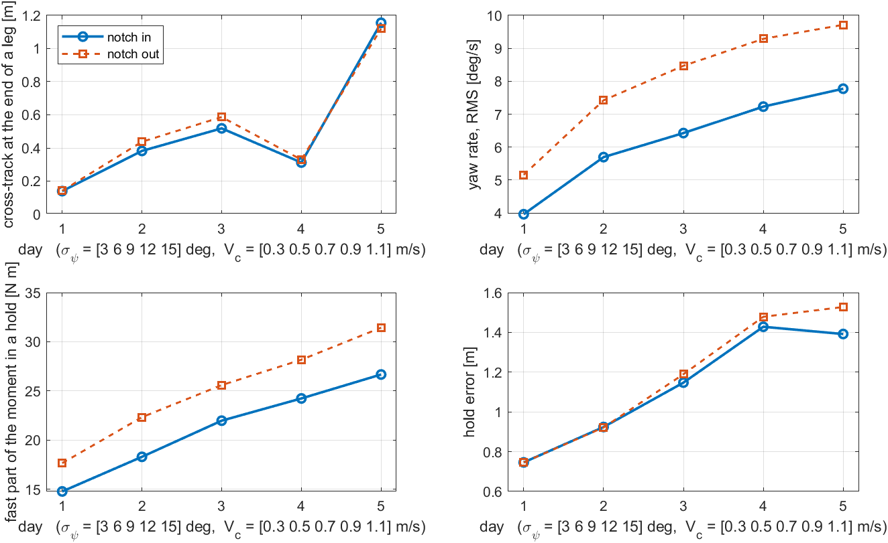
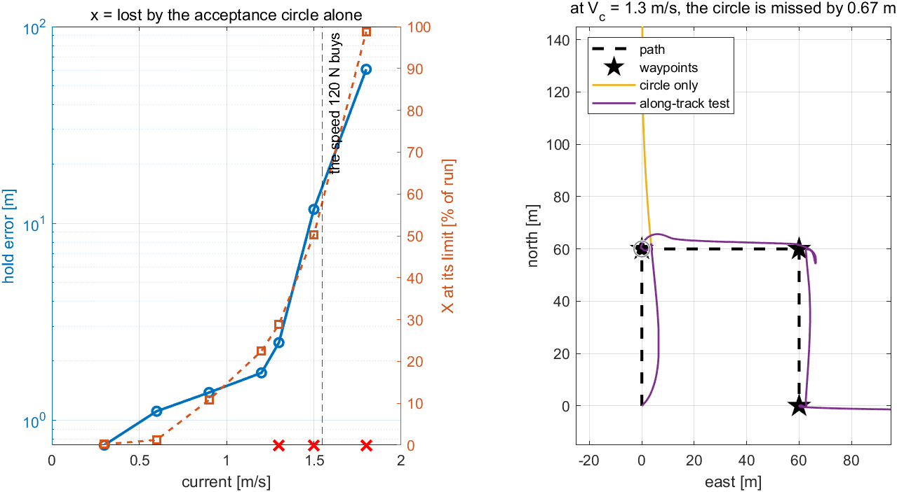
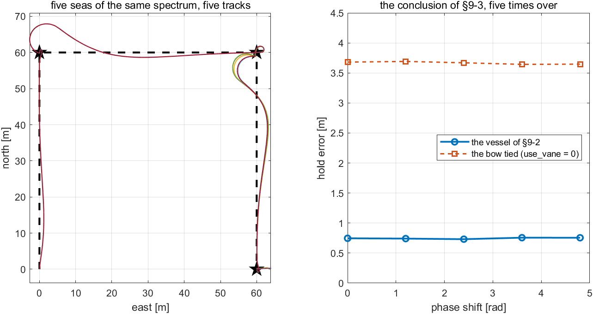

# Week 9 · Integration: One Vessel, One Mission

> [!important] Reference material — read this first
> <span style="font-size:0.88em">The five courses below are **taught by the instructor of this course** and are the assumed background for it. They run from the fundamentals down to the graduate material, so start wherever the gap is. Every frame, symbol and derivation used here is developed in them at length; anyone whose prerequisites are thin should work through them first, then return.</span>
>
> | # | Course | Level | Lang. | Video | Slides and code |
> |---|---|---|---|---|---|
> | 1 | **Control Engineering** (제어공학) — the foundation: transfer functions, feedback, stability, root locus, PID | undergraduate | KO | [playlist](https://youtube.com/playlist?list=PLFaUxNRM4BvJMpF9HZS-Mp8tDv9dTdglk) | [drive](https://drive.google.com/drive/folders/1TNIPDNtS_Iy8li-olka5WJslSXDYf0aT) |
> | 2 | **Control System Design** (제어시스템설계) — design rather than analysis: specifications, loop shaping, discrete implementation | undergraduate | KO | [playlist](https://youtube.com/playlist?list=PLFaUxNRM4BvIGroZ5rgn7x08F7C79d9WZ) | [drive](https://drive.google.com/drive/folders/11m5Xxl_PHJvxgHghLSP-jhCpmRpbvoXh) |
> | 3 | **Advanced Control Engineering** (제어공학특론) — reference frames, the 6-DOF equation of motion, rotation matrices and Euler angles, linearisation and trim, vehicle control design | graduate | EN | [playlist](https://youtube.com/playlist?list=PLFaUxNRM4BvJmvF2ljx4KM5dj1P5jEcw0) | [drive](https://drive.google.com/drive/folders/1GUxbbONl916lNd0ggnFnXrNwNkd13-2-) |
> | 4 | **Sensor Signal Processing and Fusion** (센서신호처리 및 융합) — sensor models, noise, estimation and multi-sensor fusion | graduate | EN | [playlist](https://youtube.com/playlist?list=PLFaUxNRM4BvK-aP2Gdoyp5-AWvMn7Fo8E) | [drive](https://drive.google.com/drive/folders/1MEVJP7TzMcm8w6TZwUjhWJtL34WeNY3u) |
> | 5 | **Capstone Design** (캡스톤디자인) — a vehicle project carried end to end | undergraduate | KO | [playlist](https://youtube.com/playlist?list=PLFaUxNRM4BvLu7L0pDoLzDXTv8mm6rCmj) | [drive](https://drive.google.com/drive/folders/1haIQejlJfrdhtOuof-MpffR9ydVscXZS) |
>
> <span style="font-size:0.88em">**Not fluent in MATLAB or Simulink yet? Do these before Part 2.** Every laboratory in this course is Simulink, and the Onramp courses are free and take a few hours each.</span>
>
> | Tool | Where to start |
> |---|---|
> | MATLAB | [MATLAB Onramp](https://matlabacademy.mathworks.com/kr/details/matlab-onramp/gettingstarted) · [Core MATLAB Skills](https://matlabacademy.mathworks.com/details/core-matlab-skills/lpmlcms) |
> | Simulink | [Simulink Onramp](https://matlabacademy.mathworks.com/kr/details/simulink-onramp/simulink) · instructor's Simulink lectures [part 1](https://youtu.be/a-afHg_fSaU) · [part 2](https://youtu.be/070Yn0Hw5a0) |


> [!tip] Getting the course files, and keeping them current (Windows)
> <span style="font-size:0.88em">The notes, models and scripts are kept in one Git repository that is updated through the semester. Clone it once; before every class, pull. A pull downloads only what has changed since the last one.</span>
>
> | When | Where to run it | Command |
> |---|---|---|
> | once | PowerShell — installs Git for Windows | `winget install --id Git.Git -e` |
> | once | the folder that will hold the course, e.g. `Documents` | `git clone https://github.com/wkyouncnu/Sensor-Signal-Processing-and-Fusion.git` |
> | before every class | inside the cloned folder `Sensor-Signal-Processing-and-Fusion` | `git pull` |
>
> - `git pull` prints `Already up to date.` when nothing has changed, and otherwise lists the files it updated.
> - The repository is private. When Git asks, sign in with the GitHub account the instructor has given access.
> - Experiment on copies, not on the cloned files: copy a week's `WXX_simulink` folder elsewhere first, and a pull can never collide with local edits. If it already has, `git stash`, then `git pull`, then `git stash pop` sets the edits aside, updates, and puts them back.
> - The MSS toolbox is not part of the repository. The weeks that simulate the Otter need it at `Tools\MSS` inside the cloned folder.


- **Course**: USV Guidance, Navigation and Control (Graduate)
- **Department**: Autonomous Vehicle System Engineering, Chungnam National University
- **This week**: ① the eight weeks assembled as one chain of blocks, one block to a week ② one mission flown end to end, read as eight contributions ③ each week removed in turn, and what its absence costs, in metres and seconds ④ the same vessel on a rougher day, with nothing retuned ⑤ the current at which the mission is lost, and what actually runs out first ⑥ whether these numbers describe the design or one realisation of the sea

> [!important] Prerequisites from the previous week
> - From Week 8 §8-5: a mission is a state machine, and an integrator that is not in charge must not integrate. Both are reused here without change.
> - From Weeks 3, 4, 5, 6 and 7: the speed loop, the heading autopilot, LOS and ILOS, the allocation and its limits, and the notch. This week adds no new law — it assembles them.
> - From Week 2 §2-12: the order in which gains are chosen. Nothing is retuned in this week, and §9-4 is what that costs.

---

## Learning Outcomes

Upon completion of this week, the learner is able to:

1. Name, for each block of an integrated guidance, navigation and control model, the week whose derivation it implements and the variable that switches it out.
2. Fly one mission end to end and read a single run as a sequence of contributions rather than as one result.
3. Measure the value of a design decision by ablation — removing it and flying the same mission — and state the metric that makes the comparison honest.
4. Identify a failure that no single week could have produced, and locate it in the seam between two weeks rather than inside either one.
5. Distinguish a limit set by force from a limit set by a decision rule, and measure both.
6. Judge whether a reported result belongs to the design or to one realisation of the disturbance, by repeating the run under the same spectrum.

## Prerequisites and Setup

| Item | Requirement |
|---|---|
| MATLAB | R2024b, with Simulink |
| MSS | `Tools/MSS`, found by `W09_0_setup` through `mss_path` |
| Course folder | `lectures/W09_simulink` |
| Models | **one per experiment** — `W09_C_full`, `W09_D_ablation`, `W09_E_weather`, `W09_F_limits` — all generated by `W09_1_build_vessel`, never edited by hand |
| Time | lecture 40 min, laboratory 1 h 20 min |

---

# Part 1 · Principle and experiment, section by section

| Part of a section | What it holds |
|---|---|
| **What is observed** | the effect itself, with the numbers it produces |
| **What follows from it** | numbered lines, one step each, from the chain of blocks to the rule being measured |
| **Experiment N-x** | the model, the commands, the output actually obtained, the figure, and a table that reads every feature of the figure back to **the numbered line that predicts it** |

## 9-0. Setting up (10 min)

```matlab
cd lectures/W09_simulink
W09_0_setup
W09_1_build_vessel
```

Expected output:

```
  W09_0_setup
    mission   3 waypoints, 60 m legs;  arrive within 3 m, hold 30 s, transit at 1 m/s
    sea       Hs 0.30 m, T0 2.0 s;  current 0.30 m/s towards 90 deg
    switches  W3 1  W4 1 1  W5 1 1  W6 1  W7 1  W8 1 1
    limits    |X| <= 120 N,  |N| <= 47.15 N m  (at zero surge it would be 94.55)

  built  W09_C_full.slx     (overlapping lines: 0)
  built  W09_D_ablation.slx (overlapping lines: 0)
  built  W09_E_weather.slx  (overlapping lines: 0)
  built  W09_F_limits.slx   (overlapping lines: 0)
```

- Almost no number in `W09_0_setup` is new. The gains are the ones Weeks 3 to 8 each chose, collected in one file; the sea is the sea of Week 7; the current is the current of Week 1. What is new is the block of **switches**, one or two to a week, and §9-3 is what they are for.

## 9-1. The vessel, block by block

This section answers: where does each week live in the assembled model?

**What is observed.** Opening `W09_C_full` shows seven blocks in one left-to-right chain, and every one of them is a week of this course:

```
wave (W7) -> measurement -> notch (W7) -> mission (W8) -> controller -> allocation (W6) -> Otter (W1)
                                      inside the controller:
                            guidance (W5) | speed loop (W3) | heading loop (W4) | position loop (W8)
```

**What follows from it, one line at a time.**

1. The chain is the one of Week 1 §1-2 — command, reference, controller, allocation, plant, measurement — with the measurement path no longer a wire but two blocks, because Week 7 put something in it.
2. Reading the chain **right to left** gives the order in which the course was built: the hull first, then what drives it, then what decides what to ask for, then what the sensor is really reporting.
3. The `controller` block holds four loops rather than four blocks, because they share one state vector and one sample instant. Which of its lines run is decided by `mode`, exactly as in Week 8 §8-5 line 3.
4. **Every block has memory only where a week gave it memory.** `mission` and `controller` are discrete at $h = 0.02$ s because they hold integrators and a waypoint index; `wave`, `measurement` and `allocation` are memoryless; the notch is a continuous transfer function, as it was derived in Week 7 §7-4.
5. The model therefore contains no algebraic loop: the Otter's integrator breaks the one loop that closes, and every other path is feed-forward within a time step.
6. Each week's contribution is written so that **one variable switches it out**, and the removal leaves the model's structure untouched. Nothing is deleted, no block is bypassed, and the comparison of §9-3 is therefore between two runs of one model.

| Week | What it put on this vessel | The switch | Where the switch acts |
|---|---|---|---|
| 1 | the hull, and the current it swims in | — | `Otter`, unmodified `otter.m` |
| 2 | the shape of a PID, and anti-windup | — | inside every loop below |
| 3 | the surge loop, with its integral | `use_Ki_u` | `controller`, transit branch |
| 4 | the shortest-angle error, and the rate term | `use_ssa`, `use_Kd` | `controller`, heading loop |
| 5 | LOS, its integral, and the arrival test | `use_ilos`, `use_pass` | `controller` guidance; `mission` |
| 6 | the allocation, and the limit that couples $X$ to $N$ | `use_scale` | `allocation`; the yaw clamp |
| 7 | the sea, and the notch that keeps it out | `use_notch` | `notch heading`, `notch rate` |
| 8 | the bow set free, and the handover | `use_vane`, `hand_over` | `controller`, hold branch |

**The canvas.** `W09_C_full`, opened and read rather than run.

```matlab
W09_0_setup
open_system('W09_C_full')       % 사슬을 왼쪽에서 오른쪽으로 읽는다 / read the chain, left to right
open_system('W09_C_full/controller')   % 네 루프가 한 블록에 / the four loops, in one block
```



**Reading the figure against the derivation.**

| Where to look | What is there | Which line predicts it |
|---|---|---|
| the top-left branch | `clock` into `wave`, its two outputs going nowhere near the hull | line 1: the sea enters the **measurement**, not the plant |
| the two `num(s)/den(s)` blocks | one on the heading, one on the rate | line 4: the notch is continuous, and both channels carry the wave |
| `controller`, five inports | state, filtered heading, filtered rate, waypoint index, mode | line 3: one block, four loops, one `mode` deciding |
| the green `Otter` | one inport `n`, one outport `x` | line 2: the hull is where the course started and is unchanged |
| every `Goto`/`From` pair | no line crosses the diagram backwards | line 5: within a step everything is feed-forward |

**What the figure says**

- Eight weeks of derivation fit in seven blocks, and the seams between them are visible as ports.

| What to try | What to watch |
|---|---|
| double-click `controller` | the comments name the section of the course each group of lines came from |
| double-click `allocation` | eleven lines, and eight of them are Week 6 §6-4 and §6-6 verbatim |

> [!tip] In class
> - **Purpose** — let the learner see the whole course at once before any of it is taken apart.
> - **Point to** — the measurement path, and the fact that the sea never touches the hull in this model.
> - **Ask** — "Which block would have to change to fly a different hull?" Only `Otter`, and the numbers in `W09_0_setup`.
> - **Take away** — an integrated model is a chain of derivations, and each link can be named.

## 9-2. One mission, end to end

This section answers: does the assembled vessel do the job, and can one run be read as eight contributions?

**What is observed.** Experiment 9-2 gives the vessel three waypoints, $60$ m apart, each to be held for $30$ s, in a $0.3$ m/s current running east and the sea of Week 7:

- the mission completes at $277.7$ s, in the order `transit → hold → transit → hold → transit → hold → done`,
- the transit speed is $1.000$, $1.001$ and $0.998$ m/s on the three legs against a command of $1.0$,
- the cross-track error at the end of a leg is $0.03$, $0.25$ and $0.14$ m,
- the three holds keep station to $0.433$, $1.373$ and $0.432$ m,
- and the bow settles at $-74.1°$, $-65.5°$ and $-106.2°$, the current running towards $+90°$.

**What follows from it, one line at a time.**

1. **Each number belongs to a week, and to only one.** The speed is Week 3's integral; the cross-track is Week 5's ILOS; the hold is Week 8's weathervane; the fact that all of them happen at once is this week's.
2. The bow angles of the three holds are all near $-90°$, which is **into** a current running towards $+90°$. That is Week 8 §8-3's result reappearing three times without being asked for: the integral learns an upstream force and the bow follows it.
3. The middle hold is three times worse than the other two — $1.373$ m against $0.433$ m — and the cause is geometry, not control. Leg 2 runs east, **downstream**; the vessel arrives at that station pointing $+89°$ and must turn $154°$ to face the flow, while the other two arrive needing only about $60°$. Thirty seconds is nearly all turn.
4. Therefore the hold error of a station is set partly by **the leg that arrives at it**. A mission planner that alternates upstream and downstream legs is choosing station accuracy without knowing it.
5. The surge force sits at its $120$ N limit for $0.4\,\%$ of the run and the yaw moment at its $47.15$ N·m limit for $19.1\,\%$. **The yaw channel is the busy one**, and it is the turns that make it so: with the sea switched off it is still at its limit $18.0\,\%$ of the run.
6. What the sea does change is **motion**: the RMS yaw rate on a straight leg is $3.96$ deg/s with the sea and $2.17$ deg/s without, while the cross-track and hold errors move by less than $0.02$ m. The sea costs work, not accuracy — which is why Week 7 measured work.

### Experiment 9-2 · The reference mission (15 min)

**What it measures.** Lines 1, 3 and 5: which week owns which number, why the middle hold is worse, and which actuator is the binding one.

**The model.** `W09_C_full` — the chain of §9-1 with every switch at $1$.

**Opening and running.**

```matlab
W09_0_setup
open_system('W09_C_full')    % Run — XY 그래프에 세 다리, Scope 에 y_e 와 u 와 N
W09_C_the_whole_vessel       % 다리마다 · 유지마다의 수치와 그림 / the numbers of each leg and hold
```

Expected output:

```
  W09 Experiment 9-2  the reference mission
    leg   transit [s]   speed [m/s]   cross-track at the end [m]   hold [m]   settled [s]
     1         55.5         1.000                0.03             0.433         3.4
     2         69.4         1.001                0.25             1.373        30.0
     3         62.6         0.998                0.14             0.432         3.4
    mission complete at 277.7 s;  |X| at its limit 0.4 % of the run,  |N| 19.1 %
```



**Reading the figure against the derivation.**

| Where to look | What is there | Which line predicts it |
|---|---|---|
| left panel, the hulls on the corners | the bow already turned before the corner is reached | line 1: Week 5 sets $\psi_d$, Week 4 follows it |
| left panel, the three knots | tight at the first and third station, a loop at the second | line 3: the middle hold spends its time turning |
| $u$ panel, the flat tops at $1$ m/s | held on every leg, including the one that runs downstream | line 1: Week 3's integral, doing what it was built for |
| $y_e$ panel, the swings at $95$ and $195$ s | the corner transients, not the legs | line 1: cross-track is only meaningful along a leg |
| $\psi$ panel, the dashed line at $-90°$ | every hold settles onto it | line 2: the bow finds the flow by itself |
| $X$ panel against its red limit | touched once, at $187$ s | line 5: surge is not the binding channel |
| $N$ panel against its red limits | on the limit through every turn | line 5: yaw is |

**What the figure says**

- Eight weeks of separate results appear in one trace, each in its own stretch of time, and none of them was retuned to make this run work.

| What to try | What to watch |
|---|---|
| `T_hold = 60;` then rerun | the middle hold falls to about the other two: thirty of its seconds were the turn of line 3 |
| `beta_c = 0;` then rerun | the current now runs north, along leg 1 and across the others: the pattern of good and bad holds moves with it |
| `wave_on = 0;` then rerun | the errors barely move and the yaw rate falls from $3.96$ to $2.17$ deg/s — line 6 |

> [!tip] In class
> - **Purpose** — show that the course adds up, and that a run can be read rather than merely passed.
> - **Point to** — the $\psi$ panel and the dashed line at $-90°$, then the middle knot on the track.
> - **Ask** — "Which of these numbers would change if the hull were twice as long?" All of them, and none of the derivations.
> - **Take away** — an integrated result is readable when each of its parts was derived separately.

## 9-3. One week at a time, removed

This section answers: what was each week worth, measured rather than asserted?

**What is observed.** Experiment 9-3 flies the same mission ten times — once as in §9-2, then once with each of the nine switches set to zero. Four outcomes stand out:

- with `use_Ki_u` off the vessel makes $0.725$ m/s instead of $0.999$ and **never finishes**,
- with `use_ssa` off it turns $1.09$ full revolutions on the third leg and **never finishes**,
- with `use_scale` off, $37.64$ N·m of commanded moment is asked for and not produced, against $1.32$ N·m when it is on,
- with `use_vane` off the hold error goes from $0.746$ m to $3.681$ m,
- and with `use_pass` off **nothing changes at all**.

**What follows from it, one line at a time.**

1. An ablation is honest only if the two runs differ in **one** thing. That is why each week's contribution was written as a switch inside one model rather than as a second model: the sea, the waypoints, the gains and the solver are shared by construction.
2. It is also honest only if both runs are measured the same way, which is why every number in this week comes from `W09_metrics` and from nowhere else.
3. **Two removals stop the mission rather than degrade it**, and they fail for opposite reasons. Without Week 3's integral the vessel is merely too slow, and the clock runs out. Without Week 4's `ssa` the heading error at the seam of leg 3 — which runs due south, at $\psi = 180°$ — jumps by a whole turn, the autopilot saturates the wrong way, and the vessel spins.
4. The seam is reached **only because leg 3 lies on it**. This is a failure that no week could have produced on its own: Week 4 derived `ssa` on a step command, Week 5 chose waypoints without thinking about $\pm180°$, and the fault appears where the two meet.
5. **Week 6's switch costs the moment itself.** With the coupling forgotten, the yaw clamp is set at $N_{\text{open}} = 94.55$ N·m, the limit at zero surge, instead of $N_{\max} = 47.15$ N·m, the limit at $X_{\max} = 120$ N. One propeller is then clipped and the other is not, the difference between them is no longer what was asked for, and $37.64$ N·m of the command never reaches the water.
6. **A row that does not move is not a wasted week.** `use_pass` changes nothing here because at $0.3$ m/s the vessel always passes within the $3$ m circle. §9-5 raises the current until it does not, and the same switch then decides whether the mission happens at all.
7. `use_Kd` moves least of the rows that move: the corner overshoot roughly doubles and the yaw rate rises from $3.96$ to $4.21$ deg/s. The reason is that this mission never gives the heading loop a step — $\psi_d$ comes from guidance and moves slowly — and a derivative term earns its keep on steps. Week 4 §4-3d measured it where it can be seen.

### Experiment 9-3 · The ablation table (20 min)

**What it measures.** Lines 3, 5, 6 and 7: which removals are fatal, which are expensive, which are invisible here, and which is small everywhere.

**The model.** `W09_D_ablation` — the chain of §9-1 again, flown once per switch.

**Opening and running.**

```matlab
W09_0_setup
open_system('W09_D_ablation')
use_ssa = 0;                 % Run — 셋째 다리에서 배가 한 바퀴 돈다 / a whole turn on leg 3
use_ssa = 1;  use_vane = 0;  % Run — 유지가 무너진다 / the holds come apart
use_vane = 1;
W09_D_one_week_removed       % 아홉 스위치를 차례로 끄고 한 표로 / all nine, in one table
```

Expected output:

```
  W09 Experiment 9-3  one week at a time, removed
    switch off   week   T [s]   u [m/s]   y_e [m]   r [deg/s]   dN [N m]   hold [m]   settle [s]
    none          -     277.7     0.999      0.14        3.96       1.32      0.746        12.3
    use_Ki_u      W3       --     0.725      0.09        3.67       1.93      0.940        20.6
    use_ssa       W4       --     1.000      0.14        4.47      15.96      0.877        20.5
    use_Kd        W4    279.6     0.999      0.15        4.21       0.89      0.713        12.3
    use_ilos      W5    275.2     1.000      0.97        3.83       1.23      0.697        15.2
    use_pass      W5    277.7     0.999      0.14        3.96       1.32      0.746        12.3
    use_scale     W6    271.9     1.000      0.06        3.85      37.64      1.899        21.1
    use_notch     W7    274.9     1.000      0.14        5.16       1.80      0.746        12.3
    use_vane      W8    258.1     1.001      0.28        3.70       5.17      3.681        25.3
    hand_over     W8    279.4     1.000      0.14        3.97       0.36      0.711        16.2
```

- `--` in the `T` column means the mission did not reach its last station inside $290$ s.
- `dN` is the largest moment commanded and not produced, recomputed from the logged $X$ and $N$ through Week 6's allocation.



**Reading the figure against the derivation.**

| Where to look | What is there | Which line predicts it |
|---|---|---|
| left panel, the yellow track | loops at both corners and again at the last station | line 3: `ssa` off, and the seam of leg 3 |
| left panel, the purple track | wide swings at every corner and a long run past the last station | `use_vane` off: the bow can no longer answer the error |
| left panel, blue and orange nearly together | `use_scale` costs moment, not path | line 5: the loss is in the actuator, not the guidance |
| right panel, the two red crosses | `use_Ki_u` and `use_ssa` | line 3: two ways to not finish |
| right panel, the blue bar at `use_ilos` | $0.97$ m against $0.14$ m, and the only blue bar that moves | Week 5 §5-8: the crab angle, unpaid |
| right panel, `use_pass` identical to `none` | both bars exactly at the dashed baselines | line 6: the switch that waits for §9-5 |
| right panel, the orange bar at `use_vane` | $3.681$ m, five times the baseline | Week 8 §8-3, measured a second time |

**What the figure says**

- Seven weeks of argument reduce to one table, and the table disagrees with the intuition that the newest ideas matter most: the two that stop the mission are a first-year integral and one line of trigonometry.

| What to try | What to watch |
|---|---|
| `WP_N = [60 60 30]'; WP_E = [0 60 60]';` then `use_ssa = 0;` and rerun | leg 3 no longer lies on $\pm180°$, and the `ssa` failure disappears — line 4: the fault is in the seam, not in the block |
| `use_scale = 0;` then `X_max = 40;` and rerun | with little surge spent, $N_{\text{open}}$ is nearly right again and `dN` collapses — line 5 |
| two switches off at once, e.g. `use_ilos = 0; use_vane = 0;` | the costs do not simply add, which is the reason ablations are done one at a time |

> [!tip] In class
> - **Purpose** — replace "this improves performance" with a number, for every claim the course has made.
> - **Point to** — the two red crosses, then the `use_pass` row that does nothing.
> - **Ask** — "Which row would be cut first if the processor were too slow?" `use_Kd` by this table — and then ask what step command would change the answer.
> - **Take away** — a design decision is worth what its removal costs, measured on the mission that will be flown.

## 9-4. A rougher day

This section answers: the vessel was tuned for one sea and one current. What does another day cost, with nothing retuned?

**What is observed.** Experiment 9-4 flies the same vessel on five days, the wave-induced heading rising from $\sigma_\psi = 3°$ to $15°$ and the current from $0.3$ to $1.1$ m/s, each day once with the notch and once without:

- the RMS yaw rate nearly doubles, $3.96 \to 7.77$ deg/s,
- the fast part of the yaw moment in a hold rises $14.8 \to 26.7$ N·m,
- the hold error rises $0.75 \to 1.39$ m and the cross-track $0.14 \to 1.16$ m,
- the mission time **falls**, $277.7 \to 259.5$ s,
- and the notch removes between $1.2$ and $2.0$ deg/s of yaw rate on every one of the five days.

**What follows from it, one line at a time.**

1. The sea of Week 7 is described by three numbers, and they do different jobs: $H_s$ and $T_0$ set the shape of the spectrum, and therefore where $\omega_0$ must be; $\sigma_\psi$ sets how hard the sea works the vessel. Sweeping the day means sweeping $\sigma_\psi$ and the current together, because a rough day brings both.
2. **What degrades first is motion, not accuracy.** The yaw rate and the moment roughly double across the five days while the hold error less than doubles — and the part of the hold error that does grow is the current's, not the sea's, because the current is a bias and the waves are not.
3. The mission gets **shorter** as the day gets worse, which is not an improvement: the current runs east, leg 2 runs east, and the vessel is carried down it. A mission time is not a performance measure when there is a current in the problem.
4. The notch's benefit is about the same **fraction** on every day — near $25\,\%$ of the yaw rate — and therefore a growing **amount**: $1.20$ deg/s on day 1 and $1.94$ deg/s on day 5. A filter tuned once keeps earning, because it is tuned to a frequency and not to an amplitude.
5. That last statement holds only while $\omega_0$ stays where the filter was put. The notch is $-15.6$ dB **at one frequency** (Week 7 §7-4), so a day with a different peak period needs $\omega_0$ recomputed; leaving it is the one way to make the filter worse than useless.
6. Nothing in this section was retuned, and that is the point: a design is only as good as its behaviour on the days it was not designed for.

### Experiment 9-4 · Five days, nothing retuned (15 min)

**What it measures.** Lines 2, 3 and 4: which metric moves first, why the mission time misleads, and what the filter is worth as the sea grows.

**The model.** `W09_E_weather` — the chain of §9-1, flown ten times over five days.

**Opening and running.**

```matlab
W09_0_setup
sigma_psi = 12;  V_c = 0.9;  w0 = 2*pi/T0;
open_system('W09_E_weather')  % Run — 같은 게인, 훨씬 부산한 배 / the same gains, a much busier vessel
W09_E_a_rougher_day           % 다섯 날, 노치 유무 / five days, with the filter and without
```

Expected output:

```
  W09 Experiment 9-4  the same vessel, five days  (no gain is changed)
    day  sigma  V_c  |      the notch in           |     the notch out
         [deg] [m/s] |   T[s]  y_e    r    dN  hold |   T[s]  y_e    r    dN  hold
     1      3   0.3 |  277.7  0.14  3.96  14.8  0.75 |  274.9  0.14  5.16  17.7  0.75 |
     2      6   0.5 |  274.0  0.38  5.70  18.3  0.92 |  275.1  0.44  7.42  22.3  0.92 |
     3      9   0.7 |  262.4  0.52  6.43  22.0  1.15 |  264.6  0.59  8.47  25.6  1.19 |
     4     12   0.9 |  251.1  0.31  7.23  24.2  1.43 |  252.9  0.33  9.29  28.2  1.48 |
     5     15   1.1 |  259.5  1.16  7.77  26.7  1.39 |  260.8  1.12  9.71  31.4  1.53 |
```



**Reading the figure against the derivation.**

| Where to look | What is there | Which line predicts it |
|---|---|---|
| top-right panel, the two curves | parallel, separated by $1.2$ to $2.0$ deg/s throughout | line 4: a fixed fraction of a growing quantity |
| bottom-left panel, the gap widening | $2.9$ N·m on day 1, $4.7$ N·m on day 5 | line 4 again, in the units Week 7 used |
| bottom-right panel, the two curves meeting | the hold error is nearly the same filtered or not | line 2: the hold error is the current's, not the sea's |
| bottom-right panel, day 4 above day 5 | the hold error stops rising monotonically | line 3: the current changes the geometry, not only the difficulty |
| top-left panel, the jump at day 5 | $0.31 \to 1.16$ m of cross-track | the current is now a third of the transit speed |

**What the figure says**

- A filter chosen on one day is still the right filter on five, and the gains chosen on one day are not.

| What to try | What to watch |
|---|---|
| `T0 = 3.0;` and leave `w0` as it was | the notch now sits where the sea is not: the filtered and unfiltered runs converge — line 5 |
| `T0 = 3.0; w0 = 2*pi/T0;` then rerun | the benefit returns, which is the check that the loss above was the mistuning |
| `V_c = 0;` on each day | the hold error stops rising with the day: what was left is the sea's share alone |

> [!tip] In class
> - **Purpose** — separate the disturbance that biases from the disturbance that shakes.
> - **Point to** — the mission-time column falling while everything else worsens.
> - **Ask** — "Which single number here would a customer put in a specification?" The hold error; and it is the one the sea barely touches.
> - **Take away** — a current costs accuracy, a sea costs work, and only one of them is filtered.

## 9-5. Where it breaks

This section answers: raise the current until the mission is lost. What runs out first?

**What is observed.** Experiment 9-5 sweeps the current from $0.3$ to $1.8$ m/s twice — once with Week 5's along-track arrival test, once with the acceptance circle alone:

- with the circle alone the mission is lost abruptly at $1.3$ m/s: the vessel's closest pass to the first waypoint is $3.67$ m, and the circle has a radius of $3$ m,
- with the along-track test the same current is flown to completion in $291.2$ s,
- with everything working the hold error is $0.75$, $1.11$, $1.38$, $1.74$, $2.48$, $11.77$ and $60.68$ m across the sweep,
- and with $X$ held at $120$ N in still water the vessel settles at $1.547$ m/s.

**What follows from it, one line at a time.**

1. There are two different kinds of limit in a mission, and they look nothing alike. A **force** limit degrades: the numbers get worse continuously as the demand rises. A **decision** limit does not degrade at all until it fails completely.
2. The first limit met here is the decision limit, and it is off by $0.67$ m. As the current rises the vessel crabs further, and it crosses the waypoint's neighbourhood on a slant; at $1.3$ m/s its closest approach is $3.67$ m, the test never fires, the waypoint index never advances, and the vessel sails north for ever on a leg that has already been completed.
3. Week 5's rule removes this failure entirely, because it asks a different question. The circle asks *am I near the waypoint*; the along-track test asks *have I gone past it*, by projecting the vector still to run onto the leg and switching when that projection goes negative:

$$
x_{\text{left}} = (\mathbf{p}_k - \mathbf{p})^{\mathsf T}
\begin{bmatrix} \cos\pi_p \\ \sin\pi_p \end{bmatrix},
\qquad \text{switch when } x_{\text{left}} < 0
$$

| Symbol | Quantity | Unit · source |
|---|---|---|
| $\mathbf{p} = [N\ \ E]^{\mathsf T}$ | where the vessel is | m · `x(7)`, `x(8)` |
| $\mathbf{p}_k$ | the waypoint being run to | m · `WP_N(k)`, `WP_E(k)` |
| $\pi_p$ | the heading of the leg | rad · Week 5 §5-3, $\operatorname{atan2}(\Delta E, \Delta N)$ |
| $x_{\text{left}}$ | the distance still to run **along** the leg | m · negative once the waypoint is behind |

   A vessel that passes cannot miss a half-plane, whatever its crab angle, and the test costs one dot product. The `mission` block keeps the circle as well, so a vessel that stops short of a waypoint still switches.
4. Behind the decision limit stands the force limit, and it has a number that can be computed before any of this is run: **the speed $X_{\max}$ buys**. At $120$ N in still water the vessel settles at $1.547$ m/s, and a current that approaches that speed leaves nothing over for steering.
5. The measurements bracket it. At $1.2$ m/s the surge force is at its limit $22\,\%$ of the run and the station is held to $1.74$ m; at $1.5$ m/s it is at its limit $50\,\%$ of the run and the hold has collapsed to $11.77$ m; at $1.8$ m/s — above the top speed — it is saturated $99\,\%$ of the time and the vessel is simply carried, holding station $60.68$ m from the mark.
6. So the two limits are $1.3$ m/s and about $1.5$ m/s, and **the cheaper one to fix is the one that binds first.** Changing one comparison in the mission block bought $0.2$ m/s of operating envelope; buying the other $0.2$ m/s would take a bigger motor.

### Experiment 9-5 · The current sweep, and the arrival test (15 min)

**What it measures.** Lines 2, 4 and 5: the current at which the circle is missed, the top speed the thrust limit sets, and the way the numbers degrade once the force runs out.

**The model.** `W09_F_limits` — the chain of §9-1, flown fourteen times.

**Opening and running.**

```matlab
W09_0_setup
V_c = 1.3;  use_pass = 0;
open_system('W09_F_limits')   % Run — 배가 첫 지점을 지나쳐 계속 북쪽으로 간다 / straight past, for ever
use_pass = 1;                 % Run — 같은 조류, 임무가 끝난다 / the same current, and it finishes
W09_F_where_it_breaks         % 두 판정 규칙의 스윕 / the sweep, under both rules
```

Expected output:

```
  W09 Experiment 9-5  where it breaks
    with X held at 120 N and no current, the vessel settles at 1.547 m/s
    V_c    |  along-track test of Week 5      |  acceptance circle alone
   [m/s]   |   T [s]   y_e [m]  hold [m]  Xsat |   T [s]   closest pass to wp1 [m]
    0.30   |   277.7      0.14      0.75     0% |   277.7        0.09
    0.60   |   268.4      0.43      1.11     1% |   268.4        0.02
    0.90   |   250.5      0.27      1.38    11% |   250.5        0.03
    1.20   |   269.0      1.92      1.74    22% |   269.0        0.06
    1.30   |   291.2      2.98      2.48    29% |     NaN        3.67
    1.50   |   349.6      9.02     11.77    50% |     NaN       12.25
    1.80   |   595.2     52.76     60.68    99% |     NaN       34.89
```



**Reading the figure against the derivation.**

| Where to look | What is there | Which line predicts it |
|---|---|---|
| left panel, the blue curve below $1.2$ m/s | rising gently on a logarithmic axis | line 1: a force limit degrades |
| left panel, the three red crosses | at $1.3$, $1.5$ and $1.8$ m/s, all at zero | line 1: a decision limit does not degrade, it fails |
| left panel, the dashed vertical line | the top speed $120$ N buys, at $1.547$ m/s | line 4: the force limit, computed rather than found |
| left panel, the orange curve crossing $50\,\%$ | exactly where the blue curve turns upward | line 5: the hold collapses when the surge runs out |
| right panel, the yellow track | straight past the waypoint and off the top of the plot | line 2: the index never advanced |
| right panel, the grey circle | $3$ m, and the yellow track outside it | line 2: missed by $0.67$ m |
| right panel, the purple track | the same vessel, the same current, the whole mission | line 3: a vessel that passes cannot miss a half-plane |

**What the figure says**

- The first thing to break was not a force, a gain or a filter, but a comparison — and it was fixed by changing the question.

| What to try | What to watch |
|---|---|
| `R_arrive = 5;` with `use_pass = 0;` at $1.3$ m/s | the mission finishes again: a larger circle hides the fault instead of removing it, and corners are cut |
| `u_d = 1.4;` at $V_c = 1.5$ | the vessel asks for more than $120$ N can buy, and the speed loop's integral sits at its clamp all run |
| `X_max = 200;` at $V_c = 1.8$ | the mission returns — and the yaw clamp $N_{\max}$ falls with it, by the formula of Week 6 |

> [!tip] In class
> - **Purpose** — teach the difference between a limit that warns and a limit that does not.
> - **Point to** — the yellow track leaving the top of the right panel, then the $3.67$ m in the table.
> - **Ask** — "How would this fault have shown up in testing?" Only above $1.25$ m/s of current, which is exactly the day nobody tests on.
> - **Take away** — check the tests in the mission logic as carefully as the gains in the loops.

## 9-6. The design, or the day?

This section answers: every number in this week came from one realisation of the sea. Would another have said the same?

**What is observed.** Experiment 9-6 shifts every phase of the wave train by one number, making five realisations of the same spectrum, and flies each of them twice — once as in §9-2 and once with the weathervane off:

- the mission time is $275.2$ to $278.6$ s, a spread of $3.4$ s,
- the hold error is $0.732$ to $0.757$ m, a spread of $0.025$ m or $3.4\,\%$,
- with the bow tied the hold error is $3.643$ to $3.692$ m in every one of the five,
- and the five tracks cannot be told apart by eye.

**What follows from it, one line at a time.**

1. A realisation is not a spectrum. The wave train of Week 7 fixes the amplitudes from the JONSWAP spectrum and the phases from a golden-ratio sequence, so one spectrum has as many realisations as there are phase sets, and the lecture has so far reported exactly one of them.
2. Shifting every phase by a constant keeps the amplitudes and the frequencies and changes only how the components meet, which is the smallest honest way to ask the question.
3. **The spread is $3.4\,\%$, so the numbers of §9-2 to §9-5 are the design's and not the day's.** Had the spread been comparable to the differences being reported, none of the ablation table would have meant anything.
4. The ablation conclusion survives realisation by realisation: $0.75$ m against $3.68$ m, five times over, with the two bands nowhere near meeting. A conclusion that holds in one realisation and not the next is a description of a disturbance.
5. The tracks being indistinguishable while the yaw rate is measurably different is line 2 of §9-4 again: the sea moves the vessel's **motion**, and the path is set by the guidance and the current.
6. This is the cheapest experiment in the week and the one that decides whether the rest of it may be believed. It costs ten runs and no new model.

### Experiment 9-6 · Five realisations of one spectrum (10 min)

**What it measures.** Lines 3 and 4: the spread of the reference result, and whether §9-3's largest conclusion is realisation-dependent.

**The run.** `W09_C_full` again, with `phase_shift` moved. No model is rebuilt: the shift is applied to $\phi_i$ after the spectrum has been sampled.

**Opening and running.**

```matlab
W09_0_setup
phase_shift = 2.4;  phi_i = mod(phi_i + phase_shift, 2*pi);
open_system('W09_C_full')    % Run — 다른 바다, 같은 임무 / another sea, the same mission
W09_G_the_same_sea_again     % 다섯 실현, 두 경우씩 / five realisations, twice each
```

Expected output:

```
  W09 Experiment 9-6  the same spectrum, five realisations
    phase shift [rad]   T [s]   y_e [m]   r [deg/s]   hold [m]   hold, bow tied [m]
            0.0         277.7      0.14        3.96       0.746           3.681
            1.2         278.6      0.14        3.97       0.741           3.692
            2.4         278.6      0.14        4.01       0.732           3.669
            3.6         275.2      0.13        3.87       0.757           3.643
            4.8         275.5      0.13        3.85       0.755           3.647
    spread of the mission time  3.4 s;  of the hold error  0.025 m (3.4 %)
```



**Reading the figure against the derivation.**

| Where to look | What is there | Which line predicts it |
|---|---|---|
| left panel, the five tracks | one line, thickened | line 5: the sea moves the motion, not the path |
| left panel, the corner at the second waypoint | the only place the five separate visibly | the corner is where the vessel is slowest and the sea has longest to act |
| right panel, the lower curve | flat within $0.025$ m across five seas | line 3: the spread is small against everything reported |
| right panel, the two curves | a factor of five apart, with no overlap | line 4: §9-3's conclusion is not realisation-dependent |

**What the figure says**

- A result worth reporting is one that survives being asked again.

| What to try | What to watch |
|---|---|
| `sigma_psi = 15;` then repeat the five shifts | the spread grows with the sea: the check has to be redone for every claim, not once |
| five shifts with `use_Kd = 0` | the spread and the effect are now the same size, which is the honest reason §9-3 line 7 is cautious about that row |
| `N_comp = 5;` then repeat | fewer components, a more periodic sea, and a spread that no longer represents the spectrum |

> [!tip] In class
> - **Purpose** — end the course by testing its own numbers.
> - **Point to** — the two flat bands in the right panel, and the gap between them.
> - **Ask** — "How many realisations would be enough?" As many as it takes for the spread to be small against the effect being claimed — which is a different number for every claim.
> - **Take away** — report the spread, or the number is an anecdote.

## 9-7. What this course did not cover

This section answers: the vessel of §9-2 works. What is it still missing?

**What is observed.** Every state this vessel uses is **given to it**. `x(7)`, `x(8)` and `x(12)` come out of the plant and into the controller with nothing between them but Week 7's notch. No real vessel has that.

**What follows from it, one line at a time.**

1. The measurement path of this model contains a wave filter and nothing else. A real one contains a GNSS receiver at $5$ Hz, an IMU at $100$ Hz, a compass with a bias, and the estimator that makes one state out of them — which is the subject of the companion course, *Sensor Signal Processing and Fusion*.
2. The allocation has two thrusters and a $2\times2$ problem, so Week 6's least squares had nothing to choose. A vessel with azimuthing thrusters has more unknowns than equations and the choice returns, with its own costs and constraints.
3. The guidance follows straight legs between waypoints. Curved paths, and paths generated to avoid something, change $\pi_p$ from a constant per leg into a function of position.
4. Nothing here is optimal in any stated sense. Every gain was chosen by a rule of thumb that was itself derived — which is a defensible engineering position and is not the same as a minimised cost.
5. The mission is open-loop in its own logic: it has no notion of failure, no re-planning, and no way to decide that a station cannot be held and should be abandoned.

| What was left out | Where it is treated | What would have to change here |
|---|---|---|
| state estimation from real sensors | Sensor Signal Processing and Fusion; Fossen Handbook Ch. 11 | the `measurement` block becomes an observer with its own states |
| azimuthing or over-actuated allocation | Week 6 §6-8, Fossen Handbook §11.2 | `allocation` becomes a constrained optimisation solved each step |
| curved and generated paths | Appendix A1; Fossen (2024) lecture notes | $\pi_p$ becomes a function of arclength |
| optimal control and MPC | outside this course | the four loops become one problem with one cost |
| fault handling and re-planning | outside this course | `mission` gains a third rule and a way to give up |

**What this leaves**

- The vessel of §9-2 is a complete guidance, navigation and control system with one honest gap: it is given its navigation rather than computing it. Closing that gap is the companion course, and it plugs into exactly one block of this model. The second item of the table is taken up immediately — Weeks 10 to 12 give this hull thrusters that make the allocation a real choice.

> [!tip] In class
> - **Purpose** — mark the boundary of the course precisely, so that the next thing to learn is obvious.
> - **Point to** — the `measurement` block, and the two wires going into it that no sensor produces.
> - **Ask** — "Which of §9-3's rows would change most if the heading were estimated rather than measured?" `use_Kd` and `use_notch`, because both act on the rate.
> - **Take away** — the course ends where the state stops being given.

---

# Part 2 · Laboratory run order

| Experiment | Model | Script | What it shows |
|---|---|---|---|
| 9-0 | all of them | `W09_0_setup`, `W09_1_build_vessel` | the parameters and the switches, and every model written from code |
| 9-1 | `W09_C_full` | — | the chain, one block to a week |
| 9-2 | `W09_C_full` | `W09_C_the_whole_vessel` | one mission end to end, read as eight contributions |
| 9-3 | `W09_D_ablation` | `W09_D_one_week_removed` | nine switches, and what each week was worth |
| 9-4 | `W09_E_weather` | `W09_E_a_rougher_day` | five days, nothing retuned |
| 9-5 | `W09_F_limits` | `W09_F_where_it_breaks` | the two kinds of limit, and which binds first |
| 9-6 | `W09_C_full` | `W09_G_the_same_sea_again` | five realisations of one spectrum |
| 9-7 | — | — | the boundary of the course |

- The scripts only repeat what Run already shows, for several settings at once, and print the numbers quoted in Part 1.
- Every number in Part 1 comes from `W09_metrics`, so any two rows of any two tables may be compared directly.

---

# Summary

## Week Summary

| Step | What was done | How it was verified |
|---|---|---|
| 1 | assembled eight weeks as one chain, one switch to a contribution | `W09_1_build_vessel`: four models, `overlapping lines: 0` |
| 2 | flew one mission end to end | Experiment 9-2: `transit → hold → … → done` at $277.7$ s; `verify_w09_integration` check 2 |
| 3 | measured what each week was worth | Experiment 9-3: two removals stop the mission, one costs $37.64$ N·m, one costs $2.9$ m of station |
| 4 | found a failure that belongs to a seam | Experiment 9-3: $1.09$ revolutions on the leg that lies at $\psi = 180°$; check 3 |
| 5 | flew five days with nothing retuned | Experiment 9-4: yaw rate $3.96 \to 7.77$ deg/s, hold $0.75 \to 1.39$ m |
| 6 | separated a decision limit from a force limit | Experiment 9-5: $3.67$ m past a $3$ m circle at $1.3$ m/s, against a top speed of $1.547$ m/s; check 5 |
| 7 | tested the week's own numbers | Experiment 9-6: five realisations, a spread of $3.4\,\%$; check 6 |

## Progress Check

> [!important] Minimum condition for following Week 10

### Theory

- [ ] Able to name, for each block of `W09_C_full`, the week it implements and the switch that removes it.
- [ ] Able to state what makes an ablation honest, and why one model with switches is preferred to two models.
- [ ] Able to explain why the `ssa` failure appears on the third leg and not the first two.
- [ ] Able to distinguish a decision limit from a force limit, and give the measured value of each.
- [ ] Able to say why a result is not reportable until its spread across realisations is known.

### Laboratory

- [ ] `W09_1_build_vessel` ran and every model reported `overlapping lines: 0`.
- [ ] `verify_w09_integration` printed `ALL CHECKS PASSED`.
- [ ] At least one switch was set to zero in the Command Window and the resulting failure was watched in the XY Graph.

### Recorded observations

- [ ] The mission time and the three hold errors of the reference run.
- [ ] The two rows of the ablation table whose `T` column is empty, and why each is empty.
- [ ] The closest pass to the first waypoint at $1.3$ m/s with the acceptance circle alone.
- [ ] The spread of the hold error across five realisations of one spectrum.

## Assignment 9

### ① Requirements

1. Add a fourth waypoint so that one leg runs **against** the current, repeat Experiment 9-2, and report the four leg times and four hold errors. Explain the slowest leg from the top speed of §9-5 line 4.
2. Extend the ablation of Experiment 9-3 to **pairs**: take the three switches with the largest single effect and run all three pairs. Report whether the costs add, and account for any pair that costs less than the sum of its parts.
3. Find the current at which the mission is lost with every switch at $1$, to a resolution of $0.05$ m/s, and report it beside the top speed $X_{\max}$ buys. Say which of the two numbers a specification should quote and why.
4. Repeat the requirement that gives the largest effect in ② for five realisations, and report the effect with its spread.

### ② Verification — mandatory

- `verify_w09_integration` prints `ALL CHECKS PASSED`.
- Every number is produced by `W09_metrics` and quoted with the window it was measured over.
- Every claim in ② and ③ is accompanied by the spread required in ④, or is explicitly marked as a single realisation.

### ③ Analysis (5–10 lines)

- The `ssa` failure of §9-3 could not have been found by testing Week 4 or Week 5 in isolation. Name one more failure of the same kind that this model could still contain — a fault living in a seam rather than in a block — and describe the experiment that would find it.

### Grading

| Item | Points |
|---|---|
| the fourth leg, against the current, explained from the top speed | 25 |
| the pairwise ablation, and the accounting for non-additivity | 25 |
| the limiting current, measured and predicted | 25 |
| the spread, and the analysis | 25 |

## Troubleshooting

| Symptom | Cause | Fix |
|---|---|---|
| the vessel sails past a waypoint and never comes back | `use_pass = 0` and the circle was missed | `use_pass = 1` (§9-5), or raise `R_arrive` and accept cut corners |
| the vessel spins on the third leg | `use_ssa = 0`: the leg lies on $\pm180°$ | `use_ssa = 1` (§9-3 line 3) |
| the mission never finishes and the speed sits near $0.7$ m/s | `use_Ki_u = 0`: the current is never paid for | `use_Ki_u = 1` (§9-3) |
| the holds are five times worse than the table | `use_vane = 0`: the bow cannot answer the position error | `use_vane = 1`, and see Week 8 §8-3 |
| the moment asked for never appears in the water | `use_scale = 0`: the yaw clamp is $N_{\text{open}}$, not $N_{\max}$ | `use_scale = 1` (§9-3 line 5) |
| the filter appears to do nothing | `T0` was changed and `w0` was not | `w0 = 2*pi/T0;` (§9-4 line 5) |
| a run does not reproduce the table | a switch or a sea parameter is still set from the previous experiment | rerun `W09_0_setup`, which restores every value |

## References

### Primary

- Fossen, T. I. *Handbook of Marine Craft Hydrodynamics and Motion Control*, 2nd ed. Ch. 12 for the guidance laws assembled here, Ch. 11 for the allocation and for the observer this model does without.
- Fossen, T. I. (2024). *Lecture notes on 2D and 3D path-following control*. The waypoint switching rule of §9-5, in the form the `mission` block implements.
- MSS toolbox — `demoOtterUSVPathFollowingHeadingControl.slx`, whose structure Weeks 5 to 9 follow, and `wavespec`, which supplies the spectrum of §9-6.

### In this course

- Week 1 §1-2 — the chain this model is arranged along; §1-13 — the current.
- Week 3 §3-5 — the speed integral of the `use_Ki_u` row.
- Week 4 §4-6 — `ssa`, whose absence is measured in §9-3; §4-3d — the derivative, and why a step is where it shows.
- Week 5 §5-6 — the arrival test of §9-5; §5-8 — the crab angle of the `use_ilos` row.
- Week 6 §6-4 and §6-6 — the allocation, and the coupled limit of the `use_scale` row.
- Week 7 §7-4 — the notch, whose benefit §9-4 tracks across five days.
- Week 8 §8-3 and §8-5 — the weathervane and the handover, the last two rows of the ablation.

## Next Week

The main course ends here, and the vessel it built is the one the remaining weeks change. Week 10 takes the second item of §9-7 — an allocation with a real choice in it — and replaces the Otter's two fixed propellers with aft azimuth thrusters; Weeks 11 and 12 do the same for a bow tunnel thruster and for four tilting thrusters, and compare all four hulls on the mission of §9-2. Everything upstream of `allocation` stays exactly as it is, which is the test of whether this week's chain was drawn in the right places.
