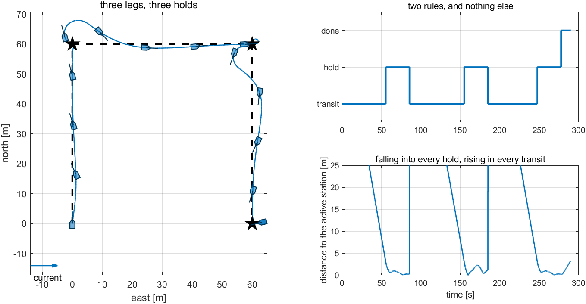
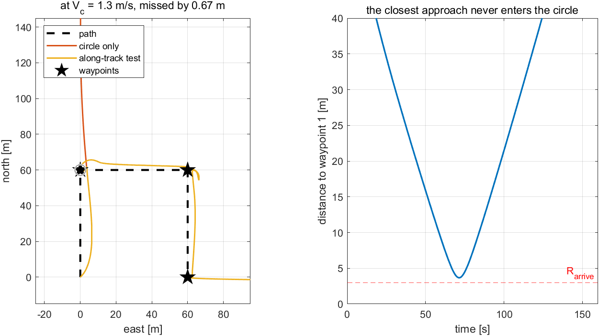
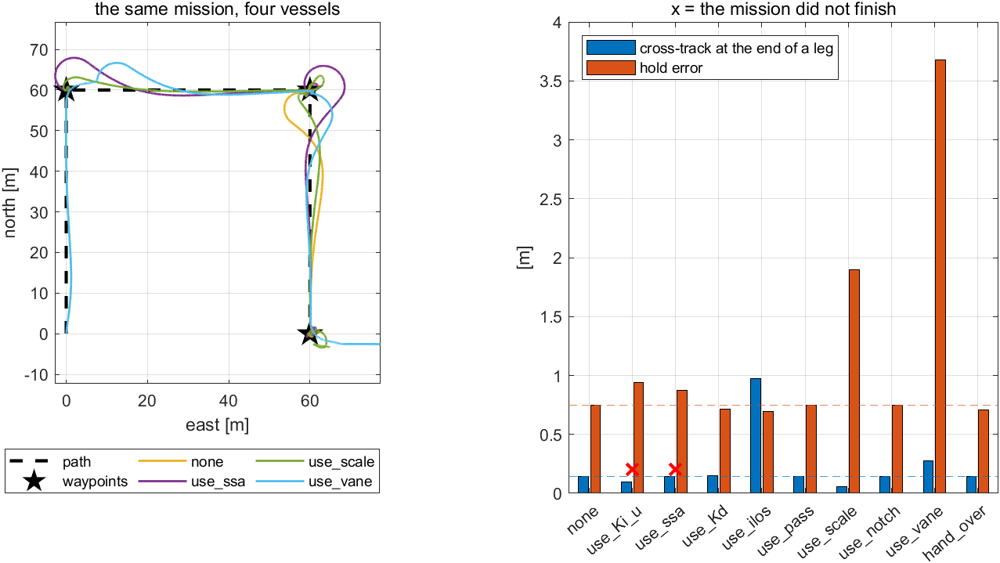

# Week 9 · Laboratory Problems — the mission, and what each week was worth

- Course: Sensor Signal Processing and Fusion · Department of Autonomous Vehicle System Engineering
- Time: **one hour**, immediately after the Week 9 lecture hour
- Three problems, in order.

---

## What this hour is for

Every earlier laboratory built a controller. This one does not, because Week 9 adds no new law.

Weeks 2 to 8 are already on the chain. What is missing is the piece that belongs to **none** of them: the logic that decides where the vessel is going and whether it has arrived. Problem 1 builds it in two rules. Problem 2 finds that one of those rules contains a test that is not safe, and repairs it with something Week 5 already had. Problem 3 builds nothing and measures everything — nine runs of one vessel, with one week removed each time.

> [!important] The last problem is the point of the week
> Problems 1 and 2 exist so that there is a working vessel to measure. Problem 3 is where the course is asked what it was worth, in metres and seconds, and the answer disagrees with the intuition that the newest ideas matter most.

---

## Before starting

```matlab
cd lectures/W09_simulink/problems
W09_P1_start                 % creates W09_P1.slx — Weeks 2 to 8, and one empty place
W09_check(1)                 % run this whenever, as often as needed
```

The solver is already set to fixed-step `ode4` at `h = 0.02` s. **Do not change it.**

> [!important] One requirement on every model
> **`slog`** — To Workspace, `Structure With Time`, carrying $[\,\text{wp}\ ;\ \text{mode}\,]$: the index of the waypoint being run to, and $1$ transit, $2$ hold, $3$ done.
>
> The controller reads both as tags. It needs `wp` to know which leg it is on and `mode` to know which of its four loops should run.

The provided `plog` carries $[\,\psi_d\ ;\ y_e\ ;\ X\ ;\ N\,]$ and `xlog` the twelve states. Every number in this laboratory is produced by `W09_metrics`, and by nothing else — which matters most in Problem 3, where nine runs are read side by side in one table.

---

## Problem 1 · The two rules (20 minutes)

**Build.** A block **with memory**, running at the fixed step $h$, holding three things: which waypoint is active, which mode the vessel is in, and how long it has been holding.

| In this state | When | Do this |
|---|---|---|
| transit | the waypoint is reached | hold, and reset the clock |
| hold | $T_{\text{hold}}$ has passed | take the next waypoint, and transit |
| hold, at the last waypoint | $T_{\text{hold}}$ has passed | done |

For `reached`, use the acceptance circle — the obvious test, and the one Problem 2 examines:

$$
d = \lVert \mathbf{p}_k - \mathbf{p} \rVert < R_{\text{arrive}}
$$

| Symbol | Quantity | Value · source |
|---|---|---|
| $R_{\text{arrive}}$ | the acceptance radius | $3$ m · `W09_vars` |
| $T_{\text{hold}}$ | how long each station is held | $30$ s · same |
| $h$ | the step this block runs at | $0.02$ s · it has a clock, so it must be discrete |

> [!note] Why this block has memory and the controller's loops do not
> Everything else on the chain is a function of the present state. This one is not: "how long have I been holding" is a question only a block with memory can answer, and `mode` is the answer to "what was I doing a moment ago". That is what makes it a state machine rather than a formula.

**Verify.** `W09_check(1)`.

| What the checker expects | |
|---|---|
| the modes | `[2 1 2 1 2 3]` — transit, hold, transit, hold, transit, hold, done |
| the mission completes at | $277.7$ s |
| each hold lasts | exactly $T_{\text{hold}}$ |
| the three holds keep | $0.746$ m on average |
| the legs are followed to | $0.14$ m at their ends |

**What a correct model produces**



| Reading the figure | |
|---|---|
| left, the hulls at the corners | the bow already turned before the corner is reached: Week 5 sets $\psi_d$ and Week 4 follows it |
| left, the three knots | tight at the first and third station, a loop at the second — that hold arrives **downstream** and must turn $154°$ |
| top right | five changes, alternating, and then `done`: the two rules and nothing else |
| bottom right | the error falling into every hold and rising in every transit |
| the check | if the mode never leaves `transit`, `reached` is never true — check that `d` is measured to `WP_N(k)`, not to `WP_N(1)` |

**The point.** Two rules produced a mission. Every number in the table belongs to a week — the speed is Week 3's integral, the cross-track Week 5's ILOS, the hold Week 8's weathervane — and what belongs to **this** week is that all of them happen at once, on one vessel, with nothing retuned.

---

## Problem 2 · The test that is not safe (20 minutes)

**Build.** One more test inside `reached`, under the switch `use_pass`. The circle asks *am I near the waypoint*. Week 5 asks *have I gone past it*:

$$
x_{\text{left}} = (\mathbf{p}_k - \mathbf{p})^{\mathsf T}\begin{bmatrix}\cos\pi_p \\ \sin\pi_p\end{bmatrix},
\qquad
\texttt{reached} = \big(d < R_{\text{arrive}}\big)\ \lor\ \big(\texttt{use\_pass} \wedge x_{\text{left}} < 0\big)
$$

| Symbol | Quantity | Unit · source |
|---|---|---|
| $\pi_p$ | the heading of the active leg | rad · Week 5 §5-3 |
| $x_{\text{left}}$ | the distance still to run **along** the leg | m · negative once the waypoint is behind |

> [!warning] Keep the circle as well
> With the along-track test alone, a vessel that stops **short** of a waypoint — because the current beat it — would never switch. The two tests fail in opposite situations, which is why both are kept.

**Predict before running.** As the current rises the vessel must crab further, so it crosses the waypoint's neighbourhood on a slant rather than head-on. Say, before running, what that does to the closest distance it ever comes to the waypoint, and therefore what will eventually happen to a test that asks only about distance.

**Verify.** `W09_check(2)`, at $V_c = 1.3$ m/s.

| What the checker expects | |
|---|---|
| closest pass to waypoint 1, circle only | $3.67$ m, against a circle of radius $3$ m |
| so it is missed by | $0.67$ m |
| the mission, circle only | never completes |
| the mission, with the along-track test | $291.2$ s |
| at $0.3$ m/s | the two rules agree exactly |

**What a correct model produces**



| Reading the figure | |
|---|---|
| left, the red track | straight past the waypoint and off the top of the plot, on a leg that was already completed |
| left, the grey circle | $3$ m, with the red track outside it |
| left, the yellow track | the same vessel, the same current, the whole mission |
| right | the approach dips to $3.67$ m and turns back without ever crossing the dashed line |
| the check | if both runs complete, `use_pass` is not reaching the block — it must be a parameter of the MATLAB Function, not a literal |

**The point.** There are **two kinds of limit** in a mission and they look nothing alike. A limit of **force** degrades: the numbers get worse continuously as the demand rises, and there is warning. A limit of **decision** does not degrade at all, and then fails entirely.

Here the decision limit binds first, and it is off by $0.67$ m. That is also the cheaper of the two to fix: changing one comparison bought $0.2$ m/s of operating envelope, where the other $0.2$ m/s would have taken a bigger motor.

---

## Problem 3 · One week at a time, removed (20 minutes)

**Build.** Nothing. The vessel is complete; this problem measures it.

Set each of the nine switches to zero in turn and record the result. They are, by week:

| Week | Switch | What it removes |
|---|---|---|
| 3 | `use_Ki_u` | the integral of the speed loop |
| 4 | `use_ssa` | the shortest-angle wrap of the heading error |
| 4 | `use_Kd` | the rate term of the heading loop |
| 5 | `use_ilos` | the integral of the guidance law |
| 5 | `use_pass` | the along-track arrival test of Problem 2 |
| 6 | `use_scale` | the limit that couples $X$ to $N$, and scaling at it |
| 7 | `use_notch` | the wave filter |
| 8 | `use_vane` | the bow set free while holding |
| 8 | `hand_over` | the integral handed over at a change of mode |

> [!important] What makes an ablation honest
> The two runs must differ in **one** thing, which is why each week's contribution is a switch inside one model rather than a second model — the sea, the waypoints, the gains and the solver are then shared by construction. And both runs must be measured the **same** way, which is why every number comes from `W09_metrics` and from nowhere else. Two tables measured differently cannot be put side by side, and a table that cannot be read across says nothing.

**Predict before running.** Two of the nine stop the mission rather than degrade it. Say which, and say why each fails — they fail for opposite reasons.

**Verify.** `W09_check(3)` prints the whole table.

| What the checker expects | |
|---|---|
| `use_Ki_u` off | $0.725$ m/s instead of $0.999$, and the mission never finishes |
| `use_ssa` off | the speed is fine at $1.000$ m/s, and the mission never finishes |
| `use_ilos` off | the legs end $0.97$ m off, instead of $0.14$ |
| `use_scale` off | $37.64$ N·m commanded and never produced, against $1.32$ |
| `use_vane` off | the holds keep $3.681$ m instead of $0.746$ |
| `use_pass` off | **nothing changes at all** |

**What a correct model produces**



| Reading the figure | |
|---|---|
| left, the orange track | `use_ssa` off: loops at both corners and again at the last station |
| left, the purple track | `use_vane` off: wide swings at every corner and a long run past the last station |
| right, the two red crosses | the two removals that stop the mission |
| right, the one blue bar that moves | `use_ilos`: the crab angle of Week 5, unpaid |
| right, `use_pass` on the dashed baselines | the switch that waits for Problem 2 |
| right, the orange bar at `use_vane` | five times the baseline |

**The point.** Seven weeks of argument reduce to one table, and the table disagrees with the intuition that the newest ideas matter most: **the two that stop the mission are a first-year integral and one line of trigonometry.**

Two further readings are worth making explicit.

- The `use_ssa` failure belongs to a **seam**, not to a block. Week 4 derived the wrap on a step command; Week 5 chose waypoints without thinking about $\pm180°$; leg 3 runs due south, at exactly $\psi = 180°$. Neither week could have found this on its own, and that is what an integration week is for.
- **A row that does not move is not a wasted week.** `use_pass` changes nothing at $0.3$ m/s because the circle is never missed there. It decided the mission at $1.3$ m/s, twenty minutes ago.

---

## Marking

| | Weight | What is being marked |
|---|---|---|
| Problem 1 | 30 | `W09_check(1)` passes; the reason this block needs memory and the controller's loops do not is stated |
| Problem 2 | 30 | `W09_check(2)` passes; the prediction about crabbing and the closest approach was written down **before** running |
| Problem 3 | 40 | `W09_check(3)` passes; the two mission-stopping removals are explained, and the reason they fail differently is argued rather than quoted |

---

## If something goes wrong

| Symptom | Cause | Fix |
|---|---|---|
| `The model has no To Workspace block whose variable name is slog` | only the provided logs are there | add the third: two signals, `Structure With Time` |
| The mode never leaves `transit` | `d` is measured to the first waypoint rather than the active one | index by `k` |
| The mode flickers between `transit` and `hold` | `held` is reset on every step | reset it only at the change into hold |
| The mission ends after one waypoint | the last-waypoint branch is reached too early | `if k < numel(WP_N)` advances; only the `else` is `done` |
| The block will not compile | the persistent variables are read before they are set | guard them with `if isempty(k)` |
| Each hold lasts one step | the block is running continuously, not at $h$ | give `set_mlfcn` its fifth argument |
| Problem 2's two runs are identical | `use_pass` is a literal inside the block | make it a MATLAB Function parameter |
| A switch in Problem 3 does nothing | it is spelled differently from the controller's parameter list | the nine names are in `W09_0_setup` |

Reference answers are in `../solutions/`. Read them **after** attempting the problem.
